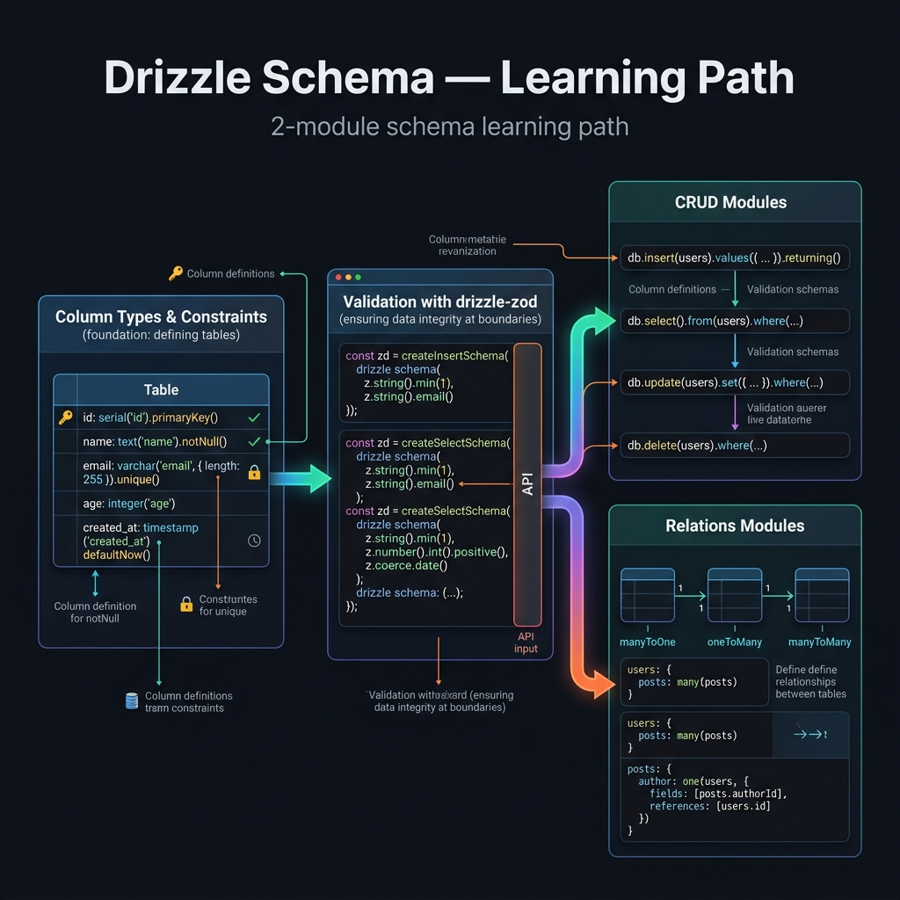

<!-- tags: overview -->
# Drizzle Schema

> Lane cho column types, constraints, validation và cách biểu diễn schema trong TypeScript.

| Aspect | Detail |
| --- | --- |
| **Concept** | Hub điều hướng cho `Drizzle Schema` |
| **Audience** | Backend engineer đang thiết kế schema với Drizzle |
| **Primary style** | Concept-First router |
| **Entry point** | Mở khi pain point nằm ở types, constraints và schema design. |

📅 Cập nhật: 2026-04-05 · ⏱️ 6 phút đọc

---

## 1. DEFINE

Hình dung `Drizzle Schema` xuất hiện ngay lúc bạn cần Drizzle không chỉ “type-safe” mà còn phải rõ boundary giữa TypeScript code và database contract.


Schema trong Drizzle không phải một file cấu hình đứng ngoài code. Nó là nơi type safety, migration và query shape chạm nhau trực tiếp.

Hub này không thay thế từng bài detail. Nó tồn tại để giúp người đọc mở đúng lane trước khi sa vào tool, syntax hoặc diagram cụ thể. Khi đọc đúng thứ tự, bạn sẽ bớt cảm giác “biết nhiều từ khóa nhưng vẫn không route được bài toán thật”.

### Signals & Boundaries

- Mở hub này khi bạn biết vấn đề nằm trong `Drizzle Schema`, nhưng chưa rõ nên đọc bài nào trước.
- Dùng coverage map để route theo pain point thay vì theo thứ tự file.
- Quay lại hub sau mỗi bài để chọn bước kế tiếp có chủ đích.

### Coverage Map

| Entry | Vai trò |
| --- | --- |
| [Drizzle Schema — Column Types & Constraints](01-schema-column-types.md) | Điểm vào cho lane `Drizzle Schema — Column Types & Constraints` |
| [Drizzle Schema Validation — drizzle-zod & drizzle-valibot](02-validation-drizzle-zod.md) | Điểm vào cho lane `Drizzle Schema Validation — drizzle-zod & drizzle-valibot` |

---

## 2. VISUAL



Định nghĩa đã khóa được phạm vi của hub. Visual dưới đây giúp route nhanh theo lane thay vì lướt một danh sách link khô.

### Level 1

```text
bắt đầu từ pain point hiện tại
  -> Drizzle Schema — Column Types & Constraints
  -> Drizzle Schema Validation — drizzle-zod & drizzle-valibot
```

*Hình: Hub này hoạt động như router, không phải catalog để lướt cho đủ.*

### Level 2

```text
đọc đúng lane -> giảm nhảy cóc giữa các bài
đọc sai lane  -> càng đọc càng thấy thuật ngữ rời rạc
```

*Hình: Giá trị thật của README dạng router là giữ người đọc đi đúng đường ngay từ đầu.*

---

## 3. CODE

Sơ đồ đã chỉ ra nhịp điều hướng. Artifact dưới đây biến hub thành một worksheet ngắn để team hoặc người học tự chọn đúng cửa vào.

### Problem 1: Basic — Route lane trước khi đọc sâu

> **Mục tiêu**: Không để việc học hoặc review trượt thành “mở bài nào cũng được”.
> **Approach**: Chọn lane theo pain point đang có.
> **Ví dụ**: Chọn đúng cụm cần đọc trong `Drizzle Schema`.
> **Độ phức tạp**: Basic

```yaml
router:
  module: Drizzle Schema
  rule: "chọn lane theo pain point, không theo tên nghe quen"
  suggested_path:
  - 01-schema-column-types.md
  - 02-validation-drizzle-zod.md
```

Artifact này không giải bài toán thay người đọc; nó chỉ cắt bớt những lane sai trước khi thời gian bị đốt vào các bài không phục vụ đúng mục tiêu.

---

## 4. PITFALLS

Khi hub/router bị dùng sai, người đọc vẫn có thể đọc được từng bài nhưng tổng thể sẽ rơi vào trạng thái hiểu rời rạc.

| # | Severity | Lỗi | Hậu quả | Fix |
| --- | --- | --- | --- | --- |
| 1 | 🔴 Fatal | Đọc theo thứ tự file mà không route theo pain point | Tích lũy thuật ngữ nhưng không giải quyết đúng vấn đề | Dùng coverage map trước khi mở bài detail |
| 2 | 🟡 Common | Xem README như catalog thuần link | Mất vai trò điều hướng của hub | Luôn hỏi “mình đang đau ở lane nào?” |
| 3 | 🔵 Minor | Đọc xong không quay lại hub | Bị nhảy sang bài lân cận theo cảm tính | Quay lại README để chọn bước kế tiếp |

---

## 5. REF

| Resource | Loại | Link | Ghi chú |
| --- | --- | --- | --- |
| Drizzle Schema — Column Types & Constraints | Internal | [Drizzle Schema — Column Types & Constraints](01-schema-column-types.md) | Entry point liên quan trực tiếp |
| Drizzle Schema Validation — drizzle-zod & drizzle-valibot | Internal | [Drizzle Schema Validation — drizzle-zod & drizzle-valibot](02-validation-drizzle-zod.md) | Entry point liên quan trực tiếp |

---

## 6. RECOMMEND

Khi đã biết mình đang đứng ở lane nào, bước tiếp theo là mở đúng bài đầu của lane đó thay vì học lan man thêm một topic mới.

| Mở rộng | Khi nào | Lý do | File/Link |
| --- | --- | --- | --- |
| Drizzle Schema — Column Types & Constraints | Khi pain point khớp lane này | Đi tiếp đúng cụm thay vì đọc rời | [Drizzle Schema — Column Types & Constraints](01-schema-column-types.md) |
| Drizzle Schema Validation — drizzle-zod & drizzle-valibot | Khi pain point khớp lane này | Đi tiếp đúng cụm thay vì đọc rời | [Drizzle Schema Validation — drizzle-zod & drizzle-valibot](02-validation-drizzle-zod.md) |
