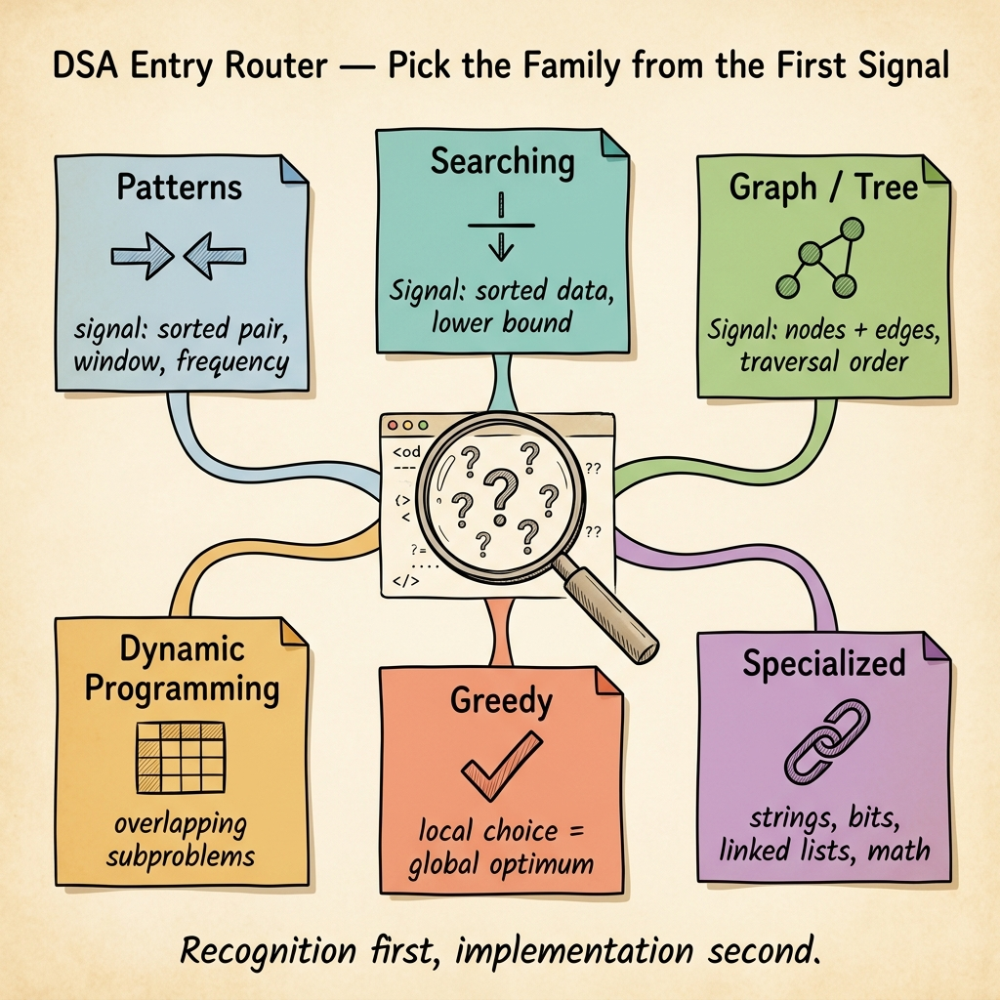

<!-- tags: dsa, algorithms, overview, learning-path -->
# DSA — Data Structures & Algorithms

> This track is not organized as a solution manual. It operates as a router: observe the problem's signals, choose the correct family, lock the invariant, and only then proceed to implementation.

📅 Created: 2026-04-04 · 🔄 Updated: 2026-04-10 · ⏱️ 8 min read

| Aspect | Detail |
| ------ | ------ |
| **Audience** | Individuals preparing for interviews or rebuilding their DSA foundation with a pattern-first approach |
| **Goal** | Move from problem recognition to writing code with a proof sketch, trace, and boundary awareness |
| **Best entry** | Start at `patterns/` if you are unsure which family the problem belongs to; jump straight into a specific module if you already recognize the domain |

---

## 1. DEFINE

Imagine you have just opened a new problem, and within the first 30 seconds, three parallel approaches emerge in your mind. The value of this hub does not lie in repeating algorithms; it forces you to answer an earlier, more critical question: what signals is the problem emitting, and which family do those signals belong to?

You rarely fail DSA because you do not know how to write code. You fail in the first 10 minutes: choosing the wrong pattern, mistaking the invariant, or optimizing at the wrong layer. Therefore, this root hub does not ask "how many problems do you know?"; it asks "which lane should you enter first to avoid wasting half an hour on the wrong path?".

The correct way to read `assets/dsa` is:
- recognition cue first
- invariant or state model second
- representative problem next
- and finally implementation

The table below remains a module map, but it only holds value when read as a router, not as an alphabetical list of algorithms to memorize.

### Module Map
| Module | When to enter | Recognition Signals | Link |
| --- | --- | --- | --- |
| Patterns | You just read the problem and are unsure of the family | sorted array, window, pair, frequency, monotonic | [patterns/README.md](./patterns/README.md) |
| Searching | Locating a position, boundary, or answer space | sorted data, predicate changing from false to true | [searching/README.md](./searching/README.md) |
| Sorting | Need to understand order transformation or stable vs unstable | comparing how data shifts through each pass | [sorting/README.md](./sorting/README.md) |
| Linked Lists | Problem revolves around pointer rewiring | head/tail edge case, predecessor, dummy node | [linked-lists/README.md](./linked-lists/README.md) |
| Bit Manipulation | Need bit-level optimization | XOR, mask, parity, popcount | [bit-manipulation/README.md](./bit-manipulation/README.md) |
| Math & Geometry | Problem thrives on formulas or normalization | gcd, slope, recurrence, wrap-around | [math-geometry/README.md](./math-geometry/README.md) |
| Graph | State consists of nodes and edges | reachability, shortest path, MST, DAG order | [graph/README.md](./graph/README.md) |
| Tree Algorithms | State is parent-child nodes or range aggregation | traversal order, heap property, segment merge | [tree-algorithms/README.md](./tree-algorithms/README.md) |
| String Algorithms | String is the primary structure | substring, prefix, automaton, trie, rolling hash | [string-algorithms/README.md](./string-algorithms/README.md) |
| Dynamic Programming | Has overlapping subproblems and optimal substructure | smaller state builds up to a larger state | [dynamic-programming/README.md](./dynamic-programming/README.md) |
| Greedy | Local choice can maintain the global invariant | reachability, interval cover, best-so-far | [greedy/README.md](./greedy/README.md) |
| Important Algorithms | Need classic patterns outside basic lanes | DSU, KMP, Rabin-Karp, A*, backtracking | [important-algorithms/README.md](./important-algorithms/README.md) |

## 2. VISUAL

If you are unsure which file to open first, use this router as the initial scanning layer. It does not replace detailed reading; it merely prevents you from failing at the family selection step.

*Image: This root hub does not enforce a fixed learning order. It guides you into the correct lane the moment the problem reveals its first signal.*

Read the image this way:
- the strongest signal of the problem determines the first lane
- the first lane is not necessarily the final lane
- if you cannot identify the family, enter `patterns/` first to lock the recognition cue

## 3. CODE

This is not a module containing direct code. Instead, use the reading sequence below as "pseudo-code" for learning: recognition, invariant proof, and then implementation.

| Step | Action | Verification Point | Proceed To |
| --- | --- | --- | --- |
| 1 | Open `patterns/` or the module closest to the problem's signal | You can articulate why this pattern fits better than 2 other choices | Representative problem in that module |
| 2 | Read `DEFINE` and `VISUAL` first | You can describe the invariant before even looking at the code | `CODE` of the first problem |
| 3 | Rewrite the basic solution from memory | You no longer depend on the original snippet | Intermediate / advanced example in the same file |
| 4 | Compare with the adjacent pattern in `RECOMMEND` | You can distinguish when the current pattern breaks | A more suitable adjacent module |

## 4. PITFALLS

The tricky part of DSA rarely lies in the algorithm's name. It lies in the representation, boundaries, and the promises you thought you kept but actually dropped halfway through.

| Pitfall | Symptoms | Why it fails | Fix | Severity |
| ------- | -------- | ---------- | -------- | -------- |
| Reading alphabetically | Opening a file just because the name sounds familiar | You accumulate isolated algorithms without a router in your head | Start from problem signals, then select the module | high |
| Jumping straight into code | Memorizing snippets but failing to explain why they work | Failing to lock the invariant leads to breaking on variants | Read `DEFINE` and trace `VISUAL` before coding | high |
| Using DP for every optimization problem | Seeing "optimization" immediately triggers a state table | Some problems only need greedy or binary search on answer | Ask yourself if the local invariant is strong enough | medium |
| Confusing pattern and structure | Trying to map a linked list problem to an array mindset | State transitions break right at the data model | Choose the module based on data structure before choosing optimization | medium |

## 5. REF

- CP-Algorithms index: [CP-Algorithms](https://cp-algorithms.com/)
- Best practice with visualizer [DSA Animator](https://dsaanimator.com/DSA_Navigator.html)
- VisuAlgo: [VisuAlgo](https://visualgo.net/en)
- Open Data Structures: [Open Data Structures](https://opendatastructures.org/)

## 6. RECOMMEND

After the root hub helps you choose the right entry point, the next step is to dive deep according to the exact tension of each family.

- If you are confused by an array/string problem: go to [patterns/README.md](./patterns/README.md).
- If the question revolves around boundaries, lower bounds, or answer feasibility: go to [searching/README.md](./searching/README.md).
- If you already know the problem involves node-edge or traversal order: go to [graph/README.md](./graph/README.md) or [tree-algorithms/README.md](./tree-algorithms/README.md).
- If you see a brute force approach overlapping subproblems: go to [dynamic-programming/README.md](./dynamic-programming/README.md).
- If the problem seems solvable via local choices but you have yet to prove why: go to [greedy/README.md](./greedy/README.md).

## 7. QUICK REF

- Recognition first, implementation second.
- The invariant is the shortest sentence proving why the next step does not break the solution.
- Unsure which module? Start at `patterns/`, then use `RECOMMEND` to navigate further.