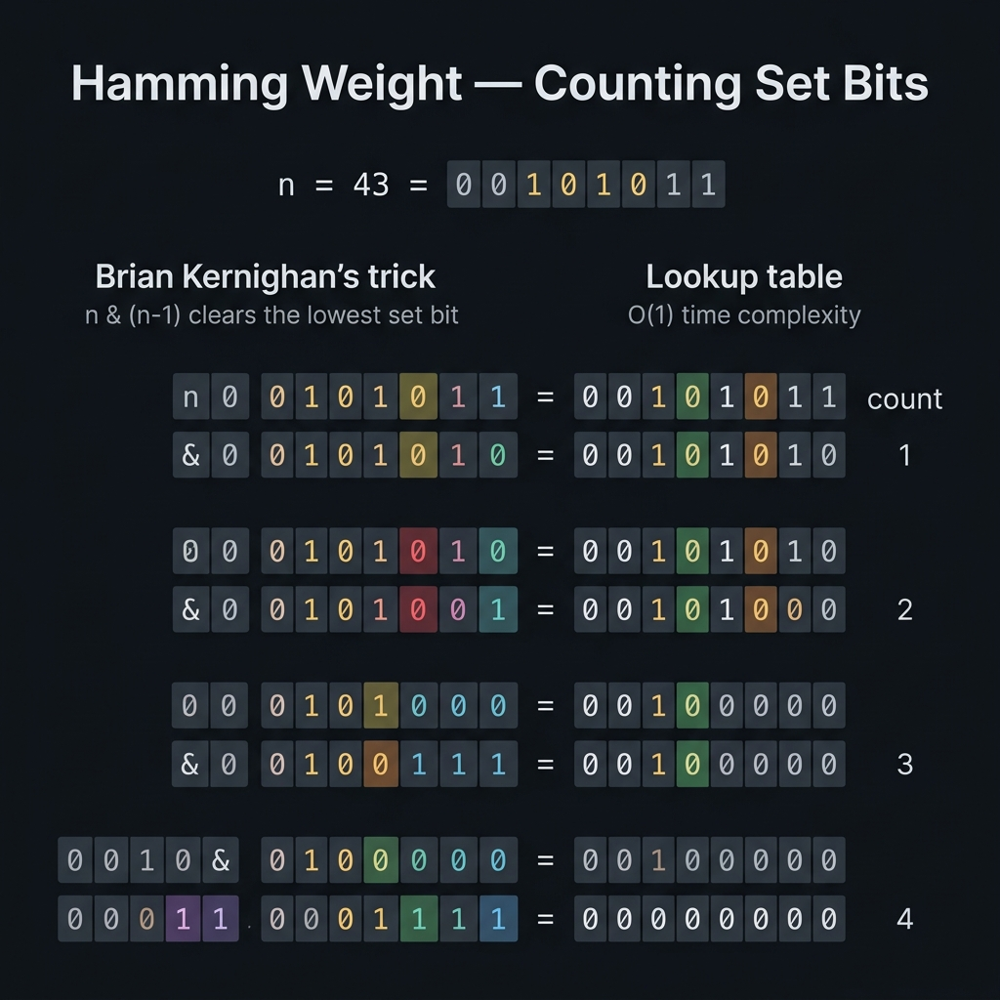

<!-- tags: dsa, algorithms -->
# ⚖️ Hamming Weight

> Counting `1` bits in binary representation is the gateway to understanding `n & (n - 1)` and popcount algorithms.

📅 Date created: 2026-03-31 · 🔄 Updated: 2026-03-31 · ⏱️ 16 min read

| Aspect | Detail |
| ------ | ------ |
| **Complexity** | O(k) with set bits / O(1) extra space |
| **Use case** | Bit counting, popcount, low-level optimization reasoning |
| **Related** | Bit Manipulation, Brian Kernighan, Binary representation |

---

## 1. DEFINE

<!-- [Beginner layer] -->

You receive a 32-bit integer and the problem asks how many `1` bits exist in its binary representation. The first instinct is to shift right and add `n & 1`. That approach works, but it hides a more interesting truth. You can run the loop exactly as many times as the number of set bits instead of the full word size.

`Hamming Weight` is the gateway to bit-level thinking. It forces you to view an integer not as a solid value, but as a set of flags. Once you see this, `n & (n - 1)` is no longer a rote trick. It becomes a specific invariant: each loop iteration removes exactly the lowest set bit.

Core insight: **If each loop eliminates exactly one set bit, the runtime scales with the actual active bits, not the total possible bits**.

| Variant | When to use | Main Idea |
| ------- | -------- | ------- |
| Naive scan | When optimization is not needed or for an easy baseline trace | Shift right one bit at a time and add `n & 1` |
| Brian Kernighan | When you want to run exactly the number of `1` bits | Each loop removes the lowest set bit |
| Built-in popcount | When production code prioritizes language intrinsics | Leverage built-in primitives but understand the invariant |

| Approach | Time | Space | When to choose |
| -------- | ---- | ----- | -------- |
| Naive scan | O(word size) | O(1) | Baseline to see bits one by one |
| Brian Kernighan | O(number of set bits) | O(1) | Clean interview answer with a clear proof |
| Built-in popcount | Depends on runtime/intrinsic | O(1) | Production code when semantics are clear |

### 1.1 Quick Recognition

- The prompt mentions `number of 1 bits`, `popcount`, or `Hamming weight`.
- You need to count active bits without knowing their exact positions.
- This is often a starting primitive for bitmaps, subset masks, and parity checks.

### 1.2 Invariants & Failure Modes

- After each `n = n & (n - 1)` loop, the number of set bits decreases by exactly 1.
- The loop stops naturally at `n == 0` because no set bits remain.
- Common failure mode: describing the formula as a "bit trick" without explaining why `n - 1` flips the exact required binary suffix.

## 2. VISUAL

Bit tricks only become easy when you can see which bit lane changes. This trace clarifies that action on concrete data.



### Level 1 — Core intuition

```text
n = 13 = 1101
1101 & 1100 = 1100   (remove lowest 1)
1100 & 1011 = 1000   (remove next 1)
1000 & 0111 = 0000   (done)
=> count = 3
```

*Caption*: ⚖️ Hamming Weight at Level 1 shows the core intuition. Level 2 explains the state updates from input to answer.

### Level 2 — Detailed trace

```text
Input: n = 13 = 1101

Round 1:
  current = 1101
  current - 1 = 1100
  current & (current - 1) = 1100
  removed lowest set bit at position 0
  count = 1

Round 2:
  current = 1100
  current - 1 = 1011
  current & (current - 1) = 1000
  removed lowest set bit at position 2
  count = 2

Round 3:
  current = 1000
  current - 1 = 0111
  current & (current - 1) = 0000
  removed lowest set bit at position 3
  count = 3

Stop:
  current = 0000
  no more set bits to remove
```

*Caption*: Level 2 illustrates the key Brian Kernighan invariant. Each loop removes exactly the lowest set bit, so the iterations equal the bit count.

## 3. CODE

Once you visualize the bit lanes, the code stops looking like magic. We start with the most explainable version before moving to powerful variants.

### Problem 1: Basic — Core Pattern

> **Goal**: Count `1` bits using both a naive baseline and the Brian Kernighan trick. This shows why popcount optimizes sparse inputs.
> **Approach**: Use `n & (n - 1)` to eliminate the lowest set bit in each loop iteration.
> **Example**: `hammingWeight(13) → 3`

```go
// hamming_weight.go — Hamming Weight: Brian Kernighan + naive baseline
package bitmanip

func HammingWeight(n uint32) int {
    count := 0
    for n != 0 {
        n &= n - 1
        count++
    }
    return count
}

func HammingWeightNaive(n uint32) int {
    count := 0
    for n > 0 {
        count += int(n & 1)
        n >>= 1
    }
    return count
}
```

```typescript
// hamming-weight.ts — Hamming Weight: Brian Kernighan + naive baseline
export function hammingWeight(n: number): number {
  let value = n >>> 0;
  let count = 0;
  while (value !== 0) {
    value &= value - 1;
    count++;
  }
  return count;
}
```

```rust
// hamming_weight.rs — Hamming Weight using Brian Kernighan loop
pub fn hamming_weight(mut n: u32) -> i32 {
    let mut count = 0;
    while n != 0 {
        n &= n - 1;
        count += 1;
    }
    count
}
```

```cpp
// hamming_weight.cpp — Hamming Weight using Brian Kernighan loop
int hammingWeight(unsigned int n) {
    int count = 0;
    while (n != 0) {
        n &= (n - 1);
        ++count;
    }
    return count;
}
```

```python
# hamming_weight.py — Hamming Weight using Brian Kernighan loop
def hamming_weight(n: int) -> int:
    count = 0
    while n:
        n &= n - 1
        count += 1
    return count
```

```java
// HammingWeight.java — Hamming Weight using Brian Kernighan loop
public final class HammingWeight {
    private HammingWeight() {}

    public static int hammingWeight(int n) {
        int count = 0;
        while (n != 0) {
            n &= (n - 1);
            count++;
        }
        return count;
    }
}
```

> **Why?** At `n - 1`, the lowest `1` bit of `n` flips to `0`. All `0` bits below it flip to `1`. When you apply AND with `n`, the upper prefix stays intact. The lowest `1` bit is deleted, and lower bits reset to `0`. This reduces the set bit count by exactly one per loop.

> **Conclusion**: This basic version forms the primitive foundation of bit manipulation. When readers truly understand how `n & (n - 1)` deletes the lowest bit, they easily grasp subsequent popcount, subset DP, or bitmap topics.

### Problem 2: Intermediate — Counting Bits DP

> **Goal**: Expand from counting bits of a single number to computing the count for the entire range `0..n`.
> **Approach**: Use the rule `bits[i] = bits[i >> 1] + (i & 1)` to reuse previous results.
> **Example**: `countBits(5) → [0,1,1,2,1,2]`
> **Complexity**: O(n) time, O(n) space

```go
// counting_bits.go — Counting Bits: DP built from the Hamming weight recurrence
func CountBits(n int) []int {
    result := make([]int, n+1)
    for value := 1; value <= n; value++ {
        // Shift right removes the last bit; `(value & 1)` tells whether we add one more set bit.
        result[value] = result[value>>1] + (value & 1)
    }
    return result
}
```

```typescript
// counting-bits.ts — Counting Bits: DP from half-value recurrence
export function countBits(n: number): number[] {
  const result = Array(n + 1).fill(0);
  for (let value = 1; value <= n; value++) {
    result[value] = result[value >> 1] + (value & 1);
  }
  return result;
}
```
```rust
// counting_bits.rs — Counting Bits: DP from half-value recurrence
pub fn count_bits(n: usize) -> Vec<i32> {
    let mut result = vec![0; n + 1];
    for value in 1..=n {
        result[value] = result[value >> 1] + (value as i32 & 1);
    }
    result
}
```
```cpp
// counting_bits.cpp — Counting Bits: DP from half-value recurrence
std::vector<int> countBits(int n) {
    std::vector<int> result(n + 1, 0);
    for (int value = 1; value <= n; ++value) {
        result[value] = result[value >> 1] + (value & 1);
    }
    return result;
}
```
```python
# counting_bits.py — Counting Bits: DP from half-value recurrence
def count_bits(n: int) -> list[int]:
    result = [0] * (n + 1)
    for value in range(1, n + 1):
        result[value] = result[value >> 1] + (value & 1)
    return result
```
```java
// CountingBits.java — Counting Bits: DP from half-value recurrence
public static int[] countBits(int n) {
    int[] result = new int[n + 1];
    for (int value = 1; value <= n; value++) {
        result[value] = result[value >> 1] + (value & 1);
    }
    return result;
}
```

> **Why?** The operation `value >> 1` drops the last bit of `value`. Thus, `result[value >> 1]` already holds the popcount of the entire prefix. The final bit only has two states. If `0`, it adds nothing. If `1`, it adds exactly one bit. This makes the recurrence linear.

> **Conclusion**: This is a very natural transition from counting bits for one number to building a popcount table for a value domain. It appears frequently in subset DP.

### Problem 3: Advanced — Count Set Bits Across A Bitmap

> **Goal**: Bring the popcount technique into a production-like use case. Count total set bits across a large bitmap stored as 64-bit words.
> **Approach**: Loop over each word and use Brian Kernighan to count only the present set bits.
> **Example**: `countBitmap([]uint64{0b1011, 0b1000}) → 4`
> **Complexity**: O(total set bits) time, O(1) extra space

```go
// bitmap_popcount.go — Bitmap popcount: aggregate set bits across many machine words
func CountBitmap(words []uint64) int {
    total := 0
    for _, word := range words {
        current := word
        for current != 0 {
            current &= current - 1 // Drop the lowest set bit in the current machine word.
            total++
        }
    }
    return total
}
```

```typescript
// bitmap-popcount.ts — Bitmap popcount across multiple machine words
export function countBitmap(words: bigint[]): number {
  let total = 0;
  for (let word of words) {
    while (word !== 0n) {
      word &= word - 1n;
      total++;
    }
  }
  return total;
}
```
```rust
// bitmap_popcount.rs — Bitmap popcount across multiple machine words
pub fn count_bitmap(words: &[u64]) -> i32 {
    let mut total = 0;
    for &word in words {
        let mut current = word;
        while current != 0 {
            current &= current - 1;
            total += 1;
        }
    }
    total
}
```
```cpp
// bitmap_popcount.cpp — Bitmap popcount across multiple machine words
int countBitmap(const std::vector<unsigned long long>& words) {
    int total = 0;
    for (auto word : words) {
        while (word != 0) {
            word &= (word - 1);
            ++total;
        }
    }
    return total;
}
```
```python
# bitmap_popcount.py — Bitmap popcount across multiple machine words
def count_bitmap(words: list[int]) -> int:
    total = 0
    for word in words:
        current = word
        while current:
            current &= current - 1
            total += 1
    return total
```
```java
// BitmapPopcount.java — Bitmap popcount across multiple machine words
public static int countBitmap(long[] words) {
    int total = 0;
    for (long word : words) {
        long current = word;
        while (current != 0) {
            current &= (current - 1);
            total++;
        }
    }
    return total;
}
```

> **Why?** If the bitmap is very sparse, scanning every bit sequentially wastes processing cycles. Brian Kernighan on each `uint64` visits only the active set bits. The total runtime scales with `total set bits`, not `words * word-size`. This differentiates bitset reasoning from a brute-force bit scan.

> **Conclusion**: When moving from interview toy problems to real bitmaps, the core `n & (n - 1)` trick remains fully valuable.

## 4. PITFALLS

At this point, the syntax is no longer the most error-prone part. Unspoken assumptions and vague representations cause most failures here.

| # | Severity | Error | Consequence | Fix |
|---|-----|---------|-----| ----|
| 1 | 🔴 Fatal | Confusing O(32) with absolute O(k) | Inaccurate complexity explanation | Distinguish complexity between word size and set bits |
| 2 | 🟡 Common | Careless signed shifts | Incorrect results with negative numbers in some languages | Force unsigned or 32-bit clearly during interviews |
| 3 | 🟡 Common | Knowing the trick without understanding it | Stumbling when asked a follow-up | Always trace a binary example manually |

## 5. REF

| Resource | Link |
| -------- | ---- |
| LeetCode 191 — Number of 1 Bits | https://leetcode.com/problems/number-of-1-bits/ |
| Hacker’s Delight — Bit tricks | https://www.hackersdelight.org/ |

## 6. RECOMMEND

Once you lock in a bit pattern, you must know how to expand it into state compression, counting, or better representations.

| Extension | When to use | Reason |
| ------- | ------- | ----- |
| Counting Bits | When needing popcount for the range 0..n | DP relies on this primitive |
| Power of Two | When checking a single bit | Also uses `n & (n - 1)` |
| Single Number | When transitioning to the XOR family | Naturally shifts to the lonely integer problem |

---

**Links**: ← Previous · [→ Next](./02-lonely-integer.md)

## 7. QUICK REF

| # | Recognition Signal | Action Template |
|---|--------------------|--------------------|
| 1 | Input has clear invariants or reusable state | Write the state first, then select traversal logic |
| 2 | Brute-force repeats the same decision | Reduce the search space or cache subproblems |
| 3 | The problem involves many edge cases | Move boundary conditions into the main flow early |