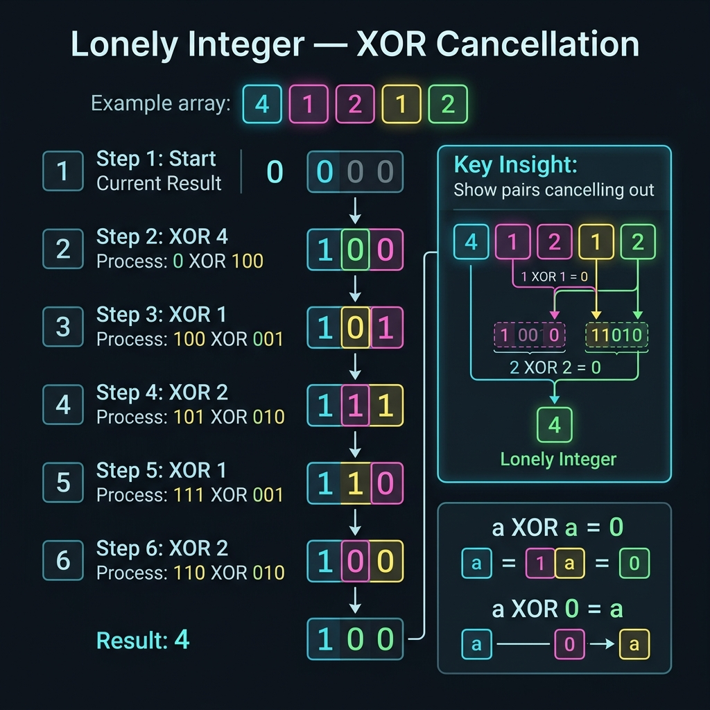

<!-- tags: dsa, algorithms -->
# 🧩 Lonely Integer

> The classic XOR problem: paired elements cancel each other, leaving only the solitary element.

📅 Date created: 2026-03-31 · 🔄 Updated: 2026-03-31 · ⏱️ 16 min read

| Aspect | Detail |
| ------ | ------ |
| **Complexity** | O(n) time / O(1) extra space |
| **Use case** | Single number, XOR cancellation, parity reasoning |
| **Related** | Bit Manipulation, XOR, Hash Map alternative |

---

## 1. DEFINE

<!-- [Beginner layer] -->

You have an array where every number appears in pairs except for one lonely number. A frequency hash map is the natural entry point. However, it exposes a harder question. If you only need the remaining parity, can you solve it without storing the appearance history?

`Lonely Integer` turns XOR from an obscure operator into a real reasoning language. Since `a ^ a = 0` and `a ^ 0 = a`, every identical pair cancels itself out. The accumulator holds the exact element that failed to find a pair to disappear with.

Core insight: **XOR does not count frequencies; it preserves the parity residue after all pairs self-destruct**.

| Variant | When to use | Main Idea |
| ------- | -------- | ------- |
| Hash map counting | When seeking the most readable baseline | Count frequencies and find the odd count key |
| XOR cancellation | When all other elements appear exactly twice | Leverage the self-canceling property of XOR |
| Bit counting by position | When other elements appear three or k times | XOR alone cannot solve this variant |

| Approach | Time | Space | When to choose |
| -------- | ---- | ----- | -------- |
| Hash map | O(n) | O(n) | Fast baseline that is easy to explain |
| XOR accumulator | O(n) | O(1) | Standard answer when paired conditions are guaranteed |
| Bit counting | O(word size * n) | O(1) | Extends to elements appearing three or k times |

### 1.1 Quick Recognition

- The prompt mentions `single number`, `lonely integer`, or `every element appears twice except one`.
- You need to find exactly one odd element out among pairs.
- Input order does not matter because XOR is commutative and associative.

### 1.2 Invariants & Failure Modes

- After scanning to position `i`, the accumulator holds the XOR sum of the entire prefix.
- If non-target elements appear exactly twice, all pairs in the prefix vanish from the accumulator.
- Common failure mode: forgetting the prerequisites and blindly applying XOR to the three-time appearance variant.

## 2. VISUAL

Bit tricks only become easy when you can see which bit lane changes. This trace clarifies that action on concrete data.



### Level 1 — Core intuition

```text
nums = [4, 1, 2, 1, 2]
start = 0
0 ^ 4 = 4
4 ^ 1 = 5
5 ^ 2 = 7
7 ^ 1 = 6
6 ^ 2 = 4
=> lonely integer = 4
```

*Caption*: 🧩 Lonely Integer at Level 1 shows the core intuition. Level 2 explains the state updates from input to answer.

### Level 2 — Detailed trace

```text
nums = [4, 1, 2, 1, 2]

acc = 0000

read 4  -> acc = 0000 ^ 0100 = 0100
read 1  -> acc = 0100 ^ 0001 = 0101
read 2  -> acc = 0101 ^ 0010 = 0111
read 1  -> acc = 0111 ^ 0001 = 0110
read 2  -> acc = 0110 ^ 0010 = 0100

final acc = 0100 = 4
```

*Caption*: Level 2 demonstrates that the XOR accumulator does not store frequency. It stores the leftover parity after identical pairs cancel out.

## 3. CODE

Once you visualize the bit lanes, the code stops looking like magic. We start with the most explainable version before moving to powerful variants.

### Problem 1: Basic — Core Pattern

> **Goal**: Find the single element when all other elements appear in pairs.
> **Approach**: Push the entire array through an XOR accumulator; identical pairs self-cancel.
> **Example**: `lonelyInteger([4,1,2,1,2]) → 4`

```go
// lonely_integer.go — Lonely Integer: XOR cancels paired values
package bitmanip

func LonelyInteger(nums []int) int {
    value := 0
    for _, num := range nums {
        value ^= num
    }
    return value
}
```

```typescript
// lonely-integer.ts — Lonely Integer: XOR cancels paired values
export function lonelyInteger(nums: number[]): number {
  return nums.reduce((acc, num) => acc ^ num, 0);
}
```

```rust
// lonely_integer.rs — Lonely Integer: XOR cancels paired values
pub fn lonely_integer(nums: &[i32]) -> i32 {
    nums.iter().fold(0, |acc, value| acc ^ value)
}
```

```cpp
// lonely_integer.cpp — Lonely Integer: XOR cancels paired values
int lonelyInteger(const std::vector<int>& nums) {
    int value = 0;
    for (int num : nums) value ^= num;
    return value;
}
```

```python
# lonely_integer.py — Lonely Integer: XOR cancels paired values
def lonely_integer(nums: list[int]) -> int:
    value = 0
    for num in nums:
        value ^= num
    return value
```

```java
// LonelyInteger.java — Lonely Integer: XOR cancels paired values
public final class LonelyInteger {
    private LonelyInteger() {}

    public static int lonelyInteger(int[] nums) {
        int value = 0;
        for (int num : nums) value ^= num;
        return value;
    }
}
```

> **Why?** XOR has two properties that collapse this problem to O(1) memory. First, `a ^ a = 0`. Second, XOR is both commutative and associative. This means identical pairs vanish regardless of their order, and the final accumulator holds the element with no symmetric partner.

> **Conclusion**: XOR-based cancellation is a more critical mental model than the specific solution. Once you understand why identical pairs vanish, you will quickly recognize related single-number variants.

### Problem 2: Intermediate — Two Unique Numbers

> **Goal**: Upgrade from one single number to two single numbers in an array where others appear twice.
> **Approach**: XOR the array to get `a ^ b`, split by a differing low bit, then XOR each group.
> **Example**: `singleNumbers([1,2,1,3,2,5]) → [3,5]`
> **Complexity**: O(n) time, O(1) extra space

```go
// two_single_numbers.go — XOR partition: isolate two non-duplicated numbers
func TwoSingleNumbers(nums []int) (int, int) {
    xorAll := 0
    for _, num := range nums {
        xorAll ^= num
    }

    lowbit := xorAll & -xorAll
    first, second := 0, 0
    for _, num := range nums {
        if num&lowbit == 0 {
            first ^= num
        } else {
            second ^= num
        }
    }
    return first, second
}
```

```typescript
// two-unique-numbers.ts — Split by distinguishing bit to recover two uniques
export function twoSingleNumbers(nums: number[]): [number, number] {
  let xorAll = 0;
  for (const value of nums) xorAll ^= value;
  const mask = xorAll & -xorAll;
  let first = 0, second = 0;
  for (const value of nums) {
    if (value & mask) first ^= value;
    else second ^= value;
  }
  return [first, second];
}
```
```rust
// two_unique_numbers.rs — Split by distinguishing bit to recover two uniques
pub fn two_single_numbers(nums: &[i32]) -> (i32, i32) {
    let xor_all = nums.iter().fold(0, |acc, &v| acc ^ v);
    let mask = xor_all & -xor_all;
    let (mut first, mut second) = (0, 0);
    for &value in nums {
        if value & mask != 0 { first ^= value; } else { second ^= value; }
    }
    (first, second)
}
```
```cpp
// two_unique_numbers.cpp — Split by distinguishing bit to recover two uniques
std::pair<int, int> twoSingleNumbers(const std::vector<int>& nums) {
    int xorAll = 0;
    for (int value : nums) xorAll ^= value;
    int mask = xorAll & -xorAll;
    int first = 0, second = 0;
    for (int value : nums) {
        if (value & mask) first ^= value;
        else second ^= value;
    }
    return {first, second};
}
```
```python
# two_unique_numbers.py — Split by distinguishing bit to recover two uniques
def two_single_numbers(nums: list[int]) -> tuple[int, int]:
    xor_all = 0
    for value in nums:
        xor_all ^= value
    mask = xor_all & -xor_all
    first = second = 0
    for value in nums:
        if value & mask:
            first ^= value
        else:
            second ^= value
    return first, second
```
```java
// TwoUniqueNumbers.java — Split by distinguishing bit to recover two uniques
public static int[] twoSingleNumbers(int[] nums) {
    int xorAll = 0;
    for (int value : nums) xorAll ^= value;
    int mask = xorAll & -xorAll;
    int first = 0, second = 0;
    for (int value : nums) {
        if ((value & mask) != 0) first ^= value;
        else second ^= value;
    }
    return new int[]{first, second};
}
```

> **Why?** After applying XOR to the whole array, `xorAll = a ^ b` definitely contains at least one set bit because `a != b`. The low bit `xorAll & -xorAll` extracts one specific position where `a` and `b` differ. You split the array into two groups using this bit. Each group reduces to the basic lonely integer problem.

> **Conclusion**: The most natural follow-up to the basic lonely integer is finding two single numbers. Low-bit partitioning is the crucial technique here.

### Problem 3: Advanced — Single Number II (Every Other Appears Three Times)

> **Goal**: Move past simple XOR symmetry to handle arrays where one element appears once and others appear three times.
> **Approach**: Count bits column by column and apply modulo 3. Bits leaving a remainder of 1 belong to the target.
> **Example**: `singleNumberII([2,2,3,2]) → 3`
> **Complexity**: O(32·n) time, O(1) extra space

```go
// single_number_ii.go — Bit counting modulo 3: rebuild the unique number bit by bit
func SingleNumberII(nums []int) int {
    result := 0
    for bit := 0; bit < 32; bit++ {
        count := 0
        for _, num := range nums {
            if (num>>bit)&1 == 1 {
                count++
            }
        }
        if count%3 != 0 {
            result |= 1 << bit
        }
    }
    return result
}
```

```typescript
// single-number-ii.ts — Bit counting modulo 3
export function singleNumberII(nums: number[]): number {
  let ones = 0, twos = 0;
  for (const value of nums) {
    ones = (ones ^ value) & ~twos;
    twos = (twos ^ value) & ~ones;
  }
  return ones;
}
```
```rust
// single_number_ii.rs — Bit counting modulo 3
pub fn single_number_ii(nums: &[i32]) -> i32 {
    let (mut ones, mut twos) = (0, 0);
    for &value in nums {
        ones = (ones ^ value) & !twos;
        twos = (twos ^ value) & !ones;
    }
    ones
}
```
```cpp
// single_number_ii.cpp — Bit counting modulo 3
int singleNumberII(const std::vector<int>& nums) {
    int ones = 0, twos = 0;
    for (int value : nums) {
        ones = (ones ^ value) & ~twos;
        twos = (twos ^ value) & ~ones;
    }
    return ones;
}
```
```python
# single_number_ii.py — Bit counting modulo 3
def single_number_ii(nums: list[int]) -> int:
    ones = twos = 0
    for value in nums:
        ones = (ones ^ value) & ~twos
        twos = (twos ^ value) & ~ones
    return ones
```
```java
// SingleNumberII.java — Bit counting modulo 3
public static int singleNumberII(int[] nums) {
    int ones = 0, twos = 0;
    for (int value : nums) {
        ones = (ones ^ value) & ~twos;
        twos = (twos ^ value) & ~ones;
    }
    return ones;
}
```

> **Why?** XOR fails when elements repeat three times because `a ^ a ^ a = a`, which does not cancel to `0`. Instead, you must analyze the array bit by bit. At each position, the total `1` bits from triple-repeated elements divides evenly by 3. The remainder `1` is the contribution of the single number.

> **Conclusion**: This example shows the power of the bit manipulation family. You can change the repetition rule from 2 to 3, 5, or k while keeping the same bit column counting logic.

## 4. PITFALLS

At this point, the syntax is no longer the most error-prone part. Unspoken assumptions and vague representations cause most failures here.

| # | Severity | Error | Consequence | Fix |
|---|-----|---------|-----| ----|
| 1 | 🔴 Fatal | Using XOR for elements appearing three times | Produces completely wrong answers | Check preconditions before selecting a trick |
| 2 | 🟡 Common | Omitting the mathematical properties of XOR | The listener doubts the correctness | State clearly that `a^a=0` and `0^a=a` |
| 3 | 🟡 Common | Confusing with "first unique" in a stream | Applies the wrong pattern | Stream problems need different data structures |

## 5. REF

| Resource | Link |
| -------- | ---- |
| LeetCode 136 — Single Number | https://leetcode.com/problems/single-number/ |
| Bitwise XOR reference | https://en.wikipedia.org/wiki/Bitwise_operation#XOR |

## 6. RECOMMEND

Once you lock in a bit pattern, you must know how to expand it into state compression, counting, or better representations.

| Extension | When to use | Reason |
| ------- | ------- | ----- |
| Single Number II | When elements repeat three times | Forces an expansion to bit counting |
| Find Missing Number | When using XOR for parity sets | Same cancellation logic pairs indices and values |
| Bitmask set operations | When solving subset compression | XOR often appears as a toggle operator |

---

**Links**: [← Previous](./01-hamming-weight.md) · [→ Next](./03-swap-odd-even-bits.md)

## 7. QUICK REF

| # | Recognition Signal | Action Template |
|---|--------------------|--------------------|
| 1 | Input has clear invariants or reusable state | Write the state first, then select traversal logic |
| 2 | Brute-force repeats the same decision | Reduce the search space or cache subproblems |
| 3 | The problem involves many edge cases | Move boundary conditions into the main flow early |