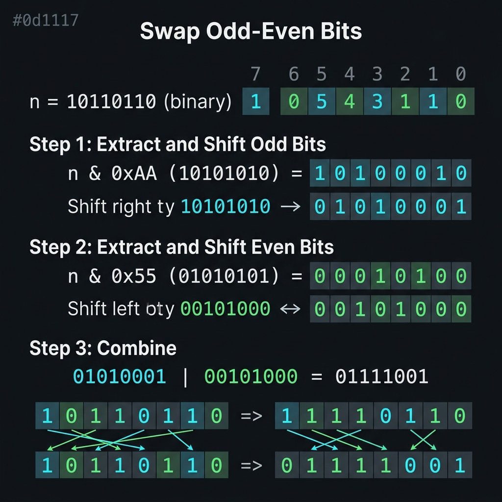

<!-- tags: dsa, algorithms -->
# 🔀 Swap Odd / Even Bits

> The classic mask-shift problem: separate two bit groups by position parity, shift them in opposite directions, and OR them back together.

📅 Date created: 2026-03-31 · 🔄 Updated: 2026-03-31 · ⏱️ 16 min read

| Aspect | Detail |
| ------ | ------ |
| **Complexity** | O(1) time / O(1) extra space |
| **Use case** | Bit masking, bit permutation, low-level interview puzzle |
| **Related** | Bit Manipulation, Masks, Shifts |

---

## 1. DEFINE

<!-- [Beginner layer] -->

The interviewer hands you an integer and asks you to swap every bit at an even position with its adjacent odd bit. Thinking about individual pairs leads you into manual operations. The right question is how to separate two interleaved bit lanes first, then move each safely.

`Swap Odd / Even Bits` is a quintessential bit manipulation problem. You do not swap bits directly by pair. You use masks to isolate two bit layers, shift them in opposite directions, and merge them. If you shift without splitting the lanes, bits overwrite each other and destroy the state.

Core insight: **To shift bits safely, you must first isolate the exact bit lane allowed to move**.

| Variant | When to use | Main Idea |
| ------- | -------- | ------- |
| Mask and shift | When swap rules strictly follow position parity | Separate groups with masks and shift in opposite directions |
| Adjacent pair swap | When you only need to swap adjacent pairs | Same intuition packaged cleanly into pairs |
| General bit permutation | When the rules expand beyond simple parity | Requires multiple masks, layers, or lookup tables |

| Approach | Time | Space | When to choose |
| -------- | ---- | ----- | -------- |
| Direct pair reasoning | O(word size) | O(1) | Useful only to build manual intuition |
| Mask + shift + OR | O(1) | O(1) | Standard answer for odd/even bit swapping |
| General permutation logic | Varies | Varies | When lane swapping becomes complex |

### 1.1 Quick Recognition

- The prompt mentions `swap odd/even bits`, `adjacent bits`, or parity swapping.
- You notice the movement rule repeats evenly across the entire word.
- Masking emerges as a mandatory step instead of an optional optimization.

### 1.2 Invariants & Failure Modes

- Every bit shifts only after isolation from the opposing lane.
- You must decide between a 0-index or 1-index convention for odd/even consistency immediately.
- Common failure mode: memorizing `0xAAAAAAAA` and `0x55555555` without explaining which lane each mask holds.

## 2. VISUAL

Bit tricks only become easy when you can see which bit lane changes. This trace clarifies that action on concrete data.



### Level 1 — Core intuition

```text
n = 1011 0110
odd mask  = 0101 0101  => 0001 0100
even mask = 1010 1010  => 1010 0010
odd << 1  = 0010 1000
even >> 1 = 0101 0001
result    = 0111 1001
```

*Caption*: 🔀 Swap Odd / Even Bits at Level 1 shows the core intuition. Level 2 explains the state updates from input to answer.

### Level 2 — Detailed trace

```text
Input:
  n        = 1011 0110
  oddMask  = 0101 0101
  evenMask = 1010 1010

Split lanes:
  oddBits  = n & oddMask  = 0001 0100
  evenBits = n & evenMask = 1010 0010

Move each lane:
  oddBits  << 1 = 0010 1000
  evenBits >> 1 = 0101 0001

Merge:
  result = 0010 1000
         | 0101 0001
         = 0111 1001
```

*Caption*: Level 2 highlights the two invariants. You must split lanes before shifting. You only shift isolated lanes to avoid bit collisions.

## 3. CODE

Once you visualize the bit lanes, the code stops looking like magic. We start with the most explainable version before moving to powerful variants.

### Problem 1: Basic — Core Pattern

> **Goal**: Swap bits at odd and even positions using bit masks and shifts in constant time.
> **Approach**: Separate bit groups using complementary masks, shift each group into the opposite lane, and apply OR.
> **Example**: `swapOddEvenBits(0b10110110) → 0b01111001`

```go
// swap_odd_even_bits.go — Swap odd/even bits via masks
package bitmanip

func SwapOddEvenBits(n uint32) uint32 {
    const evenMask uint32 = 0xAAAAAAAA
    const oddMask uint32 = 0x55555555
    even := (n & evenMask) >> 1
    odd := (n & oddMask) << 1
    return even | odd
}
```

```typescript
// swap-odd-even-bits.ts — Swap odd/even bits via masks
export function swapOddEvenBits(n: number): number {
  const evenMask = 0xAAAAAAAA >>> 0;
  const oddMask = 0x55555555 >>> 0;
  const even = (n & evenMask) >>> 1;
  const odd = (n & oddMask) << 1;
  return (even | odd) >>> 0;
}
```

```rust
// swap_odd_even_bits.rs — Swap odd/even bits via masks
pub fn swap_odd_even_bits(n: u32) -> u32 {
    let even = (n & 0xAAAAAAAA) >> 1;
    let odd = (n & 0x55555555) << 1;
    even | odd
}
```

```cpp
// swap_odd_even_bits.cpp — Swap odd/even bits via masks
unsigned int swapOddEvenBits(unsigned int n) {
    unsigned int even = (n & 0xAAAAAAAAu) >> 1;
    unsigned int odd = (n & 0x55555555u) << 1;
    return even | odd;
}
```

```python
# swap_odd_even_bits.py — Swap odd/even bits via masks
def swap_odd_even_bits(n: int) -> int:
    even = (n & 0xAAAAAAAA) >> 1
    odd = (n & 0x55555555) << 1
    return even | odd
```

```java
// SwapOddEvenBits.java — Swap odd/even bits via masks
public final class SwapOddEvenBits {
    private SwapOddEvenBits() {}

    public static int swapOddEvenBits(int n) {
        int even = (n & 0xAAAAAAAA) >>> 1;
        int odd = (n & 0x55555555) << 1;
        return even | odd;
    }
}
```

> **Why?** If you shift the entire number directly without masks, bits leak into adjacent lanes and destroy the result. The masks `0xAAAAAAAA` and `0x55555555` create two independent lanes. Once the lanes are isolated, you can shift and merge them safely.

> **Conclusion**: This problem forces readers to think in terms of masks and bit blocks rather than vague integers. That transition is vital for harder bit manipulations.

### Problem 2: Intermediate — Swap Adjacent Bit Pairs With Masks

> **Goal**: Rewrite position swapping into a classic mask-based style for a 32-bit word.
> **Approach**: Separate odd and even bits with fixed masks, shift them inversely, and apply OR.
> **Example**: `swapAdjacentPairs(0b101100) → 0b011100`
> **Complexity**: O(1) time, O(1) space

```go
// swap_adjacent_pairs.go — Swap adjacent bit pairs with odd/even masks
func SwapAdjacentPairs(n uint32) uint32 {
    const evenMask uint32 = 0x55555555 // 0101...
    const oddMask uint32 = 0xAAAAAAAA  // 1010...

    evenBits := n & evenMask
    oddBits := n & oddMask

    // Even bits move left, odd bits move right.
    return (evenBits << 1) | (oddBits >> 1)
}
```

```typescript
// swap-adjacent-bit-pairs.ts — Swap odd/even bit pairs with masks
export function swapAdjacentBitPairs(n: number): number {
  const evenMask = 0xAAAAAAAA;
  const oddMask = 0x55555555;
  const evenBits = (n & evenMask) >>> 1;
  const oddBits = (n & oddMask) << 1;
  return (evenBits | oddBits) >>> 0;
}
```
```rust
// swap_adjacent_bit_pairs.rs — Swap odd/even bit pairs with masks
pub fn swap_adjacent_bit_pairs(n: u32) -> u32 {
    let even_mask = 0xAAAA_AAAAu32;
    let odd_mask = 0x5555_5555u32;
    let even_bits = (n & even_mask) >> 1;
    let odd_bits = (n & odd_mask) << 1;
    even_bits | odd_bits
}
```
```cpp
// swap_adjacent_bit_pairs.cpp — Swap odd/even bit pairs with masks
unsigned int swapAdjacentBitPairs(unsigned int n) {
    unsigned int evenMask = 0xAAAAAAAAu;
    unsigned int oddMask = 0x55555555u;
    return ((n & evenMask) >> 1) | ((n & oddMask) << 1);
}
```
```python
# swap_adjacent_bit_pairs.py — Swap odd/even bit pairs with masks
def swap_adjacent_bit_pairs(n: int) -> int:
    even_mask = 0xAAAAAAAA
    odd_mask = 0x55555555
    return ((n & even_mask) >> 1) | ((n & odd_mask) << 1)
```
```java
// SwapAdjacentBitPairs.java — Swap odd/even bit pairs with masks
public static int swapAdjacentBitPairs(int n) {
    int evenMask = 0xAAAAAAAA;
    int oddMask = 0x55555555;
    int evenBits = (n & evenMask) >>> 1;
    int oddBits = (n & oddMask) << 1;
    return evenBits | oddBits;
}
```

> **Why?** This version highlights the "swap adjacent pair" mental model instead of just shifting left and right. The masks partition the 32-bit word completely. Each bit has exactly one destination, making the operation O(1) and easy to whiteboard.

> **Conclusion**: Once you understand why these masks work, you can apply the same technique to byte shuffles and bitboards.

### Problem 3: Advanced — Generalized Block Swap

> **Goal**: Generalize from swapping adjacent bits to swapping adjacent bit blocks of equal width.
> **Approach**: Build a mask by block size, isolate left and right blocks, shift them, and restore them.
> **Example**: `swapBitBlocks(n, offset=0, width=4)` swaps the two lowest nibbles
> **Complexity**: O(1) time, O(1) space

```go
// swap_bit_blocks.go — Swap two adjacent bit blocks of equal width
func SwapBitBlocks(n uint32, offset, width uint) uint32 {
    if width == 0 || width >= 16 {
        return n
    }

    mask := uint32((1 << width) - 1)
    left := (n >> (offset + width)) & mask
    right := (n >> offset) & mask

    // Clear both blocks before writing swapped versions back.
    cleared := n &^ (mask << offset) &^ (mask << (offset + width))
    cleared |= left << offset
    cleared |= right << (offset + width)
    return cleared
}
```

```typescript
// swap-bit-blocks.ts — Generalized block swap using masks and shifts
export function swapBitBlocks(n: number, blockSize: number): number {
  const mask = (1 << blockSize) - 1;
  let result = 0;
  for (let offset = 0; offset < 32; offset += blockSize * 2) {
    const left = (n >> offset) & mask;
    const right = (n >> (offset + blockSize)) & mask;
    result |= left << (offset + blockSize);
    result |= right << offset;
  }
  return result >>> 0;
}
```
```rust
// swap_bit_blocks.rs — Generalized block swap using masks and shifts
pub fn swap_bit_blocks(n: u32, block_size: u32) -> u32 {
    let mask = (1u32 << block_size) - 1;
    let mut result = 0u32;
    let mut offset = 0u32;
    while offset < 32 {
        let left = (n >> offset) & mask;
        let right = (n >> (offset + block_size)) & mask;
        result |= left << (offset + block_size);
        result |= right << offset;
        offset += block_size * 2;
    }
    result
}
```
```cpp
// swap_bit_blocks.cpp — Generalized block swap using masks and shifts
unsigned int swapBitBlocks(unsigned int n, int blockSize) {
    unsigned int mask = (1u << blockSize) - 1u;
    unsigned int result = 0;
    for (int offset = 0; offset < 32; offset += blockSize * 2) {
        unsigned int left = (n >> offset) & mask;
        unsigned int right = (n >> (offset + blockSize)) & mask;
        result |= left << (offset + blockSize);
        result |= right << offset;
    }
    return result;
}
```
```python
# swap_bit_blocks.py — Generalized block swap using masks and shifts
def swap_bit_blocks(n: int, block_size: int) -> int:
    mask = (1 << block_size) - 1
    result = 0
    for offset in range(0, 32, block_size * 2):
        left = (n >> offset) & mask
        right = (n >> (offset + block_size)) & mask
        result |= left << (offset + block_size)
        result |= right << offset
    return result
```
```java
// SwapBitBlocks.java — Generalized block swap using masks and shifts
public static int swapBitBlocks(int n, int blockSize) {
    int mask = (1 << blockSize) - 1;
    int result = 0;
    for (int offset = 0; offset < 32; offset += blockSize * 2) {
        int left = (n >>> offset) & mask;
        int right = (n >>> (offset + blockSize)) & mask;
        result |= left << (offset + blockSize);
        result |= right << offset;
    }
    return result;
}
```

> **Why?** Generalizing to any block width shifts focus to a three-step process. You isolate blocks, clear destinations, and write swapped blocks back. If you skip clearing, the old and new blocks will merge incorrectly. This forms the foundation for byte swaps and bitboard permutations.

> **Conclusion**: At this stage, the problem becomes a reusable primitive for bit packing and low-level transformations.

## 4. PITFALLS

At this point, the syntax is no longer the most error-prone part. Unspoken assumptions and vague representations cause most failures here.

| # | Severity | Error | Consequence | Fix |
|---|-----|---------|-----| ----|
| 1 | 🔴 Fatal | Wrong mask due to bit numbering convention | Fails on different architectures | State clearly that you use 0-indexing from the least significant bit |
| 2 | 🟡 Common | Using signed right shift with sign extension | High bits fill with ones | Prefer unsigned integers or logical shifts |
| 3 | 🟡 Common | Missing binary examples during tests | Easy to stay confidently wrong | Always trace an 8-bit example manually |

## 5. REF

| Resource | Link |
| -------- | ---- |
| GeeksForGeeks — Swap all odd and even bits | https://www.geeksforgeeks.org/swap-all-odd-and-even-bits/ |
| Hacker’s Delight — Bit permutations | https://www.hackersdelight.org/ |

## 6. RECOMMEND

Once you lock in a bit pattern, you must know how to expand it into state compression, counting, or better representations.

| Extension | When to use | Reason |
| ------- | ------- | ----- |
| Reverse Bits | When interviewers add complexity with more permutations | Belongs to the same bit permutation family |
| Bitboard / bitmap operations | When writing low-level indexing logic | Mask and shift reasoning appears constantly |
| Bit fields in protocols | When parsing binary headers | Masking is the core primitive |

---

**Links**: [← Previous](./02-lonely-integer.md) · [→ Next](./04-bit-patterns.md)

## 7. QUICK REF

| # | Recognition Signal | Action Template |
|---|--------------------|--------------------|
| 1 | Input has clear invariants or reusable state | Write the state first, then select traversal logic |
| 2 | Brute-force repeats the same decision | Reduce the search space or cache subproblems |
| 3 | The problem involves many edge cases | Move boundary conditions into the main flow early |