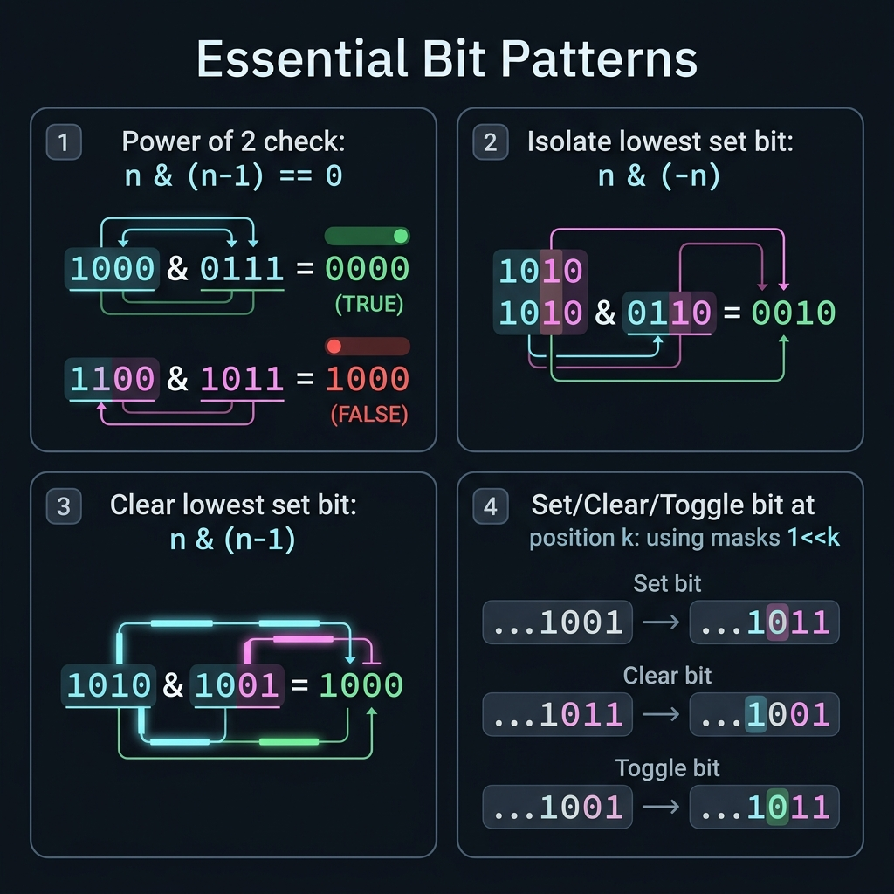

<!-- tags: dsa, algorithms -->
# 🧱 Core Bit Patterns

> A deep cheat-sheet for recurring bit tricks. It covers power-of-two, isolating the lowest set bit, and subset masking.

📅 Date created: 2026-03-31 · 🔄 Updated: 2026-03-31 · ⏱️ 16 min read

| Aspect | Detail |
| ------ | ------ |
| **Complexity** | O(1) per operation |
| **Use case** | Bit tricks toolkit, subset state compression, mask reasoning |
| **Related** | Bit Manipulation, Power-of-two, Bitmasks |

---

## 1. DEFINE

<!-- [Beginner layer] -->

Many bit manipulation problems are hard because you lack the vocabulary to read the solution. You see `n & (n - 1)` or `n & -n` as isolated formulas. This makes every new problem feel like starting over.

`Core Bit Patterns` groups recurring primitives into a shared language. It helps you recognize a power-of-two check, the lowest set bit, or subset containment. When this vocabulary becomes clear, state compression solutions shrink naturally.

Core insight: **Bit tricks stick in your memory when you view them as meaningful operations on patterns, not as magic spells**.

| Pattern | When to use | Main Idea |
| ------- | -------- | ------- |
| Power-of-two check | When you need exactly one set bit | `n > 0 && (n & (n - 1)) == 0` |
| Lowest set bit | When you must extract the lowest active bit | `n & -n` |
| Subset containment | When you represent state using a mask | `(mask & subset) == subset` |
| Submask iteration | When you need to iterate through mask subsets | Use descending bit pattern relations |

| Approach | Time | Space | When to choose |
| -------- | ---- | ----- | -------- |
| Primitive check | O(1) | O(1) | When you need a single pattern |
| Enumerate subsets | O(n * 2^n) | O(n) | When the problem forces subset enumeration |
| Enumerate submasks | O(submasks) | O(1) | When you have a mask and need its submasks |

### 1.1 Quick Recognition

- The prompt mentions `power of two`, `lowest set bit`, `submask`, or `bitmap state`.
- Integers act as bitsets rather than arithmetic values.
- You need a reliable primitive inside a larger algorithm.

### 1.2 Invariants & Failure Modes

- These formulas only hold when the bit representation of the state is fixed.
- `n & -n` relies on two's complement. Understanding this prevents the formula from feeling magical.
- Common failure mode: jumping into submask enumeration before understanding what each primitive guarantees.

## 2. VISUAL

Bit tricks only become easy when you can see which bit lane changes. This trace clarifies that action on concrete data.



### Level 1 — Core intuition

```text
n = 12 = 1100
n & (n-1) = 1100 & 1011 = 1000  => not a power of two
lowest set bit: 1100 & 0100 = 0100
mask = 110111, subset = 010011
mask & subset = 010011 => subset is contained
```

*Caption*: 🧱 Core Bit Patterns at Level 1 shows the core intuition. Level 2 explains the state updates from input to answer.

### Level 2 — Detailed trace

```text
Case A — Power of two
  n = 16 = 10000
  n - 1 = 01111
  n & (n - 1) = 00000  => exactly one set bit

Case B — Lowest set bit
  n = 12 = 1100
  -n in two's complement = 0100
  n & -n = 0100         => isolate lowest set bit

Case C — Subset containment
  mask   = 110111
  subset = 010011
  mask & subset = 010011 = subset
  => every required bit in subset is present in mask
```

*Caption*: Level 2 combines three critical bit patterns. It shows deleting the lowest bit, isolating the lowest bit, and checking mask containment.

## 3. CODE

Once you visualize the bit lanes, the code stops looking like magic. We start with the most explainable version before moving to powerful variants.

### Problem 1: Basic — Core Pattern

> **Goal**: Synthesize common bit tricks used heavily in interviews and state compression.
> **Approach**: Treat each trick as an O(1) transformation on an integer bitset.
> **Example**: `isPowerOfTwo(16) → true; lowestSetBit(12) → 4`

```go
// bit_patterns.go — Common bit tricks: power-of-two, lowest-set-bit, subset mask
package bitmanip

func IsPowerOfTwo(n int) bool {
    return n > 0 && (n&(n-1)) == 0
}

func LowestSetBit(n int) int {
    return n & -n
}

func IsSubsetMask(mask, subset int) bool {
    return mask&subset == subset
}
```

```typescript
// bit-patterns.ts — Common bit tricks: power-of-two, lowest-set-bit, subset mask
export function isPowerOfTwo(n: number): boolean {
  return n > 0 && (n & (n - 1)) === 0;
}

export function lowestSetBit(n: number): number {
  return n & -n;
}

export function isSubsetMask(mask: number, subset: number): boolean {
  return (mask & subset) === subset;
}
```

```rust
// bit_patterns.rs — Common bit tricks: power-of-two, lowest-set-bit, subset mask
pub fn is_power_of_two(n: i32) -> bool { n > 0 && (n & (n - 1)) == 0 }
pub fn lowest_set_bit(n: i32) -> i32 { n & -n }
pub fn is_subset_mask(mask: i32, subset: i32) -> bool { (mask & subset) == subset }
```

```cpp
// bit_patterns.cpp — Common bit tricks: power-of-two, lowest-set-bit, subset mask
bool isPowerOfTwo(int n) { return n > 0 && (n & (n - 1)) == 0; }
int lowestSetBit(int n) { return n & -n; }
bool isSubsetMask(int mask, int subset) { return (mask & subset) == subset; }
```

```python
# bit_patterns.py — Common bit tricks: power-of-two, lowest-set-bit, subset mask
def is_power_of_two(n: int) -> bool:
    return n > 0 and (n & (n - 1)) == 0

def lowest_set_bit(n: int) -> int:
    return n & -n

def is_subset_mask(mask: int, subset: int) -> bool:
    return (mask & subset) == subset
```

```java
// BitPatterns.java — Common bit tricks: power-of-two, lowest-set-bit, subset mask
public final class BitPatterns {
    private BitPatterns() {}

    public static boolean isPowerOfTwo(int n) { return n > 0 && (n & (n - 1)) == 0; }
    public static int lowestSetBit(int n) { return n & -n; }
    public static boolean isSubsetMask(int mask, int subset) { return (mask & subset) == subset; }
}
```

> **Why?** These formulas act as direct answers to specific bitset questions. Does it have exactly one set bit? Where is the lowest set bit? Does this mask contain that subset? Answering these transforms an O(n²) solution into an O(1) state check.

> **Conclusion**: The goal is not to memorize every trick but to read a mask as a miniature data structure. This mindset unlocks subset enumeration and bitmask DP.

### Problem 2: Intermediate — Enumerate All Subsets

> **Goal**: Use a bit pattern as a robust subset representation.
> **Approach**: Iterate from `0` to `(1<<n)-1`. Active bits indicate subset membership.
> **Example**: `subsets([10,20,30])` generates 8 subsets
> **Complexity**: O(n·2^n) time, O(n) extra space per generated subset

```go
// subset_masks.go — Subset enumeration: each mask encodes membership of elements
func Subsets(nums []int) [][]int {
    total := 1 << len(nums)
    result := make([][]int, 0, total)

    for mask := 0; mask < total; mask++ {
        subset := make([]int, 0)
        for bit := 0; bit < len(nums); bit++ {
            if (mask>>bit)&1 == 1 {
                subset = append(subset, nums[bit])
            }
        }
        result = append(result, subset)
    }
    return result
}
```

```typescript
// enumerate-subsets.ts — Enumerate subsets via bitmask
export function enumerateSubsets(nums: number[]): number[][] {
  const result: number[][] = [];
  for (let mask = 0; mask < (1 << nums.length); mask++) {
    const subset: number[] = [];
    for (let bit = 0; bit < nums.length; bit++) {
      if (mask & (1 << bit)) subset.push(nums[bit]);
    }
    result.push(subset);
  }
  return result;
}
```
```rust
// enumerate_subsets.rs — Enumerate subsets via bitmask
pub fn enumerate_subsets(nums: &[i32]) -> Vec<Vec<i32>> {
    let mut result = Vec::new();
    for mask in 0..(1usize << nums.len()) {
        let mut subset = Vec::new();
        for bit in 0..nums.len() {
            if mask & (1 << bit) != 0 { subset.push(nums[bit]); }
        }
        result.push(subset);
    }
    result
}
```
```cpp
// enumerate_subsets.cpp — Enumerate subsets via bitmask
std::vector<std::vector<int>> enumerateSubsets(const std::vector<int>& nums) {
    std::vector<std::vector<int>> result;
    for (int mask = 0; mask < (1 << (int)nums.size()); ++mask) {
        std::vector<int> subset;
        for (int bit = 0; bit < (int)nums.size(); ++bit) {
            if (mask & (1 << bit)) subset.push_back(nums[bit]);
        }
        result.push_back(std::move(subset));
    }
    return result;
}
```
```python
# enumerate_subsets.py — Enumerate subsets via bitmask
def enumerate_subsets(nums: list[int]) -> list[list[int]]:
    result: list[list[int]] = []
    for mask in range(1 << len(nums)):
        subset = [nums[bit] for bit in range(len(nums)) if mask & (1 << bit)]
        result.append(subset)
    return result
```
```java
// EnumerateSubsets.java — Enumerate subsets via bitmask
public static java.util.List<java.util.List<Integer>> enumerateSubsets(int[] nums) {
    java.util.List<java.util.List<Integer>> result = new java.util.ArrayList<>();
    for (int mask = 0; mask < (1 << nums.length); mask++) {
        java.util.List<Integer> subset = new java.util.ArrayList<>();
        for (int bit = 0; bit < nums.length; bit++) {
            if ((mask & (1 << bit)) != 0) subset.add(nums[bit]);
        }
        result.add(subset);
    }
    return result;
}
```

> **Why?** Every `mask` up to `(1<<n)-1` acts as a complete subset representation. An active bit selects the element, while an inactive bit skips it. This removes the need for recursion and relies on scanning the bit space to decode membership.

> **Conclusion**: By shifting from tricks to state encoding, bit patterns enable iterative backtracking, DP, and combinatorics.

### Problem 3: Advanced — Enumerate All Submasks

> **Goal**: Master a frequent DP primitive that iterates over every submask of a fixed mask.
> **Approach**: Start from `sub = mask` and update using `sub = (sub - 1) & mask` down to 0.
> **Example**: `submasks(0b10110)` walks through every valid submask
> **Complexity**: O(submasks) time, O(1) space

```go
// submask_iteration.go — Submask iteration: classic DP primitive for subset transitions
func EnumerateSubmasks(mask int) []int {
    result := make([]int, 0)
    for sub := mask; ; sub = (sub - 1) & mask {
        result = append(result, sub)
        if sub == 0 {
            break
        }
    }
    return result
}
```

```typescript
// enumerate-submasks.ts — Enumerate every submask of a mask
export function enumerateSubmasks(mask: number): number[] {
  const result: number[] = [];
  for (let sub = mask; ; sub = (sub - 1) & mask) {
    result.push(sub);
    if (sub === 0) break;
  }
  return result;
}
```
```rust
// enumerate_submasks.rs — Enumerate every submask of a mask
pub fn enumerate_submasks(mask: u32) -> Vec<u32> {
    let mut result = Vec::new();
    let mut sub = mask;
    loop {
        result.push(sub);
        if sub == 0 { break; }
        sub = (sub - 1) & mask;
    }
    result
}
```
```cpp
// enumerate_submasks.cpp — Enumerate every submask of a mask
std::vector<unsigned int> enumerateSubmasks(unsigned int mask) {
    std::vector<unsigned int> result;
    for (unsigned int sub = mask;; sub = (sub - 1) & mask) {
        result.push_back(sub);
        if (sub == 0) break;
    }
    return result;
}
```
```python
# enumerate_submasks.py — Enumerate every submask of a mask
def enumerate_submasks(mask: int) -> list[int]:
    result: list[int] = []
    sub = mask
    while True:
        result.append(sub)
        if sub == 0:
            break
        sub = (sub - 1) & mask
    return result
```
```java
// EnumerateSubmasks.java — Enumerate every submask of a mask
public static java.util.List<Integer> enumerateSubmasks(int mask) {
    java.util.List<Integer> result = new java.util.ArrayList<>();
    for (int sub = mask;; sub = (sub - 1) & mask) {
        result.add(sub);
        if (sub == 0) break;
    }
    return result;
}
```

> **Why?** The logic `(sub - 1) & mask` works because `sub - 1` activates all bits below the lowest set bit. Applying AND with the original `mask` strips out any invalid bits. This steps through every valid submask in descending order without individual bit checks.

> **Conclusion**: Submask iteration is a major upgrade from subset enumeration, and it powers serious bitmask dynamic programming.

## 4. PITFALLS

At this point, the syntax is no longer the most error-prone part. Unspoken assumptions and vague representations cause most failures here.

| # | Severity | Error | Consequence | Fix |
|---|-----|---------|-----| ----|
| 1 | 🔴 Fatal | Knowing the formula but not the use case | Weak pattern recognition despite syntax knowledge | Always tie a trick to one specific use case |
| 2 | 🟡 Common | Using negative numbers without two's complement | Confused explanations and edge case bugs | State its use for positive or unsigned integers |
| 3 | 🟡 Common | Confusing OR with XOR in mask logic | Generates completely invalid states | Verify logic with a small truth table |

## 5. REF

| Resource | Link |
| -------- | ---- |
| CP-Algo — Bit manipulation | https://cp-algorithms.com/algebra/bit-manipulation.html |
| Bit Twiddling Hacks | https://graphics.stanford.edu/~seander/bithacks.html |

## 6. RECOMMEND

Once you lock in a bit pattern, you must know how to expand it into state compression, counting, or better representations.

| Extension | When to use | Reason |
| ------- | ------- | ----- |
| Subset DP | When applying dynamic programming to bitmasks | These tricks form the mandatory foundation |
| Trie bitwise / XOR basis | When solving XOR maximization | A strong bit vocabulary speeds up reading solutions |
| Bloom filters / bitsets | When working on systems infrastructure | Bitmasks extend far beyond simple algorithm puzzles |

---

**Links**: [← Previous](./03-swap-odd-even-bits.md) · → Next

## 7. QUICK REF

| # | Recognition Signal | Action Template |
|---|--------------------|--------------------|
| 1 | Input has clear invariants or reusable state | Write the state first, then select traversal logic |
| 2 | Brute-force repeats the same decision | Reduce the search space or cache subproblems |
| 3 | The problem involves many edge cases | Move boundary conditions into the main flow early |