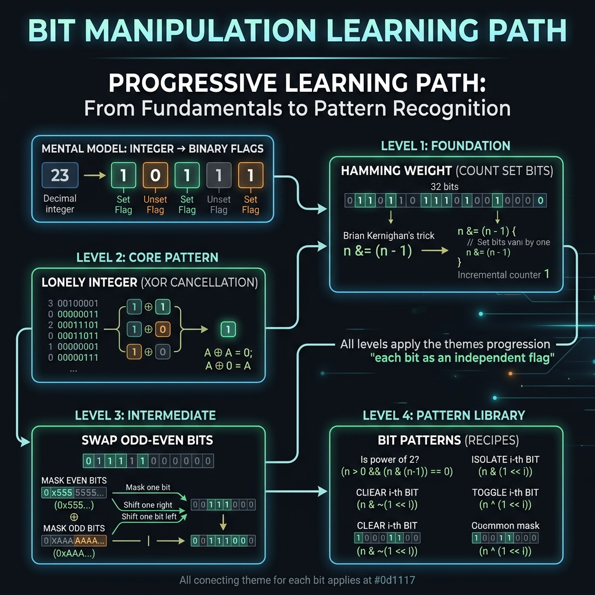

<!-- tags: dsa, algorithms, bit-manipulation, overview -->
# Bit Manipulation — Seeing the Machine-Level Shape

> Bit manipulation often feels like a trick. It is only hard because we view numbers as solid values, while the problem expects us to see them as an array of toggle flags.

📅 Date created: 2026-04-04 · 🔄 Updated: 2026-04-04 · ⏱️ 8 min read

| Aspect | Detail |
| ------ | ------ |
| **Focus** | XOR, mask, shift, bit vocabulary |
| **Best payoff** | Reduces state or reveals invariants elegantly |
| **Common trap** | Knowing operators but ignoring the represented bits |

---

## 1. DEFINE

Imagine you read the prompt and immediately jump to familiar approaches. With Bit Manipulation, the real value is not the first code you write. The value lies in locking onto the correct pattern and knowing why other paths fail.

When you see a solution using `^`, `&`, `|`, or `<<`, syntax is not the issue. The issue is whether you interpret each bit as a signal. If you cannot describe what a bit represents, bitwise code looks like magic.
The problems in this module cover counting bits, isolating a lonely element, swapping odd and even bits, and common bit patterns. They all teach one thing: representation determines the simplicity of the solution.
The goal is not to turn every problem into a bit trick. The goal is to know when a bit-level representation makes your solution shorter and more robust.

### Module Problems
| Problem | Core Tension | Main Idea | Link |
| --- | --- | --- | --- |
| Hamming Weight | Counting how many bits are on | A set bit is minimal state | [01-hamming-weight.md](./01-hamming-weight.md) |
| Lonely Integer | One element appears alone among pairs | XOR cancels paired elements | [02-lonely-integer.md](./02-lonely-integer.md) |
| Swap Odd / Even Bits | Swapping two interleaved bit layers | Mask separates lanes before shifting | [03-swap-odd-even-bits.md](./03-swap-odd-even-bits.md) |
| Core Bit Patterns | Synthesizing important motifs | Clear, check, toggle, and iterate subsets | [04-bit-patterns.md](./04-bit-patterns.md) |

## 2. VISUAL

Most bitwise errors occur because you fail to visualize where the bits stand. This diagram helps you view the problem as binary flag layers instead of a vague number.



```text

Integer value
  |
  +-- treat each bit as a flag -> Hamming Weight
  +-- pair and cancel with XOR -> Lonely Integer
  +-- split bits by even/odd mask -> Swap Odd / Even Bits
  +-- combine small operations -> Core Bit Patterns
```
*Figure: Bit manipulation becomes easy when you stop viewing integers as solid blocks and start viewing them as signal lanes.*

## 3. CODE

You should read these problems in order. Start with clear semantics before moving to problems that coordinate multiple bit operations simultaneously.

| Order | File | Learning Point | When to stop |
| --- | --- | --- | --- |
| 1 | [01-hamming-weight.md](./01-hamming-weight.md) | What a set bit really is | When you can explain why `n & (n-1)` removes the lowest bit |
| 2 | [02-lonely-integer.md](./02-lonely-integer.md) | XOR as pairwise cancellation | When you no longer see XOR as a rote trick |
| 3 | [03-swap-odd-even-bits.md](./03-swap-odd-even-bits.md) | Masks and shifts coordinate together | When you can write the mask yourself instead of copying it |
| 4 | [04-bit-patterns.md](./04-bit-patterns.md) | Synthesize motifs for reuse | When you can distinguish check, set, clear, toggle, and subset iteration |

## 4. PITFALLS

At this point, the syntax is no longer the most error-prone part. Unspoken assumptions and vague representations cause most failures here.

| Pitfall | Signal | Why it fails | How to fix | Severity |
| ------- | -------- | ---------- | -------- | -------- |
| Not defining bit meaning | Code runs but you cannot explain it | Bitwise loses semantics if representation is vague | Write down what bit `i` represents before operating | high |
| Confusing signed/unsigned or shift semantics | Different results across languages | Languages differ on arithmetic versus logical shifts | Read exact semantics for your language | medium |
| Using bit tricks unnecessarily | Short solution but hard to review | Representation is more complex than actual needs | Only use bits when they clarify invariants or reduce state | medium |
| Copying masks blindly | Memorizing `0xAAAAAAAA` without knowing its bits | The mask becomes a magic string | Write the mask from the required binary pattern | high |

## 5. REF

- Module files: [01-hamming-weight.md](./01-hamming-weight.md) to [04-bit-patterns.md](./04-bit-patterns.md)
- Adjacent optimization thinking: [../math-geometry/README.md](../math-geometry/README.md)
- Pattern handoff to subset/state compression in DP: [../dynamic-programming/README.md](../dynamic-programming/README.md)

## 6. RECOMMEND

Bitwise operations are most valuable when they form a language for state representation. They are not just fancy operators.

- If you want to connect bitwise to state compression or subset DP, go to [../dynamic-programming/README.md](../dynamic-programming/README.md).
- If the problem relies heavily on formulas or arithmetic, check [../math-geometry/README.md](../math-geometry/README.md).
- If you need to map state by key instead of a bit mask, return to [../patterns/hash-maps-sets/README.md](../patterns/hash-maps-sets/README.md).

## 7. QUICK REF

- Use XOR to cancel pairs. Use masks to isolate domains. Use shifts to change positions.
- If representation is vague, bit tricks will always look like dark magic.
- Bitwise is best when it shrinks the state or makes the invariant clear.