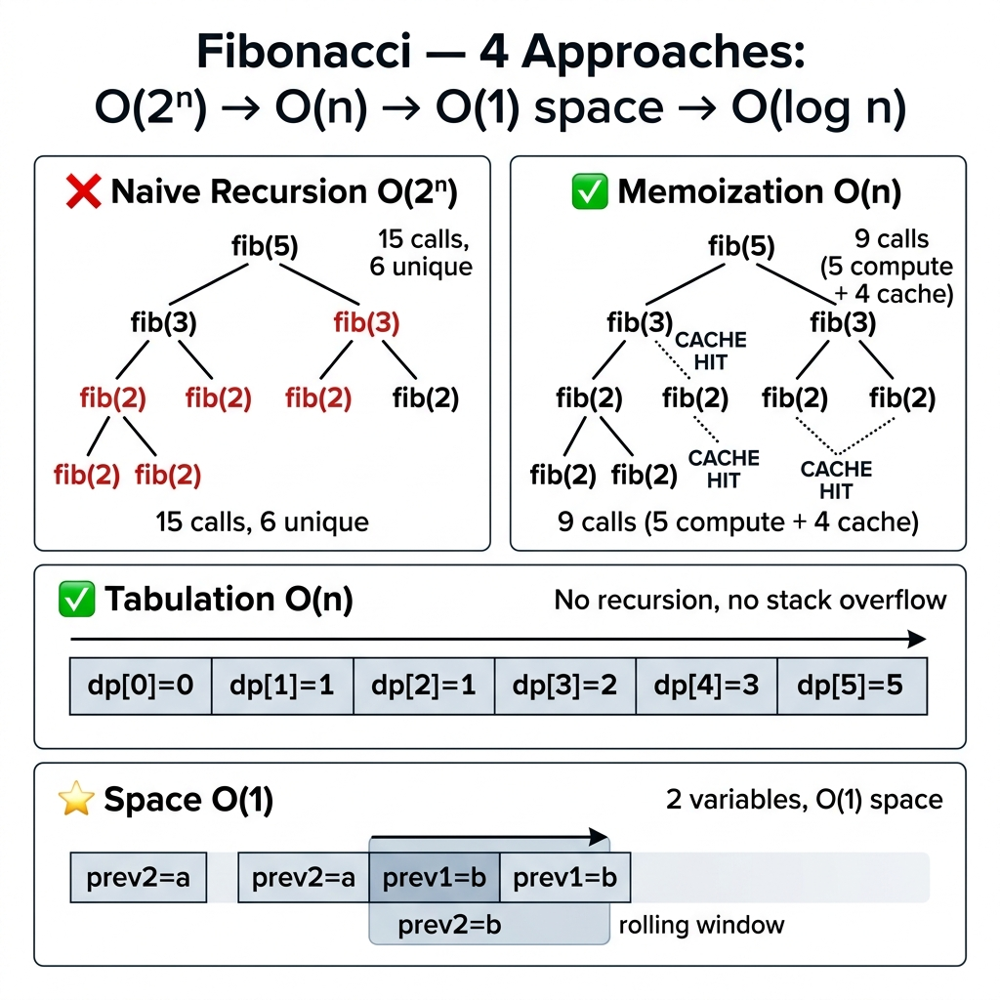

<!-- tags: dsa, algorithms, dynamic-programming -->
# 🐇 Fibonacci — DP Foundation

> You write `fib(50)` using recursion. It takes two minutes. You add memoization, and it runs in 0.001ms. Same answer, same logic, different subproblem handling. Fibonacci highlights the gap between understanding recursion and understanding DP.

📅 Created: 2026-03-20 · 🔄 Updated: 2026-04-09 · ⏱️ 15 min read

---

## 1. DEFINE

Everyone learning DP experiences this moment. Recursion yields correct answers for small inputs, but the call tree explodes. You lose track of redundant calculations. Fibonacci exposes this problem perfectly.

`Fibonacci` is not valuable because the problem is hard. It forces you to isolate `state`, `transition`, `base case`, and `fill order`. Failing to lock these down makes larger DP tables meaningless numbers.

Core insight: **DP begins when you realize multiple calls ask the exact same subproblem, allowing you to cache the answer once.**

| Approach | Time | Space | When to use |
| -------- | ---- | ----- | -------- |
| Naive Recursion | O(2ⁿ) | O(n) stack | For an easy baseline to spot overlapping subproblems |
| Memoization (Top-down) | O(n) | O(n) | To keep the recursion form but avoid recalculations |
| Tabulation (Bottom-up) | O(n) | O(n) | To fill states explicitly in ascending order |
| Space Optimized | O(n) | O(1) | When the transition depends only on a few recent states |

---

| Variant | When to use | Core Idea |
| ------- | ------- | ------- |
| Naive Recursion — O(2ⁿ) ❌ | For a baseline you can trace by hand | Grasp the core invariant and base cases before optimizing |
| Memoization — O(n)/O(n) | For problems with added states or constraints | Keep the invariant but add caching or auxiliary structures |
| Tabulation — O(n)/O(n) | For large inputs needing clear optimization | Optimize the core logic via state compression or strict ordering |
| Space Optimized — O(n)/O(1) ✅ | For abstractions and production-grade scaling | Combine techniques to handle harder edge cases |

### 1.1 Quick Recognition

- The problem features natural `f(n)` recursion where branches hit the same index or state.
- You must optimize an exponential decision tree into a finite number of subproblems.
- The transition depends on a few preceding states, making it ideal to compare top-down against bottom-up.

### 1.2 Invariants & Failure Modes

- Define `dp[i]` clearly. It is the `i`-th Fibonacci value, not a vague counter.
- Compute every state only after its dependencies `i-1` and `i-2` are ready.
- Common failure mode: memorizing `fib(n-1)+fib(n-2)` without explaining why memoization or tabulation stores the exact same state meaning.

---

## 2. VISUAL

The recursion tree for fib(5) calls fib(3) twice and fib(2) three times. Memoization cuts this tree into a straight line. The trace below shows the overlaps and how memoization prunes calls.

### Level 1 — Core intuition

```text
  Naive fib(5):                    Bottom-up:
         fib(5)                    dp: [0, 1, 1, 2, 3, 5]
        /      \                        →  →  →  →  →
    fib(4)    fib(3)  ← duplicate!
    /    \     /   \
  fib(3) fib(2) ...                15 calls → 6 with memo → 5 iterations
```

---

*Caption*: 🐇 Fibonacci — DP Foundation at Level 1 shows core intuition. Level 2 details the state update sequence from input to answer.

### Level 2 — Decision trace

```text
fib(5) recursion tree (WRONG — O(2ⁿ)):

         fib(5)
        /      \
    fib(4)     fib(3)     ← fib(3) called TWICE
    /    \      /   \
  fib(3) fib(2) fib(2) fib(1)  ← fib(2) called THREE times
  /   \
fib(2) fib(1)

Total calls: 15   Unique subproblems: 6

Memoization (CORRECT — O(n)):
  fib(5) → fib(4) → fib(3) → fib(2) → fib(1) [base]
                                     → fib(0) [base]
                              → fib(1) [MEMO HIT]
                     → fib(2) [MEMO HIT]
            → fib(3) [MEMO HIT]
  Total calls: 9 (5 compute + 4 memo hits)
  
Bottom-up (CORRECT — O(n), no recursion):
  dp[0]=0  dp[1]=1  dp[2]=1  dp[3]=2  dp[4]=3  dp[5]=5
  →        →        →        →        →        ✓

Space O(1): only keep prev2, prev1 — since dp[i] only needs dp[i-1] and dp[i-2]
```
*Figure: The recursion tree explodes to O(2ⁿ) due to repeated subproblems. Memoization cuts it to O(n). Tabulation drops recursion. Space O(1) drops the array.*



## 3. CODE

The trace reveals the evolution. We go from 15 naive calls to 9 memoized calls to 5 iterations to 2 variables. These implementations escalate from proof-of-concept to production-grade.

### Problem 1: Basic — Naive Recursion — O(2ⁿ) ❌
> **Goal**: Compute fib(n) using pure recursion to expose subproblem overlap.
> **Approach**: Return `fib(n-1) + fib(n-2)` with base cases `fib(0)=0` and `fib(1)=1`.
> **Example**: `fib(5) = 5` takes 15 function calls.
> **Complexity**: O(2ⁿ) time, O(n) stack space.

```go
func FibNaive(n int) int {
    if n <= 1 { return n }
    return FibNaive(n-1) + FibNaive(n-2)
}
```

```typescript
function fibNaive(n: number): number {
    if (n <= 1) return n;
    return fibNaive(n - 1) + fibNaive(n - 2);
}
```

```rust
fn fib_naive(n: u64) -> u64 {
    if n <= 1 { return n; }
    fib_naive(n - 1) + fib_naive(n - 2)
}
```

```cpp
int fibNaive(int n) {
    if (n <= 1) return n;
    return fibNaive(n - 1) + fibNaive(n - 2);
}
```

```python
def fib_naive(n: int) -> int:
    if n <= 1: return n
    return fib_naive(n - 1) + fib_naive(n - 2)
```

> **Why?** Naive recursion yields the correct answer but calls the same `fib(k)` repeatedly. The binary tree height is n, causing O(2ⁿ) time. Subproblem overlap signals the need for DP.

> **Conclusion**: Naive recursion merely proves correctness. It times out at n=50 in production. The next step adds memoization so each subproblem runs exactly once.

### Problem 2: Intermediate — Memoization — O(n)/O(n)
> **Goal**: Keep the recursion form but cache results to compute each subproblem once.
> **Approach**: Use a map or array to store results. Check the cache before recursing.
> **Example**: `fib(5)` drops from 15 calls to 9 calls.
> **Complexity**: O(n) time, O(n) space.

```go
func FibMemo(n int) int {
    memo := make(map[int]int)
    return fibHelper(n, memo)
}
func fibHelper(n int, memo map[int]int) int {
    if n <= 1 { return n }
    if v, ok := memo[n]; ok { return v }
    memo[n] = fibHelper(n-1, memo) + fibHelper(n-2, memo)
    return memo[n]
}
```

```typescript
function fibMemo(n: number, memo: Map<number,number> = new Map()): number {
    if (n <= 1) return n;
    if (memo.has(n)) return memo.get(n)!;
    const val = fibMemo(n - 1, memo) + fibMemo(n - 2, memo);
    memo.set(n, val); return val;
}
```

```rust
fn fib_memo(n: usize, memo: &mut Vec<Option<u64>>) -> u64 {
    if n <= 1 { return n as u64; }
    if let Some(v) = memo[n] { return v; }
    let val = fib_memo(n - 1, memo) + fib_memo(n - 2, memo);
    memo[n] = Some(val); val
}
```

```cpp
int fibMemo(int n, std::unordered_map<int,int>& memo) {
    if (n <= 1) return n;
    if (memo.count(n)) return memo[n];
    return memo[n] = fibMemo(n-1, memo) + fibMemo(n-2, memo);
}
```

```python
def fib_memo(n: int, memo: dict[int,int] = None) -> int:
    if memo is None: memo = {}
    if n <= 1: return n
    if n in memo: return memo[n]
    memo[n] = fib_memo(n - 1, memo) + fib_memo(n - 2, memo)
    return memo[n]
```

> **Why?** Memoization caches `fib(k)`. The first call computes it, and subsequent calls return the O(1) cache. The recursion tree becomes a straight line.

> **Conclusion**: Memoization retains the debuggable recursive form. However, an O(n) call stack triggers overflow at n=100K. Bottom-up tabulation drops recursion entirely.

---

### Problem 3: Advanced — Tabulation — O(n)/O(n)
> **Goal**: Fill the dp[0..n] table in ascending order without recursion.
> **Approach**: Initialize base cases and loop `dp[i] = dp[i-1] + dp[i-2]`.
> **Example**: `dp = [0, 1, 1, 2, 3, 5]` filling left to right.
> **Complexity**: O(n) time, O(n) space.

```go
func FibTab(n int) int {
    if n <= 1 { return n }
    dp := make([]int, n+1)
    dp[0], dp[1] = 0, 1
    for i := 2; i <= n; i++ {
        dp[i] = dp[i-1] + dp[i-2]
    }
    return dp[n]
}
```

```typescript
function fibTab(n: number): number {
    if (n <= 1) return n;
    const dp = Array(n + 1).fill(0); dp[1] = 1;
    for (let i = 2; i <= n; i++) dp[i] = dp[i-1] + dp[i-2];
    return dp[n];
}
```

```rust
fn fib_tab(n: usize) -> u64 {
    if n <= 1 { return n as u64; }
    let mut dp = vec![0u64; n + 1]; dp[1] = 1;
    for i in 2..=n { dp[i] = dp[i-1] + dp[i-2]; }
    dp[n]
}
```

```cpp
long long fibTab(int n) {
    if (n <= 1) return n;
    std::vector<long long> dp(n+1, 0); dp[1] = 1;
    for (int i = 2; i <= n; i++) dp[i] = dp[i-1] + dp[i-2];
    return dp[n];
}
```

```python
def fib_tab(n: int) -> int:
    if n <= 1: return n
    dp = [0] * (n + 1); dp[1] = 1
    for i in range(2, n + 1): dp[i] = dp[i-1] + dp[i-2]
    return dp[n]
```

> **Why?** Bottom-up filling guarantees dependencies are ready for `dp[i]`. Eliminating recursion prevents stack overflow. The left-to-right fill order matches the dependency graph perfectly.

> **Conclusion**: Tabulation is the default DP choice for clear fill orders. The O(n) array is wasteful since `dp[i]` only needs two prior cells. We can optimize this.

---

### Problem 4: Expert — Space Optimized — O(n)/O(1) ✅
> **Goal**: Compute fib(n) using two variables for production-grade linear DP.
> **Approach**: Use rolling variables `prev2` and `prev1`, shifting them per iteration.
> **Example**: `fib(5)` tracks state updates and returns 5.
> **Complexity**: O(n) time, O(1) space.

```go
// ━━━━━━━━━━━━━━━━━━━━━━━━━━━━━━━━━━━━━━━━━
// Use rolling variables to track state.
// dp[i] depends only on dp[i-1] and dp[i-2].
// ━━━━━━━━━━━━━━━━━━━━━━━━━━━━━━━━━━━━━━━━━
func FibOptimized(n int) int {
    if n <= 1 { return n }
    prev2, prev1 := 0, 1
    for i := 2; i <= n; i++ {
        curr := prev1 + prev2
        prev2 = prev1
        prev1 = curr
    }
    return prev1
}
```

```typescript
function fibOptimized(n: number): number {
    if (n <= 1) return n;
    let [prev2, prev1] = [0, 1];
    for (let i = 2; i <= n; i++) { [prev2, prev1] = [prev1, prev1 + prev2]; }
    return prev1;
}
```

```rust
fn fib_optimized(n: u64) -> u64 {
    if n <= 1 { return n; }
    let (mut a, mut b) = (0u64, 1u64);
    for _ in 2..=n { let c = a + b; a = b; b = c; }
    b
}
```

```cpp
long long fibOptimized(int n) {
    if (n <= 1) return n;
    long long a = 0, b = 1;
    for (int i = 2; i <= n; i++) { long long c = a + b; a = b; b = c; }
    return b;
}
```

```python
def fib_optimized(n: int) -> int:
    if n <= 1: return n
    a, b = 0, 1
    for _ in range(2, n + 1): a, b = b, a + b
    return b
```

> **Why?** The `dp[i]` state only needs two prior cells. The full array wastes memory. Two rolling variables compute the current value and shift forward. This fits any fixed-window 1D DP.

> **Conclusion**: O(1) space is the production standard for Fibonacci. If n exceeds 10^18, O(n) time is too slow, requiring O(log n) matrix exponentiation.

---

### Problem 5: Expert — Matrix Exponentiation — O(log n)
> **Goal**: Compute fib(n) in O(log n) time using matrix exponentiation for massive n.
> **Approach**: Raise the base matrix to the power of n-1 using fast squaring.
> **Example**: `fib(10^18)` needs around 60 matrix multiplications instead of timing out.
> **Complexity**: O(log n) time, O(1) space.

```go
// ━━━━━━━━━━━━━━━━━━━━━━━━━━━━━━━━━━━━━━━━━
// [F(n+1), F(n)] = [[1,1],[1,0]]^n
// Matrix power by squaring yields O(log n).
// ━━━━━━━━━━━━━━━━━━━━━━━━━━━━━━━━━━━━━━━━━
type Matrix [2][2]int

func multiply(a, b Matrix) Matrix {
    return Matrix{
        {a[0][0]*b[0][0] + a[0][1]*b[1][0], a[0][0]*b[0][1] + a[0][1]*b[1][1]},
        {a[1][0]*b[0][0] + a[1][1]*b[1][0], a[1][0]*b[0][1] + a[1][1]*b[1][1]},
    }
}

func matPow(m Matrix, n int) Matrix {
    result := Matrix{{1, 0}, {0, 1}} // identity
    for n > 0 {
        if n%2 == 1 { result = multiply(result, m) }
        m = multiply(m, m)
        n /= 2
    }
    return result
}

func FibMatrix(n int) int {
    if n <= 1 { return n }
    base := Matrix{{1, 1}, {1, 0}}
    result := matPow(base, n-1)
    return result[0][0]
}
```

```typescript
type Matrix2 = [[number,number],[number,number]];
function multiply(a: Matrix2, b: Matrix2): Matrix2 {
    return [[a[0][0]*b[0][0]+a[0][1]*b[1][0], a[0][0]*b[0][1]+a[0][1]*b[1][1]],
            [a[1][0]*b[0][0]+a[1][1]*b[1][0], a[1][0]*b[0][1]+a[1][1]*b[1][1]]];
}
function matPow(m: Matrix2, n: number): Matrix2 {
    let r: Matrix2 = [[1,0],[0,1]];
    while (n > 0) { if (n % 2) r = multiply(r, m); m = multiply(m, m); n = Math.floor(n/2); }
    return r;
}
function fibMatrix(n: number): number {
    if (n <= 1) return n;
    return matPow([[1,1],[1,0]], n - 1)[0][0];
}
```

```rust
type Mat = [[u64; 2]; 2];
fn mat_mul(a: Mat, b: Mat) -> Mat {
    [[a[0][0]*b[0][0]+a[0][1]*b[1][0], a[0][0]*b[0][1]+a[0][1]*b[1][1]],
     [a[1][0]*b[0][0]+a[1][1]*b[1][0], a[1][0]*b[0][1]+a[1][1]*b[1][1]]]
}
fn mat_pow(mut m: Mat, mut n: u64) -> Mat {
    let mut r: Mat = [[1,0],[0,1]];
    while n > 0 { if n & 1 == 1 { r = mat_mul(r, m); } m = mat_mul(m, m); n >>= 1; }
    r
}
fn fib_matrix(n: u64) -> u64 {
    if n <= 1 { return n; }
    mat_pow([[1,1],[1,0]], n - 1)[0][0]
}
```

```cpp
using Mat = std::array<std::array<long long,2>,2>;
Mat matMul(const Mat& a, const Mat& b) {
    return {{{a[0][0]*b[0][0]+a[0][1]*b[1][0], a[0][0]*b[0][1]+a[0][1]*b[1][1]},
             {a[1][0]*b[0][0]+a[1][1]*b[1][0], a[1][0]*b[0][1]+a[1][1]*b[1][1]}}};
}
Mat matPow(Mat m, int n) {
    Mat r = {{{1,0},{0,1}}};
    while (n > 0) { if (n & 1) r = matMul(r, m); m = matMul(m, m); n >>= 1; }
    return r;
}
long long fibMatrix(int n) {
    if (n <= 1) return n;
    return matPow({{{1,1},{1,0}}}, n - 1)[0][0];
}
```

```python
def mat_mul(a, b):
    return [[a[0][0]*b[0][0]+a[0][1]*b[1][0], a[0][0]*b[0][1]+a[0][1]*b[1][1]],
            [a[1][0]*b[0][0]+a[1][1]*b[1][0], a[1][0]*b[0][1]+a[1][1]*b[1][1]]]
def mat_pow(m, n):
    r = [[1,0],[0,1]]
    while n > 0:
        if n & 1: r = mat_mul(r, m)
        m = mat_mul(m, m); n >>= 1
    return r
def fib_matrix(n: int) -> int:
    if n <= 1: return n
    return mat_pow([[1,1],[1,0]], n - 1)[0][0]
```

> **Why?** The recurrence maps to a matrix multiplication. Fast power by squaring reduces the operations to O(log n) matrix multiplications.

> **Conclusion**: Matrix exponentiation is a competitive programming trick for massive n. Production code usually relies on O(1) space. This pattern generalizes to any linear recurrence.

---

### Problem 6: Expert — Fibonacci Generator — Closure + Iterator
> **Goal**: Generate Fibonacci lazily, calculating only when needed without storing the sequence.
> **Approach**: Use a closure or generator to capture state and shift it on demand.
> **Example**: Repeatedly calling the generator yields the next sequence value.
> **Complexity**: O(1) time per call, O(1) space.

```go
// ━━━━━━━━━━━━━━━━━━━━━━━━━━━━━━━━━━━━━━━━━
// Lazy evaluation for an infinite sequence.
// Closure captures state for idiomatic iteration.
// ━━━━━━━━━━━━━━━━━━━━━━━━━━━━━━━━━━━━━━━━━
func FibGenerator() func() int {
    a, b := 0, 1
    return func() int {
        val := a
        a, b = b, a+b
        return val
    }
}

// Usage:
// fib := FibGenerator()
// for i := 0; i < 10; i++ {
//     fmt.Print(fib(), " ") // 0 1 1 2 3 5 8 13 21 34
// }
```

```typescript
function* fibGenerator(): Generator<number> {
    let [a, b] = [0, 1];
    while (true) { yield a; [a, b] = [b, a + b]; }
}
// const gen = fibGenerator(); for (let i = 0; i < 10; i++) console.log(gen.next().value);
```

```rust
struct FibGen { a: u64, b: u64 }
impl FibGen { fn new() -> Self { Self { a: 0, b: 1 } } }
impl Iterator for FibGen {
    type Item = u64;
    fn next(&mut self) -> Option<u64> { let v = self.a; (self.a, self.b) = (self.b, self.a + self.b); Some(v) }
}
// FibGen::new().take(10).collect::<Vec<_>>()
```

```cpp
std::function<int()> fibGenerator() {
    int a = 0, b = 1;
    return [a, b]() mutable { int v = a; int c = a + b; a = b; b = c; return v; };
}
```

```python
def fib_generator():
    a, b = 0, 1
    while True: yield a; a, b = b, a + b
# gen = fib_generator(); print([next(gen) for _ in range(10)])
```

> **Why?** Generators capture state internally. Each call yields the value and shifts state. You can generate an infinite sequence without prior limits using minimal resources.

> **Conclusion**: The generator pattern shifts DP from batch computation to stream processing. This is useful when consumers need lazy evaluation or partial sequences.

---

### Problem 7: Expert — Big Fibonacci — Avoid Overflow
> **Goal**: Compute fib(n) for large n without integer overflow.
> **Approach**: Use arbitrary precision types like `big.Int`, `BigInt`, or `u128`.
> **Example**: Computing `fib(100)` overflows a standard int64 variable.
> **Complexity**: O(n) time, O(1) space plus big integer overhead.

```go
import "math/big"

// FibBig calculates Fibonacci for large inputs avoiding overflow.
func FibBig(n int) *big.Int {
    if n <= 1 { return big.NewInt(int64(n)) }
    prev2, prev1 := big.NewInt(0), big.NewInt(1)
    for i := 2; i <= n; i++ {
        curr := new(big.Int).Add(prev1, prev2)
        prev2, prev1 = prev1, curr
    }
    return prev1
}

// FibBig(100) = 354224848179261915075
// FibBig(1000) = 43466557686937456435688527675040625802564...
```

```typescript
function fibBig(n: number): bigint {
    if (n <= 1) return BigInt(n);
    let [a, b] = [0n, 1n];
    for (let i = 2; i <= n; i++) { [a, b] = [b, a + b]; }
    return b;
}
```

```rust
fn fib_big(n: usize) -> u128 {
    if n <= 1 { return n as u128; }
    let (mut a, mut b) = (0u128, 1u128);
    for _ in 2..=n { let c = a + b; a = b; b = c; }
    b
}
```

```cpp
// Use __int128 or boost::multiprecision for very large n
std::string fibBig(int n) {
    if (n <= 1) return std::to_string(n);
    // simplified: use string-based addition or external library for n > 93
    long long a = 0, b = 1;
    for (int i = 2; i <= n; i++) { long long c = a + b; a = b; b = c; }
    return std::to_string(b);
}
```

```python
def fib_big(n: int) -> int:
    # Python int has arbitrary precision natively
    if n <= 1: return n
    a, b = 0, 1
    for _ in range(2, n + 1): a, b = b, a + b
    return b
# fib_big(1000) → works natively in Python
```

> **Why?** An int64 overflows precisely at fib(93). Using arbitrary precision integers prevents this fatal overflow. Python handles this natively without extra types.

> **Conclusion**: Production code must handle overflow gracefully. When arithmetic exceeds primitive bounds, you must use arbitrary precision or modular arithmetic.

---

## 4. PITFALLS

DP rarely fails due to missing loops. It fails on state semantics, sentinels, base cases, and off-by-one fill orders.

| # | Severity | Error | Consequence | Fix |
|---|----------|-----|---------|-----|
| 1 | 🔴 Fatal | int overflow for n > 93 | Incorrect wrapped results | Use arbitrary precision |
| 2 | 🟡 Common | Naive recursion for n > 40 | Timeout or TLE | Use memoization or tabulation |
| 3 | 🟡 Common | Missing base cases | Panic or incorrect results | Handle base cases explicitly |
| 4 | 🔵 Minor | Map memo is slower than slice | Unnecessary performance hit | Use arrays when n is known |
| 5 | 🔵 Minor | Matrix exponentiation overflow | Incorrect results for large n | Use big integers for matrices |

---

## 5. REF

| Resource | Category | Link | Notes |
| -------- | ---- | ---- | ------- |
| Visualgo — Fibonacci | Visualization | [visualgo.net/recursion](https://visualgo.net/en/recursion) | Interactive recursion tree |
| Wikipedia — Fibonacci | Reference | [en.wikipedia.org](https://en.wikipedia.org/wiki/Fibonacci_number) | Properties and proofs |
| Matrix Exponentiation | Tutorial | [cp-algorithms.com](https://cp-algorithms.com/algebra/fibonacci-numbers.html) | O(log n) method |
| Go `math/big` | Official docs | [pkg.go.dev/math/big](https://pkg.go.dev/math/big) | Arbitrary precision integers |

---

## 6. RECOMMEND

Fibonacci is the simplest 1D DP. You can expand it by adding dimensions, changing the transition type, or modifying the state semantics entirely.

| Extension | When to use | Reason |
| ------------------------- | ---------------------- | --------------------------- |
| **Space Optimized O(1)** | Production code | Only requires two variables |
| **Matrix Exponentiation** | n > 10^18 or competitive | Runs in O(log n) |
| **`math/big.Int`** | n > 93 | Avoids int64 overflow |
| **Generator (closure)** | Stream processing | Lazy evaluation and memory efficient |
| **Memoization** | Subproblem overlap | When top-down logic feels more natural |

---

## 7. QUICK REF

| # | Pattern | Code |
|---|---------|------|
| 1 | Naive recursive | `func fib(n int) int { if n<=1 { return n }; return fib(n-1)+fib(n-2) }` |
| 2 | Memoization | `memo := map[int]int{}; if v, ok := memo[n]; ok { return v }; memo[n] = fib(n-1)+fib(n-2)` |
| 3 | Tabulation | `dp := make([]int, n+1); dp[0]=0; dp[1]=1; for i:=2;i<=n;i++ { dp[i]=dp[i-1]+dp[i-2] }` |
| 4 | Space O(1) | `a, b := 0, 1; for i := 0; i < n; i++ { a, b = b, a+b }; return a` |
| 5 | Complexity | `// O(n) time · O(1) space (optimized) · O(2ⁿ) naive` |
| 6 | Overflow at n=93 | `// int64 overflows at n=93; use big.Int for larger n` |
| 7 | Matrix exp | `// O(log n) via [[1,1],[1,0]]^n matrix exponentiation` |

---

Returning to the opening question: why does `fib(50)` time out in two minutes while memoization finishes in 0.001ms? The naive recursion duplicates subproblems exponentially. Memoization cuts this to linear time. Tabulation removes recursion entirely. Space optimization drops the table. Four approaches yield the same answer with vastly different performance profiles. That is the essence of DP.

**Links**: [← README](./README.md) · [→ LCS](./02-lcs.md)
