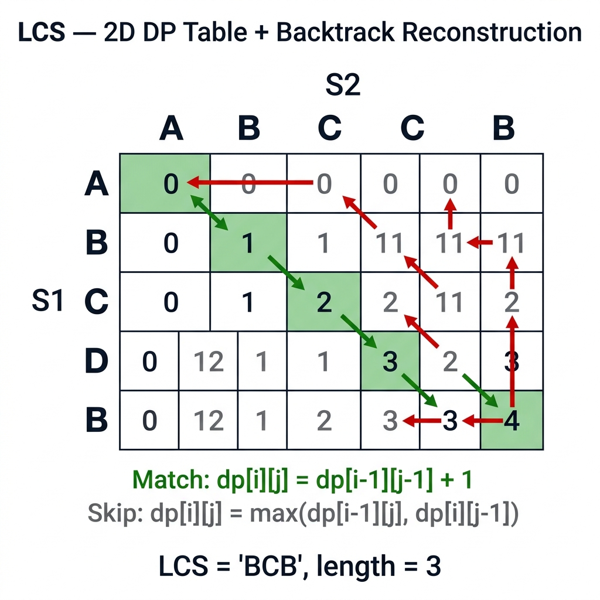

<!-- tags: dsa, algorithms -->
# 🔗 LCS — Longest Common Subsequence

> You run `git diff` every day. It compares two files, finds the longest identical parts, and highlights the changes. Underneath `diff` lies LCS. LCS is the first 2D DP problem you must understand: two axes, two strings, one decision table.

📅 Created: 2026-03-20 · 🔄 Updated: 2026-04-09 · ⏱️ 12 min read

---

## 1. DEFINE

When comparing two strings, intuition leans toward matching as early as possible. `Longest Common Subsequence` breaks that intuition. Sometimes you must skip an immediate match to preserve a longer path later.

`LCS` is a classic 2D DP problem because it forces you to model decisions across two axes simultaneously. Each cell is not just a number. It answers how long the longest common subsequence remains for these prefixes.

Core insight: **If you do not clearly define which string parts `dp[i][j]` represents, every subsequent formula becomes rote memorization.**

| Metric         | Value                                                                 |
| -------------- | --------------------------------------------------------------------- |
| **Time**       | O(m × n)                                                              |
| **Space**      | O(m × n) → optimize O(min(m,n))                                       |
| **Transition** | match: `dp[i][j]=dp[i-1][j-1]+1`, skip: `max(dp[i-1][j], dp[i][j-1])` |

Subsequence ≠ Substring: a subsequence does not need to be contiguous.

---

| Variant | When to use | Core Idea |
| ------- | ------- | ------- |
| Standard LCS with Reconstruction | To understand the invariant before optimizing | Trace the baseline manually to grasp the core invariant |
| Space Optimized — Rolling Array | When space constraints are tight | Retain the invariant but reduce memory footprint |
| Diff Tool — LCS applied | When applying LCS to real-world comparisons | Build practical tools like `git diff` on top of LCS |
| Parallel LCS — errgroup | For production-grade batch processing | Scale computations using concurrent execution patterns |

| Approach | Time | Space | When to use |
| --- | --- | --- | --- |
| Standard LCS with Reconstruction | O(m×n) | O(m×n) | To understand the invariant before optimizing |
| Space Optimized — Rolling Array | O(m×n) | O(min(m,n)) | When space constraints are tight |
| Diff Tool — LCS applied | O(m×n) | O(m×n) | When applying LCS to real-world comparisons |
| Parallel LCS — errgroup | O(m×n/W) | O(m×n) | For production-grade batch processing |

### 1.1 Quick Recognition

- The problem asks for the longest common subsequence between strings or involves diff/edit scaffolds.
- Each step offers two choices: discard a character from string A or from string B if they differ.
- The problem involves two independent indices moving simultaneously, making a 2D table the natural representation.

### 1.2 Invariants & Failure Modes

- Ensure `dp[i][j]` consistently answers for the chosen prefixes or suffixes. Never mix the two definitions.
- When characters match, the transition must connect diagonally. When they differ, take the maximum from the two valid discard directions.
- Common failure mode: confusing `subsequence` with `substring`, leading to incorrect boundaries in both tracing and code.

## 2. VISUAL

A 2D table looks intimidating. However, each `dp[i][j]` cell asks one simple question: how long is the common subsequence for prefixes `s1[0..i]` and `s2[0..j]`? The trace below demonstrates the match or skip logic.

### Level 1 — Core intuition

```text
  s1 = "ABCBDAB"    s2 = "BDCABA"
  LCS = "BCBA" (length 4)

       ""  B  D  C  A  B  A
  ""  [ 0  0  0  0  0  0  0 ]
  A   [ 0  0  0  0  1  1  1 ]
  B   [ 0  1  1  1  1  2  2 ]
  C   [ 0  1  1  2  2  2  2 ]
  B   [ 0  1  1  2  2  3  3 ]
  D   [ 0  1  2  2  2  3  3 ]
  A   [ 0  1  2  2  3  3  4 ]
  B   [ 0  1  2  2  3  4  4 ]
```

---

*Figure: The 2D table fills left-to-right, top-to-bottom. Match goes diagonal. Skip takes the max of left and top. The answer is at dp[m][n].*

### Level 2 — Decision trace

```text
Reconstruct LCS from dp table — backtrack from dp[7][6] = 4:

       ""  B  D  C  A  B  A
  ""  [ 0  0  0  0  0  0  0 ]
  A   [ 0  0  0  0  1  1  1 ]
  B   [ 0  1  1  1  1  2  2 ]
  C   [ 0  1  1 [2] 2  2  2 ]  ← match C → go diagonal
  B   [ 0  1  1  2  2 [3] 3 ]  ← match B → go diagonal
  D   [ 0  1 [2] 2  2  3  3 ]  ← skip: dp[5][1]=1, dp[4][2]=1 → go left
  A   [ 0  1  2  2  3  3 [4]]  ← match A → go diagonal
  B   [ 0 [1] 2  2  3 [4] 4 ]  ← match B → go diagonal

Backtrack path: dp[7][6]→dp[6][5]→dp[5][4]→dp[3][3]→dp[2][2]
LCS = "BCBA" ← read backward from match sequence
```
*Figure: Reconstruct by tracing backward. Matches go diagonal, skips follow the max direction. Rolling arrays cannot reconstruct since they discard history.*



## 3. CODE

The trace reveals two operations: match (diagonal + 1) and skip (max of left/top). The four implementations below cover standard, space optimization, diff applications, and parallel processing.

### Problem 1: Basic — Standard LCS with Reconstruction
> **Goal**: Find the LCS length and reconstruct the sequence from the DP table.
> **Approach**: Fill the `dp[m+1][n+1]` table. Backtrack from `dp[m][n]` following match or skip decisions.
> **Example**: `LCS("ABCBDAB", "BDCABA")` yields `(4, "BCBA")`.
> **Complexity**: O(m×n) time, O(m×n) space.

```go
package dp

func LCS(s1, s2 string) (int, string) {
    m, n := len(s1), len(s2)
    dp := make([][]int, m+1)
    for i := range dp { dp[i] = make([]int, n+1) }

    for i := 1; i <= m; i++ {
        for j := 1; j <= n; j++ {
            if s1[i-1] == s2[j-1] {
                dp[i][j] = dp[i-1][j-1] + 1
            } else {
                dp[i][j] = max(dp[i-1][j], dp[i][j-1])
            }
        }
    }

    // Reconstruct
    lcs := make([]byte, 0, dp[m][n])
    i, j := m, n
    for i > 0 && j > 0 {
        if s1[i-1] == s2[j-1] {
            lcs = append([]byte{s1[i-1]}, lcs...)
            i--; j--
        } else if dp[i-1][j] > dp[i][j-1] {
            i--
        } else {
            j--
        }
    }
    return dp[m][n], string(lcs)
}

func max(a, b int) int { if a > b { return a }; return b }
```

```typescript
function lcs(s1: string, s2: string): [number, string] {
    const [m, n] = [s1.length, s2.length];
    const dp = Array.from({length: m+1}, () => Array(n+1).fill(0));
    for (let i = 1; i <= m; i++)
        for (let j = 1; j <= n; j++)
            dp[i][j] = s1[i-1] === s2[j-1] ? dp[i-1][j-1]+1 : Math.max(dp[i-1][j], dp[i][j-1]);
    let res = ''; let [i, j] = [m, n];
    while (i > 0 && j > 0) {
        if (s1[i-1] === s2[j-1]) { res = s1[i-1] + res; i--; j--; }
        else if (dp[i-1][j] > dp[i][j-1]) i--; else j--;
    }
    return [dp[m][n], res];
}
```

```rust
fn lcs(s1: &str, s2: &str) -> (usize, String) {
    let (a, b): (Vec<char>, Vec<char>) = (s1.chars().collect(), s2.chars().collect());
    let (m, n) = (a.len(), b.len());
    let mut dp = vec![vec![0usize; n+1]; m+1];
    for i in 1..=m { for j in 1..=n {
        dp[i][j] = if a[i-1] == b[j-1] { dp[i-1][j-1]+1 } else { dp[i-1][j].max(dp[i][j-1]) };
    }}
    let mut res = Vec::new(); let (mut i, mut j) = (m, n);
    while i > 0 && j > 0 {
        if a[i-1] == b[j-1] { res.push(a[i-1]); i -= 1; j -= 1; }
        else if dp[i-1][j] > dp[i][j-1] { i -= 1; } else { j -= 1; }
    }
    res.reverse(); (dp[m][n], res.iter().collect())
}
```

```cpp
std::pair<int, std::string> lcs(const std::string& s1, const std::string& s2) {
    int m = s1.size(), n = s2.size();
    std::vector<std::vector<int>> dp(m+1, std::vector<int>(n+1, 0));
    for (int i = 1; i <= m; i++)
        for (int j = 1; j <= n; j++)
            dp[i][j] = s1[i-1]==s2[j-1] ? dp[i-1][j-1]+1 : std::max(dp[i-1][j], dp[i][j-1]);
    std::string res; int i = m, j = n;
    while (i > 0 && j > 0) {
        if (s1[i-1]==s2[j-1]) { res = s1[i-1] + res; i--; j--; }
        else if (dp[i-1][j] > dp[i][j-1]) i--; else j--;
    }
    return {dp[m][n], res};
}
```

```python
def lcs(s1: str, s2: str) -> tuple[int, str]:
    m, n = len(s1), len(s2)
    dp = [[0]*(n+1) for _ in range(m+1)]
    for i in range(1, m+1):
        for j in range(1, n+1):
            dp[i][j] = dp[i-1][j-1]+1 if s1[i-1]==s2[j-1] else max(dp[i-1][j], dp[i][j-1])
    res, i, j = [], m, n
    while i > 0 and j > 0:
        if s1[i-1] == s2[j-1]: res.append(s1[i-1]); i -= 1; j -= 1
        elif dp[i-1][j] > dp[i][j-1]: i -= 1
        else: j -= 1
    return dp[m][n], ''.join(reversed(res))
```

> **Why?** `dp[i][j]` stores the LCS length for prefixes. Matching characters extend the diagonal. Non-matching characters discard one side, keeping the maximum. Reconstruction traces backward along these decisions.

> **Conclusion**: Standard LCS requires a full O(m×n) table for reconstruction. If only the length is needed, a rolling array reduces space to O(min(m,n)).

---

### Problem 2: Intermediate — Space Optimized — Rolling Array
> **Goal**: Compute the LCS length using only two rows to achieve O(min(m,n)) space.
> **Approach**: Row `i` depends only on row `i-1`. Swap the previous and current rows every iteration.
> **Example**: Comparing two 100K strings drops memory usage from 10GB to 200KB.
> **Complexity**: O(m×n) time, O(min(m,n)) space.

```go
package dp

// LCSLength: O(min(m,n)) space — only needs 2 rows
func LCSLength(s1, s2 string) int {
    m, n := len(s1), len(s2)
    if m < n { s1, s2 = s2, s1; m, n = n, m } // s2 shorter

    prev := make([]int, n+1)
    curr := make([]int, n+1)

    for i := 1; i <= m; i++ {
        for j := 1; j <= n; j++ {
            if s1[i-1] == s2[j-1] {
                curr[j] = prev[j-1] + 1
            } else {
                curr[j] = max(prev[j], curr[j-1])
            }
        }
        prev, curr = curr, prev
        for k := range curr { curr[k] = 0 }
    }
    return prev[n]
}
```

```typescript
function lcsLength(s1: string, s2: string): number {
    let [a, b] = s1.length < s2.length ? [s2, s1] : [s1, s2];
    const n = b.length;
    let prev = Array(n+1).fill(0), curr = Array(n+1).fill(0);
    for (let i = 1; i <= a.length; i++) {
        for (let j = 1; j <= n; j++)
            curr[j] = a[i-1]===b[j-1] ? prev[j-1]+1 : Math.max(prev[j], curr[j-1]);
        [prev, curr] = [curr, prev]; curr.fill(0);
    }
    return prev[n];
}
```

```rust
fn lcs_length(s1: &str, s2: &str) -> usize {
    let (a, b) = if s1.len() >= s2.len() { (s1.as_bytes(), s2.as_bytes()) } else { (s2.as_bytes(), s1.as_bytes()) };
    let n = b.len();
    let mut prev = vec![0usize; n+1]; let mut curr = vec![0usize; n+1];
    for i in 1..=a.len() {
        for j in 1..=n {
            curr[j] = if a[i-1]==b[j-1] { prev[j-1]+1 } else { prev[j].max(curr[j-1]) };
        }
        std::mem::swap(&mut prev, &mut curr); curr.fill(0);
    }
    prev[n]
}
```

```cpp
int lcsLength(const std::string& s1, const std::string& s2) {
    auto [a, b] = s1.size() >= s2.size() ? std::tie(s1, s2) : std::tie(s2, s1);
    int n = b.size();
    std::vector<int> prev(n+1,0), curr(n+1,0);
    for (int i = 1; i <= (int)a.size(); i++) {
        for (int j = 1; j <= n; j++)
            curr[j] = a[i-1]==b[j-1] ? prev[j-1]+1 : std::max(prev[j], curr[j-1]);
        std::swap(prev, curr); std::fill(curr.begin(), curr.end(), 0);
    }
    return prev[n];
}
```

```python
def lcs_length(s1: str, s2: str) -> int:
    if len(s1) < len(s2): s1, s2 = s2, s1
    n = len(s2); prev, curr = [0]*(n+1), [0]*(n+1)
    for i in range(1, len(s1)+1):
        for j in range(1, n+1):
            curr[j] = prev[j-1]+1 if s1[i-1]==s2[j-1] else max(prev[j], curr[j-1])
        prev, curr = curr, [0]*(n+1)
    return prev[n]
```

> **Why?** `dp[i][j]` depends only on the current and previous rows. Keeping two rows and swapping them is sufficient. Using the shorter string for the columns minimizes memory usage.

> **Conclusion**: The rolling array is a standard trick for 2D DP length calculations. The trade-off is losing the ability to reconstruct the sequence.

---

### Problem 3: Advanced — Diff Tool — LCS applied
> **Goal**: Compare two strings using LCS to output a `git diff`-style result.
> **Approach**: Compute the LCS, then walk through both strings to mark characters as unchanged, added, or removed.
> **Example**: `Diff("ABCB", "BDCB")` outputs lines prefixed with `+`, `-`, or spaces.
> **Complexity**: O(m×n) time for LCS plus O(m+n) for the walk.

```go
package dp

import "fmt"

// Diff: compute diff between 2 strings using LCS
func Diff(old, new string) {
    _, lcs := LCS(old, new)
    li := 0
    for _, c := range old {
        if li < len(lcs) && byte(c) == lcs[li] {
            fmt.Printf("  %c\n", c) // unchanged
            li++
        } else {
            fmt.Printf("- %c\n", c) // removed
        }
    }
    li = 0
    for _, c := range new {
        if li < len(lcs) && byte(c) == lcs[li] {
            li++ // skip (already printed)
        } else {
            fmt.Printf("+ %c\n", c) // added
        }
    }
}
```

```typescript
function diff(old: string, new_: string): void {
    const [, seq] = lcs(old, new_);
    let li = 0;
    for (const c of old) { if (li < seq.length && c === seq[li]) { console.log(`  ${c}`); li++; } else console.log(`- ${c}`); }
    li = 0;
    for (const c of new_) { if (li < seq.length && c === seq[li]) li++; else console.log(`+ ${c}`); }
}
```

```rust
fn diff(old: &str, new: &str) {
    let (_, seq) = lcs(old, new);
    let seq: Vec<char> = seq.chars().collect();
    let mut li = 0;
    for c in old.chars() {
        if li < seq.len() && c == seq[li] { println!("  {c}"); li += 1; } else { println!("- {c}"); }
    }
    li = 0;
    for c in new.chars() {
        if li < seq.len() && c == seq[li] { li += 1; } else { println!("+ {c}"); }
    }
}
```

```cpp
void diff(const std::string& old_s, const std::string& new_s) {
    auto [_, seq] = lcs(old_s, new_s);
    size_t li = 0;
    for (char c : old_s) { if (li < seq.size() && c == seq[li]) { std::cout << "  " << c << "\n"; li++; } else std::cout << "- " << c << "\n"; }
    li = 0;
    for (char c : new_s) { if (li < seq.size() && c == seq[li]) li++; else std::cout << "+ " << c << "\n"; }
}
```

```python
def diff(old: str, new: str):
    _, seq = lcs(old, new)
    li = 0
    for c in old:
        if li < len(seq) and c == seq[li]: print(f'  {c}'); li += 1
        else: print(f'- {c}')
    li = 0
    for c in new:
        if li < len(seq) and c == seq[li]: li += 1
        else: print(f'+ {c}')
```

> **Why?** LCS finds the longest identical parts. Diff highlights the differences. Walking the old string marks LCS characters as unchanged and others as removed. Walking the new string marks non-LCS characters as added. This is the core of `git diff`.

> **Conclusion**: Diff tools are the most critical production application of LCS. Git uses the optimized Myers algorithm, but the core concept remains identical.

---

### Problem 4: Expert — Parallel LCS — errgroup
> **Goal**: Compute LCS for multiple string pairs in parallel for production batch processing.
> **Approach**: Use concurrent execution primitives like `errgroup` in Go or `rayon` in Rust.
> **Example**: Processing 1000 DNA sequence pairs across 8 CPU cores.
> **Complexity**: O(m×n) per pair, parallelized across available workers.

```go
package dp

import (
    "context"
    "golang.org/x/sync/errgroup"
)

type LCSResult struct {
    S1, S2 string
    Length int
    LCS    string
}

func ParallelLCS(pairs [][2]string, workers int) ([]LCSResult, error) {
    results := make([]LCSResult, len(pairs))
    eg, ctx := errgroup.WithContext(context.Background())
    eg.SetLimit(workers)

    for i, pair := range pairs {
        idx, s1, s2 := i, pair[0], pair[1]
        eg.Go(func() error {
            select {
            case <-ctx.Done(): return ctx.Err()
            default:
            }
            length, lcs := LCS(s1, s2)
            results[idx] = LCSResult{s1, s2, length, lcs}
            return nil
        })
    }
    return results, eg.Wait()
}
```

```typescript
async function parallelLCS(pairs: [string,string][], workers: number): Promise<{s1:string;s2:string;length:number;lcs:string}[]> {
    // In Node.js, use worker_threads for true parallelism
    return Promise.all(pairs.map(([s1, s2]) => {
        const [length, seq] = lcs(s1, s2);
        return { s1, s2, length, lcs: seq };
    }));
}
```

```rust
use rayon::prelude::*;
fn parallel_lcs(pairs: &[(&str, &str)]) -> Vec<(usize, String)> {
    pairs.par_iter().map(|(s1, s2)| lcs(s1, s2)).collect()
}
```

```cpp
#include <future>
std::vector<std::pair<int,std::string>> parallelLCS(
    const std::vector<std::pair<std::string,std::string>>& pairs) {
    std::vector<std::future<std::pair<int,std::string>>> futs;
    for (auto& [s1, s2] : pairs)
        futs.push_back(std::async(std::launch::async, lcs, s1, s2));
    std::vector<std::pair<int,std::string>> results;
    for (auto& f : futs) results.push_back(f.get());
    return results;
}
```

```python
from concurrent.futures import ProcessPoolExecutor
def parallel_lcs(pairs: list[tuple[str,str]], workers: int = 4):
    with ProcessPoolExecutor(max_workers=workers) as pool:
        return list(pool.map(lambda p: lcs(p[0], p[1]), pairs))
```

> **Why?** Each LCS pair is completely independent, making it embarrassingly parallel. Worker limits control concurrency, and context cancellation halts early on errors. This pattern fits any batch DP workload.

> **Conclusion**: Parallel processing reduces O(m×n×P) serial time to O(m×n×P/W) using W workers. This is a standard production pattern across languages.

---

## 4. PITFALLS

LCS fails in two common ways. You either confuse subsequence with substring, causing incorrect transitions, or you attempt reconstruction from a rolling array, which is impossible.

| # | Severity | Error | Consequence | Fix |
| --- | --- | --- | --- | --- |
| 1 | 🔴 Fatal | Space O(m×n) OOM | Application crashes on long strings | Use an O(min(m,n)) rolling array |
| 2 | 🟡 Common | Reconstruct with rolling array | Impossible backward trace yields errors | You must use the full O(m×n) table |
| 3 | 🟡 Common | Confuse subsequence vs substring | Incorrect sequence lengths | Remember that substrings must be contiguous |
| 4 | 🟡 Common | Index off-by-one errors | Incorrect boundaries cause panics or bad data | Use an (m+1)×(n+1) table size |
| 5 | 🔵 Minor | Failing to swap the short string | Wasted memory space | Always place the shorter string on the columns |

---

## 5. REF

| Resource | Category | Link | Notes |
| -------- | ---- | ---- | ------- |
| CP-Algorithms LCS | Tutorial | [cp-algorithms.com](https://cp-algorithms.com/string/lcs.html) | LCS plus variants |
| Wikipedia LCS | Reference | [en.wikipedia.org](https://en.wikipedia.org/wiki/Longest_common_subsequence_problem) | Formal proofs |
| Visualgo DP | Visualization | [visualgo.net](https://visualgo.net/en/recursion) | Interactive DP table |
| Myers Diff | Algorithm | [blog.jcoglan.com](https://blog.jcoglan.com/2017/02/12/the-myers-diff-algorithm-part-1/) | Git diff algorithm |

---

## 6. RECOMMEND

LCS is the quintessential 2D DP. Two axes represent two strings with match or skip transitions. Adding operational costs yields Edit Distance. Adding a contiguous constraint yields Longest Common Substring. Dropping an axis yields 1D DP.

| Extension | When to use | Reason |
| --------------------- | -------------------- | ------------------------ |
| **Space O(n)** | Long strings | Reduces memory via rolling arrays |
| **Hunt-Szymanski** | Small alphabets | Optimized O(r log n) algorithm |
| **LCS of 3+ strings** | Multiple sequences | Requires 3D or higher DP |
| **Diff algorithm** | File comparisons | Foundation for version control diffs |
| **Edit Distance** | Approximate matching | Levenshtein distance variations |

---

## 7. QUICK REF

| # | Pattern | Code |
|---|---------|------|
| 1 | DP table | `dp := make([][]int, m+1); for i := range dp { dp[i] = make([]int, n+1) }` |
| 2 | Fill | `if s1[i-1]==s2[j-1] { dp[i][j]=dp[i-1][j-1]+1 } else { dp[i][j]=max(dp[i-1][j],dp[i][j-1]) }` |
| 3 | Length | `return dp[m][n]` |
| 4 | Backtrack | `for i,j := m,n; i>0 && j>0; { if s1[i-1]==s2[j-1] { lcs=append(lcs,s1[i-1]); i--; j-- } else if dp[i-1][j]>dp[i][j-1] { i-- } else { j-- } }` |
| 5 | Complexity | `// O(mn) time · O(mn) space · O(n) space with rolling array` |
| 6 | Space optimize | `// Only need prev row: dp[j] vs prevDp[j-1]` |
| 7 | When to use | `// Diff tools, DNA alignment, edit distance base` |

---

Returning to the opening question: how does `git diff` work? It finds the LCS between the old and new files. Everything outside that LCS is a change. It builds an m×n table, fills it, and backtracks to reconstruct the sequence.

**Links**: [← Fibonacci](./01-fibonacci.md) · [→ Knapsack](./03-knapsack.md)
