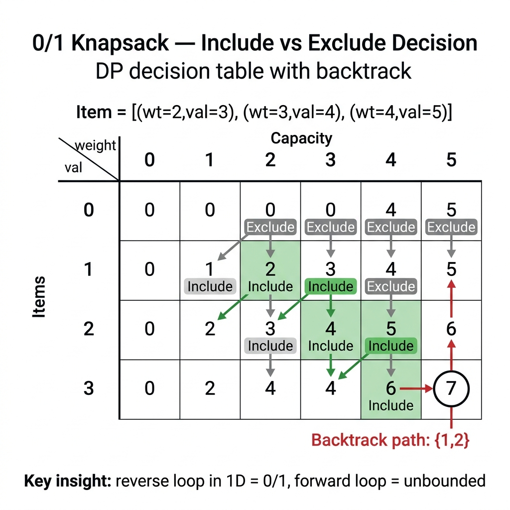

<!-- tags: dsa, algorithms -->
# 🎒 0/1 Knapsack Problem

> You have three items and a 5 kg backpack. Which combination gives the highest value? Brute-force checks 8 combinations. Thirty items check one billion. Knapsack teaches that DP replaces enumeration by asking the right question: "With w capacity left, do I include or exclude item i?"

📅 Created: 2026-03-20 · 🔄 Updated: 2026-04-09 · ⏱️ 15 min read

---

## 1. DEFINE

Many optimization problems look similar. You select a few items to maximize value. `Knapsack` complicates this with a strict constraint that easily causes errors. You either take an item or leave it, strictly bounded by finite capacity.

`Knapsack` is the foundational problem for tracking two simultaneous states. The state must record "which item we are considering" and "how much capacity remains." Missing either dimension causes you to reuse items incorrectly or miss valid solutions.

Core insight: **The core is not the max formula, but ensuring the state holds enough information to distinguish whether you can still use the current item.**

| Metric          | Value                                                         |
| --------------- | ------------------------------------------------------------- |
| **Time**        | O(n × W)                                                      |
| **Space**       | O(n × W) → optimize O(W)                                      |
| **Transition**  | `dp[i][w] = max(dp[i-1][w], dp[i-1][w-weight[i]] + value[i])` |
| **NP-Complete** | Pseudo-polynomial (exponential in bits of W)                  |

---

| Variant | When to use | Core Idea |
| ------- | ------- | ------- |
| Standard 0/1 Knapsack with Item Tracking | To trace the baseline manually | Grasp the core invariant and base cases before optimizing |
| Space Optimized — O(W) | When space constraints are tight | Retain the invariant but reduce memory footprint |
| Unbounded Knapsack (each item unlimited) | For unbounded item availability | Change loop direction to allow item reuse |
| Fractional Knapsack — Greedy O(n log n) | When fractional items are allowed | Use greedy ratios instead of DP constraints |

| Approach | Time | Space | When to use |
| --- | --- | --- | --- |
| Standard 0/1 Knapsack with Item Tracking | O(n×W) | O(n×W) | To understand the invariant before optimizing |
| Space Optimized — O(W) | O(n×W) | O(W) | When space constraints are tight |
| Unbounded Knapsack (unlimited items) | O(n×W) | O(W) | For unbounded item availability |
| Fractional Knapsack — Greedy O(n log n) | O(n log n) | O(n) | When fractional items are allowed |

### 1.1 Quick Recognition

- The problem provides a list of items with weights and values alongside a capacity threshold.
- Each item presents a binary choice: include or exclude.
- Variations revolve around 0/1 constraints, unbounded usage, or reconstructing the selected set.

### 1.2 Invariants & Failure Modes

- `dp[i][w]` must explicitly mean considering the first `i` items with capacity `w`.
- For `0/1 knapsack`, you must loop backward through capacity to ensure each item is used exactly once.
- Common failure mode: applying unbounded knapsack transitions to a 0/1 problem, yielding correct sample outputs but flawed semantics.

## 2. VISUAL

Knapsack resembles LCS. It uses a 2D table filled left-to-right. However, the axes differ. The Y-axis tracks items, and the X-axis tracks capacity. The trace below shows the include/exclude decision at each cell.

### Level 1 — Core intuition

```text
  Items: Phone(w=1,v=6), Tablet(w=2,v=10), Camera(w=3,v=12)
  Capacity = 5

       w→  0   1   2   3   4   5
  i=0     [0,  6,  6,  6,  6,  6]
  i=1     [0,  6, 10, 16, 16, 16]
  i=2     [0,  6, 10, 16, 18, 22] ← answer = 22 (Tablet+Camera)
```

---

*Figure: Each cell asks whether to include or exclude the item. Tablet+Camera yields 22, which is greater than Phone+Tablet at 16.*



### Level 2 — Decision trace

```text
Items: Phone(w=1,v=6), Tablet(w=2,v=10), Camera(w=3,v=12), Cap=5

         w=0  w=1  w=2  w=3  w=4  w=5
item 0:  [ 0    0    0    0    0    0 ]
Phone:   [ 0    6    6    6    6    6 ]  ← include when w≥1
Tablet:  [ 0    6   10   16   16   16]  ← w=3: max(6, dp[0][1]+10) = max(6,16)=16
Camera:  [ 0    6   10   16   18   22]  ← w=5: max(16, dp[1][2]+12) = max(16,22)=22

Backtrack: dp[3][5]=22 ≠ dp[2][5]=16 → Camera CHOSEN, w=5-3=2
           dp[2][2]=10 ≠ dp[1][2]=6  → Tablet CHOSEN, w=2-2=0
           → Items: {Tablet, Camera}, total = 10+12 = 22
```
*Figure: Space O(W) uses a reverse loop. Include/exclude decisions compare against the row above during backtracking.*

## 3. CODE

The trace shows an include/exclude decision at each cell inheriting values from the prior row. Three implementations cover standard 2D, space O(W), and unbounded reconstruction.

### Problem 1: Basic — Standard 0/1 Knapsack with Item Tracking
> **Goal**: Select items to maximize value within capacity, using each item zero or one time.
> **Approach**: Define `dp[i][w]` as max value using items 1..i with capacity w. Choose `dp[i-1][w-wt]+val` or skip `dp[i-1][w]`.
> **Example**: Items [(2,3),(3,4),(4,5)] with capacity 5 selects items 1 and 2 for value 7.
> **Complexity**: O(n×W) time, O(n×W) space.

```go
package dp

import "fmt"

type Item struct {
    Weight int
    Value  int
    Name   string
}

func Knapsack01(items []Item, cap int) (int, []Item) {
    n := len(items)
    dp := make([][]int, n+1)
    for i := range dp { dp[i] = make([]int, cap+1) }

    for i := 1; i <= n; i++ {
        item := items[i-1]
        for w := 0; w <= cap; w++ {
            dp[i][w] = dp[i-1][w]
            if w >= item.Weight {
                if v := dp[i-1][w-item.Weight] + item.Value; v > dp[i][w] {
                    dp[i][w] = v
                }
            }
        }
    }

    // Backtrack selected items
    var selected []Item
    w := cap
    for i := n; i > 0; i-- {
        if dp[i][w] != dp[i-1][w] {
            selected = append(selected, items[i-1])
            w -= items[i-1].Weight
        }
    }
    return dp[n][cap], selected
}
```

```typescript
interface Item { weight: number; value: number; name: string; }
function knapsack01(items: Item[], cap: number): [number, Item[]] {
    const n = items.length;
    const dp = Array.from({length: n+1}, () => Array(cap+1).fill(0));
    for (let i = 1; i <= n; i++) {
        const it = items[i-1];
        for (let w = 0; w <= cap; w++) {
            dp[i][w] = dp[i-1][w];
            if (w >= it.weight) dp[i][w] = Math.max(dp[i][w], dp[i-1][w-it.weight] + it.value);
        }
    }
    const selected: Item[] = []; let w = cap;
    for (let i = n; i > 0; i--) if (dp[i][w] !== dp[i-1][w]) { selected.push(items[i-1]); w -= items[i-1].weight; }
    return [dp[n][cap], selected];
}
```

```rust
fn knapsack_01(items: &[(i32,i32,String)], cap: usize) -> (i32, Vec<usize>) {
    let n = items.len();
    let mut dp = vec![vec![0i32; cap+1]; n+1];
    for i in 1..=n { let (w, v, _) = &items[i-1];
        for ww in 0..=cap {
            dp[i][ww] = dp[i-1][ww];
            if ww >= *w as usize { dp[i][ww] = dp[i][ww].max(dp[i-1][ww - *w as usize] + v); }
        }
    }
    let mut sel = vec![]; let mut w = cap;
    for i in (1..=n).rev() { if dp[i][w] != dp[i-1][w] { sel.push(i-1); w -= items[i-1].0 as usize; } }
    (dp[n][cap], sel)
}
```

```cpp
std::pair<int, std::vector<int>> knapsack01(
    const std::vector<std::tuple<int,int,std::string>>& items, int cap) {
    int n = items.size();
    std::vector<std::vector<int>> dp(n+1, std::vector<int>(cap+1, 0));
    for (int i = 1; i <= n; i++) { auto [w,v,_] = items[i-1];
        for (int ww = 0; ww <= cap; ww++) {
            dp[i][ww] = dp[i-1][ww];
            if (ww >= w) dp[i][ww] = std::max(dp[i][ww], dp[i-1][ww-w] + v);
        }
    }
    std::vector<int> sel; int w = cap;
    for (int i = n; i > 0; i--) if (dp[i][w] != dp[i-1][w]) { sel.push_back(i-1); w -= std::get<0>(items[i-1]); }
    return {dp[n][cap], sel};
}
```

```python
def knapsack_01(items: list[tuple[int,int,str]], cap: int) -> tuple[int, list[int]]:
    n = len(items)
    dp = [[0]*(cap+1) for _ in range(n+1)]
    for i in range(1, n+1):
        w, v, _ = items[i-1]
        for ww in range(cap+1):
            dp[i][ww] = dp[i-1][ww]
            if ww >= w: dp[i][ww] = max(dp[i][ww], dp[i-1][ww-w] + v)
    sel, w = [], cap
    for i in range(n, 0, -1):
        if dp[i][w] != dp[i-1][w]: sel.append(i-1); w -= items[i-1][0]
    return dp[n][cap], sel
```

> **Why?** `dp[i][w]` asks for the max value when considering items 1 to i with capacity w. Include item i when `w >= wt[i]` and `dp[i-1][w-wt[i]] + val[i] > dp[i-1][w]`. Fill top-to-bottom, left-to-right.

> **Conclusion**: Standard knapsack requires the full O(n×W) table to reconstruct items. If you only need the max value, O(W) space suffices.

---

### Problem 2: Intermediate — Space Optimized — O(W)
> **Goal**: Maximize value using a 1D rolling array to achieve O(W) space.
> **Approach**: Iterate items in the outer loop and capacity in the inner loop in reverse.
> **Example**: The same input yields the same result but only uses one row of size W+1.
> **Complexity**: O(n×W) time, O(W) space.

```go
package dp

// ⚠ Iterate w RIGHT-TO-LEFT to avoid selecting the same item multiple times.
func Knapsack01Opt(items []Item, cap int) int {
    dp := make([]int, cap+1)
    for _, item := range items {
        for w := cap; w >= item.Weight; w-- { // RIGHT to LEFT!
            if v := dp[w-item.Weight] + item.Value; v > dp[w] {
                dp[w] = v
            }
        }
    }
    return dp[cap]
}
```

```typescript
function knapsack01Opt(items: Item[], cap: number): number {
    const dp = Array(cap + 1).fill(0);
    for (const it of items)
        for (let w = cap; w >= it.weight; w--)
            dp[w] = Math.max(dp[w], dp[w - it.weight] + it.value);
    return dp[cap];
}
```

```rust
fn knapsack_01_opt(items: &[(i32,i32)], cap: usize) -> i32 {
    let mut dp = vec![0i32; cap+1];
    for &(w, v) in items {
        for ww in (w as usize..=cap).rev() { dp[ww] = dp[ww].max(dp[ww - w as usize] + v); }
    }
    dp[cap]
}
```

```cpp
int knapsack01Opt(const std::vector<std::pair<int,int>>& items, int cap) {
    std::vector<int> dp(cap+1, 0);
    for (auto [w, v] : items)
        for (int ww = cap; ww >= w; ww--) dp[ww] = std::max(dp[ww], dp[ww-w] + v);
    return dp[cap];
}
```

```python
def knapsack_01_opt(items: list[tuple[int,int]], cap: int) -> int:
    dp = [0] * (cap + 1)
    for w, v in items:
        for ww in range(cap, w - 1, -1):
            dp[ww] = max(dp[ww], dp[ww - w] + v)
    return dp[cap]
```

> **Why?** Row `i` depends only on row `i-1`. The reverse loop on capacity `w` ensures `dp[w-wt]` hasn't been overwritten. Forward implies unbounded, reverse implies 0/1.

> **Conclusion**: O(W) space is the production standard. The reverse loop direction is the critical distinction between 0/1 and unbounded knapsack.

---

### Problem 3: Advanced — Unbounded Knapsack
> **Goal**: Solve knapsack allowing unlimited uses of each item.
> **Approach**: Forward loop on capacity allows the algorithm to reuse items.
> **Example**: dp[3][5]=7 implies item 2 is chosen, w becomes 2, then item 1 is chosen.
> **Complexity**: O(n×W) time, O(W) space.

```go
package dp

// Left-to-right → items can be selected multiple times
func KnapsackUnbounded(items []Item, cap int) int {
    dp := make([]int, cap+1)
    for _, item := range items {
        for w := item.Weight; w <= cap; w++ { // LEFT to RIGHT!
            if v := dp[w-item.Weight] + item.Value; v > dp[w] {
                dp[w] = v
            }
        }
    }
    return dp[cap]
}
```

```typescript
function knapsackUnbounded(items: Item[], cap: number): number {
    const dp = Array(cap + 1).fill(0);
    for (const it of items)
        for (let w = it.weight; w <= cap; w++) dp[w] = Math.max(dp[w], dp[w - it.weight] + it.value);
    return dp[cap];
}
```

```rust
fn knapsack_unbounded(items: &[(i32,i32)], cap: usize) -> i32 {
    let mut dp = vec![0i32; cap+1];
    for &(w, v) in items {
        for ww in w as usize..=cap { dp[ww] = dp[ww].max(dp[ww - w as usize] + v); }
    }
    dp[cap]
}
```

```cpp
int knapsackUnbounded(const std::vector<std::pair<int,int>>& items, int cap) {
    std::vector<int> dp(cap+1, 0);
    for (auto [w, v] : items)
        for (int ww = w; ww <= cap; ww++) dp[ww] = std::max(dp[ww], dp[ww-w] + v);
    return dp[cap];
}
```

```python
def knapsack_unbounded(items: list[tuple[int,int]], cap: int) -> int:
    dp = [0] * (cap + 1)
    for w, v in items:
        for ww in range(w, cap + 1): dp[ww] = max(dp[ww], dp[ww - w] + v)
    return dp[cap]
```

> **Why?** The forward loop allows `dp[w-wt]` to include the current item because `w-wt < w` has already been updated in the same iteration. This matches the Coin Change variant.

> **Conclusion**: 0/1 and unbounded knapsack differ only in loop direction. Reverse loop ensures 0/1, forward loop ensures unbounded.

---

### Problem 4: Expert — Fractional Knapsack — Greedy O(n log n)
> **Goal**: Allow selecting fractional items to optimize using greedy instead of DP.
> **Approach**: Sort items descending by value-to-weight ratio. Greedily select the highest ratio.
> **Example**: Pick full items until capacity only allows a fraction of the next item.
> **Complexity**: O(n log n) sort plus O(n) greedy pass.

```go
package dp

import "sort"

// Fractional: greedy sort by value/weight ratio
func KnapsackFractional(items []Item, cap int) float64 {
    type rItem struct {
        Item
        Ratio float64
    }
    ri := make([]rItem, len(items))
    for i, it := range items {
        ri[i] = rItem{it, float64(it.Value) / float64(it.Weight)}
    }
    sort.Slice(ri, func(i, j int) bool {
        return ri[i].Ratio > ri[j].Ratio
    })

    total := 0.0
    remain := float64(cap)
    for _, it := range ri {
        if float64(it.Weight) <= remain {
            total += float64(it.Value)
            remain -= float64(it.Weight)
        } else {
            total += it.Ratio * remain
            break
        }
    }
    return total
}
```

```typescript
function knapsackFractional(items: Item[], cap: number): number {
    const ri = items.map(it => ({...it, ratio: it.value / it.weight})).sort((a,b) => b.ratio - a.ratio);
    let total = 0, remain = cap;
    for (const it of ri) {
        if (it.weight <= remain) { total += it.value; remain -= it.weight; }
        else { total += it.ratio * remain; break; }
    }
    return total;
}
```

```rust
fn knapsack_fractional(items: &[(f64,f64)], cap: f64) -> f64 {
    let mut ri: Vec<(f64,f64,f64)> = items.iter().map(|&(w,v)| (w, v, v/w)).collect();
    ri.sort_by(|a,b| b.2.partial_cmp(&a.2).unwrap());
    let (mut total, mut remain) = (0.0, cap);
    for (w, v, ratio) in ri {
        if w <= remain { total += v; remain -= w; } else { total += ratio * remain; break; }
    }
    total
}
```

```cpp
double knapsackFractional(std::vector<std::pair<int,int>> items, int cap) {
    std::sort(items.begin(), items.end(), [](auto& a, auto& b) {
        return (double)a.second/a.first > (double)b.second/b.first;
    });
    double total = 0, remain = cap;
    for (auto [w, v] : items) {
        if (w <= remain) { total += v; remain -= w; }
        else { total += (double)v/w * remain; break; }
    }
    return total;
}
```

```python
def knapsack_fractional(items: list[tuple[int,int]], cap: int) -> float:
    ri = sorted(items, key=lambda x: x[1]/x[0], reverse=True)
    total, remain = 0.0, float(cap)
    for w, v in ri:
        if w <= remain: total += v; remain -= w
        else: total += (v / w) * remain; break
    return total
```

> **Why?** Fractional knapsack permits cutting items. The greedy choice is optimal because it always picks the highest value-to-weight ratio. Discrete choices demand DP.

> **Conclusion**: Fractional knapsack proves DP is only required for discrete constraints. When continuous choices are allowed, greedy algorithms suffice.

---

### Problem 5: Expert — Knapsack with dependency — Item Group
> **Goal**: Solve knapsack where items belong to dependency groups. Pick at most one item per group.
> **Approach**: Outer loop iterates groups. Inner loop iterates items. The DP step uses a reverse capacity loop.
> **Example**: Three groups containing two to three items each. Pick one item per group maximum.
> **Complexity**: O(G×K×W) where G is groups, K is items per group, and W is capacity.

```go
// ━━━━━━━━━━━━━━━━━━━━━━━━━━━━━━━━━━━━━━━━━
// Grouped Knapsack: items belong to groups. Pick AT MOST 1 per group.
// Example: choose a laptop OR a desktop (group "computer").
// ━━━━━━━━━━━━━━━━━━━━━━━━━━━━━━━━━━━━━━━━━
func KnapsackGrouped(groups [][]Item, cap int) int {
    dp := make([]int, cap+1)
    for _, group := range groups {
        // Snapshot dp before processing this group
        prev := make([]int, cap+1)
        copy(prev, dp)
        for _, item := range group {
            for w := cap; w >= item.Weight; w-- {
                if v := prev[w-item.Weight] + item.Value; v > dp[w] {
                    dp[w] = v
                }
            }
        }
    }
    return dp[cap]
}
```

```typescript
function knapsackGrouped(groups: Item[][], cap: number): number {
    const dp = Array(cap + 1).fill(0);
    for (const group of groups) {
        const prev = [...dp];
        for (const it of group)
            for (let w = cap; w >= it.weight; w--)
                dp[w] = Math.max(dp[w], prev[w - it.weight] + it.value);
    }
    return dp[cap];
}
```

```rust
fn knapsack_grouped(groups: &[Vec<(i32,i32)>], cap: usize) -> i32 {
    let mut dp = vec![0i32; cap+1];
    for group in groups {
        let prev = dp.clone();
        for &(w, v) in group {
            for ww in (w as usize..=cap).rev() { dp[ww] = dp[ww].max(prev[ww - w as usize] + v); }
        }
    }
    dp[cap]
}
```

```cpp
int knapsackGrouped(const std::vector<std::vector<std::pair<int,int>>>& groups, int cap) {
    std::vector<int> dp(cap+1, 0);
    for (auto& group : groups) {
        auto prev = dp;
        for (auto [w, v] : group)
            for (int ww = cap; ww >= w; ww--) dp[ww] = std::max(dp[ww], prev[ww-w] + v);
    }
    return dp[cap];
}
```

```python
def knapsack_grouped(groups: list[list[tuple[int,int]]], cap: int) -> int:
    dp = [0] * (cap + 1)
    for group in groups:
        prev = dp[:]
        for w, v in group:
            for ww in range(cap, w - 1, -1):
                dp[ww] = max(dp[ww], prev[ww - w] + v)
    return dp[cap]
```

> **Why?** Grouped knapsack layers multiple constraints. The outer group loop ensures exclusive choices. The inner item loop enforces 0/1 behavior. The reverse capacity loop maintains the invariant.

> **Conclusion**: Grouped knapsack generalizes all variants. Every knapsack problem maps to some form of group constraint.

---

## 4. PITFALLS

Knapsack errors usually stem from capacity loop directions or confusing 0/1 with unbounded knapsack.

| # | Severity | Error | Consequence | Fix |
| --- | --- | --- | --- | --- |
| 1 | 🔴 Fatal | 0/1 left-to-right loop | Items are chosen multiple times, yielding wrong answers | Use right-to-left loop |
| 2 | 🟡 Common | Greedy for 0/1 Knapsack | Picking high ratio but large weight items yields sub-optimal value | Use greedy only for Fractional |
| 3 | 🟡 Common | Assuming polynomial time | Large W makes O(nW) pseudo-polynomial and slow | Recognize pseudo-polynomial limits |
| 4 | 🔵 Minor | Excessive capacity causing MLE | O(W) array causes OOM crashes | Use Meet-in-the-middle or Branch & Bound |
| 5 | 🔵 Minor | Forgetting to backtrack | Max value is known but the selected items are lost | Track the decision matrix |

---

## 5. REF

| Resource | Category | Link | Notes |
| -------- | ---- | ---- | ------- |
| CP-Algorithms Knapsack | Tutorial | [cp-algorithms.com](https://cp-algorithms.com/dynamic_programming/knapsack.html) | All knapsack variants |
| Wikipedia 0/1 Knapsack | Reference | [en.wikipedia.org](https://en.wikipedia.org/wiki/Knapsack_problem) | NP-completeness proof |
| Visualgo DP | Visualization | [visualgo.net](https://visualgo.net/en/recursion) | Interactive DP trace |

---

## 6. RECOMMEND

0/1 Knapsack is the foundation of optimization DP. Allowing item reuse creates Unbounded Knapsack. Adding strict sums creates Subset Sum. Changing max value to counting creates Combination Sum.

| Extension | When to use | Complexity |
| --------------------- | -------------------------------------- | ----------------- |
| **0/1 Knapsack**      | Pick each item 0 or 1 time             | O(nW)             |
| **Unbounded**         | Unlimited item supply                  | O(nW)             |
| **Fractional**        | Fractional item division               | O(n log n) greedy |
| **Grouped**           | Max 1 pick per group                   | O(n × groups × W) |
| **Multi-dimensional** | Multiple constraints (weight + volume) | O(n × W₁ × W₂)    |

---

## 7. QUICK REF

| # | Pattern | Code |
|---|---------|------|
| 1 | 0/1 Knapsack | `dp := make([]int, W+1); for _, item := range items { for w := W; w >= item.weight; w-- { dp[w] = max(dp[w], dp[w-item.weight]+item.value) } }` |
| 2 | Unbounded | `for w := 0; w <= W; w++ { for _, item := range items { if w >= item.weight { dp[w] = max(dp[w], dp[w-item.weight]+item.value) } } }` |
| 3 | Iterate reverse | `// 0/1: iterate w from W→0 to avoid reuse` |
| 4 | Complexity | `// O(nW) time · O(W) space (1D DP)` |
| 5 | Reconstruct | `// Track chosen items: if dp[i][w] != dp[i-1][w] then item i chosen` |
| 6 | When to use | `// Budget allocation, resource scheduling, subset sum` |

---

Returning to the opening question: why does brute-force enumerate a billion combinations while DP uses n×W cells? DP recognizes that optimal combinations for capacity w build directly upon optimal combinations for smaller capacities. Each cell computes once. Optimal substructure replaces exhaustive search.

**Links**: [← LCS](./02-lcs.md) · [→ Matrix Chain](./04-matrix-chain.md)
