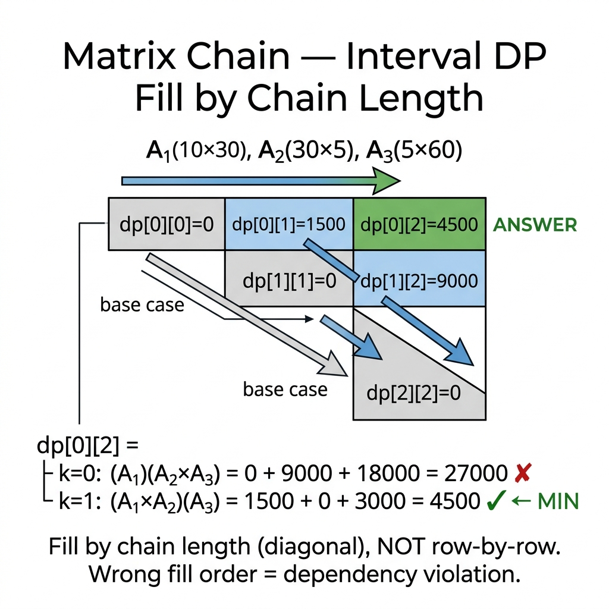

<!-- tags: dsa, algorithms -->
# 🔢 Matrix Chain Multiplication

> Multiplying 4 matrices A×B×C×D yields the same result regardless of order. However, the scalar multiplication count varies by 10x. Matrix Chain is the classic interval DP problem. You split a sequence at every point, pick the lowest split cost, and realize all optimal partition problems follow this pattern.

📅 Created: 2026-03-20 · 🔄 Updated: 2026-04-09 · ⏱️ 15 min read

---

## 1. DEFINE

Multiplying matrices in any order produces the same final dimensions, but the multiplication costs vary drastically. `Matrix Chain Multiplication` forces you to optimize across all possible split points rather than greedily picking the cheapest immediate pair.

This is a classic interval DP problem. The state is no longer a linear index but an interval. To solve it correctly, you must view every `[i..j]` interval as an independent subproblem with multiple splits, each bearing a distinct cost.

Core insight: **When a problem asks where to split for minimal cost, it strongly signals the interval DP family rather than a local greedy approach.**

| Metric         | Value                                                                           |
| -------------- | ------------------------------------------------------------------------------- |
| **Time**       | O(n³)                                                                           |
| **Space**      | O(n²)                                                                           |
| **Transition** | `dp[i][j] = min(dp[i][k] + dp[k+1][j] + dims[i-1]*dims[k]*dims[j])` for k∈[i,j) |
| **Pattern**    | Interval DP — subproblems on intervals [i, j]                                   |

---

| Variant | When to use | Core Idea |
| ------- | ------- | ------- |
| Standard Matrix Chain Order | To understand the invariant before optimizing | Trace the baseline manually to grasp the core invariant |
| Memoization Version | For problems with added states or constraints | Keep the invariant but add caching or auxiliary structures |

| Approach | Time | Space | When to use |
| --- | --- | --- | --- |
| Standard Matrix Chain Order | O(n³) | O(n²) | To understand the invariant before optimizing |
| Memoization Version | O(n³) | O(n²) | When states are sparse or recursive framing feels natural |

### 1.1 Quick Recognition

- The problem gives a sequence of matrices or segments needing aggregation with split-dependent costs.
- The subproblem result is the optimal cost over a contiguous interval.
- You must test every split point `k` between `i` and `j` to find the best configuration.

### 1.2 Invariants & Failure Modes

- `dp[i][j]` must represent the optimal cost to process the exact interval from `i` to `j`.
- Every split `k` is valid only when the left and right subproblems have been previously solved by ascending interval length.
- Common failure mode: messing up the dimensions array indices causes incorrect matrix multiplication logic despite sound reasoning.

## 2. VISUAL

Interval DP fills diagonally, not left-to-right. `dp[i][j]` stores the minimum cost to multiply matrices i through j. The trace below explains why filling by chain length is mandatory.

### Level 1 — Core intuition

```text
  A(10×30) × B(30×5) × C(5×60):

  (AB)C = 10×30×5 + 10×5×60 = 1500 + 3000 = 4500 ✓
  A(BC) = 30×5×60 + 10×30×60 = 9000 + 18000 = 27000 ✗

  → (AB)C is 6x better!
```

---

*Figure: (AB)C costs 4500 while A(BC) costs 27000. They yield the same result but differ by 6x in cost.*

### Level 2 — Decision trace

```text
Dimensions: [10, 30, 5, 60]  → 3 matrices: A₁(10×30), A₂(30×5), A₃(5×60)

Fill by chain length:
  len=1: dp[0][0]=0, dp[1][1]=0, dp[2][2]=0  (single matrix = 0 cost)
  
  len=2: dp[0][1] = 10×30×5 = 1500         (A₁×A₂)
         dp[1][2] = 30×5×60 = 9000         (A₂×A₃)
  
  len=3: dp[0][2] = min(
           k=0: dp[0][0] + dp[1][2] + 10×30×60 = 0+9000+18000 = 27000  (A₁)(A₂A₃)
           k=1: dp[0][1] + dp[2][2] + 10×5×60  = 1500+0+3000  = 4500   (A₁A₂)(A₃) ←MIN
         ) = 4500

Answer: 4500  (split at k=1: compute A₁A₂ first, then multiply by A₃)
```
*Figure: Filling by chain length ensures smaller subproblems are ready when computing larger intervals. Each split point k yields two subproblems and a merge cost.*



## 3. CODE

The trace shows the pattern: iterate chain length, iterate start position, iterate split point, compute min cost. Three implementations cover bottom-up, top-down memoization, and reconstruction.

### Problem 1: Basic — Standard Matrix Chain Order
> **Goal**: Find minimum scalar multiplications for a matrix chain using interval DP.
> **Approach**: `dp[i][j]` tracks the minimum cost for chain i..j. Iterate split k: add costs of subchains and the merge cost.
> **Example**: Dimensions [10,30,5,60] yields 4500 by splitting AB then multiplying C.
> **Complexity**: O(n³) time, O(n²) space.

```go
package dp

import (
    "fmt"
    "math"
)

func MatrixChainOrder(dims []int) (int, string) {
    n := len(dims) - 1
    if n <= 1 { return 0, "A1" }

    dp := make([][]int, n+1)
    split := make([][]int, n+1)
    for i := range dp {
        dp[i] = make([]int, n+1)
        split[i] = make([]int, n+1)
    }

    for l := 2; l <= n; l++ { // chain length
        for i := 1; i <= n-l+1; i++ {
            j := i + l - 1
            dp[i][j] = math.MaxInt64
            for k := i; k < j; k++ {
                cost := dp[i][k] + dp[k+1][j] + dims[i-1]*dims[k]*dims[j]
                if cost < dp[i][j] {
                    dp[i][j] = cost
                    split[i][j] = k
                }
            }
        }
    }
    return dp[1][n], buildParens(split, 1, n)
}

func buildParens(split [][]int, i, j int) string {
    if i == j { return fmt.Sprintf("A%d", i) }
    k := split[i][j]
    return fmt.Sprintf("(%s × %s)", buildParens(split, i, k), buildParens(split, k+1, j))
}
```

```typescript
function matrixChainOrder(dims: number[]): [number, string] {
    const n = dims.length - 1;
    if (n <= 1) return [0, 'A1'];
    const dp = Array.from({length: n+1}, () => Array(n+1).fill(0));
    const split = Array.from({length: n+1}, () => Array(n+1).fill(0));
    for (let l = 2; l <= n; l++)
        for (let i = 1; i <= n-l+1; i++) {
            const j = i+l-1; dp[i][j] = Infinity;
            for (let k = i; k < j; k++) {
                const c = dp[i][k]+dp[k+1][j]+dims[i-1]*dims[k]*dims[j];
                if (c < dp[i][j]) { dp[i][j] = c; split[i][j] = k; }
            }
        }
    const build = (i: number, j: number): string =>
        i===j ? `A${i}` : `(${build(i,split[i][j])} × ${build(split[i][j]+1,j)})`;
    return [dp[1][n], build(1, n)];
}
```

```rust
fn matrix_chain_order(dims: &[i64]) -> (i64, String) {
    let n = dims.len() - 1;
    if n <= 1 { return (0, "A1".into()); }
    let mut dp = vec![vec![0i64; n+1]; n+1];
    let mut split = vec![vec![0usize; n+1]; n+1];
    for l in 2..=n {
        for i in 1..=n-l+1 {
            let j = i+l-1; dp[i][j] = i64::MAX;
            for k in i..j {
                let c = dp[i][k]+dp[k+1][j]+dims[i-1]*dims[k]*dims[j];
                if c < dp[i][j] { dp[i][j] = c; split[i][j] = k; }
            }
        }
    }
    fn build(s: &[Vec<usize>], i: usize, j: usize) -> String {
        if i==j { format!("A{i}") }
        else { format!("({} × {})", build(s,i,s[i][j]), build(s,s[i][j]+1,j)) }
    }
    (dp[1][n], build(&split, 1, n))
}
```

```cpp
#include <climits>
std::pair<long long, std::string> matrixChainOrder(const std::vector<int>& dims) {
    int n = dims.size()-1;
    if (n <= 1) return {0, "A1"};
    std::vector dp(n+1, std::vector<long long>(n+1, 0));
    std::vector split(n+1, std::vector<int>(n+1, 0));
    for (int l=2;l<=n;l++) for (int i=1;i<=n-l+1;i++) {
        int j=i+l-1; dp[i][j]=LLONG_MAX;
        for (int k=i;k<j;k++) {
            auto c=dp[i][k]+dp[k+1][j]+(long long)dims[i-1]*dims[k]*dims[j];
            if (c<dp[i][j]) { dp[i][j]=c; split[i][j]=k; }
        }
    }
    std::function<std::string(int,int)> build=[&](int i, int j)->std::string {
        return i==j ? "A"+std::to_string(i)
            : "("+build(i,split[i][j])+" × "+build(split[i][j]+1,j)+")";
    };
    return {dp[1][n], build(1, n)};
}
```

```python
import math
def matrix_chain_order(dims: list[int]) -> tuple[int, str]:
    n = len(dims) - 1
    if n <= 1: return (0, 'A1')
    dp = [[0]*(n+1) for _ in range(n+1)]
    split = [[0]*(n+1) for _ in range(n+1)]
    for l in range(2, n+1):
        for i in range(1, n-l+2):
            j = i+l-1; dp[i][j] = math.inf
            for k in range(i, j):
                c = dp[i][k]+dp[k+1][j]+dims[i-1]*dims[k]*dims[j]
                if c < dp[i][j]: dp[i][j] = c; split[i][j] = k
    def build(i, j):
        return f'A{i}' if i==j else f'({build(i,split[i][j])} × {build(split[i][j]+1,j)})'
    return int(dp[1][n]), build(1, n)
```

```java
record MatrixChainResult(long cost, String order) {}

final class MatrixChain {
    private MatrixChain() {}

    static MatrixChainResult matrixChainOrder(int[] dims) {
        int n = dims.length - 1;
        if (n <= 1) {
            return new MatrixChainResult(0, "A1");
        }

        long[][] dp = new long[n + 1][n + 1];
        int[][] split = new int[n + 1][n + 1];

        for (int len = 2; len <= n; len++) {
            for (int i = 1; i <= n - len + 1; i++) {
                int j = i + len - 1;
                dp[i][j] = Long.MAX_VALUE;
                for (int k = i; k < j; k++) {
                    long cost = dp[i][k] + dp[k + 1][j] + (long) dims[i - 1] * dims[k] * dims[j];
                    if (cost < dp[i][j]) {
                        dp[i][j] = cost;
                        split[i][j] = k;
                    }
                }
            }
        }

        return new MatrixChainResult(dp[1][n], buildOrder(split, 1, n));
    }

    private static String buildOrder(int[][] split, int i, int j) {
        if (i == j) {
            return "A" + i;
        }
        int k = split[i][j];
        return "(" + buildOrder(split, i, k) + " × " + buildOrder(split, k + 1, j) + ")";
    }
}
```

> **Why?** Standard Matrix Chain Order works because every state definition guarantees its dependencies are available or cached. When states and fill-orders align correctly, we reuse subproblem results instead of recalculating them.

> **Conclusion**: Standard Matrix Chain serves as the baseline for Interval DP. For production, use bottom-up to fill all intervals and top-down when intervals are sparse.

### Problem 2: Intermediate — Memoization Version
> **Goal**: Implement top-down memoization as a recursive form for interval DP.
> **Approach**: `solve(i,j)` finds the min cost chain i..j using a 2D array or map cache.
> **Example**: Delivers the same result but computes on-demand rather than filling every cell.
> **Complexity**: O(n³) time, O(n²) space, plus O(n) stack.

```go
package dp

import "math"

func MatrixChainMemo(dims []int) int {
    n := len(dims) - 1
    memo := make(map[[2]int]int)
    return mcmHelper(dims, 1, n, memo)
}

func mcmHelper(dims []int, i, j int, memo map[[2]int]int) int {
    if i == j { return 0 }
    if v, ok := memo[[2]int{i, j}]; ok { return v }

    best := math.MaxInt64
    for k := i; k < j; k++ {
        cost := mcmHelper(dims, i, k, memo) + mcmHelper(dims, k+1, j, memo) + dims[i-1]*dims[k]*dims[j]
        if cost < best { best = cost }
    }
    memo[[2]int{i, j}] = best
    return best
}
```

```typescript
function matrixChainMemo(dims: number[]): number {
    const n = dims.length - 1, memo = new Map<string,number>();
    const helper = (i: number, j: number): number => {
        if (i === j) return 0; const key = `${i},${j}`;
        if (memo.has(key)) return memo.get(key)!;
        let best = Infinity;
        for (let k = i; k < j; k++) best = Math.min(best, helper(i,k)+helper(k+1,j)+dims[i-1]*dims[k]*dims[j]);
        memo.set(key, best); return best;
    };
    return helper(1, n);
}
```

```rust
fn matrix_chain_memo(dims: &[i64]) -> i64 {
    use std::collections::HashMap;
    let n = dims.len() - 1;
    fn helper(dims: &[i64], i: usize, j: usize, memo: &mut HashMap<(usize,usize), i64>) -> i64 {
        if i == j { return 0; }
        if let Some(&v) = memo.get(&(i,j)) { return v; }
        let mut best = i64::MAX;
        for k in i..j { best = best.min(helper(dims,i,k,memo)+helper(dims,k+1,j,memo)+dims[i-1]*dims[k]*dims[j]); }
        memo.insert((i,j), best); best
    }
    helper(dims, 1, n, &mut HashMap::new())
}
```

```cpp
long long matrixChainMemo(const std::vector<int>& dims) {
    int n = dims.size()-1;
    std::map<std::pair<int,int>, long long> memo;
    std::function<long long(int,int)> helper = [&](int i, int j) -> long long {
        if (i==j) return 0LL; auto key = std::make_pair(i,j);
        if (memo.count(key)) return memo[key];
        long long best = LLONG_MAX;
        for (int k=i;k<j;k++) best = std::min(best, helper(i,k)+helper(k+1,j)+(long long)dims[i-1]*dims[k]*dims[j]);
        return memo[key] = best;
    };
    return helper(1, n);
}
```

```python
def matrix_chain_memo(dims: list[int]) -> int:
    n = len(dims) - 1; memo = {}
    def helper(i, j):
        if i == j: return 0
        if (i, j) in memo: return memo[(i, j)]
        best = float('inf')
        for k in range(i, j):
            best = min(best, helper(i,k) + helper(k+1,j) + dims[i-1]*dims[k]*dims[j])
        memo[(i, j)] = best; return best
    return helper(1, n)
```

```java
import java.util.HashMap;
import java.util.Map;

final class MatrixChainMemo {
    private MatrixChainMemo() {}

    static long matrixChainMemo(int[] dims) {
        return helper(dims, 1, dims.length - 1, new HashMap<>());
    }

    private static long helper(int[] dims, int i, int j, Map<String, Long> memo) {
        if (i == j) {
            return 0;
        }

        String key = i + "," + j;
        if (memo.containsKey(key)) {
            return memo.get(key);
        }

        long best = Long.MAX_VALUE;
        for (int k = i; k < j; k++) {
            long cost = helper(dims, i, k, memo)
                + helper(dims, k + 1, j, memo)
                + (long) dims[i - 1] * dims[k] * dims[j];
            best = Math.min(best, cost);
        }

        memo.put(key, best);
        return best;
    }
}
```

> **Why?** The memoization version operates cleanly by deferring to recursion for dependency resolution. Caching answers prevents redundant subproblem calculations natively.

> **Conclusion**: Reconstruction in interval DP always requires an O(n²) split table. The pattern dictates saving the decision to reconstruct recursively.

---

## 4. PITFALLS

Matrix Chain errors typically involve improper fill orders or off-by-one errors mapping the dimensions array.

| # | Severity | Error | Consequence | Fix |
| --- | --- | --- | --- | --- |
| 1 | 🔴 Fatal | Confusing `dims[i-1]` with `dims[i]` | Invalid matrix multiplication operations | Matrix i has dims[i-1]×dims[i] |
| 2 | 🟡 Common | O(n³) runtime is too slow for n > 500 | Program times out on large sequences | Use Hu-Shing algorithm O(n log n) |
| 3 | 🟡 Common | Forgetting to fill by chain length | Dependencies remain uncomputed | Loop over length l=2,3,...,n |

---

## 5. REF

| Resource | Category | Link | Notes |
| -------- | ---- | ---- | ------- |
| Wikipedia | Reference | [en.wikipedia.org](https://en.wikipedia.org/wiki/Matrix_chain_multiplication) | Formal proof and history |
| CP-Algorithms | Tutorial | [cp-algorithms.com](https://cp-algorithms.com/dynamic_programming/interval-dp.html) | Interval DP patterns |
| Visualgo DP | Visualization | [visualgo.net](https://visualgo.net/en/recursion) | Interactive DP trace |

---

## 6. RECOMMEND

Matrix Chain establishes the interval DP foundation. The core pattern of splitting at k to optimize two halves repeats in Palindrome Partition, Burst Balloons, and Optimal BST. These form the three main DP families alongside 1D and 2D grids.

| Extension | When to use | Reason |
| ---------------------- | ------------------ | -------------------------------- |
| **Memoization**        | Top-down intuition | Avoids unnecessary recomputation |
| **Hu-Shing Algorithm** | O(n log n) scaling | Optimal for heavy special cases  |
| **Interval DP**        | General patterns   | Parenthesization, Burst Balloons |
| **Parallel chains**    | GPU or multi-core  | Splits interval computation      |

---

## 7. QUICK REF

| # | Pattern | Code |
|---|---------|------|
| 1 | DP init | `dp := make([][]int, n); for i := range dp { dp[i] = make([]int, n) }  // dp[i][j] = min ops` |
| 2 | Fill by length | `for l := 2; l < n; l++ { for i := 0; i < n-l; i++ { j := i+l; dp[i][j]=math.MaxInt; for k:=i;k<j;k++ { cost := dp[i][k]+dp[k+1][j]+dims[i]*dims[k+1]*dims[j+1]; dp[i][j]=min(dp[i][j],cost) } } }` |
| 3 | Complexity | `// O(n³) time · O(n²) space` |
| 4 | Interval DP pattern | `// Template: for length l; for start i; j=i+l; for split k` |
| 5 | When to use | `// Matrix chain, optimal BST, polygon triangulation, burst balloons` |

---

Returning to the opening question: why does the multiplication order swing the cost 10x? Matrix multiplication cost is not commutative. Interval DP tests every split point in O(n³) time to bypass the exponential n-th Catalan number bound of brute force.

**Links**: [← Knapsack](./03-knapsack.md) · [→ Coin Change](./05-coin-change.md)
