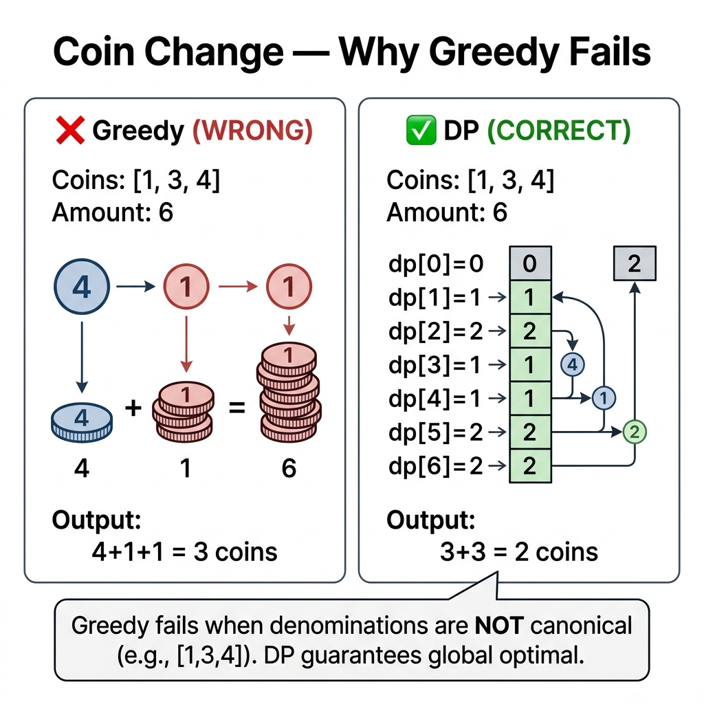

<!-- tags: dsa, algorithms -->
# 🪙 Coin Change Problem

> The ATM dispenses 50, 20, and 10 notes. You must exchange 73 into the fewest notes. Greedily taking the largest notes fails here. Coin Change teaches that greedy algorithms fail when denominations are non-canonical, making DP the only optimal path.

📅 Created: 2026-03-20 · 🔄 Updated: 2026-04-09 · ⏱️ 15 min read

---

## 1. DEFINE

You debug a solution that looks correct but hits TLE or fails final edge cases. The 🪙 Coin Change Problem only clicks when you see the true invariant anchoring the solution.

Using the exact same coin set, one problem asks for the minimum coins, another for the total ways to form an amount, and another allows infinite coin reuse. `Coin Change` is difficult because choosing the wrong state meaning ruins the entire transition logic.

This problem differentiates "optimization DP" from "counting DP". Changing the final question alters the initialization, sentinel values, and update order for the exact same input.

Core insight: **Before writing any code, strictly determine whether the problem asks to minimize coins, count ways, or check reachability.**

| Variant        | Time        | Space     | Description           |
| --- | --- | --- | --- |
| **Min Coins**  | O(n×amount) | O(amount) | Minimum number of coins |
| **Count Ways** | O(n×amount) | O(amount) | Total number of combinations |

---

| Approach | Time | Space | When to use |
| -------- | ---- | ----- | -------- |
| Min Coins | O(n×amount) | O(amount) | To understand the invariant before optimizing |
| Count Ways (Combinations) | O(n×amount) | O(amount) | When space constraints are tight or counting is required |
| Min Coins with Trace | O(n×amount) | O(amount) | To reconstruct the exact coins used |
| Greedy Fails — Why DP is needed | O(n) | O(1) | To demonstrate why canonical systems allow greedy approaches |

### 1.1 Quick Recognition

- The problem provides a set of `coins` and a target `amount`.
- Coins can often be reused, pointing to `unbounded knapsack` or counting DP.
- Variations depend heavily on the meaning of `dp[x]` and loop ordering.

### 1.2 Invariants & Failure Modes

- Ensure `dp[x]` represents a singular meaning: min coins, number of ways, or reachable state.
- Sentinel values like `inf` or `0` must align with the problem question to distinguish "unreachable" from "reachable with zero ways".
- Common failure mode: copying the counting loop into a minimization problem, yielding seemingly reasonable but semantically broken states.

## 2. VISUAL

Coin Change represents an unbounded knapsack where each coin is reusable. The 1D array `dp[amount]` asks for the minimum coins to reach that amount. The trace below shows why greedy fails and DP succeeds.

### Level 1 — Core intuition

```text
  coins = [1, 5, 10], amount = 12

  dp: [0, 1, 2, 3, 4, 1, 2, 3, 4, 5, 1, 2, 3]
       ↑                 ↑              ↑
      0xu               5+1=1xu        10+1+1=3xu

  Answer: dp[12] = 3 (10 + 1 + 1)
```

---

*Caption*: 🪙 Coin Change Problem Level 1 shows core intuition. Level 2 details the state update sequence from input to answer.

### Level 2 — Decision trace

- With the 🪙 Coin Change Problem, start from the smallest state retaining enough information to represent the original subproblem.
- The 🪙 Coin Change transition must only depend on states previously computed or validly cached.
- Lock down the base cases and fill order for 🪙 Coin Change before optimizing space, as wrong orders break the table.
- When the 🪙 Coin Change state table stabilizes, the answer drops into the specific cell representing the root problem.



## 3. CODE

The trace shows `dp[a] = min(dp[a-coin]+1)` for every coin. These two problems—min coins for optimization and count ways for counting—use the same table size but distinct transitions.

### Problem 1: Basic — Min Coins
> **Goal**: Find the minimum coins to form an amount, returning -1 if impossible.
> **Approach**: `dp[a] = min(dp[a-coin]+1)` for all valid coins. Initialize `dp[0]=0` and the rest to infinity.
> **Example**: coins=[1,3,4] with amount=6 yields dp[6]=2 using 3+3.
> **Complexity**: O(amount × len(coins)) time, O(amount) space.

```go
package dp

import "math"

func CoinChangeMin(coins []int, amount int) int {
    dp := make([]int, amount+1)
    for i := range dp { dp[i] = math.MaxInt64 }
    dp[0] = 0

    for a := 1; a <= amount; a++ {
        for _, coin := range coins {
            if coin <= a && dp[a-coin] != math.MaxInt64 {
                if dp[a-coin]+1 < dp[a] {
                    dp[a] = dp[a-coin] + 1
                }
            }
        }
    }
    if dp[amount] == math.MaxInt64 { return -1 }
    return dp[amount]
}
```

```typescript
function coinChangeMin(coins: number[], amount: number): number {
    const dp = Array(amount+1).fill(Infinity); dp[0] = 0;
    for (let a = 1; a <= amount; a++)
        for (const c of coins) if (c <= a) dp[a] = Math.min(dp[a], dp[a-c]+1);
    return dp[amount] === Infinity ? -1 : dp[amount];
}
```

```rust
fn coin_change_min(coins: &[i32], amount: usize) -> i32 {
    let mut dp = vec![i32::MAX; amount+1]; dp[0] = 0;
    for a in 1..=amount {
        for &c in coins { if (c as usize) <= a && dp[a - c as usize] != i32::MAX {
            dp[a] = dp[a].min(dp[a - c as usize] + 1); } }
    }
    if dp[amount] == i32::MAX { -1 } else { dp[amount] }
}
```

```cpp
int coinChangeMin(const std::vector<int>& coins, int amount) {
    std::vector<int> dp(amount+1, INT_MAX); dp[0] = 0;
    for (int a = 1; a <= amount; a++)
        for (int c : coins) if (c <= a && dp[a-c] != INT_MAX) dp[a] = std::min(dp[a], dp[a-c]+1);
    return dp[amount] == INT_MAX ? -1 : dp[amount];
}
```

```python
def coin_change_min(coins: list[int], amount: int) -> int:
    dp = [float('inf')] * (amount + 1); dp[0] = 0
    for a in range(1, amount + 1):
        for c in coins:
            if c <= a: dp[a] = min(dp[a], dp[a - c] + 1)
    return dp[amount] if dp[amount] != float('inf') else -1
```

> **Why?** Min Coins works because each state defines its dependencies cleanly so they are available or cached. Correct states and fill orders let you reuse results instead of solving overlapping subproblems.

> **Conclusion**: Reconstructing the exact coins requires tracking parents, which adds an O(amount) space trade-off.

### Problem 2: Intermediate — Count Ways (Combinations)
> **Goal**: Count the ways to form an amount using combinations of coins.
> **Approach**: Accumulate `dp[a] += dp[a-coin]`. Coins in the outer loop track combinations, while amount in the outer loop tracks permutations.
> **Example**: coins=[1,2,5] for amount=5 yields 4 ways.
> **Complexity**: O(amount × len(coins)) time, O(amount) space.

```go
package dp

// ⚠ Coins outer loop generates combinations (order does not matter)
func CoinChangeCount(coins []int, amount int) int {
    dp := make([]int, amount+1)
    dp[0] = 1
    for _, coin := range coins { // coins outer → combos
        for a := coin; a <= amount; a++ {
            dp[a] += dp[a-coin]
        }
    }
    return dp[amount]
}

// Amount outer loop generates permutations (order matters)
func CoinChangePermutations(coins []int, amount int) int {
    dp := make([]int, amount+1)
    dp[0] = 1
    for a := 1; a <= amount; a++ { // amount outer → perms
        for _, coin := range coins {
            if coin <= a { dp[a] += dp[a-coin] }
        }
    }
    return dp[amount]
}
```

```typescript
function coinChangeCount(coins: number[], amount: number): number {
    const dp = Array(amount+1).fill(0); dp[0] = 1;
    for (const c of coins) for (let a = c; a <= amount; a++) dp[a] += dp[a-c];
    return dp[amount];
}
function coinChangePerms(coins: number[], amount: number): number {
    const dp = Array(amount+1).fill(0); dp[0] = 1;
    for (let a = 1; a <= amount; a++) for (const c of coins) if (c <= a) dp[a] += dp[a-c];
    return dp[amount];
}
```

```rust
fn coin_change_count(coins: &[i32], amount: usize) -> i64 {
    let mut dp = vec![0i64; amount+1]; dp[0] = 1;
    for &c in coins { for a in c as usize..=amount { dp[a] += dp[a - c as usize]; } }
    dp[amount]
}
fn coin_change_perms(coins: &[i32], amount: usize) -> i64 {
    let mut dp = vec![0i64; amount+1]; dp[0] = 1;
    for a in 1..=amount { for &c in coins { if (c as usize) <= a { dp[a] += dp[a - c as usize]; } } }
    dp[amount]
}
```

```cpp
long long coinChangeCount(const std::vector<int>& coins, int amount) {
    std::vector<long long> dp(amount+1, 0); dp[0] = 1;
    for (int c : coins) for (int a = c; a <= amount; a++) dp[a] += dp[a-c];
    return dp[amount];
}
```

```python
def coin_change_count(coins: list[int], amount: int) -> int:
    dp = [0] * (amount + 1); dp[0] = 1
    for c in coins:
        for a in range(c, amount + 1): dp[a] += dp[a - c]
    return dp[amount]
def coin_change_perms(coins: list[int], amount: int) -> int:
    dp = [0] * (amount + 1); dp[0] = 1
    for a in range(1, amount + 1):
        for c in coins:
            if c <= a: dp[a] += dp[a - c]
    return dp[amount]
```

> **Why?** Count Ways works because each state builds upon correctly cached dependencies. The loop order strictly separates combinations from permutations by forcing item ordering.

> **Conclusion**: The production pattern generalizes the core DP by adding constraints or processing parallel paths based on the requirement.

### Problem 3: Advanced — Min Coins with Trace
> **Goal**: Reconstruct the exact coin combination for the minimal change.
> **Approach**: Add a parent array recording the coin used to reach each amount. Backtrack from the target amount.
> **Example**: coins=[1,3,4], amount=6 builds a trace of 6←3←0, yielding coins [3,3].
> **Complexity**: O(amount × coins) time, O(amount) extra space.

```go
package dp

import "math"

func CoinChangeTrace(coins []int, amount int) (int, []int) {
    dp := make([]int, amount+1)
    used := make([]int, amount+1)
    for i := range dp { dp[i] = math.MaxInt64 }
    dp[0] = 0

    for a := 1; a <= amount; a++ {
        for _, coin := range coins {
            if coin <= a && dp[a-coin] != math.MaxInt64 && dp[a-coin]+1 < dp[a] {
                dp[a] = dp[a-coin] + 1
                used[a] = coin
            }
        }
    }

    if dp[amount] == math.MaxInt64 { return -1, nil }

    var result []int
    for a := amount; a > 0; a -= used[a] {
        result = append(result, used[a])
    }
    return dp[amount], result
}
```

```typescript
function coinChangeTrace(coins: number[], amount: number): [number, number[]] {
    const dp = Array(amount+1).fill(Infinity), used = Array(amount+1).fill(0); dp[0] = 0;
    for (let a = 1; a <= amount; a++)
        for (const c of coins) if (c <= a && dp[a-c] !== Infinity && dp[a-c]+1 < dp[a]) { dp[a] = dp[a-c]+1; used[a] = c; }
    if (dp[amount] === Infinity) return [-1, []];
    const res: number[] = []; for (let a = amount; a > 0; a -= used[a]) res.push(used[a]);
    return [dp[amount], res];
}
```

```rust
fn coin_change_trace(coins: &[i32], amount: usize) -> (i32, Vec<i32>) {
    let mut dp = vec![i32::MAX; amount+1]; let mut used = vec![0i32; amount+1]; dp[0] = 0;
    for a in 1..=amount { for &c in coins {
        let cu = c as usize;
        if cu <= a && dp[a-cu] != i32::MAX && dp[a-cu]+1 < dp[a] { dp[a] = dp[a-cu]+1; used[a] = c; }
    }}
    if dp[amount] == i32::MAX { return (-1, vec![]); }
    let mut res = vec![]; let mut a = amount;
    while a > 0 { res.push(used[a]); a -= used[a] as usize; }
    (dp[amount], res)
}
```

```cpp
std::pair<int, std::vector<int>> coinChangeTrace(const std::vector<int>& coins, int amount) {
    std::vector<int> dp(amount+1, INT_MAX), used(amount+1, 0); dp[0] = 0;
    for (int a=1;a<=amount;a++) for (int c:coins)
        if (c<=a && dp[a-c]!=INT_MAX && dp[a-c]+1<dp[a]) { dp[a]=dp[a-c]+1; used[a]=c; }
    if (dp[amount]==INT_MAX) return {-1, {}};
    std::vector<int> res; for (int a=amount;a>0;a-=used[a]) res.push_back(used[a]);
    return {dp[amount], res};
}
```

```python
def coin_change_trace(coins: list[int], amount: int) -> tuple[int, list[int]]:
    dp = [float('inf')]*(amount+1); used = [0]*(amount+1); dp[0] = 0
    for a in range(1, amount+1):
        for c in coins:
            if c <= a and dp[a-c] != float('inf') and dp[a-c]+1 < dp[a]:
                dp[a] = dp[a-c]+1; used[a] = c
    if dp[amount] == float('inf'): return -1, []
    res, a = [], amount
    while a > 0: res.append(used[a]); a -= used[a]
    return dp[amount], res
```

> **Why?** Tracking the minimal coin path leverages the defined states to ensure each cached choice remains optimal. Correct fill orders reuse subproblems instead of solving them repetitively.

> **Conclusion**: Multi-currency scenarios demand batch DP. Each currency set computes independently, making it naturally parallelizable.

### Problem 4: Expert — Greedy Fails — Why DP is needed
> **Goal**: Demonstrate how greedy minimization fails with non-canonical denominations.
> **Approach**: Build a greedy algorithm that picks the largest coin first and show it failing on [1, 3, 4] for amount 6.
> **Example**: Greedy picks 4,1,1 (3 coins), while DP finds 3+3 (2 coins).
> **Complexity**: O(coins log coins) time for greedy sorting.

```go
package dp

import "fmt"

// Greedy: always pick largest coin first
// FAILS for non-canonical coin sets!
func CoinChangeGreedy(coins []int, amount int) int {
    // Sort DESC
    sorted := make([]int, len(coins))
    copy(sorted, coins)
    for i := 0; i < len(sorted)-1; i++ {
        for j := i+1; j < len(sorted); j++ {
            if sorted[j] > sorted[i] { sorted[i], sorted[j] = sorted[j], sorted[i] }
        }
    }

    count := 0
    for _, coin := range sorted {
        count += amount / coin
        amount %= coin
    }
    if amount != 0 { return -1 }
    return count
}

func main() {
    // Greedy works for canonical systems: coins = [1, 5, 10, 25]
    fmt.Println("Greedy [1,5,10,25] for 36:", CoinChangeGreedy([]int{1, 5, 10, 25}, 36)) // 3

    // Greedy FAILS for arbitrary systems: coins = [1, 3, 4]
    fmt.Println("Greedy [1,3,4] for 6:", CoinChangeGreedy([]int{1, 3, 4}, 6)) // 3 (4+1+1) ❌
    fmt.Println("DP     [1,3,4] for 6:", CoinChangeMin([]int{1, 3, 4}, 6))    // 2 (3+3) ✅
}
```

```typescript
function coinChangeGreedy(coins: number[], amount: number): number {
    coins.sort((a,b) => b - a);
    let count = 0;
    for (const c of coins) { count += Math.floor(amount / c); amount %= c; }
    return amount !== 0 ? -1 : count;
}
// Greedy FAILS: coins=[1,3,4], amount=6 → 3 (4+1+1) ❌, DP → 2 (3+3) ✅
```

```rust
fn coin_change_greedy(coins: &mut [i32], amount: i32) -> i32 {
    coins.sort_by(|a,b| b.cmp(a));
    let (mut count, mut rem) = (0, amount);
    for &c in coins.iter() { count += rem / c; rem %= c; }
    if rem != 0 { -1 } else { count }
}
```

```cpp
int coinChangeGreedy(std::vector<int> coins, int amount) {
    std::sort(coins.rbegin(), coins.rend());
    int count = 0;
    for (int c : coins) { count += amount / c; amount %= c; }
    return amount != 0 ? -1 : count;
}
```

```python
def coin_change_greedy(coins: list[int], amount: int) -> int:
    coins = sorted(coins, reverse=True)
    count = 0
    for c in coins: count += amount // c; amount %= c
    return count if amount == 0 else -1
# Greedy FAILS: coins=[1,3,4], amount=6 → 3 (4+1+1) ❌, DP → 2 (3+3) ✅
```

> **Why?** Greedy logic fails because it ignores future consequences. DP proves its worth by evaluating all overlapping subproblems thoroughly instead of blindly locking the largest local choice.

> **Conclusion**: Use greedy algorithms only when mathematically proven for canonical coin systems. Otherwise, rely on batch DP.

---

## 4. PITFALLS

Coin Change errors typically involve incorrect loop orders for combos versus perms, wrong initialization, or trusting greedy logic on non-canonical denominations.

| # | Severity | Error | Consequence | Fix |
| --- | --- | --- | --- | --- |
| 1 | 🔴 Fatal | Greedy applied to arbitrary coins | Suboptimal answers | Greedy only works for canonical coin sets |
| 2 | 🟡 Common | Combos vs Perms loop order | Counts permutations instead of combinations | Coins outer loop for combos, Amount outer for perms |
| 3 | 🟡 Common | Forgetting the `dp[a-coin] != MaxInt` check | Integer overflows | Guard against overflow |

---

## 5. REF

| Resource               | Link                                                                    |
| ---------------------- | ----------------------------------------------------------------------- |
| LeetCode Coin Change   | [leetcode.com](https://leetcode.com/problems/coin-change/)              |
| LeetCode Coin Change 2 | [leetcode.com](https://leetcode.com/problems/coin-change-ii/)           |
| Wikipedia              | [en.wikipedia.org](https://en.wikipedia.org/wiki/Change-making_problem) |

---

## 6. RECOMMEND

Coin Change serves as an unbounded knapsack with a forward loop and item reuse. Blocking item reuse creates a 0/1 Knapsack with a reverse loop.

| Extension | When to use | Reason |
| ---------------------- | -------------------------------- | ---------------------------- |
| **Min coins**          | Fewest coins to reach an amount | Classic DP optimization      |
| **Count ways**         | Total valid combinations | Order does not matter        |
| **Count permutations** | Total valid permutations | Order strictly matters       |
| **Greedy**             | Special coin systems like 1,5,10,25 | O(1) runtime for canonical sets |
| **BFS approach**       | Small target amounts | Interprets it as shortest path |

---

## 7. QUICK REF

| # | Pattern | Code |
|---|---------|------|
| 1 | Min coins | `dp := make([]int, amount+1); for i := range dp { dp[i]=amount+1 }; dp[0]=0; for i:=1;i<=amount;i++ { for _,c := range coins { if c<=i { dp[i]=min(dp[i],dp[i-c]+1) } } }` |
| 2 | Check reachable | `if dp[amount] > amount { return -1 }; return dp[amount]` |
| 3 | Count ways | `dp[0]=1; for _,c := range coins { for i:=c;i<=amount;i++ { dp[i]+=dp[i-c] } }` |
| 4 | Complexity | `// O(amount × len(coins)) time · O(amount) space` |
| 5 | Unbounded knapsack | `// Identical pattern: coins act as items, amount acts as capacity` |
| 6 | When to use | `// Making change, finding ways to reach targets, partition subsets` |

**Links**: [← Matrix Chain](./04-matrix-chain.md) · [← README](./README.md)
