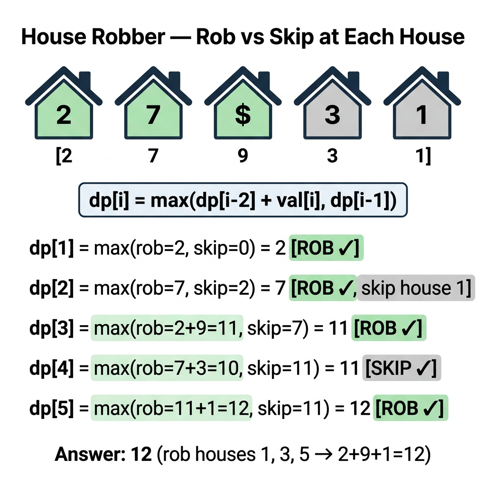

<!-- tags: dsa, algorithms -->
# 🏠 House Robber Pattern

> House Robber serves as an excellent introduction to linear DP with local choice. Each state solely concerns whether to rob the current house or skip it.

📅 Created: 2026-04-01 · 🔄 Updated: 2026-04-09 · ⏱️ 16 min read

| Aspect | Detail |
| ------ | ------ |
| **Complexity focus** | O(n) time; O(1) or O(n) space depending on the variant |
| **Use case** | Non-adjacent selection, circular adjacency, tree DP extensions |
| **Related** | Fibonacci, Kadane, Tree DP |

---

## 1. DEFINE

<!-- [Beginner layer] -->

The robber narrative often distracts from the core essence: this is a linear selection problem with a strict non-adjacency constraint. `House Robber` excels at teaching you how to compress DP states down to just a few variables.

The key learning point is the trade-off between taking the current house or skipping it to preserve the best prior result. Once you articulate these two branches, the rest is just implementing the state compactly.

Core insight: **A beautiful 1D DP problem usually features a few competing choices. Your task is to ensure each choice maps to a meaningful state.**

| Variant | Question | State |
| ------- | ------- | ----- |
| House Robber I | Straight line, cannot pick adjacent houses | `dp[i] = best up to i` |
| House Robber II | Circular line, first borders last | Split into `rob[0..n-2]` and `rob[1..n-1]` |
| House Robber III | Data forms a binary tree | Node returns `(take, skip)` or recurses grandchildren |

| Approach | Time | Space | When to use |
| --- | --- | --- | --- |
| House Robber I | O(n) | O(1) | To understand the invariant before optimizing |
| House Robber II (circular street) | O(n) | O(1) | When adding constraints to the basic pattern |
| House Robber III (tree DP) | O(n) | O(h) | To scale up to hierarchical data structures |

### 1.1 Quick Recognition

- The problem features a linear sequence of values and forbids selecting adjacent elements.
- The question demands maximizing a total sum, profit, or benefit.
- Common variations involve circular arrays, tree structures, or reconstructing the selection path.

### 1.2 Invariants & Failure Modes

- At position `i`, the decision must rely exclusively on the best sums up to `i-1` and `i-2`.
- Taking `nums[i]` strictly requires combining it with the state that ignores `i-1`.
- Common failure mode: applying a greedy "take the largest nearby number" strategy, which collapses when long-term benefits hide further down.

## 2. VISUAL

In DP, an abstract formula remains meaningless until you trace the state and fill-order on a small example. The trace below illustrates what each cell represents and why the fill order dictates success.

### Level 1 — Core intuition

```text
at house i:
  skip i -> best(i-1)
  take i -> best(i-2) + nums[i]
choose max(skip, take)
```

*Figure: Each house faces two choices: rob to gain dp[i-2]+val, or skip to keep dp[i-1]. The maximum defines dp[i].*



### Level 2 — Decision trace

- With the 🏠 House Robber Pattern, start from the smallest state retaining enough information to represent the original subproblem.
- The 🏠 House Robber transition must only depend on states previously computed or validly cached.
- Lock down the base cases and fill order for 🏠 House Robber before optimizing space, as wrong orders break the table.
- When the 🏠 House Robber state table stabilizes, the answer drops into the specific cell representing the root problem.

## 3. CODE

Once the state is locked, DP code holds no surprises. Start with the most provable version, then compress the state or pivot the approach when clear benefits arise.

### Problem 1: Basic — House Robber I

> **Goal**: Maximize stolen money on a straight street without picking adjacent houses.
> **Approach**: Use a rolling DP with `prev2` and `prev1` instead of a full array.
> **Example**: `[2,7,9,3,1] -> 12`.
> **Complexity**: O(n) time, O(1) space.

```go
// house_robber.go — House Robber I: rolling DP
package dynamicprogramming

func Rob(nums []int) int {
    prev2, prev1 := 0, 0
    for _, money := range nums {
        take := prev2 + money
        skip := prev1
        prev2 = prev1
        if take > skip {
            prev1 = take
        } else {
            prev1 = skip
        }
    }
    return prev1
}
```

```typescript
// house_robber.ts — House Robber I: rolling DP
export function rob(nums: number[]): number {
  let prev2 = 0;
  let prev1 = 0;
  for (const money of nums) {
    const take = prev2 + money;
    const skip = prev1;
    prev2 = prev1;
    prev1 = Math.max(take, skip);
  }
  return prev1;
}
```

```rust
// house_robber.rs — House Robber I: rolling DP
pub fn rob(nums: &[i32]) -> i32 {
    let (mut prev2, mut prev1) = (0, 0);
    for &money in nums {
        let take = prev2 + money;
        let skip = prev1;
        prev2 = prev1;
        prev1 = take.max(skip);
    }
    prev1
}
```

```cpp
// house_robber.cpp — House Robber I: rolling DP
int rob(const std::vector<int>& nums) {
    int prev2 = 0, prev1 = 0;
    for (int money : nums) {
        int take = prev2 + money;
        int skip = prev1;
        prev2 = prev1;
        prev1 = std::max(take, skip);
    }
    return prev1;
}
```

```python
# house_robber.py — House Robber I: rolling DP
def rob(nums: list[int]) -> int:
    prev2, prev1 = 0, 0
    for money in nums:
        take = prev2 + money
        skip = prev1
        prev2 = prev1
        prev1 = max(take, skip)
    return prev1
```

```java
// HouseRobber.java — House Robber I: rolling DP
public final class HouseRobber {
    private HouseRobber() {}

    public static int rob(int[] nums) {
        int prev2 = 0;
        int prev1 = 0;
        for (int money : nums) {
            int take = prev2 + money;
            int skip = prev1;
            prev2 = prev1;
            prev1 = Math.max(take, skip);
        }
        return prev1;
    }
}
```

> **Why?** House Robber I works because each state defines its dependencies cleanly so they are available or cached. Correct states and fill orders let you reuse results instead of solving overlapping subproblems.

> **Conclusion**: Basic House Robber teaches you to view DP as a binary "take or skip" decision, abandoning vague `dp` arrays.

### Problem 2: Intermediate — House Robber II (circular street)

> **Goal**: Process a circular street where the first and last houses touch.
> **Approach**: You cannot take both ends. Solve two independent linear subproblems: omit the first house, then omit the last house.
> **Example**: `[2,3,2] -> 3`, `[1,2,3,1] -> 4`.
> **Complexity**: O(n) time, O(1) extra space.

```go
// house_robber_ii.go — House Robber II: split circle into two linear runs
func RobCircle(nums []int) int {
    n := len(nums)
    if n == 1 {
        return nums[0]
    }
    return maxInt(Rob(nums[:n-1]), Rob(nums[1:]))
}

func maxInt(a, b int) int {
    if a > b { return a }
    return b
}
```

```typescript
// house_robber_ii.ts — House Robber II: split circle into two linear runs
import { rob } from './house_robber';
export function robCircle(nums: number[]): number {
  if (nums.length === 1) return nums[0];
  return Math.max(rob(nums.slice(0, -1)), rob(nums.slice(1)));
}
```
```rust
// house_robber_ii.rs — House Robber II: split circle into two linear runs
use crate::house_robber::rob;
pub fn rob_circle(nums: &[i32]) -> i32 {
    if nums.len() == 1 { return nums[0]; }
    rob(&nums[..nums.len()-1]).max(rob(&nums[1..]))
}
```
```cpp
// house_robber_ii.cpp — House Robber II: split circle into two linear runs
int robLinear(const std::vector<int>& nums);
int robCircle(const std::vector<int>& nums) {
    if (nums.size() == 1) return nums[0];
    return std::max(
        robLinear(std::vector<int>(nums.begin(), nums.end() - 1)),
        robLinear(std::vector<int>(nums.begin() + 1, nums.end()))
    );
}
```
```python
# house_robber_ii.py — House Robber II: split circle into two linear runs
from house_robber import rob

def rob_circle(nums: list[int]) -> int:
    if len(nums) == 1:
        return nums[0]
    return max(rob(nums[:-1]), rob(nums[1:]))
```
```java
// HouseRobberII.java — House Robber II: split circle into two linear runs
public static int robCircle(int[] nums) {
    if (nums.length == 1) return nums[0];
    return Math.max(rob(java.util.Arrays.copyOf(nums, nums.length - 1)),
                    rob(java.util.Arrays.copyOfRange(nums, 1, nums.length)));
}
```

> **Why?** House Robber II splits the circle cleanly. By defining the states explicitly, it relies on cached subproblems and correctly limits edge dependencies.

> **Conclusion**: Variant II serves as the template for breaking circles into straight lines, a pattern that repeats across circular DP challenges.

### Problem 3: Advanced — House Robber III (tree DP)

> **Goal**: Elevate the pattern from an array to a tree, where adjacency means parent-child relations.
> **Approach**: Every node returns two values: `take` if robbed, and `skip` if left alone.
> **Example**: `take(root) = root.Val + skip(left) + skip(right)`.
> **Complexity**: O(n) time, O(h) stack space.

```go
// house_robber_iii.go — House Robber III: tree DP with take/skip states
func RobTree(root *TreeNode) int {
    take, skip := robTreeDP(root)
    return maxInt(take, skip)
}

func robTreeDP(node *TreeNode) (take int, skip int) {
    if node == nil {
        return 0, 0
    }

    leftTake, leftSkip := robTreeDP(node.Left)
    rightTake, rightSkip := robTreeDP(node.Right)

    take = node.Val + leftSkip + rightSkip
    skip = maxInt(leftTake, leftSkip) + maxInt(rightTake, rightSkip)
    return take, skip
}
```

```typescript
// house_robber_iii.ts — House Robber III: tree DP with take/skip states
export function robTree(root: TreeNode | null): number {
  const [take, skip] = robTreeDp(root);
  return Math.max(take, skip);
}
function robTreeDp(node: TreeNode | null): [number, number] {
  if (!node) return [0, 0];
  const [leftTake, leftSkip] = robTreeDp(node.left);
  const [rightTake, rightSkip] = robTreeDp(node.right);
  const take = node.val + leftSkip + rightSkip;
  const skip = Math.max(leftTake, leftSkip) + Math.max(rightTake, rightSkip);
  return [take, skip];
}
```
```rust
// house_robber_iii.rs — House Robber III: tree DP with take/skip states
pub fn rob_tree(root: &Node) -> i32 {
    let (take, skip) = rob_tree_dp(root);
    take.max(skip)
}
pub fn rob_tree_dp(node: &Node) -> (i32, i32) {
    let Some(current) = node else { return (0, 0); };
    let current = current.borrow();
    let (lt, ls) = rob_tree_dp(&current.left);
    let (rt, rs) = rob_tree_dp(&current.right);
    (current.val + ls + rs, lt.max(ls) + rt.max(rs))
}
```
```cpp
// house_robber_iii.cpp — House Robber III: tree DP with take/skip states
std::pair<int, int> robTreeDp(TreeNode* node) {
    if (!node) return {0, 0};
    auto [lt, ls] = robTreeDp(node->left);
    auto [rt, rs] = robTreeDp(node->right);
    int take = node->val + ls + rs;
    int skip = std::max(lt, ls) + std::max(rt, rs);
    return {take, skip};
}
```
```python
# house_robber_iii.py — House Robber III: tree DP with take/skip states
def rob_tree(root: TreeNode | None) -> int:
    take, skip = rob_tree_dp(root)
    return max(take, skip)

def rob_tree_dp(node: TreeNode | None) -> tuple[int, int]:
    if node is None:
        return 0, 0
    left_take, left_skip = rob_tree_dp(node.left)
    right_take, right_skip = rob_tree_dp(node.right)
    take = node.val + left_skip + right_skip
    skip = max(left_take, left_skip) + max(right_take, right_skip)
    return take, skip
```
```java
// HouseRobberIII.java — House Robber III: tree DP with take/skip states
public static int robTree(TreeNode root) {
    int[] result = robTreeDp(root);
    return Math.max(result[0], result[1]);
}
private static int[] robTreeDp(TreeNode node) {
    if (node == null) return new int[]{0, 0};
    int[] left = robTreeDp(node.left);
    int[] right = robTreeDp(node.right);
    int take = node.val + left[1] + right[1];
    int skip = Math.max(left[0], left[1]) + Math.max(right[0], right[1]);
    return new int[]{take, skip};
}
```

> **Why?** Tree DP maintains the core logic of well-defined states. By passing up `take` and `skip` values simultaneously, it evaluates dependent local choices without redundant recursion.

> **Conclusion**: The advanced tree variant demonstrates that House Robber is fundamentally a template. You decide whether to select the current node, while the topology dictates the shape of the state transition.

## 4. PITFALLS

DP rarely fails due to missing loops. It fails on state semantics, sentinels, base cases, and off-by-one fill orders.

| # | Severity | Error | Consequence | Fix |
| --- | --- | --- | --- | --- |
| 1 | 🔴 Fatal | Vague state definitions | Recurrences cannot adapt to new variations | Write out `dp[i]` or `(take, skip)` clearly before coding |
| 2 | 🟡 Common | Applying linear logic to circular arrays | Double-counting or breaking adjacency rules | Split the circle into two strict linear subproblems |
| 3 | 🟡 Common | Tree logic returning single values | Parent nodes lack necessary decision context | Return explicit `(take, skip)` tuple sets |
| 4 | 🔵 Minor | Using full `dp` arrays needlessly | Wastes memory and muddles the active state | Employ rolling variables for the linear variant |

## 5. REF

| Resource | Link |
| -------- | ---- |
| LeetCode 198 — House Robber | https://leetcode.com/problems/house-robber/ |
| LeetCode 213 — House Robber II | https://leetcode.com/problems/house-robber-ii/ |
| LeetCode 337 — House Robber III | https://leetcode.com/problems/house-robber-iii/ |

## 6. RECOMMEND

Once you articulate the state and transition, you must classify the problem into 1D, 2D, interval, or state compression families to expand your skills.

| Extension | When to use | Reason |
| ------- | ------- | ----- |
| Maximum Sum of Non-Adjacent Elements | To generalize the pattern to other arrays | Uses the same foundational recurrence |
| Tree DP | When adjacency lives on a tree, not a line | Extends directly from Variant III |
| Kadane vs Robber | To differentiate contiguous from non-adjacent | Helps lock down the correct pattern early |

## 7. QUICK REFERENCE

| Variant | State | Transition |
| ------- | ----- | ---------- |
| Robber I | `best[i]` | `max(best[i-1], best[i-2] + nums[i])` |
| Robber II | Two linear Robber arrays | `max(rob[0..n-2], rob[1..n-1])` |
| Robber III | `(take, skip)` | `take=node+skip(children)` |

---

**Links**: [← Previous](./05-coin-change.md) · [→ Next](./07-palindrome-dp.md)
