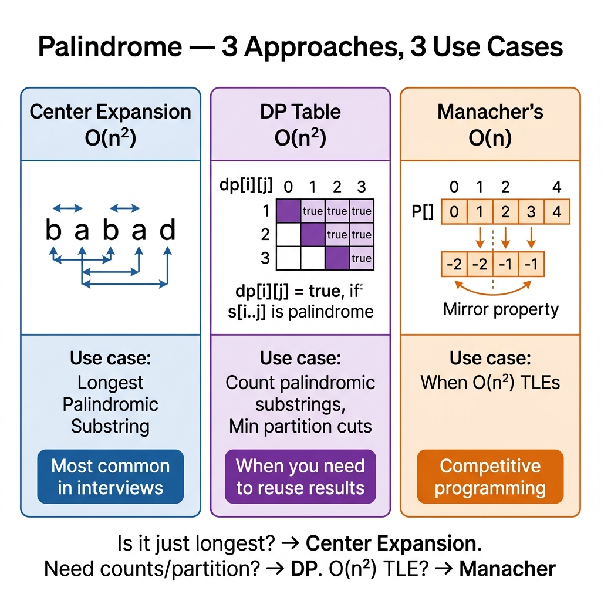

<!-- tags: dsa, algorithms, dynamic-programming, palindrome -->
# 💎 Palindrome DP Patterns

> Palindrome problems easily drag you into two fatal extremes. You either brute-force every substring or deploy DP and Manacher too early. This guide isolates the correct lanes. It shows when center expansion suffices, when state `dp[i][j]` matters, and when O(n) optimization truly pays off.

📅 Created: 2026-04-04 · 🔄 Updated: 2026-04-09 · ⏱️ 18 min read

| Aspect | Detail |
| ------ | ------ |
| **Complexity focus** | O(n²) for center expansion and tables · O(n) for Manacher |
| **Use case** | Longest palindromic substring, count palindromes, repeated substring checks |
| **Recognition** | Strings exhibiting center symmetry or requiring interval states `[l..r]` |

---

## 1. DEFINE

<!-- [Beginner layer] -->

You face a long string and the prompt asks for the longest palindromic substring. Brute-forcing every substring feels plausible, but at `n = 2000`, intervals reach O(n²), and checking each adds O(n). You do not lack loops. You lack a way to reuse symmetry.

Three primary lanes exist for these problems:
- `Expand Around Center` when you need the longest or a count, seeking clean, traceable code.
- `DP Table` when you need an explicit `isPal[i][j]` state for subsequent queries or expansions.
- `Manacher` when inputs scale so massively that O(n²) truly becomes a bottleneck.

Core insight: **Palindromes are not built left-to-right like standard strings. They form from center symmetry or smaller valid intervals.** If you cannot describe the center or sub-interval backing your current sequence, your solution degrades into disguised brute force.

### Core Techniques
| Technique | When to use | Invariant | Related Link |
| --- | --- | --- | --- |
| Expand Around Center | Longest/count palindrome on moderate inputs | Every center generates all palindromes sharing that center | [../07-palindrome-dp.md](./07-palindrome-dp.md) |
| DP Table `dp[l][r]` | Reusing substring states extensively | `s[l..r]` is valid if boundaries match and the inner core is valid | [02-lcs.md](./02-lcs.md) |
| Manacher | Longest palindrome on massive inputs | The mirror radius reuses symmetry around the current center | [../07-palindrome-dp.md](./07-palindrome-dp.md) |

## 2. VISUAL

Palindromes sound static, but algorithms leverage their symmetry differently. Look at the exact same string through three distinct lenses.

### Level 1 — Center Expansion

```text
s = "abba"

center between two b characters:

index: 0 1 2 3
char : a b b a
         ^ ^

expand 1: s[1] == s[2] -> "bb"
expand 2: s[0] == s[3] -> "abba"
expand 3: out of range -> stop
```

*Figure: Center expansion does not ask "which segment is a palindrome". It asks "how far can this specific center expand".*



### Level 2 — DP Table

```text
dp[l][r] = is s[l..r] a palindrome?

Base:
  dp[i][i] = true
  dp[i][i+1] = (s[i] == s[i+1])

Transition:
  dp[l][r] = (s[l] == s[r]) && dp[l+1][r-1]

Fill order:
  length = 1 -> 2 -> 3 -> ... -> n
```

*Figure: DP does not discover palindromes out of thin air. It caches the validity of the inner core so outer bounds skip redundant checks.*

### Level 3 — Manacher

```text
Original:   a b b a
Transform: ^ # a # b # b # a # $

Every position in the transformed string holds a radius.
Mirroring around the current center safely reuses portions of known radii.
```

*Figure: Manacher transforms the problem space to unify odd and even lengths. It then exploits current center symmetry to bypass useless expansions.*

## 3. CODE

The diagrams revealed three views of symmetry. Now we follow the maturity sequence. We start with the most explainable approach before introducing explicit states and linear optimizations.

### Problem 1: Basic — Expand Around Center

> **Goal**: Find the longest palindromic substring without rechecking intervals from scratch.
>
> **Approach**: Test every odd center `(i, i)` and even center `(i, i+1)`, expanding outward until symmetry breaks.
>
> **Example**: `babad` yields `"bab"` or `"aba"`. `cbbd` yields `"bb"`.

```go
// palindrome_center.go — longest palindrome by expanding around every center
func LongestPalindromeCenter(s string) string {
    if len(s) < 2 {
        return s
    }

    bestLeft, bestRight := 0, 0

    expand := func(left, right int) (int, int) {
        for left >= 0 && right < len(s) && s[left] == s[right] {
            left--
            right++
        }
        return left + 1, right - 1
    }

    for i := range s {
        for _, pair := range [][2]int{{i, i}, {i, i + 1}} {
            left, right := expand(pair[0], pair[1])
            if right-left > bestRight-bestLeft {
                bestLeft, bestRight = left, right
            }
        }
    }

    return s[bestLeft : bestRight+1]
}
```

```typescript
// palindrome-center.ts — longest palindrome by expanding around every center
export function longestPalindromeCenter(s: string): string {
  if (s.length < 2) return s;

  let bestLeft = 0;
  let bestRight = 0;

  const expand = (left: number, right: number): [number, number] => {
    while (left >= 0 && right < s.length && s[left] === s[right]) {
      left -= 1;
      right += 1;
    }
    return [left + 1, right - 1];
  };

  for (let i = 0; i < s.length; i++) {
    for (const [left0, right0] of [[i, i], [i, i + 1]]) {
      const [left, right] = expand(left0, right0);
      if (right - left > bestRight - bestLeft) {
        bestLeft = left;
        bestRight = right;
      }
    }
  }

  return s.slice(bestLeft, bestRight + 1);
}
```

```python
# palindrome_center.py — longest palindrome by expanding around every center
def longest_palindrome_center(s: str) -> str:
    if len(s) < 2:
        return s

    best_left = best_right = 0

    def expand(left: int, right: int) -> tuple[int, int]:
        while left >= 0 and right < len(s) and s[left] == s[right]:
            left -= 1
            right += 1
        return left + 1, right - 1

    for i in range(len(s)):
        for left0, right0 in ((i, i), (i, i + 1)):
            left, right = expand(left0, right0)
            if right - left > best_right - best_left:
                best_left, best_right = left, right

    return s[best_left : best_right + 1]
```

```java
// PalindromeCenter.java — longest palindrome by expanding around every center
public final class PalindromeCenter {
    private PalindromeCenter() {}

    public static String longestPalindromeCenter(String s) {
        if (s.length() < 2) return s;

        int bestLeft = 0;
        int bestRight = 0;

        for (int i = 0; i < s.length(); i++) {
            int[] odd = expand(s, i, i);
            int[] even = expand(s, i, i + 1);

            if (odd[1] - odd[0] > bestRight - bestLeft) {
                bestLeft = odd[0];
                bestRight = odd[1];
            }
            if (even[1] - even[0] > bestRight - bestLeft) {
                bestLeft = even[0];
                bestRight = even[1];
            }
        }

        return s.substring(bestLeft, bestRight + 1);
    }

    private static int[] expand(String s, int left, int right) {
        while (left >= 0 && right < s.length() && s.charAt(left) == s.charAt(right)) {
            left--;
            right++;
        }
        return new int[] {left + 1, right - 1};
    }
}
```

> **Why?** This basic case aligns perfectly with human intuition. It avoids heavy tables and obscure optimizations. You simply ask how far a valid center can expand before failing.

> **Conclusion**: For standard interview inputs demanding the longest palindrome or a simple count, center expansion strikes the perfect balance of clarity and efficiency.

### Problem 2: Intermediate — DP Table `dp[l][r]`

> **Goal**: Store explicit states to reuse interval validity calculations.
>
> **Approach**: Fill the table by ascending lengths. A longer segment is valid only if boundaries match and the inner core was previously validated.
>
> **Example**: In `"abba"`, resolving `dp[0][3]` requires `dp[1][2]` to be true first.

```go
// palindrome_dp.go — explicit palindrome table by interval length
func LongestPalindromeDP(s string) string {
    n := len(s)
    if n < 2 {
        return s
    }

    dp := make([][]bool, n)
    for i := range dp {
        dp[i] = make([]bool, n)
        dp[i][i] = true
    }

    bestLeft, bestLen := 0, 1

    for length := 2; length <= n; length++ {
        for left := 0; left+length-1 < n; left++ {
            right := left + length - 1
            if s[left] != s[right] {
                continue
            }

            if length == 2 || dp[left+1][right-1] {
                dp[left][right] = true
                if length > bestLen {
                    bestLeft = left
                    bestLen = length
                }
            }
        }
    }

    return s[bestLeft : bestLeft+bestLen]
}
```

```typescript
// palindrome-dp.ts — explicit palindrome table by interval length
export function longestPalindromeDP(s: string): string {
  const n = s.length;
  if (n < 2) return s;

  const dp = Array.from({ length: n }, () => Array<boolean>(n).fill(false));
  let bestLeft = 0;
  let bestLen = 1;

  for (let i = 0; i < n; i++) dp[i][i] = true;

  for (let length = 2; length <= n; length++) {
    for (let left = 0; left + length - 1 < n; left++) {
      const right = left + length - 1;
      if (s[left] !== s[right]) continue;

      if (length === 2 || dp[left + 1][right - 1]) {
        dp[left][right] = true;
        if (length > bestLen) {
          bestLeft = left;
          bestLen = length;
        }
      }
    }
  }

  return s.slice(bestLeft, bestLeft + bestLen);
}
```

```python
# palindrome_dp.py — explicit palindrome table by interval length
def longest_palindrome_dp(s: str) -> str:
    n = len(s)
    if n < 2:
        return s

    dp = [[False] * n for _ in range(n)]
    best_left, best_len = 0, 1

    for i in range(n):
        dp[i][i] = True

    for length in range(2, n + 1):
        for left in range(0, n - length + 1):
            right = left + length - 1
            if s[left] != s[right]:
                continue
            if length == 2 or dp[left + 1][right - 1]:
                dp[left][right] = True
                if length > best_len:
                    best_left, best_len = left, length

    return s[best_left : best_left + best_len]
```

```java
// PalindromeTable.java — explicit palindrome table by interval length
public final class PalindromeTable {
    private PalindromeTable() {}

    public static String longestPalindromeDP(String s) {
        int n = s.length();
        if (n < 2) return s;

        boolean[][] dp = new boolean[n][n];
        int bestLeft = 0;
        int bestLen = 1;

        for (int i = 0; i < n; i++) {
            dp[i][i] = true;
        }

        for (int length = 2; length <= n; length++) {
            for (int left = 0; left + length - 1 < n; left++) {
                int right = left + length - 1;
                if (s.charAt(left) != s.charAt(right)) continue;

                if (length == 2 || dp[left + 1][right - 1]) {
                    dp[left][right] = true;
                    if (length > bestLen) {
                        bestLeft = left;
                        bestLen = length;
                    }
                }
            }
        }

        return s.substring(bestLeft, bestLeft + bestLen);
    }
}
```

> **Why?** DP tables excel when `dp[l][r]` provides tangible value elsewhere. You utilize explicit states if the problem expands into multiple queries requiring interval validity checks.

> **Conclusion**: The DP table trades the concise speed of center expansion for explicit interval tracking. Use it when palindrome checks serve as subroutines in larger architectural problems.

### Problem 3: Advanced — Manacher

> **Goal**: Find the longest palindromic substring strictly in O(n) time.
>
> **Approach**: Insert padding characters to unify odd and even palindromes. Leverage a mirror radius to skip redundant center expansions dynamically.
>
> **Example**: `"abba"` transforms into `^#a#b#b#a#$`, forcing every palindrome into an odd-length framework.

```go
// manacher.go — linear-time longest palindrome
func LongestPalindromeLinear(s string) string {
    if len(s) == 0 {
        return ""
    }

    transformed := make([]byte, 0, len(s)*2+3)
    transformed = append(transformed, '^')
    for i := range s {
        transformed = append(transformed, '#', s[i])
    }
    transformed = append(transformed, '#', '$')

    radius := make([]int, len(transformed))
    center, right := 0, 0
    bestCenter, bestRadius := 0, 0

    minInt := func(a, b int) int {
        if a < b {
            return a
        }
        return b
    }

    for i := 1; i < len(transformed)-1; i++ {
        mirror := 2*center - i
        if i < right {
            radius[i] = minInt(right-i, radius[mirror])
        }

        for transformed[i+1+radius[i]] == transformed[i-1-radius[i]] {
            radius[i]++
        }

        if i+radius[i] > right {
            center = i
            right = i + radius[i]
        }

        if radius[i] > bestRadius {
            bestCenter = i
            bestRadius = radius[i]
        }
    }

    start := (bestCenter - bestRadius) / 2
    return s[start : start+bestRadius]
}
```

```typescript
// manacher.ts — linear-time longest palindrome
export function longestPalindromeLinear(s: string): string {
  if (!s.length) return "";

  const transformed: string[] = ["^"];
  for (const ch of s) transformed.push("#", ch);
  transformed.push("#", "$");

  const radius = Array<number>(transformed.length).fill(0);
  let center = 0;
  let right = 0;
  let bestCenter = 0;
  let bestRadius = 0;

  for (let i = 1; i < transformed.length - 1; i++) {
    const mirror = 2 * center - i;
    if (i < right) {
      radius[i] = Math.min(right - i, radius[mirror]);
    }

    while (transformed[i + 1 + radius[i]] === transformed[i - 1 - radius[i]]) {
      radius[i] += 1;
    }

    if (i + radius[i] > right) {
      center = i;
      right = i + radius[i];
    }

    if (radius[i] > bestRadius) {
      bestCenter = i;
      bestRadius = radius[i];
    }
  }

  const start = Math.floor((bestCenter - bestRadius) / 2);
  return s.slice(start, start + bestRadius);
}
```

```python
# manacher.py — linear-time longest palindrome
def longest_palindrome_linear(s: str) -> str:
    if not s:
        return ""

    transformed = ["^"]
    for ch in s:
        transformed.extend(["#", ch])
    transformed.extend(["#", "$"])

    radius = [0] * len(transformed)
    center = right = best_center = best_radius = 0

    for i in range(1, len(transformed) - 1):
        mirror = 2 * center - i
        if i < right:
            radius[i] = min(right - i, radius[mirror])

        while transformed[i + 1 + radius[i]] == transformed[i - 1 - radius[i]]:
            radius[i] += 1

        if i + radius[i] > right:
            center = i
            right = i + radius[i]

        if radius[i] > best_radius:
            best_center = i
            best_radius = radius[i]

    start = (best_center - best_radius) // 2
    return s[start : start + best_radius]
```

```java
// Manacher.java — linear-time longest palindrome
public final class Manacher {
    private Manacher() {}

    public static String longestPalindromeLinear(String s) {
        if (s.isEmpty()) return "";

        StringBuilder transformed = new StringBuilder("^");
        for (char ch : s.toCharArray()) {
            transformed.append('#').append(ch);
        }
        transformed.append("#$");

        int[] radius = new int[transformed.length()];
        int center = 0;
        int right = 0;
        int bestCenter = 0;
        int bestRadius = 0;

        for (int i = 1; i < transformed.length() - 1; i++) {
            int mirror = 2 * center - i;
            if (i < right) {
                radius[i] = Math.min(right - i, radius[mirror]);
            }

            while (transformed.charAt(i + 1 + radius[i]) == transformed.charAt(i - 1 - radius[i])) {
                radius[i]++;
            }

            if (i + radius[i] > right) {
                center = i;
                right = i + radius[i];
            }

            if (radius[i] > bestRadius) {
                bestCenter = i;
                bestRadius = radius[i];
            }
        }

        int start = (bestCenter - bestRadius) / 2;
        return s.substring(start, start + bestRadius);
    }
}
```

> **Why?** Manacher succeeds by exhaustively reusing symmetry around the moving center. However, its complex intuition and fragile sentinel indices severely damage explainability during whiteboarding.

> **Conclusion**: Only escalate to Manacher when O(n²) unequivocally bottlenecks the system. Otherwise, center expansion provides the optimal blend of accuracy, conciseness, and presentation.

## 4. PITFALLS

DP rarely fails due to missing loops. It fails on state semantics, sentinels, base cases, and off-by-one fill orders.

| Pitfall | Signal | Why it fails | Fix | Severity |
| ------- | -------- | ---------- | -------- | -------- |
| Only expanding odd centers | Missing even length outputs like `"abba"` | Even palindromes center directly between elements | Always test both `(i, i)` and `(i, i+1)` | high |
| Firing DP loops out of order | Reading `dp[l+1][r-1]` before it computes | Interval logic depends tightly on preceding length builds | Iterate loops by strictly ascending interval lengths | high |
| Overusing DP arrays arbitrarily | Code bloats without adding clear algorithmic value | Explicit caching is not required universally | Contrast problem needs against actual state reuse | medium |
| Wielding Manacher as a party trick | Solutions grow hard to explain and debug | Linear time provides zero value if not bottlenecked | Restrict usage to concrete scaling demands | medium |
| Confusing substring with subsequence | Recurrence equations diverge from the core domain | Palindromes here represent contiguous string segments | Reinforce that the analyzed object remains `[l..r]` | high |

## 5. REF

- Palindrome as string-structure neighbor: [../string-algorithms/03-palindromes.md](../string-algorithms/03-palindromes.md)
- Interval-DP thinking neighbor: [04-matrix-chain.md](./04-matrix-chain.md)
- State-table foundations: [02-lcs.md](./02-lcs.md)

## 6. RECOMMEND

After navigating these lanes, the central issue is no longer technique volume. It is matching the problem context to the appropriate execution lane.

- If you want to connect palindromes to general string structures, read [../string-algorithms/03-palindromes.md](../string-algorithms/03-palindromes.md).
- If the table `isPal[l][r]` acts as a helper for broader interval processing, see [04-matrix-chain.md](./04-matrix-chain.md).
- If you need to rebuild your intuition on mapping states before drawing tables, revisit [README.md](./README.md).

## 7. QUICK REF

- Center expansion serves as the superior baseline for longest palindromes during interviews.
- DP tables shine only when the palindrome status feeds into larger reusable state matrices.
- Manacher fits exclusively when O(n²) breaks performance or explicit linear tracking is mandated.

---

**Links**: [← Previous](./06-house-robber.md) · [→ Next](./08-largest-square.md)
