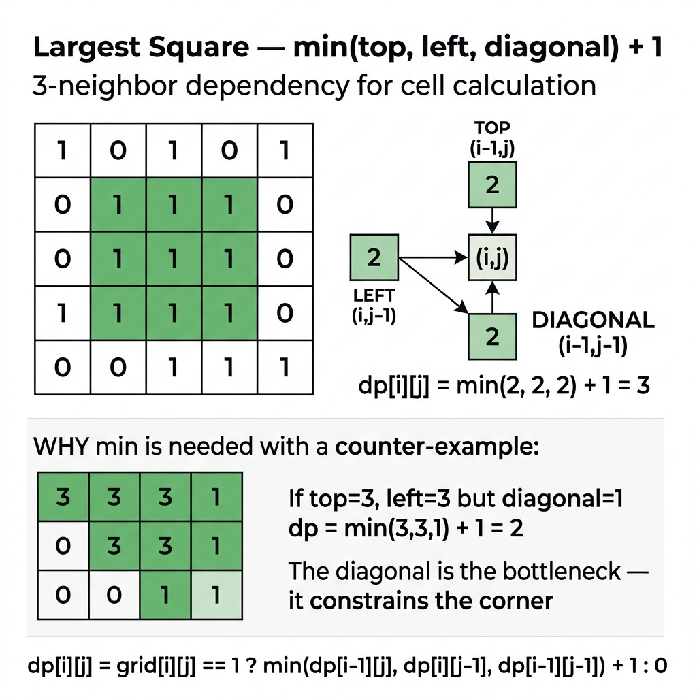

<!-- tags: dsa, algorithms -->
# 🟦 Largest Square of 1s

> Largest Square provides a remarkably clean matrix DP experience. Each cell simply checks its top, left, and top-left neighbors to determine its maximal bottom-right potential.

📅 Created: 2026-04-01 · 🔄 Updated: 2026-04-09 · ⏱️ 15 min read

| Aspect | Detail |
| ------ | ------ |
| **Complexity focus** | O(m·n) time; O(m·n) or O(n) space |
| **Use case** | Maximal squares, binary grid DP, local-to-global transitions |
| **Related** | Matrix Pathways, Prefix Sum, Dynamic Programming |

---

## 1. DEFINE

<!-- [Beginner layer] -->

Finding the largest square of `1`s in a binary matrix sounds like a geometrical scanning task. `Largest Square` is actually a DP problem where cells dictate their own expansion limits.

This problem is vital because it introduces a highly specialized DP state. A cell derives its value entirely from smaller, stable structures validated by three specific neighbors. If any neighbor fails, the larger square collapses.

Core insight: **When a massive 2D structure relies simultaneously on multiple intact substructures, applying `min` across neighbors signals strong matrix DP.**

| Variant | Question | State |
| ------- | ------- | ----- |
| Maximal square area | What is the maximum area of the square? | `dp[r][c] = max edge ending at (r,c)` |
| Space optimized | Can we reduce the memory footprint? | Only keep the previous row plus `prevDiag` |
| Recover coordinates | Where exactly does the square exist? | Track `bestSide` alongside `bottomRight` |

| Approach | Time | Space | When to use |
| --- | --- | --- | --- |
| 2D DP Table | O(m·n) | O(m·n) | To understand the invariant before optimizing |
| 1D Space Optimization | O(m·n) | O(n) | When adding constraints to the basic pattern |
| Track Square Coordinates | O(m·n) | O(m·n) | To scale up to hierarchical data structures |

### 1.1 Quick Recognition

- The problem provides a binary matrix and requests the largest square area or side.
- Each `1` cell only expands if all three connected components simultaneously support that length.
- The task belongs natively to 2D DP algorithms built upon stable local neighborhoods.

### 1.2 Invariants & Failure Modes

- `dp[r][c]` typically stores the largest side length of a square ending directly at `(r,c)`.
- The transition strictly requires `min(top, left, diag) + 1`. Using `max` breaks the logic entirely.
- Common failure mode: counting nearby `1`s while ignoring that a single gap destroys the encompassing square.

## 2. VISUAL

In DP, an abstract formula remains meaningless until you trace the state and fill-order on a small example. The trace below illustrates what each cell represents and why the fill order dictates success.

### Level 1 — Core intuition

```text
if matrix[r][c] == 1:
  dp[r][c] = 1 + min(
      dp[r-1][c],
      dp[r][c-1],
      dp[r-1][c-1]
  )
```

*Figure: Each cell examines exactly 3 neighbors. Adding 1 to the minimum of top, left, and diagonal yields the maximum square side.*



### Level 2 — Decision trace

- With 🟦 Largest Square of 1s, start from the smallest state retaining enough information to represent the original subproblem.
- The 🟦 Largest Square transition must only depend on states previously computed or validly cached.
- Lock down the base cases and fill order for 🟦 Largest Square before optimizing space, as wrong orders break the table.
- When the 🟦 Largest Square state table stabilizes, the answer drops into the specific cell representing the root problem.

## 3. CODE

Once the state is locked, DP code holds no surprises. Start with the most provable version, then compress the state or pivot the approach when clear benefits arise.

### Problem 1: Basic — 2D DP Table

> **Goal**: Calculate the area of the largest square consisting entirely of 1s.
> **Approach**: `dp[r][c]` stores the largest side length forming a bottom-right corner at `(r,c)`.
> **Example**: `[[1,0,1,0,0],[1,0,1,1,1],[1,1,1,1,1],[1,0,0,1,0]] -> 4`.
> **Complexity**: O(m·n) time, O(m·n) space.

```go
// largest_square.go — Maximal Square: 2D DP table
package dynamicprogramming

func MaximalSquare(matrix [][]byte) int {
    if len(matrix) == 0 || len(matrix[0]) == 0 {
        return 0
    }

    rows, cols := len(matrix), len(matrix[0])
    dp := make([][]int, rows+1)
    for r := range dp {
        dp[r] = make([]int, cols+1)
    }

    bestSide := 0
    for r := 1; r <= rows; r++ {
        for c := 1; c <= cols; c++ {
            if matrix[r-1][c-1] == '1' {
                dp[r][c] = 1 + min3(dp[r-1][c], dp[r][c-1], dp[r-1][c-1])
                if dp[r][c] > bestSide {
                    bestSide = dp[r][c]
                }
            }
        }
    }

    return bestSide * bestSide
}

func min3(a, b, c int) int {
    if a > b { a = b }
    if a > c { a = c }
    return a
}
```

```typescript
// largest_square.ts — Maximal Square: 2D DP table
export function maximalSquare(matrix: string[][]): number {
  if (!matrix.length || !matrix[0].length) return 0;
  const rows = matrix.length;
  const cols = matrix[0].length;
  const dp = Array.from({ length: rows + 1 }, () => Array(cols + 1).fill(0));
  let bestSide = 0;

  for (let r = 1; r <= rows; r++) {
    for (let c = 1; c <= cols; c++) {
      if (matrix[r - 1][c - 1] === '1') {
        dp[r][c] = 1 + Math.min(dp[r - 1][c], dp[r][c - 1], dp[r - 1][c - 1]);
        bestSide = Math.max(bestSide, dp[r][c]);
      }
    }
  }
  return bestSide * bestSide;
}
```

```rust
// largest_square.rs — Maximal Square: 2D DP table
pub fn maximal_square(matrix: &[Vec<u8>]) -> i32 {
    if matrix.is_empty() || matrix[0].is_empty() { return 0; }
    let rows = matrix.len();
    let cols = matrix[0].len();
    let mut dp = vec![vec![0i32; cols + 1]; rows + 1];
    let mut best_side = 0;

    for r in 1..=rows {
        for c in 1..=cols {
            if matrix[r - 1][c - 1] == b'1' {
                dp[r][c] = 1 + dp[r - 1][c].min(dp[r][c - 1]).min(dp[r - 1][c - 1]);
                best_side = best_side.max(dp[r][c]);
            }
        }
    }
    best_side * best_side
}
```

```cpp
// largest_square.cpp — Maximal Square: 2D DP table
int maximalSquare(const std::vector<std::vector<char>>& matrix) {
    if (matrix.empty() || matrix[0].empty()) return 0;
    int rows = (int)matrix.size(), cols = (int)matrix[0].size();
    std::vector<std::vector<int>> dp(rows + 1, std::vector<int>(cols + 1, 0));
    int bestSide = 0;
    for (int r = 1; r <= rows; ++r) {
        for (int c = 1; c <= cols; ++c) {
            if (matrix[r - 1][c - 1] == '1') {
                dp[r][c] = 1 + std::min({dp[r - 1][c], dp[r][c - 1], dp[r - 1][c - 1]});
                bestSide = std::max(bestSide, dp[r][c]);
            }
        }
    }
    return bestSide * bestSide;
}
```

```python
# largest_square.py — Maximal Square: 2D DP table
def maximal_square(matrix: list[list[str]]) -> int:
    if not matrix or not matrix[0]:
        return 0
    rows, cols = len(matrix), len(matrix[0])
    dp = [[0] * (cols + 1) for _ in range(rows + 1)]
    best_side = 0
    for r in range(1, rows + 1):
        for c in range(1, cols + 1):
            if matrix[r - 1][c - 1] == '1':
                dp[r][c] = 1 + min(dp[r - 1][c], dp[r][c - 1], dp[r - 1][c - 1])
                best_side = max(best_side, dp[r][c])
    return best_side * best_side
```

```java
// LargestSquare.java — Maximal Square: 2D DP table
public final class LargestSquare {
    private LargestSquare() {}

    public static int maximalSquare(char[][] matrix) {
        if (matrix.length == 0 || matrix[0].length == 0) return 0;
        int rows = matrix.length;
        int cols = matrix[0].length;
        int[][] dp = new int[rows + 1][cols + 1];
        int bestSide = 0;
        for (int r = 1; r <= rows; r++) {
            for (int c = 1; c <= cols; c++) {
                if (matrix[r - 1][c - 1] == '1') {
                    dp[r][c] = 1 + Math.min(dp[r - 1][c], Math.min(dp[r][c - 1], dp[r - 1][c - 1]));
                    bestSide = Math.max(bestSide, dp[r][c]);
                }
            }
        }
        return bestSide * bestSide;
    }
}
```

> **Why?** 2D DP Table works because each state defines its dependencies cleanly so they are available or cached. Correct states and fill orders let you reuse results instead of solving overlapping subproblems.

> **Conclusion**: The basic recurrence stands as an exceptionally clean matrix DP example. Three neighbors cleanly encapsulate the entire required history.

### Problem 2: Intermediate — 1D Space Optimization

> **Goal**: Slash memory usage from O(m·n) to O(n) by retaining only the preceding row.
> **Approach**: `dp[c]` stores the old row value before updating. `prevDiag` explicitly tracks the old top-left diagonal.
> **Example**: Excellent for processing massive matrices or running continuous consecutive batches.
> **Complexity**: O(m·n) time, O(n) space.

```go
// largest_square_1d.go — 1D DP compression with prevDiag
func MaximalSquare1D(matrix [][]byte) int {
    if len(matrix) == 0 || len(matrix[0]) == 0 {
        return 0
    }
    cols := len(matrix[0])
    dp := make([]int, cols+1)
    bestSide := 0

    for r := 1; r <= len(matrix); r++ {
        prevDiag := 0
        for c := 1; c <= cols; c++ {
            saved := dp[c]
            if matrix[r-1][c-1] == '1' {
                dp[c] = 1 + min3(dp[c], dp[c-1], prevDiag)
                if dp[c] > bestSide {
                    bestSide = dp[c]
                }
            } else {
                dp[c] = 0
            }
            prevDiag = saved
        }
    }

    return bestSide * bestSide
}
```

```typescript
// largest_square_1d.ts — 1D DP compression with prevDiag
export function maximalSquare1D(matrix: string[][]): number {
  if (!matrix.length || !matrix[0].length) return 0;
  const cols = matrix[0].length;
  const dp = Array(cols + 1).fill(0);
  let bestSide = 0;
  for (let r = 1; r <= matrix.length; r++) {
    let prevDiag = 0;
    for (let c = 1; c <= cols; c++) {
      const saved = dp[c];
      if (matrix[r - 1][c - 1] === '1') {
        dp[c] = 1 + Math.min(dp[c], dp[c - 1], prevDiag);
        bestSide = Math.max(bestSide, dp[c]);
      } else dp[c] = 0;
      prevDiag = saved;
    }
  }
  return bestSide * bestSide;
}
```
```rust
// largest_square_1d.rs — 1D DP compression with prevDiag
pub fn maximal_square_1d(matrix: &[Vec<u8>]) -> i32 {
    if matrix.is_empty() || matrix[0].is_empty() { return 0; }
    let cols = matrix[0].len();
    let mut dp = vec![0i32; cols + 1];
    let mut best_side = 0;
    for r in 1..=matrix.len() {
        let mut prev_diag = 0;
        for c in 1..=cols {
            let saved = dp[c];
            if matrix[r - 1][c - 1] == b'1' {
                dp[c] = 1 + dp[c].min(dp[c - 1]).min(prev_diag);
                best_side = best_side.max(dp[c]);
            } else { dp[c] = 0; }
            prev_diag = saved;
        }
    }
    best_side * best_side
}
```
```cpp
// largest_square_1d.cpp — 1D DP compression with prevDiag
int maximalSquare1D(const std::vector<std::vector<char>>& matrix) {
    if (matrix.empty() || matrix[0].empty()) return 0;
    int cols = (int)matrix[0].size();
    std::vector<int> dp(cols + 1, 0);
    int bestSide = 0;
    for (int r = 1; r <= (int)matrix.size(); ++r) {
        int prevDiag = 0;
        for (int c = 1; c <= cols; ++c) {
            int saved = dp[c];
            if (matrix[r - 1][c - 1] == '1') {
                dp[c] = 1 + std::min({dp[c], dp[c - 1], prevDiag});
                bestSide = std::max(bestSide, dp[c]);
            } else dp[c] = 0;
            prevDiag = saved;
        }
    }
    return bestSide * bestSide;
}
```
```python
# largest_square_1d.py — 1D DP compression with prevDiag
def maximal_square_1d(matrix: list[list[str]]) -> int:
    if not matrix or not matrix[0]:
        return 0
    cols = len(matrix[0])
    dp = [0] * (cols + 1)
    best_side = 0
    for r in range(1, len(matrix) + 1):
        prev_diag = 0
        for c in range(1, cols + 1):
            saved = dp[c]
            if matrix[r - 1][c - 1] == '1':
                dp[c] = 1 + min(dp[c], dp[c - 1], prev_diag)
                best_side = max(best_side, dp[c])
            else:
                dp[c] = 0
            prev_diag = saved
    return best_side * best_side
```
```java
// LargestSquare1D.java — 1D DP compression with prevDiag
public static int maximalSquare1D(char[][] matrix) {
    if (matrix.length == 0 || matrix[0].length == 0) return 0;
    int cols = matrix[0].length;
    int[] dp = new int[cols + 1];
    int bestSide = 0;
    for (int r = 1; r <= matrix.length; r++) {
        int prevDiag = 0;
        for (int c = 1; c <= cols; c++) {
            int saved = dp[c];
            if (matrix[r - 1][c - 1] == '1') {
                dp[c] = 1 + Math.min(dp[c], Math.min(dp[c - 1], prevDiag));
                bestSide = Math.max(bestSide, dp[c]);
            } else dp[c] = 0;
            prevDiag = saved;
        }
    }
    return bestSide * bestSide;
}
```

> **Why?** 1D Space Optimization works because each state defines its dependencies cleanly so they are available or cached. Correct states and fill orders let you reuse results instead of solving overlapping subproblems.

> **Conclusion**: 1D DP enforces strict boundary discipline. It forces you to distinguish precisely which variables belong to the old row versus the newly updated row.

### Problem 3: Advanced — Track Square Coordinates

> **Goal**: Extract the precise grid coordinates of the optimal square, not just its total area.
> **Approach**: Update the bottom-right coordinates whenever `bestSide` increases. Subtract to derive the top-left origin.
> **Example**: Excellent for real-world grid systems requiring the largest stable clean zone highlighted.
> **Complexity**: O(m·n) time, O(m·n) space.

```go
// largest_square_coordinates.go — Track coordinates of the best square
func LargestSquareWithCoords(matrix [][]byte) (area int, top int, left int, size int) {
    if len(matrix) == 0 || len(matrix[0]) == 0 {
        return 0, -1, -1, 0
    }

    rows, cols := len(matrix), len(matrix[0])
    dp := make([][]int, rows+1)
    for r := range dp {
        dp[r] = make([]int, cols+1)
    }

    bestSide, bestBottom, bestRight := 0, -1, -1
    for r := 1; r <= rows; r++ {
        for c := 1; c <= cols; c++ {
            if matrix[r-1][c-1] == '1' {
                dp[r][c] = 1 + min3(dp[r-1][c], dp[r][c-1], dp[r-1][c-1])
                if dp[r][c] > bestSide {
                    bestSide = dp[r][c]
                    bestBottom = r - 1
                    bestRight = c - 1
                }
            }
        }
    }

    if bestSide == 0 {
        return 0, -1, -1, 0
    }
    top = bestBottom - bestSide + 1
    left = bestRight - bestSide + 1
    return bestSide * bestSide, top, left, bestSide
}
```

```typescript
// largest_square_coordinates.ts — Track coordinates of the best square
export function largestSquareWithCoords(matrix: string[][]): [number, number, number, number] {
  if (!matrix.length || !matrix[0].length) return [0, -1, -1, 0];
  const rows = matrix.length, cols = matrix[0].length;
  const dp = Array.from({ length: rows + 1 }, () => Array(cols + 1).fill(0));
  let bestSide = 0, bestBottom = -1, bestRight = -1;
  for (let r = 1; r <= rows; r++) for (let c = 1; c <= cols; c++) if (matrix[r-1][c-1] === '1') {
    dp[r][c] = 1 + Math.min(dp[r-1][c], dp[r][c-1], dp[r-1][c-1]);
    if (dp[r][c] > bestSide) { bestSide = dp[r][c]; bestBottom = r-1; bestRight = c-1; }
  }
  if (bestSide === 0) return [0, -1, -1, 0];
  return [bestSide * bestSide, bestBottom - bestSide + 1, bestRight - bestSide + 1, bestSide];
}
```
```rust
// largest_square_coordinates.rs — Track coordinates of the best square
pub fn largest_square_with_coords(matrix: &[Vec<u8>]) -> (i32, i32, i32, i32) {
    if matrix.is_empty() || matrix[0].is_empty() { return (0, -1, -1, 0); }
    let rows = matrix.len(); let cols = matrix[0].len();
    let mut dp = vec![vec![0i32; cols + 1]; rows + 1];
    let (mut best_side, mut best_bottom, mut best_right) = (0i32, -1i32, -1i32);
    for r in 1..=rows { for c in 1..=cols { if matrix[r-1][c-1] == b'1' {
        dp[r][c] = 1 + dp[r-1][c].min(dp[r][c-1]).min(dp[r-1][c-1]);
        if dp[r][c] > best_side { best_side = dp[r][c]; best_bottom = r as i32 - 1; best_right = c as i32 - 1; }
    }}}
    if best_side == 0 { return (0, -1, -1, 0); }
    (best_side * best_side, best_bottom - best_side + 1, best_right - best_side + 1, best_side)
}
```
```cpp
// largest_square_coordinates.cpp — Track coordinates of the best square
std::tuple<int,int,int,int> largestSquareWithCoords(const std::vector<std::vector<char>>& matrix) {
    if (matrix.empty() || matrix[0].empty()) return {0, -1, -1, 0};
    int rows = (int)matrix.size(), cols = (int)matrix[0].size();
    std::vector<std::vector<int>> dp(rows + 1, std::vector<int>(cols + 1, 0));
    int bestSide = 0, bestBottom = -1, bestRight = -1;
    for (int r = 1; r <= rows; ++r) for (int c = 1; c <= cols; ++c) if (matrix[r-1][c-1] == '1') {
        dp[r][c] = 1 + std::min({dp[r-1][c], dp[r][c-1], dp[r-1][c-1]});
        if (dp[r][c] > bestSide) { bestSide = dp[r][c]; bestBottom = r - 1; bestRight = c - 1; }
    }
    if (bestSide == 0) return {0, -1, -1, 0};
    return {bestSide * bestSide, bestBottom - bestSide + 1, bestRight - bestSide + 1, bestSide};
}
```
```python
# largest_square_coordinates.py — Track coordinates of the best square
def largest_square_with_coords(matrix: list[list[str]]) -> tuple[int, int, int, int]:
    if not matrix or not matrix[0]:
        return 0, -1, -1, 0
    rows, cols = len(matrix), len(matrix[0])
    dp = [[0] * (cols + 1) for _ in range(rows + 1)]
    best_side = 0
    best_bottom = best_right = -1
    for r in range(1, rows + 1):
        for c in range(1, cols + 1):
            if matrix[r - 1][c - 1] == '1':
                dp[r][c] = 1 + min(dp[r - 1][c], dp[r][c - 1], dp[r - 1][c - 1])
                if dp[r][c] > best_side:
                    best_side, best_bottom, best_right = dp[r][c], r - 1, c - 1
    if best_side == 0:
        return 0, -1, -1, 0
    return best_side * best_side, best_bottom - best_side + 1, best_right - best_side + 1, best_side
```
```java
// LargestSquareCoordinates.java — Track coordinates of the best square
public static int[] largestSquareWithCoords(char[][] matrix) {
    if (matrix.length == 0 || matrix[0].length == 0) return new int[]{0, -1, -1, 0};
    int rows = matrix.length, cols = matrix[0].length;
    int[][] dp = new int[rows + 1][cols + 1];
    int bestSide = 0, bestBottom = -1, bestRight = -1;
    for (int r = 1; r <= rows; r++) for (int c = 1; c <= cols; c++) if (matrix[r-1][c-1] == '1') {
        dp[r][c] = 1 + Math.min(dp[r-1][c], Math.min(dp[r][c-1], dp[r-1][c-1]));
        if (dp[r][c] > bestSide) { bestSide = dp[r][c]; bestBottom = r - 1; bestRight = c - 1; }
    }
    if (bestSide == 0) return new int[]{0, -1, -1, 0};
    return new int[]{bestSide * bestSide, bestBottom - bestSide + 1, bestRight - bestSide + 1, bestSide};
}
```

> **Why?** Track Square Coordinates works because each state defines its dependencies cleanly so they are available or cached. Correct states and fill orders let you reuse results instead of solving overlapping subproblems.

> **Conclusion**: When real applications request precise location data alongside the peak value, saving global coordinates becomes indispensable.

## 4. PITFALLS

DP rarely fails due to missing loops. It fails on state semantics, sentinels, base cases, and off-by-one fill orders.

| # | Severity | Error | Consequence | Fix |
| --- | --- | --- | --- | --- |
| 1 | 🔴 Fatal | Using `max` instead of `min` during transition | The square incorrectly assumes massive dimensions | Remember squares are bounded strictly by their weakest edge |
| 2 | 🟡 Common | Missing padding rows and columns | Creates tangled boundary code and off-by-one errors | Establish a DP grid sized `(rows+1) x (cols+1)` |
| 3 | 🟡 Common | Confusing area with side length | Computes severely distorted answers | Store `bestSide` globally; output area as `side²` |
| 4 | 🔵 Minor | 1D DP loses `prevDiag` prematurely | Diagonal data overwrites unpredictably | Save the temporary variable before modifying `dp[c]` |

## 5. REF

| Resource | Link |
| -------- | ---- |
| LeetCode 221 — Maximal Square | https://leetcode.com/problems/maximal-square/ |
| CP-Algorithms — Dynamic Programming Intro | https://cp-algorithms.com/dynamic_programming/intro-to-dp.html |

## 6. RECOMMEND

Once you articulate the state and transition, you must classify the problem into 1D, 2D, interval, or state compression families to expand your skills.

| Extension | When to use | Reason |
| ------- | ------- | ----- |
| Maximal Rectangle | When squares prove insufficient and rectangles matter | Elevates the core local pattern to histogram tricks |
| Prefix Sum | When measuring sums inside grids rather than binary states | Follows distinct patterns inside identical grid domains |
| Image processing grids | When seeking pure zones across pixels | Maps straightforwardly onto robust real-world algorithms |

## 7. QUICK REFERENCE

| State | Meaning |
| ----- | ------- |
| `dp[r][c]` | Maximum side ending precisely at `(r,c)` |
| `bestSide` | The ultimate global side dimension |
| `prevDiag` | Caches the previous `dp[r-1][c-1]` in 1D approaches |

---

**Links**: [← Previous](./07-palindrome-dp.md) · → Next
