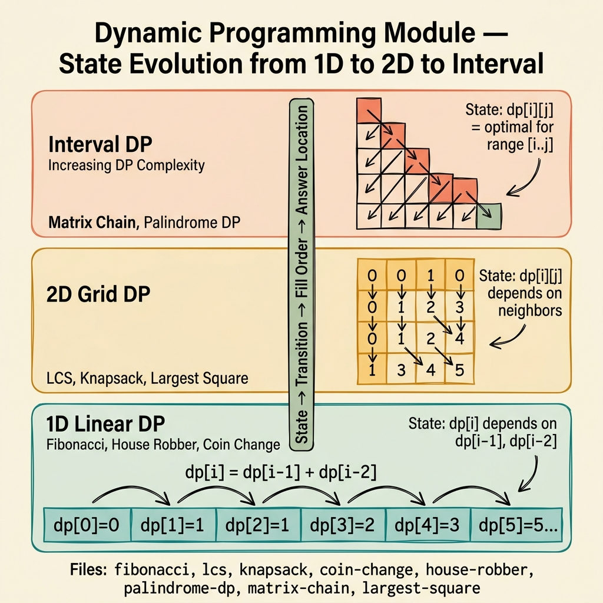

<!-- tags: dsa, algorithms, dynamic-programming, overview -->
# Dynamic Programming — State, Transition, and Reuse

> DP is not just making tables for optimization. It is the discipline of naming the state, defining the transition, and proving that the global solution builds upon correctly locked subproblems.

📅 Created: 2026-04-04 · 🔄 Updated: 2026-04-09 · ⏱️ 8 min read

| Aspect | Detail |
| ------ | ------ |
| **Focus** | State design, recurrence, memoization, tabulation |
| **Common trap** | Writing the table before understanding what the state represents |
| **Best payoff** | Turning exponential brute force into a logical, inferable solution |

---

## 1. DEFINE

Imagine being in an interview with a blank whiteboard and a ticking clock. Dynamic Programming rarely requires memorizing tricks. It requires recognizing patterns early before brute force consumes all your time.

Dynamic Programming often feels intimidating because the state table looks like a mysterious matrix. The table is not the starting point. The starting point is the smallest question that retains enough information to build the larger answer.

Fibonacci teaches simple subproblem reuse. LCS teaches two-dimensional state. Knapsack teaches include or exclude decisions under constraints. Matrix Chain Multiplication teaches optimal split points. Coin Change, House Robber, Palindrome DP, and Largest Square teach different state types with one shared foundation: an incorrect state breaks the entire recurrence.

This hub returns DP to its core essence. Name the state clearly, and the recurrence becomes almost inevitable.

### Module Problems
| Problem | Core State | Core Tension | Link |
| --- | --- | --- | --- |
| Fibonacci | `dp[i]` | Reusing smaller results instead of branching recursion | [01-fibonacci.md](./01-fibonacci.md) |
| LCS | `dp[i][j]` | Two prefixes moving forward and backward simultaneously | [02-lcs.md](./02-lcs.md) |
| 0/1 Knapsack | `dp[i][capacity]` | Include or exclude items under a strict capacity | [03-knapsack.md](./03-knapsack.md) |
| Matrix Chain | `dp[l][r]` | Choosing the best split point | [04-matrix-chain.md](./04-matrix-chain.md) |
| Coin Change | `dp[amount]` or `dp[i][amount]` | Counting ways or minimizing the number of coins | [05-coin-change.md](./05-coin-change.md) |
| House Robber | `dp[i]` with adjacency constraint | Current benefit conflicts with the immediate previous step | [06-house-robber.md](./06-house-robber.md) |
| Palindrome DP | `dp[l][r]` | Reusing symmetry over an interval | [07-palindrome-dp.md](./07-palindrome-dp.md) |
| Largest Square | `dp[i][j]` | Best square size ending at the current cell | [08-largest-square.md](./08-largest-square.md) |

## 2. VISUAL

DP problems feel overwhelming because the state table looks like a mysterious matrix. The image below reframes the entire module by grouping problems by state dimension — 1D linear, 2D grid, and interval — showing how each category builds upon the previous one.



*Image: The vertical spine shows how DP complexity escalates: 1D linear state (Fibonacci, House Robber, Coin Change) → 2D grid state (LCS, Knapsack, Largest Square) → interval state (Matrix Chain, Palindrome DP). The fill order arrow on the left reveals the dependency direction that determines which cell must be computed first.*

```text
Brute force with overlapping subproblems
  |
  +-- 1D state by index / amount? -> Fibonacci / Coin Change / House Robber
  +-- 2D state by 2 prefixes?       -> LCS
  +-- state by interval [l..r]?            -> Matrix Chain / Palindrome DP
  +-- state by grid cell?                 -> Largest Square
  +-- state by item + capacity?        -> Knapsack
```
*Figure: Text fallback — the most useful DP categorization is by state form, not by classic problem names.*

## 3. CODE

The reading sequence should escalate by state complexity. Do not jump into 2D interval DP before mastering 1D states.

| Order | File | Learning Point | Self-Check Question |
| --- | --- | --- | --- |
| 1 | [01-fibonacci.md](./01-fibonacci.md) and [06-house-robber.md](./06-house-robber.md) | 1D state + linear transition | What minimal detail is the state remembering? |
| 2 | [05-coin-change.md](./05-coin-change.md) and [03-knapsack.md](./03-knapsack.md) | Include/exclude and capacity/amount reasoning | Which loop goes first and why? |
| 3 | [02-lcs.md](./02-lcs.md) and [08-largest-square.md](./08-largest-square.md) | 2D table semantics | Which cells does each cell read from? |
| 4 | [04-matrix-chain.md](./04-matrix-chain.md) and [07-palindrome-dp.md](./07-palindrome-dp.md) | Interval state and split point | What dependency dictates the table fill order? |

## 4. PITFALLS

DP rarely fails due to missing loops. It fails on state semantics, sentinels, base cases, and off-by-one fill orders.

| Pitfall | Signal | Why it fails | Fix | Severity |
| ------- | -------- | ---------- | -------- | -------- |
| Building table before naming state | Code full of indices without clear explanation | The table is an implementation, not the core idea | Write the state definition in words first | high |
| Confusing minimal state with missing info | Recurrence looks reasonable but drops constraints | The state lacks enough data to make correct transitions | Verify that the current state holds all necessary facts | high |
| Incorrect table fill order | Reading a dependency cell before computing it | DP tables require dependencies to be ready | Draw a small dependency graph before coding the loop | high |
| Using DP for a greedy problem | Solution is correct but heavy and hard to explain | Not every optimization problem needs a state table | Compare with greedy or binary search on answer first | medium |

## 5. REF

- Module files: [01-fibonacci.md](./01-fibonacci.md) to [08-largest-square.md](./08-largest-square.md)
- Adjacent greedy lane: [../greedy/README.md](../greedy/README.md)
- Bit/state compression adjacency: [../bit-manipulation/README.md](../bit-manipulation/README.md)

## 6. RECOMMEND

Once state and transition are solid, the next step is learning to distinguish which problems actually need DP.

- If the optimization problem has a strong local invariant, compare it with [../greedy/README.md](../greedy/README.md).
- If palindrome or substring problems remain unclear, connect to [../string-algorithms/README.md](../string-algorithms/README.md).
- If the state starts using bit masks, return to [../bit-manipulation/README.md](../bit-manipulation/README.md).

## 7. QUICK REF

- A correct state makes the recurrence almost self-evident.
- The DP table is a consequence of state design, not the starting point.
- The table fill order is part of the correctness proof.
