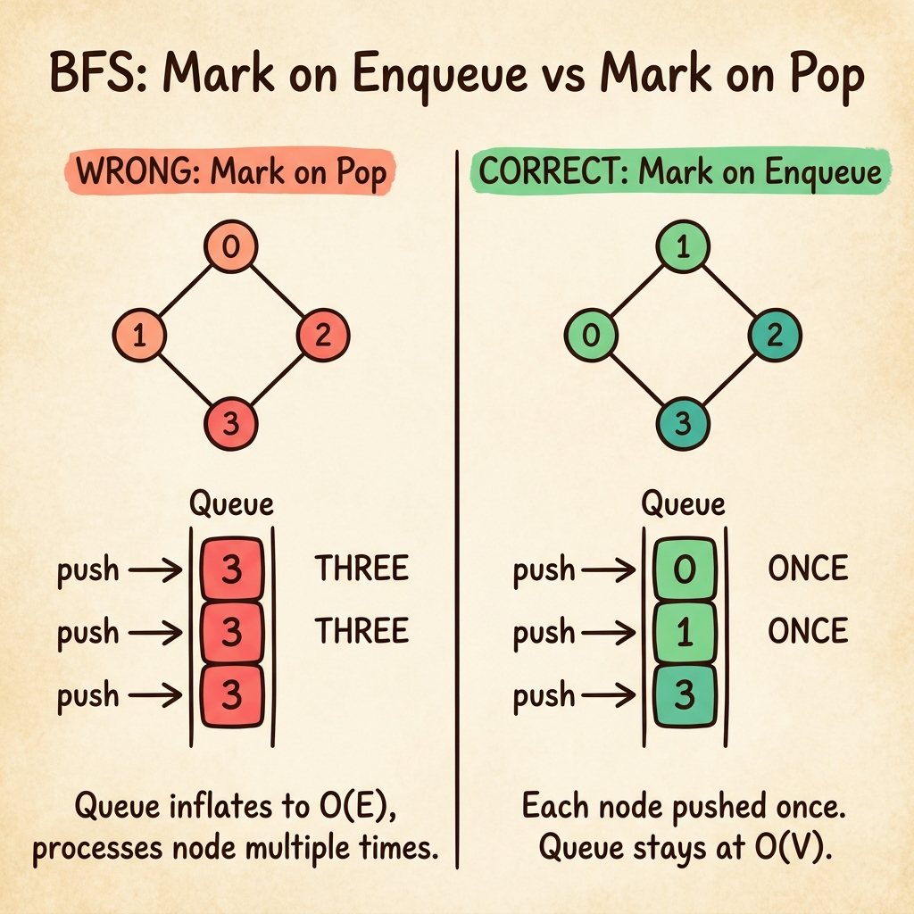

<!-- tags: dsa, algorithms, graph, bfs -->
# 🌊 BFS — Breadth-First Search

> You must find the shortest path through a maze. It is not a textbook maze, but a 100K-node social network graph. DFS returns a path, but it might be the longest path possible. You need BFS. More importantly, you must understand why a queue guarantees the shortest path.

📅 Created: 2026-03-20 · 🔄 Updated: 2026-04-09 · ⏱️ 15 min read

| Aspect | Detail |
| ------ | ------ |
| **Complexity** | O(V + E) time · O(V) space |
| **Use case** | Shortest path (unweighted), level-order traversal, connected components, bipartite check |
| **Recognition** | The problem asks for minimum steps, moves, or distance on an unweighted graph or grid |

---

## 1. DEFINE

<!-- [Beginner layer] -->
You solve a minimum moves problem on a 1000x1000 grid. You write DFS in five minutes and submit it, but hit TLE. You add a visited set, but still hit TLE. You memoize the states, but get a wrong answer. The issue is not optimization. DFS does not guarantee that the first node reached is the closest node. It dives deep into a branch while the answer sits next to the start.

<!-- [Experienced layer] -->
Breadth-First Search solves this exact problem. It explores the graph by distance layers. A FIFO queue ensures that all nodes at distance d process before any node at distance d+1. When you pop a node, it is the first time you reach it. This makes it the shortest path.

Core insight: **On an unweighted graph, the first popped node has the shortest distance from the source. The queue naturally encodes distance without a priority queue.**

| Variant | When to use | Key invariant | Example |
| ------- | -------- | --------------- | ------- |
| **BFS Traversal** | Traverse the entire graph | Mark visited before enqueue | Graph traversal order |
| **BFS Shortest Path** | Find distance and parent on an unweighted graph | `dist[v] = dist[u] + 1` when enqueued | LC 1091, Grid shortest path |
| **Level-Order BFS** | Group nodes by their level | Use `size = len(queue)` for delimiting | LC 102, Tree level-order |
| **BFS Connected Components** | Count connected components | Loop through all unvisited nodes | LC 200, Number of Islands |
| **Bipartite Check** | 2-coloring problem | `color[neighbor] != color[current]` | LC 785 |
| **Grid BFS (Maze)** | Shortest path on a 2D grid | 4-directional expansion with bounds check | LC 1293 |

| Approach | Time | Space | When to choose |
| -------- | ---- | ----- | -------- |
| DFS | O(V+E) | O(V) stack | Check reachability without needing the shortest path |
| BFS | O(V+E) | O(V) queue | Find the shortest path on an unweighted graph |
| Dijkstra | O((V+E) log V) | O(V) | Traverse graphs with positive weights |
| 0-1 BFS | O(V+E) | O(V) deque | Traverse graphs with weights of only 0 or 1 |

### 1.1 Fast recognition

- Keywords include shortest path, minimum moves, or minimum steps on an unweighted graph.
- Expand the state by levels instead of deep branches.
- A queue and a visited set suffice. Priority queues and recursion are unnecessary.

### 1.2 Invariants & Failure Modes

<!-- [Expert layer] -->
- When node `v` pops from the queue, `dist[v]` is already the shortest distance from the source. No relaxation is needed.
- **Mark visited upon enqueue, NOT upon pop**. Marking upon pop allows multiple pushes for the same node. The queue inflates, costing O(E) instead of O(V).
- Classic failure mode: Using BFS on a weighted graph produces incorrect shortest paths. BFS only works when all edge costs are equal.
- Another failure mode: Forgetting to handle disconnected graphs misses unreachable components.

---

## 2. VISUAL

The definition specifies level-by-layer traversal. The trace below shows how the queue encodes distance. It also explains why mark-on-enqueue prevents queue inflation.

### Level 1 — Simple
This trace answers the question: **How does the queue guarantee distance layer traversal?**

```text
Graph:    0 ── 1 ── 3
          |    |
          2 ── 4 ── 5

BFS from 0:

Step 1: pop 0    queue=[1,2]    visited={0,1,2}    dist: 0→0
Step 2: pop 1    queue=[2,3,4]  visited={0,1,2,3,4} dist: 1→1, 3→2, 4→2
Step 3: pop 2    queue=[3,4]    visited={...,4→skip} dist: 2→1 (4 already visited)
Step 4: pop 3    queue=[4]      visited={...}        dist: 3→2
Step 5: pop 4    queue=[5]      visited={...,5}      dist: 4→2, 5→3
Step 6: pop 5    queue=[]       done                 dist: 5→3

Order: 0 → 1 → 2 → 3 → 4 → 5
        d=0  d=1  d=1  d=2  d=2  d=3
```
*Figure: All nodes at distance d pop before any node at distance d+1. The queue naturally encodes layer ordering.*

### Level 2 — Detailed
This trace answers the question: **How does the queue inflate if you mark visited upon pop instead of enqueue?**

```text
Graph: 0 ── 1
       |  ╲ |
       2 ── 3

❌ Mark-on-pop (WRONG):
  Step 1: pop 0 → mark 0    push 1,2,3    queue=[1,2,3]
  Step 2: pop 1 → mark 1    push 0✗,3     queue=[2,3,3]  ← 3 pushed TWICE!
  Step 3: pop 2 → mark 2    push 0✗,3     queue=[3,3,3]  ← 3 pushed THRICE!
  → Queue inflates to O(E), processing the same node multiple times.

✅ Mark-on-enqueue (CORRECT):
  Step 1: pop 0             push+mark 1,2,3  queue=[1,2,3]  visited={0,1,2,3}
  Step 2: pop 1             3 already visited → skip  queue=[2,3]
  Step 3: pop 2             3 already visited → skip  queue=[3]
  Step 4: pop 3             done.  queue=[]
  → Each node pushes exactly once. Queue remains ≤ O(V).
```
*Figure: Marking visited upon enqueue prevents pushing the same node through different neighbors. This keeps the queue size at O(V) instead of O(E).*



---

## 3. CODE

The trace showed that the queue encodes distance and mark-on-enqueue keeps it compact. We now build implementations from the baseline to practical variants.

### Problem 1: BFS Traversal — Graph adjacency list
> *(Baseline: Graph structure and full graph BFS traversal.)*
>
> **Goal**: Traverse the entire graph from the start node and return the visited order in O(V+E) time and O(V) space.
> **Approach**: Use a FIFO queue and mark visited upon enqueue. Pop, process, then push unvisited neighbors.
> **Example**: A 6-node graph with edges 0-1, 0-2, 1-3, 1-4, 2-4, 4-5 yields order [0,1,2,3,4,5].

```go
package graph

import "fmt"

type Edge struct {
    To     int
    Weight float64
}

type Graph struct {
    AdjList  map[int][]Edge
    Directed bool
    Vertices int
}

func NewGraph(v int, directed bool) *Graph {
    return &Graph{AdjList: make(map[int][]Edge), Directed: directed, Vertices: v}
}

func (g *Graph) AddEdge(from, to int, w float64) {
    g.AdjList[from] = append(g.AdjList[from], Edge{To: to, Weight: w})
    if !g.Directed {
        g.AdjList[to] = append(g.AdjList[to], Edge{To: from, Weight: w})
    }
}

// ━━━━━━━━━━━━━━━━━━━━━━━━━━━━━━━━━━━━━━━━━
// BFS: traverse by breadth — level by level
// ━━━━━━━━━━━━━━━━━━━━━━━━━━━━━━━━━━━━━━━━━
func (g *Graph) BFS(start int) []int {
    visited := make(map[int]bool)
    queue := []int{start}
    visited[start] = true
    var order []int

    for len(queue) > 0 {
        vertex := queue[0]
        queue = queue[1:]
        order = append(order, vertex)

        for _, edge := range g.AdjList[vertex] {
            if !visited[edge.To] {
                visited[edge.To] = true
                queue = append(queue, edge.To)
            }
        }
    }
    return order
}
```

```typescript
type Edge = { to: number; weight: number };
class Graph {
    adj: Map<number, Edge[]> = new Map();
    constructor(public vertices: number, public directed = false) {}
    addEdge(from: number, to: number, w = 1) {
        if (!this.adj.has(from)) this.adj.set(from, []);
        this.adj.get(from)!.push({ to, weight: w });
        if (!this.directed) {
            if (!this.adj.has(to)) this.adj.set(to, []);
            this.adj.get(to)!.push({ to: from, weight: w });
        }
    }
    bfs(start: number): number[] {
        const visited = new Set([start]);
        const queue = [start], order: number[] = [];
        while (queue.length) {
            const v = queue.shift()!; order.push(v);
            for (const e of this.adj.get(v) ?? [])
                if (!visited.has(e.to)) { visited.add(e.to); queue.push(e.to); }
        }
        return order;
    }
}
```

```rust
use std::collections::{HashMap, VecDeque, HashSet};
struct Graph { adj: HashMap<usize, Vec<(usize, f64)>>, directed: bool }
impl Graph {
    fn new(directed: bool) -> Self { Self { adj: HashMap::new(), directed } }
    fn add_edge(&mut self, from: usize, to: usize, w: f64) {
        self.adj.entry(from).or_default().push((to, w));
        if !self.directed { self.adj.entry(to).or_default().push((from, w)); }
    }
    fn bfs(&self, start: usize) -> Vec<usize> {
        let mut visited = HashSet::from([start]);
        let mut queue = VecDeque::from([start]);
        let mut order = vec![];
        while let Some(v) = queue.pop_front() {
            order.push(v);
            for &(to, _) in self.adj.get(&v).unwrap_or(&vec![]) {
                if visited.insert(to) { queue.push_back(to); }
            }
        }
        order
    }
}
```

```cpp
struct Graph {
    std::unordered_map<int, std::vector<std::pair<int,double>>> adj;
    bool directed;
    void addEdge(int from, int to, double w = 1) {
        adj[from].push_back({to, w});
        if (!directed) adj[to].push_back({from, w});
    }
    std::vector<int> bfs(int start) {
        std::unordered_set<int> visited{start};
        std::queue<int> q; q.push(start);
        std::vector<int> order;
        while (!q.empty()) {
            int v = q.front(); q.pop(); order.push_back(v);
            for (auto& [to, _] : adj[v])
                if (!visited.count(to)) { visited.insert(to); q.push(to); }
        }
        return order;
    }
};
```

```python
from collections import deque, defaultdict
class Graph:
    def __init__(self, directed=False):
        self.adj = defaultdict(list); self.directed = directed
    def add_edge(self, u, v, w=1):
        self.adj[u].append((v, w))
        if not self.directed: self.adj[v].append((u, w))
    def bfs(self, start):
        visited, queue, order = {start}, deque([start]), []
        while queue:
            v = queue.popleft(); order.append(v)
            for to, _ in self.adj[v]:
                if to not in visited: visited.add(to); queue.append(to)
        return order
```

> **Why?** BFS traversal ensures each node visits exactly once because mark-on-enqueue prevents duplicate pushes. The pop order matches the increasing distance order. This makes the traversal an exploration by layer. This mechanism anchors all subsequent BFS variants.

> **Conclusion**: If you cannot explain why mark-on-enqueue maintains an O(V) queue, return to the Level 2 trace. Shortest path logic simply adds a distance array to this mechanism.

---

### Problem 2: BFS Shortest Path — Distance + Path reconstruction
> *(Add dist[] and parent[] arrays to answer "how far" and "via where".)*
>
> **Goal**: Find the shortest distance from the start to every node and reconstruct the path.
> **Approach**: Keep the BFS loop. Add dist[v] = dist[u] + 1 and parent[v] = u upon enqueue.
> **Example**: Using the previous graph with start=0, dist={0:0, 1:1, 2:1, 3:2, 4:2, 5:3}. Path 0→5 is [0,1,4,5].

```go
package graph

// ━━━━━━━━━━━━━━━━━━━━━━━━━━━━━━━━━━━━━━━━━
// BFSShortestPath: distance + parent map → reconstruct path
// ━━━━━━━━━━━━━━━━━━━━━━━━━━━━━━━━━━━━━━━━━
func (g *Graph) BFSShortestPath(start int) (dist map[int]int, parent map[int]int) {
    dist = map[int]int{start: 0}
    parent = map[int]int{start: -1}
    visited := map[int]bool{start: true}
    queue := []int{start}

    for len(queue) > 0 {
        v := queue[0]
        queue = queue[1:]
        for _, e := range g.AdjList[v] {
            if !visited[e.To] {
                visited[e.To] = true
                dist[e.To] = dist[v] + 1
                parent[e.To] = v
                queue = append(queue, e.To)
            }
        }
    }
    return
}

func ReconstructPath(parent map[int]int, target int) []int {
    var path []int
    for v := target; v != -1; v = parent[v] {
        path = append([]int{v}, path...)
    }
    return path
}
```

```typescript
// BFS shortest path (unweighted)
bfsShortestPath(start: number): { dist: Map<number, number>; parent: Map<number, number> } {
    const dist = new Map([[start, 0]]), parent = new Map([[start, -1]]);
    const visited = new Set([start]), queue = [start];
    while (queue.length) {
        const v = queue.shift()!;
        for (const e of this.adj.get(v) ?? [])
            if (!visited.has(e.to)) {
                visited.add(e.to); dist.set(e.to, dist.get(v)! + 1);
                parent.set(e.to, v); queue.push(e.to);
            }
    }
    return { dist, parent };
}
```

```rust
fn bfs_shortest_path(&self, start: usize) -> (HashMap<usize, usize>, HashMap<usize, isize>) {
    let mut dist = HashMap::from([(start, 0usize)]);
    let mut parent: HashMap<usize, isize> = HashMap::from([(start, -1)]);
    let mut visited = HashSet::from([start]);
    let mut queue = VecDeque::from([start]);
    while let Some(v) = queue.pop_front() {
        for &(to, _) in self.adj.get(&v).unwrap_or(&vec![]) {
            if visited.insert(to) {
                dist.insert(to, dist[&v] + 1);
                parent.insert(to, v as isize);
                queue.push_back(to);
            }
        }
    }
    (dist, parent)
}
```

```cpp
std::pair<std::unordered_map<int,int>, std::unordered_map<int,int>>
bfsShortestPath(int start) {
    std::unordered_map<int,int> dist{{start,0}}, parent{{start,-1}};
    std::unordered_set<int> visited{start};
    std::queue<int> q; q.push(start);
    while (!q.empty()) {
        int v = q.front(); q.pop();
        for (auto& [to,_] : adj[v]) if (!visited.count(to)) {
            visited.insert(to); dist[to] = dist[v]+1; parent[to] = v; q.push(to);
        }
    }
    return {dist, parent};
}
```

```python
def bfs_shortest_path(self, start):
    dist, parent = {start: 0}, {start: -1}
    visited, queue = {start}, deque([start])
    while queue:
        v = queue.popleft()
        for to, _ in self.adj[v]:
            if to not in visited:
                visited.add(to); dist[to] = dist[v] + 1
                parent[to] = v; queue.append(to)
    return dist, parent
```

> **Why?** The dist[v] update only applies when v is unvisited. If v enqueued earlier via another neighbor, the old distance is already the shortest due to BFS layer ordering. The parent map allows backtracking from target to start. The path remains the shortest because each node receives its parent exactly once.

> **Conclusion**: This is the most common BFS variant in interviews. Drop the parent map if the problem only asks for distance. The parent map reconstructs paths without adding time complexity.

---

### Problem 3: Level-Order BFS — Group nodes by distance layer
> *(When the problem asks "which level" instead of just "how far".)*
>
> **Goal**: Group nodes by distance layer instead of flattening them into a single list.
> **Approach**: Snapshot size = len(queue) at the start of each iteration. Pop exactly that many nodes for one level.
> **Example**: Using the previous graph with start=0, the result is [[0], [1,2], [3,4], [5]] across four levels.

```go
package graph

// BFSLevelOrder: group vertices by level
func (g *Graph) BFSLevelOrder(start int) [][]int {
    visited := map[int]bool{start: true}
    queue := []int{start}
    var levels [][]int

    for len(queue) > 0 {
        size := len(queue)
        var level []int
        for i := 0; i < size; i++ {
            v := queue[0]
            queue = queue[1:]
            level = append(level, v)
            for _, e := range g.AdjList[v] {
                if !visited[e.To] {
                    visited[e.To] = true
                    queue = append(queue, e.To)
                }
            }
        }
        levels = append(levels, level)
    }
    return levels
}
```

```typescript
bfsLevelOrder(start: number): number[][] {
    const visited = new Set([start]), queue = [start], levels: number[][] = [];
    while (queue.length) {
        const level: number[] = [], size = queue.length;
        for (let i = 0; i < size; i++) {
            const v = queue.shift()!; level.push(v);
            for (const e of this.adj.get(v) ?? [])
                if (!visited.has(e.to)) { visited.add(e.to); queue.push(e.to); }
        }
        levels.push(level);
    }
    return levels;
}
```

```rust
fn bfs_level_order(&self, start: usize) -> Vec<Vec<usize>> {
    let mut visited = HashSet::from([start]);
    let mut queue = VecDeque::from([start]);
    let mut levels = vec![];
    while !queue.is_empty() {
        let size = queue.len(); let mut level = vec![];
        for _ in 0..size {
            let v = queue.pop_front().unwrap(); level.push(v);
            for &(to, _) in self.adj.get(&v).unwrap_or(&vec![]) {
                if visited.insert(to) { queue.push_back(to); }
            }
        }
        levels.push(level);
    }
    levels
}
```

```cpp
std::vector<std::vector<int>> bfsLevelOrder(int start) {
    std::unordered_set<int> visited{start};
    std::queue<int> q; q.push(start);
    std::vector<std::vector<int>> levels;
    while (!q.empty()) {
        int sz = q.size(); std::vector<int> level;
        for (int i = 0; i < sz; i++) {
            int v = q.front(); q.pop(); level.push_back(v);
            for (auto& [to,_] : adj[v]) if (!visited.count(to)) { visited.insert(to); q.push(to); }
        }
        levels.push_back(level);
    }
    return levels;
}
```

```python
def bfs_level_order(self, start):
    visited, queue, levels = {start}, deque([start]), []
    while queue:
        level = []
        for _ in range(len(queue)):
            v = queue.popleft(); level.append(v)
            for to, _ in self.adj[v]:
                if to not in visited: visited.add(to); queue.append(to)
        levels.append(level)
    return levels
```

> **Why?** The size snapshot works because the queue contains exactly all nodes at the same distance. Popping that exact size and pushing neighbors shifts the frontier to the next layer. Skipping the snapshot mixes nodes from two different levels in the same iteration.

> **Conclusion**: Level-order variants apply when problems require minimum depth or distinct logic per distance layer.

---

### Problem 4: Connected Components — BFS on disconnected graph
> *(The "how many islands" problem running BFS from every unvisited node.)*
>
> **Goal**: Count and list connected components in an undirected graph.
> **Approach**: Loop through all nodes. Run BFS from any unvisited node to discover a new component.
> **Example**: A 6-node graph with edges {0-1, 1-2, 3-4} and an isolated node 5 yields 3 components: [[0,1,2], [3,4], [5]].

```go
package graph

// ConnectedComponents: count and list connected components
func (g *Graph) ConnectedComponents() [][]int {
    visited := make(map[int]bool)
    var components [][]int

    for v := 0; v < g.Vertices; v++ {
        if !visited[v] {
            // BFS from v → 1 component
            queue := []int{v}
            visited[v] = true
            var comp []int
            for len(queue) > 0 {
                u := queue[0]
                queue = queue[1:]
                comp = append(comp, u)
                for _, e := range g.AdjList[u] {
                    if !visited[e.To] {
                        visited[e.To] = true
                        queue = append(queue, e.To)
                    }
                }
            }
            components = append(components, comp)
        }
    }
    return components
}
```

```typescript
connectedComponents(): number[][] {
    const visited = new Set<number>(), components: number[][] = [];
    for (let v = 0; v < this.vertices; v++) {
        if (visited.has(v)) continue;
        const queue = [v], comp: number[] = []; visited.add(v);
        while (queue.length) {
            const u = queue.shift()!; comp.push(u);
            for (const e of this.adj.get(u) ?? [])
                if (!visited.has(e.to)) { visited.add(e.to); queue.push(e.to); }
        }
        components.push(comp);
    }
    return components;
}
```

```rust
fn connected_components(&self, n: usize) -> Vec<Vec<usize>> {
    let mut visited = HashSet::new();
    let mut components = vec![];
    for v in 0..n {
        if visited.contains(&v) { continue; }
        visited.insert(v);
        let mut queue = VecDeque::from([v]); let mut comp = vec![];
        while let Some(u) = queue.pop_front() {
            comp.push(u);
            for &(to, _) in self.adj.get(&u).unwrap_or(&vec![]) {
                if visited.insert(to) { queue.push_back(to); }
            }
        }
        components.push(comp);
    }
    components
}
```

```cpp
std::vector<std::vector<int>> connectedComponents(int n) {
    std::unordered_set<int> visited;
    std::vector<std::vector<int>> components;
    for (int v = 0; v < n; v++) {
        if (visited.count(v)) continue;
        visited.insert(v); std::queue<int> q; q.push(v);
        std::vector<int> comp;
        while (!q.empty()) {
            int u = q.front(); q.pop(); comp.push_back(u);
            for (auto& [to,_] : adj[u]) if (!visited.count(to)) { visited.insert(to); q.push(to); }
        }
        components.push_back(comp);
    }
    return components;
}
```

```python
def connected_components(self, n):
    visited, components = set(), []
    for v in range(n):
        if v in visited: continue
        visited.add(v); queue, comp = deque([v]), []
        while queue:
            u = queue.popleft(); comp.append(u)
            for to, _ in self.adj[u]:
                if to not in visited: visited.add(to); queue.append(to)
        components.append(comp)
    return components
```

> **Why?** Finding connected components requires running BFS multiple times from different starting points. The outer loop ensures every node visits, even in disconnected graphs. Each BFS run explores exactly one component because traversal only follows edges.

> **Conclusion**: This essential pattern appears frequently. Problems like Number of Islands or Friend Circles just count connected components on standard or implicit grid graphs.

---

### Problem 5: Bipartite Check — 2-Coloring via BFS
> *(Check if a graph splits into two groups where every edge connects different groups.)*
>
> **Goal**: Check if the graph is bipartite.
> **Approach**: Run BFS and assign alternating colors. If a neighbor shares the current color, the graph is not bipartite.
> **Example**: Graph 0-1, 1-2, 2-3, 3-0 forms an even cycle and is bipartite. Graph 0-1, 1-2, 2-0 forms an odd cycle and is not.

```go
package graph

// IsBipartite: check if graph splits into two independent groups
func (g *Graph) IsBipartite() bool {
    color := make(map[int]int) // 0=uncolored, 1=red, 2=blue

    for v := 0; v < g.Vertices; v++ {
        if color[v] != 0 { continue }

        queue := []int{v}
        color[v] = 1

        for len(queue) > 0 {
            u := queue[0]
            queue = queue[1:]
            for _, e := range g.AdjList[u] {
                if color[e.To] == 0 {
                    color[e.To] = 3 - color[u] // alternate 1↔2
                    queue = append(queue, e.To)
                } else if color[e.To] == color[u] {
                    return false // same color adjacent → NOT bipartite
                }
            }
        }
    }
    return true
}
```

```typescript
isBipartite(): boolean {
    const color = new Map<number, number>();
    for (let v = 0; v < this.vertices; v++) {
        if (color.has(v)) continue;
        const queue = [v]; color.set(v, 1);
        while (queue.length) {
            const u = queue.shift()!;
            for (const e of this.adj.get(u) ?? []) {
                if (!color.has(e.to)) { color.set(e.to, 3 - color.get(u)!); queue.push(e.to); }
                else if (color.get(e.to) === color.get(u)) return false;
            }
        }
    }
    return true;
}
```

```rust
fn is_bipartite(&self, n: usize) -> bool {
    let mut color = vec![0; n]; // 0=uncolored, 1=red, 2=blue
    for v in 0..n {
        if color[v] != 0 { continue; }
        color[v] = 1; let mut queue = VecDeque::from([v]);
        while let Some(u) = queue.pop_front() {
            for &(to, _) in self.adj.get(&u).unwrap_or(&vec![]) {
                if color[to] == 0 { color[to] = 3 - color[u]; queue.push_back(to); }
                else if color[to] == color[u] { return false; }
            }
        }
    }
    true
}
```

```cpp
bool isBipartite(int n) {
    std::vector<int> color(n, 0);
    for (int v = 0; v < n; v++) {
        if (color[v]) continue;
        color[v] = 1; std::queue<int> q; q.push(v);
        while (!q.empty()) {
            int u = q.front(); q.pop();
            for (auto& [to,_] : adj[u]) {
                if (!color[to]) { color[to] = 3 - color[u]; q.push(to); }
                else if (color[to] == color[u]) return false;
            }
        }
    }
    return true;
}
```

```python
def is_bipartite(self, n):
    color = {}
    for v in range(n):
        if v in color: continue
        queue, color[v] = deque([v]), 1
        while queue:
            u = queue.popleft()
            for to, _ in self.adj[u]:
                if to not in color: color[to] = 3 - color[u]; queue.append(to)
                elif color[to] == color[u]: return False
    return True
```

> **Why?** Bipartite checks succeed because BFS assigns colors by layer. Level 0 gets color 1, while level 1 gets color 2. A shared neighbor color proves an odd cycle exists. An odd cycle prevents any bipartite division. The 3 - color[u] trick toggles states cleanly.

> **Conclusion**: Bipartite checks appear in scheduling, graph coloring, and matching problems. When a problem asks to split items into two groups, use a bipartite check.

---

### Problem 6: Grid BFS — Maze shortest path
> *(BFS on a 2D grid is the most common interview variant.)*
>
> **Goal**: Find the shortest path on a grid where 0 is empty and 1 is a wall.
> **Approach**: Run a level-order BFS in four directions. Each cell acts as a node, and valid moves act as edges.
> **Example**: A 5x5 grid with start=(0,0) and end=(4,4) returns minimum steps or -1 if unreachable.

```go
package graph

// BFS on 2D grid: find shortest path in a maze
// 0 = empty, 1 = wall
type Point struct{ X, Y int }

func BFSGrid(grid [][]int, start, end Point) int {
    rows, cols := len(grid), len(grid[0])
    dirs := [][2]int{{0, 1}, {0, -1}, {1, 0}, {-1, 0}}
    visited := make([][]bool, rows)
    for i := range visited { visited[i] = make([]bool, cols) }

    queue := []Point{start}
    visited[start.X][start.Y] = true
    steps := 0

    for len(queue) > 0 {
        size := len(queue)
        for i := 0; i < size; i++ {
            p := queue[0]; queue = queue[1:]
            if p == end { return steps }
            for _, d := range dirs {
                nx, ny := p.X+d[0], p.Y+d[1]
                if nx >= 0 && nx < rows && ny >= 0 && ny < cols &&
                   !visited[nx][ny] && grid[nx][ny] == 0 {
                    visited[nx][ny] = true
                    queue = append(queue, Point{nx, ny})
                }
            }
        }
        steps++
    }
    return -1 // unreachable
}
```

```typescript
function bfsGrid(grid: number[][], start: [number,number], end: [number,number]): number {
    const [rows, cols] = [grid.length, grid[0].length];
    const dirs = [[0,1],[0,-1],[1,0],[-1,0]];
    const visited = Array.from({length: rows}, () => Array(cols).fill(false));
    const queue: [number,number][] = [start]; visited[start[0]][start[1]] = true;
    let steps = 0;
    while (queue.length) {
        const size = queue.length;
        for (let i = 0; i < size; i++) {
            const [x, y] = queue.shift()!;
            if (x === end[0] && y === end[1]) return steps;
            for (const [dx, dy] of dirs) {
                const [nx, ny] = [x+dx, y+dy];
                if (nx>=0 && nx<rows && ny>=0 && ny<cols && !visited[nx][ny] && !grid[nx][ny])
                    { visited[nx][ny] = true; queue.push([nx, ny]); }
            }
        }
        steps++;
    }
    return -1;
}
```

```rust
fn bfs_grid(grid: &[Vec<i32>], start: (usize,usize), end: (usize,usize)) -> i32 {
    let (rows, cols) = (grid.len(), grid[0].len());
    let dirs: [(isize,isize); 4] = [(0,1),(0,-1),(1,0),(-1,0)];
    let mut visited = vec![vec![false; cols]; rows];
    visited[start.0][start.1] = true;
    let mut queue = VecDeque::from([start]); let mut steps = 0;
    while !queue.is_empty() {
        for _ in 0..queue.len() {
            let (x, y) = queue.pop_front().unwrap();
            if (x, y) == end { return steps; }
            for (dx, dy) in &dirs {
                let (nx, ny) = (x as isize + dx, y as isize + dy);
                if nx >= 0 && nx < rows as isize && ny >= 0 && ny < cols as isize {
                    let (nx, ny) = (nx as usize, ny as usize);
                    if !visited[nx][ny] && grid[nx][ny] == 0 { visited[nx][ny] = true; queue.push_back((nx, ny)); }
                }
            }
        }
        steps += 1;
    }
    -1
}
```

```cpp
int bfsGrid(std::vector<std::vector<int>>& grid, std::pair<int,int> start, std::pair<int,int> end) {
    int rows = grid.size(), cols = grid[0].size();
    int dirs[][2] = {{0,1},{0,-1},{1,0},{-1,0}};
    std::vector<std::vector<bool>> visited(rows, std::vector<bool>(cols, false));
    std::queue<std::pair<int,int>> q; q.push(start); visited[start.first][start.second] = true;
    int steps = 0;
    while (!q.empty()) {
        int sz = q.size();
        for (int i = 0; i < sz; i++) {
            auto [x, y] = q.front(); q.pop();
            if (x == end.first && y == end.second) return steps;
            for (auto& d : dirs) {
                int nx = x+d[0], ny = y+d[1];
                if (nx>=0 && nx<rows && ny>=0 && ny<cols && !visited[nx][ny] && !grid[nx][ny])
                    { visited[nx][ny] = true; q.push({nx,ny}); }
            }
        }
        steps++;
    }
    return -1;
}
```

```python
def bfs_grid(grid, start, end):
    rows, cols = len(grid), len(grid[0])
    dirs = [(0,1),(0,-1),(1,0),(-1,0)]
    visited = [[False]*cols for _ in range(rows)]
    visited[start[0]][start[1]] = True
    queue, steps = deque([start]), 0
    while queue:
        for _ in range(len(queue)):
            x, y = queue.popleft()
            if (x, y) == end: return steps
            for dx, dy in dirs:
                nx, ny = x+dx, y+dy
                if 0<=nx<rows and 0<=ny<cols and not visited[nx][ny] and not grid[nx][ny]:
                    visited[nx][ny] = True; queue.append((nx, ny))
        steps += 1
    return -1
```

> **Why?** Grid BFS works because adjacent cells sit exactly one step away, forming an unweighted graph. Level-order BFS tracks steps accurately. Bounds and wall checks replace adjacency list lookups. Dropping bounds checks causes panics, and marking visited on pop inflates the queue.

> **Conclusion**: Grid BFS dominates interviews in problems like Rotting Oranges or Binary Matrix. Remember that a 2D grid implies a graph where four directions equal four edges per node.

---

## 4. PITFALLS

BFS looks simple, but logical errors still compile and produce silent failures. Mark visited states correctly.

| # | Severity | Error | Consequence | Fix |
|---|----------|-----|---------|-----|
| 1 | 🔴 Fatal | Using BFS for weighted graphs | Produces completely wrong shortest paths silently | Use Dijkstra for weighted graphs and BFS for unweighted |
| 2 | 🔴 Fatal | Marking visited upon pop instead of enqueue | Queue inflates to O(E), processing identical nodes multiple times | Mark visited IMMEDIATELY before pushing into the queue |
| 3 | 🟡 Common | Starting BFS from a single source on disconnected graphs | Misses unreachable components entirely | Use an outer loop across all nodes |
| 4 | 🟡 Common | Forgetting bounds checks in Grid BFS | Triggers runtime panics or index errors | Verify bounds before accessing the grid array |
| 5 | 🔵 Minor | Using slices for queues in Go | Causes memory leaks because the underlying array never shrinks | Use container/list or a circular buffer in production |

---

## 5. REF

| Resource | Type | Link | Note |
| -------- | ---- | ---- | ------- |
| VisualGo BFS | Visualization | https://visualgo.net/en/dfsbfs | Interactive BFS/DFS trace |
| CP-Algorithms BFS | Tutorial | https://cp-algorithms.com/graph/breadth-first-search.html | Detailed BFS and applications |
| Go `container/list` | Official docs | https://pkg.go.dev/container/list | Production queue replacing slices |
| BFS Wikipedia | Reference | https://en.wikipedia.org/wiki/Breadth-first_search | Formal properties and proofs |

---

## 6. RECOMMEND

BFS solves shortest paths when every edge carries equal cost. When weights vary, choose Dijkstra. If edges have directions and no cycles, use topological sort. Drop the shortest requirement and use DFS for backtracking.

| Next article | Why you should read it | Link |
| ------------- | ------------------- | ---- |
| DFS | Explores different orders for backtracking, topological sort, and cycle detection | [02-dfs.md](./02-dfs.md) |
| Dijkstra | Generalizes BFS for weighted graphs using a priority queue | [03-dijkstra.md](./03-dijkstra.md) |
| Topological Sort | Kahn's algorithm uses BFS in-degrees for DAG ordering | [06-topological-sort.md](./06-topological-sort.md) |

---

## 7. QUICK REF

| # | Pattern | Code |
|---|---------|------|
| 1 | BFS setup | `visited := make(map[int]bool); queue := []int{start}; visited[start] = true` |
| 2 | BFS loop | `for len(queue) > 0 { node := queue[0]; queue = queue[1:]; for _, nb := range g[node] { if !visited[nb] { visited[nb]=true; queue=append(queue,nb) } } }` |
| 3 | Shortest path | `dist := map[int]int{start: 0}; parent := map[int]int{}` |
| 4 | Reconstruct path | `path := []int{}; for n := end; n != start; n = parent[n] { path = append([]int{n}, path...) }` |
| 5 | Level order | `level := 0; for len(queue) > 0 { size := len(queue); for i := 0; i < size; i++ { /* process */ }; level++ }` |
| 6 | Complexity | `// O(V+E) time · O(V) space` |
| 7 | Go channel BFS | `// Use chan int as queue for concurrent graph traversal` |
| 8 | When to use | `// Shortest path unweighted, level-order, connected components` |

---

Returning to the opening question, why does DFS return the longest possible path? The LIFO stack dives deep along a single branch, ignoring nodes near the start. BFS replaces the stack with a FIFO queue to guarantee layer ordering. The closest node always pops first. Changing one data structure completely alters correctness.

**Links**: [← README](./README.md) · [→ DFS](./02-dfs.md)
