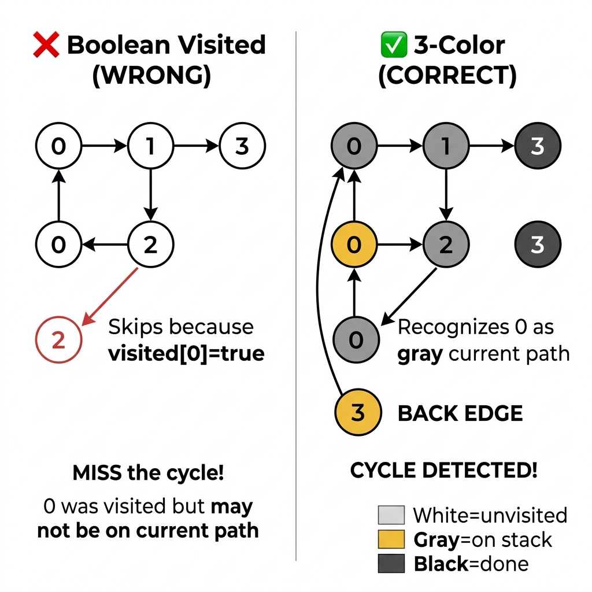

<!-- tags: dsa, algorithms, graph, dfs -->
# 🏔️ DFS — Depth-First Search

> You need to check a graph for cycles, but BFS cannot help. You must find all paths from A to B, but BFS only gives the shortest. You need a topological order, but BFS requires in-degrees while DFS only needs post-order. DFS dominates because its call stack encodes the active path. You know exactly when a branch starts and ends.

📅 Created: 2026-03-20 · 🔄 Updated: 2026-04-09 · ⏱️ 15 min read

| Aspect | Detail |
| ------ | ------ |
| **Complexity** | O(V + E) time · O(V) space |
| **Use case** | Cycle detection, topological sort, connected components, path finding, backtracking |
| **Recognition** | The problem asks for cycles, topological orders, all paths, or requires backtracking on a graph |

---

## 1. DEFINE

Some graph problems ignore shortest paths. They demand deep traversal to extract structures like components, cycles, or timestamps. Depth-First Search provides a call stack to track the open path.

DFS transforms a graph from raw nodes into a process with entrances, exits, and backtracks. Understanding this allows you to leverage discovery orders, finishing orders, and recursion stacks for advanced problems.

Core insight: **DFS power lies in exact tracking, not just diving deep. You know precisely when a branch opens, when it closes, and which states sit on the active path.**

| Variant | When to use | Key invariant | Example |
| ------- | -------- | --------------- | ------- |
| **Recursive DFS** | Baseline traversals | Call stack equals the current path | Graph traversal, tree problems |
| **Iterative DFS** | Deep graphs exceeding 10K nodes | Explicit stack replaces recursion | Deep graph traversal |
| **3-Color Cycle Detection** | Detect cycles in directed graphs | Gray marks the stack, back edges signal cycles | LC 207, Course Schedule |
| **Topological Sort (DFS)** | Ordering tasks with dependencies | Reversed post-order yields a valid topological order | LC 210, Course Schedule II |
| **DFS Backtracking** | Find all paths or combinations | Backtrack visited states after each branch | LC 797, All Paths from Source to Target |

| Approach | Time | Space | When to choose |
| -------- | ---- | ----- | -------- |
| BFS | O(V+E) | O(V) queue | Find the shortest path on unweighted graphs |
| DFS Recursive | O(V+E) | O(V) call stack | Detect cycles, sort topologically, or backtrack |
| DFS Iterative | O(V+E) | O(V) explicit stack | Traverse deep graphs and avoid stack overflows |
| Union-Find | O(V * a(V)) | O(V) | Check connectivity without reconstructing paths |

### 1.1 Fast recognition

- The problem requires cycle detection, topological orders, connected components, or backtracking.
- You must reason along an active branch instead of distance layers.
- You must distinguish active paths from fully processed paths using three colors.

### 1.2 Invariants & Failure Modes

<!-- [Expert layer] -->
- A Gray node on the recursion stack differs from a fully explored Black node. Using a single visited boolean for cycle detection fails on directed graphs.
- Every edge categorizes as tree, back, or cross. A cross edge holds no relevance for cycles.
- Classic failure mode: Using a visited boolean confuses cross edges with back edges, creating false positive cycles.
- Another failure mode: Recursive DFS on a 100K-node graph triggers a stack overflow. Switch to an iterative approach.

---

## 2. VISUAL

DFS dives deep before backtracking. The trace below shows how the recursion stack encodes the active path. It also demonstrates how three colors separate cycles from non-cycles.

### Level 1 — Simple
This trace answers the question: **How does DFS sequence traversal, and how does the recursion stack change?**

```text
Graph:    0 ── 1 ── 3
          |    |
          2    4 ── 5

DFS from 0 (recursive):

Call dfs(0)  stack=[0]
  Call dfs(1)  stack=[0,1]
    Call dfs(3)  stack=[0,1,3]  → no unvisited neighbor → return
    Call dfs(4)  stack=[0,1,4]
      Call dfs(5)  stack=[0,1,4,5] → return
    → return from 4
  → return from 1
  Call dfs(2)  stack=[0,2] → return

Order: 0 → 1 → 3 → 4 → 5 → 2
```
*Figure: DFS goes as deep as possible, backtracks, and resumes on unexplored branches. The last node visits at the very end.*

### Level 2 — Detailed
This trace answers the question: **Why does three-color logic detect cycles when boolean visited flags fail?**

```text
Directed graph: 0 → 1 → 2 → 0  (cycle!)
                      ↓
                      3

--- Boolean visited (WRONG) ---
  dfs(0): visited[0]=true → go to 1
  dfs(1): visited[1]=true → go to 2, go to 3
  dfs(2): visited[2]=true → neighbor 0, visited[0]=true → skip
  MISS the cycle! 0 was visited but may not be on current path.

--- 3-Color (CORRECT) ---
  dfs(0): color[0]=GRAY → go to 1
  dfs(1): color[1]=GRAY → go to 2
  dfs(2): color[2]=GRAY → neighbor 0 → color[0]=GRAY → BACK EDGE → CYCLE!
  
  Gray = "on the stack" = "on the current path"
  Gray → Gray = back edge = cycle
```
*Figure: A boolean visited flag cannot separate completed nodes from active stack nodes. The three-color approach maintains this distinction.*




---

## 3. CODE

The trace proved the recursion stack encodes paths while three colors detect cycles. We now build implementations from recursive basics to practical variants.

### Problem 1: Recursive DFS — Graph traversal
> *(Baseline: Traverse the entire graph using recursion.)*
>
> **Goal**: Traverse the entire graph from the start node in O(V+E) time and O(V) space.
> **Approach**: Use a recursive helper and a visited set. Recurse into unvisited neighbors.
> **Example**: A 6-node graph yields the order [0,1,3,4,5,2] by diving deep and backtracking.

```go
package graph

func (g *Graph) DFS(start int) []int {
    visited := make(map[int]bool)
    var order []int
    g.dfsHelper(start, visited, &order)
    return order
}

func (g *Graph) dfsHelper(v int, visited map[int]bool, order *[]int) {
    visited[v] = true
    *order = append(*order, v)
    for _, e := range g.AdjList[v] {
        if !visited[e.To] {
            g.dfsHelper(e.To, visited, order)
        }
    }
}
```

```typescript
dfs(start: number): number[] {
    const visited = new Set<number>(), order: number[] = [];
    const helper = (v: number) => {
        visited.add(v); order.push(v);
        for (const e of this.adj.get(v) ?? [])
            if (!visited.has(e.to)) helper(e.to);
    };
    helper(start); return order;
}
```

```rust
fn dfs(&self, start: usize) -> Vec<usize> {
    let mut visited = HashSet::new(); let mut order = vec![];
    self.dfs_helper(start, &mut visited, &mut order); order
}
fn dfs_helper(&self, v: usize, visited: &mut HashSet<usize>, order: &mut Vec<usize>) {
    visited.insert(v); order.push(v);
    for &(to, _) in self.adj.get(&v).unwrap_or(&vec![]) {
        if !visited.contains(&to) { self.dfs_helper(to, visited, order); }
    }
}
```

```cpp
std::vector<int> dfs(int start) {
    std::unordered_set<int> visited; std::vector<int> order;
    std::function<void(int)> helper = [&](int v) {
        visited.insert(v); order.push_back(v);
        for (auto& [to,_] : adj[v]) if (!visited.count(to)) helper(to);
    };
    helper(start); return order;
}
```

```python
def dfs(self, start):
    visited, order = set(), []
    def helper(v):
        visited.add(v); order.append(v)
        for to, _ in self.adj[v]:
            if to not in visited: helper(to)
    helper(start); return order
```

> **Why?** Recursive DFS works because the call stack automatically tracks the active path. Each call dives one node deeper, and each return backtracks. The visited set prevents infinite loops. This approach is concise but risks stack overflows on massive graphs.

> **Conclusion**: Recursive DFS handles basic traversals perfectly. Switch to iterative DFS when facing massive graphs or stack overflow risks.

---

### Problem 2: Iterative DFS — Explicit stack
> *(Use an explicit stack for deep graphs while preserving DFS logic.)*
>
> **Goal**: Traverse deep graphs safely without stack overflows.
> **Approach**: Use an array as a stack. Push reversed neighbors when visiting a node.
> **Example**: A massive 100K-node graph crashes recursive DFS but passes iterative DFS.

```go
package graph

// DFSIterative: explicit stack — safe for deep graphs (depth > 10K)
func (g *Graph) DFSIterative(start int) []int {
    visited := make(map[int]bool)
    stack := []int{start}
    var order []int

    for len(stack) > 0 {
        v := stack[len(stack)-1]
        stack = stack[:len(stack)-1]

        if visited[v] { continue }
        visited[v] = true
        order = append(order, v)

        neighbors := g.AdjList[v]
        for i := len(neighbors) - 1; i >= 0; i-- {
            if !visited[neighbors[i].To] {
                stack = append(stack, neighbors[i].To)
            }
        }
    }
    return order
}
```

```typescript
dfsIterative(start: number): number[] {
    const visited = new Set<number>(), stack = [start], order: number[] = [];
    while (stack.length) {
        const v = stack.pop()!;
        if (visited.has(v)) continue;
        visited.add(v); order.push(v);
        for (const e of [...(this.adj.get(v) ?? [])].reverse())
            if (!visited.has(e.to)) stack.push(e.to);
    }
    return order;
}
```

```rust
fn dfs_iterative(&self, start: usize) -> Vec<usize> {
    let mut visited = HashSet::new(); let mut stack = vec![start]; let mut order = vec![];
    while let Some(v) = stack.pop() {
        if !visited.insert(v) { continue; } order.push(v);
        for &(to, _) in self.adj.get(&v).unwrap_or(&vec![]).iter().rev() {
            if !visited.contains(&to) { stack.push(to); }
        }
    }
    order
}
```

```cpp
std::vector<int> dfsIterative(int start) {
    std::unordered_set<int> visited; std::stack<int> stk; stk.push(start);
    std::vector<int> order;
    while (!stk.empty()) {
        int v = stk.top(); stk.pop();
        if (visited.count(v)) continue;
        visited.insert(v); order.push_back(v);
        auto& nb = adj[v];
        for (int i = nb.size()-1; i >= 0; i--) if (!visited.count(nb[i].first)) stk.push(nb[i].first);
    }
    return order;
}
```

```python
def dfs_iterative(self, start):
    visited, stack, order = set(), [start], []
    while stack:
        v = stack.pop()
        if v in visited: continue
        visited.add(v); order.append(v)
        for to, _ in reversed(self.adj[v]):
            if to not in visited: stack.append(to)
    return order
```

> **Why?** Iterative DFS uses an explicit slice instead of the call stack. Pushing reversed neighbors maintains the recursive traversal order. Checking the visited state after popping simplifies code but allows duplicate stack entries. This tradeoff remains acceptable because the check prevents duplicate processing.

> **Conclusion**: Use iterative DFS when graph depths exceed 10K nodes. It provides precise stack control, though recursive DFS remains shorter for standard problems.

---

### Problem 3: Cycle Detection — 3-Color DFS
> *(Detect cycles in directed graphs where boolean visited flags fail.)*
>
> **Goal**: Detect cycles within a directed graph.
> **Approach**: Track White, Gray, and Black states. A Gray-to-Gray connection indicates a back edge and a cycle.
> **Example**: Graph 0→1→2→0 returns true. DAG 0→1→2, 0→2 returns false.

```go
package graph

const (
    White = 0 // unvisited
    Gray  = 1 // in current DFS path
    Black = 2 // fully explored
)

// HasCycle: detect cycle in directed graph
func (g *Graph) HasCycle() bool {
    color := make(map[int]int)
    for v := 0; v < g.Vertices; v++ {
        if color[v] == White {
            if g.hasCycleDFS(v, color) { return true }
        }
    }
    return false
}

func (g *Graph) hasCycleDFS(v int, color map[int]int) bool {
    color[v] = Gray
    for _, e := range g.AdjList[v] {
        if color[e.To] == Gray { return true } // back edge → CYCLE
        if color[e.To] == White {
            if g.hasCycleDFS(e.To, color) { return true }
        }
    }
    color[v] = Black
    return false
}
```

```typescript
hasCycle(): boolean {
    const color = new Map<number, number>(); // 0=white, 1=gray, 2=black
    const dfs = (v: number): boolean => {
        color.set(v, 1);
        for (const e of this.adj.get(v) ?? []) {
            if (color.get(e.to) === 1) return true;
            if (!color.has(e.to) && dfs(e.to)) return true;
        }
        color.set(v, 2); return false;
    };
    for (let v = 0; v < this.vertices; v++)
        if (!color.has(v) && dfs(v)) return true;
    return false;
}
```

```rust
fn has_cycle(&self, n: usize) -> bool {
    let mut color = vec![0u8; n]; // 0=white, 1=gray, 2=black
    fn dfs(g: &Graph, v: usize, color: &mut Vec<u8>) -> bool {
        color[v] = 1;
        for &(to, _) in g.adj.get(&v).unwrap_or(&vec![]) {
            if color[to] == 1 { return true; }
            if color[to] == 0 && dfs(g, to, color) { return true; }
        }
        color[v] = 2; false
    }
    (0..n).any(|v| color[v] == 0 && dfs(self, v, &mut color))
}
```

```cpp
bool hasCycle(int n) {
    std::vector<int> color(n, 0);
    std::function<bool(int)> dfs = [&](int v) -> bool {
        color[v] = 1;
        for (auto& [to,_] : adj[v]) {
            if (color[to] == 1) return true;
            if (color[to] == 0 && dfs(to)) return true;
        }
        color[v] = 2; return false;
    };
    for (int v = 0; v < n; v++) if (color[v] == 0 && dfs(v)) return true;
    return false;
}
```

```python
def has_cycle(self, n):
    color = [0] * n  # 0=white, 1=gray, 2=black
    def dfs(v):
        color[v] = 1
        for to, _ in self.adj[v]:
            if color[to] == 1: return True
            if color[to] == 0 and dfs(to): return True
        color[v] = 2; return False
    return any(color[v] == 0 and dfs(v) for v in range(n))
```

> **Why?** Three colors distinguish active recursion stack nodes from fully explored nodes. A back edge into a Gray node proves you reversed onto the active path, creating a cycle. A simple boolean cannot differentiate cross edges from actual cycles.

> **Conclusion**: Three-color logic is mandatory for directed graph cycle detection. Undirected graphs simplify this by tracking parent nodes to identify cycles.

---

### Problem 4: Topological Sort — DFS post-order reverse
> *(Order tasks with dependencies using DAG constraints.)*
>
> **Goal**: Find a valid topological ordering for a DAG.
> **Approach**: Run a post-order DFS. Append nodes to a stack upon return, then reverse the result.
> **Example**: DAG 0→1, 0→2, 1→3, 2→3 yields topological order [0, 2, 1, 3].

```go
package graph

import "fmt"

// TopologicalSort: DFS post-order → reverse = topo order
// Requires: Directed Acyclic Graph (DAG)
func (g *Graph) TopologicalSort() ([]int, error) {
    if !g.Directed {
        return nil, fmt.Errorf("requires directed graph")
    }
    if g.HasCycle() {
        return nil, fmt.Errorf("graph has cycle")
    }

    visited := make(map[int]bool)
    var stack []int

    var dfs func(v int)
    dfs = func(v int) {
        visited[v] = true
        for _, e := range g.AdjList[v] {
            if !visited[e.To] { dfs(e.To) }
        }
        stack = append(stack, v) // post-order
    }

    for v := 0; v < g.Vertices; v++ {
        if !visited[v] { dfs(v) }
    }

    // Reverse
    result := make([]int, len(stack))
    for i, v := range stack {
        result[len(stack)-1-i] = v
    }
    return result, nil
}
```

```typescript
topologicalSort(): number[] {
    const visited = new Set<number>(), stack: number[] = [];
    const dfs = (v: number) => {
        visited.add(v);
        for (const e of this.adj.get(v) ?? []) if (!visited.has(e.to)) dfs(e.to);
        stack.push(v);
    };
    for (let v = 0; v < this.vertices; v++) if (!visited.has(v)) dfs(v);
    return stack.reverse();
}
```

```rust
fn topological_sort(&self, n: usize) -> Vec<usize> {
    let mut visited = HashSet::new(); let mut stack = vec![];
    fn dfs(g: &Graph, v: usize, visited: &mut HashSet<usize>, stack: &mut Vec<usize>) {
        visited.insert(v);
        for &(to, _) in g.adj.get(&v).unwrap_or(&vec![]) {
            if !visited.contains(&to) { dfs(g, to, visited, stack); }
        }
        stack.push(v);
    }
    for v in 0..n { if !visited.contains(&v) { dfs(self, v, &mut visited, &mut stack); } }
    stack.reverse(); stack
}
```

```cpp
std::vector<int> topologicalSort(int n) {
    std::unordered_set<int> visited; std::vector<int> stack;
    std::function<void(int)> dfs = [&](int v) {
        visited.insert(v);
        for (auto& [to,_] : adj[v]) if (!visited.count(to)) dfs(to);
        stack.push_back(v);
    };
    for (int v = 0; v < n; v++) if (!visited.count(v)) dfs(v);
    std::reverse(stack.begin(), stack.end()); return stack;
}
```

```python
def topological_sort(self, n):
    visited, stack = set(), []
    def dfs(v):
        visited.add(v)
        for to, _ in self.adj[v]:
            if to not in visited: dfs(to)
        stack.append(v)
    for v in range(n):
        if v not in visited: dfs(v)
    return stack[::-1]
```

> **Why?** Post-order DFS appends a node only when its entire subtree finishes. Reversing this sequence places the node before all its dependencies. The outer loop ensures disconnected DAGs process completely. Cycle checks must happen first because topological sorts fail on cyclic graphs.

> **Conclusion**: Post-order DFS topological sort cleanly combines cycle detection and ordering. Choose Kahn's BFS algorithm when you need strict lexicographic order.

---

### Problem 5: Find All Paths — DFS Backtracking
> *(Find all possible paths from source to destination by backtracking visited states.)*
>
> **Goal**: List every simple path from the source to the destination.
> **Approach**: Run DFS and mark visited before recursing. Unmark visited after returning. Copy the path at the destination.
> **Example**: Graph 0→1, 0→2, 1→3, 2→3 yields paths [[0,1,3], [0,2,3]].

```go
package graph

// AllPaths: find all paths from src to dst
func (g *Graph) AllPaths(src, dst int) [][]int {
    var results [][]int
    visited := make(map[int]bool)
    path := []int{src}
    visited[src] = true

    g.allPathsDFS(src, dst, visited, path, &results)
    return results
}

func (g *Graph) allPathsDFS(curr, dst int, visited map[int]bool, path []int, results *[][]int) {
    if curr == dst {
        p := make([]int, len(path))
        copy(p, path)
        *results = append(*results, p)
        return
    }

    for _, e := range g.AdjList[curr] {
        if !visited[e.To] {
            visited[e.To] = true
            g.allPathsDFS(e.To, dst, visited, append(path, e.To), results)
            visited[e.To] = false // backtrack
        }
    }
}
```

```typescript
allPaths(src: number, dst: number): number[][] {
    const results: number[][] = [], visited = new Set([src]);
    const dfs = (v: number, path: number[]) => {
        if (v === dst) { results.push([...path]); return; }
        for (const e of this.adj.get(v) ?? []) if (!visited.has(e.to)) {
            visited.add(e.to); dfs(e.to, [...path, e.to]); visited.delete(e.to);
        }
    };
    dfs(src, [src]); return results;
}
```

```rust
fn all_paths(&self, src: usize, dst: usize) -> Vec<Vec<usize>> {
    let mut results = vec![]; let mut visited = HashSet::from([src]);
    self.all_paths_dfs(src, dst, &mut visited, &mut vec![src], &mut results);
    results
}
fn all_paths_dfs(&self, curr: usize, dst: usize, visited: &mut HashSet<usize>,
    path: &mut Vec<usize>, results: &mut Vec<Vec<usize>>) {
    if curr == dst { results.push(path.clone()); return; }
    for &(to, _) in self.adj.get(&curr).unwrap_or(&vec![]) {
        if visited.insert(to) { path.push(to); self.all_paths_dfs(to, dst, visited, path, results);
            path.pop(); visited.remove(&to); }
    }
}
```

```cpp
std::vector<std::vector<int>> allPaths(int src, int dst) {
    std::vector<std::vector<int>> results; std::unordered_set<int> visited{src};
    std::vector<int> path{src};
    std::function<void(int)> dfs = [&](int v) {
        if (v == dst) { results.push_back(path); return; }
        for (auto& [to,_] : adj[v]) if (!visited.count(to)) {
            visited.insert(to); path.push_back(to); dfs(to);
            path.pop_back(); visited.erase(to);
        }
    };
    dfs(src); return results;
}
```

```python
def all_paths(self, src, dst):
    results, visited = [], {src}
    def dfs(v, path):
        if v == dst: results.append(path[:]); return
        for to, _ in self.adj[v]:
            if to not in visited:
                visited.add(to); dfs(to, path + [to]); visited.discard(to)
    dfs(src, [src]); return results
```

> **Why?** Backtracking DFS unmarks the visited state after recursing. This lets the same node appear across different distinct paths. You must copy the path slice at the destination because backtracking modifies the reference. Use this cautiously, as worst-case performance scales to O(V!).

> **Conclusion**: DFS backtracking anchors all combination and permutation searches. Mark state before recursion and unmark it afterward. Forgetting to unmark restricts the output to a single path.

---

## 4. PITFALLS

DFS fails due to incorrect state tracking. Boolean flags break directed cycle detection. Recursive depths crash programs. Backtracking requires exact unmarking.

| # | Severity | Error | Consequence | Fix |
|---|----------|-----|---------|-----|
| 1 | 🔴 Fatal | Boolean visited states for directed cycles | Causes false positives and misses cycles | Use three colors with White, Gray, and Black states |
| 2 | 🔴 Fatal | Recursive DFS on deep graphs | Triggers stack overflows and runtime panics | Use iterative DFS with an explicit stack |
| 3 | 🟡 Common | Topological sorts on cyclic graphs | Produces completely invalid outputs silently | Check for cycles before running topological sorts |
| 4 | 🟡 Common | Forgetting to unmark visited states during backtracking | Returns only one path instead of all paths | Unmark the visited node after the recursive call |
| 5 | 🔵 Minor | Iterative DFS pushing forward neighbors | Reverses the expected recursive traversal order | Push neighbors in reverse order onto the stack |

---

## 5. REF

| Resource | Type | Link | Note |
| -------- | ---- | ---- | ------- |
| VisualGo DFS | Visualization | https://visualgo.net/en/dfsbfs | Interactive DFS trace and three colors |
| CP-Algorithms DFS | Tutorial | https://cp-algorithms.com/graph/depth-first-search.html | Detailed edge classifications |
| Wikipedia DFS | Reference | https://en.wikipedia.org/wiki/Depth-first_search | Formal DFS properties |

---

## 6. RECOMMEND

DFS solves cycles, topological sorts, and backtracking. Use BFS for shortest paths. Choose Dijkstra when weights appear. Compare Kahn's and DFS for topological sorts.

| Next article | Why you should read it | Link |
| ------------- | ------------------- | ---- |
| BFS | Use this when you need shortest paths instead of mere path existence | [01-bfs.md](./01-bfs.md) |
| Dijkstra | Extends unweighted DFS and BFS to handle weighted shortest paths | [03-dijkstra.md](./03-dijkstra.md) |
| Topological Sort | Details Kahn's BFS and post-order DFS comparisons | [06-topological-sort.md](./06-topological-sort.md) |
| Backtracking | Generalizes DFS backtracking for combinatorial search | — |

---

## 7. QUICK REF

| # | Pattern | Code |
|---|---------|------|
| 1 | Recursive DFS | `func dfs(g Graph, node int, visited map[int]bool) { visited[node]=true; for _, nb := range g[node] { if !visited[nb] { dfs(g,nb,visited) } } }` |
| 2 | Iterative DFS | `stack := []int{start}; for len(stack) > 0 { node := stack[len(stack)-1]; stack = stack[:len(stack)-1]; /* process */ }` |
| 3 | Detect cycle (directed) | `// Use 3-color: white(0)/gray(1)/black(2); gray→gray = cycle` |
| 4 | Detect cycle (undirected) | `// Track parent: if visited[nb] && nb != parent { cycle }` |
| 5 | Topological order | `// DFS + append to stack on exit; reverse at end` |
| 6 | Complexity | `// O(V+E) time · O(V) space (recursion stack)` |
| 7 | When to use | `// Cycle detection, topological sort, connected components, maze` |

---

Returning to the start, why does BFS fail to detect cycles or topological orders? BFS only knows distances. It cannot track your position on a path. DFS uses the call stack to map the active path precisely. It knows exactly when a branch closes and when to backtrack.

**Links**: [← BFS](./01-bfs.md) · [→ Dijkstra](./03-dijkstra.md) · [→ Topological Sort](./06-topological-sort.md)
