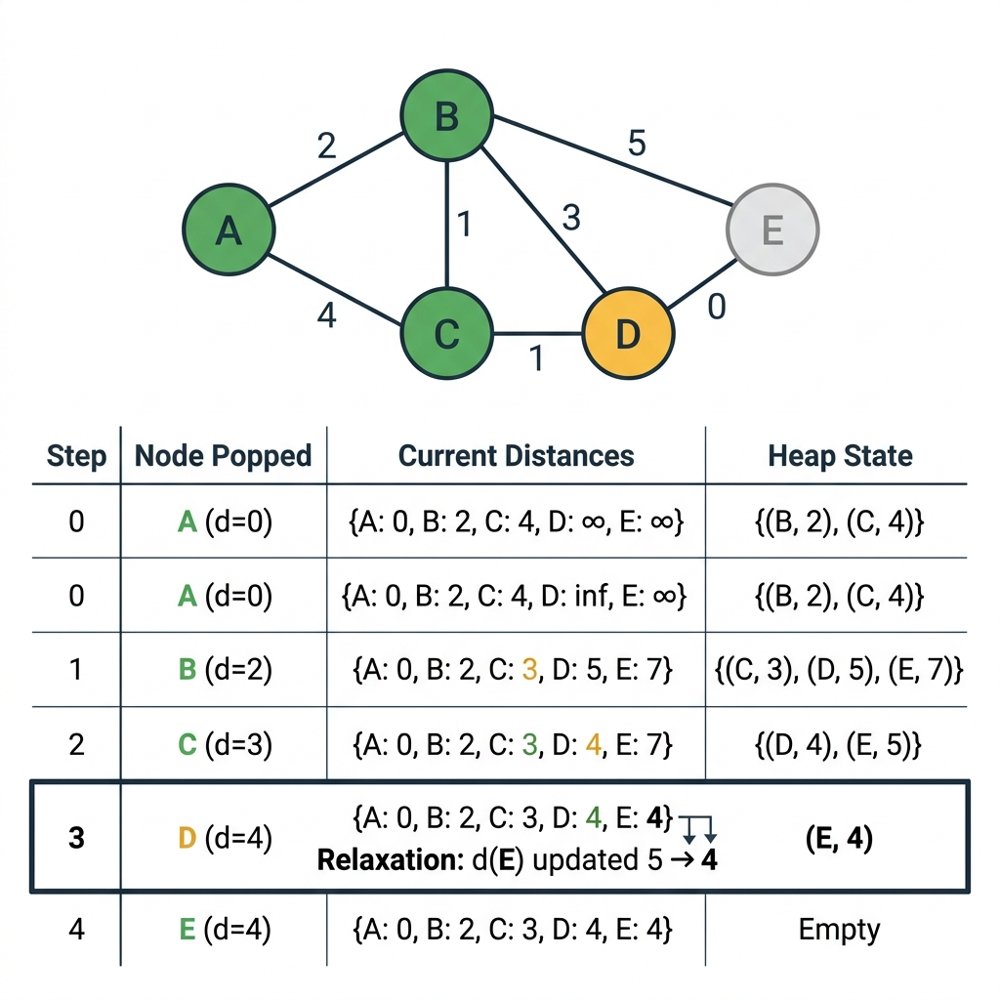

<!-- tags: dsa, algorithms, graph, dijkstra -->
# 🛤️ Dijkstra — Shortest Path

> BFS gives you the shortest path on an unweighted graph. When each edge has a different cost, BFS fails completely. A 5km highway is faster than a 2km dirt road. You need a priority queue. You must understand why popping the smallest cost node works when edge weights are non-negative.

📅 Created: 2026-03-20 · 🔄 Updated: 2026-04-09 · ⏱️ 15 min read

| Aspect | Detail |
| ------ | ------ |
| **Complexity** | O((V+E) log V) time · O(V) space |
| **Use case** | Single-source shortest path, weighted non-negative graph, GPS routing |
| **Recognition** | The problem asks for the shortest path on a graph with edge weights >= 0 |

---

## 1. DEFINE

<!-- [Beginner layer] -->
You have a weighted graph and need the shortest path. BFS fails because it ignores weights. DFS fails because it does not guarantee the shortest path. A brute-force search over all paths causes a timeout. Dijkstra solves this greedily. It always picks the unfinalized node with the smallest distance and relaxes its neighbors.

<!-- [Experienced layer] -->
Dijkstra works due to the greedy choice property. When you pop node u with the smallest dist[u] from the priority queue, dist[u] is already the shortest distance. This assumes all edge weights are non-negative. Relaxation ensures all paths through u are considered. Lazy deletion skips stale entries instead of decreasing keys. This keeps the code simple and runs in O((V+E) log V) time.

Core insight: **When you pop a node from the min-heap, its distance is final. You never revisit it. This is true only when all edge weights are non-negative. No negative edge can create a shorter shortcut through an unexplored node.**

| Variant | When to use | Key invariant | Example |
| ------- | -------- | --------------- | ------- |
| **Dijkstra + Min-Heap** | Basic single-source shortest path | Pop means finalize, then relax neighbors | LC 743 Network Delay |
| **Path Reconstruction** | When you need the actual path alongside the distance | Use a parent map and backtrack | LC 1514 |
| **Multi-Source Dijkstra** | Find the nearest facility from multiple sources | Push all sources with distance zero | Nearest hospital problem |
| **Grid Dijkstra** | Weighted grid where BFS fails | Each cell is a node with 4-directional moves | LC 1631 Minimum Effort Path |

| Approach | Time | Space | When to choose |
| -------- | ---- | ----- | -------- |
| BFS | O(V+E) | O(V) | Unweighted graphs only |
| Dijkstra (binary heap) | O((V+E) log V) | O(V) | Weighted graphs with non-negative edges |
| Bellman-Ford | O(V * E) | O(V) | Graphs with negative edges or cycle detection |
| Floyd-Warshall | O(V^3) | O(V^2) | All-pairs shortest path on dense graphs |

### 1.1 Fast recognition

- The problem asks for the shortest path on a graph with non-negative edge weights.
- The input is a weighted graph or grid, making BFS insufficient.
- A priority queue acts as the core data structure.

### 1.2 Invariants & Failure Modes

<!-- [Expert layer] -->
- **Greedy property**: When popping (dist, u) from the heap, dist equals the shortest distance to u. This requires non-negative weights.
- **Lazy deletion**: The heap may contain stale entries (old_dist, u). Skip them when old_dist > dist[u].
- Classic failure mode: Using Dijkstra on a graph with negative weights produces wrong results. Negative edges allow cheaper paths through finalized nodes.
- Another failure mode: Forgetting the dist > dist[u] check upon pop processes the same node multiple times. This degrades performance to O(E log E).

---

## 2. VISUAL

Theory says to pop the minimum and relax neighbors. It sounds simple. Why does finalizing upon pop work? Why do negative weights break it? The two traces below answer both questions by showing step-by-step state changes.

### Level 1 — Simple
This trace answers the question: **In what order does Dijkstra relax edges, and why is the greedy choice correct?**


*Figure: Overview of the relaxation process. Green nodes are finalized. Yellow nodes are tentative. Step 3 shows distance E dropping from 5 to 4 via D.*

**ASCII trace:**

```text
Graph:  A --2-- B --1-- D
        |       |       |
        4       3       1
        |       |       |
        C ------5-------E

Dijkstra from A:

Step | Pop    | dist state          | Heap after relax
-----|--------|---------------------|---------------------------
  1  | A(0)   | A=0, B=2, C=4      | [(2,B), (4,C)]
  2  | B(2)   | D=3, E=5           | [(3,D), (4,C), (5,E)]
  3  | D(3)   | E=4 (3+1, better!) | [(4,C), (4,E)]
  4  | C(4)   | no improvement      | [(4,E)]
  5  | E(4)   | done                | []

Final: A=0, B=2, C=4, D=3, E=4
```
*Figure: Step 3 relaxes E from 5 down to 4 via D. The greedy choice is correct because all weights are non-negative. No shorter path exists through an unvisited node.*

### Level 2 — Detailed
This trace answers the question: **Why do negative weights break Dijkstra?**

```text
Graph: A --1-- B --(-3)-- C
       |                  |
       4                  0
       |                  |
       D --------2--------+

Dijkstra from A:
  Pop A(0): dist[B]=1, dist[D]=4
  Pop B(1): dist[C]=1+(-3)=-2  ← relax C
  Pop C(-2): done
  Pop D(4): done

Dijkstra says: A→C = -2 (via A→B→C)

BUT actual shortest: A→D→C→B→C = 4+0+(-3) = 1???
No — A→B→C = -2 IS correct here.

REAL problem: A→B finalized at step 2 with dist=1.
If there was a path A→D→...→B with dist < 1 (via negative edge),
Dijkstra ALREADY finalized B and won't revisit it.
```
*Figure: A negative weight edge makes a path cheaper through an already finalized node. This violates the greedy property. Use Bellman-Ford instead.*

---

## 3. CODE

The trace showed how relaxation works. The distance updates multiple times before finalizing, and stale entries get skipped naturally. The remaining question is: where do people make mistakes when writing the code?
The four problems below escalate from a baseline graph to a weighted grid. Each problem introduces a variant that the previous one missed.

### Problem 1: Single-source Dijkstra — Min-heap baseline
> *(Find the shortest distance from the source to all nodes in a weighted graph.)*
>
> **Goal**: Compute the single-source shortest path.
> **Approach**: Use a min-heap with lazy deletion. Relax edges using dist[v] = min(dist[v], dist[u] + w).
> **Example**: Using the previous graph with start=A, the distances are {A:0, B:2, C:4, D:3, E:4}.

```go
package graph

import (
    "container/heap"
    "math"
)

type Item struct {
    Vertex   int
    Distance float64
}

type PQ []*Item
func (pq PQ) Len() int            { return len(pq) }
func (pq PQ) Less(i, j int) bool  { return pq[i].Distance < pq[j].Distance }
func (pq PQ) Swap(i, j int)       { pq[i], pq[j] = pq[j], pq[i] }
func (pq *PQ) Push(x interface{}) { *pq = append(*pq, x.(*Item)) }
func (pq *PQ) Pop() interface{} {
    old := *pq; n := len(old); item := old[n-1]; *pq = old[:n-1]; return item
}

// ━━━━━━━━━━━━━━━━━━━━━━━━━━━━━━━━━━━━━━━━━
// Dijkstra: single-source shortest path
//
// Greedy: always pick vertex with minimum distance
// Lazy deletion: skip stale entries instead of decrease-key
// ━━━━━━━━━━━━━━━━━━━━━━━━━━━━━━━━━━━━━━━━━
func (g *Graph) Dijkstra(start int) (dist map[int]float64, parent map[int]int) {
    dist = make(map[int]float64)
    parent = make(map[int]int)
    for v := 0; v < g.Vertices; v++ {
        dist[v] = math.Inf(1)
        parent[v] = -1
    }
    dist[start] = 0

    pq := &PQ{}
    heap.Init(pq)
    heap.Push(pq, &Item{start, 0})

    for pq.Len() > 0 {
        curr := heap.Pop(pq).(*Item)
        u := curr.Vertex

        if curr.Distance > dist[u] { continue } // stale entry

        for _, e := range g.AdjList[u] {
            nd := dist[u] + e.Weight
            if nd < dist[e.To] {
                dist[e.To] = nd
                parent[e.To] = u
                heap.Push(pq, &Item{e.To, nd})
            }
        }
    }
    return
}
```

```typescript
class MinHeap<T> {
    private data: T[] = []; constructor(private cmp: (a:T,b:T)=>number) {}
    push(v:T) { this.data.push(v); this.up(this.data.length-1); }
    pop(): T { const top=this.data[0]; const last=this.data.pop()!; if(this.data.length){this.data[0]=last;this.down(0);} return top; }
    get size() { return this.data.length; }
    private up(i:number) { while(i>0){ const p=(i-1)>>1; if(this.cmp(this.data[i],this.data[p])<0){[this.data[i],this.data[p]]=[this.data[p],this.data[i]];i=p;}else break;} }
    private down(i:number) { const n=this.data.length; while(2*i+1<n){ let j=2*i+1; if(j+1<n&&this.cmp(this.data[j+1],this.data[j])<0)j++; if(this.cmp(this.data[j],this.data[i])<0){[this.data[i],this.data[j]]=[this.data[j],this.data[i]];i=j;}else break;} }
}
dijkstra(start: number): { dist: Map<number,number>; parent: Map<number,number> } {
    const dist = new Map<number,number>(), parent = new Map<number,number>();
    for (let v = 0; v < this.vertices; v++) { dist.set(v, Infinity); parent.set(v, -1); }
    dist.set(start, 0);
    const pq = new MinHeap<[number,number]>((a,b) => a[1]-b[1]);
    pq.push([start, 0]);
    while (pq.size) {
        const [u, d] = pq.pop();
        if (d > dist.get(u)!) continue;
        for (const e of this.adj.get(u) ?? []) {
            const nd = dist.get(u)! + e.weight;
            if (nd < dist.get(e.to)!) { dist.set(e.to, nd); parent.set(e.to, u); pq.push([e.to, nd]); }
        }
    }
    return { dist, parent };
}
```

```rust
use std::collections::BinaryHeap;
use std::cmp::Reverse;
fn dijkstra(&self, start: usize, n: usize) -> (Vec<f64>, Vec<isize>) {
    let mut dist = vec![f64::INFINITY; n]; let mut parent = vec![-1isize; n];
    dist[start] = 0.0;
    let mut heap = BinaryHeap::new();
    heap.push(Reverse((ordered_float::OrderedFloat(0.0), start)));
    while let Some(Reverse((d, u))) = heap.pop() {
        if d.0 > dist[u] { continue; }
        for &(to, w) in self.adj.get(&u).unwrap_or(&vec![]) {
            let nd = dist[u] + w;
            if nd < dist[to] { dist[to] = nd; parent[to] = u as isize;
                heap.push(Reverse((ordered_float::OrderedFloat(nd), to))); }
        }
    }
    (dist, parent)
}
```

```cpp
std::pair<std::vector<double>, std::vector<int>>
dijkstra(int start, int n) {
    std::vector<double> dist(n, 1e18); std::vector<int> parent(n, -1);
    dist[start] = 0;
    std::priority_queue<std::pair<double,int>, std::vector<std::pair<double,int>>, std::greater<>> pq;
    pq.push({0, start});
    while (!pq.empty()) {
        auto [d, u] = pq.top(); pq.pop();
        if (d > dist[u]) continue;
        for (auto& [to, w] : adj[u]) {
            double nd = dist[u] + w;
            if (nd < dist[to]) { dist[to] = nd; parent[to] = u; pq.push({nd, to}); }
        }
    }
    return {dist, parent};
}
```

```python
import heapq
def dijkstra(self, start, n):
    dist, parent = [float('inf')] * n, [-1] * n
    dist[start] = 0; heap = [(0, start)]
    while heap:
        d, u = heapq.heappop(heap)
        if d > dist[u]: continue
        for to, w in self.adj[u]:
            nd = dist[u] + w
            if nd < dist[to]: dist[to] = nd; parent[to] = u; heapq.heappush(heap, (nd, to))
    return dist, parent
```

> **Why?** The min-heap ensures you always pop the node with the smallest distance. The condition dist > dist[u] skips stale entries. This replaces the complex decrease-key operation. Lazy deletion is simpler. You push duplicates and skip them later. Total pushes equal O(E). Each push takes O(log V), yielding O(E log V) overall.

> **Conclusion**: This is the baseline Dijkstra. It suffices if the problem only asks for distances. Interviews and production systems usually ask for the actual path. You need to know how to reconstruct it.

The baseline answers "how far" but not "via which path". Adding one line of code gives you both.

---

### Problem 2: Dijkstra + Path Reconstruction
> *(When the problem asks for both distance and the actual path.)*
>
> **Goal**: Find the shortest distance and reconstruct the path.
> **Approach**: Add a parent map to the baseline Dijkstra. Backtrack from the target to the source.
> **Example**: ShortestPath(0, 4) on the graph yields cost=6 and path=[0,1,2,4].

```go
package graph

import "fmt"

func (g *Graph) ShortestPath(src, dst int) (float64, []int) {
    dist, parent := g.Dijkstra(src)
    if dist[dst] == math.Inf(1) {
        return -1, nil
    }
    path := ReconstructPath(parent, dst)
    return dist[dst], path
}

func exampleDijkstra() {
    g := NewGraph(5, false)
    g.AddEdge(0, 1, 2)
    g.AddEdge(0, 2, 4)
    g.AddEdge(1, 2, 1)
    g.AddEdge(1, 3, 7)
    g.AddEdge(2, 4, 3)
    g.AddEdge(3, 4, 1)

    cost, path := g.ShortestPath(0, 4)
    fmt.Printf("Cost: %.0f, Path: %v\n", cost, path)
    // Cost: 6, Path: [0 1 2 4]
}
```

```typescript
shortestPath(src: number, dst: number): { cost: number; path: number[] } {
    const { dist, parent } = this.dijkstra(src);
    if (dist.get(dst) === Infinity) return { cost: -1, path: [] };
    const path: number[] = []; for (let v = dst; v !== -1; v = parent.get(v)!) path.unshift(v);
    return { cost: dist.get(dst)!, path };
}
```

```rust
fn shortest_path(&self, src: usize, dst: usize, n: usize) -> (f64, Vec<usize>) {
    let (dist, parent) = self.dijkstra(src, n);
    if dist[dst] == f64::INFINITY { return (-1.0, vec![]); }
    let mut path = vec![]; let mut v = dst as isize;
    while v != -1 { path.push(v as usize); v = parent[v as usize]; }
    path.reverse(); (dist[dst], path)
}
```

```cpp
std::pair<double, std::vector<int>> shortestPath(int src, int dst, int n) {
    auto [dist, parent] = dijkstra(src, n);
    if (dist[dst] >= 1e18) return {-1, {}};
    std::vector<int> path; for (int v = dst; v != -1; v = parent[v]) path.push_back(v);
    std::reverse(path.begin(), path.end()); return {dist[dst], path};
}
```

```python
def shortest_path(self, src, dst, n):
    dist, parent = self.dijkstra(src, n)
    if dist[dst] == float('inf'): return -1, []
    path = []; v = dst
    while v != -1: path.append(v); v = parent[v]
    return dist[dst], path[::-1]
```

> **Why?** The parent map only requires one extra line: parent[v] = u during relaxation. Backtracking from destination to source via the parent chain reconstructs the path. The path is always the shortest because parents only update when finding a shorter path. This adds no time complexity.

> **Conclusion**: Path reconstruction is the simplest extension of Dijkstra. Most interview problems require both the distance and the path. This code covers both requirements.

Now you can find the shortest path from a single source. What if the problem asks for the nearest hospital from every city? Running Dijkstra N times is too slow. There is a much faster way.

---

### Problem 3: Multi-Source Dijkstra — Nearest facility
> *(Find the nearest node from ANY source in a single Dijkstra run.)*
>
> **Goal**: Find the shortest distance from the nearest source to all nodes.
> **Approach**: Push all sources into the heap with zero distance, then run Dijkstra normally.
> **Example**: Given 3 hospitals and 1000 cities, each city finds its nearest hospital.

```go
package graph

import (
    "container/heap"
    "math"
)

// MultiSourceDijkstra: shortest distance from ANY source
// Use case: "nearest hospital from every city"
func (g *Graph) MultiSourceDijkstra(sources []int) map[int]float64 {
    dist := make(map[int]float64)
    for v := 0; v < g.Vertices; v++ {
        dist[v] = math.Inf(1)
    }

    pq := &PQ{}
    heap.Init(pq)
    for _, s := range sources {
        dist[s] = 0
        heap.Push(pq, &Item{s, 0})
    }

    for pq.Len() > 0 {
        curr := heap.Pop(pq).(*Item)
        if curr.Distance > dist[curr.Vertex] { continue }
        for _, e := range g.AdjList[curr.Vertex] {
            nd := dist[curr.Vertex] + e.Weight
            if nd < dist[e.To] {
                dist[e.To] = nd
                heap.Push(pq, &Item{e.To, nd})
            }
        }
    }
    return dist
}
```

```typescript
multiSourceDijkstra(sources: number[]): Map<number, number> {
    const dist = new Map<number, number>();
    for (let v = 0; v < this.vertices; v++) dist.set(v, Infinity);
    const pq = new MinHeap<[number,number]>((a,b) => a[1]-b[1]);
    for (const s of sources) { dist.set(s, 0); pq.push([s, 0]); }
    while (pq.size) {
        const [u, d] = pq.pop();
        if (d > dist.get(u)!) continue;
        for (const e of this.adj.get(u) ?? []) {
            const nd = dist.get(u)! + e.weight;
            if (nd < dist.get(e.to)!) { dist.set(e.to, nd); pq.push([e.to, nd]); }
        }
    }
    return dist;
}
```

```rust
fn multi_source_dijkstra(&self, sources: &[usize], n: usize) -> Vec<f64> {
    let mut dist = vec![f64::INFINITY; n];
    let mut heap = BinaryHeap::new();
    for &s in sources { dist[s] = 0.0; heap.push(Reverse((ordered_float::OrderedFloat(0.0), s))); }
    while let Some(Reverse((d, u))) = heap.pop() {
        if d.0 > dist[u] { continue; }
        for &(to, w) in self.adj.get(&u).unwrap_or(&vec![]) {
            let nd = dist[u] + w;
            if nd < dist[to] { dist[to] = nd; heap.push(Reverse((ordered_float::OrderedFloat(nd), to))); }
        }
    }
    dist
}
```

```cpp
std::vector<double> multiSourceDijkstra(const std::vector<int>& sources, int n) {
    std::vector<double> dist(n, 1e18);
    std::priority_queue<std::pair<double,int>, std::vector<std::pair<double,int>>, std::greater<>> pq;
    for (int s : sources) { dist[s] = 0; pq.push({0, s}); }
    while (!pq.empty()) {
        auto [d, u] = pq.top(); pq.pop();
        if (d > dist[u]) continue;
        for (auto& [to, w] : adj[u]) { double nd = dist[u]+w; if (nd < dist[to]) { dist[to]=nd; pq.push({nd,to}); } }
    }
    return dist;
}
```

```python
def multi_source_dijkstra(self, sources, n):
    dist = [float('inf')] * n; heap = []
    for s in sources: dist[s] = 0; heapq.heappush(heap, (0, s))
    while heap:
        d, u = heapq.heappop(heap)
        if d > dist[u]: continue
        for to, w in self.adj[u]:
            nd = dist[u] + w
            if nd < dist[to]: dist[to] = nd; heapq.heappush(heap, (nd, to))
    return dist
```

> **Why?** Multi-source Dijkstra creates a virtual source node connecting all actual sources with zero weight. Instead of running Dijkstra N times, you push all sources initially. The algorithm runs exactly once in O((V+E) log V) time. Each node gets finalized by its nearest source.

> **Conclusion**: Multi-source patterns appear in problems asking for the nearest facility. Initialize multiple zero distances, and the rest is identical to single-source Dijkstra.

The previous problems use explicit adjacency lists. Interviews often provide grids without adjacency lists. Each cell has a different weight, so BFS fails. This is where Dijkstra meets implicit graphs.

---

### Problem 4: Grid Dijkstra — Weighted 2D grid
> *(When the grid has varying weights at each cell, BFS cannot be used.)*
>
> **Goal**: Find the shortest path on a weighted grid.
> **Approach**: Treat each cell as a node. The cell weight is the entry cost. Use a priority queue.
> **Example**: A 5x5 grid with start=(0,0) and end=(4,4) returns the minimum total cost.

```go
package graph

import (
    "container/heap"
    "math"
)

// Grid Dijkstra: weighted 2D grid, each cell has cost
func DijkstraGrid(grid [][]int, start, end [2]int) int {
    rows, cols := len(grid), len(grid[0])
    dist := make([][]float64, rows)
    for i := range dist {
        dist[i] = make([]float64, cols)
        for j := range dist[i] { dist[i][j] = math.Inf(1) }
    }
    dist[start[0]][start[1]] = float64(grid[start[0]][start[1]])

    pq := &PQ{}
    heap.Push(pq, &Item{Vertex: start[0]*cols + start[1], Distance: dist[start[0]][start[1]]})

    dirs := [][2]int{{0, 1}, {0, -1}, {1, 0}, {-1, 0}}
    for pq.Len() > 0 {
        curr := heap.Pop(pq).(*Item)
        x, y := curr.Vertex/cols, curr.Vertex%cols
        if x == end[0] && y == end[1] { return int(curr.Distance) }
        if curr.Distance > dist[x][y] { continue }

        for _, d := range dirs {
            nx, ny := x+d[0], y+d[1]
            if nx >= 0 && nx < rows && ny >= 0 && ny < cols {
                nd := dist[x][y] + float64(grid[nx][ny])
                if nd < dist[nx][ny] {
                    dist[nx][ny] = nd
                    heap.Push(pq, &Item{Vertex: nx*cols + ny, Distance: nd})
                }
            }
        }
    }
    return -1
}
```

```typescript
function dijkstraGrid(grid: number[][], start: [number,number], end: [number,number]): number {
    const [rows, cols] = [grid.length, grid[0].length];
    const dist = Array.from({length: rows}, () => Array(cols).fill(Infinity));
    dist[start[0]][start[1]] = grid[start[0]][start[1]];
    const pq = new MinHeap<[number,number,number]>((a,b) => a[2]-b[2]);
    pq.push([start[0], start[1], dist[start[0]][start[1]]]);
    const dirs = [[0,1],[0,-1],[1,0],[-1,0]];
    while (pq.size) {
        const [x, y, d] = pq.pop();
        if (x === end[0] && y === end[1]) return d;
        if (d > dist[x][y]) continue;
        for (const [dx, dy] of dirs) {
            const [nx, ny] = [x+dx, y+dy];
            if (nx>=0 && nx<rows && ny>=0 && ny<cols) {
                const nd = dist[x][y] + grid[nx][ny];
                if (nd < dist[nx][ny]) { dist[nx][ny] = nd; pq.push([nx, ny, nd]); }
            }
        }
    }
    return -1;
}
```

```rust
fn dijkstra_grid(grid: &[Vec<i32>], start: (usize,usize), end: (usize,usize)) -> i32 {
    let (rows, cols) = (grid.len(), grid[0].len());
    let mut dist = vec![vec![i32::MAX; cols]; rows];
    dist[start.0][start.1] = grid[start.0][start.1];
    let mut heap = BinaryHeap::new();
    heap.push(Reverse((grid[start.0][start.1], start)));
    let dirs: [(isize,isize);4] = [(0,1),(0,-1),(1,0),(-1,0)];
    while let Some(Reverse((d, (x,y)))) = heap.pop() {
        if (x,y) == end { return d; }
        if d > dist[x][y] { continue; }
        for (dx,dy) in &dirs {
            let (nx,ny) = (x as isize+dx, y as isize+dy);
            if nx>=0 && nx<rows as isize && ny>=0 && ny<cols as isize {
                let (nx,ny) = (nx as usize, ny as usize);
                let nd = dist[x][y] + grid[nx][ny];
                if nd < dist[nx][ny] { dist[nx][ny] = nd; heap.push(Reverse((nd,(nx,ny)))); }
            }
        }
    }
    -1
}
```

```cpp
int dijkstraGrid(std::vector<std::vector<int>>& grid, std::pair<int,int> start, std::pair<int,int> end) {
    int rows = grid.size(), cols = grid[0].size();
    std::vector<std::vector<double>> dist(rows, std::vector<double>(cols, 1e18));
    dist[start.first][start.second] = grid[start.first][start.second];
    std::priority_queue<std::tuple<double,int,int>, std::vector<std::tuple<double,int,int>>, std::greater<>> pq;
    pq.push({dist[start.first][start.second], start.first, start.second});
    int dirs[][2] = {{0,1},{0,-1},{1,0},{-1,0}};
    while (!pq.empty()) {
        auto [d,x,y] = pq.top(); pq.pop();
        if (x==end.first && y==end.second) return (int)d;
        if (d > dist[x][y]) continue;
        for (auto& dir : dirs) { int nx=x+dir[0], ny=y+dir[1];
            if (nx>=0&&nx<rows&&ny>=0&&ny<cols) { double nd=dist[x][y]+grid[nx][ny];
                if (nd<dist[nx][ny]) { dist[nx][ny]=nd; pq.push({nd,nx,ny}); } } }
    }
    return -1;
}
```

```python
def dijkstra_grid(grid, start, end):
    rows, cols = len(grid), len(grid[0])
    dist = [[float('inf')]*cols for _ in range(rows)]
    dist[start[0]][start[1]] = grid[start[0]][start[1]]
    heap = [(dist[start[0]][start[1]], *start)]
    dirs = [(0,1),(0,-1),(1,0),(-1,0)]
    while heap:
        d, x, y = heapq.heappop(heap)
        if (x, y) == end: return d
        if d > dist[x][y]: continue
        for dx, dy in dirs:
            nx, ny = x+dx, y+dy
            if 0<=nx<rows and 0<=ny<cols:
                nd = dist[x][y] + grid[nx][ny]
                if nd < dist[nx][ny]: dist[nx][ny] = nd; heapq.heappush(heap, (nd, nx, ny))
    return -1
```

> **Why?** Grid Dijkstra works because each cell is a node, and the weight is the target cell cost. The vertex encoding row * cols + col converts 2D coordinates to 1D for the heap. Lazy deletion checking stale entries remains necessary. BFS fails here because varying weights violate its layer guarantee.

> **Conclusion**: Grid Dijkstra is common in interviews. The pattern uses an implicit grid graph, explicit cell weights, and a priority queue. If the grid only has 0 and 1 weights, use 0-1 BFS with a deque for faster execution.

---

## 4. PITFALLS

Knowing how to implement Dijkstra is only half the battle. The other half is recognizing silent failures in code that looks correct.

| # | Severity | Error | Consequence | Fix |
|---|----------|-----|---------|-----|
| 1 | 🔴 Fatal | Using on negative weight edges | Shortest path is completely wrong silently | Use Bellman-Ford or SPFA instead |
| 2 | 🔴 Fatal | Forgetting to skip stale entries | Processes the same node multiple times, degrading to O(E^2) | Add `if d > dist[u]: continue` |
| 3 | 🟡 Common | Forgetting to initialize distances to infinity | Relaxation fails and returns wrong paths | Initialize `dist = [inf] * n` and `dist[src] = 0` |
| 4 | 🟡 Common | Incorrect 1D encoding on a 2D grid | Causes wrong index access and panics | Double-check `x = vertex / cols` and `y = vertex % cols` |
| 5 | 🔵 Minor | Using heaps on dense graphs | Runs slower than necessary | Use an adjacency matrix with O(V^2) Dijkstra |

---

## 5. REF

| Resource | Type | Link | Note |
| -------- | ---- | ---- | ------- |
| VisualGo Dijkstra | Visualization | https://visualgo.net/en/sssp | Interactive trace |
| CP-Algorithms | Tutorial | https://cp-algorithms.com/graph/dijkstra.html | Detailed explanation and variants |
| Go `container/heap` | Official docs | https://pkg.go.dev/container/heap | Min-heap interface |
| Wikipedia | Reference | https://en.wikipedia.org/wiki/Dijkstra%27s_algorithm | Correctness proofs |

---

## 6. RECOMMEND

Dijkstra solves single-source shortest paths when all weights are non-negative. Changing one condition requires a completely different algorithm. Adding negative edges, heuristics, or spanning tree requirements forces a switch.

| Next article | Why you should read it | Link |
| ------------- | ------------------- | ---- |
| Bellman-Ford | Handles negative weight edges by relaxing V-1 times | — |
| A* Search | Adds heuristics to Dijkstra to cut the search space for point-to-point routing | [../important-algorithms/04-a-star.md](../important-algorithms/04-a-star.md) |
| 0-1 BFS | Handles 0 or 1 weights using a deque in O(V+E) time | — |
| Kruskal/Prim | Shifts the focus from shortest paths to minimum spanning trees | [04-kruskal.md](./04-kruskal.md) |

---

## 7. QUICK REF

| # | Pattern | Code |
|---|---------|------|
| 1 | Priority queue item | `type Item struct { node, dist int }` |
| 2 | Init dist | `dist := make([]int, n); for i := range dist { dist[i] = math.MaxInt }; dist[src] = 0` |
| 3 | Heap loop | `for pq.Len() > 0 { curr := heap.Pop(&pq).(Item); if curr.dist > dist[curr.node] { continue } /* relax edges */ }` |
| 4 | Relax edge | `if d := dist[u] + w; d < dist[v] { dist[v] = d; heap.Push(&pq, Item{v, d}) }` |
| 5 | Complexity | `// O((V+E) log V) with binary heap · O(V²) naive` |
| 6 | No negative edges | `// ⚠️ Fails with negative weights → use Bellman-Ford` |
| 7 | container/heap | `import "container/heap"  // implement heap.Interface` |
| 8 | When to use | `// Single-source shortest path, non-negative weights` |

---

Returning to the start, why does BFS fail on weighted graphs? BFS finalizes nodes by layer count, not cumulative weight. Dijkstra replaces the FIFO queue with a min-heap. It replaces the visited flag with a finalized minimum distance check. One small data structure change completely alters the traversal semantics.

**Links**: [← DFS](./02-dfs.md) · [→ Kruskal](./04-kruskal.md) · [→ Prim](./05-prim.md)
