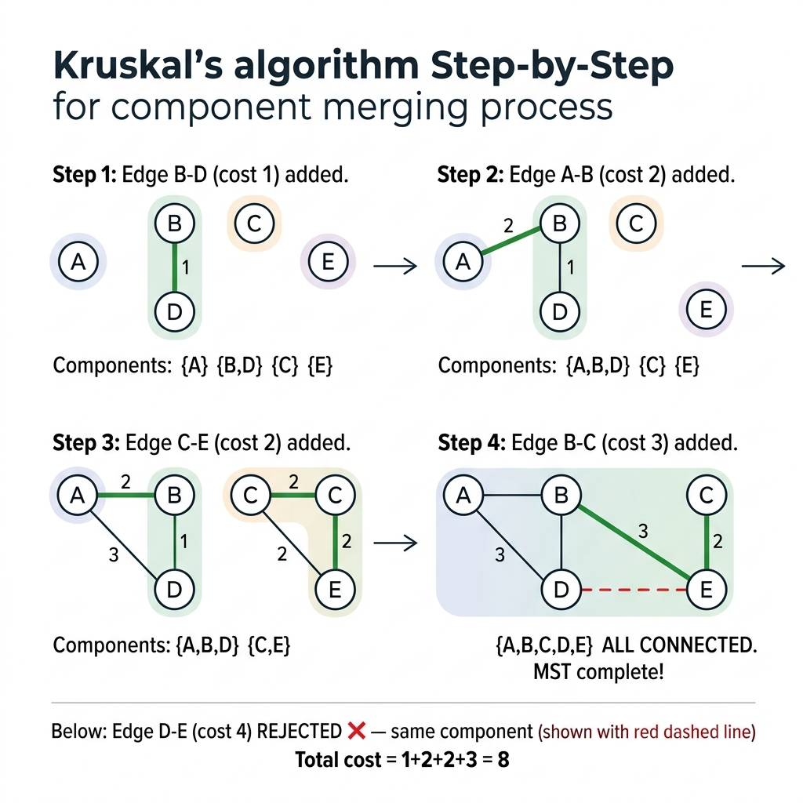

<!-- tags: dsa, algorithms, graph, mst, kruskal -->
# 🌲 Kruskal — Minimum Spanning Tree

> You have 100 cities to connect with roads. Each road has a different cost. Connecting all of them bankrupts you. Connecting too few leaves cities isolated. Kruskal sorts the edges by cost and adds the cheapest edge if it avoids cycles. When you have V-1 edges, you get the MST.

📅 Created: 2026-03-20 · 🔄 Updated: 2026-04-09 · ⏱️ 15 min read

| Aspect | Detail |
| ------ | ------ |
| **Complexity** | O(E log E) time · O(V) space |
| **Use case** | Minimum spanning tree, network design, clustering |
| **Recognition** | The problem asks to connect all nodes with minimal cost or find a minimum spanning tree |

---

## 1. DEFINE

<!-- [Beginner layer] -->
You try brute-forcing the minimum spanning tree by checking all combinations of V-1 edges. This combinatorial explosion causes a timeout. Kruskal eliminates this by sorting edges by weight. It iterates from the cheapest edge and adds it if both ends belong to different components.

<!-- [Experienced layer] -->
Kruskal combines greedy sorting with Union-Find for cycle checking. The greedy choice works due to the Cut Property. The lightest edge crossing any cut always belongs to the MST. Adding an edge merges two components. This equals picking the lightest edge across the cut between them.

Core insight: **The lightest edge across a cut always belongs to the MST. Kruskal sorts edges and checks cuts using Union-Find in O(E log E) total time.**

| Metric             | Value                          |
| ------------------ | ------------------------------ |
| **Time**           | O(E log E) — dominated by sort |
| **Space**          | O(V) — Union-Find              |
| **Best for**       | Sparse graphs (E ≈ V)          |
| **Data Structure** | Union-Find (Disjoint Set)      |

---

| Variant | When to use | Key invariant | Example |
| ------- | -------- | --------------- | ------- |
| **Union-Find (DSU)** | Building block for Kruskal | Path compression and rank give O(α(V)) | LC 547, Friend Circles |
| **Kruskal MST** | Find MST from an edge list | Sort edges and use Union-Find to avoid cycles | LC 1584, Min Cost Connect |
| **Count Components** | Count connected components | Union all edges and count distinct roots | LC 323 |

| Approach | Time | Space | When to choose |
| -------- | ---- | ----- | -------- |
| Kruskal | O(E log E) | O(V) | Sparse graphs with an edge list input |
| Prim | O(E log V) | O(V) | Dense graphs with an adjacency list input |
| Borůvka | O(E log V) | O(V) | Parallel MST computation |

### 1.1 Fast recognition

- The problem asks for a minimum spanning tree or connecting all nodes with minimal total cost.
- An edge list input is ideal for sorting and processing from the lowest weight.
- Union-Find almost always accompanies this to prevent cycles.

### 1.2 Invariants & Failure Modes

- The selected edge set must always form a valid forest without cycles.
- Receiving a new edge merges two distinct components.
- A common failure mode is remembering to sort edges but failing to prove why dropping a light edge that creates a cycle maintains global optimality.

---

## 2. VISUAL

Sorting is easy, but skipping edges is tricky. When Union-Find says to skip an edge, why does dropping that cheap edge preserve the MST? The trace below shows exactly when an edge gets rejected and why.

### Level 1 — Simple
This trace answers the question: **How does Kruskal pick or skip edges, and how do components merge?**

```text
5 nodes: A, B, C, D, E
Edges sorted: B-D:1, A-B:2, C-E:2, B-C:3, D-E:4, A-C:4, C-D:5

Step | Edge  | Cost | UF check              | Action   | Components
-----|-------|------|----------------------|----------|------------------
  1  | B-D   |  1   | find(B)≠find(D)      | ADD ✓    | {A} {B,D} {C} {E}
  2  | A-B   |  2   | find(A)≠find(B)      | ADD ✓    | {A,B,D} {C} {E}
  3  | C-E   |  2   | find(C)≠find(E)      | ADD ✓    | {A,B,D} {C,E}
  4  | B-C   |  3   | find(B)≠find(C)      | ADD ✓    | {A,B,C,D,E}
  ← V-1=4 edges → MST complete! Total cost = 8
  5  | D-E   |  4   | find(D)=find(E) ← same component | SKIP ✗
```
*Figure: Step 5 is skipped because D and E already share a component. Adding this edge would create a cycle.*



### Level 2 — Detailed
This trace answers the question: **How do path compression and rank maintain O(α(V)) performance?**

```text
After Step 4, parent tree:
  A → B (rank 1)    C → B (via union)    E → C → B (chain)
  D → B (rank 0)

find(E): E → C → B. Path compression: E.parent = B
Now: E → B (direct), next find(E) = O(1)

Rank keeps tree balanced:
  union(small, big): attach small root to big root
  → tree height ≤ log(V), amortized ≈ O(α(V)) per operation
```
*Figure: Path compression flattens chains, making finds nearly O(1). Rank keeps the tree balanced so unions avoid deep chains.*

---

## 3. CODE

The trace showed how components merge and why path compression keeps operations fast. Now we build from the foundation. We implement Union-Find first, then Kruskal MST, and finally component counting.

### Problem 1: Union-Find (DSU) — Building block
> *(The foundational data structure for Kruskal checks components in O(α(V)).)*
>
> **Goal**: Implement Union-Find with path compression and union by rank.
> **Approach**: Use recursion and flatten the parent chain for finds. Attach the smaller tree to the larger for unions.
> **Example**: With 5 nodes, calling union(0,1), union(2,3), and union(0,2) makes find(3) equal find(0).

```go
package graph

type UnionFind struct {
    parent, rank []int
}

func NewUnionFind(n int) *UnionFind {
    p := make([]int, n)
    for i := range p { p[i] = i }
    return &UnionFind{parent: p, rank: make([]int, n)}
}

func (uf *UnionFind) Find(x int) int {
    if uf.parent[x] != x {
        uf.parent[x] = uf.Find(uf.parent[x]) // path compression
    }
    return uf.parent[x]
}

func (uf *UnionFind) Union(x, y int) bool {
    rx, ry := uf.Find(x), uf.Find(y)
    if rx == ry { return false }
    if uf.rank[rx] < uf.rank[ry] { rx, ry = ry, rx }
    uf.parent[ry] = rx
    if uf.rank[rx] == uf.rank[ry] { uf.rank[rx]++ }
    return true
}
```

```typescript
class UnionFind {
    parent: number[]; rank: number[];
    constructor(n: number) { this.parent = Array.from({length:n},(_,i)=>i); this.rank = Array(n).fill(0); }
    find(x: number): number { return this.parent[x] === x ? x : (this.parent[x] = this.find(this.parent[x])); }
    union(x: number, y: number): boolean {
        let [rx, ry] = [this.find(x), this.find(y)];
        if (rx === ry) return false;
        if (this.rank[rx] < this.rank[ry]) [rx, ry] = [ry, rx];
        this.parent[ry] = rx;
        if (this.rank[rx] === this.rank[ry]) this.rank[rx]++;
        return true;
    }
}
```

```rust
struct UnionFind { parent: Vec<usize>, rank: Vec<usize> }
impl UnionFind {
    fn new(n: usize) -> Self { Self { parent: (0..n).collect(), rank: vec![0; n] } }
    fn find(&mut self, x: usize) -> usize {
        if self.parent[x] != x { self.parent[x] = self.find(self.parent[x]); } self.parent[x]
    }
    fn union(&mut self, x: usize, y: usize) -> bool {
        let (mut rx, mut ry) = (self.find(x), self.find(y));
        if rx == ry { return false; }
        if self.rank[rx] < self.rank[ry] { std::mem::swap(&mut rx, &mut ry); }
        self.parent[ry] = rx;
        if self.rank[rx] == self.rank[ry] { self.rank[rx] += 1; }
        true
    }
}
```

```cpp
struct UnionFind {
    std::vector<int> parent, rank;
    UnionFind(int n) : parent(n), rank(n, 0) { std::iota(parent.begin(), parent.end(), 0); }
    int find(int x) { return parent[x] == x ? x : parent[x] = find(parent[x]); }
    bool unite(int x, int y) {
        int rx = find(x), ry = find(y);
        if (rx == ry) return false;
        if (rank[rx] < rank[ry]) std::swap(rx, ry);
        parent[ry] = rx;
        if (rank[rx] == rank[ry]) rank[rx]++;
        return true;
    }
};
```

```python
class UnionFind:
    def __init__(self, n): self.parent = list(range(n)); self.rank = [0] * n
    def find(self, x):
        if self.parent[x] != x: self.parent[x] = self.find(self.parent[x])
        return self.parent[x]
    def union(self, x, y):
        rx, ry = self.find(x), self.find(y)
        if rx == ry: return False
        if self.rank[rx] < self.rank[ry]: rx, ry = ry, rx
        self.parent[ry] = rx
        if self.rank[rx] == self.rank[ry]: self.rank[rx] += 1
        return True
```

> **Why?** Path compression flattens chains, yielding almost O(1) finds. Union by rank attaches smaller trees under larger ones, keeping depth below log(V). Combining both gives an amortized O(α(V)) inverse Ackermann time. This is practically O(1) on any realistic input.

> **Conclusion**: Union-Find builds Kruskal but also works alone for connected components and redundant connections. Always use both path compression and union by rank.

The building block is ready. Combine it with sorted edges, and Kruskal only needs one loop.

---

### Problem 2: Kruskal MST — Sort + Union-Find
> *(Combine sorted edges and Union-Find to build the MST.)*
>
> **Goal**: Find the minimum spanning tree.
> **Approach**: Sort edges by weight. Iterate from the cheapest. Union nodes if they belong to different components. Stop at V-1 edges.
> **Example**: Given 5 nodes and 7 edges, the MST has 4 edges and a total weight of 8.

```go
package graph

import (
    "fmt"
    "sort"
)

type EdgeW struct {
    From, To int
    Weight   float64
}

func (g *Graph) Kruskal() ([]EdgeW, float64) {
    var edges []EdgeW
    seen := make(map[[2]int]bool)
    for from, neighbors := range g.AdjList {
        for _, e := range neighbors {
            key := [2]int{min(from, e.To), max(from, e.To)}
            if !seen[key] {
                seen[key] = true
                edges = append(edges, EdgeW{from, e.To, e.Weight})
            }
        }
    }

    sort.Slice(edges, func(i, j int) bool {
        return edges[i].Weight < edges[j].Weight
    })

    uf := NewUnionFind(g.Vertices)
    var mst []EdgeW
    total := 0.0

    for _, e := range edges {
        if uf.Union(e.From, e.To) {
            mst = append(mst, e)
            total += e.Weight
            if len(mst) == g.Vertices-1 { break }
        }
    }
    return mst, total
}

func min(a, b int) int { if a < b { return a }; return b }
func max(a, b int) int { if a > b { return a }; return b }
```

```typescript
function kruskal(vertices: number, edges: {from:number;to:number;weight:number}[]): {mst:{from:number;to:number;weight:number}[];total:number} {
    edges.sort((a, b) => a.weight - b.weight);
    const uf = new UnionFind(vertices), mst: typeof edges = [];
    let total = 0;
    for (const e of edges) {
        if (uf.union(e.from, e.to)) { mst.push(e); total += e.weight; if (mst.length === vertices-1) break; }
    }
    return { mst, total };
}
```

```rust
fn kruskal(n: usize, edges: &mut Vec<(usize,usize,f64)>) -> (Vec<(usize,usize,f64)>, f64) {
    edges.sort_by(|a,b| a.2.partial_cmp(&b.2).unwrap());
    let mut uf = UnionFind::new(n); let mut mst = vec![]; let mut total = 0.0;
    for &(u, v, w) in edges.iter() {
        if uf.union(u, v) { mst.push((u, v, w)); total += w; if mst.len() == n-1 { break; } }
    }
    (mst, total)
}
```

```cpp
std::pair<std::vector<std::tuple<int,int,double>>, double>
kruskal(int n, std::vector<std::tuple<int,int,double>>& edges) {
    std::sort(edges.begin(), edges.end(), [](auto& a, auto& b) { return std::get<2>(a) < std::get<2>(b); });
    UnionFind uf(n); std::vector<std::tuple<int,int,double>> mst; double total = 0;
    for (auto& [u, v, w] : edges) {
        if (uf.unite(u, v)) { mst.push_back({u,v,w}); total += w; if ((int)mst.size() == n-1) break; }
    }
    return {mst, total};
}
```

```python
def kruskal(n, edges):
    edges.sort(key=lambda e: e[2])
    uf, mst, total = UnionFind(n), [], 0.0
    for u, v, w in edges:
        if uf.union(u, v): mst.append((u, v, w)); total += w
        if len(mst) == n - 1: break
    return mst, total
```

> **Why?** The greedy choice works due to the Cut Property. The lightest edge crossing any cut always belongs to the MST. Sorting ensures we process the lightest edges first. Union-Find checks cycles in O(α(V)). Stopping at V-1 edges is correct because a spanning tree of V nodes always has exactly V-1 edges. If the graph is disconnected, this returns a minimum spanning forest.

> **Conclusion**: Kruskal is best for sparse graphs. If the graph is dense, Prim with an adjacency matrix is faster. If you must detect disconnected components, the count equals V minus added edges.

Kruskal stops at V-1 edges. If the graph is disconnected, it never reaches V-1. The missing edges equal the extra components. Union-Find answers this immediately.

---

### Problem 3: Connected Components — Union-Find counting
> *(Count connected components using Union-Find without sorting or building an MST.)*
>
> **Goal**: Count connected components in O(V + E * α(V)) time.
> **Approach**: Union all edges and count the distinct roots.
> **Example**: Given 6 nodes and edges {0-1, 1-2, 3-4}, there are 3 components.

```go
package graph

// Kruskal variant: component count = V - edges_added
func (g *Graph) CountComponents() int {
    uf := NewUnionFind(g.Vertices)
    for from, neighbors := range g.AdjList {
        for _, e := range neighbors {
            uf.Union(from, e.To)
        }
    }
    roots := make(map[int]bool)
    for v := 0; v < g.Vertices; v++ {
        roots[uf.Find(v)] = true
    }
    return len(roots)
}
```

```typescript
function countComponents(vertices: number, adj: Map<number, {to:number}[]>): number {
    const uf = new UnionFind(vertices);
    for (const [from, edges] of adj) for (const e of edges) uf.union(from, e.to);
    return new Set(Array.from({length: vertices}, (_, v) => uf.find(v))).size;
}
```

```rust
fn count_components(n: usize, adj: &HashMap<usize, Vec<(usize, f64)>>) -> usize {
    let mut uf = UnionFind::new(n);
    for (&from, edges) in adj { for &(to, _) in edges { uf.union(from, to); } }
    (0..n).map(|v| uf.find(v)).collect::<HashSet<_>>().len()
}
```

```cpp
int countComponents(int n) {
    UnionFind uf(n);
    for (auto& [from, edges] : adj) for (auto& [to,_] : edges) uf.unite(from, to);
    std::unordered_set<int> roots; for (int v = 0; v < n; v++) roots.insert(uf.find(v));
    return roots.size();
}
```

```python
def count_components(n, adj):
    uf = UnionFind(n)
    for u in adj:
        for v, _ in adj[u]: uf.union(u, v)
    return len(set(uf.find(v) for v in range(n)))
```

> **Why?** Union-Find counts components without BFS or DFS. After unioning all edges, each component has exactly one root. Counting distinct roots gives the component count. This O(V + E * α(V)) approach is faster than BFS when adding edges incrementally.

> **Conclusion**: Component counting via Union-Find is popular in Number of Provinces and similar problems. Compared to BFS, Union-Find excels at dynamic connectivity.

---

## 4. PITFALLS

Kruskal looks simple with sorting, unioning, and counting. Mistakes happen in areas you assume are obviously correct. Directed graphs, duplicate edges, and missing path compression cause failures.

| # | Severity | Error | Consequence | Fix |
|---|----------|-----|---------|-----|
| 1 | 🔴 Fatal | Using Kruskal on a directed graph | MST is not defined for directed graphs | Use Edmonds' algorithm for minimum arborescences |
| 2 | 🔴 Fatal | Omitting path compression | The find operation degrades to O(V), causing TLE | Always use path compression during finds |
| 3 | 🟡 Common | Processing duplicate edges | Edges count twice and weights become incorrect | Track seen edges or only add the (min, max) pair |
| 4 | 🟡 Common | Forgetting to stop at V-1 edges | Causes unnecessary loop iterations | Add `if len(mst) == V-1: break` |
| 5 | 🔵 Minor | Skipping union by rank | Tree depth can degrade to O(V) in the worst case | Always attach the smaller tree under the larger |

---

## 5. REF

| Resource | Type | Link | Note |
| -------- | ---- | ---- | ------- |
| VisualGo MST | Visualization | https://visualgo.net/en/mst | Interactive Kruskal trace |
| CP-Algorithms | Tutorial | https://cp-algorithms.com/graph/mst_kruskal.html | Proof of the Cut Property |
| Wikipedia | Reference | https://en.wikipedia.org/wiki/Kruskal%27s_algorithm | Formal correctness |

---

## 6. RECOMMEND

Kruskal solves MST using a greedy approach on a sorted edge list. Switching to an adjacency list makes Prim more suitable. Shifting focus from MST to connectivity makes Union-Find stand alone.

| Next article | Why you should read it | Link |
| ------------- | ------------------- | ---- |
| Prim | Computes MST for dense graphs using adjacency lists and priority queues | [05-prim.md](./05-prim.md) |
| Union-Find advanced | Explores weighted Union-Find and dynamic connectivity | — |
| Dijkstra | Shifts from MST to shortest paths within the greedy family | [03-dijkstra.md](./03-dijkstra.md) |

---

## 7. QUICK REF

| # | Pattern | Code |
|---|---------|------|
| 1 | Sort edges | `sort.Slice(edges, func(i,j int) bool { return edges[i].w < edges[j].w })` |
| 2 | Union-Find check | `for _, e := range edges { if find(e.u) != find(e.v) { union(e.u, e.v); mst = append(mst, e) } }` |
| 3 | MST done when | `if len(mst) == n-1 { break }  // n-1 edges = spanning tree` |
| 4 | Complexity | `// O(E log E) sorting + O(E α(V)) union-find` |
| 5 | When to use | `// MST on sparse graph, disconnected components check` |

---

Returning to the original problem: you have 100 cities to connect cheaply without isolation. You now know to sort road costs and pick the cheapest. Union-Find blocks cycles. V-1 edges suffice. The total cost is minimal due to the Cut Property, not luck.

**Links**: [← Dijkstra](./03-dijkstra.md) · [→ Prim](./05-prim.md) · [Union-Find](../important-algorithms/01-union-find.md)
