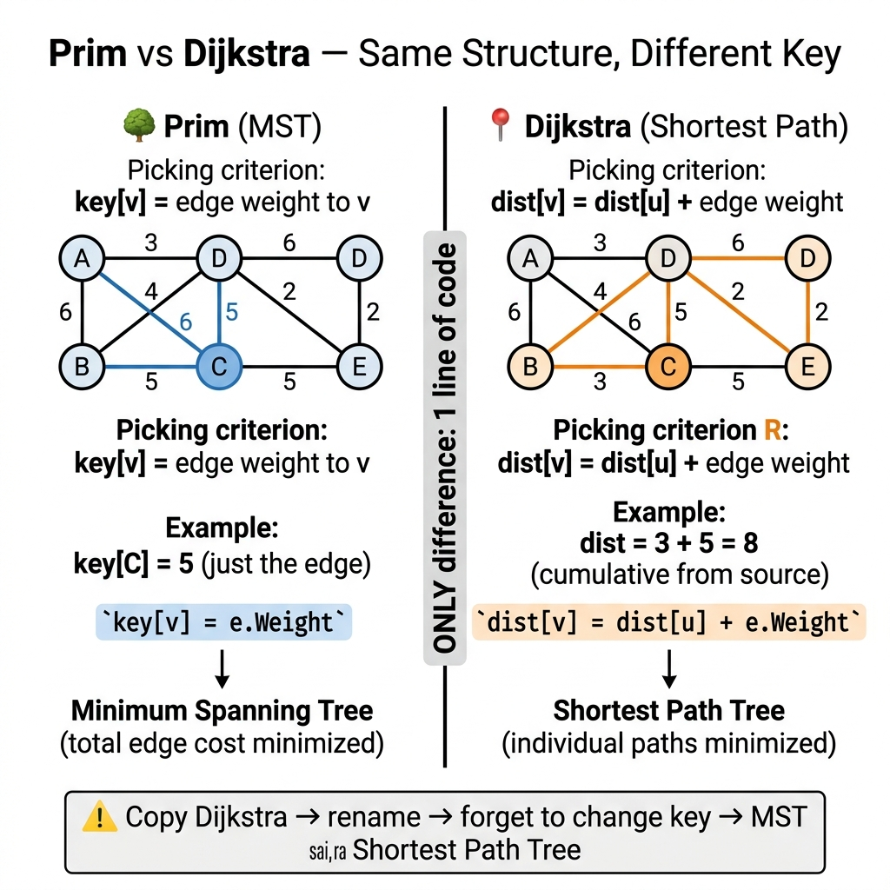

<!-- tags: dsa, algorithms, tree-graph -->
# 🌳 Prim — Minimum Spanning Tree

> Kruskal sorts all E edges then iterates — but a graph with 10K nodes and 50M edges chokes on that sort. Prim never looks at the full edge list: it grows the MST from a single node, each step considering only edges that cross from the current tree to the outside. Same MST, same Cut Property — entirely different approach.

📅 Created: 2026-03-20 · 🔄 Updated: 2026-04-19 · ⏱️ 15 min read

| Aspect | Detail |
| ------ | ------ |
| **Complexity** | O(E log V) time · O(V) space |
| **Use case** | MST on dense graphs, network design, clustering |
| **Recognition** | Problem asks for MST + dense graph or adjacency list input |

---

## 1. DEFINE

<!-- [Beginner layer] -->
Kruskal sorts all edges — but a graph with 10K nodes and 50M edges? Sorting costs O(E log E) = O(50M × 26) ≈ 1.3 billion operations. Prim grows from a single node, only examining edges of nodes already in the tree — typically faster on dense graphs.

<!-- [Experienced layer] -->
Prim tells a fundamentally different story from Kruskal. Instead of viewing the entire edge list and selecting greedily, Prim incrementally grows one tree by always picking the cheapest edge bridging from the tree to the outside.

This topic is worth learning to distinguish two greedy strategies on graphs: selecting globally cheapest edges without creating cycles versus expanding a frontier from one growing component. Confusing these two perspectives makes traces extremely difficult to follow.

Core insight: **Prim's invariant lives at the current cut: the cheapest edge crossing from the built tree to the unvisited region is always safe to select.**

| Metric | Value |
| ------ | ----- |
| **Time** | O((V+E) log V) with binary heap |
| **Space** | O(V) |
| **Best for** | Dense graphs (E ≈ V²) |
| **vs Kruskal** | Prim = vertex-based, Kruskal = edge-based |

---

| Variant | When to use | Key idea |
| ------- | ----------- | -------- |
| Prim with Priority Queue | Default baseline, easy to trace by hand | Lock the core invariant and termination condition before optimizing |
| Prim with Adjacency Matrix — O(V²) for Dense Graphs | When the problem adds state or practical constraints | Same invariant but with linear scan instead of heap |

| Approach | Time | Space | When to choose |
| -------- | ---- | ----- | -------------- |
| Prim with Priority Queue | O(E log V) | O(V) | Use to understand the invariant before optimizing |
| Prim with Adjacency Matrix | O(V²) | O(V) | Use when E ≈ V² and heap overhead is unnecessary |

### 1.1 Fast Recognition

- The problem is MST but the representation emphasizes adjacency/frontier over a global edge list.
- You are growing a tree from a single start node rather than merging many small components.
- A priority queue typically holds candidate edges or nodes adjacent to the current tree boundary.

### 1.2 Invariants & Failure Modes

- The set of nodes already in the tree must be clearly distinguished from the rest of the graph.
- Each time you pop a candidate, accept it only if it genuinely extends the tree into unvisited territory.
- Common failure mode: writing code that looks like Dijkstra but using cumulative distance instead of edge weight — producing a shortest path tree instead of an MST.

---

## 2. VISUAL

Prim looks so similar to Dijkstra that copy-pasting with one wrong line still compiles. The difference lies in the pick criterion: edge weight vs cumulative distance. The trace below shows exactly where the two algorithms diverge.

### Level 1 — Core intuition

```text
  Start from A:
  Step 1: Add A, edges {A-B:2, A-C:4}
  Step 2: Pick A-B(2) → MST={A-B}
  Step 3: Add B's edges → {A-C:4, B-C:1, B-D:7}
  Step 4: Pick B-C(1) → MST={A-B, B-C}
  Step 5: Pick C-E(3) → MST={A-B, B-C, C-E}
  Step 6: Pick E-D(1) → MST complete
```

---

*Caption: Prim at Level 1 shows the core intuition; Level 2 explains the state update order from input to answer.*

### Level 2 — Detailed
This trace answers the question: **Prim vs Dijkstra — same structure but how does the pick criterion differ?**

```text
Prim:    push edge WEIGHT to PQ → pick lightest edge → add TO node to tree
Dijkstra: push cumulative DIST to PQ → pick shortest path → finalize node

Same graph, same PQ structure, DIFFERENT key:
  Prim key:     w(u,v)           → MST
  Dijkstra key: dist[u] + w(u,v) → SSSP

Prim Step 3: pop B-D(w=1) → add D, key = EDGE weight 1
Dijkstra Step 3: pop D(dist=3) → finalize D, key = PATH distance 2+1=3
```
*Figure: Prim uses edge weight directly as priority. Dijkstra uses cumulative path distance. Same PQ, different invariant.*



## 3. CODE

The trace revealed that the difference between Prim and Dijkstra lies in exactly one line: `key[v] = e.Weight` (Prim) vs `dist[v] = dist[u] + e.Weight` (Dijkstra). The two implementations below — PQ-based and matrix-based — cover both sparse and dense graphs.

### Problem 1: Basic — Prim with Priority Queue
> *(Grow MST from one node using a priority queue — O(E log V).)*
>
> **Goal**: Find MST using Prim + min-heap — O(E log V) time, O(V) space
> **Approach**: Start from node 0, push neighbors into PQ sorted by edge weight, pop lightest, add to tree
> **Example**: 5 nodes, 7 edges → MST with 4 edges, total weight = 8

```go
package graph

import (
    "container/heap"
    "math"
)

func (g *Graph) Prim(start int) ([]EdgeW, float64) {
    inMST := make(map[int]bool)
    key := make(map[int]float64)
    parent := make(map[int]int)

    for v := 0; v < g.Vertices; v++ {
        key[v] = math.Inf(1)
        parent[v] = -1
    }
    key[start] = 0

    pq := &PQ{}
    heap.Init(pq)
    heap.Push(pq, &Item{start, 0})

    for pq.Len() > 0 {
        curr := heap.Pop(pq).(*Item)
        u := curr.Vertex
        if inMST[u] { continue }
        inMST[u] = true

        for _, e := range g.AdjList[u] {
            if !inMST[e.To] && e.Weight < key[e.To] {
                key[e.To] = e.Weight
                parent[e.To] = u
                heap.Push(pq, &Item{e.To, e.Weight})
            }
        }
    }

    var mst []EdgeW
    total := 0.0
    for v := 0; v < g.Vertices; v++ {
        if parent[v] != -1 {
            mst = append(mst, EdgeW{parent[v], v, key[v]})
            total += key[v]
        }
    }
    return mst, total
}
```

```typescript
prim(start: number): { mst: {from:number;to:number;weight:number}[]; total: number } {
    const inMST = new Set<number>(), key = new Map<number,number>(), parent = new Map<number,number>();
    for (let v = 0; v < this.vertices; v++) { key.set(v, Infinity); parent.set(v, -1); }
    key.set(start, 0);
    const pq = new MinHeap<[number,number]>((a,b) => a[1]-b[1]);
    pq.push([start, 0]);
    while (pq.size) {
        const [u, _] = pq.pop();
        if (inMST.has(u)) continue; inMST.add(u);
        for (const e of this.adj.get(u) ?? [])
            if (!inMST.has(e.to) && e.weight < key.get(e.to)!)
                { key.set(e.to, e.weight); parent.set(e.to, u); pq.push([e.to, e.weight]); }
    }
    const mst: {from:number;to:number;weight:number}[] = []; let total = 0;
    for (let v = 0; v < this.vertices; v++) if (parent.get(v)! !== -1) { mst.push({from:parent.get(v)!,to:v,weight:key.get(v)!}); total += key.get(v)!; }
    return { mst, total };
}
```

```rust
fn prim(&self, start: usize, n: usize) -> (Vec<(usize,usize,f64)>, f64) {
    let mut in_mst = vec![false; n]; let mut key = vec![f64::INFINITY; n]; let mut parent = vec![usize::MAX; n];
    key[start] = 0.0;
    let mut heap = BinaryHeap::new(); heap.push(Reverse((ordered_float::OrderedFloat(0.0), start)));
    while let Some(Reverse((_, u))) = heap.pop() {
        if in_mst[u] { continue; } in_mst[u] = true;
        for &(to, w) in self.adj.get(&u).unwrap_or(&vec![]) {
            if !in_mst[to] && w < key[to] { key[to] = w; parent[to] = u;
                heap.push(Reverse((ordered_float::OrderedFloat(w), to))); }
        }
    }
    let mut mst = vec![]; let mut total = 0.0;
    for v in 0..n { if parent[v] != usize::MAX { mst.push((parent[v], v, key[v])); total += key[v]; } }
    (mst, total)
}
```

```cpp
std::pair<std::vector<std::tuple<int,int,double>>, double> prim(int start, int n) {
    std::vector<bool> inMST(n, false); std::vector<double> key(n, 1e18); std::vector<int> parent(n, -1);
    key[start] = 0;
    std::priority_queue<std::pair<double,int>, std::vector<std::pair<double,int>>, std::greater<>> pq;
    pq.push({0, start});
    while (!pq.empty()) {
        auto [_, u] = pq.top(); pq.pop();
        if (inMST[u]) continue; inMST[u] = true;
        for (auto& [to, w] : adj[u]) if (!inMST[to] && w < key[to]) { key[to] = w; parent[to] = u; pq.push({w, to}); }
    }
    std::vector<std::tuple<int,int,double>> mst; double total = 0;
    for (int v = 0; v < n; v++) if (parent[v] != -1) { mst.push_back({parent[v], v, key[v]}); total += key[v]; }
    return {mst, total};
}
```

```python
def prim(self, start, n):
    in_mst, key, parent = [False]*n, [float('inf')]*n, [-1]*n
    key[start] = 0; heap = [(0, start)]
    while heap:
        _, u = heapq.heappop(heap)
        if in_mst[u]: continue
        in_mst[u] = True
        for to, w in self.adj[u]:
            if not in_mst[to] and w < key[to]: key[to] = w; parent[to] = u; heapq.heappush(heap, (w, to))
    mst, total = [], 0.0
    for v in range(n):
        if parent[v] != -1: mst.append((parent[v], v, key[v])); total += key[v]
    return mst, total
```

```java
import java.util.ArrayList;
import java.util.Arrays;
import java.util.List;
import java.util.PriorityQueue;

record Edge(int to, double weight) {}
record WeightedEdge(int from, int to, double weight) {}
record PrimResult(List<WeightedEdge> mst, double total) {}

class Graph {
    private final int vertices;
    private final List<List<Edge>> adj;

    Graph(int vertices) {
        this.vertices = vertices;
        this.adj = new ArrayList<>();
        for (int i = 0; i < vertices; i++) {
            adj.add(new ArrayList<>());
        }
    }

    PrimResult prim(int start) {
        boolean[] inMst = new boolean[vertices];
        double[] key = new double[vertices];
        int[] parent = new int[vertices];
        Arrays.fill(key, Double.POSITIVE_INFINITY);
        Arrays.fill(parent, -1);
        key[start] = 0;

        PriorityQueue<double[]> pq = new PriorityQueue<>((a, b) -> Double.compare(a[1], b[1]));
        pq.offer(new double[] {start, 0});

        while (!pq.isEmpty()) {
            double[] curr = pq.poll();
            int u = (int) curr[0];
            if (inMst[u]) {
                continue;
            }
            inMst[u] = true;

            for (Edge edge : adj.get(u)) {
                if (!inMst[edge.to()] && edge.weight() < key[edge.to()]) {
                    key[edge.to()] = edge.weight();
                    parent[edge.to()] = u;
                    pq.offer(new double[] {edge.to(), edge.weight()});
                }
            }
        }

        List<WeightedEdge> mst = new ArrayList<>();
        double total = 0;
        for (int v = 0; v < vertices; v++) {
            if (parent[v] != -1) {
                mst.add(new WeightedEdge(parent[v], v, key[v]));
                total += key[v];
            }
        }
        return new PrimResult(mst, total);
    }
}
```

> **Why?** The PQ guarantees that the lightest edge connecting tree ↔ non-tree always pops first. The `inMST` check prevents adding nodes already in the tree — no cycles form. Each node processes exactly once → O(E log V). Lazy deletion (push duplicates, skip when stale) is simpler than decrease-key.

> **Takeaway**: Prim + PQ is the default choice for MST. Compared to Kruskal: Prim performs better on dense graphs (no need to sort E edges), Kruskal performs better on sparse graphs (edge list is natural).

The PQ version runs in O(E log V). But dense graphs have E ≈ V² — at that point the log V factor costs more than necessary. Adjacency matrix Prim drops the heap, scans O(V) per step → O(V²) total.

---

### Problem 2: Intermediate — Prim with Adjacency Matrix — O(V²) for Dense Graphs
> *(Dense graph: when E ≈ V², adjacency matrix + O(V²) Prim outperforms PQ version.)*
>
> **Goal**: MST using Prim + adjacency matrix — O(V²) time, O(V) space
> **Approach**: Each iteration scans all V nodes to find the minimum key not in MST, then updates neighbors
> **Example**: Dense graph with 100 nodes, ~5000 edges → O(V²)=10K ops vs PQ O(E log V)=5K×7=35K ops

```go
package graph

import "math"

// PrimMatrix: O(V²) — better than heap-based when E ≈ V²
func PrimMatrix(adjMatrix [][]float64) (float64, []int) {
    n := len(adjMatrix)
    inMST := make([]bool, n)
    key := make([]float64, n)
    parent := make([]int, n)

    for i := range key {
        key[i] = math.Inf(1)
        parent[i] = -1
    }
    key[0] = 0

    for count := 0; count < n; count++ {
        // Find min key vertex not in MST
        u, minKey := -1, math.Inf(1)
        for v := 0; v < n; v++ {
            if !inMST[v] && key[v] < minKey {
                u, minKey = v, key[v]
            }
        }
        if u == -1 { break }
        inMST[u] = true

        for v := 0; v < n; v++ {
            if !inMST[v] && adjMatrix[u][v] > 0 && adjMatrix[u][v] < key[v] {
                key[v] = adjMatrix[u][v]
                parent[v] = u
            }
        }
    }

    total := 0.0
    for _, k := range key { total += k }
    return total, parent
}
```

```typescript
function primMatrix(adjMatrix: number[][]): { total: number; parent: number[] } {
    const n = adjMatrix.length, inMST = Array(n).fill(false);
    const key = Array(n).fill(Infinity), parent = Array(n).fill(-1);
    key[0] = 0;
    for (let count = 0; count < n; count++) {
        let u = -1, minKey = Infinity;
        for (let v = 0; v < n; v++) if (!inMST[v] && key[v] < minKey) { u = v; minKey = key[v]; }
        if (u === -1) break; inMST[u] = true;
        for (let v = 0; v < n; v++) if (!inMST[v] && adjMatrix[u][v] > 0 && adjMatrix[u][v] < key[v]) { key[v] = adjMatrix[u][v]; parent[v] = u; }
    }
    return { total: key.reduce((a, b) => a + b, 0), parent };
}
```

```rust
fn prim_matrix(adj_matrix: &[Vec<f64>]) -> (f64, Vec<isize>) {
    let n = adj_matrix.len(); let mut in_mst = vec![false; n];
    let mut key = vec![f64::INFINITY; n]; let mut parent = vec![-1isize; n]; key[0] = 0.0;
    for _ in 0..n {
        let (mut u, mut min_key) = (usize::MAX, f64::INFINITY);
        for v in 0..n { if !in_mst[v] && key[v] < min_key { u = v; min_key = key[v]; } }
        if u == usize::MAX { break; } in_mst[u] = true;
        for v in 0..n { if !in_mst[v] && adj_matrix[u][v] > 0.0 && adj_matrix[u][v] < key[v] { key[v] = adj_matrix[u][v]; parent[v] = u as isize; } }
    }
    (key.iter().sum(), parent)
}
```

```cpp
std::pair<double, std::vector<int>> primMatrix(std::vector<std::vector<double>>& adj) {
    int n = adj.size(); std::vector<bool> inMST(n,false); std::vector<double> key(n,1e18); std::vector<int> parent(n,-1); key[0]=0;
    for (int cnt=0;cnt<n;cnt++) {
        int u=-1; double mk=1e18; for(int v=0;v<n;v++) if(!inMST[v]&&key[v]<mk){u=v;mk=key[v];}
        if(u==-1) break; inMST[u]=true;
        for(int v=0;v<n;v++) if(!inMST[v]&&adj[u][v]>0&&adj[u][v]<key[v]){key[v]=adj[u][v];parent[v]=u;}
    }
    double total=0; for(auto k:key)total+=k; return{total,parent};
}
```

```python
def prim_matrix(adj_matrix):
    n = len(adj_matrix); in_mst = [False]*n; key = [float('inf')]*n; parent = [-1]*n; key[0] = 0
    for _ in range(n):
        u, min_key = -1, float('inf')
        for v in range(n):
            if not in_mst[v] and key[v] < min_key: u, min_key = v, key[v]
        if u == -1: break
        in_mst[u] = True
        for v in range(n):
            if not in_mst[v] and adj_matrix[u][v] > 0 and adj_matrix[u][v] < key[v]:
                key[v] = adj_matrix[u][v]; parent[v] = u
    return sum(key), parent
```

```java
import java.util.Arrays;

record PrimMatrixResult(double total, int[] parent) {}

final class PrimMatrix {
    private PrimMatrix() {}

    static PrimMatrixResult primMatrix(double[][] adjMatrix) {
        int n = adjMatrix.length;
        boolean[] inMst = new boolean[n];
        double[] key = new double[n];
        int[] parent = new int[n];
        Arrays.fill(key, Double.POSITIVE_INFINITY);
        Arrays.fill(parent, -1);
        key[0] = 0;

        for (int count = 0; count < n; count++) {
            int u = -1;
            double minKey = Double.POSITIVE_INFINITY;
            for (int v = 0; v < n; v++) {
                if (!inMst[v] && key[v] < minKey) {
                    u = v;
                    minKey = key[v];
                }
            }
            if (u == -1) {
                break;
            }
            inMst[u] = true;

            for (int v = 0; v < n; v++) {
                if (!inMst[v] && adjMatrix[u][v] > 0 && adjMatrix[u][v] < key[v]) {
                    key[v] = adjMatrix[u][v];
                    parent[v] = u;
                }
            }
        }

        double total = 0;
        for (double value : key) {
            total += value;
        }
        return new PrimMatrixResult(total, parent);
    }
}
```

> **Why?** When E ≈ V², the PQ version runs O(E log V) = O(V² log V) — slower than O(V²) of the adjacency matrix version. Matrix version: each iteration scans V nodes to find min key → O(V) per iteration × V iterations = O(V²). No heap needed, simpler code.

> **Takeaway**: Use adjacency matrix Prim when V < 1000 and the graph is dense. Otherwise, the PQ version is better. Interviews rarely ask for the matrix version — but knowing it deepens your understanding of the trade-off.

---

## 4. PITFALLS

Prim resembles Dijkstra too closely — and that resemblance is the root of most bugs. Copy Dijkstra's code, rename the function, but forget to change the pick criterion → you get a shortest path tree instead of an MST.

| # | Severity | Defect | Consequence | Fix |
| --- | --- | --- | --- | --- |
| 1 | 🔴 Fatal | Key = cumulative path distance (Dijkstra) instead of edge weight | Produces shortest path tree, NOT MST | `key[v] = e.Weight` (Prim), NOT `dist[u] + e.Weight` |
| 2 | 🔴 Fatal | Prim on disconnected graph without checking | MST only covers one component, misses nodes | Check `len(mst) == V-1` after execution |
| 3 | 🟡 Common | Forgetting `inMST[u]` check when popping from PQ | Processes a node multiple times, wrong MST | `if inMST[u] { continue }` right after pop |
| 4 | 🟡 Common | Dense graph (E≈V²) using heap version | O(V² log V) slower than O(V²) naive | Use adjacency matrix + linear scan when V < 1000 |
| 5 | 🔵 Minor | Start node affects MST edge ordering | MST edges differ but total weight is identical | MST is not unique when edges share the same weight |

---

## 5. REF

| Resource | Type | Link | Notes |
| -------- | ---- | ---- | ----- |
| Visualgo MST | Visualization | [visualgo.net/mst](https://visualgo.net/en/mst) | Interactive Prim trace |
| CP-Algorithms Prim | Tutorial | [cp-algorithms.com](https://cp-algorithms.com/graph/mst_prim.html) | Covers both PQ and matrix versions |
| Wikipedia | Reference | [en.wikipedia.org](https://en.wikipedia.org/wiki/Prim%27s_algorithm) | Proof of correctness |

---

## 6. RECOMMEND

Prim grows MST from one node using the cut property. Change the pick criterion from edge weight to path distance → Dijkstra. Change the approach from vertex-based to edge-based → Kruskal. Three algorithms in the same greedy family, sharing the PQ data structure.

| Next Topic | Why read next | Link |
| ---------- | ------------- | ---- |
| **Kruskal** | Edge-based MST, strong on sparse graphs | [04-kruskal.md](./04-kruskal.md) |
| **Fibonacci Heap** | O(E + V log V) for dense MST | Theory reference |
| **Lazy Prim** | Simpler implementation with binary heap | Lazy deletion variant |
| **Eager Prim** | Better performance with indexed PQ and decrease-key | Advanced variant |

---

## 7. QUICK REF

| # | Pattern | Code |
|---|---------|------|
| 1 | Init | `inMST := make([]bool, n); key := make([]int, n); for i := range key { key[i] = math.MaxInt }; key[0] = 0` |
| 2 | Pick min key | `u := minKey(key, inMST); inMST[u] = true` |
| 3 | Update neighbors | `for _, e := range g[u] { if !inMST[e.v] && e.w < key[e.v] { key[e.v] = e.w; parent[e.v] = u } }` |
| 4 | Complexity | `// O(V²) naive · O(E log V) with priority queue` |
| 5 | vs Kruskal | `// Prim: better for dense graphs · Kruskal: better for sparse` |
| 6 | When to use | `// MST on dense graph, incremental MST construction` |

---

Returning to the opening question: graph with 10K nodes and 50M edges — Kruskal chokes on the sort. Prim grows from one node, the PQ holds only frontier edges. Same MST, same Cut Property, but Prim wins on dense graphs because it never looks at the full edge list.

**Links**: [← Kruskal](./04-kruskal.md) · [→ Topological Sort](./06-topological-sort.md) · [← Dijkstra](./03-dijkstra.md)
