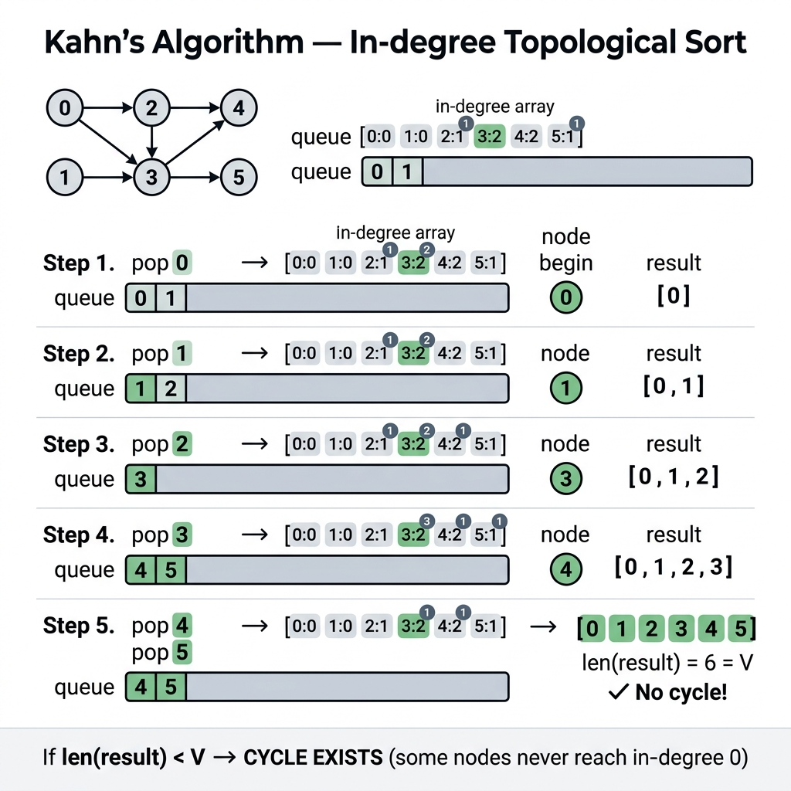

<!-- tags: dsa, algorithms, sorting -->
# 🔀 Topological Sort

> Sort the vertices of a Directed Acyclic Graph so that for every edge u→v, u appears before v.

📅 Created: 2026-03-23 · 🔄 Updated: 2026-04-09 · ⏱️ 10 min read

| Aspect | Detail |
| ------ | ------ |
| **Time** | O(V+E) |
| **Space** | O(V) |
| **Requires** | DAG (no cycles) — detect cycle first |
| **Algorithms** | Kahn's (BFS) / DFS postorder |

---

## 1. DEFINE

<!-- [Experienced layer] -->
Topological sort orders nodes in a DAG so every edge points forward. Two approaches exist: Kahn's BFS and DFS post-order reverse. Both run in O(V+E) time. Cycle detection integrates easily. Kahn's checks if the result length is smaller than V. DFS checks for back edges using three colors.

### Comparing the two approaches

| | Kahn's Algorithm (BFS) | DFS Postorder |
|---|---|---|
| **Method** | Process zero in-degree vertices | DFS, append to stack on exit |
| **Cycle detection** | If result size < V → cycle | Track gray and black nodes |
| **Order** | Lexicographically stable with priority queue | Reverse of DFS finish time |
| **When to use** | Course scheduling, detect cycle | When DFS is already done, dependency resolution |

### Concepts

- **DAG**: Directed Acyclic Graph — a directed graph without cycles.
- **Topological Order**: A linear vertex sequence where prerequisites appear first.
- **In-degree**: The number of incoming edges. A zero in-degree node has no prerequisites.
- **Kahn's Algorithm**: A BFS-based approach that repeatedly removes zero in-degree nodes.
- **Use cases**: Build systems, course prerequisites, task scheduling, package dependencies.

### Invariants

- **Kahn's**: A zero in-degree node is safe to process. Processing it decrements its neighbors' in-degrees.
- **DFS**: Append a node to the stack after processing all its neighbors. Reversing the stack yields the topological order.
- **Cycle**: If Kahn's result length is smaller than V, the graph contains a cycle.

---

| Variant | When to encounter | Key insight |
| ------- | ------- | ------- |
| Kahn's Algorithm (BFS-based) | For a baseline that is easy to trace manually | Master the core invariant and stop condition before optimizing |
| DFS Postorder | When the problem adds state or real constraints | Keep the invariant but add state or auxiliary structures |
| Course Schedule (LeetCode 207) | When scaling requires clear optimizations | Optimize the core using pruning or state compression |
| All Topological Orderings | When production needs abstractions or multiple states | Combine techniques to solve difficult edge cases |

| Approach | Time | Space | When to choose |
| --- | --- | --- | --- |
| Kahn's Algorithm (BFS-based) | O(1) | By variant | Use to understand invariants before optimizing |
| DFS Postorder | O(n) | O(log n) | Use when problems add moderate constraints |
| Course Schedule (LeetCode 207) | By variant | By variant | Use to scale better and remove brute force |
| All Topological Orderings | By variant | By variant | Use to expand patterns for hard edge cases |

Core insight:
- Sort DAG vertices so that for every edge u→v, u appears before v.
- Topological sort becomes difficult when managing frontiers, visited states, or vertex ordering rules.

## 2. VISUAL

The definition says zero in-degree is safe. What if multiple nodes have zero in-degree? DFS post-order creates a reversed result. Why does reversing it work? The trace below clarifies both.

### Level 1 — Core intuition

```text
  Graph:
  0 → 1 → 3
  0 → 2 → 3
  1 → 4

  In-degrees: 0:0, 1:1, 2:1, 3:2, 4:1

  Kahn's Algorithm:
  Queue: [0]  (only zero in-degree)

  Step 1: Process 0
    result=[0], neighbors: 1(in=0), 2(in=0)
    Queue: [1, 2]

  Step 2: Process 1
    result=[0,1], neighbors: 3(in=1), 4(in=0)
    Queue: [2, 4]

  Step 3: Process 2
    result=[0,1,2], neighbors: 3(in=0)
    Queue: [4, 3]

  Step 4: Process 4 → result=[0,1,2,4]
  Step 5: Process 3 → result=[0,1,2,4,3]

  Final order: [0, 1, 2, 4, 3] ✓

  DFS Postorder (reverse):
  DFS from 0: visit 0→1→3(leaf,push 3)→4(leaf,push 4)
              back to 1(push 1)→2→3(visited,push 2)
              back to 0(push 0)
  Stack: [3,4,1,2,0] → Reverse: [0,2,1,4,3] ✓
```

---

*Caption*: Topological Sort Level 1 shows core intuition. Level 2 details state updates from input to answer.

### Level 2 — Detailed
This trace answers the question: **If the graph has a cycle, when does Kahn's detect it?**

```text
Graph with cycle:
  0 → 1 → 2 → 0  (cycle!)
  0 → 3

  In-degrees: 0:1, 1:1, 2:1, 3:1

  Kahn's:
  Queue: []  ← NO node with in-degree 0!
  result = [], len(result)=0 < V=4 → CYCLE DETECTED

  With DFS 3-color:
  visit 0(gray) → 1(gray) → 2(gray) → 0(gray!)
  ← gray → gray = back edge = CYCLE
```
*Figure: Kahn's lacks a zero in-degree seed, causing a cycle block. DFS detects a back edge when gray meets gray.*



---

## 3. CODE

The trace revealed two mechanisms. Kahn's uses zero in-degrees as seeds. DFS uses post-order and reverses it. The four problems below implement both, apply them to classics, and enumerate all orderings.

### Problem 1: Basic — Kahn's Algorithm (BFS-based)
> *(BFS-based: process nodes when in-degree equals 0 for a naturally forward order.)*
>
> **Goal**: Perform topological sort using Kahn's algorithm in O(V+E) time.
> **Approach**: Count in-degrees. Push zero in-degree nodes to the queue. Process them and decrement neighbor in-degrees.
> **Example**: DAG 0→1, 0→2, 1→3, 2→3 returns [0, 1, 2, 3] or [0, 2, 1, 3].

```go
package toposort

// KahnSort returns topological order of vertices using Kahn's BFS algorithm.
// Returns nil if graph has a cycle.
// Time: O(V+E) · Space: O(V)
func KahnSort(numVertices int, edges [][2]int) []int {
    // Build adjacency list and in-degree count
    adj := make([][]int, numVertices)
    inDegree := make([]int, numVertices)
    for _, e := range edges {
        u, v := e[0], e[1]
        adj[u] = append(adj[u], v)
        inDegree[v]++
    }

    // Start with all zero in-degree vertices
    queue := []int{}
    for v := 0; v < numVertices; v++ {
        if inDegree[v] == 0 {
            queue = append(queue, v)
        }
    }

    result := make([]int, 0, numVertices)
    for len(queue) > 0 {
        u := queue[0]
        queue = queue[1:]
        result = append(result, u)

        for _, v := range adj[u] {
            inDegree[v]--
            if inDegree[v] == 0 {
                queue = append(queue, v)
            }
        }
    }

    if len(result) != numVertices {
        return nil // cycle detected
    }
    return result
}
```

```typescript
function kahnSort(numVertices: number, edges: [number,number][]): number[] | null {
    const adj: number[][] = Array.from({length: numVertices}, () => []);
    const inDegree = Array(numVertices).fill(0);
    for (const [u, v] of edges) { adj[u].push(v); inDegree[v]++; }
    const queue = []; for (let v = 0; v < numVertices; v++) if (!inDegree[v]) queue.push(v);
    const result: number[] = [];
    while (queue.length) {
        const u = queue.shift()!; result.push(u);
        for (const v of adj[u]) if (--inDegree[v] === 0) queue.push(v);
    }
    return result.length === numVertices ? result : null;
}
```

```rust
fn kahn_sort(n: usize, edges: &[(usize,usize)]) -> Option<Vec<usize>> {
    let mut adj = vec![vec![]; n]; let mut in_degree = vec![0usize; n];
    for &(u, v) in edges { adj[u].push(v); in_degree[v] += 1; }
    let mut queue: VecDeque<usize> = (0..n).filter(|&v| in_degree[v] == 0).collect();
    let mut result = vec![];
    while let Some(u) = queue.pop_front() {
        result.push(u);
        for &v in &adj[u] { in_degree[v] -= 1; if in_degree[v] == 0 { queue.push_back(v); } }
    }
    if result.len() == n { Some(result) } else { None }
}
```

```cpp
std::vector<int> kahnSort(int n, std::vector<std::pair<int,int>>& edges) {
    std::vector<std::vector<int>> adj(n); std::vector<int> inDeg(n, 0);
    for (auto& [u,v] : edges) { adj[u].push_back(v); inDeg[v]++; }
    std::queue<int> q; for (int v=0;v<n;v++) if(!inDeg[v]) q.push(v);
    std::vector<int> result;
    while (!q.empty()) { int u=q.front();q.pop();result.push_back(u);
        for (int v:adj[u]) if(--inDeg[v]==0) q.push(v); }
    return result.size()==n ? result : std::vector<int>{};
}
```

```python
from collections import deque
def kahn_sort(n, edges):
    adj, in_degree = [[] for _ in range(n)], [0] * n
    for u, v in edges: adj[u].append(v); in_degree[v] += 1
    queue = deque(v for v in range(n) if not in_degree[v])
    result = []
    while queue:
        u = queue.popleft(); result.append(u)
        for v in adj[u]:
            in_degree[v] -= 1
            if not in_degree[v]: queue.append(v)
    return result if len(result) == n else None
```

> **Why?** Kahn's works because zero in-degree nodes have no unresolved dependencies. They are safe to process. Processing them reduces neighbor in-degrees. When a neighbor hits zero, it becomes ready. If the final length is smaller than V, a cycle exists because some nodes never reached zero in-degree.

> **Conclusion**: Kahn's handles lexicographically smallest orderings easily by replacing the queue with a min-heap. If you only need to detect cycles and sort, DFS post-order is more concise.

Kahn's works from the outside in. An opposing approach uses DFS to reach the deepest leaves, appends upon return, and reverses the result. This integrates cycle detection naturally.

---

### Problem 2: Intermediate — DFS Postorder
> *(DFS-based: append nodes on return and reverse for the topological order.)*
>
> **Goal**: Perform topological sort using DFS post-order.
> **Approach**: Run DFS from each unvisited node. Append to the stack upon return. Reverse the stack at the end.
> **Example**: DAG 5→0, 5→2, 4→0, 4→1, 2→3, 3→1 yields [5, 4, 2, 3, 1, 0].

```go
// DFSTopoSort returns topological order using DFS postorder.
// Returns nil if cycle detected.
// Time: O(V+E) · Space: O(V)
func DFSTopoSort(numVertices int, edges [][2]int) []int {
    adj := make([][]int, numVertices)
    for _, e := range edges {
        adj[e[0]] = append(adj[e[0]], e[1])
    }

    // 0=unvisited, 1=in-progress (gray), 2=done (black)
    state := make([]int, numVertices)
    stack := []int{}
    hasCycle := false

    var dfs func(u int)
    dfs = func(u int) {
        if hasCycle {
            return
        }
        state[u] = 1 // gray — in progress
        for _, v := range adj[u] {
            if state[v] == 1 { // back edge = cycle
                hasCycle = true
                return
            }
            if state[v] == 0 {
                dfs(v)
            }
        }
        state[u] = 2 // black — done
        stack = append(stack, u) // postorder
    }

    for v := 0; v < numVertices; v++ {
        if state[v] == 0 {
            dfs(v)
        }
    }

    if hasCycle {
        return nil
    }

    // Reverse postorder = topological order
    result := make([]int, len(stack))
    for i, v := range stack {
        result[len(stack)-1-i] = v
    }
    return result
}
```

```typescript
function dfsTopoSort(numVertices: number, edges: [number,number][]): number[] | null {
    const adj: number[][] = Array.from({length: numVertices}, () => []);
    for (const [u, v] of edges) adj[u].push(v);
    const state = Array(numVertices).fill(0), stack: number[] = [];
    let hasCycle = false;
    const dfs = (u: number) => {
        if (hasCycle) return; state[u] = 1;
        for (const v of adj[u]) { if (state[v]===1){hasCycle=true;return;} if(!state[v])dfs(v); }
        state[u] = 2; stack.push(u);
    };
    for (let v = 0; v < numVertices; v++) if (!state[v]) dfs(v);
    return hasCycle ? null : stack.reverse();
}
```

```rust
fn dfs_topo_sort(n: usize, edges: &[(usize,usize)]) -> Option<Vec<usize>> {
    let mut adj = vec![vec![]; n];
    for &(u, v) in edges { adj[u].push(v); }
    let mut state = vec![0u8; n]; let mut stack = vec![]; let mut has_cycle = false;
    fn dfs(u: usize, adj: &[Vec<usize>], state: &mut Vec<u8>, stack: &mut Vec<usize>, has_cycle: &mut bool) {
        if *has_cycle { return; } state[u] = 1;
        for &v in &adj[u] { if state[v]==1{*has_cycle=true;return;} if state[v]==0{dfs(v,adj,state,stack,has_cycle);} }
        state[u] = 2; stack.push(u);
    }
    for v in 0..n { if state[v]==0 { dfs(v,&adj,&mut state,&mut stack,&mut has_cycle); } }
    if has_cycle { None } else { stack.reverse(); Some(stack) }
}
```

```cpp
std::vector<int> dfsTopoSort(int n, std::vector<std::pair<int,int>>& edges) {
    std::vector<std::vector<int>> adj(n); for (auto& [u,v]:edges) adj[u].push_back(v);
    std::vector<int> state(n,0), stk; bool hasCycle=false;
    std::function<void(int)> dfs=[&](){}; dfs=[&](int u) { if(hasCycle)return; state[u]=1;
        for(int v:adj[u]){if(state[v]==1){hasCycle=true;return;}if(!state[v])dfs(v);} state[u]=2;stk.push_back(u); };
    for(int v=0;v<n;v++) if(!state[v]) dfs(v);
    if(hasCycle) return {}; std::reverse(stk.begin(),stk.end()); return stk;
}
```

```python
def dfs_topo_sort(n, edges):
    adj = [[] for _ in range(n)]
    for u, v in edges: adj[u].append(v)
    state, stack, has_cycle = [0]*n, [], [False]
    def dfs(u):
        if has_cycle[0]: return
        state[u] = 1
        for v in adj[u]:
            if state[v] == 1: has_cycle[0] = True; return
            if not state[v]: dfs(v)
        state[u] = 2; stack.append(u)
    for v in range(n):
        if not state[v]: dfs(v)
    return None if has_cycle[0] else stack[::-1]
```

> **Why?** Post-order appends a node upon return, ensuring all its subtrees finish first. Reversing this produces a valid order where every node precedes its dependencies. Three-color logic handles cycle detection. DFS is concise but less natural for lexicographic requirements than Kahn's.

> **Conclusion**: DFS post-order dominates interviews due to its brevity and easy cycle detection. Choose Kahn's when lexicographic ordering is strictly required.

Both approaches answer "which order". Interviews often ask "can you finish all courses?" instead. This only requires cycle detection without producing the final order.

---

### Problem 3: Advanced — Course Schedule (LeetCode 207)
> *(LC 207: "Can you finish all courses?" reduces to cycle detection on a DAG.)*
>
> **Goal**: Detect if all courses can be completed.
> **Approach**: Build a dependency graph. Run Kahn's or DFS cycle detection.
> **Example**: numCourses=4, prerequisites=[[1,0],[2,0],[3,1],[3,2]] returns true.

```go
// CanFinish checks if all courses can be completed given prerequisites.
// LeetCode 207 — topological sort / cycle detection.
// Time: O(V+E) · Space: O(V+E)
func CanFinish(numCourses int, prerequisites [][2]int) bool {
    adj := make([][]int, numCourses)
    inDegree := make([]int, numCourses)
    for _, pre := range prerequisites {
        course, prereq := pre[0], pre[1]
        adj[prereq] = append(adj[prereq], course)
        inDegree[course]++
    }

    queue := []int{}
    for v := 0; v < numCourses; v++ {
        if inDegree[v] == 0 {
            queue = append(queue, v)
        }
    }

    completed := 0
    for len(queue) > 0 {
        u := queue[0]
        queue = queue[1:]
        completed++
        for _, v := range adj[u] {
            inDegree[v]--
            if inDegree[v] == 0 {
                queue = append(queue, v)
            }
        }
    }
    return completed == numCourses
}
```

```typescript
function canFinish(numCourses: number, prerequisites: [number,number][]): boolean {
    const adj: number[][] = Array.from({length: numCourses}, () => []);
    const inDeg = Array(numCourses).fill(0);
    for (const [c, p] of prerequisites) { adj[p].push(c); inDeg[c]++; }
    const queue = []; for (let v = 0; v < numCourses; v++) if (!inDeg[v]) queue.push(v);
    let completed = 0;
    while (queue.length) { const u = queue.shift()!; completed++;
        for (const v of adj[u]) if (--inDeg[v] === 0) queue.push(v); }
    return completed === numCourses;
}
```

```rust
fn can_finish(num_courses: usize, prerequisites: &[(usize,usize)]) -> bool {
    let mut adj = vec![vec![]; num_courses]; let mut in_deg = vec![0usize; num_courses];
    for &(c, p) in prerequisites { adj[p].push(c); in_deg[c] += 1; }
    let mut queue: VecDeque<usize> = (0..num_courses).filter(|&v| in_deg[v] == 0).collect();
    let mut completed = 0;
    while let Some(u) = queue.pop_front() { completed += 1;
        for &v in &adj[u] { in_deg[v] -= 1; if in_deg[v] == 0 { queue.push_back(v); } } }
    completed == num_courses
}
```

```cpp
bool canFinish(int n, std::vector<std::pair<int,int>>& prereqs) {
    std::vector<std::vector<int>> adj(n); std::vector<int> inDeg(n,0);
    for (auto& [c,p]:prereqs){adj[p].push_back(c);inDeg[c]++;}
    std::queue<int> q; for(int v=0;v<n;v++) if(!inDeg[v]) q.push(v);
    int completed=0;
    while(!q.empty()){int u=q.front();q.pop();completed++;
        for(int v:adj[u]) if(--inDeg[v]==0) q.push(v);}
    return completed==n;
}
```

```python
def can_finish(num_courses, prerequisites):
    adj, in_deg = [[] for _ in range(num_courses)], [0]*num_courses
    for c, p in prerequisites: adj[p].append(c); in_deg[c] += 1
    queue = deque(v for v in range(num_courses) if not in_deg[v])
    completed = 0
    while queue:
        u = queue.popleft(); completed += 1
        for v in adj[u]:
            in_deg[v] -= 1
            if not in_deg[v]: queue.append(v)
    return completed == num_courses
```

> **Why?** Course Schedule asks if the DAG contains a cycle. Circular dependencies prevent completion. Kahn's checks if the ordered length is less than numCourses. DFS checks if a gray node connects to another gray node. Both approaches run in O(V+E) time.

> **Conclusion**: LC 207 is the classic topological sort problem. LC 210 requires returning the actual ordering. LC 2115 expands the pattern with multiple prerequisites.

The previous problems return one valid ordering. If a problem asks to list ALL valid orderings, you need backtracking. The complexity jumps to O(V!).

---

### Problem 4: Expert — All Topological Orderings
> *(Backtracking: find ALL valid topological orderings instead of just one.)*
>
> **Goal**: Enumerate all valid topological orderings in worst-case O(V! * V) time.
> **Approach**: Combine Kahn's with backtracking. At each step, try all zero in-degree nodes and recurse.
> **Example**: DAG 0→1, 0→2 yields orderings [0,1,2] and [0,2,1].

```go
// AllTopoOrders returns all valid topological orderings (backtracking).
// ⚠️ Exponential — only for small graphs.
// Time: O(V! × E) · Space: O(V)
func AllTopoOrders(numVertices int, edges [][2]int) [][]int {
    adj := make([][]int, numVertices)
    inDegree := make([]int, numVertices)
    for _, e := range edges {
        adj[e[0]] = append(adj[e[0]], e[1])
        inDegree[e[1]]++
    }

    var results [][]int
    var path []int
    visited := make([]bool, numVertices)

    var backtrack func()
    backtrack = func() {
        if len(path) == numVertices {
            tmp := make([]int, len(path))
            copy(tmp, path)
            results = append(results, tmp)
            return
        }
        for v := 0; v < numVertices; v++ {
            if !visited[v] && inDegree[v] == 0 {
                visited[v] = true
                path = append(path, v)
                for _, nb := range adj[v] {
                    inDegree[nb]--
                }
                backtrack()
                // Undo
                for _, nb := range adj[v] {
                    inDegree[nb]++
                }
                path = path[:len(path)-1]
                visited[v] = false
            }
        }
    }
    backtrack()
    return results
}
```

```typescript
function allTopoOrders(n: number, edges: [number,number][]): number[][] {
    const adj: number[][] = Array.from({length: n}, () => []);
    const inDeg = Array(n).fill(0);
    for (const [u, v] of edges) { adj[u].push(v); inDeg[v]++; }
    const results: number[][] = [], path: number[] = [], visited = Array(n).fill(false);
    const backtrack = () => {
        if (path.length === n) { results.push([...path]); return; }
        for (let v = 0; v < n; v++) { if (!visited[v] && !inDeg[v]) {
            visited[v] = true; path.push(v); for (const nb of adj[v]) inDeg[nb]--;
            backtrack();
            for (const nb of adj[v]) inDeg[nb]++; path.pop(); visited[v] = false;
        } }
    };
    backtrack(); return results;
}
```

```rust
fn all_topo_orders(n: usize, edges: &[(usize,usize)]) -> Vec<Vec<usize>> {
    let mut adj = vec![vec![]; n]; let mut in_deg = vec![0usize; n];
    for &(u, v) in edges { adj[u].push(v); in_deg[v] += 1; }
    let mut results = vec![]; let mut path = vec![]; let mut visited = vec![false; n];
    fn backtrack(n: usize, adj: &[Vec<usize>], in_deg: &mut Vec<usize>,
        visited: &mut Vec<bool>, path: &mut Vec<usize>, results: &mut Vec<Vec<usize>>) {
        if path.len() == n { results.push(path.clone()); return; }
        for v in 0..n { if !visited[v] && in_deg[v] == 0 {
            visited[v] = true; path.push(v); for &nb in &adj[v] { in_deg[nb] -= 1; }
            backtrack(n, adj, in_deg, visited, path, results);
            for &nb in &adj[v] { in_deg[nb] += 1; } path.pop(); visited[v] = false;
        } }
    }
    backtrack(n, &adj, &mut in_deg, &mut visited, &mut path, &mut results); results
}
```

```cpp
std::vector<std::vector<int>> allTopoOrders(int n, std::vector<std::pair<int,int>>& edges) {
    std::vector<std::vector<int>> adj(n); std::vector<int> inDeg(n,0);
    for(auto&[u,v]:edges){adj[u].push_back(v);inDeg[v]++;}
    std::vector<std::vector<int>> results; std::vector<int> path; std::vector<bool> visited(n,false);
    std::function<void()> bt=[&](){
        if((int)path.size()==n){results.push_back(path);return;}
        for(int v=0;v<n;v++) if(!visited[v]&&!inDeg[v]){
            visited[v]=true;path.push_back(v);for(int nb:adj[v])inDeg[nb]--;
            bt(); for(int nb:adj[v])inDeg[nb]++;path.pop_back();visited[v]=false;}
    }; bt(); return results;
}
```

```python
def all_topo_orders(n, edges):
    adj, in_deg = [[] for _ in range(n)], [0]*n
    for u, v in edges: adj[u].append(v); in_deg[v] += 1
    results, path, visited = [], [], [False]*n
    def backtrack():
        if len(path) == n: results.append(path[:]); return
        for v in range(n):
            if not visited[v] and not in_deg[v]:
                visited[v] = True; path.append(v)
                for nb in adj[v]: in_deg[nb] -= 1
                backtrack()
                for nb in adj[v]: in_deg[nb] += 1
                path.pop(); visited[v] = False
    backtrack(); return results
```

> **Why?** Backtracking on Kahn's explores multiple zero in-degree nodes at each step. It tries each, recurses, and undoes the state. This matches the "enumerate all valid states" pattern seen in N-Queens. The worst case is O(V!) because every permutation might be valid.

> **Conclusion**: All orderings rarely appear in interviews due to factorial complexity. It illustrates backtracking on graphs, which is vital for constraint satisfaction problems.

---

## 4. PITFALLS

Topological sort logic is straightforward. Errors happen when you forget prerequisite checks. The code runs and produces output, but the output is silently incorrect.

| # | Severity | Error | Consequence | Fix |
| --- | --- | --- | --- | --- |
| 1 | 🔴 Fatal | **Using toposort on cyclic graphs** | Kahn's produces missing nodes; DFS loops infinitely | Check `len(result) == V` after Kahn's runs |
| 2 | 🟡 Common | **Using undirected graphs instead of directed** | In-degrees lose meaning completely | Toposort applies strictly to **directed** graphs |
| 3 | 🟡 Common | **Forgetting to reverse the DFS stack** | The ordering reverses the expected topological direction | Append on exit, then **reverse** the final stack |
| 4 | 🔵 Minor | **Confusing gray and black states in DFS** | Causes missed cycles and infinite loops | A gray-to-gray connection signals a cycle |
| 5 | 🔵 Minor | **Failing to handle disconnected graphs** | Sorts only a single isolated component | Loop through all vertices and check unvisited states |

---

## 5. REF

| Resource | Type | Link | Note |
| -------- | ---- | ---- | ------- |
| LeetCode — Course Schedule | Problem | [leetcode.com/problems/course-schedule](https://leetcode.com/problems/course-schedule/) | Kahn's cycle detection |
| LeetCode — Course Schedule II | Problem | [leetcode.com/problems/course-schedule-ii](https://leetcode.com/problems/course-schedule-ii/) | Return the actual ordering |
| CP-Algorithms Topological Sort | Tutorial | [cp-algorithms.com/graph/topological-sort.html](https://cp-algorithms.com/graph/topological-sort.html) | Both approaches and proofs |

---

## 6. RECOMMEND

Topological sort resolves DAG ordering. Convert DAGs to general directed graphs using Strongly Connected Components (SCC). Add weights to require Dynamic Programming on DAGs. Dropping the acyclic constraint forces separate cycle detection algorithms.

| Scenario | Approach | Reason |
| ---------- | -------- | ----- |
| **Course prerequisites / task ordering** | Kahn's | Easy cycle detection |
| **Dependency resolution (build systems)** | Kahn's or DFS | Both run in O(V+E) |
| **Lexicographically smallest order** | Kahn's + min-heap | Replace the queue with a priority queue |
| **Detect cycles in directed graphs** | DFS 3-color | Gray-to-Gray indicates a cycle |
| **Go stdlib** | Manual (no stdlib) | Implement Kahn's in 20 lines |

---

## 7. QUICK REF

| # | Pattern | Code |
|---|---------|------|
| 1 | Build in-degree | `for _, e := range edges { adj[e[0]]=append(...,e[1]); inDegree[e[1]]++ }` |
| 2 | Init queue | `for v := 0; v < n; v++ { if inDegree[v]==0 { queue=append(queue,v) } }` |
| 3 | Kahn's process | `for len(queue)>0 { u:=queue[0]; queue=queue[1:]; result=append(result,u); for _,v:=range adj[u] { inDegree[v]--; if inDegree[v]==0 { queue=append(queue,v) } } }` |
| 4 | Cycle check | `if len(result) != numVertices { // cycle! }` |
| 5 | DFS state | `// 0=unvisited, 1=gray(in-progress), 2=black(done)` |
| 6 | DFS cycle | `if state[v] == 1 { hasCycle = true }` |
| 7 | DFS postorder | `state[u]=2; stack=append(stack,u)  // after all neighbors` |
| 8 | Reverse stack | `result[len(stack)-1-i] = stack[i]` |
| 9 | Complexity | `// O(V+E) time · O(V) space` |
| 10 | When to use | `// DAG ordering, course prereqs, build deps, cycle detection` |

---

Returning to the start: sort vertices so every edge u→v has u before v. You now know Kahn's outside-in in-degree approach and the DFS deep-post-order reverse approach. Both take O(V+E) and detect cycles. Choose Kahn's for lexicographic order or DFS for brevity.

**Links**: [← DFS](./02-dfs.md) · [→ Advanced Patterns](./07-advanced-patterns.md)
