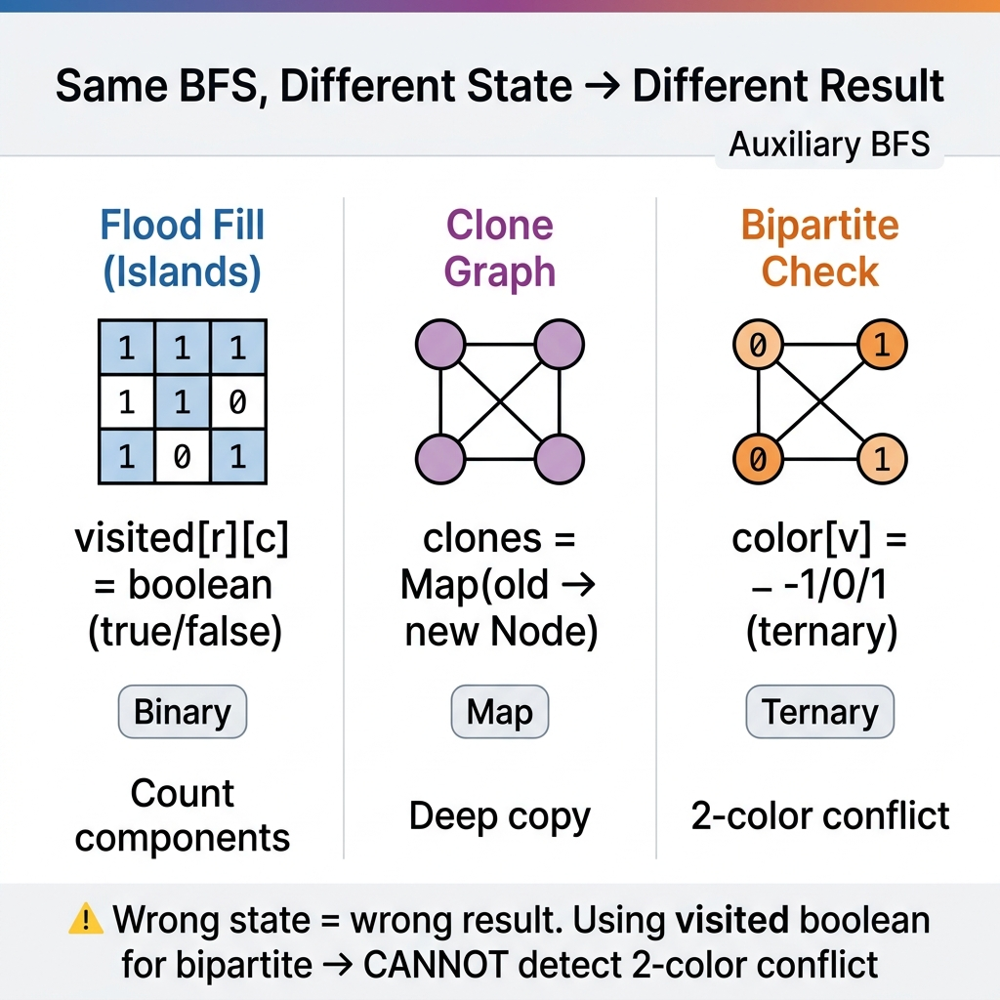

<!-- tags: dsa, algorithms, graph, advanced-patterns -->
# 🕸️ Advanced Graph Patterns

> When basic BFS/DFS is no longer enough, you start encountering variants like flood fill on grids, clone graph, multi-source BFS, bipartite check, and shortest path on implicit graphs.

📅 Created: 2026-04-01 · 🔄 Updated: 2026-04-19 · ⏱️ 18 min read

| Aspect | Detail |
| ------ | ------ |
| **Complexity focus** | O(V + E) for traversal; Word Ladder can explode if you build the graph naively |
| **Use case** | Islands, infection spread, graph cloning, coloring, shortest transformation |
| **Related** | BFS, DFS, Topological Sort, Union-Find |

---

## 1. DEFINE

You are debugging a solution that looks correct but keeps hitting TLE or failing on the last edge case. Advanced Graph Patterns only become clear when you identify which invariant truly holds the solution together.

When graphs move beyond basic traversal, problems shift to pattern recognition: component condensation, bipartite coloring, SCC, bridge, articulation point. `Advanced Graph Patterns` are hard because every problem uses the same graph but requires a completely different invariant.

The value of this chapter is not memorizing algorithm names. It is learning to read signals: is the problem asking about ordering, connectivity after a cut, or two-color constraints? Reading the right signal leads to the right primitive.

Core insight: **In advanced graph problems, choosing the wrong invariant from the start is worse than writing wrong code, because you send your entire reasoning tree down the wrong algorithm family.**

| Pattern | When encountered | Key idea |
| ------- | ---------------- | -------- |
| Count Islands / Flood Fill | 2D grid, need to count connected components | Treat each cell as a node, 4 or 8 directions as edges |
| Clone Graph | Need deep copy of a graph with cycles | Map `original -> clone` to prevent duplicate cloning |
| Multi-source BFS | Multiple infection sources / simultaneous spread | Push all sources into the queue from the start |
| Bipartite Check | Need to split graph into 2 non-adjacent groups | BFS/DFS + 2-color assignment |
| Word Ladder | Implicit graph over a dictionary | Level-order BFS, optimized with bidirectional BFS |

| Variant | When to use | Key idea |
| ------- | ----------- | -------- |
| Number of Islands | When you need a baseline easy to trace by hand | Lock the core invariant and stopping condition before optimizing |
| Clone Graph | When the problem adds state or practical constraints | Maintain the same invariant with additional state, cache, or auxiliary structure |
| Word Ladder with bidirectional BFS | When input is large or optimization is critical | Optimize the baseline via pruning, ordering, or state compression |

| Approach | Time | Space | When to choose |
| -------- | ---- | ----- | -------------- |
| Number of Islands | O(m·n) | O(m·n) | Use to understand the invariant before optimizing |
| Clone Graph | O(V + E) | O(V) | Use when the problem adds moderate constraints |
| Word Ladder with bidirectional BFS | Varies | Varies | Use when you need better scaling or brute-force elimination |

### 1.1 Fast Recognition

- The problem contains signals like SCC, bipartite, bridge, articulation, condensation DAG, or strongly connected structure.
- The solution typically requires timestamps, low-link values, coloring, or multi-pass traversal.
- A single primitive traversal is insufficient; the critical question is which auxiliary state accompanies that traversal.

### 1.2 Invariants & Failure Modes

- Each pattern requires its own proof state: color, low-link, order stack, component id.
- Traversal is merely the vehicle; correctness comes from the invariant of the auxiliary state.
- Common failure mode: applying DFS/BFS as a universal hammer, making every advanced graph problem look identical while the logic diverges completely.

---

## 2. VISUAL

Each pattern below uses BFS/DFS as the vehicle, but the accompanying state differs entirely: visited flag, color, clone map, distance. The trace below shows why same BFS + wrong state = wrong result.

### Level 1 — Core intuition

```text
state problem
  -> define node
  -> define neighbor generation
  -> choose traversal (BFS / DFS / multi-source BFS)
  -> choose visited / color / distance state
```

*Caption: Advanced Graph Patterns at Level 1 show core intuition; Level 2 details the state update order from input to answer.*

### Level 2 — Decision trace

```text
Flood Fill (Islands) vs Clone Graph vs Bipartite:

  Flood Fill:  visited[r][c] = true  → count component
  Clone Graph: clones[node] = newNode → maintain canonical mapping
  Bipartite:   color[v] = 0/1        → check conflict

  All three use BFS, all three traverse identically.
  Only the STATE differs:
    Flood Fill: binary (visited/not)
    Clone:      map (old → new)
    Bipartite:  ternary (uncolored/0/1)

  WRONG: using visited boolean for bipartite → CANNOT detect 2-color conflict
  CORRECT: using color array with 3 states (-1/0/1)
```
*Figure: Same BFS, different state. Flood fill needs only boolean. Clone needs a map. Bipartite needs color. Wrong state = wrong result.*



---

## 3. CODE

The visual showed: each pattern uses BFS/DFS but with different accompanying state. The three problems below escalate from explicit graph (grid) to implicit graph (dictionary) — each step adds a layer of abstraction.

### Problem 1: Basic — Number of Islands

> **Goal**: Count connected components in a binary grid using BFS/DFS — the most foundational "graph on grid" problem.
> **Approach**: Each unvisited `'1'` cell is a new component; BFS spreads in 4 directions and marks visited upon enqueue.
> **Example**: `[[1,1,0],[0,1,0],[1,0,1]] -> 3 islands`
> **Complexity**: O(m·n) time, O(m·n) space worst-case

```go
// advanced_graph_patterns.go — Number of Islands: BFS over a grid graph
package graph

func NumIslands(grid [][]byte) int {
    if len(grid) == 0 || len(grid[0]) == 0 {
        return 0
    }

    rows, cols := len(grid), len(grid[0])
    dirs := [][2]int{{1, 0}, {-1, 0}, {0, 1}, {0, -1}}
    islands := 0

    for r := 0; r < rows; r++ {
        for c := 0; c < cols; c++ {
            if grid[r][c] != '1' {
                continue
            }

            islands++
            queue := [][2]int{{r, c}}
            grid[r][c] = '0' // ✅ mark visited when enqueueing

            for len(queue) > 0 {
                cell := queue[0]
                queue = queue[1:]
                for _, d := range dirs {
                    nr, nc := cell[0]+d[0], cell[1]+d[1]
                    if nr < 0 || nr >= rows || nc < 0 || nc >= cols {
                        continue
                    }
                    if grid[nr][nc] != '1' {
                        continue
                    }
                    grid[nr][nc] = '0'
                    queue = append(queue, [2]int{nr, nc})
                }
            }
        }
    }

    return islands
}
```

```typescript
// advanced-graph-patterns.ts — Number of Islands: BFS over a grid graph
export function numIslands(grid: string[][]): number {
  if (!grid.length || !grid[0].length) return 0;
  const rows = grid.length;
  const cols = grid[0].length;
  const dirs = [[1, 0], [-1, 0], [0, 1], [0, -1]];
  let islands = 0;

  for (let r = 0; r < rows; r++) {
    for (let c = 0; c < cols; c++) {
      if (grid[r][c] !== '1') continue;
      islands++;
      const queue: Array<[number, number]> = [[r, c]];
      grid[r][c] = '0';
      while (queue.length) {
        const [row, col] = queue.shift()!;
        for (const [dr, dc] of dirs) {
          const nr = row + dr;
          const nc = col + dc;
          if (nr < 0 || nr >= rows || nc < 0 || nc >= cols) continue;
          if (grid[nr][nc] !== '1') continue;
          grid[nr][nc] = '0';
          queue.push([nr, nc]);
        }
      }
    }
  }

  return islands;
}
```

```rust
// advanced_graph_patterns.rs — Number of Islands: BFS over a grid graph
use std::collections::VecDeque;

pub fn num_islands(grid: &mut [Vec<u8>]) -> i32 {
    if grid.is_empty() || grid[0].is_empty() {
        return 0;
    }
    let rows = grid.len() as i32;
    let cols = grid[0].len() as i32;
    let dirs = [(1, 0), (-1, 0), (0, 1), (0, -1)];
    let mut islands = 0;

    for r in 0..rows {
        for c in 0..cols {
            if grid[r as usize][c as usize] != b'1' {
                continue;
            }
            islands += 1;
            let mut queue = VecDeque::from([(r, c)]);
            grid[r as usize][c as usize] = b'0';
            while let Some((row, col)) = queue.pop_front() {
                for (dr, dc) in dirs {
                    let nr = row + dr;
                    let nc = col + dc;
                    if nr < 0 || nr >= rows || nc < 0 || nc >= cols {
                        continue;
                    }
                    if grid[nr as usize][nc as usize] != b'1' {
                        continue;
                    }
                    grid[nr as usize][nc as usize] = b'0';
                    queue.push_back((nr, nc));
                }
            }
        }
    }

    islands
}
```

```cpp
// advanced_graph_patterns.cpp — Number of Islands: BFS over a grid graph
int numIslands(std::vector<std::vector<char>>& grid) {
    if (grid.empty() || grid[0].empty()) return 0;
    const int rows = static_cast<int>(grid.size());
    const int cols = static_cast<int>(grid[0].size());
    const std::vector<std::pair<int, int>> dirs{{1,0},{-1,0},{0,1},{0,-1}};
    int islands = 0;

    for (int r = 0; r < rows; ++r) {
        for (int c = 0; c < cols; ++c) {
            if (grid[r][c] != '1') continue;
            ++islands;
            std::queue<std::pair<int, int>> q;
            q.push({r, c});
            grid[r][c] = '0';
            while (!q.empty()) {
                auto [row, col] = q.front(); q.pop();
                for (auto [dr, dc] : dirs) {
                    int nr = row + dr, nc = col + dc;
                    if (nr < 0 || nr >= rows || nc < 0 || nc >= cols) continue;
                    if (grid[nr][nc] != '1') continue;
                    grid[nr][nc] = '0';
                    q.push({nr, nc});
                }
            }
        }
    }
    return islands;
}
```

```python
# advanced_graph_patterns.py — Number of Islands: BFS over a grid graph
from collections import deque

def num_islands(grid: list[list[str]]) -> int:
    if not grid or not grid[0]:
        return 0
    rows, cols = len(grid), len(grid[0])
    dirs = [(1, 0), (-1, 0), (0, 1), (0, -1)]
    islands = 0

    for r in range(rows):
        for c in range(cols):
            if grid[r][c] != '1':
                continue
            islands += 1
            queue = deque([(r, c)])
            grid[r][c] = '0'
            while queue:
                row, col = queue.popleft()
                for dr, dc in dirs:
                    nr, nc = row + dr, col + dc
                    if nr < 0 or nr >= rows or nc < 0 or nc >= cols:
                        continue
                    if grid[nr][nc] != '1':
                        continue
                    grid[nr][nc] = '0'
                    queue.append((nr, nc))
    return islands
```

```java
// AdvancedGraphPatterns.java — Number of Islands: BFS over a grid graph
import java.util.ArrayDeque;

public final class AdvancedGraphPatterns {
    private AdvancedGraphPatterns() {}

    public static int numIslands(char[][] grid) {
        if (grid.length == 0 || grid[0].length == 0) return 0;
        int rows = grid.length;
        int cols = grid[0].length;
        int[][] dirs = {{1,0},{-1,0},{0,1},{0,-1}};
        int islands = 0;

        for (int r = 0; r < rows; r++) {
            for (int c = 0; c < cols; c++) {
                if (grid[r][c] != '1') continue;
                islands++;
                ArrayDeque<int[]> queue = new ArrayDeque<>();
                queue.offer(new int[]{r, c});
                grid[r][c] = '0';
                while (!queue.isEmpty()) {
                    int[] cell = queue.poll();
                    for (int[] dir : dirs) {
                        int nr = cell[0] + dir[0];
                        int nc = cell[1] + dir[1];
                        if (nr < 0 || nr >= rows || nc < 0 || nc >= cols) continue;
                        if (grid[nr][nc] != '1') continue;
                        grid[nr][nc] = '0';
                        queue.offer(new int[]{nr, nc});
                    }
                }
            }
        }
        return islands;
    }
}
```

> **Why?** Each unvisited `'1'` cell is a new island. BFS spreads in 4 directions, marking visited upon enqueue (NOT upon pop — marking upon pop lets the same cell push multiple times, inflating the queue and increasing complexity). The mutable grid serves as `visited` — no separate visited array needed.

> **Takeaway**: Islands are the foundation of graph-on-grid: model cells as nodes, 4 directions as edges, mark visited at the right moment. This pattern repeats in Rotten Oranges, Surrounded Regions, and most grid BFS problems.

Islands handle grids you own — mutable. But clone graph does not let you mutate the original. You need a complete copy without sharing pointers and without infinite loops when encountering cycles.

---

### Problem 2: Intermediate — Clone Graph

> **Goal**: Deep copy a graph with cycles without duplicating nodes or infinite loops.
> **Approach**: BFS from the root node; use map `old -> new` so each node clones exactly once, neighbors connect only via the clone map.
> **Example**: `1-2-3-1` must become a new graph with identical shape but no shared pointers with the original.
> **Complexity**: O(V + E) time, O(V) space

```go
// clone_graph.go — Clone Graph: BFS + original-to-clone map
func CloneGraph(node *Node) *Node {
    if node == nil {
        return nil
    }

    clones := map[*Node]*Node{
        node: {Val: node.Val},
    }
    queue := []*Node{node}

    for len(queue) > 0 {
        curr := queue[0]
        queue = queue[1:]

        for _, next := range curr.Neighbors {
            if _, seen := clones[next]; !seen {
                clones[next] = &Node{Val: next.Val}
                queue = append(queue, next)
            }
            clones[curr].Neighbors = append(clones[curr].Neighbors, clones[next])
        }
    }

    return clones[node]
}

type Node struct {
    Val       int
    Neighbors []*Node
}
```

```typescript
// clone-graph.ts — Clone Graph: BFS + original-to-clone map
export type GraphNode = { val: number; neighbors: GraphNode[] };
export function cloneGraph(node: GraphNode | null): GraphNode | null {
  if (!node) return null;
  const clones = new Map<GraphNode, GraphNode>([[node, { val: node.val, neighbors: [] }]]);
  const queue: GraphNode[] = [node];
  while (queue.length) {
    const curr = queue.shift()!;
    for (const next of curr.neighbors) {
      if (!clones.has(next)) { clones.set(next, { val: next.val, neighbors: [] }); queue.push(next); }
      clones.get(curr)!.neighbors.push(clones.get(next)!);
    }
  }
  return clones.get(node)!;
}
```
```rust
// clone_graph.rs — Clone Graph simplified as adjacency list cloning
use std::collections::{HashMap, VecDeque};
pub fn clone_graph(adj: &HashMap<i32, Vec<i32>>, start: i32) -> HashMap<i32, Vec<i32>> {
    let mut cloned = HashMap::new();
    let mut queue = VecDeque::from([start]);
    while let Some(node) = queue.pop_front() {
        if cloned.contains_key(&node) { continue; }
        let neighbors = adj.get(&node).cloned().unwrap_or_default();
        for &next in &neighbors { if !cloned.contains_key(&next) { queue.push_back(next); } }
        cloned.insert(node, neighbors);
    }
    cloned
}
```
```cpp
// clone_graph.cpp — Clone Graph: BFS + original-to-clone map
struct Node { int val; std::vector<Node*> neighbors; };
Node* cloneGraph(Node* node) {
    if (!node) return nullptr;
    std::unordered_map<Node*, Node*> clones{{node, new Node{node->val, {}}}};
    std::queue<Node*> q; q.push(node);
    while (!q.empty()) {
        Node* curr = q.front(); q.pop();
        for (Node* next : curr->neighbors) {
            if (!clones.count(next)) { clones[next] = new Node{next->val, {}}; q.push(next); }
            clones[curr]->neighbors.push_back(clones[next]);
        }
    }
    return clones[node];
}
```
```python
# clone_graph.py — Clone Graph: BFS + original-to-clone map
class GraphNode:
    def __init__(self, val: int):
        self.val = val
        self.neighbors: list['GraphNode'] = []

def clone_graph(node: GraphNode | None) -> GraphNode | None:
    if node is None:
        return None
    clones = {node: GraphNode(node.val)}
    queue = [node]
    for curr in queue:
        for nxt in curr.neighbors:
            if nxt not in clones:
                clones[nxt] = GraphNode(nxt.val)
                queue.append(nxt)
            clones[curr].neighbors.append(clones[nxt])
    return clones[node]
```
```java
// CloneGraph.java — Clone Graph: BFS + original-to-clone map
static final class GraphNode {
    int val;
    java.util.List<GraphNode> neighbors = new java.util.ArrayList<>();
    GraphNode(int val) { this.val = val; }
}
public static GraphNode cloneGraph(GraphNode node) {
    if (node == null) return null;
    java.util.Map<GraphNode, GraphNode> clones = new java.util.HashMap<>();
    java.util.ArrayDeque<GraphNode> queue = new java.util.ArrayDeque<>();
    clones.put(node, new GraphNode(node.val));
    queue.offer(node);
    while (!queue.isEmpty()) {
        GraphNode curr = queue.poll();
        for (GraphNode next : curr.neighbors) {
            if (!clones.containsKey(next)) { clones.put(next, new GraphNode(next.val)); queue.offer(next); }
            clones.get(curr).neighbors.add(clones.get(next));
        }
    }
    return clones.get(node);
}
```

> **Why?** Graphs with cycles cause infinite traversal loops without `seen` state. The `old → new` map serves as both a visited check and a canonical clone lookup. Each node clones exactly once; neighbors connect to already-created clones — never creating duplicates.

> **Takeaway**: Clone graph tests traversal state thinking beyond `visited`: you must not only remember what you visited, but also maintain the **canonical clone** of each node.

Islands and Clone both use explicit graphs. But Word Ladder gives you no graph — you must generate neighbors by mutating one character at a time. This implicit graph has a branching factor up to 26 × len(word), and bidirectional BFS from both ends cuts the search space significantly.

---

### Problem 3: Advanced — Word Ladder with Bidirectional BFS

> **Goal**: Solve shortest path on an implicit graph where each word is a state, edges generated by single-character mutations.
> **Approach**: Bidirectional BFS from `beginWord` and `endWord` to reduce branching factor; each step always expands the smaller frontier.
> **Example**: `hit -> cog` through dictionary `hot,dot,dog,lot,log,cog` has path length `5`.
> **Complexity**: More efficient than standard BFS in practice, but still depends on dictionary size and alphabet branching

```go
// word_ladder.go — Word Ladder: bidirectional BFS on implicit graph
func LadderLength(beginWord string, endWord string, wordList []string) int {
    dict := make(map[string]bool, len(wordList))
    for _, word := range wordList {
        dict[word] = true
    }
    if !dict[endWord] {
        return 0
    }

    front := map[string]bool{beginWord: true}
    back := map[string]bool{endWord: true}
    visited := map[string]bool{beginWord: true, endWord: true}
    steps := 1

    for len(front) > 0 && len(back) > 0 {
        if len(front) > len(back) {
            front, back = back, front
        }

        nextFront := map[string]bool{}
        for word := range front {
            chars := []byte(word)
            for i := range chars {
                original := chars[i]
                for ch := byte('a'); ch <= 'z'; ch++ {
                    if ch == original {
                        continue
                    }
                    chars[i] = ch
                    candidate := string(chars)
                    if back[candidate] {
                        return steps + 1
                    }
                    if dict[candidate] && !visited[candidate] {
                        visited[candidate] = true
                        nextFront[candidate] = true
                    }
                }
                chars[i] = original
            }
        }
        front = nextFront
        steps++
    }

    return 0
}
```

```typescript
// word-ladder.ts — Word Ladder: bidirectional BFS on implicit graph
export function ladderLength(beginWord: string, endWord: string, wordList: string[]): number {
  const dict = new Set(wordList);
  if (!dict.has(endWord)) return 0;
  let front = new Set([beginWord]);
  let back = new Set([endWord]);
  const visited = new Set([beginWord, endWord]);
  let steps = 1;
  while (front.size && back.size) {
    if (front.size > back.size) [front, back] = [back, front];
    const nextFront = new Set<string>();
    for (const word of front) {
      const chars = word.split('');
      for (let i = 0; i < chars.length; i++) {
        const original = chars[i];
        for (let code = 97; code <= 122; code++) {
          const ch = String.fromCharCode(code);
          if (ch === original) continue;
          chars[i] = ch;
          const candidate = chars.join('');
          if (back.has(candidate)) return steps + 1;
          if (dict.has(candidate) && !visited.has(candidate)) { visited.add(candidate); nextFront.add(candidate); }
        }
        chars[i] = original;
      }
    }
    front = nextFront;
    steps++;
  }
  return 0;
}
```
```rust
// word_ladder.rs — Word Ladder: bidirectional BFS on implicit graph
use std::collections::HashSet;
pub fn ladder_length(begin: &str, end: &str, words: &[String]) -> i32 {
    let dict: HashSet<String> = words.iter().cloned().collect();
    if !dict.contains(end) { return 0; }
    let (mut front, mut back) = (HashSet::from([begin.to_string()]), HashSet::from([end.to_string()]));
    let mut visited = HashSet::from([begin.to_string(), end.to_string()]);
    let mut steps = 1;
    while !front.is_empty() && !back.is_empty() {
        if front.len() > back.len() { std::mem::swap(&mut front, &mut back); }
        let mut next_front = HashSet::new();
        for word in &front {
            let mut chars: Vec<u8> = word.as_bytes().to_vec();
            for i in 0..chars.len() {
                let original = chars[i];
                for ch in b'a'..=b'z' {
                    if ch == original { continue; }
                    chars[i] = ch;
                    let candidate = String::from_utf8(chars.clone()).unwrap();
                    if back.contains(&candidate) { return steps + 1; }
                    if dict.contains(&candidate) && visited.insert(candidate.clone()) { next_front.insert(candidate); }
                }
                chars[i] = original;
            }
        }
        front = next_front;
        steps += 1;
    }
    0
}
```
```cpp
// word_ladder.cpp — Word Ladder: bidirectional BFS on implicit graph
int ladderLength(std::string beginWord, std::string endWord, const std::vector<std::string>& wordList) {
    std::unordered_set<std::string> dict(wordList.begin(), wordList.end());
    if (!dict.count(endWord)) return 0;
    std::unordered_set<std::string> front{beginWord}, back{endWord}, visited{beginWord, endWord};
    int steps = 1;
    while (!front.empty() && !back.empty()) {
        if (front.size() > back.size()) std::swap(front, back);
        std::unordered_set<std::string> nextFront;
        for (const auto& word : front) {
            std::string candidate = word;
            for (int i = 0; i < (int)candidate.size(); ++i) {
                char original = candidate[i];
                for (char ch = 'a'; ch <= 'z'; ++ch) {
                    if (ch == original) continue;
                    candidate[i] = ch;
                    if (back.count(candidate)) return steps + 1;
                    if (dict.count(candidate) && !visited.count(candidate)) { visited.insert(candidate); nextFront.insert(candidate); }
                }
                candidate[i] = original;
            }
        }
        front = std::move(nextFront);
        ++steps;
    }
    return 0;
}
```
```python
# word_ladder.py — Word Ladder: bidirectional BFS on implicit graph
def ladder_length(begin_word: str, end_word: str, word_list: list[str]) -> int:
    dict_words = set(word_list)
    if end_word not in dict_words:
        return 0
    front, back = {begin_word}, {end_word}
    visited = {begin_word, end_word}
    steps = 1
    while front and back:
        if len(front) > len(back):
            front, back = back, front
        next_front: set[str] = set()
        for word in front:
            chars = list(word)
            for i, original in enumerate(chars):
                for ch in map(chr, range(ord('a'), ord('z') + 1)):
                    if ch == original:
                        continue
                    chars[i] = ch
                    candidate = ''.join(chars)
                    if candidate in back:
                        return steps + 1
                    if candidate in dict_words and candidate not in visited:
                        visited.add(candidate)
                        next_front.add(candidate)
                chars[i] = original
        front = next_front
        steps += 1
    return 0
```
```java
// WordLadder.java — Word Ladder: bidirectional BFS on implicit graph
public static int ladderLength(String beginWord, String endWord, java.util.List<String> wordList) {
    java.util.Set<String> dict = new java.util.HashSet<>(wordList);
    if (!dict.contains(endWord)) return 0;
    java.util.Set<String> front = new java.util.HashSet<>(java.util.List.of(beginWord));
    java.util.Set<String> back = new java.util.HashSet<>(java.util.List.of(endWord));
    java.util.Set<String> visited = new java.util.HashSet<>(java.util.List.of(beginWord, endWord));
    int steps = 1;
    while (!front.isEmpty() && !back.isEmpty()) {
        if (front.size() > back.size()) { var tmp = front; front = back; back = tmp; }
        java.util.Set<String> nextFront = new java.util.HashSet<>();
        for (String word : front) {
            char[] chars = word.toCharArray();
            for (int i = 0; i < chars.length; i++) {
                char original = chars[i];
                for (char ch = 'a'; ch <= 'z'; ch++) {
                    if (ch == original) continue;
                    chars[i] = ch;
                    String candidate = new String(chars);
                    if (back.contains(candidate)) return steps + 1;
                    if (dict.contains(candidate) && !visited.contains(candidate)) { visited.add(candidate); nextFront.add(candidate); }
                }
                chars[i] = original;
            }
        }
        front = nextFront;
        steps++;
    }
    return 0;
}
```

> **Why?** Bidirectional BFS reduces search space: instead of one-way expansion O(b^d), two-way needs only O(b^(d/2)) per side. Swap `front` and `back` to always expand the smaller set. Terminate when the two frontiers meet. Implicit graph = neighbors generated on the fly, never pre-built.

> **Takeaway**: Word Ladder is the classic implicit graph problem: neighbor generation determines performance, bidirectional BFS cuts search space, and the problem tests your ability to model a problem as a graph when no graph is visible.

---

## 4. PITFALLS

The three patterns above use the same BFS but fail at different points. The most common error: applying the BFS template without adjusting state, or marking visited at the wrong moment.

| # | Severity | Defect | Consequence | Fix |
| --- | --- | --- | --- | --- |
| 1 | 🔴 Fatal | Mark `visited` upon pop instead of enqueue | Same state pushed into queue multiple times | Mark immediately upon enqueue or clone creation |
| 2 | 🟡 Common | Build the entire implicit graph upfront | Wastes memory and time | Generate neighbors on-demand |
| 3 | 🟡 Common | Clone graph without maintaining canonical map | Infinite loop or duplicate nodes | Always use an `original -> clone` map |
| 4 | 🔵 Minor | Multi-source BFS but only push the first source | Completely wrong distances | Seed queue with all sources |
| 5 | 🔵 Minor | Bipartite check ignores disconnected graph | Misses conflict in another component | Loop through all nodes, start new BFS/DFS if uncolored |
---

## 5. REF

| Resource | Type | Link | Notes |
| -------- | ---- | ---- | ----- |
| LeetCode 200 — Number of Islands | Problem | https://leetcode.com/problems/number-of-islands/ | BFS/DFS flood fill |
| LeetCode 133 — Clone Graph | Problem | https://leetcode.com/problems/clone-graph/ | BFS + clone map |
| LeetCode 127 — Word Ladder | Problem | https://leetcode.com/problems/word-ladder/ | Bidirectional BFS |
| CP-Algorithms — BFS | Tutorial | https://cp-algorithms.com/graph/breadth-first-search.html | Multi-source BFS, 0-1 BFS |

## 6. RECOMMEND

The three patterns cover: grid graph (flood fill), explicit graph (clone), implicit graph (word ladder). Each extends by adding constraints or changing data structures.

| Next Topic | When | Reason |
| ---------- | ---- | ------ |
| Union-Find | When the problem asks about connectivity and repeated merges | Can replace flood-fill in some grid/graph problems |
| Topological Sort | When edges have direction and prerequisite semantics | Different problem family but same "graph modeling" |
| A* Search | When shortest path has a good heuristic | Upgrade from BFS/Dijkstra to goal-directed search |
| Grid shortest path | When graph is a matrix with costs or obstacles | Combine BFS / Dijkstra / 0-1 BFS |

## 7. QUICK REFERENCE

| Problem | What is a node? | What is a neighbor? | Pattern |
| ------- | --------------- | ------------------- | ------- |
| Number of Islands | Cell `1` | 4 directions | BFS/DFS flood fill |
| Clone Graph | Original node | Adjacent nodes | BFS/DFS + clone map |
| Rotten Oranges | Rotten cell | Fresh neighbor | Multi-source BFS |
| Is Graph Bipartite | Vertex | Adjacent vertex | BFS/DFS + color |
| Word Ladder | Word | One-char mutation | BFS / bidirectional BFS |

---

---

Returning to the opening question: when basic BFS/DFS is not enough, what do you need? Not a new algorithm — but **new state accompanying the old traversal**. Color for bipartite, clone map for deep copy, bidirectional frontier for search space reduction. Same BFS, different invariant, different result.

**Links**: [← Topological Sort](./06-topological-sort.md) · [← BFS](./01-bfs.md) · [← DFS](./02-dfs.md)
