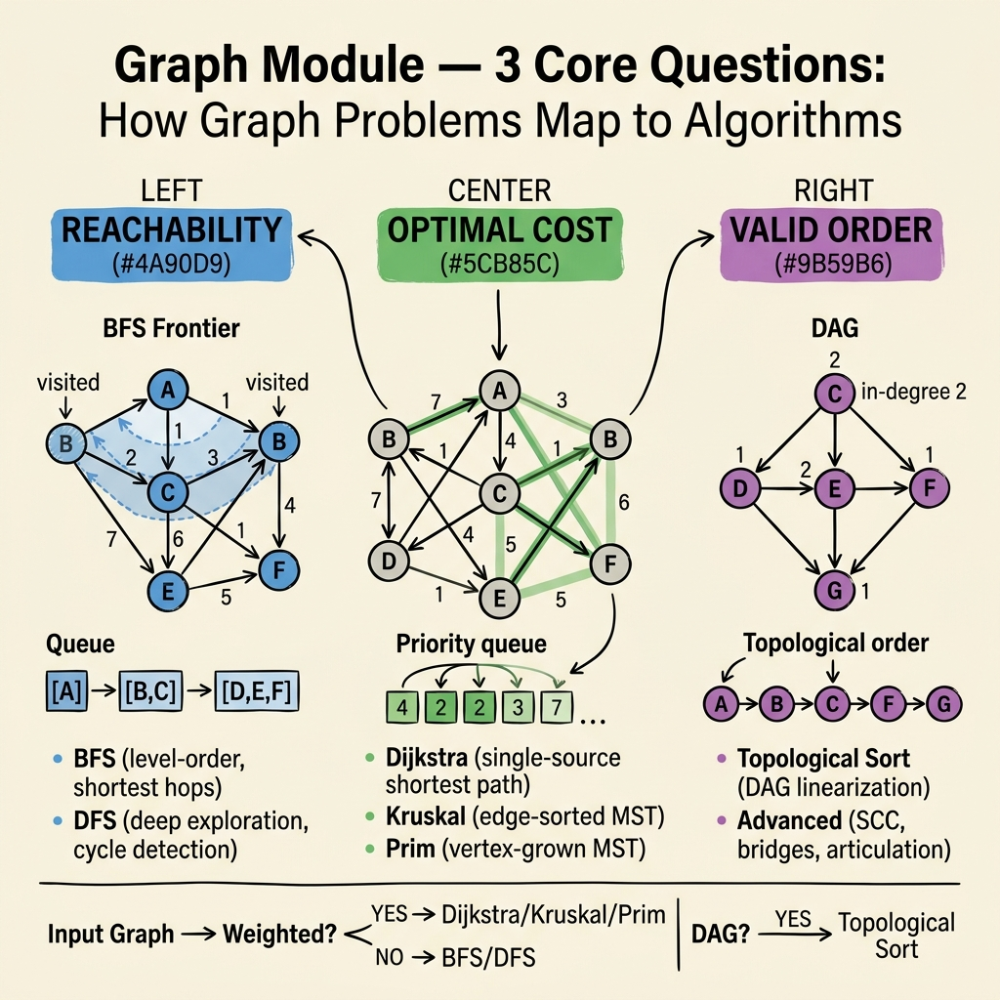

<!-- tags: dsa, algorithms, graph, overview -->
# Graph — Reachability, Cost, and Order on Nodes

> The Graph module surrounds three main questions. Can you reach it? Which path is cheapest? What processing order is valid? Mixing these questions often leads to the wrong traversal or invariant.

📅 Created: 2026-04-04 · 🔄 Updated: 2026-04-09 · ⏱️ 8 min read

| Aspect | Detail |
| ------ | ------ |
| **Focus** | Reachability, shortest path, MST, DAG order |
| **Core state** | Node, edge, frontier, visited/cost/order |
| **Common confusion** | BFS, DFS, and Dijkstra traverse graphs but answer three different questions |

---

## 1. DEFINE

You debug a seemingly correct solution but hit TLE or edge case failures. Graph patterns only make sense when you see the invariant that keeps your solution stable.

Graphs often exhaust learners due to their broad surface. This includes matrices, adjacency lists, weighted edges, and DAGs. Stripping this away reveals familiar tensions. You must explore reachable nodes, find the cheapest path, connect nodes with minimal cost, or respect dependency orders.

BFS, DFS, Dijkstra, Kruskal, Prim, and Topological Sort are not isolated algorithms. They answer different tensions. Choosing the wrong algorithm stems from ignoring the question type. The problem asks for distance, coverage, spanning, or ordering.

This hub helps you lock in the correct graph family before coding. When the family is correct, auxiliary structures like queues, stacks, heaps, and DSUs appear naturally.

### Articles in this module
| Article | Core question | Key invariant | Link |
| --- | --- | --- | --- |
| BFS | Expand by nearest layer | Current frontier contains all nodes at the same distance | [01-bfs.md](./01-bfs.md) |
| DFS | Go deep to explore structure | Visited set and call stack hold the current path | [02-dfs.md](./02-dfs.md) |
| Dijkstra | Shortest path with non-negative weights | Popped heap nodes have their final optimal distance | [03-dijkstra.md](./03-dijkstra.md) |
| Kruskal | MST by picking cheap edges without cycles | DSU maintains the current partition | [04-kruskal.md](./04-kruskal.md) |
| Prim | MST by expanding from a growing tree | Heap holds the best outward edge | [05-prim.md](./05-prim.md) |
| Topological Sort | Valid order on a DAG | Only nodes with indegree 0 enter the queue | [06-topological-sort.md](./06-topological-sort.md) |
| Advanced Patterns | Combine multiple graph motifs | Know which family the problem borrows from | [07-advanced-patterns.md](./07-advanced-patterns.md) |

## 2. VISUAL

Graph algorithms look diverse on the surface. The image below strips six algorithms down to three core questions — reachability, optimal cost, and valid order — and maps each algorithm to its driving question.



*Image: BFS and DFS answer reachability. Dijkstra, Kruskal, and Prim answer cost. Topological Sort answers order. The decision router at the bottom shows how weighted vs unweighted and DAG vs general graph determine the algorithm.*

```text
Graph problem
  |
  +-- need reachability or layer distance? -> BFS
  +-- explore deep structure, component, or cycle? -> DFS
  +-- non-negative weighted edges and shortest path? -> Dijkstra
  +-- connect all nodes with minimum total cost? -> Kruskal / Prim
  +-- dependency direction and valid order? -> Topological Sort
```
*Figure: Text fallback for the decision tree above — choose the algorithm by the question type, not by the graph representation.*

## 3. CODE

The reading order should progress from basic traversals to cost and order patterns. Then, move to hybrid patterns.

| Order | File | Learning goal | Mastery signal |
| --- | --- | --- | --- |
| 1 | [01-bfs.md](./01-bfs.md) and [02-dfs.md](./02-dfs.md) | Master frontier vs depth-first exploration | You distinguish queue state layers from recursion stacks |
| 2 | [06-topological-sort.md](./06-topological-sort.md) | Understand DAG ordering | You view dependency graphs as indegree state problems |
| 3 | [03-dijkstra.md](./03-dijkstra.md) | Lock shortest-path invariant with heaps | You explain why non-negative weights are mandatory |
| 4 | [04-kruskal.md](./04-kruskal.md) and [05-prim.md](./05-prim.md) | Compare two MST approaches | You see how DSU global edge picking differs from local frontier expansion |

## 4. PITFALLS

Graph algorithms fail because you mark states at the wrong time. They also fail when you use the wrong primitive for the relationship you want to prove.

| Pitfall | Signal | Why it fails | Fix | Severity |
| ------- | -------- | ---------- | -------- | -------- |
| BFS for weighted shortest paths | Small samples pass, large weights fail | BFS only works when all edge costs are equal | Separate layer distance from weighted distance | high |
| Confusing DFS visited with topological done state | Cycle detection fails or topo order breaks | Graph state has multiple phases beyond unvisited and visited | Define the node state machine clearly | high |
| Ignoring Dijkstra's non-negative condition | Copied heap template fails on edge cases | The popped optimal invariant breaks down | Use Bellman-Ford if negative edges exist | high |
| Treating Kruskal and Prim identically | Missing the strengths of each approach | One optimizes global edges, the other expands tree frontiers | Compare the auxiliary structures of each method | medium |

## 5. REF

- Module files: [01-bfs.md](./01-bfs.md) to [07-advanced-patterns.md](./07-advanced-patterns.md)
- Related DSU support structure: [../important-algorithms/01-union-find.md](../important-algorithms/01-union-find.md)
- Tree adjacency for special graphs: [../tree-algorithms/README.md](../tree-algorithms/README.md)

## 6. RECOMMEND

After this module, you should remember six distinct graph tensions instead of six different templates.

- If your graph is a DAG dependency, read [06-topological-sort.md](./06-topological-sort.md). Move to [../important-algorithms/05-backtracking.md](../important-algorithms/05-backtracking.md) if you need constrained search.
- If the problem needs a shortest path with heuristics, proceed to [../important-algorithms/04-a-star.md](../important-algorithms/04-a-star.md).
- If the structure is a tree, review [../tree-algorithms/README.md](../tree-algorithms/README.md) to remove general graph overhead.

## 7. QUICK REF

- BFS targets layers. DFS targets structure. Dijkstra targets cost. Kruskal and Prim target spanning. Topo targets order.
- Ask what the problem optimizes before choosing a queue or heap.
- A simple visited boolean cannot describe every graph state.
