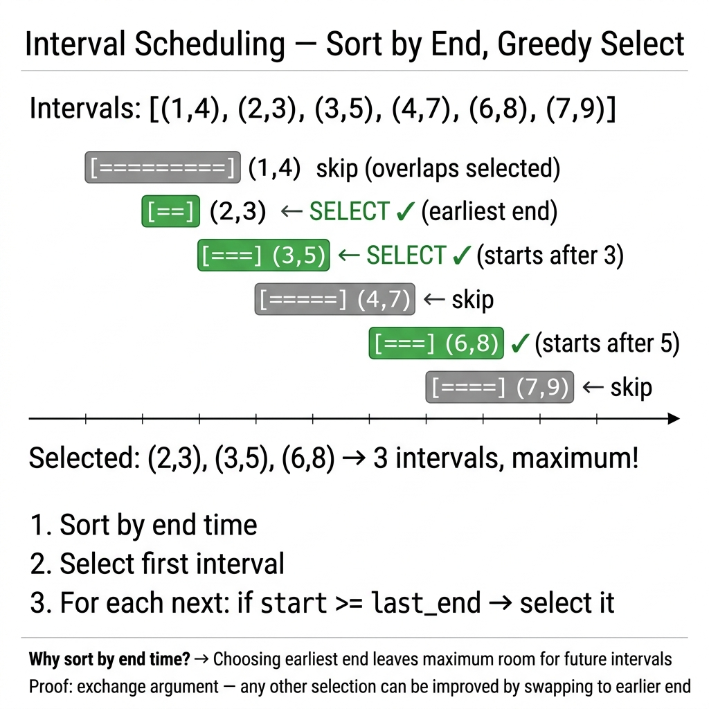

<!-- tags: dsa, algorithms -->
# 📅 Interval Scheduling / Activity Selection

> **Category**: Greedy
> **Summary**: Maximize non-overlapping intervals — sort by end time, greedily pick.

📅 Created: 2026-03-20 · 🔄 Updated: 2026-04-09 · ⏱️ 15 min read

---

## 1. DEFINE

<!-- [Experienced layer] -->

When a problem contains multiple overlapping intervals, intuition often suggests picking the earliest or shortest interval. Interval Scheduling is famous because that intuition fails. The safest choice is the interval that ends earliest.

This problem is the gateway to understanding greedy algorithms via exchange arguments. You do not just pick an attractive local answer. You must show that the current decision can replace another optimal choice without worsening the future.

Core insight: **Greedy works when the local choice preserves maximum space for the future, not when it feels earliest or shortest.**

| Variant | When to use | Key idea |
| ------- | ----------- | -------- |
| Activity Selection | Need maximum non-overlapping intervals | Sort by `end` to preserve future space |
| Remove Minimum Intervals | Must remove the minimum number of intervals | Shift perspective: `remove = total - keep` |
| Meeting Rooms | Need parallel running resource count | Compare `starts` with `ends` to count active overlaps |

| Approach | Time | Space | When to pick |
| -------- | ---- | ----- | ------------ |
| Sort by end + greedy pick | O(n log n) | O(1) or O(n) | When you want to keep maximum valid intervals |
| Count removals from keep-set | O(n log n) | O(1) | When the problem asks for minimum removals |
| Two sorted arrays | O(n log n) | O(n) | When the problem counts parallel resources |

### 1.1 Quick Identification

- The problem provides `[start, end]` intervals and asks for maximum non-overlapping choices.
- Variants ask for intervals to remove or meeting rooms to allocate.
- Sorting by `end` is the strongest identification signal.

### 1.2 Invariants & Failure Modes

- The selected interval set must always remain pairwise non-overlapping.
- The `lastEnd` should be the smallest possible end time after each decision.
- Common failure mode: sorting by start or length seems logical, but it destroys the future timeline space.

## 2. VISUAL

Greedy algorithms cause misunderstandings if you only read the local choice description. The trace below shows how the local decision protects the future.

### Level 1 — Core intuition

```text
Intervals after sort by end:

[1, 3]   [2, 5]   [4, 6]   [6, 7]
   ✓        x        ✓        ✓

Pick [1,3] first because it ends earliest.
That leaves the widest remaining timeline for the next choices.
```

*Caption*: Level 1 shows the core greedy choice. It prioritizes the earliest ending interval, not the earliest starting one.

### Level 2 — Decision trace

- Step 1: Sort all intervals by `end` in ascending order.
- Step 2: Track `lastEnd` of the most recently selected interval.
- Step 3: Accept a new interval only if `start >= lastEnd`.
- Step 4: The invariant ensures the selected set remains non-overlapping with the smallest possible `lastEnd`.



## 3. CODE

Once you prove the local rule via an invariant or exchange argument, the code just follows that rule. Do not add arbitrary heuristics.

### Problem 1: Basic — Activity Selection — Max Non-overlapping
> **Goal**: Maximize the number of non-overlapping intervals.
> **Approach**: Start with an easily verifiable local rule. Prove why the local decision remains globally safe.
> **Example**: An input provides multiple local choices to verify if the greedy choice preserves optimality.
> **Complexity**: O(n log n) time, O(1) space.

```go
package greedy

import "sort"

type Interval struct {
    Start, End int
}

// MaxNonOverlapping: greedily pick intervals that end earliest
func MaxNonOverlapping(intervals []Interval) []Interval {
    sort.Slice(intervals, func(i, j int) bool {
        return intervals[i].End < intervals[j].End
    })

    var selected []Interval
    lastEnd := -1
    for _, iv := range intervals {
        if iv.Start >= lastEnd {
            selected = append(selected, iv)
            lastEnd = iv.End
        }
    }
    return selected
}
```

```typescript
interface Interval { start: number; end: number; }
function maxNonOverlapping(intervals: Interval[]): Interval[] {
    intervals.sort((a, b) => a.end - b.end);
    const selected: Interval[] = []; let lastEnd = -1;
    for (const iv of intervals) {
        if (iv.start >= lastEnd) { selected.push(iv); lastEnd = iv.end; }
    }
    return selected;
}
```

```rust
fn max_non_overlapping(intervals: &mut Vec<(i32,i32)>) -> Vec<(i32,i32)> {
    intervals.sort_by_key(|iv| iv.1);
    let mut sel = vec![]; let mut last_end = i32::MIN;
    for &iv in intervals.iter() {
        if iv.0 >= last_end { sel.push(iv); last_end = iv.1; }
    }
    sel
}
```

```cpp
std::vector<std::pair<int,int>> maxNonOverlapping(
    std::vector<std::pair<int,int>>& intervals) {
    std::sort(intervals.begin(), intervals.end(),
        [](auto& a, auto& b) { return a.second < b.second; });
    std::vector<std::pair<int,int>> sel; int lastEnd = INT_MIN;
    for (auto& [s, e] : intervals)
        if (s >= lastEnd) { sel.push_back({s, e}); lastEnd = e; }
    return sel;
}
```

```python
def max_non_overlapping(intervals: list[tuple[int,int]]) -> list[tuple[int,int]]:
    intervals.sort(key=lambda x: x[1])
    sel, last_end = [], float('-inf')
    for s, e in intervals:
        if s >= last_end: sel.append((s, e)); last_end = e
    return sel
```

> **Why?** Activity Selection only works when the local choice maintains a global invariant. After proving the current choice preserves optimality, you never backtrack to check discarded branches.

> **Takeaway**: Focus on the earliest end time to maximize available future space. This single invariant replaces complex backtracking logic.

### Problem 2: Intermediate — Minimum Meeting Rooms (LeetCode #253)
> **Goal**: Find the minimum number of meeting rooms required.
> **Approach**: Sort start and end times separately. Compare the current start with the earliest end to count active overlaps.
> **Example**: Track active overlaps to see if the greedy choice preserves optimality.
> **Complexity**: O(n log n) time, O(n) space.

```go
package greedy

import "sort"

func MinMeetingRooms(intervals []Interval) int {
    n := len(intervals)
    starts := make([]int, n)
    ends := make([]int, n)
    for i, iv := range intervals {
        starts[i] = iv.Start
        ends[i] = iv.End
    }
    sort.Ints(starts)
    sort.Ints(ends)

    rooms, endPtr := 0, 0
    for i := 0; i < n; i++ {
        if starts[i] < ends[endPtr] {
            rooms++
        } else {
            endPtr++
        }
    }
    return rooms
}
```

```typescript
function minMeetingRooms(intervals: Interval[]): number {
    const starts = intervals.map(iv => iv.start).sort((a,b) => a-b);
    const ends = intervals.map(iv => iv.end).sort((a,b) => a-b);
    let rooms = 0, endPtr = 0;
    for (let i = 0; i < starts.length; i++)
        if (starts[i] < ends[endPtr]) rooms++; else endPtr++;
    return rooms;
}
```

```rust
fn min_meeting_rooms(intervals: &[(i32,i32)]) -> i32 {
    let mut starts: Vec<i32> = intervals.iter().map(|iv| iv.0).collect();
    let mut ends: Vec<i32> = intervals.iter().map(|iv| iv.1).collect();
    starts.sort(); ends.sort();
    let (mut rooms, mut ep) = (0i32, 0);
    for s in &starts { if *s < ends[ep] { rooms += 1; } else { ep += 1; } }
    rooms
}
```

```cpp
int minMeetingRooms(const std::vector<std::pair<int,int>>& intervals) {
    std::vector<int> starts, ends;
    for (auto& [s, e] : intervals) { starts.push_back(s); ends.push_back(e); }
    std::sort(starts.begin(), starts.end());
    std::sort(ends.begin(), ends.end());
    int rooms = 0, ep = 0;
    for (int i = 0; i < (int)starts.size(); i++)
        if (starts[i] < ends[ep]) rooms++; else ep++;
    return rooms;
}
```

```python
def min_meeting_rooms(intervals: list[tuple[int,int]]) -> int:
    starts = sorted(s for s, _ in intervals)
    ends = sorted(e for _, e in intervals)
    rooms, ep = 0, 0
    for s in starts:
        if s < ends[ep]: rooms += 1
        else: ep += 1
    return rooms
```

> **Why?** Minimum Meeting Rooms works because sorting events temporally reveals the active overlap count. The local invariant tracks concurrent activities precisely.

> **Takeaway**: Separating start and end events converts interval overlap into a simple chronological counting problem.

### Problem 3: Advanced — Merge Overlapping Intervals
> **Goal**: Merge all overlapping intervals into a continuous set.
> **Approach**: Sort by start time. Extend the current interval's end time if the next interval overlaps.
> **Example**: Provide local choices to verify if the greedy merge maintains continuity correctly.
> **Complexity**: O(n log n) time, O(n) space.

```go
package greedy

import "sort"

func MergeIntervals(intervals []Interval) []Interval {
    sort.Slice(intervals, func(i, j int) bool {
        return intervals[i].Start < intervals[j].Start
    })

    merged := []Interval{intervals[0]}
    for _, iv := range intervals[1:] {
        last := &merged[len(merged)-1]
        if iv.Start <= last.End {
            if iv.End > last.End { last.End = iv.End }
        } else {
            merged = append(merged, iv)
        }
    }
    return merged
}
```

```typescript
function mergeIntervals(intervals: Interval[]): Interval[] {
    intervals.sort((a, b) => a.start - b.start);
    const merged = [intervals[0]];
    for (const iv of intervals.slice(1)) {
        const last = merged[merged.length - 1];
        if (iv.start <= last.end) last.end = Math.max(last.end, iv.end);
        else merged.push({...iv});
    }
    return merged;
}
```

```rust
fn merge_intervals(intervals: &mut Vec<(i32,i32)>) -> Vec<(i32,i32)> {
    intervals.sort(); let mut merged = vec![intervals[0]];
    for &(s, e) in &intervals[1..] {
        let last = merged.last_mut().unwrap();
        if s <= last.1 { last.1 = last.1.max(e); } else { merged.push((s, e)); }
    }
    merged
}
```

```cpp
std::vector<std::pair<int,int>> mergeIntervals(
    std::vector<std::pair<int,int>>& intervals) {
    std::sort(intervals.begin(), intervals.end());
    std::vector<std::pair<int,int>> merged = {intervals[0]};
    for (size_t i = 1; i < intervals.size(); i++) {
        auto& last = merged.back();
        if (intervals[i].first <= last.second) last.second = std::max(last.second, intervals[i].second);
        else merged.push_back(intervals[i]);
    }
    return merged;
}
```

```python
def merge_intervals(intervals: list[tuple[int,int]]) -> list[tuple[int,int]]:
    intervals.sort()
    merged = [list(intervals[0])]
    for s, e in intervals[1:]:
        if s <= merged[-1][1]: merged[-1][1] = max(merged[-1][1], e)
        else: merged.append([s, e])
    return [tuple(x) for x in merged]
```

> **Why?** Merge Overlapping Intervals relies on sorting by start time. This invariant ensures any overlap happens with the immediate predecessor.

> **Takeaway**: Sorting by start time groups potential overlaps adjacently. You only need to compare the current item with the last merged result.

---

## 4. PITFALLS

Greedy fails fastest when you pick a reasonable option without proving its future safety.

| # | Severity | Error | Impact | Fix |
|---|----------|-------|--------|-----|
| 1 | 🔴 Fatal | Sort by start, not end | Incorrect selection | Activity selection must sort by end time |
| 2 | 🟡 Common | `>=` vs `>` for overlap | Missed intervals | Check the problem definition for boundaries |

---

## 5. REF

| Resource      | Link                                                                               |
| ------------- | ---------------------------------------------------------------------------------- |
| Wikipedia     | [en.wikipedia.org](https://en.wikipedia.org/wiki/Interval_scheduling)              |
| CP-Algorithms | [cp-algorithms.com](https://cp-algorithms.com/schedules/schedule_one_machine.html) |

---

## 6. RECOMMEND

Once you grasp the greedy approach, distinguish it from DP or binary search on similar problems.

| Extension                 | When to use                | Strategy             |
| ------------------------- | -------------------------- | -------------------- |
| **Weighted Interval**     | Jobs have different values | DP + binary search   |
| **Meeting Rooms**         | Min rooms needed           | Sort + heap          |
| **Job Scheduling**        | Deadlines + penalties      | Greedy by deadline   |
| **Interval Partitioning** | Min resources              | Greedy + PQ          |

---

## 7. QUICK REF

| # | Pattern | Code |
|---|---------|------|
| 1 | Sort by end | `sort.Slice(intervals, func(i,j int) bool { return intervals[i].End < intervals[j].End })` |
| 2 | Greedy pick | `lastEnd := math.MinInt; for _, iv := range intervals { if iv.Start >= lastEnd { count++; lastEnd = iv.End } }` |
| 3 | Meeting rooms | `sort.Slice(intervals, func(i,j int) bool { return intervals[i].Start < intervals[j].Start }); // use min-heap for end times` |
| 4 | Merge intervals | `for _, iv := range sorted { if len(res)==0 \|\| iv.Start>res[last].End { res=append(res,iv) } else { res[last].End=max(res[last].End,iv.End) } }` |
| 5 | Complexity | `// O(n log n) sort + O(n) scan` |
| 6 | When to use | `// Task scheduling, meeting rooms, non-overlapping selection` |

**Links**: [← README](./README.md) · [→ Kadane](./02-kadane.md)

---

Return to the opening question: why sort by end time instead of start time or duration? The earliest end leaves maximum room for future intervals. The exchange argument proves swapping any interval for one ending earlier yields results that are equally good or better.
