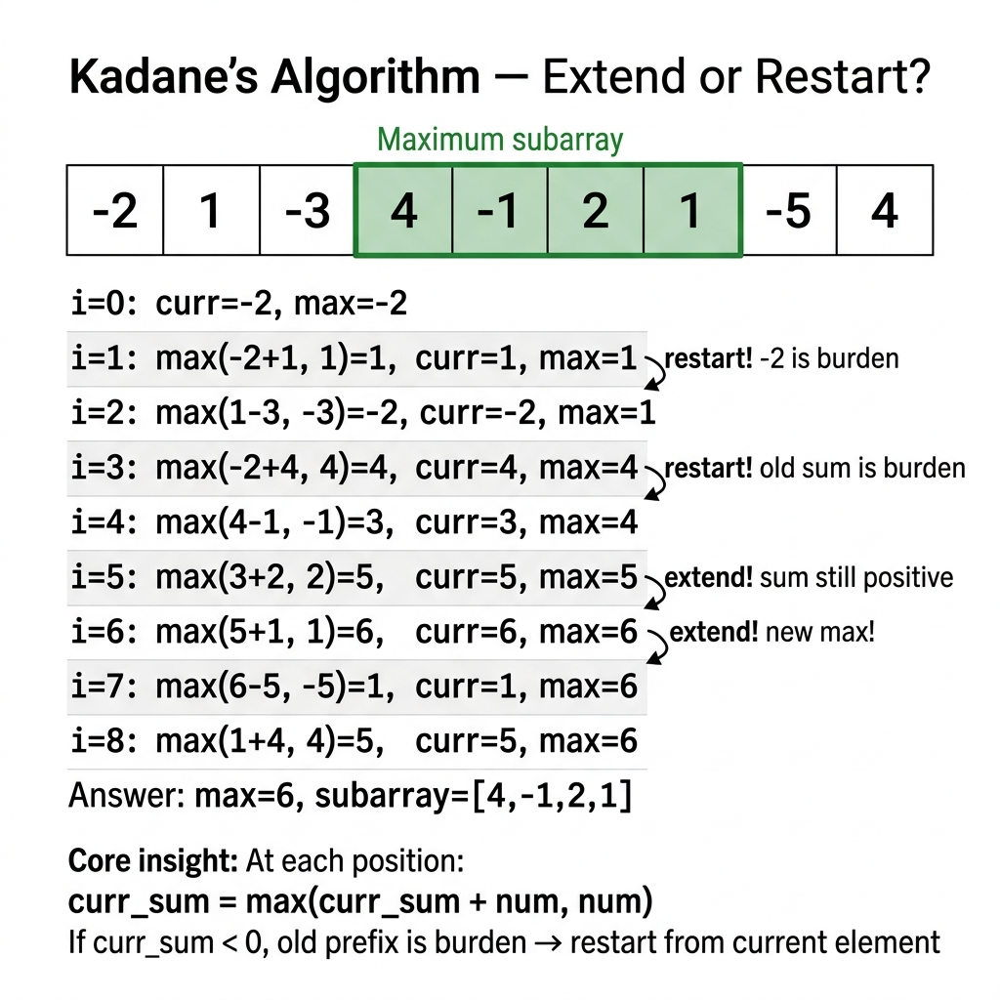

<!-- tags: dsa, algorithms, arrays -->
# 📈 Kadane's Algorithm — Maximum Subarray

> **Category**: Greedy / DP
> **Summary**: Find the contiguous subarray with the largest sum — O(n).

📅 Created: 2026-03-20 · 🔄 Updated: 2026-04-09 · ⏱️ 15 min read

---

## 1. DEFINE

<!-- [Experienced layer] -->

Maximum Subarray seems simple enough that many developers brute-force it before optimizing with prefix sums. Kadane addresses the critical question directly. At the current position, should you carry a negative prefix forward or cut it immediately?

The lesson in Kadane's algorithm is greedy execution at a linear state level. You do not pick a specific element. You decide whether the best subarray ending here should inherit the past or restart from the current element.

Core insight: **When an old state becomes a pure burden for all future states, greedy logic can safely discard it.**

| Metric    | Value                                         |
| --------- | --------------------------------------------- |
| **Time**  | O(n)                                          |
| **Space** | O(1)                                          |
| **Idea**  | maxEndingHere = max(num, maxEndingHere + num) |

---

| Variant | When to use | Key idea |
| ------- | ----------- | -------- |
| Standard Kadane's | Need a traceable baseline | Grasp the core invariant before optimizing |
| Return indices | Adding states or practical constraints | Keep the invariant but add tracking structures |
| Max Circular | Processing large inputs | Optimize via pruning or state compression |

| Approach | Time | Space | When to pick |
| --- | --- | --- | --- |
| Standard Kadane's | O(1) | Varies | Understand the invariant before advanced forms |
| Return indices | O(n) | O(log n) | When the problem introduces moderate tracking constraints |
| Max Circular | Varies | Varies | To scale better or eliminate brute-force loops |

### 1.1 Quick Identification

- The problem asks for the maximum contiguous subarray sum.
- Each step requires deciding whether to extend the segment or restart.
- It provides a powerful 1D array pattern depending on the optimal prefix ending at `i-1`.

### 1.2 Invariants & Failure Modes

- `bestEndingHere` must represent the best sum of all subarrays ending exactly at the current position.
- If the previous state is negative, adding it damages all future choices.
- Common failure mode: remembering only "reset if negative" without understanding which state resets. This breaks circular array variants.

## 2. VISUAL

Greedy logic causes misunderstandings if you only read the local choice description. The trace below shows how the local decision protects the future.

### Level 1 — Core intuition

```text
  [-2, 1, -3, 4, -1, 2, 1, -5, 4]

  maxHere:  -2  1  -2  4   3  5  6   1  5
  maxSoFar: -2  1   1  4   4  5  6   6  6
                          └──────┘
                        subarray [4,-1,2,1] = 6
```

*Caption*: Level 1 shows the core intuition. Level 2 details the state update order from input to answer.

### Level 2 — Decision trace

- Order the sequence or choose local decisions to reveal the optimal global structure.
- After each choice, check the invariant. Ensure the selected part opens paths to optimal future solutions.
- If a local choice locks out better future options, the greedy logic lacks proof.
- When the traversal finishes and the invariant holds, the decision set forms the answer.



## 3. CODE

Once you prove the local rule via an invariant or exchange argument, the code follows that rule tightly.

### Problem 1: Basic — Standard Kadane's
> **Goal**: Find the contiguous subarray with the largest sum.
> **Approach**: Start with a simple local rule. Prove why dropping negative prefixes remains globally safe.
> **Example**: An input array helps verify if the greedy choice preserves optimality.
> **Complexity**: O(n) time, O(1) space.

```go
func MaxSubarraySum(nums []int) int {
    maxHere, maxSoFar := nums[0], nums[0]
    for _, num := range nums[1:] {
        if maxHere+num > num {
            maxHere = maxHere + num
        } else {
            maxHere = num
        }
        if maxHere > maxSoFar {
            maxSoFar = maxHere
        }
    }
    return maxSoFar
}
```

```typescript
function maxSubarraySum(nums: number[]): number {
    let [maxHere, maxSoFar] = [nums[0], nums[0]];
    for (const num of nums.slice(1)) {
        maxHere = Math.max(num, maxHere + num);
        maxSoFar = Math.max(maxSoFar, maxHere);
    }
    return maxSoFar;
}
```

```rust
fn max_subarray_sum(nums: &[i64]) -> i64 {
    let (mut here, mut best) = (nums[0], nums[0]);
    for &n in &nums[1..] { here = here.max(0) + n; best = best.max(here); }
    best
}
```

```cpp
long long maxSubarraySum(const std::vector<int>& nums) {
    long long here = nums[0], best = nums[0];
    for (size_t i = 1; i < nums.size(); i++) {
        here = std::max((long long)nums[i], here + nums[i]);
        best = std::max(best, here);
    }
    return best;
}
```

```python
def max_subarray_sum(nums: list[int]) -> int:
    here = best = nums[0]
    for n in nums[1:]:
        here = max(n, here + n)
        best = max(best, here)
    return best
```

> **Why?** Standard Kadane's algorithm works because the local choice maintains a global invariant. Once you prove the current choice preserves optimality, backtracking is unnecessary.

> **Takeaway**: Dropping a negative prefix is always safe. It cannot improve any subsequent sequence.

### Problem 2: Intermediate — Return subarray indices
> **Goal**: Find the maximum subarray and its start and end indices.
> **Approach**: Keep the Kadane invariant but track position variables during the state updates.
> **Example**: Track the start pointer when resetting the sum to verify optimality.
> **Complexity**: O(n) time, O(1) space.

```go
func MaxSubarrayIndices(nums []int) (int, int, int) {
    maxHere, maxSoFar := nums[0], nums[0]
    start, end, tempStart := 0, 0, 0

    for i := 1; i < len(nums); i++ {
        if nums[i] > maxHere+nums[i] {
            maxHere = nums[i]
            tempStart = i
        } else {
            maxHere += nums[i]
        }
        if maxHere > maxSoFar {
            maxSoFar = maxHere
            start = tempStart
            end = i
        }
    }
    return maxSoFar, start, end
}
```

```typescript
function maxSubarrayIndices(nums: number[]): [number, number, number] {
    let [maxHere, maxSoFar] = [nums[0], nums[0]];
    let [start, end, tempStart] = [0, 0, 0];
    for (let i = 1; i < nums.length; i++) {
        if (nums[i] > maxHere + nums[i]) { maxHere = nums[i]; tempStart = i; }
        else maxHere += nums[i];
        if (maxHere > maxSoFar) { maxSoFar = maxHere; start = tempStart; end = i; }
    }
    return [maxSoFar, start, end];
}
```

```rust
fn max_subarray_indices(nums: &[i64]) -> (i64, usize, usize) {
    let (mut here, mut best) = (nums[0], nums[0]);
    let (mut start, mut end, mut tmp) = (0, 0, 0);
    for i in 1..nums.len() {
        if nums[i] > here + nums[i] { here = nums[i]; tmp = i; } else { here += nums[i]; }
        if here > best { best = here; start = tmp; end = i; }
    }
    (best, start, end)
}
```

```cpp
std::tuple<long long,int,int> maxSubarrayIndices(const std::vector<int>& nums) {
    long long here = nums[0], best = nums[0];
    int start = 0, end = 0, tmp = 0;
    for (int i = 1; i < (int)nums.size(); i++) {
        if (nums[i] > here + nums[i]) { here = nums[i]; tmp = i; } else here += nums[i];
        if (here > best) { best = here; start = tmp; end = i; }
    }
    return {best, start, end};
}
```

```python
def max_subarray_indices(nums: list[int]) -> tuple[int, int, int]:
    here = best = nums[0]; start = end = tmp = 0
    for i in range(1, len(nums)):
        if nums[i] > here + nums[i]: here = nums[i]; tmp = i
        else: here += nums[i]
        if here > best: best = here; start = tmp; end = i
    return best, start, end
```

> **Why?** Returning indices relies on the same global invariant. Tracking the temporary start pointer prevents losing the boundary when a reset occurs.

> **Takeaway**: Auxiliary variables for tracking indices do not change the core greedy logic.

### Problem 3: Advanced — Max Circular Subarray
> **Goal**: Find the maximum subarray sum in a circular array.
> **Approach**: Find the normal maximum. Then find the minimum subarray and subtract it from the total sum.
> **Example**: Compare the normal maximum with the wrapped maximum.
> **Complexity**: O(n) time, O(n) space.

```go
func MaxCircularSubarray(nums []int) int {
    maxKadane := MaxSubarraySum(nums) // normal max

    totalSum := 0
    for i := range nums {
        totalSum += nums[i]
        nums[i] = -nums[i]
    }
    minKadane := -MaxSubarraySum(nums) // min subarray via negation

    circularMax := totalSum - minKadane
    if circularMax == 0 { return maxKadane } // all negative
    if circularMax > maxKadane { return circularMax }
    return maxKadane
}
```

```typescript
function maxCircularSubarray(nums: number[]): number {
    const maxK = maxSubarraySum(nums);
    const total = nums.reduce((a, b) => a + b, 0);
    const negated = nums.map(n => -n);
    const minK = -maxSubarraySum(negated);
    const circular = total - minK;
    return circular === 0 ? maxK : Math.max(maxK, circular);
}
```

```rust
fn max_circular_subarray(nums: &[i64]) -> i64 {
    let max_k = max_subarray_sum(nums);
    let total: i64 = nums.iter().sum();
    let neg: Vec<i64> = nums.iter().map(|&x| -x).collect();
    let min_k = -max_subarray_sum(&neg);
    let circular = total - min_k;
    if circular == 0 { max_k } else { max_k.max(circular) }
}
```

```cpp
long long maxCircularSubarray(const std::vector<int>& nums) {
    long long maxK = maxSubarraySum(nums);
    long long total = 0; for (int n : nums) total += n;
    std::vector<int> neg(nums.size()); for (size_t i=0;i<nums.size();i++) neg[i]=-nums[i];
    long long minK = -maxSubarraySum(neg);
    long long circular = total - minK;
    return circular == 0 ? maxK : std::max(maxK, circular);
}
```

```python
def max_circular_subarray(nums: list[int]) -> int:
    max_k = max_subarray_sum(nums)
    total = sum(nums)
    min_k = -max_subarray_sum([-n for n in nums])
    circular = total - min_k
    return max_k if circular == 0 else max(max_k, circular)
```

> **Why?** The Max Circular Subarray maintains the global invariant by reversing the problem. Subtracting the worst contiguous sequence leaves the best circular sequence.

> **Takeaway**: Calculating the minimum subarray is identical to calculating the maximum subarray when you negate the values.

---

## 4. PITFALLS

Greedy algorithms fail fastest when you select a reasonable option without proving its future safety.

| # | Severity | Error | Impact | Fix |
| --- | --- | --- | --- | --- |
| 1 | 🔴 Fatal | All negatives returns 0 | Incorrect sum | Initialize maxSoFar with nums[0] |
| 2 | 🟡 Common | Circular array has all negatives | Misses normal max | Check `circularMax == 0` |

---

## 5. REF

| Resource  | Link                                                                       |
| --------- | -------------------------------------------------------------------------- |
| Wikipedia | [en.wikipedia.org](https://en.wikipedia.org/wiki/Maximum_subarray_problem) |
| LeetCode  | [leetcode.com](https://leetcode.com/problems/maximum-subarray/)            |

---

## 6. RECOMMEND

Once you grasp the greedy approach, distinguish it from DP or binary search on similar problems.

| Extension                 | When to use    | Reason               |
| ------------------------- | -------------- | -------------------- |
| **Max Subarray Sum**      | 1D array       | O(n) Kadane          |
| **Max Circular Subarray** | Circular array | Total - min subarray |
| **2D Max Subarray**       | Matrix         | O(n²m) with Kadane   |
| **K Maximum Subarrays**   | Top-K results  | Heap + divide        |

---

## 7. QUICK REF

| # | Pattern | Code |
|---|---------|------|
| 1 | Max subarray | `maxSum, curr := nums[0], nums[0]; for _, n := range nums[1:] { curr = max(n, curr+n); maxSum = max(maxSum, curr) }` |
| 2 | Key insight | `// curr = max(extend previous, start fresh at current)` |
| 3 | Track indices | `start, end, temp := 0, 0, 0; if curr+n < n { curr=n; temp=i } else { curr+=n }; if curr>maxSum { maxSum=curr; start=temp; end=i }` |
| 4 | Min subarray | `// Negate all values, run Kadane, negate result` |
| 5 | Complexity | `// O(n) time · O(1) space` |
| 6 | Circular array | `// max(kadane normal, total_sum - kadane on negated)` |
| 7 | When to use | `// Maximum subarray sum, stock buy/sell, contiguous sum` |

**Links**: [← Interval Scheduling](./01-interval-scheduling.md) · [→ LIS](./03-lis.md)

---

Return to the opening question: why does Kadane need only O(n) time? Because at each position, you have only two choices. You extend the sum or restart it. If the current sum is negative, the old prefix is a burden. Drop it. You make one decision per element in one pass.
