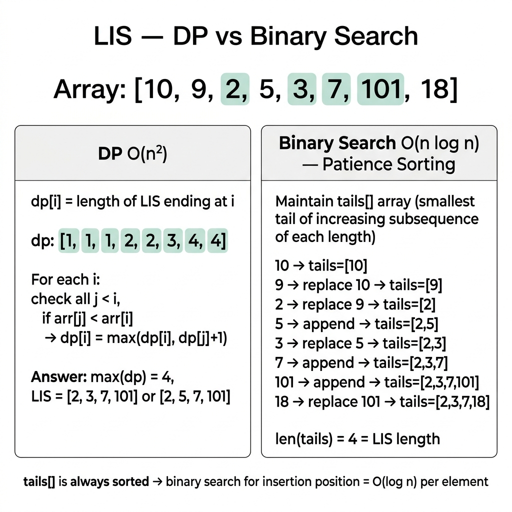

<!-- tags: dsa, algorithms -->
# 📏 LIS — Longest Increasing Subsequence

> **Category**: DP / Greedy + Binary Search
> **Summary**: Find the longest increasing subsequence — O(n log n) optimal.

📅 Created: 2026-03-20 · 🔄 Updated: 2026-04-09 · ⏱️ 15 min read

---

## 1. DEFINE

<!-- [Experienced layer] -->

Developers often mistakenly learn Longest Increasing Subsequence as greedily keeping the longest current sequence. The truth is greedy only appears in patience sorting. You do not build the optimal subsequence directly. You maintain the best tails for each length.

This problem is important because it stands between DP and greedy algorithms. The O(n²) solution helps you understand state. The O(n log n) solution forces you to accept an indirect but stronger representation.

Core insight: **The representation `tails[len] = smallest tail value for a subsequence of length len` is the critical mental leap.**

| Variant | When to use | Key idea |
| ------- | ----------- | -------- |
| DP O(n²) | Need an easily traceable solution | `dp[i]` is LIS length ending at `i` |
| Greedy + Binary Search | Must optimize time to O(n log n) | `tails[len]` keeps the smallest tail for length `len + 1` |
| Reconstruct sequence | Problem requires the actual subsequence | Store parents during state updates |

| Approach | Time | Space | When to pick |
| -------- | ---- | ----- | ------------ |
| Dynamic Programming | O(n²) | O(n) | Focuses on understanding states and transitions |
| Tails array + lower_bound | O(n log n) | O(n) | Need optimal length for large inputs |
| Tails + reconstruction | O(n log n) | O(n) | Must return the full LIS array |

### 1.1 Quick Identification

- The problem asks for the longest increasing subsequence.
- You must optimize a DP O(n²) solution to O(n log n).
- Binary search on a "tails" structure is a strong identification signal.

### 1.2 Invariants & Failure Modes

- The `tails` array is not the actual subsequence. It represents the best possibilities for each length.
- Replacing a larger tail with a smaller value preserves future expansion options.
- Common failure mode: assuming `tails` is the final answer, which causes bad traces when elements update.

## 2. VISUAL

Greedy algorithms cause misunderstandings if you only read the local choice description. The trace below shows how the local decision protects the future.

### Level 1 — Core intuition

```text
nums = [10, 9, 2, 5, 3, 7, 101, 18]

tails evolves:
[10]
[9]
[2]
[2, 5]
[2, 3]
[2, 3, 7]
[2, 3, 7, 101]
[2, 3, 7, 18]

Length of tails = 4 => LIS length = 4
```

*Caption*: The `tails` array is not the final LIS. It is an auxiliary structure storing the smallest tail for each sequence length.

### Level 2 — Decision trace

- For each `x`, find the first position in `tails` with a value `>= x`.
- If no such position exists, append `x` to increase the sequence length.
- If it exists, replace the value with `x` to keep a smaller tail.
- Invariant: after each step, `tails` increases strictly. Each cell holds the minimum tail for its length.



## 3. CODE

Once you prove the local rule via an invariant or exchange argument, the code follows that rule tightly.

### Problem 1: Basic — DP O(n²)
> **Goal**: Find the length of the longest increasing subsequence.
> **Approach**: Start with an easily verifiable local rule. Compare past sequences to extend the current sequence.
> **Example**: A small input shows which greedy choices lock early and why.
> **Complexity**: O(n²) time, O(n) space.

```go
func LISDP(nums []int) int {
    n := len(nums)
    dp := make([]int, n)
    for i := range dp { dp[i] = 1 }

    maxLen := 1
    for i := 1; i < n; i++ {
        for j := 0; j < i; j++ {
            if nums[j] < nums[i] && dp[j]+1 > dp[i] {
                dp[i] = dp[j] + 1
            }
        }
        if dp[i] > maxLen { maxLen = dp[i] }
    }
    return maxLen
}
```

```typescript
function lisDp(nums: number[]): number {
    const dp = Array(nums.length).fill(1); let maxLen = 1;
    for (let i = 1; i < nums.length; i++) {
        for (let j = 0; j < i; j++) if (nums[j] < nums[i]) dp[i] = Math.max(dp[i], dp[j]+1);
        maxLen = Math.max(maxLen, dp[i]);
    }
    return maxLen;
}
```

```rust
fn lis_dp(nums: &[i32]) -> usize {
    let mut dp = vec![1usize; nums.len()]; let mut best = 1;
    for i in 1..nums.len() {
        for j in 0..i { if nums[j] < nums[i] { dp[i] = dp[i].max(dp[j]+1); } }
        best = best.max(dp[i]);
    }
    best
}
```

```cpp
int lisDp(const std::vector<int>& nums) {
    std::vector<int> dp(nums.size(), 1); int best = 1;
    for (size_t i = 1; i < nums.size(); i++) {
        for (size_t j = 0; j < i; j++) if (nums[j] < nums[i]) dp[i] = std::max(dp[i], dp[j]+1);
        best = std::max(best, dp[i]);
    }
    return best;
}
```

```python
def lis_dp(nums: list[int]) -> int:
    dp = [1] * len(nums)
    for i in range(1, len(nums)):
        for j in range(i):
            if nums[j] < nums[i]: dp[i] = max(dp[i], dp[j] + 1)
    return max(dp)
```

> **Why?** The O(n²) DP maintains a global invariant across the array. Once you confirm the current choice does not ruin the sequence, you skip backtracking.

> **Takeaway**: The DP approach stores lengths directly. It guarantees the sequence ending at `i` is the longest possible.

### Problem 2: Intermediate — Greedy + Binary Search O(n log n) ⭐
> **Goal**: Optimize the LIS search to run in O(n log n) time.
> **Approach**: Maintain a tails array where each index stores the smallest tail value for a given sequence length.
> **Example**: Track the partition steps and pointer movements mentally on a small input array.
> **Complexity**: O(n log n) time, O(n) space.

```go
import "sort"

// LIS: maintain smallest possible tail for each length
func LIS(nums []int) int {
    tails := []int{} // tails[i] = smallest tail of IS length i+1

    for _, num := range nums {
        pos := sort.SearchInts(tails, num)
        if pos == len(tails) {
            tails = append(tails, num) // extend
        } else {
            tails[pos] = num // replace with smaller
        }
    }
    return len(tails)
}
```

```typescript
function lis(nums: number[]): number {
    const tails: number[] = [];
    for (const n of nums) {
        let lo = 0, hi = tails.length;
        while (lo < hi) { const mid = (lo+hi)>>1; tails[mid] < n ? lo=mid+1 : hi=mid; }
        lo === tails.length ? tails.push(n) : tails[lo] = n;
    }
    return tails.length;
}
```

```rust
fn lis(nums: &[i32]) -> usize {
    let mut tails: Vec<i32> = vec![];
    for &n in nums {
        match tails.binary_search(&n) {
            Ok(pos) => tails[pos] = n,
            Err(pos) => if pos == tails.len() { tails.push(n); } else { tails[pos] = n; },
        }
    }
    tails.len()
}
```

```cpp
int lis(const std::vector<int>& nums) {
    std::vector<int> tails;
    for (int n : nums) {
        auto it = std::lower_bound(tails.begin(), tails.end(), n);
        if (it == tails.end()) tails.push_back(n); else *it = n;
    }
    return tails.size();
}
```

```python
import bisect
def lis(nums: list[int]) -> int:
    tails = []
    for n in nums:
        pos = bisect.bisect_left(tails, n)
        if pos == len(tails): tails.append(n)
        else: tails[pos] = n
    return len(tails)
```

> **Why?** The Greedy and Binary Search algorithm maintains a global invariant. Replacing a tail with a smaller number strictly opens more possibilities for future elements.

> **Takeaway**: Replacing a larger tail with a smaller tail never shrinks the sequence length. It only makes extending it easier.

### Problem 3: Advanced — LIS with Reconstruction
> **Goal**: Output the actual elements forming the longest increasing subsequence.
> **Approach**: Keep the greedy logic but store parent indices to reconstruct the path later.
> **Example**: Process an input and trace the parent pointers back from the longest tail.
> **Complexity**: O(n log n) time, O(n) space.

```go
func LISWithPath(nums []int) []int {
    n := len(nums)
    tails := []int{}
    indices := []int{} // index in nums for each tail
    parent := make([]int, n)
    for i := range parent { parent[i] = -1 }

    posMap := []int{} // maps tails index → nums index

    for i, num := range nums {
        pos := sort.SearchInts(tails, num)
        if pos == len(tails) {
            tails = append(tails, num)
            posMap = append(posMap, i)
        } else {
            tails[pos] = num
            posMap[pos] = i
        }
        if pos > 0 { parent[i] = posMap[pos-1] }
    }

    // Reconstruct
    result := make([]int, len(tails))
    idx := posMap[len(posMap)-1]
    for i := len(result) - 1; i >= 0; i-- {
        result[i] = nums[idx]
        idx = parent[idx]
    }
    return result
}
```

```typescript
function lisWithPath(nums: number[]): number[] {
    const tails: number[] = [], posMap: number[] = [], parent = Array(nums.length).fill(-1);
    for (let i = 0; i < nums.length; i++) {
        let lo = 0, hi = tails.length;
        while (lo < hi) { const mid = (lo+hi)>>1; tails[mid] < nums[i] ? lo=mid+1 : hi=mid; }
        if (lo === tails.length) { tails.push(nums[i]); posMap.push(i); }
        else { tails[lo] = nums[i]; posMap[lo] = i; }
        if (lo > 0) parent[i] = posMap[lo - 1];
    }
    const res = Array(tails.length); let idx = posMap[posMap.length - 1];
    for (let i = res.length - 1; i >= 0; i--) { res[i] = nums[idx]; idx = parent[idx]; }
    return res;
}
```

```rust
fn lis_with_path(nums: &[i32]) -> Vec<i32> {
    let mut tails = vec![]; let mut pos_map = vec![]; let mut parent = vec![-1i32; nums.len()];
    for (i, &n) in nums.iter().enumerate() {
        let pos = match tails.binary_search(&n) { Ok(p)|Err(p) => p };
        if pos == tails.len() { tails.push(n); pos_map.push(i); }
        else { tails[pos] = n; pos_map[pos] = i; }
        if pos > 0 { parent[i] = pos_map[pos-1] as i32; }
    }
    let mut res = vec![0; tails.len()]; let mut idx = pos_map[pos_map.len()-1];
    for i in (0..res.len()).rev() { res[i] = nums[idx]; idx = parent[idx] as usize; }
    res
}
```

```cpp
std::vector<int> lisWithPath(const std::vector<int>& nums) {
    std::vector<int> tails, posMap, parent(nums.size(), -1);
    for (int i = 0; i < (int)nums.size(); i++) {
        auto it = std::lower_bound(tails.begin(), tails.end(), nums[i]);
        int pos = it - tails.begin();
        if (it == tails.end()) { tails.push_back(nums[i]); posMap.push_back(i); }
        else { *it = nums[i]; posMap[pos] = i; }
        if (pos > 0) parent[i] = posMap[pos-1];
    }
    std::vector<int> res(tails.size()); int idx = posMap.back();
    for (int i = res.size()-1; i >= 0; i--) { res[i] = nums[idx]; idx = parent[idx]; }
    return res;
}
```

```python
import bisect
def lis_with_path(nums: list[int]) -> list[int]:
    tails, pos_map, parent = [], [], [-1]*len(nums)
    for i, n in enumerate(nums):
        pos = bisect.bisect_left(tails, n)
        if pos == len(tails): tails.append(n); pos_map.append(i)
        else: tails[pos] = n; pos_map[pos] = i
        if pos > 0: parent[i] = pos_map[pos-1]
    res, idx = [0]*len(tails), pos_map[-1]
    for i in range(len(res)-1, -1, -1): res[i] = nums[idx]; idx = parent[idx]
    return res
```

> **Why?** Reconstructing the LIS relies on the same invariant. Backtracking using the parent pointers guarantees we recover the valid sequence efficiently.

> **Takeaway**: Parent arrays bridge the gap between length calculation and sequence reconstruction without breaking performance.

---

## 4. PITFALLS

Greedy algorithms fail fastest when you select a reasonable option without proving its future safety.

| # | Severity | Error | Impact | Fix |
|---|----------|-------|--------|-----|
| 1 | 🔴 Fatal | Assume `tails` is the sequence | Yields invalid array | Realize `tails` only gives the max length |
| 2 | 🟡 Common | Check for non-strictly increasing | Incorrect length | Use binary search upper bounds for duplicates |

---

## 5. REF

| Resource      | Link                                                                                         |
| ------------- | -------------------------------------------------------------------------------------------- |
| Wikipedia     | [en.wikipedia.org](https://en.wikipedia.org/wiki/Longest_increasing_subsequence)             |
| CP-Algorithms | [cp-algorithms.com](https://cp-algorithms.com/sequences/longest_increasing_subsequence.html) |
| LeetCode      | [leetcode.com](https://leetcode.com/problems/longest-increasing-subsequence/)                |

---

## 6. RECOMMEND

Once you grasp the greedy approach, distinguish it from DP or binary search on similar problems.

| Extension                  | When to use          | Reason                      |
| -------------------------- | -------------------- | --------------------------- |
| **O(n²) DP**               | Simple, n ≤ 5000     | dp[i] = LIS ending at i     |
| **O(n log n) Patience**    | Large n              | Binary search + tails array |
| **Print actual LIS**       | Need the subsequence | Parent tracking             |
| **LIS count**              | Number of LIS        | dp[i] + count[i]            |
| **Longest Non-decreasing** | Allow duplicates     | ≤ instead of <              |

---

## 7. QUICK REF

| # | Pattern | Code |
|---|---------|------|
| 1 | DP O(n²) | `dp := make([]int, n); for i := range dp { dp[i]=1 }; for i:=1;i<n;i++ { for j:=0;j<i;j++ { if nums[j]<nums[i] { dp[i]=max(dp[i],dp[j]+1) } } }` |
| 2 | BS O(n log n) | `tails := []int{}; for _, n := range nums { pos,_ := sort.Find(len(tails), func(i int) int { return cmp.Compare(n, tails[i]) }); if pos==len(tails) { tails=append(tails,n) } else { tails[pos]=n } }; return len(tails)` |
| 3 | Patience sorting | `// tails[i] = smallest tail of IS of length i+1` |
| 4 | Complexity | `// O(n²) DP · O(n log n) binary search` |
| 5 | When to use | `// Box stacking, doll envelopes, chain of pairs` |

**Links**: [← Kadane](./02-kadane.md) · [← README](./README.md)

---

Return to the opening question: why does patience sorting yield O(n log n)? Because the tails array remains sorted. The binary search insertion takes O(log n) per element. The greedy strategy keeps future expansion options fully open.
