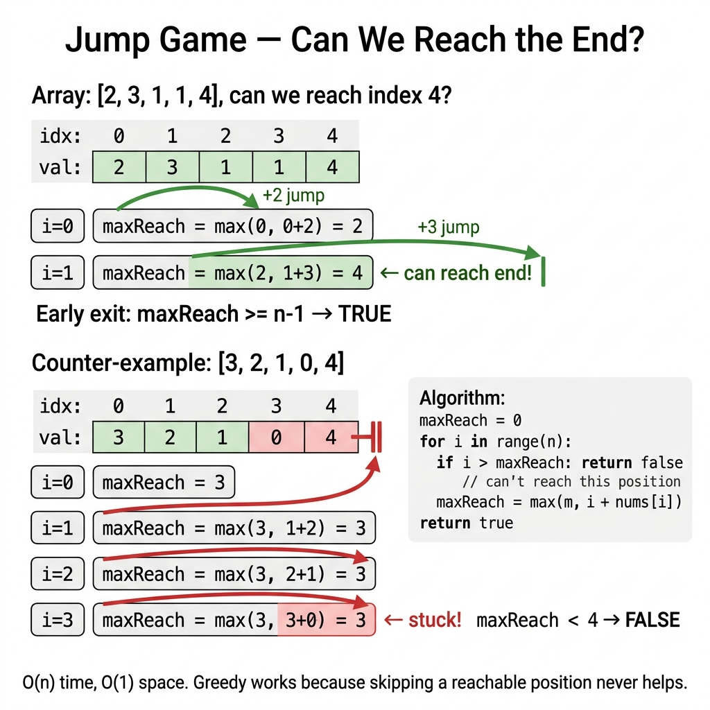

<!-- tags: dsa, algorithms -->
# 🦘 Jump Game & Greedy Reachability

> The Jump Game family is perfect for learning greedy logic. The local choice maintains a simple invariant. Backtracking or dynamic programming is unnecessary.

📅 Created: 2026-04-01 · 🔄 Updated: 2026-04-09 · ⏱️ 17 min read

| Aspect | Detail |
| ------ | ------ |
| **Complexity focus** | O(n) for Jump Game I / II / Gas Station / Candy |
| **Use case** | Reachability, interval cover, minimum jumps, feasible points |
| **Related** | Interval Scheduling, Kadane, Dynamic Programming |

---

## 1. DEFINE

<!-- [Beginner layer] -->

Jump Game often tricks readers into simulating every jump. That approach creates branching explosions. The real question is simpler. After scanning to the current position, what is your maximum reachable distance?

Viewing the problem through the `farthest` variable reveals it as a coverage problem. You do not track the exact path. You only check if the reachability frontier survives.

Core insight: **Many reachability problems do not reconstruct the path. Tracking the farthest reachable milestone is sufficient for a decision.**

| Variant | Question | Greedy invariant |
| ------- | -------- | ---------------- |
| Jump Game I | Can you reach the end? | `maxReach` tracks the farthest possible point |
| Jump Game II | Minimum steps to the end? | Tracks current window and next layer `farthest` |
| Gas Station | Where to start a full circuit? | Tracks global gain and the worst prefix |
| Candy | Min candies keeping rating order? | Uses left-to-right and right-to-left passes |

| Approach | Time | Space | When to pick |
| --- | --- | --- | --- |
| Jump Game I | O(n) | O(1) | Understand the core invariant first |
| Jump Game II | O(n) | O(1) | When the problem adds step constraints |
| Gas Station | O(n) | O(1) | Scale up and eliminate brute-force loops |
| Candy Distribution | O(n) | O(n) | Extend the pattern for complex cases |

### 1.1 Quick Identification

- The problem provides step lengths and asks for reachability or minimum steps.
- Each index expands coverage to `i + nums[i]`.
- Common variants involve `can reach?`, `minimum jumps`, or line coverage.

### 1.2 Invariants & Failure Modes

- When `i > farthest`, the game ends because you hit an unreachable zone.
- After processing a prefix, `farthest` must be the farthest valid reach from the start.
- Common failure mode: chasing the largest local jump instead of overall coverage. This fails on minimum jump variants.

## 2. VISUAL

Greedy logic causes misunderstandings if you only read the local choice description. The trace below shows how the local decision protects the future.

### Level 1 — Core intuition

```text
reachability: keep farthest index reachable so far
minimum jumps: each layer [start..end] expands next farthest
```

*Caption*: Level 1 shows the core intuition for reachability. Level 2 explains the state updates from input to output.

### Level 2 — Decision trace

- Order the sequence to expose the optimal global structure.
- After each choice, verify that the invariant remains intact.
- Ensure the current choice leaves the best future path open.
- The greedy algorithm succeeds if the invariant holds until the array ends.



## 3. CODE

Once you prove the local rule via an invariant or exchange argument, the code follows that rule tightly.

### Problem 1: Basic — Jump Game I

> **Goal**: Check if you can reach the final index without trying every jump path.
> **Approach**: Traverse left to right. If the index exceeds `maxReach`, the game is over. Otherwise, update `maxReach = max(maxReach, i + nums[i])`.
> **Example**: `[2,3,1,1,4] -> true`, `[3,2,1,0,4] -> false`.
> **Complexity**: O(n) time, O(1) space.

```go
// jump_game.go — Jump Game I: greedy max reach
package greedy

func CanJump(nums []int) bool {
    maxReach := 0
    for i, step := range nums {
        if i > maxReach {
            return false
        }
        if i+step > maxReach {
            maxReach = i + step
        }
        if maxReach >= len(nums)-1 {
            return true
        }
    }
    return true
}
```

```typescript
// jump_game.ts — Jump Game I: greedy max reach
export function canJump(nums: number[]): boolean {
  let maxReach = 0;
  for (let i = 0; i < nums.length; i++) {
    if (i > maxReach) return false;
    maxReach = Math.max(maxReach, i + nums[i]);
    if (maxReach >= nums.length - 1) return true;
  }
  return true;
}
```

```rust
// jump_game.rs — Jump Game I: greedy max reach
pub fn can_jump(nums: &[i32]) -> bool {
    let mut max_reach = 0usize;
    for (i, &step) in nums.iter().enumerate() {
        if i > max_reach {
            return false;
        }
        max_reach = max_reach.max(i + step as usize);
        if max_reach >= nums.len().saturating_sub(1) {
            return true;
        }
    }
    true
}
```

```cpp
// jump_game.cpp — Jump Game I: greedy max reach
bool canJump(const std::vector<int>& nums) {
    int maxReach = 0;
    for (int i = 0; i < (int)nums.size(); ++i) {
        if (i > maxReach) return false;
        maxReach = std::max(maxReach, i + nums[i]);
        if (maxReach >= (int)nums.size() - 1) return true;
    }
    return true;
}
```

```python
# jump_game.py — Jump Game I: greedy max reach
def can_jump(nums: list[int]) -> bool:
    max_reach = 0
    for i, step in enumerate(nums):
        if i > max_reach:
            return False
        max_reach = max(max_reach, i + step)
        if max_reach >= len(nums) - 1:
            return True
    return True
```

```java
// JumpGame.java — Jump Game I: greedy max reach
public final class JumpGame {
    private JumpGame() {}

    public static boolean canJump(int[] nums) {
        int maxReach = 0;
        for (int i = 0; i < nums.length; i++) {
            if (i > maxReach) return false;
            maxReach = Math.max(maxReach, i + nums[i]);
            if (maxReach >= nums.length - 1) return true;
        }
        return true;
    }
}
```

> **Why?** Jump Game I works because the local choice maintains a global reachability invariant. Once you prove the current boundary expands optimality, backtracking becomes useless.

> **Takeaway**: Basic Jump Game teaches the core reachability invariant. You only need the farthest boundary, not the exact traversal history.

### Problem 2: Intermediate — Jump Game II

> **Goal**: Find the minimum number of jumps instead of just reachability.
> **Approach**: Traverse like a layer-based BFS. `currentEnd` marks the current layer boundary. `farthest` marks the next layer boundary.
> **Example**: `[2,3,1,1,4] -> 2` because `0 -> 1 -> 4`.
> **Complexity**: O(n) time, O(1) space.

```go
// jump_game_ii.go — Jump Game II: greedy layer expansion
func Jump(nums []int) int {
    if len(nums) <= 1 {
        return 0
    }

    jumps := 0
    currentEnd := 0
    farthest := 0

    for i := 0; i < len(nums)-1; i++ {
        if i+nums[i] > farthest {
            farthest = i + nums[i]
        }
        if i == currentEnd {
            jumps++
            currentEnd = farthest
        }
    }

    return jumps
}
```

```typescript
// jump_game_ii.ts — Jump Game II: greedy layer expansion
export function jump(nums: number[]): number {
  if (nums.length <= 1) return 0;
  let jumps = 0, currentEnd = 0, farthest = 0;
  for (let i = 0; i < nums.length - 1; i++) {
    farthest = Math.max(farthest, i + nums[i]);
    if (i === currentEnd) { jumps++; currentEnd = farthest; }
  }
  return jumps;
}
```
```rust
// jump_game_ii.rs — Jump Game II: greedy layer expansion
pub fn jump(nums: &[i32]) -> i32 {
    if nums.len() <= 1 { return 0; }
    let (mut jumps, mut current_end, mut farthest) = (0, 0usize, 0usize);
    for i in 0..nums.len()-1 {
        farthest = farthest.max(i + nums[i] as usize);
        if i == current_end { jumps += 1; current_end = farthest; }
    }
    jumps
}
```
```cpp
// jump_game_ii.cpp — Jump Game II: greedy layer expansion
int jump(const std::vector<int>& nums) {
    if (nums.size() <= 1) return 0;
    int jumps = 0, currentEnd = 0, farthest = 0;
    for (int i = 0; i < (int)nums.size() - 1; ++i) {
        farthest = std::max(farthest, i + nums[i]);
        if (i == currentEnd) { ++jumps; currentEnd = farthest; }
    }
    return jumps;
}
```
```python
# jump_game_ii.py — Jump Game II: greedy layer expansion
def jump(nums: list[int]) -> int:
    if len(nums) <= 1:
        return 0
    jumps = current_end = farthest = 0
    for i in range(len(nums) - 1):
        farthest = max(farthest, i + nums[i])
        if i == current_end:
            jumps += 1
            current_end = farthest
    return jumps
```
```java
// JumpGameII.java — Jump Game II: greedy layer expansion
public static int jump(int[] nums) {
    if (nums.length <= 1) return 0;
    int jumps = 0, currentEnd = 0, farthest = 0;
    for (int i = 0; i < nums.length - 1; i++) {
        farthest = Math.max(farthest, i + nums[i]);
        if (i == currentEnd) { jumps++; currentEnd = farthest; }
    }
    return jumps;
}
```

> **Why?** Jump Game II works because layer-based BFS maintains the reachability invariant. Expanding the maximum boundary layer by layer eliminates unnecessary path checks.

> **Takeaway**: Jump Game II is essentially an implicit graph BFS. Each jump covers a new interval, acting as a level-order traversal without a queue.

### Problem 3: Advanced — Gas Station

> **Goal**: Find a starting point to complete a full circular route.
> **Approach**: A negative `gas - cost` total means no solution exists. A negative prefix at index `i` means any start in that segment fails. Reset the start to `i+1`.
> **Example**: `gas=[1,2,3,4,5], cost=[3,4,5,1,2] -> start=3`.
> **Complexity**: O(n) time, O(1) space.

```go
// gas_station.go — Gas Station: total feasibility + local reset
func CanCompleteCircuit(gas []int, cost []int) int {
    total := 0
    tank := 0
    start := 0

    for i := range gas {
        gain := gas[i] - cost[i]
        total += gain
        tank += gain
        if tank < 0 {
            start = i + 1
            tank = 0
        }
    }

    if total < 0 {
        return -1
    }
    return start
}
```

```typescript
// gas_station.ts — Gas Station: total feasibility + local reset
export function canCompleteCircuit(gas: number[], cost: number[]): number {
  let total = 0, tank = 0, start = 0;
  for (let i = 0; i < gas.length; i++) {
    const gain = gas[i] - cost[i];
    total += gain; tank += gain;
    if (tank < 0) { start = i + 1; tank = 0; }
  }
  return total < 0 ? -1 : start;
}
```
```rust
// gas_station.rs — Gas Station: total feasibility + local reset
pub fn can_complete_circuit(gas: &[i32], cost: &[i32]) -> i32 {
    let (mut total, mut tank, mut start) = (0, 0, 0);
    for i in 0..gas.len() {
        let gain = gas[i] - cost[i];
        total += gain; tank += gain;
        if tank < 0 { start = i as i32 + 1; tank = 0; }
    }
    if total < 0 { -1 } else { start }
}
```
```cpp
// gas_station.cpp — Gas Station: total feasibility + local reset
int canCompleteCircuit(const std::vector<int>& gas, const std::vector<int>& cost) {
    int total = 0, tank = 0, start = 0;
    for (int i = 0; i < (int)gas.size(); ++i) {
        int gain = gas[i] - cost[i];
        total += gain; tank += gain;
        if (tank < 0) { start = i + 1; tank = 0; }
    }
    return total < 0 ? -1 : start;
}
```
```python
# gas_station.py — Gas Station: total feasibility + local reset
def can_complete_circuit(gas: list[int], cost: list[int]) -> int:
    total = tank = start = 0
    for i, (g, c) in enumerate(zip(gas, cost)):
        gain = g - c
        total += gain
        tank += gain
        if tank < 0:
            start = i + 1
            tank = 0
    return -1 if total < 0 else start
```
```java
// GasStation.java — Gas Station: total feasibility + local reset
public static int canCompleteCircuit(int[] gas, int[] cost) {
    int total = 0, tank = 0, start = 0;
    for (int i = 0; i < gas.length; i++) {
        int gain = gas[i] - cost[i];
        total += gain; tank += gain;
        if (tank < 0) { start = i + 1; tank = 0; }
    }
    return total < 0 ? -1 : start;
}
```

> **Why?** Gas Station relies on a strict negative prefix rule. A negative fuel tank proves the entire previous path is useless, allowing a safe greedy reset.

> **Takeaway**: Resetting the start point is not a trick. It is a logical consequence of negative prefix sums in circular traversal logic.

### Problem 4: Expert — Candy Distribution

> **Goal**: Minimize the total candies while ensuring higher-rated children get more candies than their neighbors.
> **Approach**: Use a left-to-right pass for left constraints and a right-to-left pass for right constraints. Take the maximum at each position.
> **Example**: `[1,0,2] -> 5`, `[1,2,2] -> 4`.
> **Complexity**: O(n) time, O(n) space.

```go
// candy.go — Candy: two directional greedy passes
func Candy(ratings []int) int {
    n := len(ratings)
    candies := make([]int, n)
    for i := range candies {
        candies[i] = 1
    }

    for i := 1; i < n; i++ {
        if ratings[i] > ratings[i-1] {
            candies[i] = candies[i-1] + 1
        }
    }

    for i := n - 2; i >= 0; i-- {
        if ratings[i] > ratings[i+1] && candies[i] <= candies[i+1] {
            candies[i] = candies[i+1] + 1
        }
    }

    total := 0
    for _, candy := range candies {
        total += candy
    }
    return total
}
```

```typescript
// candy.ts — Candy: two directional greedy passes
export function candy(ratings: number[]): number {
  const candies = new Array<number>(ratings.length).fill(1);
  for (let i = 1; i < ratings.length; i++) {
    if (ratings[i] > ratings[i - 1]) candies[i] = candies[i - 1] + 1;
  }
  for (let i = ratings.length - 2; i >= 0; i--) {
    if (ratings[i] > ratings[i + 1] && candies[i] <= candies[i + 1]) {
      candies[i] = candies[i + 1] + 1;
    }
  }
  return candies.reduce((sum, value) => sum + value, 0);
}
```

```rust
// candy.rs — Candy: two directional greedy passes
pub fn candy(ratings: &[i32]) -> i32 {
    let mut candies = vec![1; ratings.len()];
    for i in 1..ratings.len() {
        if ratings[i] > ratings[i - 1] {
            candies[i] = candies[i - 1] + 1;
        }
    }
    for i in (0..ratings.len().saturating_sub(1)).rev() {
        if ratings[i] > ratings[i + 1] && candies[i] <= candies[i + 1] {
            candies[i] = candies[i + 1] + 1;
        }
    }
    candies.iter().sum()
}
```

```cpp
// candy.cpp — Candy: two directional greedy passes
int candy(const std::vector<int>& ratings) {
    std::vector<int> candies(ratings.size(), 1);
    for (int i = 1; i < (int)ratings.size(); ++i) {
        if (ratings[i] > ratings[i - 1]) candies[i] = candies[i - 1] + 1;
    }
    for (int i = (int)ratings.size() - 2; i >= 0; --i) {
        if (ratings[i] > ratings[i + 1] && candies[i] <= candies[i + 1]) {
            candies[i] = candies[i + 1] + 1;
        }
    }
    return std::accumulate(candies.begin(), candies.end(), 0);
}
```

```python
# candy.py — Candy: two directional greedy passes
def candy(ratings: list[int]) -> int:
    candies = [1] * len(ratings)
    for i in range(1, len(ratings)):
        if ratings[i] > ratings[i - 1]:
            candies[i] = candies[i - 1] + 1
    for i in range(len(ratings) - 2, -1, -1):
        if ratings[i] > ratings[i + 1] and candies[i] <= candies[i + 1]:
            candies[i] = candies[i + 1] + 1
    return sum(candies)
```

```java
// Candy.java — Candy: two directional greedy passes
public static int candy(int[] ratings) {
    int[] candies = new int[ratings.length];
    java.util.Arrays.fill(candies, 1);
    for (int i = 1; i < ratings.length; i++) {
        if (ratings[i] > ratings[i - 1]) candies[i] = candies[i - 1] + 1;
    }
    for (int i = ratings.length - 2; i >= 0; i--) {
        if (ratings[i] > ratings[i + 1] && candies[i] <= candies[i + 1]) {
            candies[i] = candies[i + 1] + 1;
        }
    }
    int total = 0;
    for (int value : candies) total += value;
    return total;
}
```

> **Why?** Candy distribution satisfies both neighbors optimally. You verify constraints in two directions and merge them via a maximum operation.

> **Takeaway**: Candy is an expert greedy problem because local optimism is insufficient. You must scan bidirectionally to uphold multiple constraints simultaneously.

## 4. PITFALLS

Greedy algorithms fail fastest when you select a reasonable option without proving its future safety.

| # | Severity | Error | Impact | Fix |
| --- | --- | --- | --- | --- |
| 1 | 🔴 Fatal | Using DP or DFS brute-force | Avoidable O(n²) time | Track `maxReach` instead |
| 2 | 🟡 Common | Jumping immediately to the farthest point | Incorrect jump counts | Think in `currentEnd` layers |
| 3 | 🟡 Common | Checking only positive local gains | Picking wrong starts | Use `total` and prefix resets |
| 4 | 🔵 Minor | Scanning Candy one way | Violates reverse rules | Always use two passes |
| 5 | 🔵 Minor | Missing greedy proofs | Creating unreliable hacks | Define the clear invariant |

## 5. REF

| Resource | Link |
| -------- | ---- |
| LeetCode 55 — Jump Game | https://leetcode.com/problems/jump-game/ |
| LeetCode 45 — Jump Game II | https://leetcode.com/problems/jump-game-ii/ |
| LeetCode 134 — Gas Station | https://leetcode.com/problems/gas-station/ |
| LeetCode 135 — Candy | https://leetcode.com/problems/candy/ |

## 6. RECOMMEND

Once you grasp the greedy approach, distinguish it from DP or binary search on similar problems.

| Extension | When to use | Reason |
| --------- | ----------- | ------ |
| Interval Scheduling | Greedy on "sort and pick" | Expands greedy intuition |
| Prefix Sum | Relying on cumulative feasibility | Solidifies reasoning like Gas Station |
| DP Alternative | The greedy rule fails | Separates DP from greedy logic |

## 7. QUICK REFERENCE

| Problem | Invariant | Answer |
| ------- | --------- | ------ |
| Jump Game I | `maxReach` | `maxReach >= lastIndex` |
| Jump Game II | `currentEnd`, `farthest` | Jump count layers |
| Gas Station | `total`, `tank`, `start` | Valid start index or `-1` |
| Candy | Bidirectional monotonic rules | Minimum sum array |

---

**Links**: [← Previous](./03-lis.md) · → Next

---

Return to the opening question: why is a forward scan sufficient? The reachability frontier only increases. If you reach position i, you can reach all prior positions. Skipping reachable points never helps, making backtracking useless.
