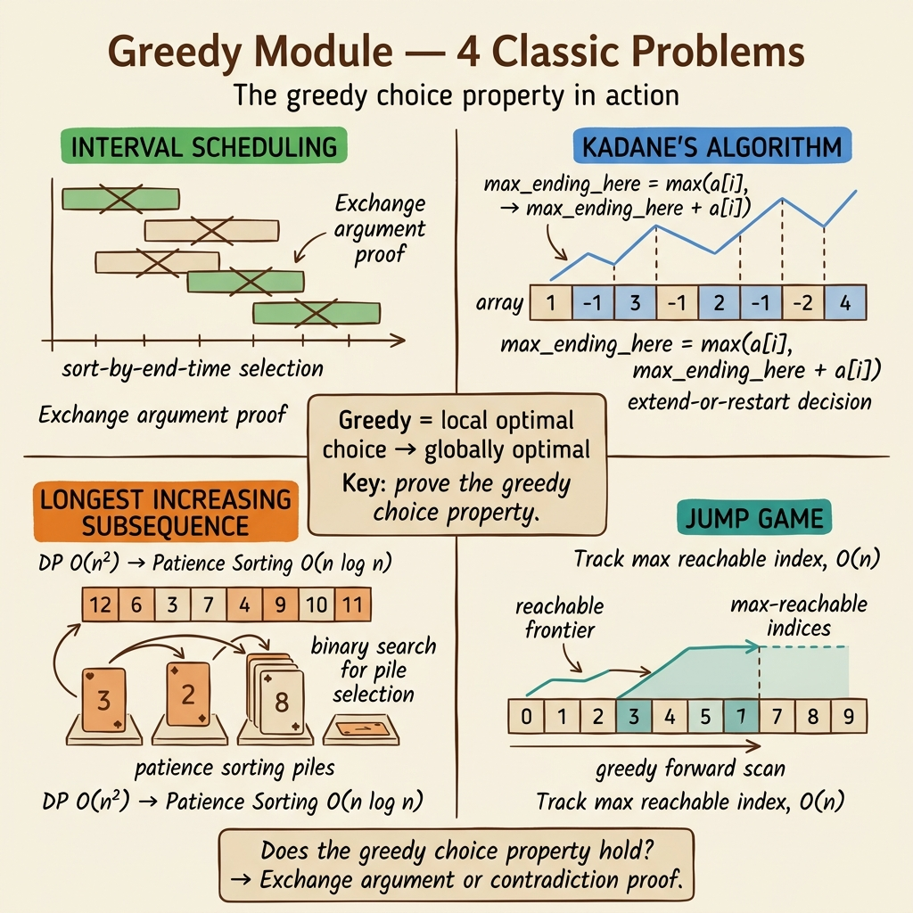

<!-- tags: dsa, algorithms, greedy, overview -->
# Greedy — Local Decisions With Global Discipline

> Greedy is appealing because it is short. This brevity is reliable only when the local choice maintains a global invariant. This module forces you to prove that invariant instead of trusting intuition.

📅 Created: 2026-04-04 · 🔄 Updated: 2026-04-09 · ⏱️ 8 min read

| Aspect | Detail |
| ------ | ------ |
| **Focus** | Reachability, interval picking, best-so-far, local choice proofs |
| **Core danger** | A sample passes but a counterexample breaks it due to missing invariants |
| **Best use** | When you suspect backtracking is unnecessary if you track the right quantity |

---

## 1. DEFINE

Imagine reading a problem and jumping to familiar approaches. With greedy algorithms, the value lies in locking the right pattern and knowing why other paths fail.

Developers misunderstand greedy algorithms in two ways. First, they say "just pick the best current option", which sounds correct but means nothing. Second, they say "if greedy seems reasonable, it probably works". Both miss the hardest part. You must know which local choice is valid and why it preserves future optimality.

Interval Scheduling, Kadane, LIS, and Jump Game represent four distinct greedy flavors. One picks the earliest ending activity. One keeps the best-so-far sum. One uses tails to promise subsequences. One tracks the farthest reach. They do not share the same invariant.

This hub treats greedy as a discipline. You identify the quantity to maintain, prove its local update is sufficient, and then enjoy the concise code.

### Problems in this module
| Problem | Local choice | Invariant | Link |
| --- | --- | --- | --- |
| Interval Scheduling | Pick earliest compatible ending interval | Always keeps maximum room for the future | [01-interval-scheduling.md](./01-interval-scheduling.md) |
| Kadane | Keep best subarray ending here | Bad negative prefixes drop at the right time | [02-kadane.md](./02-kadane.md) |
| LIS | Maintain smallest possible tails | Each subsequence length has the best current tail | [03-lis.md](./03-lis.md) |
| Jump Game | Keep farthest reach or layer frontier | Local updates still expand the optimal future | [04-jump-game.md](./04-jump-game.md) |

## 2. VISUAL

Greedy is not a single trick. The image below shows four distinct greedy flavors, each maintaining a different invariant under the shared spirit of "no backtracking if the local choice is strong enough".



*Image: Four greedy algorithms, four different quantities to maintain. Interval Scheduling picks earliest endings, Kadane tracks best-so-far prefix sums, LIS maintains smallest tails, and Jump Game expands the farthest reachable frontier.*

```text
Greedy candidate
  |
  +-- pick interval to save room?       -> Interval Scheduling
  +-- keep best-so-far on prefix?       -> Kadane
  +-- compress subsequence promise?     -> LIS
  +-- track farthest reach or frontier? -> Jump Game
```
*Figure: Text fallback — the key question is not "can I use greedy?" but "which quantity requires greedy updates?".*

## 3. CODE

You should read these from the most visible greedy proof to more subtle invariants.

| Order | File | Reason | Point to prove |
| --- | --- | --- | --- |
| 1 | [01-interval-scheduling.md](./01-interval-scheduling.md) | Exchange argument is easy to observe | Why picking the earliest end preserves optimality |
| 2 | [02-kadane.md](./02-kadane.md) | Best-so-far on prefix | When to drop a negative prefix completely |
| 3 | [04-jump-game.md](./04-jump-game.md) | Reachability and layer frontier | Why farthest reach holds enough information |
| 4 | [03-lis.md](./03-lis.md) | Advanced greedy with binary search | What the tails array represents |

## 4. PITFALLS

Greedy fails fastest when you pick a reasonable option without proving its future safety.

| Pitfall | Sign | Why it fails | Fix | Severity |
| ------- | ---- | ------------ | --- | -------- |
| Trusting intuition | Assuming no counterexample means a proof | Greedy fails elegantly on small samples | Write the invariant or exchange argument | high |
| Using one proof everywhere | Explaining with "leaves more choices" | Each greedy problem has a distinct proof | Link the proof to the updated quantity | high |
| Confusing greedy with DP | Calling it greedy due to few states | Some problems need strict state transitions | Check if local choices suffice without deep history | medium |
| Misunderstanding tails | Treating tails as the actual subsequence | It is a representative structure | Read the tails definition before optimizing | medium |

## 5. REF

- Module files: [01-interval-scheduling.md](./01-interval-scheduling.md) to [04-jump-game.md](./04-jump-game.md)
- DP comparison lane: [../dynamic-programming/README.md](../dynamic-programming/README.md)
- Binary search support for LIS: [../patterns/binary-search/README.md](../patterns/binary-search/README.md)

## 6. RECOMMEND

After this module, you should demand proofs for every local choice instead of memorizing problems.

- If greedy relies on a monotone predicate or tails, check [../patterns/binary-search/README.md](../patterns/binary-search/README.md).
- If the optimal solution needs more history than the invariant allows, return to [../dynamic-programming/README.md](../dynamic-programming/README.md).
- If the problem mixes intervals and sorting, proceed to [../sorting/README.md](../sorting/README.md).

## 7. QUICK REF

- Greedy succeeds due to invariants, not intuition.
- Every local choice requires a specific proof.
- If you cannot prove it, switch to DP or search.
