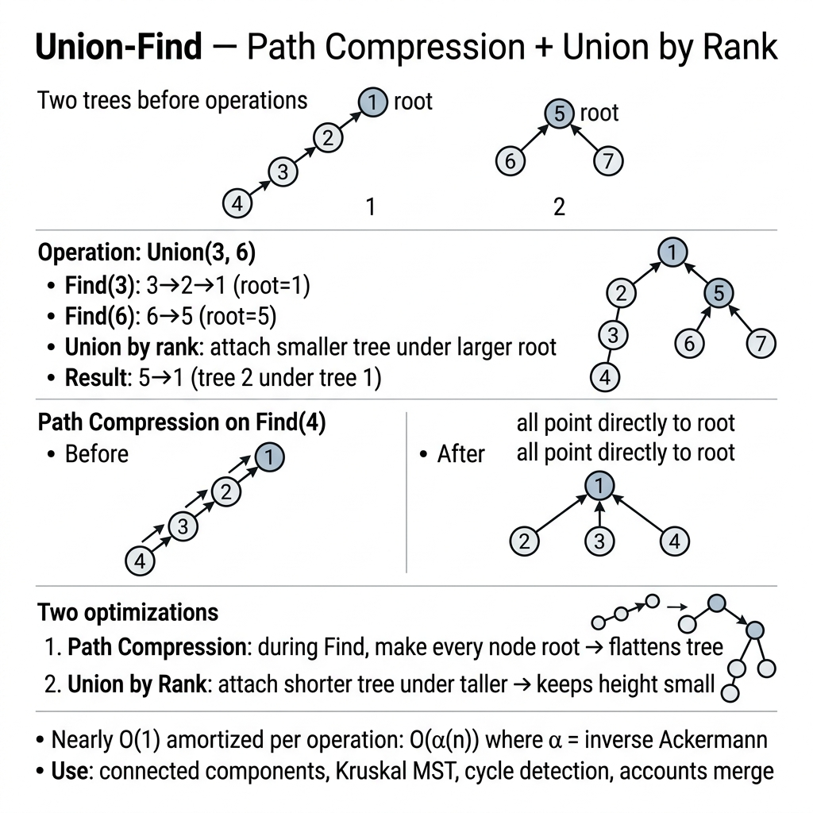

<!-- tags: dsa, algorithms -->
# 🌲 Union-Find (Disjoint Set Union — DSU)

> **Category**: Data Structure, Near O(1) amortized
> **Summary**: Manage disjoint sets with Union and Find operations.

📅 Created: 2026-03-20 · 🔄 Updated: 2026-04-09 · ⏱️ 15 min read

---

## 1. DEFINE

Some problems do not need exact paths between nodes. They only need to know if two nodes share the same component. `Union-Find` serves this exact need. It merges sets and queries representatives cheaply.

DSU protects connectivity invariants for larger problems like Kruskal or dynamic connectivity. It represents each component with a stable root.

Core insight: **DSU represents each component with a stable root to merge and check sets without graph traversal.**

| Metric            | Value                            |
| ----------------- | -------------------------------- |
| **Union**         | O(α(n)) ≈ O(1) amortized         |
| **Find**          | O(α(n)) ≈ O(1) amortized         |
| **Space**         | O(n)                             |
| **Optimizations** | Path compression + Union by rank |

α(n) is the inverse Ackermann function. It grows extremely slowly (α(2^65536) = 5).

### Use cases

- **Kruskal MST** — check cycles.
- **Connected components** — network connectivity.
- **Accounts merge** — group overlapping emails.
- **Image segmentation** — connected pixels.

---

| Variant | When To Use | Core Idea |
| ------- | ------- | ------- |
| Full Union-Find | Need a trace-friendly baseline | Grasp the core invariant before optimizing |
| Weighted Union-Find | Problem adds state or constraints | Keep the invariant but add state or cache |
| Network Connectivity | Large inputs or clear optimization | Optimize via pruning or state compression |
| Accounts Merge | Production-grade abstraction | Combine techniques for complex edge cases |

| Approach | Time | Space | When To Choose |
| --- | --- | --- | --- |
| Full Union-Find | O(1) | Varies | Understand the invariant before optimization |
| Weighted Union-Find | O(n) | O(log n) | Problem has moderate constraints |
| Network Connectivity | Varies | Varies | Better scale or brute-force elimination |
| Accounts Merge | Varies | Varies | Expand pattern for hard cases |

### 1.1 Quick Recognition

- The problem repeats connectivity queries or merges.
- The problem needs cycle prevention during edge addition.
- The graph changes via component mergers without shortest path needs.
- Union by rank and path compression are default optimizations.

### 1.2 Invariants & Failure Modes

- `find(x)` must return the final representative of the component containing `x`.
- Union changes state only when two nodes have different roots.
- Common failure mode: coding path compression without understanding how it keeps the parent forest consistent.

## 2. VISUAL

These foundational algorithms become clear when you see the state updates. This trace illuminates that process.

### Level 1 — Core intuition

```text
  Union(1,2): {1,2}  {3}  {4,5}
  Union(3,4): {1,2}  {3,4,5}
  Union(2,4): {1,2,3,4,5}

  Path compression before:     After Find(5):
       1                          1
      / \                      / | \ \
     2   3                    2  3  4  5
         |
         4
         |
         5
```

---

*Caption*: 🌲 Union-Find at Level 1 shows core intuition. Level 2 details the state update order from input to answer.

### Level 2 — Decision trace

- Identify the core data structure or state primitive.
- Each update step must reduce search space or merge components.
- Keep boundary checks and rollbacks near the update for simpler reasoning.
- Correct results appear when auxiliary state reflects the original problem structure.




## 3. CODE

Code should highlight the state structure and update rules. Do not hide them behind early optimizations.

### Problem 1: Basic — Full Union-Find
> **Goal**: Implement the core data structure.
> **Approach**: Start with the core version. Move to practical variants to see the reusable invariant.
> **Example**: A small input allows manual tracing before composition.
> **Complexity**: O(α(n)) time and O(n) space.

```go
package algo

type UnionFind struct {
    parent []int
    rank   []int
    count  int // number of components
}

func NewUnionFind(n int) *UnionFind {
    p := make([]int, n)
    for i := range p { p[i] = i }
    return &UnionFind{parent: p, rank: make([]int, n), count: n}
}

// Find with path compression — near O(1)
func (uf *UnionFind) Find(x int) int {
    if uf.parent[x] != x {
        uf.parent[x] = uf.Find(uf.parent[x])
    }
    return uf.parent[x]
}

// Union by rank — near O(1)
func (uf *UnionFind) Union(x, y int) bool {
    rx, ry := uf.Find(x), uf.Find(y)
    if rx == ry { return false }

    if uf.rank[rx] < uf.rank[ry] { rx, ry = ry, rx }
    uf.parent[ry] = rx
    if uf.rank[rx] == uf.rank[ry] { uf.rank[rx]++ }
    uf.count--
    return true
}

func (uf *UnionFind) Connected(x, y int) bool {
    return uf.Find(x) == uf.Find(y)
}

func (uf *UnionFind) Components() int { return uf.count }
```

```typescript
class UnionFind {
    parent: number[]; rank: number[]; count: number;
    constructor(n: number) {
        this.parent = Array.from({length:n},(_,i)=>i); this.rank = Array(n).fill(0); this.count = n;
    }
    find(x: number): number { if (this.parent[x]!==x) this.parent[x]=this.find(this.parent[x]); return this.parent[x]; }
    union(x: number, y: number): boolean {
        let [rx,ry] = [this.find(x),this.find(y)]; if (rx===ry) return false;
        if (this.rank[rx]<this.rank[ry]) [rx,ry]=[ry,rx];
        this.parent[ry]=rx; if (this.rank[rx]===this.rank[ry]) this.rank[rx]++; this.count--; return true;
    }
    connected(x: number, y: number): boolean { return this.find(x)===this.find(y); }
}
```

```rust
struct UnionFind { parent: Vec<usize>, rank: Vec<usize>, count: usize }
impl UnionFind {
    fn new(n: usize) -> Self { Self { parent: (0..n).collect(), rank: vec![0;n], count: n } }
    fn find(&mut self, x: usize) -> usize {
        if self.parent[x] != x { self.parent[x] = self.find(self.parent[x]); }
        self.parent[x]
    }
    fn union(&mut self, x: usize, y: usize) -> bool {
        let (mut rx, mut ry) = (self.find(x), self.find(y)); if rx==ry { return false; }
        if self.rank[rx]<self.rank[ry] { std::mem::swap(&mut rx,&mut ry); }
        self.parent[ry]=rx; if self.rank[rx]==self.rank[ry] { self.rank[rx]+=1; } self.count-=1; true
    }
}
```

```cpp
class UnionFind {
    std::vector<int> parent, rank_;
    int count;
public:
    UnionFind(int n): parent(n), rank_(n,0), count(n) { std::iota(parent.begin(),parent.end(),0); }
    int find(int x) { return parent[x]==x ? x : parent[x]=find(parent[x]); }
    bool unite(int x, int y) {
        int rx=find(x), ry=find(y); if (rx==ry) return false;
        if (rank_[rx]<rank_[ry]) std::swap(rx,ry);
        parent[ry]=rx; if (rank_[rx]==rank_[ry]) rank_[rx]++; count--; return true;
    }
    bool connected(int x, int y) { return find(x)==find(y); }
    int components() { return count; }
};
```

```python
class UnionFind:
    def __init__(self, n: int):
        self.parent = list(range(n)); self.rank = [0]*n; self.count = n
    def find(self, x: int) -> int:
        if self.parent[x] != x: self.parent[x] = self.find(self.parent[x])
        return self.parent[x]
    def union(self, x: int, y: int) -> bool:
        rx, ry = self.find(x), self.find(y)
        if rx == ry: return False
        if self.rank[rx] < self.rank[ry]: rx, ry = ry, rx
        self.parent[ry] = rx
        if self.rank[rx] == self.rank[ry]: self.rank[rx] += 1
        self.count -= 1; return True
    def connected(self, x: int, y: int) -> bool: return self.find(x) == self.find(y)
```

> **Why?** Full Union-Find reduces search space, merges states, and increases match levels. The auxiliary structure invariant ensures correctness.

> **Takeaway**: Path compression and union by rank provide optimal amortized complexity.

### Problem 2: Intermediate — Weighted Union-Find
> **Goal**: Track component sizes.
> **Approach**: Use an array to track size and attach smaller trees to larger ones.
> **Example**: A small input allows manual tracing.
> **Complexity**: O(α(n)) time and O(n) space.

```go
package algo

// WeightedUF tracks component sizes.
type WeightedUF struct {
    parent []int
    size   []int
    count  int
}

func NewWeightedUF(n int) *WeightedUF {
    p := make([]int, n)
    s := make([]int, n)
    for i := range p { p[i] = i; s[i] = 1 }
    return &WeightedUF{p, s, n}
}

func (uf *WeightedUF) Find(x int) int {
    root := x
    for root != uf.parent[root] { root = uf.parent[root] }
    for x != root { // path compression
        next := uf.parent[x]
        uf.parent[x] = root
        x = next
    }
    return root
}

// Union by size: attach smaller tree to larger
func (uf *WeightedUF) Union(x, y int) bool {
    rx, ry := uf.Find(x), uf.Find(y)
    if rx == ry { return false }
    if uf.size[rx] < uf.size[ry] { rx, ry = ry, rx }
    uf.parent[ry] = rx
    uf.size[rx] += uf.size[ry]
    uf.count--
    return true
}

// ComponentSize returns the size of x's component.
func (uf *WeightedUF) ComponentSize(x int) int {
    return uf.size[uf.Find(x)]
}
```

```typescript
class WeightedUF {
    parent: number[]; size: number[]; count: number;
    constructor(n: number) {
        this.parent = Array.from({length:n},(_,i)=>i); this.size = Array(n).fill(1); this.count = n;
    }
    find(x: number): number {
        let root = x; while (root !== this.parent[root]) root = this.parent[root];
        while (x !== root) { const next = this.parent[x]; this.parent[x] = root; x = next; }
        return root;
    }
    union(x: number, y: number): boolean {
        let [rx,ry] = [this.find(x),this.find(y)]; if (rx===ry) return false;
        if (this.size[rx]<this.size[ry]) [rx,ry]=[ry,rx];
        this.parent[ry]=rx; this.size[rx]+=this.size[ry]; this.count--; return true;
    }
}
```

```rust
struct WeightedUF { parent: Vec<usize>, sz: Vec<usize>, count: usize }
impl WeightedUF {
    fn new(n: usize) -> Self { Self { parent: (0..n).collect(), sz: vec![1;n], count: n } }
    fn find(&mut self, mut x: usize) -> usize {
        let mut root = x; while root != self.parent[root] { root = self.parent[root]; }
        while x != root { let next = self.parent[x]; self.parent[x] = root; x = next; }
        root
    }
    fn union(&mut self, x: usize, y: usize) -> bool {
        let (mut rx, mut ry) = (self.find(x), self.find(y)); if rx==ry { return false; }
        if self.sz[rx]<self.sz[ry] { std::mem::swap(&mut rx,&mut ry); }
        self.parent[ry]=rx; self.sz[rx]+=self.sz[ry]; self.count-=1; true
    }
}
```

```cpp
class WeightedUF {
    std::vector<int> parent, sz; int count;
public:
    WeightedUF(int n): parent(n), sz(n,1), count(n) { std::iota(parent.begin(),parent.end(),0); }
    int find(int x) { int r=x; while(r!=parent[r])r=parent[r]; while(x!=r){int t=parent[x];parent[x]=r;x=t;} return r; }
    bool unite(int x, int y) {
        int rx=find(x),ry=find(y); if(rx==ry)return false;
        if(sz[rx]<sz[ry])std::swap(rx,ry); parent[ry]=rx; sz[rx]+=sz[ry]; count--; return true;
    }
};
```

```python
class WeightedUF:
    def __init__(self, n: int):
        self.parent = list(range(n)); self.size = [1]*n; self.count = n
    def find(self, x: int) -> int:
        root = x
        while root != self.parent[root]: root = self.parent[root]
        while x != root: self.parent[x], x = root, self.parent[x]
        return root
    def union(self, x: int, y: int) -> bool:
        rx, ry = self.find(x), self.find(y)
        if rx == ry: return False
        if self.size[rx] < self.size[ry]: rx, ry = ry, rx
        self.parent[ry] = rx; self.size[rx] += self.size[ry]; self.count -= 1; return True
```

> **Why?** Weighted Union-Find solves problems requiring component size tracking while maintaining optimal connectivity performance.

> **Takeaway**: Replacing rank with size adds utility without compromising the core invariant.

### Problem 3: Advanced — Network Connectivity
> **Goal**: Evaluate network components.
> **Approach**: Connect computers sequentially and query paths.
> **Example**: Small graph tracing validates components.
> **Complexity**: O(α(n)) time per operation.

```go
package algo

import "fmt"

func ExampleNetworkConnectivity() {
    n := 10 // 10 computers
    uf := NewUnionFind(n)

    connections := [][2]int{
        {0, 1}, {1, 2}, {3, 4}, {5, 6},
        {6, 7}, {7, 8}, {8, 9},
    }
    for _, c := range connections {
        uf.Union(c[0], c[1])
    }

    fmt.Println("Components:", uf.Components()) // 3
    fmt.Println("0-2 connected:", uf.Connected(0, 2)) // true
    fmt.Println("0-3 connected:", uf.Connected(0, 3)) // false

    // Merge networks
    uf.Union(2, 3)
    fmt.Println("After merge: 0-4 connected:", uf.Connected(0, 4)) // true
}
```

```typescript
// Example: 10 computers, connecting some
const uf = new UnionFind(10);
for (const [a,b] of [[0,1],[1,2],[3,4],[5,6],[6,7],[7,8],[8,9]]) uf.union(a,b);
console.log('Components:', uf.count);       // 3
console.log('0-2:', uf.connected(0, 2));     // true
console.log('0-3:', uf.connected(0, 3));     // false
uf.union(2, 3);
console.log('After merge 0-4:', uf.connected(0, 4)); // true
```

```rust
fn example_network() {
    let mut uf = UnionFind::new(10);
    for (a, b) in [(0,1),(1,2),(3,4),(5,6),(6,7),(7,8),(8,9)] { uf.union(a, b); }
    println!("Components: {}", uf.count);       // 3
    println!("0-2: {}", uf.find(0)==uf.find(2)); // true
    uf.union(2, 3);
    println!("After merge 0-4: {}", uf.find(0)==uf.find(4)); // true
}
```

```cpp
void exampleNetwork() {
    UnionFind uf(10);
    for (auto [a,b] : std::vector<std::pair<int,int>>{{0,1},{1,2},{3,4},{5,6},{6,7},{7,8},{8,9}}) uf.unite(a,b);
    std::cout << "Components: " << uf.components() << "\n"; // 3
    std::cout << "0-2: " << uf.connected(0,2) << "\n";      // 1
    uf.unite(2, 3);
    std::cout << "After merge 0-4: " << uf.connected(0,4) << "\n"; // 1
}
```

```python
uf = UnionFind(10)
for a, b in [(0,1),(1,2),(3,4),(5,6),(6,7),(7,8),(8,9)]: uf.union(a, b)
print('Components:', uf.count)       # 3
print('0-2:', uf.connected(0, 2))     # True
uf.union(2, 3)
print('After merge 0-4:', uf.connected(0, 4))  # True
```

> **Why?** This formulation maps directly to practical connectivity problems. The invariant holds under varied edge additions.

> **Takeaway**: Use DSU to resolve incremental network connections efficiently.

### Problem 4: Expert — Accounts Merge
> **Goal**: Merge user accounts sharing emails.
> **Approach**: Map emails to indices and union them.
> **Example**: Shared emails group disparate entries.
> **Complexity**: O(E log E) due to email sorting.

```go
package algo

import "sort"

// AccountsMerge groups accounts by shared emails.
// Input: [["John","a@b.com","b@c.com"], ["John","b@c.com","c@d.com"]]
// Output: [["John","a@b.com","b@c.com","c@d.com"]]
func AccountsMerge(accounts [][]string) [][]string {
    emailToID := make(map[string]int)
    emailToName := make(map[string]string)
    id := 0

    for _, acc := range accounts {
        name := acc[0]
        for _, email := range acc[1:] {
            if _, ok := emailToID[email]; !ok {
                emailToID[email] = id
                id++
            }
            emailToName[email] = name
        }
    }

    uf := NewUnionFind(id)
    for _, acc := range accounts {
        firstID := emailToID[acc[1]]
        for _, email := range acc[2:] {
            uf.Union(firstID, emailToID[email])
        }
    }

    // Group emails by root
    groups := make(map[int][]string)
    for email, eid := range emailToID {
        root := uf.Find(eid)
        groups[root] = append(groups[root], email)
    }

    var result [][]string
    for _, emails := range groups {
        sort.Strings(emails)
        name := emailToName[emails[0]]
        result = append(result, append([]string{name}, emails...))
    }
    return result
}
```

```typescript
function accountsMerge(accounts: string[][]): string[][] {
    const emailToId = new Map<string,number>(), emailToName = new Map<string,string>();
    let id = 0;
    for (const acc of accounts) { const name = acc[0];
        for (const email of acc.slice(1)) { if (!emailToId.has(email)) { emailToId.set(email,id++); } emailToName.set(email,name); }
    }
    const uf = new UnionFind(id);
    for (const acc of accounts) { const fid = emailToId.get(acc[1])!;
        for (const email of acc.slice(2)) uf.union(fid, emailToId.get(email)!);
    }
    const groups = new Map<number,string[]>();
    for (const [email, eid] of emailToId) {
        const root = uf.find(eid); if (!groups.has(root)) groups.set(root,[]);
        groups.get(root)!.push(email);
    }
    return [...groups.values()].map(emails => { emails.sort(); return [emailToName.get(emails[0])!, ...emails]; });
}
```
```rust
use std::collections::HashMap;

fn accounts_merge(accounts: Vec<Vec<String>>) -> Vec<Vec<String>> {
    let mut email_to_id: HashMap<String, usize> = HashMap::new();
    let mut email_to_name: HashMap<String, String> = HashMap::new();
    let mut next_id = 0usize;

    for acc in &accounts {
        let name = acc[0].clone();
        for email in &acc[1..] {
            email_to_id.entry(email.clone()).or_insert_with(|| {
                let id = next_id;
                next_id += 1;
                id
            });
            email_to_name.insert(email.clone(), name.clone());
        }
    }

    let mut uf = UnionFind::new(next_id);
    for acc in &accounts {
        let first_id = email_to_id[&acc[1]];
        for email in &acc[2..] {
            uf.union(first_id, email_to_id[email]);
        }
    }

    let mut groups: HashMap<usize, Vec<String>> = HashMap::new();
    for (email, &id) in &email_to_id {
        groups.entry(uf.find(id)).or_default().push(email.clone());
    }

    groups
        .into_values()
        .map(|mut emails| {
            emails.sort();
            let mut merged = vec![email_to_name[&emails[0]].clone()];
            merged.extend(emails);
            merged
        })
        .collect()
}
```
```cpp
#include <algorithm>
#include <string>
#include <unordered_map>
#include <vector>

std::vector<std::vector<std::string>> accountsMerge(const std::vector<std::vector<std::string>>& accounts) {
    std::unordered_map<std::string, int> emailToId;
    std::unordered_map<std::string, std::string> emailToName;
    int nextId = 0;

    for (const auto& acc : accounts) {
        for (size_t i = 1; i < acc.size(); ++i) {
            if (!emailToId.count(acc[i])) emailToId[acc[i]] = nextId++;
            emailToName[acc[i]] = acc[0];
        }
    }

    UnionFind uf(nextId);
    for (const auto& acc : accounts) {
        int firstId = emailToId[acc[1]];
        for (size_t i = 2; i < acc.size(); ++i) {
            uf.unite(firstId, emailToId[acc[i]]);
        }
    }

    std::unordered_map<int, std::vector<std::string>> groups;
    for (const auto& [email, id] : emailToId) {
        groups[uf.find(id)].push_back(email);
    }

    std::vector<std::vector<std::string>> result;
    for (auto& [_, emails] : groups) {
        std::sort(emails.begin(), emails.end());
        std::vector<std::string> merged{emailToName[emails[0]]};
        merged.insert(merged.end(), emails.begin(), emails.end());
        result.push_back(std::move(merged));
    }
    return result;
}
```

```python
def accounts_merge(accounts: list[list[str]]) -> list[list[str]]:
    email_to_id, email_to_name, idx = {}, {}, 0
    for acc in accounts:
        name = acc[0]
        for email in acc[1:]:
            if email not in email_to_id: email_to_id[email] = idx; idx += 1
            email_to_name[email] = name
    uf = UnionFind(idx)
    for acc in accounts:
        fid = email_to_id[acc[1]]
        for email in acc[2:]: uf.union(fid, email_to_id[email])
    groups: dict[int, list[str]] = {}
    for email, eid in email_to_id.items():
        root = uf.find(eid); groups.setdefault(root, []).append(email)
    return [[email_to_name[emails[0]]] + sorted(emails) for emails in groups.values()]
```

> **Why?** Real-world DSU maps external identities to integer sets. It combines graph theory with data transformation.

> **Takeaway**: Use maps to assign DSU indices to arbitrary identifiers.

---

## 4. PITFALLS

Foundation algorithms break when developers misuse the invariant that the structure protects.

| # | Severity | Defect | Consequence | Fix |
| --- | --- | --- | --- | --- |
| 1 | 🔴 Fatal | No path compression | O(n) worst case | Always implement compression |
| 2 | 🟡 Common | No rank/size array | Degenerate trees form | Use union by rank or size |
| 3 | 🟡 Common | Forget `rx == ry` check | Logic errors | Return false for same sets |
| 4 | 🔵 Minor | Concurrent access issues | Race conditions | Wrap with `sync.Mutex` |
| 5 | 🔵 Minor | Index out of bounds | Panics | Validate input ranges |

---

## 5. REF

| Resource                | Link                                                                                   |
| ----------------------- | -------------------------------------------------------------------------------------- |
| CP-Algorithms DSU       | [cp-algorithms.com](https://cp-algorithms.com/data_structures/disjoint_set_union.html) |
| Visualgo                | [visualgo.net/ufds](https://visualgo.net/en/ufds)                                      |
| Wikipedia               | [en.wikipedia.org](https://en.wikipedia.org/wiki/Disjoint-set_data_structure)          |
| LeetCode Accounts Merge | [leetcode.com/problems/accounts-merge](https://leetcode.com/problems/accounts-merge/)  |

---

## 6. RECOMMEND

When you grasp this primitive, connect it to larger problems where it serves as a piece.

| Extension              | When To Use              | Reason                       |
| ---------------------- | ------------------------ | ---------------------------- |
| **Path Compression**   | Always use               | Amortized O(α(n))            |
| **Union by Rank/Size** | Always use               | Prevent degenerate trees     |
| **Weighted DSU**       | Track component metadata | Size, min, max per component |
| **Rollback DSU**       | Offline queries          | Undo union operations        |
| **Persistent DSU**     | Historical queries       | Query component at time T    |

---

## 7. QUICK REF

| # | Pattern | Code |
|---|---------|------|
| 1 | Init | `parent := make([]int, n); for i := range parent { parent[i] = i }; rank := make([]int, n)` |
| 2 | Find | `func find(x int) int { if parent[x]!=x { parent[x]=find(parent[x]) }; return parent[x] }` |
| 3 | Union by rank | `func union(x,y int) { px,py := find(x),find(y); if px==py { return }; if rank[px]<rank[py] { px,py=py,px }; parent[py]=px; if rank[px]==rank[py] { rank[px]++ } }` |
| 4 | Connected | `find(x) == find(y)` |
| 5 | Component count | `count--  // decrement on each successful union` |
| 6 | Complexity | `// O(α(n)) ≈ O(1) amortized per operation` |
| 7 | When to use | `// Kruskal MST, connected components, undirected cycle detection` |

**Links**: [← README](./README.md) · [→ KMP](./02-kmp.md) · [← Kruskal](../graph/04-kruskal.md)

---

Why is Union-Find nearly O(1) per operation? Path compression flattens the tree. Union by rank keeps the height low. Both optimizations combined yield amortized O(α(n)). This is practically less than 4 for any real value.
