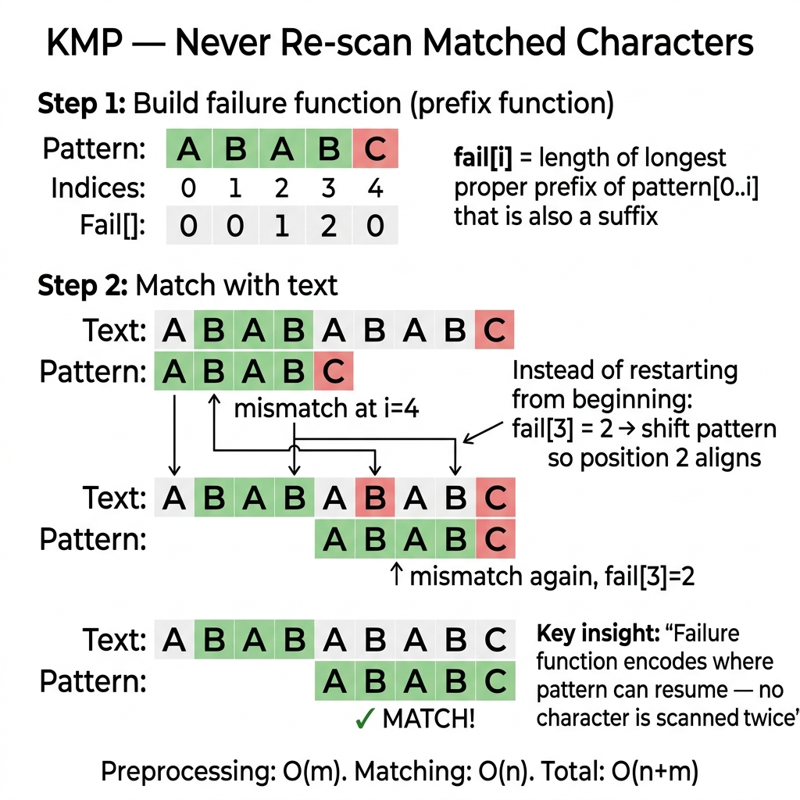

<!-- tags: dsa, algorithms -->
# 🔤 KMP — Knuth-Morris-Pratt

> **Category**: String Pattern Matching
> **Summary**: O(n+m) string matching. Precompute failure function to never backtrack the text pointer.

📅 Created: 2026-03-20 · 🔄 Updated: 2026-04-09 · ⏱️ 15 min read

---

## 1. DEFINE

<!-- [Beginner layer] -->

Naive string matching fails because every mismatch resets the pattern almost to the beginning. `KMP` reuses the matched prefix instead of discarding progress.

This is a beautiful representation problem. The `lps` array does not compare characters faster. It helps you reuse a valid prefix after a mismatch.

Core insight: **Understand `lps[i]` as the longest proper prefix of pattern[0..i] that is also a suffix.**

| Metric            | Value                         |
| ----------------- | ----------------------------- |
| **Time**          | O(n + m), n=text, m=pattern   |
| **Space**         | O(m) — failure table          |
| **Preprocessing** | O(m) — build failure function |
| **vs Naive**      | Naive O(n×m), KMP O(n+m)      |

### Key Insight

**Failure function** `fail[i]` represents the longest proper prefix of `pattern[0..i]` that is also a suffix. Upon mismatch, jump to `fail[i-1]` instead of restarting.

---

| Variant | When To Use | Core Idea |
| ------- | ------- | ------- |
| Build Failure Function | Need a trace-friendly baseline | Grasp the core invariant before optimizing |
| KMP Search | Problem adds state or constraints | Keep the invariant but add state or cache |
| Count Occurrences | Large inputs or clear optimization | Optimize via pruning or state compression |
| Shortest Period | Production-grade abstraction | Combine techniques for complex edge cases |

| Approach | Time | Space | When To Choose |
| --- | --- | --- | --- |
| Build Failure Function | O(1) | Varies | Understand the invariant before optimization |
| KMP Search | O(n) | O(log n) | Problem has moderate constraints |
| Count Occurrences | Varies | Varies | Better scale or brute-force elimination |
| Shortest Period | Varies | Varies | Expand pattern for hard cases |

### 1.1 Quick Recognition

- The problem finds patterns in long texts without backtracking the text pointer.
- The pattern contains repeating prefix-suffix structures.
- Preprocessing the pattern array is the most crucial primitive.

### 1.2 Invariants & Failure Modes

- The text pointer never moves backward. The pattern pointer adjusts via `lps`.
- After a mismatch at `j`, `lps[j-1]` must retain the matched portion.
- Common failure mode: memorizing the `lps` array without tracing the jump logic.

## 2. VISUAL

These foundational algorithms become clear when you see the state updates. This trace illuminates that process.

### Level 1 — Core intuition

```text
  Pattern: "ABABC"
  Failure: [0, 0, 1, 2, 0]

  i:    0  1  2  3  4
  P:    A  B  A  B  C
  F:    0  0  1  2  0

  F[3]=2 means: "ABAB" has prefix "AB" = suffix "AB" (length 2)
  → Mismatch at i=4: jump to i=F[3]=2 without restarting
```

---

*Caption*: 🔤 KMP at Level 1 shows core intuition. Level 2 details the state update order from input to answer.

### Level 2 — Decision trace

- Identify the core data structure or state primitive.
- Each update step must reduce search space or merge components.
- Keep boundary checks and rollbacks near the update for simpler reasoning.
- Correct results appear when auxiliary state reflects the original problem structure.




## 3. CODE

Code should highlight the state structure and update rules. Do not hide them behind early optimizations.

### Problem 1: Basic — Build Failure Function
> **Goal**: Precompute the prefix array.
> **Approach**: Start with the core version. Move to practical variants to see the reusable invariant.
> **Example**: A small input allows manual tracing.
> **Complexity**: O(m) time and O(m) space.

```go
package algo

// buildFailure computes the prefix function (failure table).
func buildFailure(pattern string) []int {
    m := len(pattern)
    fail := make([]int, m)
    k := 0

    for i := 1; i < m; i++ {
        for k > 0 && pattern[k] != pattern[i] {
            k = fail[k-1] // fall back
        }
        if pattern[k] == pattern[i] {
            k++
        }
        fail[i] = k
    }
    return fail
}
```

```typescript
function buildFailure(pattern: string): number[] {
    const m = pattern.length, fail = Array(m).fill(0); let k = 0;
    for (let i = 1; i < m; i++) {
        while (k > 0 && pattern[k] !== pattern[i]) k = fail[k-1];
        if (pattern[k] === pattern[i]) k++;
        fail[i] = k;
    }
    return fail;
}
```

```rust
fn build_failure(pattern: &[u8]) -> Vec<usize> {
    let m = pattern.len(); let mut fail = vec![0usize; m]; let mut k = 0;
    for i in 1..m {
        while k > 0 && pattern[k] != pattern[i] { k = fail[k-1]; }
        if pattern[k] == pattern[i] { k += 1; }
        fail[i] = k;
    }
    fail
}
```

```cpp
std::vector<int> buildFailure(const std::string& pattern) {
    int m = pattern.size(); std::vector<int> fail(m, 0); int k = 0;
    for (int i = 1; i < m; i++) {
        while (k > 0 && pattern[k] != pattern[i]) k = fail[k-1];
        if (pattern[k] == pattern[i]) k++;
        fail[i] = k;
    }
    return fail;
}
```

```python
def build_failure(pattern: str) -> list[int]:
    m = len(pattern); fail = [0]*m; k = 0
    for i in range(1, m):
        while k > 0 and pattern[k] != pattern[i]: k = fail[k-1]
        if pattern[k] == pattern[i]: k += 1
        fail[i] = k
    return fail
```

> **Why?** The failure function reduces search space and reuses matched state. The invariant lies in the auxiliary array structure.

> **Takeaway**: Correctly building the `fail` array guarantees optimal search performance.

### Problem 2: Intermediate — KMP Search (all occurrences)
> **Goal**: Find all pattern occurrences.
> **Approach**: Traverse the text using the failure function.
> **Example**: A small input allows manual pointer tracing.
> **Complexity**: O(n + m) time and O(m) space.

```go
package algo

func KMPSearch(text, pattern string) []int {
    n, m := len(text), len(pattern)
    if m == 0 { return nil }
    fail := buildFailure(pattern)
    var matches []int
    q := 0

    for i := 0; i < n; i++ {
        for q > 0 && pattern[q] != text[i] {
            q = fail[q-1]
        }
        if pattern[q] == text[i] {
            q++
        }
        if q == m {
            matches = append(matches, i-m+1)
            q = fail[q-1] // continue searching
        }
    }
    return matches
}
```

```typescript
function kmpSearch(text: string, pattern: string): number[] {
    if (!pattern.length) return [];
    const fail = buildFailure(pattern), matches: number[] = []; let q = 0;
    for (let i = 0; i < text.length; i++) {
        while (q > 0 && pattern[q] !== text[i]) q = fail[q-1];
        if (pattern[q] === text[i]) q++;
        if (q === pattern.length) { matches.push(i - pattern.length + 1); q = fail[q-1]; }
    }
    return matches;
}
```

```rust
fn kmp_search(text: &[u8], pattern: &[u8]) -> Vec<usize> {
    if pattern.is_empty() { return vec![]; }
    let fail = build_failure(pattern); let mut matches = vec![]; let mut q = 0;
    for i in 0..text.len() {
        while q > 0 && pattern[q] != text[i] { q = fail[q-1]; }
        if pattern[q] == text[i] { q += 1; }
        if q == pattern.len() { matches.push(i + 1 - pattern.len()); q = fail[q-1]; }
    }
    matches
}
```

```cpp
std::vector<int> kmpSearch(const std::string& text, const std::string& pattern) {
    if (pattern.empty()) return {};
    auto fail = buildFailure(pattern); std::vector<int> matches; int q = 0;
    for (int i = 0; i < (int)text.size(); i++) {
        while (q > 0 && pattern[q] != text[i]) q = fail[q-1];
        if (pattern[q] == text[i]) q++;
        if (q == (int)pattern.size()) { matches.push_back(i-(int)pattern.size()+1); q = fail[q-1]; }
    }
    return matches;
}
```

```python
def kmp_search(text: str, pattern: str) -> list[int]:
    if not pattern: return []
    fail = build_failure(pattern); matches = []; q = 0
    for i, ch in enumerate(text):
        while q > 0 and pattern[q] != ch: q = fail[q-1]
        if pattern[q] == ch: q += 1
        if q == len(pattern): matches.append(i - len(pattern) + 1); q = fail[q-1]
    return matches
```

> **Why?** KMP Search prevents text pointer regression. The failure function guides the pattern pointer efficiently.

> **Takeaway**: Matching loops process each text character exactly once.

### Problem 3: Advanced — Count Occurrences
> **Goal**: Count exact pattern matches.
> **Approach**: Return the length of the matches array.
> **Example**: A small input highlights the optimized approach.
> **Complexity**: O(n + m) time and O(m) space.

```go
package algo

func KMPCount(text, pattern string) int {
    return len(KMPSearch(text, pattern))
}
```

```typescript
function kmpCount(text: string, pattern: string): number { return kmpSearch(text, pattern).length; }
```

```rust
fn kmp_count(text: &[u8], pattern: &[u8]) -> usize { kmp_search(text, pattern).len() }
```

```cpp
int kmpCount(const std::string& text, const std::string& pattern) { return kmpSearch(text, pattern).size(); }
```

```python
def kmp_count(text: str, pattern: str) -> int: return len(kmp_search(text, pattern))
```

> **Why?** Counting encapsulates the search array abstraction.

> **Takeaway**: Reusing the search function keeps logic clean.

### Problem 4: Expert — KMP for Shortest Period
> **Goal**: Find the shortest repeating string period.
> **Approach**: Use the failure function endpoint.
> **Example**: "abcabc" yields "abc" of length 3.
> **Complexity**: O(n) time and O(n) space.

```go
package algo

// ShortestPeriod finds repeating periods. Example: "abcabc" → 3.
func ShortestPeriod(s string) int {
    fail := buildFailure(s)
    n := len(s)
    period := n - fail[n-1]
    if n%period == 0 {
        return period
    }
    return n
}
```

```typescript
function shortestPeriod(s: string): number {
    const fail = buildFailure(s), n = s.length, period = n - fail[n-1];
    return n % period === 0 ? period : n;
}
```

```rust
fn shortest_period(s: &[u8]) -> usize {
    let fail = build_failure(s); let n = s.len(); let period = n - fail[n-1];
    if n % period == 0 { period } else { n }
}
```

```cpp
int shortestPeriod(const std::string& s) {
    auto fail = buildFailure(s); int n = s.size(), period = n - fail[n-1];
    return n % period == 0 ? period : n;
}
```

```python
def shortest_period(s: str) -> int:
    fail = build_failure(s); n = len(s); period = n - fail[-1]
    return period if n % period == 0 else n
```

> **Why?** Shortest Period applies the failure function beyond basic searches. It reveals deep string structure.

> **Takeaway**: The last value in the `fail` array determines period divisibility.

---

## 4. PITFALLS

Foundation algorithms break when developers misuse the invariant that the structure protects.

| # | Severity | Defect | Consequence | Fix |
| --- | --- | --- | --- | --- |
| 1 | 🔴 Fatal | Confuse failure direction | Infinite loops | Prefix equals suffix strictly |
| 2 | 🟡 Common | Forget `q = fail[q-1]` | Miss overlapping matches | Reassign `q` after match |
| 3 | 🟡 Common | Byte vs rune counts | Unicode indexing bugs | Use `[]rune` in Go |

---

## 5. REF

| Resource        | Link                                                                                           |
| --------------- | ---------------------------------------------------------------------------------------------- |
| Wikipedia KMP   | [en.wikipedia.org](https://en.wikipedia.org/wiki/Knuth%E2%80%93Morris%E2%80%93Pratt_algorithm) |
| CP-Algorithms   | [cp-algorithms.com](https://cp-algorithms.com/string/prefix-function.html)                     |
| Visualgo String | [visualgo.net](https://visualgo.net/en/suffixarray)                                            |

---

## 6. RECOMMEND

When you grasp this primitive, connect it to larger problems where it serves as a piece.

| Extension          | When To Use             | Reason                           |
| ---------------- | ------------------- | -------------------------------- |
| **KMP**          | Single pattern      | O(n+m) without hash collisions       |
| **Rabin-Karp**   | Multiple patterns   | Rolling hash approach                     |
| **Aho-Corasick** | Dictionary matching | Process multiple patterns simultaneously |
| **Z-Algorithm**  | Alternative to KMP  | Simpler mental implementation           |
| **Boyer-Moore**  | Long patterns       | Average O(n/m) efficiency                   |

---

## 7. QUICK REF

| # | Pattern | Code |
|---|---------|------|
| 1 | Build LPS | `lps := make([]int, len(pat)); length := 0; for i := 1; i < len(pat); { if pat[i]==pat[length] { length++; lps[i]=length; i++ } else if length!=0 { length=lps[length-1] } else { i++ } }` |
| 2 | Search | `i, j := 0, 0; for i < len(text) { if text[i]==pat[j] { i++; j++ }; if j==len(pat) { results=append(results,i-j); j=lps[j-1] } else if i<len(text) && text[i]!=pat[j] { if j!=0 { j=lps[j-1] } else { i++ } } }` |
| 3 | Complexity | `// O(n+m) time · O(m) space for LPS array` |
| 4 | vs naive | `// Naive O(nm) · KMP never re-examines characters` |
| 5 | Go stdlib | `strings.Index(text, pattern)  // uses optimized search` |
| 6 | When to use | `// Pattern matching in text or finding all occurrences` |

**Links**: [← Union-Find](./01-union-find.md) · [→ Rabin-Karp](./03-rabin-karp.md)

---

Why does KMP avoid text regression? The failure function encodes progress. If a mismatch occurs at position `j`, prefix `pattern[0..fail[j-1]]` already matches. The scan resumes from there. Each character is processed once. This guarantees O(n+m) time.
