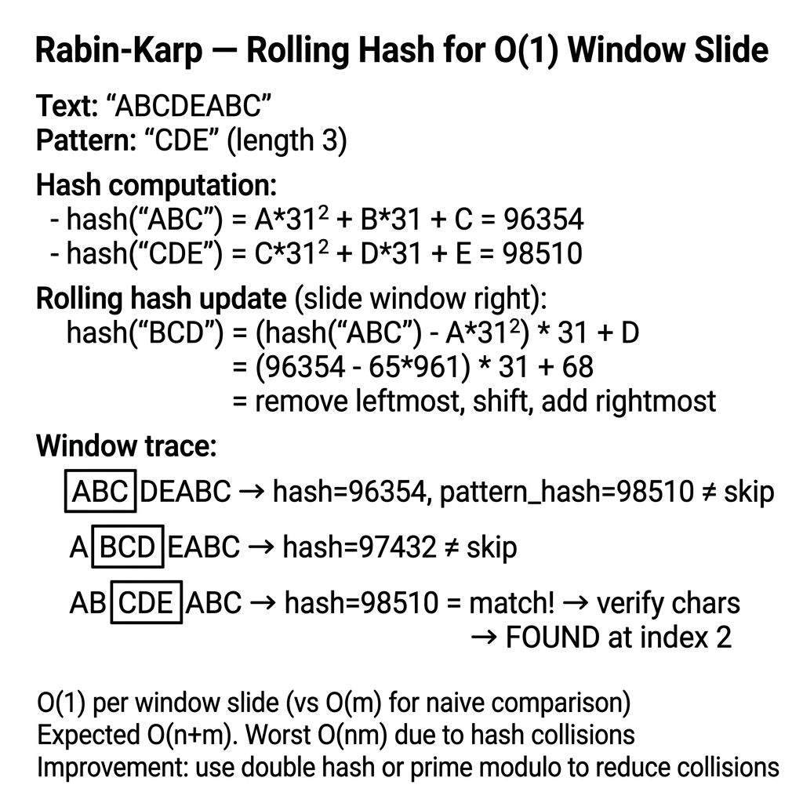

<!-- tags: dsa, algorithms, hashing -->
# 🎲 Rabin-Karp — Rolling Hash Pattern Matching

> **Category**: String Pattern Matching, Hashing
> **Summary**: Rolling hash provides O(1) comparison per window. Best for multi-pattern matching.

📅 Created: 2026-03-20 · 🔄 Updated: 2026-04-09 · ⏱️ 15 min read

---

## 1. DEFINE

<!-- [Experienced layer] -->

Comparing characters becomes expensive when pattern matching scales to multiple windows or patterns. `Rabin-Karp` replaces character comparison with a rolling hash. Each window slide updates only the first and last characters.

This algorithm provides a pragmatic trade-off. It accepts controlled collisions to accelerate candidate filtering before actual string comparison.

Core insight: **Rolling hash treats a substring as an incrementally updatable value instead of a segment requiring complete rehashing.**

| Variant | When To Use | Core Idea |
| ------- | ------- | ------- |
| Single-pattern search | Scan one pattern with fast sliding | Compare hashes first then verify substring |
| Multi-pattern search | Multiple patterns share length or source | Reuse rolling hash to avoid rescanning |
| Safer hashing | Collision cost becomes an issue | Use double-hash or stable modulus |

| Approach | Time | Space | When To Choose |
| -------- | ---- | ----- | -------- |
| Rolling hash + exact verify | O(n + m) average | O(1) | Need fast window matching and accept verification cost |
| Batch multi-pattern scan | O(k(n + m)) or better | O(k) | Find multiple patterns in one source |
| Double-hash / safer modulo | O(n + m) average | O(1) | Collision costs affect system performance |

### 1.1 Quick Recognition

- The problem involves pattern matching across multiple windows of equal length.
- You must update consecutive window hashes in O(1) time.
- The task requires handling hash collisions and modulo arithmetic.

### 1.2 Invariants & Failure Modes

- The new window hash must derive from the old hash via proper base arithmetic.
- A hash match only identifies a candidate. You must perform an exact string comparison.
- Common failure mode: omitting modulo normalization causes negative hashes or drift after sliding.

## 2. VISUAL

These foundational algorithms become clear when you see the state updates. This trace illuminates that process.

### Level 1 — Core intuition

```text
text    =  a  b  c  a  b  c
window1 = [a  b  c]
window2 =    [b  c  a]

hash(window2)
= (hash(window1) - a * B^(m-1)) * B + a
```

*Caption*: Level 1 shows Rabin-Karp updates the next window hash in O(1) time instead of rescanning `m` characters.

### Level 2 — Decision trace

- Compute `patternHash`, the initial `windowHash`, and `power = B^(m-1)`.
- Each window slide removes the old character and adds the new one.
- Verify the substring only when `windowHash == patternHash` to prevent false positives.
- The invariant ensures the rolling hash formula always represents the current window exactly.




## 3. CODE

Code should highlight the state structure and update rules. Do not hide them behind early optimizations.

### Problem 1: Basic — Single Pattern
> **Goal**: Implement rolling hash search.
> **Approach**: Start with the core version. Move to practical variants to see the reusable invariant.
> **Example**: A short string traces state window and pointer updates clearly.
> **Complexity**: O(n + m) average time and O(1) space.

```go
package algo

const (
    base = 31
    mod  = 1_000_000_007
)

func RabinKarp(text, pattern string) []int {
    n, m := len(text), len(pattern)
    if m > n { return nil }

    // Compute pattern hash and base power
    patHash, textHash, power := 0, 0, 1
    for i := 0; i < m; i++ {
        patHash = (patHash*base + int(pattern[i])) % mod
        textHash = (textHash*base + int(text[i])) % mod
        if i > 0 { power = (power * base) % mod }
    }

    var matches []int
    for i := 0; i <= n-m; i++ {
        if textHash == patHash {
            // Verify to avoid false positives
            if text[i:i+m] == pattern {
                matches = append(matches, i)
            }
        }
        if i < n-m {
            textHash = ((textHash-int(text[i])*power)*base + int(text[i+m])) % mod
            if textHash < 0 { textHash += mod }
        }
    }
    return matches
}
```

```typescript
const BASE = 31, MOD = 1_000_000_007;
function rabinKarp(text: string, pattern: string): number[] {
    const n = text.length, m = pattern.length; if (m > n) return [];
    let patHash = 0, textHash = 0, power = 1;
    for (let i = 0; i < m; i++) {
        patHash = (patHash*BASE + pattern.charCodeAt(i)) % MOD;
        textHash = (textHash*BASE + text.charCodeAt(i)) % MOD;
        if (i > 0) power = (power * BASE) % MOD;
    }
    const matches: number[] = [];
    for (let i = 0; i <= n-m; i++) {
        if (textHash === patHash && text.substring(i,i+m) === pattern) matches.push(i);
        if (i < n-m) { textHash = ((textHash - text.charCodeAt(i)*power%MOD + MOD)*BASE + text.charCodeAt(i+m)) % MOD; }
    }
    return matches;
}
```

```rust
fn rabin_karp(text: &[u8], pattern: &[u8]) -> Vec<usize> {
    let (n, m, base, modp) = (text.len(), pattern.len(), 31i64, 1_000_000_007i64);
    if m > n { return vec![]; }
    let (mut ph, mut th, mut pw) = (0i64, 0i64, 1i64);
    for i in 0..m {
        ph = (ph*base + pattern[i] as i64) % modp;
        th = (th*base + text[i] as i64) % modp;
        if i > 0 { pw = pw*base % modp; }
    }
    let mut matches = vec![];
    for i in 0..=n-m {
        if th == ph && text[i..i+m] == *pattern { matches.push(i); }
        if i < n-m { th = ((th - text[i] as i64 * pw % modp + modp) * base + text[i+m] as i64) % modp; }
    }
    matches
}
```

```cpp
std::vector<int> rabinKarp(const std::string& text, const std::string& pattern) {
    int n=text.size(), m=pattern.size(); if (m>n) return {};
    const long long base=31, mod=1e9+7; long long ph=0, th=0, pw=1;
    for (int i=0;i<m;i++) { ph=(ph*base+pattern[i])%mod; th=(th*base+text[i])%mod; if (i>0) pw=pw*base%mod; }
    std::vector<int> matches;
    for (int i=0;i<=n-m;i++) {
        if (th==ph && text.substr(i,m)==pattern) matches.push_back(i);
        if (i<n-m) { th=((th-text[i]*pw%mod+mod)*base+text[i+m])%mod; }
    }
    return matches;
}
```

```python
def rabin_karp(text: str, pattern: str) -> list[int]:
    n, m, base, mod = len(text), len(pattern), 31, 10**9+7
    if m > n: return []
    ph = th = 0; pw = 1
    for i in range(m):
        ph = (ph*base + ord(pattern[i])) % mod
        th = (th*base + ord(text[i])) % mod
        if i > 0: pw = pw*base % mod
    matches = []
    for i in range(n - m + 1):
        if th == ph and text[i:i+m] == pattern: matches.append(i)
        if i < n-m: th = ((th - ord(text[i])*pw) * base + ord(text[i+m])) % mod
    return matches
```

> **Why?** Single Pattern serves as a primitive to reduce search space or merge states. The core invariant protects the hash rolling logic.

> **Takeaway**: Modulo arithmetic handles large strings safely. Verify matches to handle collisions.

### Problem 2: Intermediate — Multi-Pattern Search
> **Goal**: Find multiple patterns simultaneously.
> **Approach**: Check the text against multiple pattern hashes.
> **Example**: A small input allows manual pointer tracing.
> **Complexity**: O(k(n + m)) time depending on implementation.

```go
package algo

func RabinKarpMulti(text string, patterns []string) map[string][]int {
    results := make(map[string][]int)
    for _, p := range patterns {
        results[p] = RabinKarp(text, p)
    }
    return results
}
```

```typescript
function rabinKarpMulti(text: string, patterns: string[]): Map<string,number[]> {
    const results = new Map<string,number[]>();
    for (const p of patterns) results.set(p, rabinKarp(text, p));
    return results;
}
```

```rust
fn rabin_karp_multi(text: &[u8], patterns: &[&[u8]]) -> std::collections::HashMap<Vec<u8>, Vec<usize>> {
    patterns.iter().map(|p| (p.to_vec(), rabin_karp(text, p))).collect()
}
```

```cpp
std::map<std::string, std::vector<int>> rabinKarpMulti(const std::string& text, const std::vector<std::string>& patterns) {
    std::map<std::string, std::vector<int>> results;
    for (auto& p : patterns) results[p] = rabinKarp(text, p);
    return results;
}
```

```python
def rabin_karp_multi(text: str, patterns: list[str]) -> dict[str, list[int]]:
    return {p: rabin_karp(text, p) for p in patterns}
```

> **Why?** Multi-Pattern Search accelerates multiple lookups. The invariant maintains hash consistency across queries.

> **Takeaway**: Wrap the single search function to handle multiple patterns cleanly.

### Problem 3: Advanced — Plagiarism Detector (Rolling Hash Applications)
> **Goal**: Detect duplicated substrings of length k.
> **Approach**: Map rolling hashes to start indices.
> **Example**: A small input highlights duplicate detection.
> **Complexity**: O(n) average time and O(n) space.

```go
package algo

// FindDuplicateSubstrings finds all duplicate substrings of length k.
func FindDuplicateSubstrings(text string, k int) []string {
    if k > len(text) { return nil }

    seen := make(map[int][]int) // hash to start indices
    var duplicates []string

    hash, power := 0, 1
    for i := 0; i < k; i++ {
        hash = (hash*base + int(text[i])) % mod
        if i > 0 { power = (power * base) % mod }
    }

    seen[hash] = []int{0}
    for i := 1; i <= len(text)-k; i++ {
        hash = ((hash-int(text[i-1])*power)*base + int(text[i+k-1])) % mod
        if hash < 0 { hash += mod }

        if indices, ok := seen[hash]; ok {
            for _, idx := range indices {
                if text[idx:idx+k] == text[i:i+k] {
                    duplicates = append(duplicates, text[i:i+k])
                }
            }
        }
        seen[hash] = append(seen[hash], i)
    }
    return duplicates
}
```

```typescript
function findDuplicateSubstrings(text: string, k: number): string[] {
    if (k > text.length) return [];
    const seen = new Map<number,number[]>(); const dups: string[] = [];
    let hash = 0, power = 1;
    for (let i = 0; i < k; i++) { hash = (hash*BASE + text.charCodeAt(i)) % MOD; if (i>0) power = (power*BASE) % MOD; }
    seen.set(hash, [0]);
    for (let i = 1; i <= text.length-k; i++) {
        hash = ((hash - text.charCodeAt(i-1)*power%MOD + MOD)*BASE + text.charCodeAt(i+k-1)) % MOD;
        if (seen.has(hash)) { for (const idx of seen.get(hash)!) { if (text.substring(idx,idx+k) === text.substring(i,i+k)) dups.push(text.substring(i,i+k)); } }
        if (!seen.has(hash)) seen.set(hash, []); seen.get(hash)!.push(i);
    }
    return dups;
}
```
```rust
use std::collections::HashMap;

fn find_duplicate_substrings(text: &str, k: usize) -> Vec<String> {
    if k > text.len() {
        return vec![];
    }

    let bytes = text.as_bytes();
    let (base, modu) = (31_i64, 1_000_000_007_i64);
    let (mut hash, mut power) = (0_i64, 1_i64);
    let mut seen: HashMap<i64, Vec<usize>> = HashMap::new();
    let mut duplicates = Vec::new();

    for i in 0..k {
        hash = (hash * base + bytes[i] as i64) % modu;
        if i > 0 {
            power = (power * base) % modu;
        }
    }

    seen.insert(hash, vec![0]);
    for i in 1..=bytes.len() - k {
        hash = ((hash - (bytes[i - 1] as i64) * power).rem_euclid(modu) * base + bytes[i + k - 1] as i64) % modu;
        if let Some(indices) = seen.get(&hash) {
            for &idx in indices {
                if &text[idx..idx + k] == &text[i..i + k] {
                    duplicates.push(text[i..i + k].to_string());
                }
            }
        }
        seen.entry(hash).or_default().push(i);
    }
    duplicates
}
```
```cpp
#include <string>
#include <unordered_map>
#include <vector>

std::vector<std::string> findDuplicateSubstrings(const std::string& text, int k) {
    if (k > static_cast<int>(text.size())) return {};
    const long long BASE = 31, MOD = 1'000'000'007;
    long long hash = 0, power = 1;
    std::unordered_map<long long, std::vector<int>> seen;
    std::vector<std::string> duplicates;

    for (int i = 0; i < k; ++i) {
        hash = (hash * BASE + text[i]) % MOD;
        if (i > 0) power = (power * BASE) % MOD;
    }

    seen[hash] = {0};
    for (int i = 1; i <= static_cast<int>(text.size()) - k; ++i) {
        hash = ((hash - text[i - 1] * power) % MOD + MOD) % MOD;
        hash = (hash * BASE + text[i + k - 1]) % MOD;
        if (seen.count(hash)) {
            for (int idx : seen[hash]) {
                if (text.substr(idx, k) == text.substr(i, k)) {
                    duplicates.push_back(text.substr(i, k));
                }
            }
        }
        seen[hash].push_back(i);
    }
    return duplicates;
}
```

```python
def find_duplicate_substrings(text: str, k: int) -> list[str]:
    if k > len(text): return []
    base, mod = 31, 10**9+7; seen: dict[int, list[int]] = {}; dups = []
    h, pw = 0, 1
    for i in range(k): h = (h*base + ord(text[i])) % mod; pw = pw*base%mod if i > 0 else pw
    seen[h] = [0]
    for i in range(1, len(text)-k+1):
        h = ((h - ord(text[i-1])*pw) * base + ord(text[i+k-1])) % mod
        if h in seen:
            for idx in seen[h]:
                if text[idx:idx+k] == text[i:i+k]: dups.append(text[i:i+k])
        seen.setdefault(h, []).append(i)
    return dups
```

> **Why?** Rolling hashes allow efficient identification of repeated substring blocks without brute-force string comparisons.

> **Takeaway**: Storing hashes with their start indices quickly isolates exact duplicates.

---

## 4. PITFALLS

Foundation algorithms break when developers misuse the invariant that the structure protects.

| # | Severity | Defect | Consequence | Fix |
|---|----------|-----|---------|-----|
| 1 | 🔴 Fatal | Hash collision causes false positive | Incorrect matches | Always verify string match |
| 2 | 🟡 Common | Negative hash modulo | Calculation errors | `if hash < 0 { hash += mod }` |
| 3 | 🟡 Common | Small mod increases collisions | Degraded performance | Use large prime mod |

---

## 5. REF

| Resource      | Link                                                                           |
| ------------- | ------------------------------------------------------------------------------ |
| Wikipedia     | [en.wikipedia.org](https://en.wikipedia.org/wiki/Rabin%E2%80%93Karp_algorithm) |
| CP-Algorithms | [cp-algorithms.com](https://cp-algorithms.com/string/rabin-karp.html)          |

---

## 6. RECOMMEND

When you grasp this primitive, connect it to larger problems where it serves as a piece.

| Extension          | When To Use              | Reason                  |
| ---------------- | -------------------- | ---------------------- |
| **Single hash**  | Simple cases         | Faster but risks collisions |
| **Double hash**  | Competitive scenarios | Almost no collisions   |
| **Rolling hash** | Substring comparison | O(1) hash update       |
| **KMP**          | Guaranteed O(n+m)    | No hash collisions     |

---

## 7. QUICK REF

| # | Pattern | Code |
|---|---------|------|
| 1 | Rolling hash | `hash = (hash - int(text[i])*power%mod + mod) % mod; hash = (hash*base + int(text[i+m])) % mod` |
| 2 | Init hash | `for i := 0; i < m; i++ { patHash = (patHash*base+int(pat[i]))%mod; textHash = (textHash*base+int(text[i]))%mod }` |
| 3 | Power precompute | `power := 1; for i := 0; i < m-1; i++ { power = power*base%mod }` |
| 4 | Complexity | `// O(n+m) avg · O(nm) worst for hash collisions · O(1) space` |
| 5 | Double hash | `// Use 2 hash functions to reduce collision probability` |
| 6 | When to use | `// Multiple pattern search, plagiarism detection, 2D pattern matching` |

**Links**: [← KMP](./02-kmp.md) · [→ A\*](./04-a-star.md)

---

Why is a rolling hash O(1) per slide? The update formula only requires one subtraction, one multiplication, and one addition. The trade-off is hash collision handling. The worst case is O(nm), but the expected time is O(n+m).
