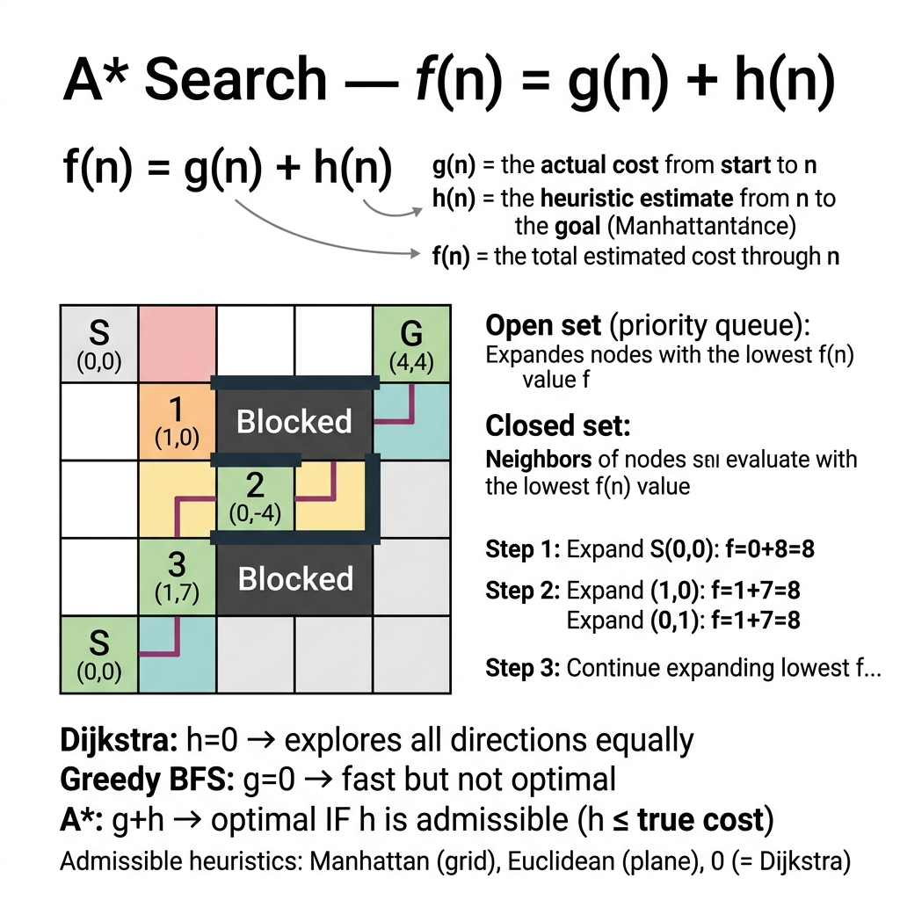

<!-- tags: dsa, algorithms -->
# ⭐ A\* Search — Heuristic Pathfinding

> **Category**: Informed Search, Best-first
> **Summary**: f(n) = g(n) + h(n). Dijkstra combined with heuristics speeds up pathfinding.

📅 Created: 2026-03-20 · 🔄 Updated: 2026-04-09 · ⏱️ 15 min read

---

## 1. DEFINE

<!-- [Beginner layer] -->

Dijkstra expands in all directions based on accumulated cost. `A*` searches smarter by adding an estimated distance to the goal. A good heuristic prunes unnecessary search areas effectively.

The key to `A*` is not the `f = g + h` formula. You must understand which heuristic remains admissible or consistent. Only then does prioritizing closer nodes preserve correctness.

Core insight: **An A* heuristic guides the search but must never overestimate the remaining distance.**

| Metric          | Value                                   |
| --------------- | --------------------------------------- |
| **Time**        | O(b^d) — depends on heuristic quality   |
| **Space**       | O(b^d)                                  |
| **Optimal**     | Yes, if h(n) ≤ actual cost (admissible) |
| **Complete**    | Yes, if finite branching                |
| **vs Dijkstra** | Dijkstra is A\* with h=0                |

### f(n) = g(n) + h(n)

- **g(n)**: actual cost from start to n
- **h(n)**: estimated cost from n to goal (heuristic)
- **Admissible**: h(n) ≤ actual cost ensures an optimal path

### Heuristics for Grid

| Heuristic | Formula                | Grid type     |
| --------- | ---------------------- | ------------- |
| Manhattan | \|x₁-x₂\| + \|y₁-y₂\|  | 4-directional |
| Euclidean | √((x₁-x₂)² + (y₁-y₂)²) | Any direction |
| Chebyshev | max(\|Δx\|, \|Δy\|)    | 8-directional |

---

| Variant | When To Use | Core Idea |
| ------- | ------- | ------- |
| A\* on Grid | Need a trace-friendly baseline | Grasp the core invariant before optimizing |
| 8-Directional A\* | Problem adds state or constraints | Keep the invariant but add state or cache |

| Approach | Time | Space | When To Choose |
| --- | --- | --- | --- |
| A\* on Grid | O(1) | Varies | Understand the invariant before optimization |
| 8-Directional A\* | O(n) | O(log n) | Problem has moderate constraints |

### 1.1 Quick Recognition

- The problem finds the shortest path to a clear target using a distance estimate.
- Grid or pathfinding domains are classic signals.
- The priority queue orders by `g + h` instead of just `g`.

### 1.2 Invariants & Failure Modes

- `g(n)` tracks the true cost. `h(n)` estimates the remaining cost. `f(n)` prioritizes the frontier.
- An admissible heuristic never overestimates the optimal remaining distance.
- Common failure mode: using an overestimating heuristic breaks the optimality guarantee silently.

## 2. VISUAL

These foundational algorithms become clear when you see the state updates. This trace illuminates that process.

### Level 1 — Core intuition

```text
  Grid: . = free, # = wall, S = start, G = goal

  S . . # .     A* path (Manhattan heuristic):
  . # . # .     S → → ↓
  . # . . .            ↓ → → ↓
  . . . # G                   G
```

---

*Caption*: ⭐ A\* Search at Level 1 shows core intuition. Level 2 details the state update order from input to answer.

### Level 2 — Decision trace

- Identify the core data structure or state primitive.
- Each update step must reduce search space or merge components.
- Keep boundary checks and rollbacks near the update for simpler reasoning.
- Correct results appear when auxiliary state reflects the original problem structure.




## 3. CODE

Code should highlight the state structure and update rules. Do not hide them behind early optimizations.

### Problem 1: Basic — A\* on Grid
> **Goal**: Implement A* on a basic grid.
> **Approach**: Start with the core version. Move to practical variants to see the reusable invariant.
> **Example**: A small input allows manual tracing.
> **Complexity**: O(b^d) time and space.

```go
package algo

import "container/heap"

type Point struct{ X, Y int }

type AStarNode struct {
    Pos    Point
    G, H   float64
    Parent *AStarNode
}

func (n *AStarNode) F() float64 { return n.G + n.H }

type AStarPQ []*AStarNode
func (pq AStarPQ) Len() int            { return len(pq) }
func (pq AStarPQ) Less(i, j int) bool  { return pq[i].F() < pq[j].F() }
func (pq AStarPQ) Swap(i, j int)       { pq[i], pq[j] = pq[j], pq[i] }
func (pq *AStarPQ) Push(x interface{}) { *pq = append(*pq, x.(*AStarNode)) }
func (pq *AStarPQ) Pop() interface{} {
    old := *pq; n := len(old); item := old[n-1]; *pq = old[:n-1]; return item
}

// manhattan calculates 4-way distance.
func manhattan(a, b Point) float64 {
    dx, dy := a.X-b.X, a.Y-b.Y
    if dx < 0 { dx = -dx }
    if dy < 0 { dy = -dy }
    return float64(dx + dy)
}

// AStar returns the path from start to goal.
func AStar(grid [][]int, start, goal Point) []Point {
    rows, cols := len(grid), len(grid[0])
    dirs := [][2]int{{0, 1}, {0, -1}, {1, 0}, {-1, 0}}

    openSet := &AStarPQ{}
    heap.Init(openSet)
    heap.Push(openSet, &AStarNode{Pos: start, G: 0, H: manhattan(start, goal)})

    gScore := map[Point]float64{start: 0}
    closed := map[Point]bool{}

    for openSet.Len() > 0 {
        curr := heap.Pop(openSet).(*AStarNode)
        if curr.Pos == goal {
            var path []Point
            for n := curr; n != nil; n = n.Parent {
                path = append([]Point{n.Pos}, path...)
            }
            return path
        }

        if closed[curr.Pos] { continue }
        closed[curr.Pos] = true

        for _, d := range dirs {
            next := Point{curr.Pos.X + d[0], curr.Pos.Y + d[1]}
            if next.X < 0 || next.X >= rows || next.Y < 0 || next.Y >= cols { continue }
            if grid[next.X][next.Y] == 1 || closed[next] { continue } // wall

            ng := curr.G + 1
            if g, ok := gScore[next]; !ok || ng < g {
                gScore[next] = ng
                heap.Push(openSet, &AStarNode{
                    Pos: next, G: ng, H: manhattan(next, goal), Parent: curr,
                })
            }
        }
    }
    return nil // no path
}
```

```typescript
function aStar(grid: number[][], start: [number,number], goal: [number,number]): [number,number][] | null {
    const [rows,cols] = [grid.length, grid[0].length];
    const dirs = [[0,1],[0,-1],[1,0],[-1,0]];
    const key = (r:number,c:number) => `${r},${c}`;
    const manhattan = (a:[number,number], b:[number,number]) => Math.abs(a[0]-b[0])+Math.abs(a[1]-b[1]);
    // Simple priority queue via sorted insertion
    const open: {pos:[number,number],g:number,f:number,parent:any}[] = [];
    const push = (node:typeof open[0]) => { open.push(node); open.sort((a,b)=>a.f-b.f); };
    push({pos:start, g:0, f:manhattan(start,goal), parent:null});
    const gScore = new Map<string,number>([[key(...start),0]]);
    const closed = new Set<string>();
    while (open.length) {
        const curr = open.shift()!;
        if (curr.pos[0]===goal[0] && curr.pos[1]===goal[1]) {
            const path: [number,number][] = []; for (let n:any=curr;n;n=n.parent) path.unshift(n.pos); return path;
        }
        const ck = key(...curr.pos); if (closed.has(ck)) continue; closed.add(ck);
        for (const [dr,dc] of dirs) {
            const nr=curr.pos[0]+dr, nc=curr.pos[1]+dc;
            if (nr<0||nr>=rows||nc<0||nc>=cols||grid[nr][nc]===1) continue;
            const nk=key(nr,nc); if (closed.has(nk)) continue;
            const ng=curr.g+1;
            if (!gScore.has(nk)||ng<gScore.get(nk)!) {
                gScore.set(nk,ng);
                push({pos:[nr,nc],g:ng,f:ng+manhattan([nr,nc],goal),parent:curr});
            }
        }
    }
    return null;
}
```

```rust
use std::cmp::Ordering;
use std::collections::{BinaryHeap, HashMap, HashSet};

#[derive(Clone, Copy, Debug, Eq, PartialEq, Hash)]
struct Point {
    x: i32,
    y: i32,
}

#[derive(Clone, Eq, PartialEq)]
struct State {
    f: i32,
    g: i32,
    pos: Point,
    path: Vec<Point>,
}

impl Ord for State {
    fn cmp(&self, other: &Self) -> Ordering {
        other.f.cmp(&self.f).then_with(|| other.g.cmp(&self.g))
    }
}

impl PartialOrd for State {
    fn partial_cmp(&self, other: &Self) -> Option<Ordering> {
        Some(self.cmp(other))
    }
}

fn manhattan(a: Point, b: Point) -> i32 {
    (a.x - b.x).abs() + (a.y - b.y).abs()
}

fn a_star(grid: &[Vec<i32>], start: Point, goal: Point) -> Option<Vec<Point>> {
    let rows = grid.len() as i32;
    let cols = grid[0].len() as i32;
    let dirs = [(0, 1), (0, -1), (1, 0), (-1, 0)];
    let mut open = BinaryHeap::new();
    let mut g_score = HashMap::from([(start, 0)]);
    let mut closed = HashSet::new();

    open.push(State {
        f: manhattan(start, goal),
        g: 0,
        pos: start,
        path: vec![start],
    });

    while let Some(State { g, pos, path, .. }) = open.pop() {
        if pos == goal {
            return Some(path);
        }
        if !closed.insert(pos) {
            continue;
        }
        for (dr, dc) in dirs {
            let next = Point { x: pos.x + dr, y: pos.y + dc };
            if next.x < 0 || next.x >= rows || next.y < 0 || next.y >= cols {
                continue;
            }
            if grid[next.x as usize][next.y as usize] == 1 || closed.contains(&next) {
                continue;
            }
            let ng = g + 1;
            if g_score.get(&next).map_or(true, |&best| ng < best) {
                g_score.insert(next, ng);
                let mut next_path = path.clone();
                next_path.push(next);
                open.push(State {
                    f: ng + manhattan(next, goal),
                    g: ng,
                    pos: next,
                    path: next_path,
                });
            }
        }
    }
    None
}
```

```cpp
#include <cmath>
#include <queue>
#include <tuple>
#include <unordered_map>
#include <unordered_set>
#include <vector>

struct Point {
    int x, y;
    bool operator==(const Point& other) const { return x == other.x && y == other.y; }
};

struct PointHash {
    size_t operator()(const Point& p) const {
        return (static_cast<size_t>(p.x) << 32) ^ static_cast<size_t>(p.y);
    }
};

int manhattan(const Point& a, const Point& b) {
    return std::abs(a.x - b.x) + std::abs(a.y - b.y);
}

std::vector<Point> aStar(const std::vector<std::vector<int>>& grid, Point start, Point goal) {
    using Node = std::tuple<int, int, Point, std::vector<Point>>; // f, g, pos, path
    auto cmp = [](const Node& a, const Node& b) { return std::get<0>(a) > std::get<0>(b); };
    std::priority_queue<Node, std::vector<Node>, decltype(cmp)> open(cmp);
    std::unordered_map<Point, int, PointHash> gScore{{start, 0}};
    std::unordered_set<Point, PointHash> closed;
    const std::vector<std::pair<int, int>> dirs{{0, 1}, {0, -1}, {1, 0}, {-1, 0}};
    const int rows = static_cast<int>(grid.size());
    const int cols = static_cast<int>(grid[0].size());

    open.push({manhattan(start, goal), 0, start, {start}});
    while (!open.empty()) {
        auto [f, g, pos, path] = open.top();
        open.pop();
        if (pos == goal) return path;
        if (closed.count(pos)) continue;
        closed.insert(pos);

        for (auto [dr, dc] : dirs) {
            Point next{pos.x + dr, pos.y + dc};
            if (next.x < 0 || next.x >= rows || next.y < 0 || next.y >= cols) continue;
            if (grid[next.x][next.y] == 1 || closed.count(next)) continue;
            int ng = g + 1;
            if (!gScore.count(next) || ng < gScore[next]) {
                gScore[next] = ng;
                auto nextPath = path;
                nextPath.push_back(next);
                open.push({ng + manhattan(next, goal), ng, next, nextPath});
            }
        }
    }
    return {};
}
```

```python
import heapq
def a_star(grid: list[list[int]], start: tuple[int,int], goal: tuple[int,int]) -> list[tuple[int,int]] | None:
    rows, cols = len(grid), len(grid[0])
    manhattan = lambda a, b: abs(a[0]-b[0]) + abs(a[1]-b[1])
    open_set = [(manhattan(start, goal), 0, start, [start])]
    g_score = {start: 0}; closed = set()
    while open_set:
        f, g, pos, path = heapq.heappop(open_set)
        if pos == goal: return path
        if pos in closed: continue
        closed.add(pos)
        for dr, dc in [(0,1),(0,-1),(1,0),(-1,0)]:
            nr, nc = pos[0]+dr, pos[1]+dc
            if 0<=nr<rows and 0<=nc<cols and grid[nr][nc]!=1 and (nr,nc) not in closed:
                ng = g + 1
                if (nr,nc) not in g_score or ng < g_score[(nr,nc)]:
                    g_score[(nr,nc)] = ng
                    heapq.heappush(open_set, (ng+manhattan((nr,nc),goal), ng, (nr,nc), path+[(nr,nc)]))
    return None
```

```java
import java.util.ArrayList;
import java.util.Comparator;
import java.util.HashMap;
import java.util.HashSet;
import java.util.List;
import java.util.Map;
import java.util.PriorityQueue;
import java.util.Set;

record Point(int x, int y) {}

final class AStarGrid {
    private AStarGrid() {}

    private record State(int f, int g, Point pos, List<Point> path) {}

    static List<Point> aStar(int[][] grid, Point start, Point goal) {
        int rows = grid.length;
        int cols = grid[0].length;
        int[][] dirs = {{0, 1}, {0, -1}, {1, 0}, {-1, 0}};

        PriorityQueue<State> open = new PriorityQueue<>(Comparator.comparingInt(State::f));
        Map<Point, Integer> gScore = new HashMap<>();
        Set<Point> closed = new HashSet<>();

        open.offer(new State(manhattan(start, goal), 0, start, new ArrayList<>(List.of(start))));
        gScore.put(start, 0);

        while (!open.isEmpty()) {
            State curr = open.poll();
            if (curr.pos().equals(goal)) {
                return curr.path();
            }
            if (!closed.add(curr.pos())) {
                continue;
            }

            for (int[] dir : dirs) {
                Point next = new Point(curr.pos().x() + dir[0], curr.pos().y() + dir[1]);
                if (next.x() < 0 || next.x() >= rows || next.y() < 0 || next.y() >= cols) {
                    continue;
                }
                if (grid[next.x()][next.y()] == 1 || closed.contains(next)) {
                    continue;
                }

                int nextG = curr.g() + 1;
                if (!gScore.containsKey(next) || nextG < gScore.get(next)) {
                    gScore.put(next, nextG);
                    List<Point> nextPath = new ArrayList<>(curr.path());
                    nextPath.add(next);
                    open.offer(new State(nextG + manhattan(next, goal), nextG, next, nextPath));
                }
            }
        }

        return null;
    }

    private static int manhattan(Point a, Point b) {
        return Math.abs(a.x() - b.x()) + Math.abs(a.y() - b.y());
    }
}
```

> **Why?** A\* on Grid serves as a primitive to reduce search space. The auxiliary structure invariant maintains path correctness.

> **Takeaway**: Accurate heuristic selection keeps the search fast and optimal.

### Problem 2: Intermediate — 8-Directional A\*
> **Goal**: Pathfind with diagonal movement.
> **Approach**: Include diagonal neighbors and calculate cost properly.
> **Example**: A small input highlights diagonal distance costs.
> **Complexity**: O(b^d) time and space.

```go
package algo

import (
    "container/heap"
    "math"
)

// chebyshev calculates 8-way distance.
func chebyshev(a, b Point) float64 {
    dx := math.Abs(float64(a.X - b.X))
    dy := math.Abs(float64(a.Y - b.Y))
    return math.Max(dx, dy)
}

func AStar8Dir(grid [][]int, start, goal Point) []Point {
    rows, cols := len(grid), len(grid[0])
    dirs := [][2]int{{0,1},{0,-1},{1,0},{-1,0},{1,1},{1,-1},{-1,1},{-1,-1}}

    openSet := &AStarPQ{}
    heap.Init(openSet)
    heap.Push(openSet, &AStarNode{Pos: start, G: 0, H: chebyshev(start, goal)})

    gScore := map[Point]float64{start: 0}
    closed := map[Point]bool{}

    for openSet.Len() > 0 {
        curr := heap.Pop(openSet).(*AStarNode)
        if curr.Pos == goal {
            var path []Point
            for n := curr; n != nil; n = n.Parent {
                path = append([]Point{n.Pos}, path...)
            }
            return path
        }
        if closed[curr.Pos] { continue }
        closed[curr.Pos] = true

        for _, d := range dirs {
            next := Point{curr.Pos.X + d[0], curr.Pos.Y + d[1]}
            if next.X < 0 || next.X >= rows || next.Y < 0 || next.Y >= cols { continue }
            if grid[next.X][next.Y] == 1 || closed[next] { continue }

            cost := 1.0
            if d[0] != 0 && d[1] != 0 { cost = math.Sqrt(2) } // diagonal
            ng := curr.G + cost

            if g, ok := gScore[next]; !ok || ng < g {
                gScore[next] = ng
                heap.Push(openSet, &AStarNode{
                    Pos: next, G: ng, H: chebyshev(next, goal), Parent: curr,
                })
            }
        }
    }
    return nil
}
```

```typescript
function aStar8Dir(grid: number[][], start: [number,number], goal: [number,number]): [number,number][] | null {
    const [rows,cols] = [grid.length, grid[0].length];
    const dirs = [[0,1],[0,-1],[1,0],[-1,0],[1,1],[1,-1],[-1,1],[-1,-1]];
    const key = (r:number,c:number) => `${r},${c}`;
    const chebyshev = (a:[number,number],b:[number,number]) => Math.max(Math.abs(a[0]-b[0]),Math.abs(a[1]-b[1]));
    const open: {pos:[number,number],g:number,f:number,parent:any}[] = [];
    const push = (n:typeof open[0]) => { open.push(n); open.sort((a,b)=>a.f-b.f); };
    push({pos:start,g:0,f:chebyshev(start,goal),parent:null});
    const gScore = new Map<string,number>([[key(...start),0]]);
    const closed = new Set<string>();
    while (open.length) {
        const curr = open.shift()!;
        if (curr.pos[0]===goal[0]&&curr.pos[1]===goal[1]) {
            const path:[number,number][]=[]; for(let n:any=curr;n;n=n.parent)path.unshift(n.pos); return path;
        }
        const ck=key(...curr.pos); if(closed.has(ck))continue; closed.add(ck);
        for (const [dr,dc] of dirs) {
            const nr=curr.pos[0]+dr,nc=curr.pos[1]+dc;
            if(nr<0||nr>=rows||nc<0||nc>=cols||grid[nr][nc]===1)continue;
            const nk=key(nr,nc); if(closed.has(nk))continue;
            const cost=dr!==0&&dc!==0?Math.SQRT2:1, ng=curr.g+cost;
            if(!gScore.has(nk)||ng<gScore.get(nk)!) { gScore.set(nk,ng); push({pos:[nr,nc],g:ng,f:ng+chebyshev([nr,nc],goal),parent:curr}); }
        }
    }
    return null;
}
```

```rust
use std::cmp::Ordering;
use std::collections::{BinaryHeap, HashMap, HashSet};

#[derive(Clone, Copy, Debug, Eq, PartialEq, Hash)]
struct Point8 {
    x: i32,
    y: i32,
}

#[derive(Clone, PartialEq)]
struct State8 {
    f: f64,
    g: f64,
    pos: Point8,
    path: Vec<Point8>,
}

impl Eq for State8 {}

impl Ord for State8 {
    fn cmp(&self, other: &Self) -> Ordering {
        other.f.partial_cmp(&self.f).unwrap_or(Ordering::Equal)
    }
}

impl PartialOrd for State8 {
    fn partial_cmp(&self, other: &Self) -> Option<Ordering> {
        Some(self.cmp(other))
    }
}

fn chebyshev(a: Point8, b: Point8) -> f64 {
    ((a.x - b.x).abs().max((a.y - b.y).abs())) as f64
}

fn a_star_8dir(grid: &[Vec<i32>], start: Point8, goal: Point8) -> Option<Vec<Point8>> {
    let rows = grid.len() as i32;
    let cols = grid[0].len() as i32;
    let dirs = [
        (0, 1), (0, -1), (1, 0), (-1, 0),
        (1, 1), (1, -1), (-1, 1), (-1, -1),
    ];
    let mut open = BinaryHeap::new();
    let mut g_score = HashMap::from([(start, 0.0)]);
    let mut closed = HashSet::new();

    open.push(State8 {
        f: chebyshev(start, goal),
        g: 0.0,
        pos: start,
        path: vec![start],
    });

    while let Some(State8 { g, pos, path, .. }) = open.pop() {
        if pos == goal {
            return Some(path);
        }
        if !closed.insert(pos) {
            continue;
        }
        for (dr, dc) in dirs {
            let next = Point8 { x: pos.x + dr, y: pos.y + dc };
            if next.x < 0 || next.x >= rows || next.y < 0 || next.y >= cols {
                continue;
            }
            if grid[next.x as usize][next.y as usize] == 1 || closed.contains(&next) {
                continue;
            }
            let cost = if dr != 0 && dc != 0 { 2f64.sqrt() } else { 1.0 };
            let ng = g + cost;
            if g_score.get(&next).map_or(true, |&best| ng < best) {
                g_score.insert(next, ng);
                let mut next_path = path.clone();
                next_path.push(next);
                open.push(State8 {
                    f: ng + chebyshev(next, goal),
                    g: ng,
                    pos: next,
                    path: next_path,
                });
            }
        }
    }
    None
}
```

```cpp
#include <cmath>
#include <queue>
#include <tuple>
#include <unordered_map>
#include <unordered_set>
#include <vector>

struct Point8 {
    int x, y;
    bool operator==(const Point8& other) const { return x == other.x && y == other.y; }
};

struct Point8Hash {
    size_t operator()(const Point8& p) const {
        return (static_cast<size_t>(p.x) << 32) ^ static_cast<size_t>(p.y);
    }
};

double chebyshev(const Point8& a, const Point8& b) {
    return static_cast<double>(std::max(std::abs(a.x - b.x), std::abs(a.y - b.y)));
}

std::vector<Point8> aStar8Dir(const std::vector<std::vector<int>>& grid, Point8 start, Point8 goal) {
    using Node = std::tuple<double, double, Point8, std::vector<Point8>>; // f, g, pos, path
    auto cmp = [](const Node& a, const Node& b) { return std::get<0>(a) > std::get<0>(b); };
    std::priority_queue<Node, std::vector<Node>, decltype(cmp)> open(cmp);
    std::unordered_map<Point8, double, Point8Hash> gScore{{start, 0.0}};
    std::unordered_set<Point8, Point8Hash> closed;
    const std::vector<std::pair<int, int>> dirs{
        {0, 1}, {0, -1}, {1, 0}, {-1, 0},
        {1, 1}, {1, -1}, {-1, 1}, {-1, -1},
    };
    const int rows = static_cast<int>(grid.size());
    const int cols = static_cast<int>(grid[0].size());

    open.push({chebyshev(start, goal), 0.0, start, {start}});
    while (!open.empty()) {
        auto [f, g, pos, path] = open.top();
        open.pop();
        if (pos == goal) return path;
        if (closed.count(pos)) continue;
        closed.insert(pos);

        for (auto [dr, dc] : dirs) {
            Point8 next{pos.x + dr, pos.y + dc};
            if (next.x < 0 || next.x >= rows || next.y < 0 || next.y >= cols) continue;
            if (grid[next.x][next.y] == 1 || closed.count(next)) continue;
            double cost = (dr != 0 && dc != 0) ? std::sqrt(2.0) : 1.0;
            double ng = g + cost;
            if (!gScore.count(next) || ng < gScore[next]) {
                gScore[next] = ng;
                auto nextPath = path;
                nextPath.push_back(next);
                open.push({ng + chebyshev(next, goal), ng, next, nextPath});
            }
        }
    }
    return {};
}
```

```python
import heapq, math
def a_star_8dir(grid: list[list[int]], start: tuple[int,int], goal: tuple[int,int]) -> list[tuple[int,int]] | None:
    rows, cols = len(grid), len(grid[0])
    chebyshev = lambda a, b: max(abs(a[0]-b[0]), abs(a[1]-b[1]))
    dirs = [(0,1),(0,-1),(1,0),(-1,0),(1,1),(1,-1),(-1,1),(-1,-1)]
    open_set = [(chebyshev(start,goal), 0.0, start, [start])]
    g_score = {start: 0.0}; closed = set()
    while open_set:
        f, g, pos, path = heapq.heappop(open_set)
        if pos == goal: return path
        if pos in closed: continue
        closed.add(pos)
        for dr, dc in dirs:
            nr, nc = pos[0]+dr, pos[1]+dc
            if 0<=nr<rows and 0<=nc<cols and grid[nr][nc]!=1 and (nr,nc) not in closed:
                cost = math.sqrt(2) if dr!=0 and dc!=0 else 1.0
                ng = g + cost
                if (nr,nc) not in g_score or ng < g_score[(nr,nc)]:
                    g_score[(nr,nc)] = ng
                    heapq.heappush(open_set, (ng+chebyshev((nr,nc),goal), ng, (nr,nc), path+[(nr,nc)]))
    return None
```

```java
import java.util.ArrayList;
import java.util.Comparator;
import java.util.HashMap;
import java.util.HashSet;
import java.util.List;
import java.util.Map;
import java.util.PriorityQueue;
import java.util.Set;

record Point8(int x, int y) {}

final class AStar8Dir {
    private AStar8Dir() {}

    private record State(double f, double g, Point8 pos, List<Point8> path) {}

    static List<Point8> aStar8Dir(int[][] grid, Point8 start, Point8 goal) {
        int rows = grid.length;
        int cols = grid[0].length;
        int[][] dirs = {
            {0, 1}, {0, -1}, {1, 0}, {-1, 0},
            {1, 1}, {1, -1}, {-1, 1}, {-1, -1}
        };

        PriorityQueue<State> open = new PriorityQueue<>(Comparator.comparingDouble(State::f));
        Map<Point8, Double> gScore = new HashMap<>();
        Set<Point8> closed = new HashSet<>();

        open.offer(new State(chebyshev(start, goal), 0.0, start, new ArrayList<>(List.of(start))));
        gScore.put(start, 0.0);

        while (!open.isEmpty()) {
            State curr = open.poll();
            if (curr.pos().equals(goal)) {
                return curr.path();
            }
            if (!closed.add(curr.pos())) {
                continue;
            }

            for (int[] dir : dirs) {
                Point8 next = new Point8(curr.pos().x() + dir[0], curr.pos().y() + dir[1]);
                if (next.x() < 0 || next.x() >= rows || next.y() < 0 || next.y() >= cols) {
                    continue;
                }
                if (grid[next.x()][next.y()] == 1 || closed.contains(next)) {
                    continue;
                }

                double moveCost = (dir[0] != 0 && dir[1] != 0) ? Math.sqrt(2.0) : 1.0;
                double nextG = curr.g() + moveCost;
                if (!gScore.containsKey(next) || nextG < gScore.get(next)) {
                    gScore.put(next, nextG);
                    List<Point8> nextPath = new ArrayList<>(curr.path());
                    nextPath.add(next);
                    open.offer(new State(nextG + chebyshev(next, goal), nextG, next, nextPath));
                }
            }
        }

        return null;
    }

    private static int chebyshev(Point8 a, Point8 b) {
        return Math.max(Math.abs(a.x() - b.x()), Math.abs(a.y() - b.y()));
    }
}
```

> **Why?** Handling 8 directions requires appropriate diagonal costs. Chebyshev distance provides the proper heuristic constraint.

> **Takeaway**: Modifying movement rules necessitates updating both the traversal logic and the distance heuristic.

---

## 4. PITFALLS

Foundation algorithms break when developers misuse the invariant that the structure protects.

| # | Severity | Defect | Consequence | Fix |
| --- | --- | --- | --- | --- |
| 1 | 🔴 Fatal | Non-admissible heuristic | Suboptimal paths | Ensure h(n) ≤ actual cost |
| 2 | 🟡 Common | Forget closed set | Infinite loops | Track visited nodes |
| 3 | 🟡 Common | High memory for large maps | Out of memory | Use IDA* (iterative deepening) |

---

## 5. REF

| Resource         | Link                                                                                  |
| ---------------- | ------------------------------------------------------------------------------------- |
| Wikipedia A\*    | [en.wikipedia.org](https://en.wikipedia.org/wiki/A*_search_algorithm)                 |
| Red Blob Games   | [redblobgames.com](https://www.redblobgames.com/pathfinding/a-star/introduction.html) |
| Amit's A\* Pages | [theory.stanford.edu](http://theory.stanford.edu/~amitp/GameProgramming/)             |

---

## 6. RECOMMEND

When you grasp this primitive, connect it to larger problems where it serves as a piece.

| Extension              | When To Use                 | Reason                    |
| -------------------- | ----------------------- | ------------------------ |
| **A\***              | Admissible heuristic exists | Optimal and fast           |
| **Dijkstra**         | No heuristic available  | Guaranteed optimal       |
| **IDA\***            | Memory limited          | Iterative deepening A\*  |
| **D\***              | Dynamic environments    | Re-plan when map changes |
| **JPS (Jump Point)** | Uniform grid            | Skip redundant nodes     |

---

## 7. QUICK REF

| # | Pattern | Code |
|---|---------|------|
| 1 | f(n) = g(n) + h(n) | `// g = cost from start · h = heuristic to goal` |
| 2 | Manhattan heuristic | `h := abs(x1-x2) + abs(y1-y2)  // grid with no diagonals` |
| 3 | Euclidean heuristic | `h := math.Sqrt(float64((x1-x2)*(x1-x2)+(y1-y2)*(y1-y2)))` |
| 4 | Open/closed sets | `openSet := &PriorityQueue{}; closedSet := map[Node]bool{}` |
| 5 | Main loop | `for openSet.Len()>0 { curr := heap.Pop(openSet); if curr==goal { return reconstruct() }; closedSet[curr]=true; /* expand neighbors */ }` |
| 6 | Complexity | `// O(E log V) · admissible heuristic guarantees optimal path` |
| 7 | When to use | `// Grid pathfinding, GPS routing, game AI movement` |

**Links**: [← Rabin-Karp](./03-rabin-karp.md) · [→ Backtracking](./05-backtracking.md)

---

Why is A* faster than Dijkstra? The heuristic `h(n)` directs the search toward the goal instead of expanding uniformly. The heuristic must be admissible (h ≤ true cost). If `h=0`, A* becomes Dijkstra. If `h` is too large, the search becomes greedy and loses optimality.
