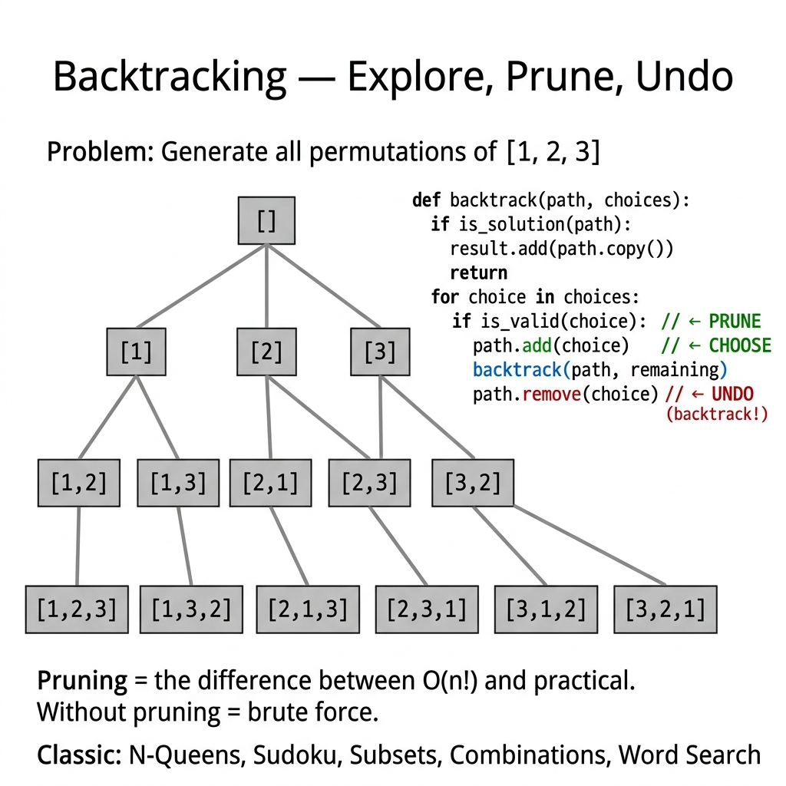

<!-- tags: dsa, algorithms -->
# 🔙 Backtracking

> **Category**: Brute Force + Pruning
> **Summary**: CHOOSE → EXPLORE → UNCHOOSE. Systematic enumeration with early termination.

📅 Created: 2026-03-20 · 🔄 Updated: 2026-04-09 · ⏱️ 15 min read

---

## 1. DEFINE

Some problems resist local greedy decisions or compact DP states. `Backtracking` requires building a decision space, exploring a branch, and reversing immediately upon hitting a dead end.

Pruning and partial solution representation make backtracking efficient. Recognizing a hopeless branch early reduces the search tree drastically.

Core insight: **Backtracking manages search trees and prunes efficiently instead of testing every possibility blindly.**

| Metric      | Value                         |
| ----------- | ----------------------------- |
| **Time**    | O(exponential) — depends on problem |
| **Space**   | O(depth) — recursion stack    |
| **Pattern** | Choose → Explore → Unchoose   |

### Template

```text
func backtrack(state, choices):
    if isSolution(state):
        record(state)
        return
    for choice in choices:
        if isValid(choice):
            CHOOSE: apply(choice)
            EXPLORE: backtrack(next_state, remaining_choices)
            UNCHOOSE: undo(choice)
```

---

| Variant | When To Use | Core Idea |
| ------- | ------- | ------- |
| N-Queens Solver | Need a trace-friendly baseline | Grasp the core invariant before optimizing |
| Sudoku Solver | Problem adds state or constraints | Keep the invariant but add state or cache |
| Permutations | Large inputs or clear optimization | Optimize via pruning or state compression |
| Subsets (Power Set) | Production-grade abstraction | Combine techniques for complex edge cases |

| Approach | Time | Space | When To Choose |
| --- | --- | --- | --- |
| N-Queens Solver | O(1) | Varies | Understand the invariant before optimization |
| Sudoku Solver | O(n) | O(log n) | Problem has moderate constraints |
| Permutations | Varies | Varies | Better scale or brute-force elimination |
| Subsets (Power Set) | Varies | Varies | Expand pattern for hard cases |

### 1.1 Quick Recognition

- The problem requires enumerating configurations or optimizing a small combinatorial space.
- A partial solution grows incrementally and validates early.
- Permutations, subsets, N-Queens, and Sudoku are classic signals.

### 1.2 Invariants & Failure Modes

- The temporary state must accurately represent all chosen decisions.
- Pruning conditions must execute immediately after adding a new decision.
- Common failure mode: writing recursive branch generation without defining early pruning constraints.

## 2. VISUAL

These foundational algorithms become clear when you see the state updates. This trace illuminates that process.

### Level 1 — Core intuition

```text
  N-Queens (N=4):
  Explore tree:

       root
      / | \ \
    Q1  Q2  Q3  Q4    ← row 0
    /|  /|
  Q3 Q4 Q1 Q4         ← row 1 (prune conflicts)
  ...
  Solution found: [1, 3, 0, 2]

    . Q . .
    . . . Q
    Q . . .
    . . Q .
```

---

*Caption*: 🔙 Backtracking at Level 1 shows core intuition. Level 2 details the state update order from input to answer.

### Level 2 — Decision trace

- Identify the core data structure or state primitive.
- Each update step must reduce search space or merge components.
- Keep boundary checks and rollbacks near the update for simpler reasoning.
- Correct results appear when auxiliary state reflects the original problem structure.




## 3. CODE

Code should highlight the state structure and update rules. Do not hide them behind early optimizations.

### Problem 1: Basic — N-Queens Solver
> **Goal**: Place N queens without attacks.
> **Approach**: Start with the core version. Move to practical variants to see the reusable invariant.
> **Example**: A small board allows manual tree tracing.
> **Complexity**: O(N!) time and O(N) space.

```go
package algo

import "fmt"

// SolveNQueens returns all valid board configurations.
func SolveNQueens(n int) [][]int {
    var results [][]int
    board := make([]int, n) // board[row] = col
    cols := make([]bool, n)
    diag1 := make([]bool, 2*n)
    diag2 := make([]bool, 2*n)

    var backtrack func(row int)
    backtrack = func(row int) {
        if row == n {
            sol := make([]int, n)
            copy(sol, board)
            results = append(results, sol)
            return
        }
        for col := 0; col < n; col++ {
            if cols[col] || diag1[row-col+n] || diag2[row+col] {
                continue // PRUNE
            }
            // CHOOSE
            board[row] = col
            cols[col] = true
            diag1[row-col+n] = true
            diag2[row+col] = true

            // EXPLORE
            backtrack(row + 1)

            // UNCHOOSE
            cols[col] = false
            diag1[row-col+n] = false
            diag2[row+col] = false
        }
    }

    backtrack(0)
    return results
}

// PrintNQueens displays the board visually.
func PrintNQueens(solution []int) {
    n := len(solution)
    for _, col := range solution {
        for j := 0; j < n; j++ {
            if j == col { fmt.Print("Q ") } else { fmt.Print(". ") }
        }
        fmt.Println()
    }
}
```

```typescript
function solveNQueens(n: number): number[][] {
    const results: number[][] = [], board = Array(n).fill(0);
    const cols = new Set<number>(), d1 = new Set<number>(), d2 = new Set<number>();
    const bt = (row: number) => {
        if (row === n) { results.push([...board]); return; }
        for (let col = 0; col < n; col++) {
            if (cols.has(col)||d1.has(row-col)||d2.has(row+col)) continue;
            board[row]=col; cols.add(col); d1.add(row-col); d2.add(row+col);
            bt(row+1);
            cols.delete(col); d1.delete(row-col); d2.delete(row+col);
        }
    };
    bt(0); return results;
}
```

```rust
fn solve_n_queens(n: usize) -> Vec<Vec<usize>> {
    let mut results = Vec::new();
    let mut board = vec![0; n];
    let mut cols = vec![false; n];
    let mut diag1 = vec![false; 2 * n];
    let mut diag2 = vec![false; 2 * n];

    fn backtrack(
        row: usize,
        n: usize,
        board: &mut Vec<usize>,
        cols: &mut Vec<bool>,
        diag1: &mut Vec<bool>,
        diag2: &mut Vec<bool>,
        results: &mut Vec<Vec<usize>>,
    ) {
        if row == n {
            results.push(board.clone());
            return;
        }
        for col in 0..n {
            let d1 = row + n - col;
            let d2 = row + col;
            if cols[col] || diag1[d1] || diag2[d2] {
                continue;
            }
            board[row] = col;
            cols[col] = true;
            diag1[d1] = true;
            diag2[d2] = true;
            backtrack(row + 1, n, board, cols, diag1, diag2, results);
            cols[col] = false;
            diag1[d1] = false;
            diag2[d2] = false;
        }
    }

    backtrack(0, n, &mut board, &mut cols, &mut diag1, &mut diag2, &mut results);
    results
}
```

```cpp
std::vector<std::vector<int>> solveNQueens(int n) {
    std::vector<std::vector<int>> results;
    std::vector<int> board(n), cols(n, false), diag1(2 * n, false), diag2(2 * n, false);

    std::function<void(int)> dfs = [&](int row) {
        if (row == n) {
            results.push_back(board);
            return;
        }
        for (int col = 0; col < n; ++col) {
            int d1 = row - col + n;
            int d2 = row + col;
            if (cols[col] || diag1[d1] || diag2[d2]) continue;
            board[row] = col;
            cols[col] = diag1[d1] = diag2[d2] = true;
            dfs(row + 1);
            cols[col] = diag1[d1] = diag2[d2] = false;
        }
    };

    dfs(0);
    return results;
}
```

```python
def solve_n_queens(n: int) -> list[list[int]]:
    results, board = [], [0]*n
    cols, d1, d2 = set(), set(), set()
    def bt(row: int):
        if row == n: results.append(board[:]); return
        for col in range(n):
            if col in cols or row-col in d1 or row+col in d2: continue
            board[row]=col; cols.add(col); d1.add(row-col); d2.add(row+col)
            bt(row+1)
            cols.discard(col); d1.discard(row-col); d2.discard(row+col)
    bt(0); return results
```

> **Why?** N-Queens Solver reduces the search space by tracking conflicts efficiently. The unchoose step restores the invariant cleanly.

> **Takeaway**: Fast arrays checking diagonal constraints prevents deep branch exploration.

### Problem 2: Intermediate — Sudoku Solver
> **Goal**: Fill a 9x9 grid legally.
> **Approach**: Try numbers and validate row, column, and box.
> **Example**: A partial board demonstrates recursive pruning.
> **Complexity**: O(9^(empty cells)) time and O(81) space.

```go
package algo

func SolveSudoku(board *[9][9]int) bool {
    for r := 0; r < 9; r++ {
        for c := 0; c < 9; c++ {
            if board[r][c] != 0 { continue }

            for num := 1; num <= 9; num++ {
                if isValidSudoku(board, r, c, num) {
                    board[r][c] = num     // CHOOSE
                    if SolveSudoku(board) { return true } // EXPLORE
                    board[r][c] = 0       // UNCHOOSE
                }
            }
            return false // no valid number triggers backtrack
        }
    }
    return true // all cells filled
}

func isValidSudoku(board *[9][9]int, row, col, num int) bool {
    for i := 0; i < 9; i++ {
        if board[row][i] == num { return false } // check row
        if board[i][col] == num { return false } // check col
        
        // check 3x3 box
        r := 3*(row/3) + i/3
        c := 3*(col/3) + i%3
        if board[r][c] == num { return false }
    }
    return true
}
```

```typescript
function solveSudoku(board: number[][]): boolean {
    const isValid = (r:number,c:number,num:number) => {
        for (let i=0;i<9;i++) { if (board[r][i]===num||board[i][c]===num) return false;
            const br=3*Math.floor(r/3)+Math.floor(i/3), bc=3*Math.floor(c/3)+i%3;
            if (board[br][bc]===num) return false; } return true; };
    for (let r=0;r<9;r++) for (let c=0;c<9;c++) {
        if (board[r][c]!==0) continue;
        for (let num=1;num<=9;num++) { if (isValid(r,c,num)) { board[r][c]=num; if (solveSudoku(board)) return true; board[r][c]=0; } }
        return false;
    }
    return true;
}
```

```rust
fn solve_sudoku(board: &mut [[i32; 9]; 9]) -> bool {
    fn is_valid(board: &[[i32; 9]; 9], row: usize, col: usize, num: i32) -> bool {
        for i in 0..9 {
            if board[row][i] == num || board[i][col] == num {
                return false;
            }
            let r = 3 * (row / 3) + i / 3;
            let c = 3 * (col / 3) + i % 3;
            if board[r][c] == num {
                return false;
            }
        }
        true
    }

    for row in 0..9 {
        for col in 0..9 {
            if board[row][col] != 0 {
                continue;
            }
            for num in 1..=9 {
                if is_valid(board, row, col, num) {
                    board[row][col] = num;
                    if solve_sudoku(board) {
                        return true;
                    }
                    board[row][col] = 0;
                }
            }
            return false;
        }
    }
    true
}
```

```cpp
bool isValidSudoku(const std::array<std::array<int, 9>, 9>& board, int row, int col, int num) {
    for (int i = 0; i < 9; ++i) {
        if (board[row][i] == num || board[i][col] == num) return false;
        int r = 3 * (row / 3) + i / 3;
        int c = 3 * (col / 3) + i % 3;
        if (board[r][c] == num) return false;
    }
    return true;
}

bool solveSudoku(std::array<std::array<int, 9>, 9>& board) {
    for (int row = 0; row < 9; ++row) {
        for (int col = 0; col < 9; ++col) {
            if (board[row][col] != 0) continue;
            for (int num = 1; num <= 9; ++num) {
                if (isValidSudoku(board, row, col, num)) {
                    board[row][col] = num;
                    if (solveSudoku(board)) return true;
                    board[row][col] = 0;
                }
            }
            return false;
        }
    }
    return true;
}
```

```python
def solve_sudoku(board: list[list[int]]) -> bool:
    def is_valid(r, c, num):
        for i in range(9):
            if board[r][i]==num or board[i][c]==num: return False
            br, bc = 3*(r//3)+i//3, 3*(c//3)+i%3
            if board[br][bc]==num: return False
        return True
    for r in range(9):
        for c in range(9):
            if board[r][c]!=0: continue
            for num in range(1, 10):
                if is_valid(r, c, num):
                    board[r][c] = num
                    if solve_sudoku(board):
                        return True
                    board[r][c] = 0
            return False
    return True
```

> **Why?** Sudoku Solver uses localized constraints to aggressively prune the decision tree. It prevents traversing useless search depths.

> **Takeaway**: Modifying the grid directly saves state allocation overhead during recursion.

### Problem 3: Advanced — Permutations
> **Goal**: Generate all array orderings.
> **Approach**: Track used elements and append to current path.
> **Example**: Tracing `[1, 2]` shows path growth and unchoosing.
> **Complexity**: O(N * N!) time and O(N) space.

```go
package algo

func Permutations(nums []int) [][]int {
    var results [][]int
    used := make([]bool, len(nums))
    var current []int

    var backtrack func()
    backtrack = func() {
        if len(current) == len(nums) {
            perm := make([]int, len(current))
            copy(perm, current)
            results = append(results, perm)
            return
        }
        for i, num := range nums {
            if used[i] { continue }
            used[i] = true
            current = append(current, num)
            backtrack()
            current = current[:len(current)-1]
            used[i] = false
        }
    }
    backtrack()
    return results
}
```

```typescript
function permutations(nums: number[]): number[][] {
    const results: number[][] = [], used = Array(nums.length).fill(false);
    const bt = (current: number[]) => {
        if (current.length === nums.length) { results.push([...current]); return; }
        for (let i = 0; i < nums.length; i++) {
            if (used[i]) continue;
            used[i]=true; current.push(nums[i]); bt(current); current.pop(); used[i]=false;
        }
    };
    bt([]); return results;
}
```

```rust
fn permutations(nums: &[i32]) -> Vec<Vec<i32>> {
    let mut results = Vec::new();
    let mut used = vec![false; nums.len()];
    let mut current = Vec::new();

    fn dfs(nums: &[i32], used: &mut [bool], current: &mut Vec<i32>, results: &mut Vec<Vec<i32>>) {
        if current.len() == nums.len() {
            results.push(current.clone());
            return;
        }
        for i in 0..nums.len() {
            if used[i] {
                continue;
            }
            used[i] = true;
            current.push(nums[i]);
            dfs(nums, used, current, results);
            current.pop();
            used[i] = false;
        }
    }

    dfs(nums, &mut used, &mut current, &mut results);
    results
}
```

```cpp
std::vector<std::vector<int>> permutations(const std::vector<int>& nums) {
    std::vector<std::vector<int>> results;
    std::vector<int> current;
    std::vector<bool> used(nums.size(), false);

    std::function<void()> dfs = [&]() {
        if (current.size() == nums.size()) {
            results.push_back(current);
            return;
        }
        for (size_t i = 0; i < nums.size(); ++i) {
            if (used[i]) continue;
            used[i] = true;
            current.push_back(nums[i]);
            dfs();
            current.pop_back();
            used[i] = false;
        }
    };

    dfs();
    return results;
}
```

```python
def permutations(nums: list[int]) -> list[list[int]]:
    results = []
    def bt(current: list[int], used: list[bool]):
        if len(current) == len(nums): results.append(current[:]); return
        for i, n in enumerate(nums):
            if used[i]: continue
            used[i]=True; current.append(n); bt(current, used); current.pop(); used[i]=False
    bt([], [False]*len(nums)); return results
```

> **Why?** Permutations require checking all states while enforcing element uniqueness within a single path.

> **Takeaway**: The `used` array efficiently prunes previously selected numbers.

### Problem 4: Expert — Subsets (Power Set)
> **Goal**: Generate all subsets.
> **Approach**: Include or exclude elements sequentially.
> **Example**: A short array traces the binary inclusion tree.
> **Complexity**: O(N * 2^N) time and O(N) space.

```go
package algo

func Subsets(nums []int) [][]int {
    var results [][]int
    var current []int

    var backtrack func(start int)
    backtrack = func(start int) {
        sub := make([]int, len(current))
        copy(sub, current)
        results = append(results, sub)

        for i := start; i < len(nums); i++ {
            current = append(current, nums[i])
            backtrack(i + 1)
            current = current[:len(current)-1]
        }
    }
    backtrack(0)
    return results
}
```

```typescript
function subsets(nums: number[]): number[][] {
    const results: number[][] = [];
    const bt = (start: number, current: number[]) => {
        results.push([...current]);
        for (let i = start; i < nums.length; i++) { current.push(nums[i]); bt(i+1, current); current.pop(); }
    };
    bt(0, []); return results;
}
```

```rust
fn subsets(nums: &[i32]) -> Vec<Vec<i32>> {
    let mut results = Vec::new();
    let mut current = Vec::new();

    fn dfs(start: usize, nums: &[i32], current: &mut Vec<i32>, results: &mut Vec<Vec<i32>>) {
        results.push(current.clone());
        for i in start..nums.len() {
            current.push(nums[i]);
            dfs(i + 1, nums, current, results);
            current.pop();
        }
    }

    dfs(0, nums, &mut current, &mut results);
    results
}
```

```cpp
std::vector<std::vector<int>> subsets(const std::vector<int>& nums) {
    std::vector<std::vector<int>> results;
    std::vector<int> current;

    std::function<void(int)> dfs = [&](int start) {
        results.push_back(current);
        for (int i = start; i < static_cast<int>(nums.size()); ++i) {
            current.push_back(nums[i]);
            dfs(i + 1);
            current.pop_back();
        }
    };

    dfs(0);
    return results;
}
```

```python
def subsets(nums: list[int]) -> list[list[int]]:
    results = []
    def bt(start: int, current: list[int]):
        results.append(current[:])
        for i in range(start, len(nums)): current.append(nums[i]); bt(i+1, current); current.pop()
    bt(0, []); return results
```

> **Why?** Subsets systematically explore combination spaces using an index constraint.

> **Takeaway**: Advancing the `start` index avoids generating duplicate sets.

### Problem 5: Expert — Combination Sum
> **Goal**: Find element combinations summing to a target.
> **Approach**: Subtract candidates until zero while allowing reuse.
> **Example**: A target value traces subtraction paths clearly.
> **Complexity**: O(N^(Target/min)) time and space.

```go
package algo

func CombinationSum(candidates []int, target int) [][]int {
    var results [][]int
    var current []int

    var backtrack func(start, remain int)
    backtrack = func(start, remain int) {
        if remain == 0 {
            combo := make([]int, len(current))
            copy(combo, current)
            results = append(results, combo)
            return
        }
        for i := start; i < len(candidates); i++ {
            if candidates[i] > remain { continue }
            current = append(current, candidates[i])
            backtrack(i, remain-candidates[i]) // i enables reuse
            current = current[:len(current)-1]
        }
    }
    backtrack(0, target)
    return results
}
```

```typescript
function combinationSum(candidates: number[], target: number): number[][] {
    const results: number[][] = [];
    const bt = (start: number, remain: number, current: number[]) => {
        if (remain === 0) { results.push([...current]); return; }
        for (let i = start; i < candidates.length; i++) {
            if (candidates[i] > remain) continue;
            current.push(candidates[i]); bt(i, remain - candidates[i], current); current.pop();
        }
    };
    bt(0, target, []); return results;
}
```

```rust
fn combination_sum(candidates: &[i32], target: i32) -> Vec<Vec<i32>> {
    let mut results = Vec::new();
    let mut current = Vec::new();

    fn dfs(
        start: usize,
        remain: i32,
        candidates: &[i32],
        current: &mut Vec<i32>,
        results: &mut Vec<Vec<i32>>,
    ) {
        if remain == 0 {
            results.push(current.clone());
            return;
        }
        for i in start..candidates.len() {
            if candidates[i] > remain {
                continue;
            }
            current.push(candidates[i]);
            dfs(i, remain - candidates[i], candidates, current, results);
            current.pop();
        }
    }

    dfs(0, target, candidates, &mut current, &mut results);
    results
}
```

```cpp
std::vector<std::vector<int>> combinationSum(const std::vector<int>& candidates, int target) {
    std::vector<std::vector<int>> results;
    std::vector<int> current;

    std::function<void(int, int)> dfs = [&](int start, int remain) {
        if (remain == 0) {
            results.push_back(current);
            return;
        }
        for (int i = start; i < static_cast<int>(candidates.size()); ++i) {
            if (candidates[i] > remain) continue;
            current.push_back(candidates[i]);
            dfs(i, remain - candidates[i]);
            current.pop_back();
        }
    };

    dfs(0, target);
    return results;
}
```

```python
def combination_sum(candidates: list[int], target: int) -> list[list[int]]:
    results = []
    def bt(start: int, remain: int, current: list[int]):
        if remain == 0: results.append(current[:]); return
        for i in range(start, len(candidates)):
            if candidates[i] > remain: continue
            current.append(candidates[i]); bt(i, remain - candidates[i], current); current.pop()
    bt(0, target, []); return results
```

> **Why?** Passing `i` into the recursive call permits candidate reuse while preventing backward permutations.

> **Takeaway**: Subtracting from the target isolates the base case cleanly.

---

## 4. PITFALLS

Foundation algorithms break when developers misuse the invariant that the structure protects.

| # | Severity | Defect | Consequence | Fix |
| --- | --- | --- | --- | --- |
| 1 | 🔴 Fatal | Forget UNCHOOSE state | Shared state pollution | Always undo choices |
| 2 | 🟡 Common | Append slice without copying | Overwritten results | Run `copy` before recording |
| 3 | 🟡 Common | No pruning causes TLE | Search tree explodes | Add constraints early |
| 4 | 🔵 Minor | Duplicate outputs generated | Redundant paths | Sort and skip adjacent identical |

---

## 5. REF

| Resource          | Link                                                                                      |
| ----------------- | ----------------------------------------------------------------------------------------- |
| Wikipedia         | [en.wikipedia.org](https://en.wikipedia.org/wiki/Backtracking)                            |
| CP-Algorithms     | [cp-algorithms.com](https://cp-algorithms.com/combinatorics/generating_combinations.html) |
| LeetCode N-Queens | [leetcode.com](https://leetcode.com/problems/n-queens/)                                   |

---

## 6. RECOMMEND

When you grasp this primitive, connect it to larger problems where it serves as a piece.

| Extension            | When To Use             | Reason               |
| ------------------ | ----------------------- | -------------------- |
| **Permutations**   | All orderings           | Swap-based logic           |
| **Combinations**   | Choose k from n         | Index tracking strategy      |
| **Subsets**        | Power set generation    | Include or exclude choice      |
| **N-Queens**       | Constraint satisfaction | Classic backtracking setup |
| **Sudoku Solver**  | Constraint propagation  | Backtrack with pruning  |
| **Branch & Bound** | Optimization goals      | Prune by bound value      |

---

## 7. QUICK REF

| # | Pattern | Code |
|---|---------|------|
| 1 | Template | `func backtrack(state State) { if isGoal(state) { addResult(state); return }; for _, choice := range choices(state) { if isValid(choice) { apply(choice); backtrack(state); undo(choice) } } }` |
| 2 | Permutations | `used := make([]bool, n); /* choose unused, mark, recurse, unmark */` |
| 3 | Subsets | `for i := start; i < n; i++ { path=append(path,nums[i]); backtrack(i+1); path=path[:len(path)-1] }` |
| 4 | N-Queens | `// Place queen per row, check col+diag conflicts` |
| 5 | Pruning | `if currentCost >= bestCost { return }  // branch and bound` |
| 6 | Complexity | `// O(b^d) where b=branching d=depth · pruning reduces tree` |
| 7 | When to use | `// Permutations, combinations, constraint satisfaction, puzzles` |

**Links**: [← A\*](./04-a-star.md) · [← README](./README.md)

---

Why is backtracking not just brute force? Pruning through `isValid()` checks eliminates infeasible subtrees early. Without pruning, the algorithm runs in O(N!). With smart pruning, it becomes practical. N-Queens drops from 8! tests to a few hundred nodes.
