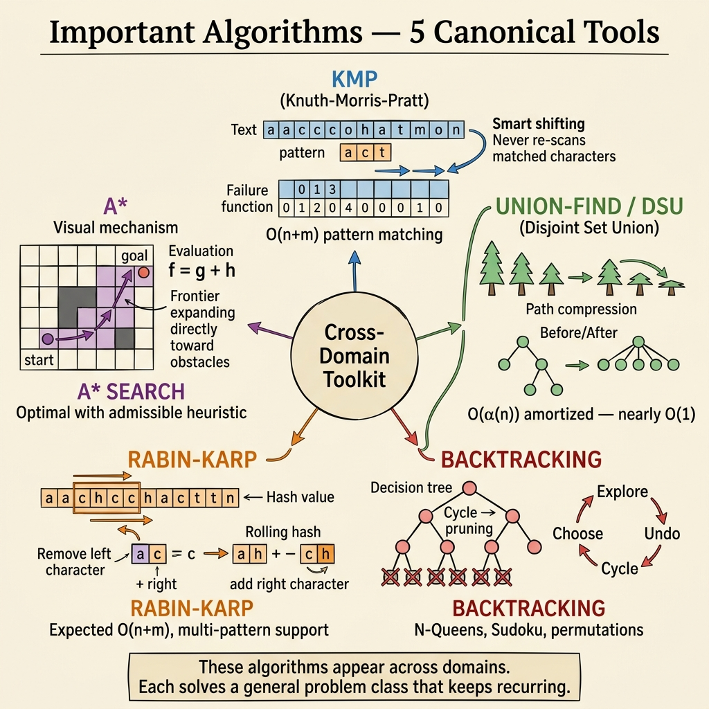

<!-- tags: dsa, algorithms, important-algorithms, overview -->
# Important Algorithms — Canonical Tools Beyond the Usual Lanes

> Some algorithms do not fit neatly into array, graph, or DP lanes. You still encounter them repeatedly because they solve specific tensions. This module gathers those tools.

📅 Created: 2026-04-04 · 🔄 Updated: 2026-04-09 · ⏱️ 8 min read

| Aspect | Detail |
| ------ | ------ |
| **Focus** | DSU, string matching, heuristic search, backtracking |
| **Role** | Specialized toolset for hard tensions that resist generic patterns |
| **Mindset** | Do not learn this as a checklist. Learn when to pull each tool out. |

---

## 1. DEFINE

Imagine you are in an interview. The whiteboard is empty. The clock is ticking. Important algorithms require you to spot the pattern before brute force consumes all your time.

Sometimes generic patterns fall short. You need a fast set merger, a linear string matcher, a pathfinding heuristic, or a clear trial-and-error frame. These algorithms shine here.

Union-Find, KMP, Rabin-Karp, A*, and Backtracking seem unrelated. They share one trait. Each solves a specific friction that generic patterns cannot replace neatly.

This hub organizes topics by the friction that breaks basic lanes.

### Module Contents
| Article | Core Friction | Core Idea | Link |
| --- | --- | --- | --- |
| Union-Find | Repeated connectivity merge and query | Representative root + path compression + union by rank | [01-union-find.md](./01-union-find.md) |
| KMP | String matching repeats useless prefixes | Failure function reuses known prefixes | [02-kmp.md](./02-kmp.md) |
| Rabin-Karp | Fast window matching on strings | Rolling hash enables O(1) updates | [03-rabin-karp.md](./03-rabin-karp.md) |
| A* Search | Directed shortest path search | g(n) + h(n) guides the path | [04-a-star.md](./04-a-star.md) |
| Backtracking | Branching search tree needs controlled trials | State mutation + undo + prune | [05-backtracking.md](./05-backtracking.md) |

## 2. VISUAL

These five algorithms exist for specific frictions that generic patterns cannot replace. The image below maps each tool to the tension it resolves and shows why it belongs outside the standard lanes.



*Image: Five cross-domain tools, each solving a friction that breaks basic lanes. Union-Find handles connectivity merge. KMP and Rabin-Karp solve string matching with different trade-offs. A\* guides pathfinding with heuristics. Backtracking structures trial-and-undo search.*

```text
Annoying problem outside basic lanes
  |
  +-- Many connectivity queries and merges? -> Union-Find
  +-- Exact string matching repeats prefixes? -> KMP
  +-- Many string windows need fast hashes? -> Rabin-Karp
  +-- Pathfinding has a useful heuristic? -> A*
  +-- Search tree needs trial and undo? -> Backtracking
```
*Figure: Text fallback — these algorithms exist for specific frictions, not because they are advanced.*

## 3. CODE

Do not read this module as a mandatory checklist. Read it based on the tension you face.

| Tension | Target File | Key Focus | Common Handoff |
| --- | --- | --- | --- |
| Dynamic connectivity | [01-union-find.md](./01-union-find.md) | Find and union approach O(1) via path compression | Graph MST or component problems |
| Exact pattern matching | [02-kmp.md](./02-kmp.md) | Failure function reuses matching prefixes | String algorithms |
| Window hashing | [03-rabin-karp.md](./03-rabin-karp.md) | Rolling hash updates without full rehashing | Substring search or deduplication |
| Guided pathfinding | [04-a-star.md](./04-a-star.md) | Admissible heuristic role | Graph shortest path |
| Search with undo | [05-backtracking.md](./05-backtracking.md) | Choose -> recurse -> undo -> prune | Constraint problems or combinatorics |

## 4. PITFALLS

Foundation algorithms rarely break at the surface API. They break when developers violate the invariant that the structure protects.

| Pitfall | Signal | Why It Fails | Fix | Severity |
| ------- | -------- | ---------- | -------- | -------- |
| Memorizing as interview tricks | Knowing the name without the use case | Specialized tools lose value without specific tension | Attach each algorithm to its core friction | high |
| Treating Rabin-Karp as absolute | Ignoring collision reasoning | Hash filters fast but requires verification | Distinguish hashing from exact proofs like KMP | medium |
| Trusting A* heuristic blindly | Fast but suboptimal path found | Invalid heuristic breaks guarantees | Ensure the heuristic underestimates cost | high |
| Backtracking without pruning | Search tree explodes immediately | Undo is not enough without pruning | Identify constraints early to prune bad paths | high |

## 5. REF

- Module files: [01-union-find.md](./01-union-find.md) to [05-backtracking.md](./05-backtracking.md)
- Graph adjacency: [../graph/README.md](../graph/README.md)
- String adjacency: [../string-algorithms/README.md](../string-algorithms/README.md)

## 6. RECOMMEND

You should build a clear toolbelt. Know which tool to pull out for each tension.

- If connectivity leads to graph spanning, refer to [../graph/README.md](../graph/README.md).
- If exact matching is the focus, see [../string-algorithms/README.md](../string-algorithms/README.md).
- If backtracking needs a state table, return to [../dynamic-programming/README.md](../dynamic-programming/README.md).

## 7. QUICK REF

- Specialized tools shine under specific tension.
- Heuristics, hashes, and prunes need correct conditions.
- Do not learn algorithm names isolated from their friction.
