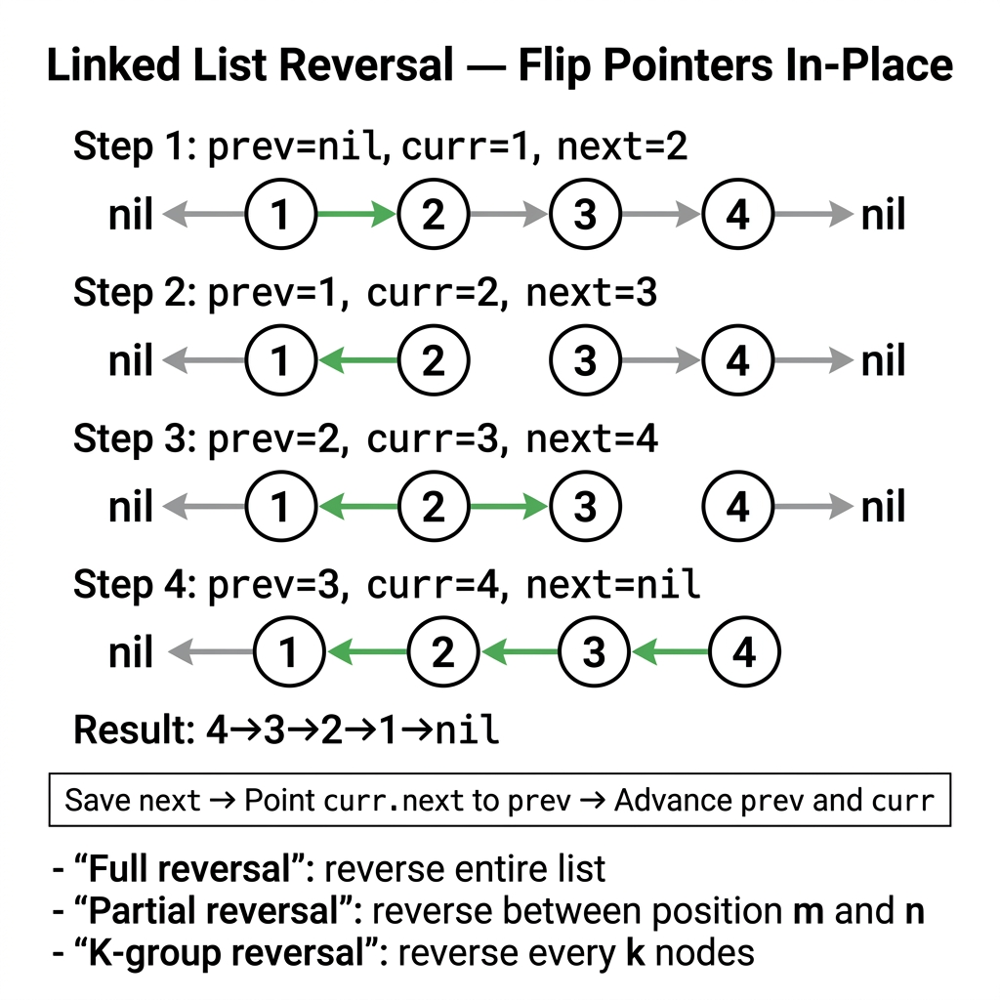

<!-- tags: dsa, algorithms, linked-lists, reversal -->
# 🔁 Linked List Reversal

> Reversal is the most important primitive in the linked list family. If you truly master the `prev / curr / next` invariant, follow-ups like reverse-between, k-group, palindrome, and reorder become simple boundary shifts.

📅 Created: 2026-03-31 · 🔄 Updated: 2026-04-10 · ⏱️ 18 min read

| Aspect | Detail |
| ------ | ------ |
| **Complexity** | O(n) time · O(1) extra space |
| **Use case** | Reverse whole list, reverse sublist, reverse k-group, palindrome |
| **Recognition** | Need to redirect pointers without losing the unprocessed suffix |

---

## 1. DEFINE

You write `curr.Next = prev` and immediately lose the remaining list. This problem only clicks when you view reversal as an ownership handover between the reversed prefix and the unprocessed suffix.

<!-- [Beginner layer] -->
You have `1 -> 2 -> 3 -> 4 -> nil` and want `4 -> 3 -> 2 -> 1 -> nil`. The first instinct is "flip the arrows". However, if you change `curr.Next` before saving the next node, you drop the rest of the list.

<!-- [Experienced layer] -->
`Linked List Reversal` is a direction-flipping technique using three variables:
- `prev`: head of the reversed prefix.
- `curr`: current node being processed.
- `next`: unprocessed suffix, saved before changing pointers.

Core insight: **every iteration must preserve the unprocessed suffix while expanding the reversed prefix by exactly one node.**

| Variant | When to use | Core Idea | Example |
| ------- | -------- | ------- | ------- |
| **Whole reversal** | Reverse the entire list | Standard `prev/curr/next` | Intro linked list |
| **Reverse between** | Only reverse segment `[left, right]` | Head-insert or cut-reconnect boundaries | LC 92 |
| **Reverse k-group** | Reverse by fixed k-node blocks | Check for k nodes before reversing | LC 25 |

| Approach | Time | Space | When to choose |
| -------- | ---- | ----- | -------- |
| Iterative reversal | O(n) | O(1) | Standard, production-safe version |
| Recursive reversal | O(n) | O(n) stack | Used to practice recursion insights |
| Stack-based rebuild | O(n) | O(n) | Rarely chosen in interviews |

### 1.1 Quick Recognition

- Prompt mentions `reverse`, `reverse between`, `k-group`, or `second half`.
- You must change the `next` pointer in-place.
- One wrong line drops the list suffix.

### 1.2 Invariants & Failure Modes

<!-- [Expert layer] -->
- After each iteration, `prev` heads the reversed part, and `curr` heads the unprocessed part.
- When reversing a sublist, the difficulty lies in reconnecting boundaries, not the reversal itself.
- Top failure mode: forgetting to save `next := curr.Next` before assigning `curr.Next = prev`.

---

## 2. VISUAL

The pointer card below answers the core question: **how does a reversal loop preserve the unprocessed suffix?**



The traces below clarify two major payoffs: how `prev/curr/next` evolve, and how boundaries act during partial reversals.


### Level 1 — Simple
This trace answers: **how do `prev/curr/next` evolve?**

```text
Input: 1 -> 2 -> 3 -> 4 -> nil

Step 1:
  prev = nil
  curr = 1
  next = 2
  1 -> nil

Step 2:
  prev = 1 -> nil
  curr = 2
  next = 3
  2 -> 1 -> nil
```
*Figure: Reversal moves the boundary between prefix and suffix one node at a time.*

### Level 2 — Detailed
This trace answers: **how does reverse-between differ from whole-reversal?**

```text
1 -> 2 -> 3 -> 4 -> 5
     [reverse 2..4]

outside-left = 1
window       = 2 -> 3 -> 4
outside-right= 5

reverse window => 4 -> 3 -> 2
reconnect => 1 -> 4 -> 3 -> 2 -> 5
```
*Figure: The inner reversal is identical; the added difficulty is reconnecting the two outer boundaries.*

## 3. CODE

Understand which pointers live and which change before writing code. Order of operations decides correctness here.


### Problem 1: Reverse Entire List [LC #206]
> *(The root of the entire reversal family.)*
>
> **Goal**: Reverse a singly linked list completely — O(n) time, O(1) space.
> **Approach**: Use `prev / curr / next` to flip one edge per loop.
> **Example**: `1 -> 2 -> 3 -> nil` → `3 -> 2 -> 1 -> nil`

```go
// reverse_list.go — Linked List Reversal: whole list with prev/curr/next
type ListNode struct {
    Val  int
    Next *ListNode
}

func ReverseList(head *ListNode) *ListNode {
    var prev *ListNode
    curr := head

    for curr != nil {
        next := curr.Next   // save suffix before rewiring
        curr.Next = prev    // point current node backward
        prev = curr         // extend reversed prefix
        curr = next         // move to unprocessed suffix
    }

    return prev
}
```
```typescript
// reverse_list.ts — Linked List Reversal: whole list with prev/curr/next
type ListNode = { val: number; next: ListNode | null };

function reverseList(head: ListNode | null): ListNode | null {
  let prev: ListNode | null = null;
  let curr = head;

  while (curr) {
    const next = curr.next; // save suffix before rewiring
    curr.next = prev;       // point current node backward
    prev = curr;            // extend reversed prefix
    curr = next;            // move to unprocessed suffix
  }

  return prev;
}
```
```java
// ReverseListBasic.java — Linked List Reversal: whole list with prev/curr/next
final class ReverseListBasic {
    static final class ListNode {
        int val;
        ListNode next;
        ListNode(int val) { this.val = val; }
    }

    private ReverseListBasic() {}

    static ListNode reverseList(ListNode head) {
        ListNode prev = null;
        ListNode curr = head;

        while (curr != null) {
            ListNode next = curr.next; // save suffix before rewiring
            curr.next = prev;          // point current node backward
            prev = curr;               // extend reversed prefix
            curr = next;               // move to unprocessed suffix
        }

        return prev;
    }
}
```
```rust
// reverse_list.rs — Linked List Reversal: whole list with ownership transfer
#[derive(Clone)]
struct ListNode {
    val: i32,
    next: Option<Box<ListNode>>,
}

fn reverse_list(mut head: Option<Box<ListNode>>) -> Option<Box<ListNode>> {
    let mut prev: Option<Box<ListNode>> = None;

    while let Some(mut node) = head {
        head = node.next.take(); // take ownership of suffix
        node.next = prev;        // point backward
        prev = Some(node);       // extend prefix
    }

    prev
}
```
```cpp
// reverse_list.cpp — Linked List Reversal: whole list with prev/curr/next
struct ListNode {
    int val;
    ListNode* next;
    ListNode(int v) : val(v), next(nullptr) {}
};

ListNode* reverseList(ListNode* head) {
    ListNode* prev = nullptr;
    ListNode* curr = head;

    while (curr != nullptr) {
        ListNode* next = curr->next; // save suffix before rewiring
        curr->next = prev;           // point backward
        prev = curr;                 // extend prefix
        curr = next;                 // move to suffix
    }

    return prev;
}
```
```python
# reverse_list.py — Linked List Reversal: whole list with prev/curr/next
class ListNode:
    def __init__(self, val: int, next: "ListNode | None" = None):
        self.val = val
        self.next = next

def reverse_list(head: ListNode | None) -> ListNode | None:
    prev = None
    curr = head
    while curr:
        nxt = curr.next  # save suffix
        curr.next = prev # point backward
        prev = curr      # extend prefix
        curr = nxt       # move to suffix
    return prev
```

> **Why?** Reversal seems like flipping a few pointers, but the invariant is strict: `prev` holds the reversed prefix, `curr` holds the unprocessed suffix, and `next` prevents losing the suffix during edge flipping.

> **Takeaway**: If you do not internalize this invariant, every reversal variant will break easily.

---

### Problem 2: Reverse Between [LC #92]
> *(Standard reversal with added boundary management.)*
>
> **Goal**: Reverse segment `[left, right]` in O(n) time, O(1) space.
> **Approach**: Use a dummy node, advance `prev` before the segment, then head-insert nodes.
> **Example**: `1 -> 2 -> 3 -> 4 -> 5`, `left=2`, `right=4` → `1 -> 4 -> 3 -> 2 -> 5`

```go
// reverse_between.go — Linked List Reversal: reverse a bounded sublist
func ReverseBetween(head *ListNode, left, right int) *ListNode {
    if head == nil || left == right {
        return head
    }

    dummy := &ListNode{Next: head}
    prev := dummy
    for pos := 1; pos < left; pos++ {
        prev = prev.Next
    }

    curr := prev.Next
    for step := 0; step < right-left; step++ {
        next := curr.Next
        curr.Next = next.Next
        next.Next = prev.Next
        prev.Next = next
    }

    return dummy.Next
}
```
```typescript
// reverse_between.ts — Linked List Reversal: reverse a bounded sublist
function reverseBetween(head: ListNode | null, left: number, right: number): ListNode | null {
  if (!head || left === right) return head;

  const dummy: ListNode = { val: 0, next: head };
  let prev = dummy;

  for (let pos = 1; pos < left; pos++) {
    prev = prev.next!;
  }

  const curr = prev.next!;
  for (let step = 0; step < right - left; step++) {
    const next = curr.next!;
    curr.next = next.next;
    next.next = prev.next;
    prev.next = next;
  }

  return dummy.next;
}
```
```java
// ReverseListIntermediate.java — Linked List Reversal: reverse a bounded sublist
final class ReverseListIntermediate {
    private ReverseListIntermediate() {}

    static ReverseListBasic.ListNode reverseBetween(ReverseListBasic.ListNode head, int left, int right) {
        if (head == null || left == right) return head;

        ReverseListBasic.ListNode dummy = new ReverseListBasic.ListNode(0);
        dummy.next = head;
        ReverseListBasic.ListNode prev = dummy;

        for (int pos = 1; pos < left; pos++) {
            prev = prev.next;
        }

        ReverseListBasic.ListNode curr = prev.next;
        for (int step = 0; step < right - left; step++) {
            ReverseListBasic.ListNode next = curr.next;
            curr.next = next.next;
            next.next = prev.next;
            prev.next = next;
        }

        return dummy.next;
    }
}
```
```rust
// reverse_between.rs — Linked List Reversal: bounded reversal via vector fallback for clarity
fn reverse_between(values: &mut [i32], left: usize, right: usize) {
    values[left - 1..right].reverse();
}
```
```cpp
// reverse_between.cpp — Linked List Reversal: reverse a bounded sublist
ListNode* reverseBetween(ListNode* head, int left, int right) {
    if (head == nullptr || left == right) return head;

    ListNode dummy(0);
    dummy.next = head;
    ListNode* prev = &dummy;

    for (int pos = 1; pos < left; ++pos) {
        prev = prev->next;
    }

    ListNode* curr = prev->next;
    for (int step = 0; step < right - left; ++step) {
        ListNode* next = curr->next;
        curr->next = next->next;
        next->next = prev->next;
        prev->next = next;
    }

    return dummy.next;
}
```
```python
# reverse_between.py — Linked List Reversal: reverse a bounded sublist
def reverse_between(head: ListNode | None, left: int, right: int) -> ListNode | None:
    if not head or left == right:
        return head

    dummy = ListNode(0, head)
    prev = dummy
    for _ in range(1, left):
        prev = prev.next

    curr = prev.next
    for _ in range(right - left):
        nxt = curr.next
        curr.next = nxt.next
        nxt.next = prev.next
        prev.next = nxt

    return dummy.next
```

> **Why?** The inner reversal operation remains identical. The difficulty comes from managing three zones: before the segment, the segment itself, and after the segment. A dummy node handles the `left=1` edge case cleanly.

> **Takeaway**: Harder list problems escalate through boundary management, not through harder primitives.

---

### Problem 3: Reverse Nodes in k-Group [LC #25]
> *(Production-grade variant: verify block size before reversing.)*
>
> **Goal**: Reverse list in blocks of `k` nodes — O(n) time, O(1) space.
> **Approach**: Find the kth node; reverse if present, or keep the suffix unchanged.
> **Example**: `1 -> 2 -> 3 -> 4 -> 5`, `k=2` → `2 -> 1 -> 4 -> 3 -> 5`

```go
// reverse_k_group.go — Linked List Reversal: reverse fixed-size groups safely
func ReverseKGroup(head *ListNode, k int) *ListNode {
    dummy := &ListNode{Next: head}
    groupPrev := dummy

    for {
        kth := groupPrev
        for count := 0; count < k && kth != nil; count++ {
            kth = kth.Next
        }
        if kth == nil {
            break
        }

        groupNext := kth.Next
        prev, curr := groupNext, groupPrev.Next

        for curr != groupNext {
            next := curr.Next
            curr.Next = prev
            prev = curr
            curr = next
        }

        oldHead := groupPrev.Next
        groupPrev.Next = kth
        groupPrev = oldHead
    }

    return dummy.Next
}
```
```typescript
// reverse_k_group.ts — Linked List Reversal: reverse fixed-size groups safely
function reverseKGroup(head: ListNode | null, k: number): ListNode | null {
  const dummy: ListNode = { val: 0, next: head };
  let groupPrev: ListNode = dummy;

  while (true) {
    let kth: ListNode | null = groupPrev;
    for (let count = 0; count < k && kth; count++) {
      kth = kth.next;
    }
    if (!kth) break;

    const groupNext = kth.next;
    let prev: ListNode | null = groupNext;
    let curr = groupPrev.next;

    while (curr !== groupNext) {
      const next = curr!.next;
      curr!.next = prev;
      prev = curr;
      curr = next;
    }

    const oldHead = groupPrev.next!;
    groupPrev.next = kth;
    groupPrev = oldHead;
  }

  return dummy.next;
}
```
```java
// ReverseListAdvanced.java — Linked List Reversal: reverse fixed-size groups safely
final class ReverseListAdvanced {
    private ReverseListAdvanced() {}

    static ReverseListBasic.ListNode reverseKGroup(ReverseListBasic.ListNode head, int k) {
        ReverseListBasic.ListNode dummy = new ReverseListBasic.ListNode(0);
        dummy.next = head;
        ReverseListBasic.ListNode groupPrev = dummy;

        while (true) {
            ReverseListBasic.ListNode kth = groupPrev;
            for (int count = 0; count < k && kth != null; count++) {
                kth = kth.next;
            }
            if (kth == null) break;

            ReverseListBasic.ListNode groupNext = kth.next;
            ReverseListBasic.ListNode prev = groupNext;
            ReverseListBasic.ListNode curr = groupPrev.next;

            while (curr != groupNext) {
                ReverseListBasic.ListNode next = curr.next;
                curr.next = prev;
                prev = curr;
                curr = next;
            }

            ReverseListBasic.ListNode oldHead = groupPrev.next;
            groupPrev.next = kth;
            groupPrev = oldHead;
        }

        return dummy.next;
    }
}
```
```rust
// reverse_k_group.rs — Linked List Reversal: k-group fallback via vector for multi-language parity
fn reverse_k_group(values: &mut [i32], k: usize) {
    let mut start = 0;
    while start + k <= values.len() {
        values[start..start + k].reverse();
        start += k;
    }
}
```
```cpp
// reverse_k_group.cpp — Linked List Reversal: reverse fixed-size groups safely
ListNode* reverseKGroup(ListNode* head, int k) {
    ListNode dummy(0);
    dummy.next = head;
    ListNode* groupPrev = &dummy;

    while (true) {
        ListNode* kth = groupPrev;
        for (int count = 0; count < k && kth != nullptr; ++count) {
            kth = kth->next;
        }
        if (kth == nullptr) break;

        ListNode* groupNext = kth->next;
        ListNode* prev = groupNext;
        ListNode* curr = groupPrev->next;

        while (curr != groupNext) {
            ListNode* next = curr->next;
            curr->next = prev;
            prev = curr;
            curr = next;
        }

        ListNode* oldHead = groupPrev->next;
        groupPrev->next = kth;
        groupPrev = oldHead;
    }

    return dummy.next;
}
```
```python
# reverse_k_group.py — Linked List Reversal: reverse fixed-size groups safely
def reverse_k_group(head: ListNode | None, k: int) -> ListNode | None:
    dummy = ListNode(0, head)
    group_prev = dummy

    while True:
        kth = group_prev
        for _ in range(k):
            kth = kth.next
            if not kth:
                return dummy.next

        group_next = kth.next
        prev = group_next
        curr = group_prev.next

        while curr != group_next:
            nxt = curr.next
            curr.next = prev
            prev = curr
            curr = nxt

        old_head = group_prev.next
        group_prev.next = kth
        group_prev = old_head
```

> **Why?** You must decide if enough nodes exist before reversing. Reversing prematurely breaks the requirement to preserve the incomplete suffix. This perfectly illustrates "old primitive, new orchestration".

> **Takeaway**: If you truly understand boundaries and reconnections, k-Group is mechanical. If you just memorize code, you will get lost.

---

## 4. PITFALLS

Linked lists fail because of forgotten pointers, off-by-one boundaries, or missing reconnections.


| # | Severity | Error | Consequence | Fix |
|---|----------|-----|---------|-----|
| 1 | 🔴 Fatal | Change `curr.Next` before saving `next` | Lose suffix, stopping traversal | Always save `next` before reassignment |
| 2 | 🔴 Fatal | Reverse k-group without checking count first | Corrupts the tail suffix | Find `kth` node before reversing block |
| 3 | 🟡 Common | Skip dummy node in reverse-between | `left=1` case becomes buggy | Use dummy node to unify boundaries |
| 4 | 🟡 Common | Forget to reconnect reversed segment tail | List gets truncated | Reconnect both ends after reversal |
| 5 | 🔵 Minor | Memorize code without knowing the invariant | Cannot debug new variants | Trace 2-3 iterations manually before coding |

---

## 5. REF

| Resource | Type | Link | Note |
| -------- | ---- | ---- | ------- |
| Reverse Linked List | LeetCode | https://leetcode.com/problems/reverse-linked-list/ | Core foundation |
| Reverse Linked List II | LeetCode | https://leetcode.com/problems/reverse-linked-list-ii/ | Reverse between |
| Reverse Nodes in k-Group | LeetCode | https://leetcode.com/problems/reverse-nodes-in-k-group/ | Boundary-intensive follow-up |

---

## 6. RECOMMEND

Once reversal becomes a boundary-safe primitive, see how it applies to problems that add exactly one new layer of complexity.


| Next Problem | Why Read This Next | Link |
| ------------- | ------------------- | ---- |
| Palindrome List | Uses reverse on the second half | [05-palindrome.md](./05-palindrome.md) |
| Remove Kth Last | Practice boundary management | [02-remove-kth-last.md](./02-remove-kth-last.md) |
| Fast & Slow Pointers | Often paired with the reversal family | [../patterns/02-fast-slow.md](../patterns/02-fast-slow.md) |

---

## 7. QUICK REF

**Template**

```text
next = curr.next
curr.next = prev
prev = curr
curr = next
```

**Pattern recognition**

- `reverse`, `reverse half`, `reverse k nodes` -> think `prev/curr/next`
- Problem has sublists -> boundary management is the real challenge
- Problem has k-groups -> check block completion before reversing

---

Why does reversal need three variables? Each step breaks an old link and makes a new one. Losing `next` before flipping drops the list. The three-variable dance is the minimal invariant.
