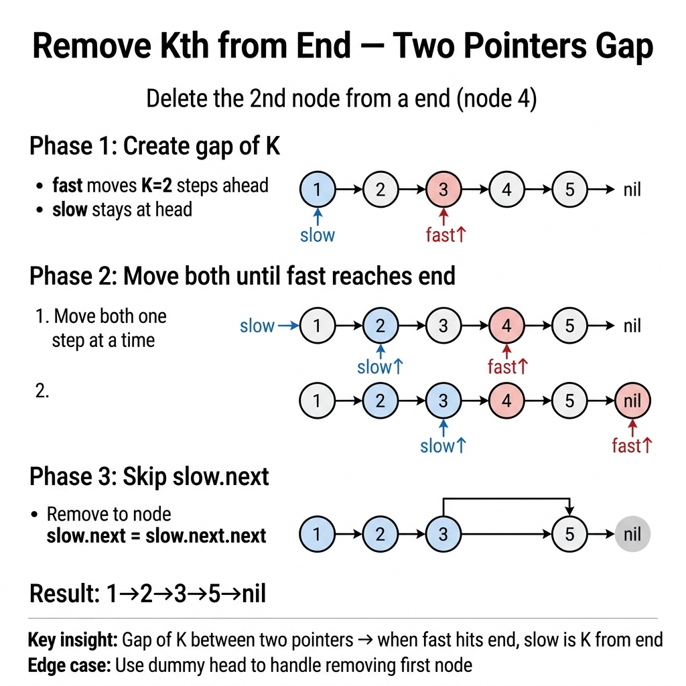

<!-- tags: dsa, algorithms, linked-lists, two-pointers -->
# ✂️ Remove Kth Node From End

> Two pointers on a linked list are not just about scanning from both ends. This problem is about maintaining a fixed distance between `fast` and `slow`, adding a crucial boundary check since the target node might be the head.

📅 Created: 2026-03-31 · 🔄 Updated: 2026-04-10 · ⏱️ 16 min read

| Aspect | Detail |
| ------ | ------ |
| **Complexity** | O(n) time · O(1) extra space |
| **Use case** | Remove nth from end, window offset, predecessor tracking |
| **Recognition** | Maintain a fixed `k` node distance between two pointers |

---

## 1. DEFINE

<!-- [Beginner layer] -->

<!-- [Beginner layer] -->
You must remove the `k`th node from the end. Counting from the front requires knowing the total length first. That approach requires two passes.

<!-- [Experienced layer] -->
A more elegant way uses two pointers separated by exactly `k` steps. When `fast` reaches the end, `slow` stops right before the target node. This converts "counting from the end" into "moving together with a fixed gap".

Core insight: **we do not need the absolute index; we just need the relative distance between pointers.**

| Variant | When to use | Core Idea | Example |
| ------- | -------- | ------- | ------- |
| **Two-pass** | Want an easily proven baseline | Measure length, then remove | Intro solution |
| **One-pass fast/slow** | Standard interview answer | Maintain k-step gap | LC 19 |
| **Recursive backtracking** | Practice recursion limits | Count backwards on stack unwind | Follow-up |

| Approach | Time | Space | When to choose |
| -------- | ---- | ----- | -------- |
| Two-pass | O(n) | O(1) | Easy baseline to explain |
| One-pass | O(n) | O(1) | Best interview answer |
| Recursive | O(n) | O(n) stack | Only to demonstrate recursive thought |

### 1.1 Quick Recognition

- Prompt specifies `kth from end` or `nth from end`.
- You need the predecessor of the target node.
- A dummy node almost always cleans up the code.

### 1.2 Invariants & Failure Modes

<!-- [Expert layer] -->
- If `fast` moves `k` steps ahead and `slow` starts at the dummy node, `slow.Next` is the target node when `fast.Next == nil`.
- The dummy node safely handles cases where the head gets removed.
- Common failure mode: advancing `fast` by `k-1` or `k+1` steps removes the wrong node.

---

## 2. VISUAL

The card below answers the core question: **how does a fixed pointer distance encode the position from the end?**



The traces connect this gap to the two most error-prone boundaries: finding the predecessor and handling a removed head.


### Level 1 — Simple
This trace answers: **how does the `k` distance help?**

```text
List: 1 -> 2 -> 3 -> 4 -> 5, k = 2

Advance fast 2 steps:
dummy -> 1 -> 2 -> 3 -> 4 -> 5
slow
           fast

Move both:
slow -> 1 -> 2 -> 3
fast -> 3 -> 4 -> 5

When fast is at tail, slow.next = target node (4)
```
*Figure: The fixed gap transforms "counting backwards" into "predecessor tracking by distance".*

### Level 2 — Detailed
This trace answers: **why does a dummy node save the remove-head case?**

```text
List: 1 -> 2 -> 3, k = 3

Without dummy:
  need to remove head directly -> special-case

With dummy:
  dummy -> 1 -> 2 -> 3
  slow starts at dummy
  when fast reaches tail, slow still at dummy
  slow.next is head -> remove uniformly
```
*Figure: The dummy node makes "removing head" identical to removing any other node.*

## 3. CODE

Understand pointer lifespans before coding. Order of operations defines correctness here.


### Problem 1: Two-Pass Baseline
> *(Easiest baseline to prove correct.)*
>
> **Goal**: Remove the `k`th node from the end by measuring length first.
> **Approach**: Pass 1 counts nodes, pass 2 stops at the predecessor.
> **Example**: `1 -> 2 -> 3 -> 4 -> 5`, `k=2` → `1 -> 2 -> 3 -> 5`

```go
// remove_kth_last_two_pass.go — Linked List: length first, deletion second
func RemoveNthFromEndTwoPass(head *ListNode, n int) *ListNode {
    length := 0
    for node := head; node != nil; node = node.Next {
        length++
    }

    dummy := &ListNode{Next: head}
    prev := dummy
    steps := length - n
    for i := 0; i < steps; i++ {
        prev = prev.Next
    }

    prev.Next = prev.Next.Next // remove node
    return dummy.Next
}
```
```typescript
// remove_kth_last_two_pass.ts — Linked List: length first, deletion second
function removeNthFromEndTwoPass(head: ListNode | null, n: number): ListNode | null {
  let length = 0;
  for (let node = head; node; node = node.next) length++;

  const dummy: ListNode = { val: 0, next: head };
  let prev = dummy;
  for (let i = 0; i < length - n; i++) {
    prev = prev.next!;
  }
  prev.next = prev.next!.next; // remove node
  return dummy.next;
}
```
```java
// RemoveKthLastBasic.java — Linked List: length first, deletion second
final class RemoveKthLastBasic {
    private RemoveKthLastBasic() {}

    static ReverseListBasic.ListNode removeNthFromEndTwoPass(ReverseListBasic.ListNode head, int n) {
        int length = 0;
        for (ReverseListBasic.ListNode node = head; node != null; node = node.next) {
            length++;
        }

        ReverseListBasic.ListNode dummy = new ReverseListBasic.ListNode(0);
        dummy.next = head;
        ReverseListBasic.ListNode prev = dummy;

        for (int i = 0; i < length - n; i++) {
            prev = prev.next;
        }

        prev.next = prev.next.next; // remove node
        return dummy.next;
    }
}
```
```rust
// remove_kth_last_two_pass.rs — Linked List: vector fallback for counting semantics
fn remove_nth_from_end_two_pass(values: &mut Vec<i32>, n: usize) {
    let index = values.len() - n;
    values.remove(index);
}
```
```cpp
// remove_kth_last_two_pass.cpp — Linked List: length first, deletion second
ListNode* removeNthFromEndTwoPass(ListNode* head, int n) {
    int length = 0;
    for (ListNode* node = head; node != nullptr; node = node->next) {
        ++length;
    }

    ListNode dummy(0);
    dummy.next = head;
    ListNode* prev = &dummy;
    for (int i = 0; i < length - n; ++i) {
        prev = prev->next;
    }
    prev->next = prev->next->next; // remove node
    return dummy.next;
}
```
```python
# remove_kth_last_two_pass.py — Linked List: length first, deletion second
def remove_nth_from_end_two_pass(head: ListNode | None, n: int) -> ListNode | None:
    length = 0
    node = head
    while node:
        length += 1
        node = node.next

    dummy = ListNode(0, head)
    prev = dummy
    for _ in range(length - n):
        prev = prev.next
    prev.next = prev.next.next # remove node
    return dummy.next
```

> **Why?** The two-pass baseline separates concerns: finding length, then locating the predecessor. It easily proves correctness before you optimize to a single pass.

> **Takeaway**: Two-pass serves as a reliable validation baseline for indices and boundaries.

---

### Problem 2: One-Pass Fast/Slow [LC #19]
> *(The standard interview answer.)*
>
> **Goal**: Remove the `k`th node from the end in one pass — O(n), O(1).
> **Approach**: Advance `fast` by `n` steps, then move both together from `dummy`.
> **Example**: `1 -> 2 -> 3 -> 4 -> 5`, `n=2` → `1 -> 2 -> 3 -> 5`

```go
// remove_kth_last_one_pass.go — Linked List: maintain a fixed n-step gap
func RemoveNthFromEnd(head *ListNode, n int) *ListNode {
    dummy := &ListNode{Next: head}
    fast, slow := dummy, dummy

    for step := 0; step < n; step++ {
        fast = fast.Next
    }

    for fast.Next != nil {
        fast = fast.Next
        slow = slow.Next
    }

    slow.Next = slow.Next.Next // remove node
    return dummy.Next
}
```
```typescript
// remove_kth_last_one_pass.ts — Linked List: maintain a fixed n-step gap
function removeNthFromEnd(head: ListNode | null, n: number): ListNode | null {
  const dummy: ListNode = { val: 0, next: head };
  let fast: ListNode = dummy;
  let slow: ListNode = dummy;

  for (let step = 0; step < n; step++) {
    fast = fast.next!;
  }

  while (fast.next) {
    fast = fast.next;
    slow = slow.next!;
  }

  slow.next = slow.next!.next; // remove node
  return dummy.next;
}
```
```java
// RemoveKthLastIntermediate.java — Linked List: maintain a fixed n-step gap
final class RemoveKthLastIntermediate {
    private RemoveKthLastIntermediate() {}

    static ReverseListBasic.ListNode removeNthFromEnd(ReverseListBasic.ListNode head, int n) {
        ReverseListBasic.ListNode dummy = new ReverseListBasic.ListNode(0);
        dummy.next = head;
        ReverseListBasic.ListNode fast = dummy;
        ReverseListBasic.ListNode slow = dummy;

        for (int step = 0; step < n; step++) {
            fast = fast.next;
        }

        while (fast.next != null) {
            fast = fast.next;
            slow = slow.next;
        }

        slow.next = slow.next.next; // remove node
        return dummy.next;
    }
}
```
```rust
// remove_kth_last_one_pass.rs — Linked List: index-based fallback for multi-language parity
fn remove_nth_from_end(values: &mut Vec<i32>, n: usize) {
    let index = values.len() - n;
    values.remove(index);
}
```
```cpp
// remove_kth_last_one_pass.cpp — Linked List: maintain a fixed n-step gap
ListNode* removeNthFromEnd(ListNode* head, int n) {
    ListNode dummy(0);
    dummy.next = head;
    ListNode* fast = &dummy;
    ListNode* slow = &dummy;

    for (int step = 0; step < n; ++step) {
        fast = fast->next;
    }

    while (fast->next != nullptr) {
        fast = fast->next;
        slow = slow->next;
    }

    slow->next = slow->next->next; // remove node
    return dummy.next;
}
```
```python
# remove_kth_last_one_pass.py — Linked List: maintain a fixed n-step gap
def remove_nth_from_end(head: ListNode | None, n: int) -> ListNode | None:
    dummy = ListNode(0, head)
    fast = slow = dummy

    for _ in range(n):
        fast = fast.next

    while fast.next:
        fast = fast.next
        slow = slow.next

    slow.next = slow.next.next # remove node
    return dummy.next
```

> **Why?** The one-pass solution does not literally "find from the end". It uses a fixed offset to track the relative position to the tail. Distance replaces indexing.

> **Takeaway**: When asked for `kth from end`, think of a pointer gap before thinking of length.

---

### Problem 3: Recursive Backtracking
> *(Great for recursion reasoning, but not the best production choice.)*
>
> **Goal**: Remove the `k`th node from the end by counting during unwind.
> **Approach**: Traverse to the end; increment counter on return.
> **Example**: Reaches correct node but consumes O(n) stack space.

```go
// remove_kth_last_recursive.go — Linked List: count from the tail while unwinding
func RemoveNthFromEndRecursive(head *ListNode, n int) *ListNode {
    dummy := &ListNode{Next: head}
    count := 0

    var dfs func(*ListNode)
    dfs = func(node *ListNode) {
        if node == nil {
            return
        }
        dfs(node.Next)
        count++
        if count == n+1 && node.Next != nil {
            node.Next = node.Next.Next // remove target
        }
    }

    dfs(dummy)
    return dummy.Next
}
```
```typescript
// remove_kth_last_recursive.ts — Linked List: count from the tail while unwinding
function removeNthFromEndRecursive(head: ListNode | null, n: number): ListNode | null {
  const dummy: ListNode = { val: 0, next: head };
  let count = 0;

  const dfs = (node: ListNode | null): void => {
    if (!node) return;
    dfs(node.next);
    count++;
    if (count === n + 1 && node.next) {
      node.next = node.next.next; // remove target
    }
  };

  dfs(dummy);
  return dummy.next;
}
```
```java
// RemoveKthLastAdvanced.java — Linked List: count from the tail while unwinding
final class RemoveKthLastAdvanced {
    private RemoveKthLastAdvanced() {}

    static ReverseListBasic.ListNode removeNthFromEndRecursive(ReverseListBasic.ListNode head, int n) {
        ReverseListBasic.ListNode dummy = new ReverseListBasic.ListNode(0);
        dummy.next = head;
        int[] count = {0};
        dfs(dummy, n, count);
        return dummy.next;
    }

    private static void dfs(ReverseListBasic.ListNode node, int n, int[] count) {
        if (node == null) return;
        dfs(node.next, n, count);
        count[0]++;
        if (count[0] == n + 1 && node.next != null) {
            node.next = node.next.next; // remove target
        }
    }
}
```
```rust
// remove_kth_last_recursive.rs — Linked List: recursive semantics via vector fallback
fn remove_nth_from_end_recursive(values: &mut Vec<i32>, n: usize) {
    let index = values.len() - n;
    values.remove(index);
}
```
```cpp
// remove_kth_last_recursive.cpp — Linked List: count from the tail while unwinding
void dfsRemove(ListNode* node, int n, int& count) {
    if (node == nullptr) return;
    dfsRemove(node->next, n, count);
    ++count;
    if (count == n + 1 && node->next != nullptr) {
        node->next = node->next->next; // remove target
    }
}

ListNode* removeNthFromEndRecursive(ListNode* head, int n) {
    ListNode dummy(0);
    dummy.next = head;
    int count = 0;
    dfsRemove(&dummy, n, count);
    return dummy.next;
}
```
```python
# remove_kth_last_recursive.py — Linked List: count from the tail while unwinding
def remove_nth_from_end_recursive(head: ListNode | None, n: int) -> ListNode | None:
    dummy = ListNode(0, head)
    count = 0

    def dfs(node: ListNode | None) -> None:
        nonlocal count
        if not node:
            return
        dfs(node.next)
        count += 1
        if count == n + 1 and node.next:
            node.next = node.next.next # remove target

    dfs(dummy)
    return dummy.next
```

> **Why?** The recursive version solves "from the end" literally: you only know distance to the tail when the call stack returns. The cost is O(n) stack space.

> **Takeaway**: Know recursion to expand your thinking, but use one-pass fast/slow in actual code.

---

## 4. PITFALLS

Linked lists break due to forgotten pointers, misaligned boundaries, or missing connections.


| # | Severity | Error | Consequence | Fix |
|---|----------|-----|---------|-----|
| 1 | 🔴 Fatal | Move `fast` by wrong step count | Remove wrong node | Advance `fast` exactly `n` steps from dummy |
| 2 | 🔴 Fatal | Omit dummy node | Needs special if-check for head | Use dummy node to unify cases |
| 3 | 🟡 Common | Use `while fast != nil` instead of `fast.Next` | `slow` advances one step too far | Stop when `fast` is exactly at tail |
| 4 | 🟡 Common | Ignore stack cost in recursive solution | Incorrect space complexity analysis | State O(n) stack explicitly |
| 5 | 🔵 Minor | Jump to one-pass without testing baseline | Hard to verify correctness | Validate logic with two-pass first |

---

## 5. REF

| Resource | Type | Link | Note |
| -------- | ---- | ---- | ------- |
| Remove Nth Node From End of List | LeetCode | https://leetcode.com/problems/remove-nth-node-from-end-of-list/ | Standard problem |
| Open Data Structures | Reference | https://opendatastructures.org/ | Pointer movement basics |

---

## 6. RECOMMEND

Next, apply relative distance to problems focusing on phase alignment or midpoint detection.


| Next Problem | Why Read This Next | Link |
| ------------- | ------------------- | ---- |
| Intersection of Two Lists | Practice pointer alignment | [03-intersection.md](./03-intersection.md) |
| Fast & Slow | Core pattern for relative distance | [../patterns/02-fast-slow.md](../patterns/02-fast-slow.md) |
| Reversal | Combine gap and reverse in palindromes | [01-reversal.md](./01-reversal.md) |

---

## 7. QUICK REF

**Template**

```text
dummy -> head
fast goes n steps ahead
move fast and slow together
remove slow.next
```

**Pattern recognition**

- `nth from end` -> think pointer gap.
- `remove head possible` -> default to dummy node.
- `follow-up recursion` -> count during unwind.

---

Why does gap K work without knowing length? The gap encodes length implicitly. When `fast` hits the end, `slow` hits the predecessor. The dummy head handles head removal gracefully.
