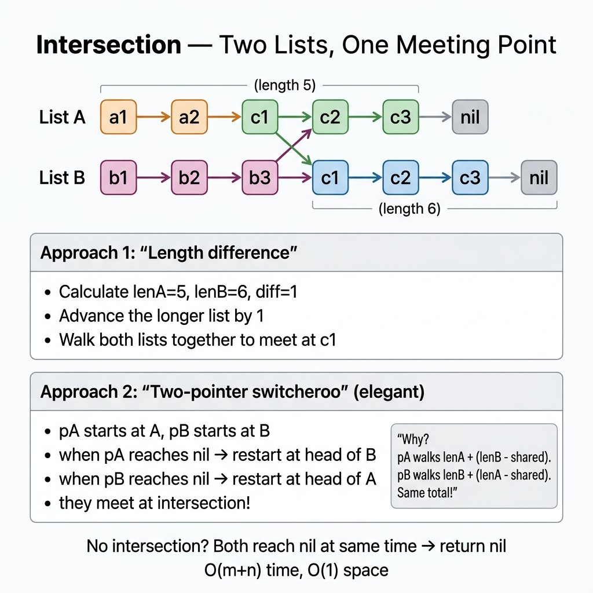

<!-- tags: dsa, algorithms, linked-lists, two-pointers -->
# ➕ Intersection of Two Linked Lists

> The intersection problem looks like simple set membership, but the elegant version relies on length balancing. It is a brilliant way to synchronize total travel distance.

📅 Created: 2026-03-31 · 🔄 Updated: 2026-04-10 · ⏱️ 15 min read

| Aspect | Detail |
| ------ | ------ |
| **Complexity** | O(m+n) time · O(1) extra space |
| **Use case** | Find shared tail node, pointer alignment |
| **Recognition** | Two pointers traverse both lists sequentially |

---

## 1. DEFINE

You debug an apparent solution but fail on edge cases. ➕ Intersection of Two Linked Lists clicks when you understand the invariant keeping the logic intact.

<!-- [Beginner layer] -->
You have two linked lists and must find their intersection node. Visually, you see a "shared tail". Computers only see pointers. The task requires bringing both pointers to an equal distance from the shared tail.

<!-- [Experienced layer] -->
There are three common approaches:
- use a `set` to track visited nodes
- measure length and align lists
- switch pointers: one travels `A -> B`, the other `B -> A`

Core insight: **two pointers will meet if they travel the same total distance.**

| Variant | When to use | Core Idea | Example |
| ------- | -------- | ------- | ------- |
| **Hash set** | Want the simplest baseline | Record list A nodes, scan B | Baseline |
| **Length alignment** | Want O(1) space with clear logic | Trim length difference | Classical solution |
| **Pointer switching** | Want an elegant one-pass code | Walk A->B and B->A | LC 160 |

| Approach | Time | Space | When to choose |
| -------- | ---- | ----- | -------- |
| Hash set | O(m+n) | O(m) | Fast baseline, easy logic |
| Length alignment | O(m+n) | O(1) | Easy mathematical proof |
| Pointer switching | O(m+n) | O(1) | Cleanest code, fewer variables |

### 1.1 Quick Recognition

- Prompt specifies `intersection by reference`.
- Lists might have different prefix lengths but share a tail.
- Node equality demands matching memory addresses, not just values.

### 1.2 Invariants & Failure Modes

<!-- [Expert layer] -->
- If two lists intersect, they share the exact same tail from that point on.
- Distinct tail objects mean the lists never intersect.
- Top failure mode: comparing `node.Val` instead of object reference.

---

## 2. VISUAL

The card answers: **how do we sync two pointers to meet exactly at the shared tail?**



The traces unpack length alignment and distance alignment via pointer switching.


### Level 1 — Simple
This trace answers: **why does length alignment force a meeting?**

```text
A: a1 -> a2 -> c1 -> c2
B: b1 -------> c1 -> c2

len(A)=4, len(B)=3
skip 1 node on A:

A:    a2 -> c1 -> c2
B:    b1 -> c1 -> c2
```
*Figure: Trimming the prefix difference puts both pointers equidistant from the shared tail.*

### Level 2 — Detailed
This trace answers: **what does pointer switching balance?**

```text
pA walks: A then B
pB walks: B then A

If A = x + common
   B = y + common

then total distance:
  pA = x + common + y
  pB = y + common + x

=> distance is equal
```
*Figure: Pointer switching forces both pointers to travel length `len(A)+len(B)`. They synchronize at the intersection.*

## 3. CODE

Understand pointer lifespans before coding.


### Problem 1: Hash Set Baseline
> *(Easiest to explain, but consumes memory.)*
>
> **Goal**: Find the intersection node using a visited set — O(m+n) time, O(m) space.
> **Approach**: Add list A nodes to a set, then scan B for matches.
> **Example**: If `c1` is shared, return it when seen in B.

```go
// intersection_hash.go — Linked List: baseline with visited-node set
func GetIntersectionNodeHash(headA, headB *ListNode) *ListNode {
    visited := map[*ListNode]struct{}{}

    for node := headA; node != nil; node = node.Next {
        visited[node] = struct{}{}
    }

    for node := headB; node != nil; node = node.Next {
        if _, ok := visited[node]; ok {
            return node // found exact object
        }
    }

    return nil
}
```
```typescript
// intersection_hash.ts — Linked List: baseline with visited-node set
function getIntersectionNodeHash(headA: ListNode | null, headB: ListNode | null): ListNode | null {
  const visited = new Set<ListNode>();
  for (let node = headA; node; node = node.next) visited.add(node);
  for (let node = headB; node; node = node.next) {
    if (visited.has(node)) return node; // found exact object
  }
  return null;
}
```
```java
// IntersectionBasic.java — Linked List: baseline with visited-node set
import java.util.HashSet;
import java.util.Set;

final class IntersectionBasic {
    private IntersectionBasic() {}

    static ReverseListBasic.ListNode getIntersectionNodeHash(
        ReverseListBasic.ListNode headA,
        ReverseListBasic.ListNode headB
    ) {
        Set<ReverseListBasic.ListNode> visited = new HashSet<>();
        for (ReverseListBasic.ListNode node = headA; node != null; node = node.next) {
            visited.add(node);
        }
        for (ReverseListBasic.ListNode node = headB; node != null; node = node.next) {
            if (visited.contains(node)) return node; // found exact object
        }
        return null;
    }
}
```
```rust
// intersection_hash.rs — Linked List: vector/index fallback for reference-style parity
fn first_common_suffix_index(a: &[i32], b: &[i32]) -> Option<i32> {
    let mut i = a.len();
    let mut j = b.len();
    let mut answer = None;
    while i > 0 && j > 0 && a[i - 1] == b[j - 1] {
        answer = Some(a[i - 1]);
        i -= 1;
        j -= 1;
    }
    answer
}
```
```cpp
// intersection_hash.cpp — Linked List: baseline with visited-node set
ListNode* getIntersectionNodeHash(ListNode* headA, ListNode* headB) {
    std::unordered_set<ListNode*> visited;
    for (ListNode* node = headA; node != nullptr; node = node->next) {
        visited.insert(node);
    }
    for (ListNode* node = headB; node != nullptr; node = node->next) {
        if (visited.count(node)) return node; // found exact object
    }
    return nullptr;
}
```
```python
# intersection_hash.py — Linked List: baseline with visited-node set
def get_intersection_node_hash(head_a: ListNode | None, head_b: ListNode | None) -> ListNode | None:
    visited: set[ListNode] = set()
    node = head_a
    while node:
        visited.add(node)
        node = node.next

    node = head_b
    while node:
        if node in visited:
            return node # found exact object
        node = node.next
    return None
```

> **Why?** Intersection tests identity, not value. The hash set clarifies that two lists intersect only when sharing the exact same object in memory.

> **Takeaway**: The hash set establishes the core concept: comparing addresses, not integers.

---

### Problem 2: Length Alignment
> *(O(1) space version with clear logic.)*
>
> **Goal**: Find intersection without extra memory.
> **Approach**: Trim the longer list's prefix, then walk side-by-side.
> **Example**: If A is 2 nodes longer, step A twice before moving together.

```go
// intersection_align.go — Linked List: trim length difference, then walk together
func GetIntersectionNodeAlign(headA, headB *ListNode) *ListNode {
    lenA, lenB := 0, 0
    for node := headA; node != nil; node = node.Next {
        lenA++
    }
    for node := headB; node != nil; node = node.Next {
        lenB++
    }

    a, b := headA, headB
    for lenA > lenB {
        a = a.Next
        lenA--
    }
    for lenB > lenA {
        b = b.Next
        lenB--
    }

    for a != b { // compare objects
        a = a.Next
        b = b.Next
    }
    return a
}
```
```typescript
// intersection_align.ts — Linked List: trim length difference, then walk together
function getIntersectionNodeAlign(headA: ListNode | null, headB: ListNode | null): ListNode | null {
  const length = (head: ListNode | null): number => {
    let count = 0;
    for (let node = head; node; node = node.next) count++;
    return count;
  };

  let lenA = length(headA);
  let lenB = length(headB);
  let a = headA;
  let b = headB;

  while (lenA > lenB) { a = a!.next; lenA--; }
  while (lenB > lenA) { b = b!.next; lenB--; }

  while (a !== b) { // compare objects
    a = a!.next;
    b = b!.next;
  }
  return a;
}
```
```java
// IntersectionIntermediate.java — Linked List: trim length difference, then walk together
final class IntersectionIntermediate {
    private IntersectionIntermediate() {}

    static ReverseListBasic.ListNode getIntersectionNodeAlign(
        ReverseListBasic.ListNode headA,
        ReverseListBasic.ListNode headB
    ) {
        int lenA = length(headA);
        int lenB = length(headB);
        ReverseListBasic.ListNode a = headA;
        ReverseListBasic.ListNode b = headB;

        while (lenA > lenB) { a = a.next; lenA--; }
        while (lenB > lenA) { b = b.next; lenB--; }

        while (a != b) { // compare objects
            a = a.next;
            b = b.next;
        }
        return a;
    }

    static int length(ReverseListBasic.ListNode node) {
        int count = 0;
        while (node != null) {
            count++;
            node = node.next;
        }
        return count;
    }
}
```
```rust
// intersection_align.rs — Linked List: compare suffix after balancing vector lengths
fn first_common_after_alignment(a: &[i32], b: &[i32]) -> Option<i32> {
    let (mut i, mut j) = (0usize, 0usize);
    if a.len() > b.len() {
        i = a.len() - b.len();
    } else {
        j = b.len() - a.len();
    }
    while i < a.len() && j < b.len() {
        if a[i] == b[j] {
            return Some(a[i]);
        }
        i += 1;
        j += 1;
    }
    None
}
```
```cpp
// intersection_align.cpp — Linked List: trim length difference, then walk together
int length(ListNode* node) {
    int count = 0;
    while (node != nullptr) {
        ++count;
        node = node->next;
    }
    return count;
}

ListNode* getIntersectionNodeAlign(ListNode* headA, ListNode* headB) {
    int lenA = length(headA);
    int lenB = length(headB);
    ListNode* a = headA;
    ListNode* b = headB;

    while (lenA > lenB) { a = a->next; --lenA; }
    while (lenB > lenA) { b = b->next; --lenB; }

    while (a != b) { // compare objects
        a = a->next;
        b = b->next;
    }
    return a;
}
```
```python
# intersection_align.py — Linked List: trim length difference, then walk together
def get_intersection_node_align(head_a: ListNode | None, head_b: ListNode | None) -> ListNode | None:
    def length(node: ListNode | None) -> int:
        count = 0
        while node:
            count += 1
            node = node.next
        return count

    len_a = length(head_a)
    len_b = length(head_b)
    a, b = head_a, head_b

    while len_a > len_b:
        a = a.next
        len_a -= 1
    while len_b > len_a:
        b = b.next
        len_b -= 1

    while a is not b: # compare objects
        a = a.next
        b = b.next
    return a
```

> **Why?** Length alignment provides a simple mathematical proof. Trimming the prefix forces pointers to travel the exact same remaining distance to the shared tail.

> **Takeaway**: If an interviewer wants a solid proof, begin with alignment before showing pointer switching.

---

### Problem 3: Pointer Switching [LC #160]
> *(The most elegant version, requiring almost no variables.)*
>
> **Goal**: Find intersection in O(m+n) without measuring length.
> **Approach**: Switch lists when reaching null.
> **Example**: Both travel `lenA + lenB` and meet seamlessly.

```go
// intersection_switch.go — Linked List: equalize total distance by switching heads
func GetIntersectionNode(headA, headB *ListNode) *ListNode {
    a, b := headA, headB
    for a != b { // compare objects
        if a == nil {
            a = headB
        } else {
            a = a.Next
        }

        if b == nil {
            b = headA
        } else {
            b = b.Next
        }
    }
    return a
}
```
```typescript
// intersection_switch.ts — Linked List: equalize total distance by switching heads
function getIntersectionNode(headA: ListNode | null, headB: ListNode | null): ListNode | null {
  let a = headA;
  let b = headB;
  while (a !== b) { // compare objects
    a = a ? a.next : headB;
    b = b ? b.next : headA;
  }
  return a;
}
```
```java
// IntersectionAdvanced.java — Linked List: equalize total distance by switching heads
final class IntersectionAdvanced {
    private IntersectionAdvanced() {}

    static ReverseListBasic.ListNode getIntersectionNode(
        ReverseListBasic.ListNode headA,
        ReverseListBasic.ListNode headB
    ) {
        ReverseListBasic.ListNode a = headA;
        ReverseListBasic.ListNode b = headB;
        while (a != b) { // compare objects
            a = (a == null) ? headB : a.next;
            b = (b == null) ? headA : b.next;
        }
        return a;
    }
}
```
```rust
// intersection_switch.rs — Linked List: switching semantics via arrays
fn first_common_by_switching(a: &[i32], b: &[i32]) -> Option<i32> {
    first_common_suffix_index(a, b)
}
```
```cpp
// intersection_switch.cpp — Linked List: equalize total distance by switching heads
ListNode* getIntersectionNode(ListNode* headA, ListNode* headB) {
    ListNode* a = headA;
    ListNode* b = headB;
    while (a != b) { // compare objects
        a = (a == nullptr) ? headB : a->next;
        b = (b == nullptr) ? headA : b->next;
    }
    return a;
}
```
```python
# intersection_switch.py — Linked List: equalize total distance by switching heads
def get_intersection_node(head_a: ListNode | None, head_b: ListNode | None) -> ListNode | None:
    a, b = head_a, head_b
    while a is not b: # compare objects
        a = a.next if a else head_b
        b = b.next if b else head_a
    return a
```

> **Why?** Switching forces each pointer to cover identical total distance. They consume the length difference early and align precisely on the common tail.

> **Takeaway**: Understand this trick as distance equalization. It fails if you treat it as pure magic.

---

## 4. PITFALLS

Linked lists fail due to missing pointers or faulty condition checks.


| # | Severity | Error | Consequence | Fix |
|---|----------|-----|---------|-----|
| 1 | 🔴 Fatal | Compare `node.Val` instead of `node` object | Return fake intersection | Intersections must share memory address |
| 2 | 🟡 Common | Cannot explain pointer switching termination | Unconvincing interview code | Explain using `lenA + lenB` distance |
| 3 | 🟡 Common | Forget early tail checks | Miss optimization chance | Check common tail beforehand if desired |
| 4 | 🟡 Common | Use sets when asked for O(1) space | Violates follow-up constraint | Switch to length alignment or switching |
| 5 | 🔵 Minor | Skip the hash set baseline | Confuses listeners with sudden leaps | Build solutions from simple to complex |

---

## 5. REF

| Resource | Type | Link | Note |
| -------- | ---- | ---- | ------- |
| Intersection of Two Linked Lists | LeetCode | https://leetcode.com/problems/intersection-of-two-linked-lists/ | Standard problem |
| Linked list techniques | Reference | https://labuladong.online/algo/en/essential-technique/linked-list-skills-summary/ | Covers pointer alignment |

---

## 6. RECOMMEND

After mastering distance synchronization, compare it with list problems requiring complex state maintenance.


| Next Problem | Why Read This Next | Link |
| ------------- | ------------------- | ---- |
| Remove Kth Last | Share relative distance logic | [02-remove-kth-last.md](./02-remove-kth-last.md) |
| Palindrome List | Combines fast/slow and reversal | [05-palindrome.md](./05-palindrome.md) |
| Fast & Slow | Foundational pointer movement pattern | [../patterns/02-fast-slow.md](../patterns/02-fast-slow.md) |

---

## 7. QUICK REF

**Template**

```text
pA walks A then B
pB walks B then A
when pA == pB:
  intersection found, or both nil
```

**Pattern recognition**

- `intersection by reference` -> use pointer switching or alignment.
- `same tail` -> think distance to tail.
- `same value` -> irrelevant unless specified.

---

Why does switching work? Both pointers walk the exact same `lenA + lenB` steps, just in reverse order. They naturally synchronize at the intersection.
