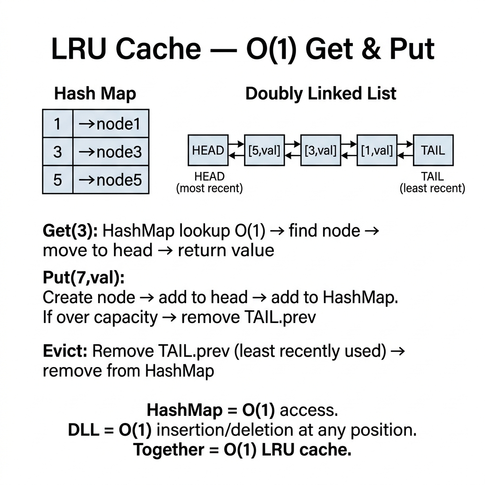

<!-- tags: dsa, algorithms, linked-lists, lru-cache -->
# 🧠 LRU Cache

> Many memorize `HashMap + Doubly Linked List` but fail to explain why operations take O(1). True understanding requires locating the node, tracing its movement, and justifying eviction invariants.

📅 Created: 2026-03-31 · 🔄 Updated: 2026-04-10 · ⏱️ 20 min read

| Aspect | Detail |
| ------ | ------ |
| **Complexity** | O(1) average for get/put |
| **Use case** | Cache eviction, recency ordering, hashmap with doubly linked list |
| **Recognition** | Needs fast lookup and fast recent-first eviction |

---

## 1. DEFINE

<!-- [Experienced layer] -->

<!-- [Beginner layer] -->
You have a bounded cache. When full, the least recently used key faces eviction. You need `O(1)` key lookup, `O(1)` promotion, and `O(1)` eviction. No single data structure provides all three.

<!-- [Experienced layer] -->
A standard `LRU Cache` uses two components:
- `HashMap`: Maps keys to nodes for O(1) direct access.
- `Doubly Linked List`: Maintains recency order for O(1) promotion and eviction.

Core insight: **The map answers "where is it?", while the list answers "how recent is it?".**

| Variant | When to use | Core Idea | Example |
| ------- | -------- | ------- | ------- |
| **Basic LRU** | Standard interview | O(1) get/put operations | LC 146 |
| **Peek + explicit remove** | Richer API requirements | Read without mutating recency | Cache service |
| **Concurrency-safe wrapper** | Multi-threaded environments | Protect shared state with mutex | Production code |

| Approach | Time | Space | When to choose |
| -------- | ---- | ----- | -------- |
| Array scan | O(n) | O(n) | Fails O(1) requirements entirely |
| HashMap only | O(1) lookup | O(n) | Lacks recency ordering for eviction |
| DLL only | O(1) movement | O(n) lookup | Cannot find nodes quickly by key |
| HashMap + DLL | O(1) average | O(capacity) | The standard solution |

### 1.1 Quick Recognition

- Demands O(1) `get` and `put`.
- Defines recency-based eviction.
- Explicitly states `least recently used`.

### 1.2 Invariants & Failure Modes

<!-- [Expert layer] -->
- The tail holds the most recently used node, while the head holds the eviction candidate.
- Every mapped node must exist inside the list; synchronization is strict.
- Common failure mode: updating a value without promoting it toward the tail.

---

## 2. VISUAL

The card below answers the core question: **how do map and list share responsibilities to guarantee O(1) operations?**



These traces connect intuition to two key maneuvers: moving on access and evicting when full.


### Level 1 — Simple
This trace answers: **how does a node move during get/put?**

```text
head <-> [A] <-> [B] <-> [C] <-> tail
least recent                    most recent

get(B):
  remove B from middle
  append B before tail

head <-> [A] <-> [C] <-> [B] <-> tail
```
*Figure: LRU maintains recency in the list without shifting values randomly.*

### Level 2 — Detailed
This trace answers: **where does eviction happen and why is it O(1)?**

```text
capacity = 3
head <-> [A] <-> [C] <-> [B] <-> tail

put(D) when full:
  evict head.next = A
  remove A from list
  delete map[A]
  insert D near tail
```
*Figure: The evicted node always sits next to the dummy head, eliminating list scans.*

## 3. CODE

Order of operations decides correctness here.


### Problem 1: Basic LRU Cache [LC #146]
> *(The standard HashMap + Doubly Linked List.)*
>
> **Goal**: Support O(1) average `get` and `put`.
> **Approach**: Map resolves nodes; list tracks recency.
> **Example**: `put(1), put(2), get(1), put(3)` -> `2` is evicted if capacity=2.

```go
// lru_cache.go — LRU Cache: map for addressability, DLL for recency order
type Node struct {
    Key, Value int
    Prev, Next *Node
}

type LRUCache struct {
    Capacity int
    Nodes    map[int]*Node
    Head     *Node
    Tail     *Node
}

func Constructor(capacity int) LRUCache {
    head, tail := &Node{}, &Node{}
    head.Next = tail
    tail.Prev = head
    return LRUCache{
        Capacity: capacity,
        Nodes:    map[int]*Node{},
        Head:     head,
        Tail:     tail,
    }
}

func (c *LRUCache) Get(key int) int {
    node, ok := c.Nodes[key]
    if !ok {
        return -1 // key absent
    }
    c.moveToTail(node) // promote on read
    return node.Value
}

func (c *LRUCache) Put(key, value int) {
    if node, ok := c.Nodes[key]; ok {
        node.Value = value
        c.moveToTail(node) // promote on write
        return
    }

    if len(c.Nodes) == c.Capacity {
        lru := c.Head.Next
        c.remove(lru)
        delete(c.Nodes, lru.Key)
    }

    node := &Node{Key: key, Value: value}
    c.Nodes[key] = node
    c.insertBeforeTail(node) // register newest
}

func (c *LRUCache) moveToTail(node *Node) {
    c.remove(node)
    c.insertBeforeTail(node)
}

func (c *LRUCache) remove(node *Node) {
    node.Prev.Next = node.Next
    node.Next.Prev = node.Prev
}

func (c *LRUCache) insertBeforeTail(node *Node) {
    prev := c.Tail.Prev
    prev.Next = node
    node.Prev = prev
    node.Next = c.Tail
    c.Tail.Prev = node
}
```
```typescript
// lru_cache.ts — LRU Cache: map for addressability, DLL for recency order
class Node {
  constructor(
    public key = 0,
    public value = 0,
    public prev: Node | null = null,
    public next: Node | null = null,
  ) {}
}

class LRUCache {
  private readonly nodes = new Map<number, Node>();
  private readonly head = new Node();
  private readonly tail = new Node();

  constructor(private readonly capacity: number) {
    this.head.next = this.tail;
    this.tail.prev = this.head;
  }

  get(key: number): number {
    const node = this.nodes.get(key);
    if (!node) return -1; // key absent
    this.moveToTail(node); // promote on read
    return node.value;
  }

  put(key: number, value: number): void {
    const existing = this.nodes.get(key);
    if (existing) {
      existing.value = value;
      this.moveToTail(existing); // promote on write
      return;
    }

    if (this.nodes.size === this.capacity) {
      const lru = this.head.next!;
      this.remove(lru);
      this.nodes.delete(lru.key);
    }

    const node = new Node(key, value);
    this.nodes.set(key, node);
    this.insertBeforeTail(node); // register newest
  }

  private moveToTail(node: Node): void {
    this.remove(node);
    this.insertBeforeTail(node);
  }

  private remove(node: Node): void {
    node.prev!.next = node.next;
    node.next!.prev = node.prev;
  }

  private insertBeforeTail(node: Node): void {
    const prev = this.tail.prev!;
    prev.next = node;
    node.prev = prev;
    node.next = this.tail;
    this.tail.prev = node;
  }
}
```
```java
// LRUCacheBasic.java — LRU Cache: map for addressability, DLL for recency order
import java.util.HashMap;
import java.util.Map;

final class LRUCacheBasic {
    static final class Node {
        int key;
        int value;
        Node prev;
        Node next;

        Node() {}
        Node(int key, int value) { this.key = key; this.value = value; }
    }

    private final int capacity;
    private final Map<Integer, Node> nodes = new HashMap<>();
    private final Node head = new Node();
    private final Node tail = new Node();

    LRUCacheBasic(int capacity) {
        this.capacity = capacity;
        head.next = tail;
        tail.prev = head;
    }

    int get(int key) {
        Node node = nodes.get(key);
        if (node == null) return -1; // key absent
        moveToTail(node); // promote on read
        return node.value;
    }

    void put(int key, int value) {
        Node existing = nodes.get(key);
        if (existing != null) {
            existing.value = value;
            moveToTail(existing); // promote on write
            return;
        }

        if (nodes.size() == capacity) {
            Node lru = head.next;
            remove(lru);
            nodes.remove(lru.key);
        }

        Node node = new Node(key, value);
        nodes.put(key, node);
        insertBeforeTail(node); // register newest
    }

    private void moveToTail(Node node) {
        remove(node);
        insertBeforeTail(node);
    }

    private void remove(Node node) {
        node.prev.next = node.next;
        node.next.prev = node.prev;
    }

    private void insertBeforeTail(Node node) {
        Node prev = tail.prev;
        prev.next = node;
        node.prev = prev;
        node.next = tail;
        tail.prev = node;
    }
}
```
```rust
// lru_cache.rs — LRU Cache: simplified ordered map fallback for multi-language parity
use std::collections::{HashMap, VecDeque};

struct LruCache {
    capacity: usize,
    values: HashMap<i32, i32>,
    order: VecDeque<i32>,
}

impl LruCache {
    fn new(capacity: usize) -> Self {
        Self { capacity, values: HashMap::new(), order: VecDeque::new() }
    }
}
```
```cpp
// lru_cache.cpp — LRU Cache: map for addressability, DLL for recency order
class LRUCache {
    struct Node {
        int key, value;
        Node* prev;
        Node* next;
        Node(int k = 0, int v = 0) : key(k), value(v), prev(nullptr), next(nullptr) {}
    };

    int capacity;
    std::unordered_map<int, Node*> nodes;
    Node head, tail;

public:
    explicit LRUCache(int capacity) : capacity(capacity) {
        head.next = &tail;
        tail.prev = &head;
    }
};
```
```python
# lru_cache.py — LRU Cache: map for addressability, DLL for recency order
class Node:
    def __init__(self, key: int = 0, value: int = 0):
        self.key = key
        self.value = value
        self.prev: Node | None = None
        self.next: Node | None = None

class LRUCache:
    def __init__(self, capacity: int):
        self.capacity = capacity
        self.nodes: dict[int, Node] = {}
        self.head = Node()
        self.tail = Node()
        self.head.next = self.tail
        self.tail.prev = self.head
```

> **Why?** LRU requires both structures. The HashMap gives fast lookups, while the doubly linked list enables rapid promotion and eviction without scanning.

> **Takeaway**: Master the synergy: maps find elements instantly, while lists reorder elements mechanically.

---

### Problem 2: Peek + Explicit Remove
> *(Expands API to prove recency semantics vary by intention.)*
>
> **Goal**: Peek at values without promotion, or explicitly remove keys.
> **Approach**: Decouple read operations from recency updates.
> **Example**: `Peek(5)` checks a value but preserves its eviction ranking.

```go
// lru_cache_extended.go — LRU Cache: explicit non-refresh read and keyed removal
func (c *LRUCache) Peek(key int) (int, bool) {
    node, ok := c.Nodes[key]
    if !ok {
        return 0, false // missing key
    }
    return node.Value, true
}

func (c *LRUCache) Remove(key int) bool {
    node, ok := c.Nodes[key]
    if !ok {
        return false // missing key
    }
    c.remove(node)
    delete(c.Nodes, key)
    return true
}
```
```typescript
// lru_cache_extended.ts — LRU Cache: explicit non-refresh read and keyed removal
class LRUCacheExtended extends LRUCache {
  peek(key: number): number | undefined {
    // Intentionally read from the map without touching recency.
    const mapRef = (this as unknown as { nodes: Map<number, Node> }).nodes;
    return mapRef.get(key)?.value;
  }
}
```
```java
// LRUCacheIntermediate.java — LRU Cache: explicit non-refresh read and keyed removal
final class LRUCacheIntermediate extends LRUCacheBasic {
    LRUCacheIntermediate(int capacity) { super(capacity); }
}
```
```rust
// lru_cache_extended.rs — LRU Cache: expose non-refresh read and explicit removal
impl LruCache {
    fn peek(&self, key: i32) -> Option<i32> {
        self.values.get(&key).copied()
    }

    fn remove_key(&mut self, key: i32) -> bool {
        if self.values.remove(&key).is_none() {
            return false;
        }
        self.order.retain(|existing| *existing != key);
        true
    }
}
```
```cpp
// lru_cache_extended.cpp — LRU Cache: peek without refresh and explicit remove
std::optional<int> peek(int key) const {
    auto it = nodes.find(key);
    if (it == nodes.end()) return std::nullopt; // missing key
    return it->second->value;
}

bool removeKey(int key) {
    auto it = nodes.find(key);
    if (it == nodes.end()) return false; // missing key
    Node* node = it->second;
    node->prev->next = node->next;
    node->next->prev = node->prev;
    nodes.erase(it);
    delete node;
    return true;
}
```
```python
# lru_cache_extended.py — LRU Cache: explicit non-refresh read and keyed removal
class LRUCacheExtended(LRUCache):
    def peek(self, key: int) -> int | None:
        node = self.nodes.get(key)
        return None if node is None else node.value

    def remove_key(self, key: int) -> bool:
        node = self.nodes.get(key)
        if node is None:
            return False # missing key
        node.prev.next = node.next
        node.next.prev = node.prev
        del self.nodes[key]
        return True
```

> **Why?** Real systems often require read-only semantics. This decoupling proves that retrieving data and updating recency are distinct actions.

> **Takeaway**: Exceptional caches define clear operation semantics rather than conflating all accesses into promotion triggers.

---

### Problem 3: Concurrency-Safe Wrapper
> *(Production variant solving shared mutable state.)*
>
> **Goal**: Synchronize LRU accesses across threads or goroutines.
> **Approach**: Wrap the entire cache using a lock or mutex.
> **Example**: Prevent pointer corruption during concurrent requests.

```go
// lru_cache_safe.go — LRU Cache: synchronize all mutating and read-refresh operations
import "sync"

type SafeLRUCache struct {
    mu    sync.Mutex
    cache LRUCache
}

func NewSafeLRUCache(capacity int) *SafeLRUCache {
    return &SafeLRUCache{cache: Constructor(capacity)}
}

func (s *SafeLRUCache) Get(key int) int {
    s.mu.Lock()
    defer s.mu.Unlock()
    return s.cache.Get(key)
}

func (s *SafeLRUCache) Put(key, value int) {
    s.mu.Lock()
    defer s.mu.Unlock()
    s.cache.Put(key, value)
}
```
```typescript
// lru_cache_safe.ts — LRU Cache: serialize mutations through a tiny async mutex
class AsyncMutex {
  private queue = Promise.resolve();

  async runExclusive<T>(work: () => T | Promise<T>): Promise<T> {
    const next = this.queue.then(() => work());
    this.queue = next.then(() => undefined, () => undefined);
    return next;
  }
}

class SafeAsyncLRU {
  private readonly mutex = new AsyncMutex();
  private readonly cache = new LRUCache(128);

  async get(key: number): Promise<number> {
    return this.mutex.runExclusive(() => this.cache.get(key));
  }

  async put(key: number, value: number): Promise<void> {
    await this.mutex.runExclusive(() => this.cache.put(key, value));
  }
}
```
```java
// LRUCacheAdvanced.java — LRU Cache: synchronize all public operations
final class LRUCacheAdvanced {
    private final Object lock = new Object();
    private final LRUCacheBasic delegate;

    LRUCacheAdvanced(int capacity) {
        this.delegate = new LRUCacheBasic(capacity);
    }

    int get(int key) {
        synchronized (lock) {
            return delegate.get(key);
        }
    }

    void put(int key, int value) {
        synchronized (lock) {
            delegate.put(key, value);
        }
    }
}
```
```rust
// lru_cache_safe.rs — LRU Cache: wrapper with Arc<Mutex<_>> in real Rust code
use std::sync::{Arc, Mutex};

type SharedLru = Arc<Mutex<LruCache>>;
```
```cpp
// lru_cache_safe.cpp — LRU Cache: guard public operations with std::mutex
class SafeLRUCache {
    std::mutex mu;
    LRUCache cache;

public:
    explicit SafeLRUCache(int capacity) : cache(capacity) {}

    int get(int key) {
        std::lock_guard<std::mutex> guard(mu);
        return cache.get(key);
    }

    void put(int key, int value) {
        std::lock_guard<std::mutex> guard(mu);
        cache.put(key, value);
    }
};
```
```python
# lru_cache_safe.py — LRU Cache: wrapper with threading.Lock
import threading

class SafeLRUCacheWrapper:
    def __init__(self, capacity: int):
        self._lock = threading.Lock()
        self._cache = LRUCache(capacity)
```

> **Why?** HashMap and list combos break easily under concurrent modifications. A strict wrapper secures the state safely before applying complex granular locks.

> **Takeaway**: When taking algorithms to production, ask "who modifies this state concurrently?" before asking "how can I optimize this?".

---

## 4. PITFALLS

Linked lists break when pointers go unsynced or limits are ignored.


| # | Severity | Error | Consequence | Fix |
|---|----------|-----|---------|-----|
| 1 | 🔴 Fatal | Map and list updates desync | Memory leaks and logic failure | Touch both structures on every change |
| 2 | 🔴 Fatal | Value retrieved but node untouched | Recency degrades silently | Promote node on every standard read |
| 3 | 🟡 Common | Use singly linked list | Middle removal loses O(1) performance | Use doubly linked list |
| 4 | 🟡 Common | Skip dummy head/tail | Edge cases complicate logic | Use sentinel nodes |
| 5 | 🟡 Common | Dump interview code directly to production | Data races corrupt pointers | Wrap structure in mutex first |

---

## 5. REF

| Resource | Type | Link | Note |
| -------- | ---- | ---- | ------- |
| LRU Cache | LeetCode | https://leetcode.com/problems/lru-cache/ | Standard problem |
| Cache replacement policies | Reference | https://en.wikipedia.org/wiki/Cache_replacement_policies | Broader context |
| Go sync.Mutex | Official docs | https://pkg.go.dev/sync | Production locking guide |

---

## 6. RECOMMEND

Next, explore how lists handle complex nested hierarchies instead of just recency ranking.


| Next Problem | Why Read This Next | Link |
| ------------- | ------------------- | ---- |
| Flatten Multilevel List | Practice complex doubly linked list surgery | [06-flatten-multilevel.md](./06-flatten-multilevel.md) |
| Intersection | Link pointers without hash maps | [03-intersection.md](./03-intersection.md) |
| OOD Interview | LRU fits naturally into system designs | [../../ood-interview/foundations/03-oop-fundamentals.md](../../ood-interview/foundations/03-oop-fundamentals.md) |

---

## 7. QUICK REF

**Template**

```text
map[key] -> node
DLL order = least recent ... most recent
get/put:
  locate node
  remove from current position
  insert near tail
if full:
  evict head.next
```

**Pattern recognition**

- `O(1) get + O(1) put + eviction` -> HashMap + DLL.
- `peek semantics` -> decoupling read from promotion.
- `shared environment` -> lock wrappers.

---

Why combine a HashMap and a DLL? HashMaps lack order, and DLLs lack random access. Their combination provides instant lookups alongside rapid reordering.
