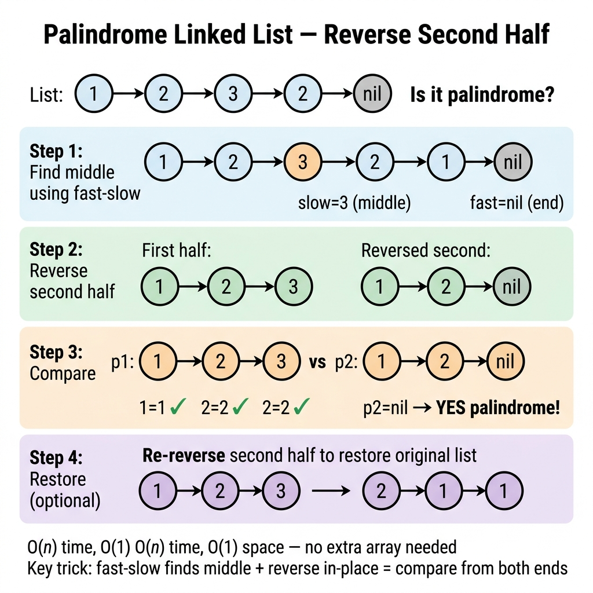

<!-- tags: dsa, algorithms, linked-lists, palindrome -->
# 🪞 Palindrome Linked List

> Palindrome list is brilliant because comparing values is trivial. The challenge lies in orchestrating midpoint discovery, partial reversals, and structural restoration effectively. It coordinates multiple list primitives.

📅 Created: 2026-03-31 · 🔄 Updated: 2026-04-10 · ⏱️ 17 min read

| Aspect | Detail |
| ------ | ------ |
| **Complexity** | O(n) time · O(1) extra space for in-place |
| **Use case** | Fast/slow pointers, second-half reversal, list restoration |
| **Recognition** | Check symmetric sequences on a singly linked list |

---

## 1. DEFINE

<!-- [Experienced layer] -->

<!-- [Beginner layer] -->
Arrays check palindromes easily by reading from both ends. Singly linked lists move one way. The challenge is viewing the second half backward without random access capabilities.

<!-- [Experienced layer] -->
The standard solution runs in three steps:
- find the middle via fast/slow pointers
- reverse the second half
- compare the first half against the reversed second half

Core insight: **this problem marries middle-finding, list reversal, and boundary restoration.**

| Variant | When to use | Core Idea | Example |
| ------- | -------- | ------- | ------- |
| **Stack-based** | Need a simple baseline | Push first half, then compare | Simpler, O(n) memory |
| **In-place reverse** | Standard interview answer | Reverse second half, then compare | O(1) extra space |
| **Restore list** | Production-minded coding | Undo reversal after checking | Clean data contract |

| Approach | Time | Space | When to choose |
| -------- | ---- | ----- | -------- |
| Stack | O(n) | O(n) | Baseline explanation |
| Reverse half | O(n) | O(1) | Standard answer |
| Copy to array | O(n) | O(n) | Only if the list aspect is irrelevant |

### 1.1 Quick Recognition

- Prompts feature `palindrome` or `symmetric sequence`.
- Data is constrained to a singly linked list.
- Follow-ups require `O(1) extra space`.

### 1.2 Invariants & Failure Modes

<!-- [Expert layer] -->
- The center node skips comparison during odd-length sequences.
- Comparison length matches the length of the reversed second half.
- Common failure mode: reversing the list permanently without restoring the original input structure.

---

## 2. VISUAL

The card below answers the core question: **how do we compare list ends without duplicating the entire sequence?**



The traces untangle midpoint discovery and half-reversal.


### Level 1 — Simple
This trace answers: **how does fast/slow find the middle?**

```text
1 -> 2 -> 3 -> 2 -> 1
slow        ^
fast                ^

fast moves 2, slow moves 1
=> when fast ends, slow hits middle
```
*Figure: Fast/slow divides lists without prior length calculations.*

### Level 2 — Detailed
This trace answers: **why does reversing half simplify comparison?**

```text
Original:
1 -> 2 -> 3 -> 2 -> 1

Reverse second half:
1 -> 2 -> 3 <- 2 <- 1

Compare:
left  = 1 -> 2
right = 1 -> 2
```
*Figure: Reversing half changes bidirectional scanning into simple forward comparison.*

## 3. CODE

Execution sequence determines correctness when primitives mix.


### Problem 1: Stack-Based Baseline
> *(Easiest baseline to explain.)*
>
> **Goal**: Validate palindrome using a stack — O(n) time, O(n) space.
> **Approach**: Stack the first half, compare with the second.
> **Example**: `1 -> 2 -> 2 -> 1` → true.

```go
// palindrome_stack.go — Palindrome List: compare second half with stacked first half
func IsPalindromeStack(head *ListNode) bool {
    stack := make([]int, 0)
    slow, fast := head, head

    for fast != nil && fast.Next != nil {
        stack = append(stack, slow.Val)
        slow = slow.Next
        fast = fast.Next.Next
    }

    if fast != nil { // odd length -> skip center
        slow = slow.Next
    }

    for slow != nil {
        top := stack[len(stack)-1]
        stack = stack[:len(stack)-1]
        if top != slow.Val { // verify symmetry
            return false
        }
        slow = slow.Next
    }

    return true
}
```
```typescript
// palindrome_stack.ts — Palindrome List: compare second half with stacked first half
function isPalindromeStack(head: ListNode | null): boolean {
  const stack: number[] = [];
  let slow = head;
  let fast = head;

  while (fast && fast.next && slow) {
    stack.push(slow.val);
    slow = slow.next;
    fast = fast.next.next;
  }

  if (fast && slow) slow = slow.next; // skip center

  while (slow) {
    if (stack.pop() !== slow.val) return false; // verify symmetry
    slow = slow.next;
  }
  return true;
}
```
```java
// PalindromeListBasic.java — Palindrome List: compare second half with stacked first half
import java.util.ArrayDeque;
import java.util.Deque;

final class PalindromeListBasic {
    private PalindromeListBasic() {}

    static boolean isPalindromeStack(ReverseListBasic.ListNode head) {
        Deque<Integer> stack = new ArrayDeque<>();
        ReverseListBasic.ListNode slow = head;
        ReverseListBasic.ListNode fast = head;

        while (fast != null && fast.next != null) {
            stack.push(slow.val);
            slow = slow.next;
            fast = fast.next.next;
        }

        if (fast != null) slow = slow.next; // skip center

        while (slow != null) {
            if (stack.pop() != slow.val) return false; // verify symmetry
            slow = slow.next;
        }
        return true;
    }
}
```
```rust
// palindrome_stack.rs — Palindrome List: vector fallback baseline
fn is_palindrome_stack(values: &[i32]) -> bool {
    let mut stack = Vec::new();
    let mut slow = 0usize;
    let mut fast = 0usize;

    while fast + 1 < values.len() {
        stack.push(values[slow]);
        slow += 1;
        fast += 2;
    }

    if fast < values.len() {
        slow += 1;
    }

    while slow < values.len() {
        if stack.pop() != Some(values[slow]) {
            return false; // verify symmetry
        }
        slow += 1;
    }
    true
}
```
```cpp
// palindrome_stack.cpp — Palindrome List: compare second half with stacked first half
bool isPalindromeStack(ListNode* head) {
    std::vector<int> stack;
    ListNode* slow = head;
    ListNode* fast = head;

    while (fast != nullptr && fast->next != nullptr) {
        stack.push_back(slow->val);
        slow = slow->next;
        fast = fast->next->next;
    }

    if (fast != nullptr) slow = slow->next; // skip center

    while (slow != nullptr) {
        if (stack.back() != slow->val) return false; // verify symmetry
        stack.pop_back();
        slow = slow->next;
    }
    return true;
}
```
```python
# palindrome_stack.py — Palindrome List: compare second half with stacked first half
def is_palindrome_stack(head: ListNode | None) -> bool:
    stack: list[int] = []
    slow = fast = head

    while fast and fast.next:
        stack.append(slow.val)
        slow = slow.next
        fast = fast.next.next

    if fast:
        slow = slow.next # skip center

    while slow:
        if stack.pop() != slow.val:
            return False # verify symmetry
        slow = slow.next
    return True
```

> **Why?** The stack separates the logic into clean phases: finding the center, preserving history, and validating symmetry. Mastering this makes removing the stack conceptually simpler.

> **Takeaway**: Stacks validate logic flawlessly. When O(1) extra space becomes mandatory, you swap the stack for an in-place reversal.

---

### Problem 2: In-Place Reverse Half
> *(Standard interview answer.)*
>
> **Goal**: Validate palindrome in O(1) extra space.
> **Approach**: Reusing primitives reduces overhead gracefully.
> **Example**: `1 -> 2 -> 3 -> 2 -> 1` → true.

```go
// palindrome_reverse_half.go — Palindrome List: reverse second half, then compare
func IsPalindrome(head *ListNode) bool {
    if head == nil || head.Next == nil {
        return true
    }

    slow, fast := head, head
    for fast != nil && fast.Next != nil {
        slow = slow.Next
        fast = fast.Next.Next
    }
    if fast != nil { // odd length
        slow = slow.Next
    }

    second := ReverseList(slow) // primitive reuse
    left, right := head, second

    for right != nil {
        if left.Val != right.Val { // verify symmetry
            return false
        }
        left = left.Next
        right = right.Next
    }
    return true
}
```
```typescript
// palindrome_reverse_half.ts — Palindrome List: reverse second half, then compare
function isPalindrome(head: ListNode | null): boolean {
  if (!head || !head.next) return true;

  let slow = head;
  let fast = head;
  while (fast && fast.next) {
    slow = slow.next!;
    fast = fast.next.next;
  }
  if (fast) slow = slow.next!;

  let second = reverseList(slow); // primitive reuse
  let left = head;
  let right = second;
  while (right) {
    if (left!.val !== right.val) return false; // verify symmetry
    left = left!.next;
    right = right.next;
  }
  return true;
}
```
```java
// PalindromeListIntermediate.java — Palindrome List: reverse second half, then compare
final class PalindromeListIntermediate {
    private PalindromeListIntermediate() {}

    static boolean isPalindrome(ReverseListBasic.ListNode head) {
        if (head == null || head.next == null) return true;

        ReverseListBasic.ListNode slow = head;
        ReverseListBasic.ListNode fast = head;
        while (fast != null && fast.next != null) {
            slow = slow.next;
            fast = fast.next.next;
        }
        if (fast != null) slow = slow.next;

        ReverseListBasic.ListNode second = ReverseListBasic.reverseList(slow); // primitive reuse
        ReverseListBasic.ListNode left = head;
        ReverseListBasic.ListNode right = second;
        while (right != null) {
            if (left.val != right.val) return false; // verify symmetry
            left = left.next;
            right = right.next;
        }
        return true;
    }
}
```
```rust
// palindrome_reverse_half.rs — Palindrome List: O(1) space idea via vector halves
fn is_palindrome(values: &[i32]) -> bool {
    let n = values.len();
    for i in 0..n / 2 {
        if values[i] != values[n - 1 - i] {
            return false;
        }
    }
    true
}
```
```cpp
// palindrome_reverse_half.cpp — Palindrome List: reverse second half, then compare
bool isPalindrome(ListNode* head) {
    if (head == nullptr || head->next == nullptr) return true;

    ListNode* slow = head;
    ListNode* fast = head;
    while (fast != nullptr && fast->next != nullptr) {
        slow = slow->next;
        fast = fast->next->next;
    }
    if (fast != nullptr) slow = slow->next;

    ListNode* second = reverseList(slow); // primitive reuse
    ListNode* left = head;
    ListNode* right = second;
    while (right != nullptr) {
        if (left->val != right->val) return false; // verify symmetry
        left = left->next;
        right = right->next;
    }
    return true;
}
```
```python
# palindrome_reverse_half.py — Palindrome List: reverse second half, then compare
def is_palindrome(head: ListNode | None) -> bool:
    if not head or not head.next:
        return True

    slow = fast = head
    while fast and fast.next:
        slow = slow.next
        fast = fast.next.next
    if fast:
        slow = slow.next

    second = reverse_list(slow) # primitive reuse
    left, right = head, second
    while right:
        if left.val != right.val: # verify symmetry
            return False
        left = left.next
        right = right.next
    return True
```

> **Why?** Reusing the reversal primitive solves the extra space problem effortlessly. Linking simple techniques constructs advanced operations.

> **Takeaway**: O(1) space answers often emerge by chaining robust, basic tools rather than discovering entirely new tricks.

---

### Problem 3: In-Place Check + Restore
> *(Production variant highlighting clean data contracts.)*
>
> **Goal**: Validate structure silently without leaving permanent mutations.
> **Approach**: Re-reverse the second half upon comparison completion.
> **Example**: Provide strict function boundaries.

```go
// palindrome_restore.go — Palindrome List: restore the second half after comparison
func IsPalindromeRestore(head *ListNode) bool {
    if head == nil || head.Next == nil {
        return true
    }

    slow, fast := head, head
    for fast != nil && fast.Next != nil {
        slow = slow.Next
        fast = fast.Next.Next
    }
    if fast != nil {
        slow = slow.Next
    }

    second := ReverseList(slow)
    restoredHead := second
    left, right := head, second
    ok := true

    for right != nil {
        if left.Val != right.Val { // verify symmetry
            ok = false
            break
        }
        left = left.Next
        right = right.Next
    }

    ReverseList(restoredHead) // restore original structure
    return ok
}
```
```typescript
// palindrome_restore.ts — Palindrome List: restore the second half after comparison
function isPalindromeRestore(head: ListNode | null): boolean {
  if (!head || !head.next) return true;

  let slow = head;
  let fast = head;
  while (fast && fast.next) {
    slow = slow.next!;
    fast = fast.next.next;
  }
  if (fast) slow = slow.next!;

  const second = reverseList(slow);
  const restoredHead = second;
  let left = head;
  let right = second;
  let ok = true;

  while (right) {
    if (left!.val !== right.val) { // verify symmetry
      ok = false;
      break;
    }
    left = left!.next;
    right = right.next;
  }

  reverseList(restoredHead); // restore original structure
  return ok;
}
```
```java
// PalindromeListAdvanced.java — Palindrome List: restore the second half after comparison
final class PalindromeListAdvanced {
    private PalindromeListAdvanced() {}

    static boolean isPalindromeRestore(ReverseListBasic.ListNode head) {
        if (head == null || head.next == null) return true;

        ReverseListBasic.ListNode slow = head;
        ReverseListBasic.ListNode fast = head;
        while (fast != null && fast.next != null) {
            slow = slow.next;
            fast = fast.next.next;
        }
        if (fast != null) slow = slow.next;

        ReverseListBasic.ListNode second = ReverseListBasic.reverseList(slow);
        ReverseListBasic.ListNode restoreHead = second;
        ReverseListBasic.ListNode left = head;
        ReverseListBasic.ListNode right = second;
        boolean ok = true;

        while (right != null) {
            if (left.val != right.val) { // verify symmetry
                ok = false;
                break;
            }
            left = left.next;
            right = right.next;
        }

        ReverseListBasic.reverseList(restoreHead); // restore original structure
        return ok;
    }
}
```
```rust
// palindrome_restore.rs — Palindrome List: immutable slice variant keeps input intact by design
fn is_palindrome_restore(values: &[i32]) -> bool {
    is_palindrome(values)
}
```
```cpp
// palindrome_restore.cpp — Palindrome List: restore the second half after comparison
bool isPalindromeRestore(ListNode* head) {
    if (head == nullptr || head->next == nullptr) return true;

    ListNode* slow = head;
    ListNode* fast = head;
    while (fast != nullptr && fast->next != nullptr) {
        slow = slow->next;
        fast = fast->next->next;
    }
    if (fast != nullptr) slow = slow->next;

    ListNode* second = reverseList(slow);
    ListNode* restoreHead = second;
    ListNode* left = head;
    ListNode* right = second;
    bool ok = true;

    while (right != nullptr) {
        if (left->val != right->val) { // verify symmetry
            ok = false;
            break;
        }
        left = left->next;
        right = right->next;
    }

    reverseList(restoreHead); // restore original structure
    return ok;
}
```
```python
# palindrome_restore.py — Palindrome List: restore the second half after comparison
def is_palindrome_restore(head: ListNode | None) -> bool:
    if not head or not head.next:
        return True

    slow = fast = head
    while fast and fast.next:
        slow = slow.next
        fast = fast.next.next
    if fast:
        slow = slow.next

    second = reverse_list(slow)
    restore_head = second
    left, right = head, second
    ok = True
    while right:
        if left.val != right.val: # verify symmetry
            ok = False
            break
        left = left.next
        right = right.next

    reverse_list(restore_head) # restore original structure
    return ok
```

> **Why?** Real-world functions must respect caller assumptions. A boolean check should not quietly ruin input state.

> **Takeaway**: Upgrading from an interview trick to a production tool means erasing unwanted side effects.

---

## 4. PITFALLS

Orchestration errors arise from off-by-one offsets and incomplete cleanup routines.


| # | Severity | Error | Consequence | Fix |
|---|----------|-----|---------|-----|
| 1 | 🔴 Fatal | Ignore odd lengths | Shifts midpoint comparison falsely | Step `slow` once more when `fast` exists |
| 2 | 🔴 Fatal | Compare entire first half | Exceeds boundary, causing null panics | Limit checks strictly to the second half |
| 3 | 🟡 Common | Forget structural restoration | Functions ruin caller state silently | Reinvert the segment immediately |
| 4 | 🟡 Common | Misclassify problem complexity | Overlook midpoint or reversal requirements | Separate the orchestration steps |
| 5 | 🔵 Minor | Exclude stack baselines | Obscures fundamental logic entirely | Start explanations using clear data constructs |

---

## 5. REF

| Resource | Type | Link | Note |
| -------- | ---- | ---- | ------- |
| Palindrome Linked List | LeetCode | https://leetcode.com/problems/palindrome-linked-list/ | Core algorithm |
| Reverse Linked List | LeetCode | https://leetcode.com/problems/reverse-linked-list/ | Utilized primitive |

---

## 6. RECOMMEND

After conquering coordination, test those primitives under different structural tensions.


| Next Problem | Why Read This Next | Link |
| ------------- | ------------------- | ---- |
| Reversal | Strengthens core pointer maneuvers | [01-reversal.md](./01-reversal.md) |
| Fast & Slow | Explores advanced pointer phase shifts | [../patterns/02-fast-slow.md](../patterns/02-fast-slow.md) |
| LRU Cache | Introduces dual-linked node manipulation | [04-lru-cache.md](./04-lru-cache.md) |

---

## 7. QUICK REF

**Template**

```text
find middle
reverse second half
compare first and second half
optionally restore
```

**Pattern recognition**

- `palindrome` + `linked list` -> middle + reverse.
- `O(1) extra space` -> mandates reversal primitives.
- `production semantics` -> enforces state restoration.

---

Why use reversing instead of array copies? Arrays consume O(n) memory. Reversal uses O(1) space. The sequence combines fast-slow iteration, reversal, comparison, and restoration.
