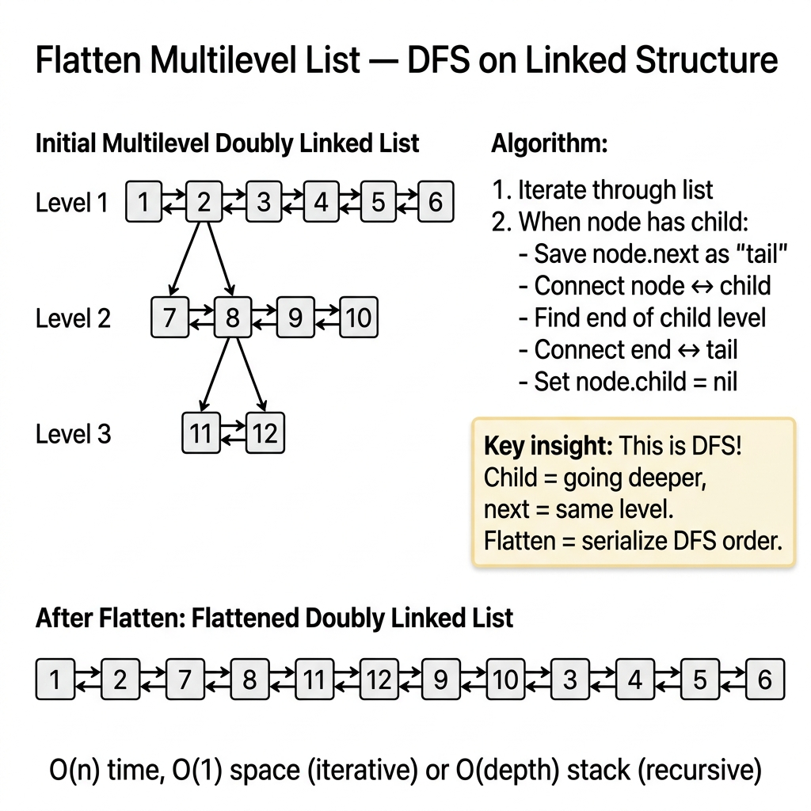

<!-- tags: dsa, algorithms, linked-lists, dfs -->
# 🪜 Flatten Multilevel Doubly Linked List

> This problem aggressively tests pointer surgery skills. You must handle `prev`, `next`, and `child` pointers while maintaining DFS order without dropping suffixes. A single error breaks traversal across both directions.

📅 Created: 2026-03-31 · 🔄 Updated: 2026-04-10 · ⏱️ 18 min read

| Aspect | Detail |
| ------ | ------ |
| **Complexity** | O(n) time · O(h) recursion stack or explicit stack |
| **Use case** | Doubly linked list surgery, DFS order, splicing |
| **Recognition** | Nodes feature `child` pointers demanding depth-first flattening |

---

## 1. DEFINE

You run into timeouts or failing edge cases often. 🪜 Flatten Multilevel Doubly Linked List makes sense once you grasp the structural invariant stabilizing it.

<!-- [Beginner layer] -->
You face a doubly linked list where nodes might branch down via a `child` pointer. The goal flattens everything into a single level maintaining DFS order. Preserving the old `next` pointer before diving down prevents destroying the structure.

<!-- [Experienced layer] -->
The standard solution addresses three actions per child node:
- save the old `next` pointer
- splice the child list between the node and its old successor
- connect the child segment tail back to the old successor

Core insight: **flattening is a splicing operation, not just a simple tree walk.**

| Variant | When to use | Core Idea | Example |
| ------- | -------- | ------- | ------- |
| **Iterative splice** | Easy in-place iteration | Reconnect suffix after tracing child tail | LC 430 |
| **Recursive DFS** | Reflects DFS structure natively | Return the tail of the flattened segment | Elegant recursion |
| **Explicit stack DFS** | Avoid deep recursion issues | Push `next` then dive into `child` | Production safe |

| Approach | Time | Space | When to choose |
| -------- | ---- | ----- | -------- |
| Iterative splice | O(n²) if repeatedly finding tails | O(1) | Useful for basic demonstration |
| Recursive DFS | O(n) | O(h) stack | Provides the cleanest logic |
| Explicit stack | O(n) | O(n) stack worst | Prevents recursion depth limitations |

### 1.1 Quick Recognition

- Structure uses `next`, `prev`, and `child`.
- Processing demands a DFS or preorder structure.
- Modification impacts both forward and backward connections.

### 1.2 Invariants & Failure Modes

<!-- [Expert layer] -->
- Returned tails must genuinely represent the end of flattened segments.
- Every processed node must have `child = nil/null`.
- Common failure mode: setting `next` but forgetting `next.Prev` destroys backward traversal.

---

## 2. VISUAL

The card below answers the core question: **how does splicing integrate a child segment without dropping the current sequence suffix?**



The traces below highlight exactly where children go and when to preserve suffixes.


### Level 1 — Simple
This trace answers: **where exactly does the child list go?**

```text
1 <-> 2 <-> 3
      |
      v
      7 <-> 8

flatten:
1 <-> 2 <-> 7 <-> 8 <-> 3
```
*Figure: Child segments separate the parent from its existing suffix.*

### Level 2 — Detailed
This trace answers: **why save `next` before visiting a child?**

```text
curr = 2
next = 3
child = 7 -> 8

if you overwrite curr.next = child
before saving next:
  pointer to 3 is lost

correct flow:
  save next
  splice child
  find child tail
  reconnect tail.next = next
```
*Figure: Safely caching the old suffix prevents permanent structural data loss.*

## 3. CODE

Order of operations defines correctness here.


### Problem 1: Iterative Splice Baseline
> *(The most straightforward conceptual approach, though less optimal.)*
>
> **Goal**: Flatten a multilevel structure via DFS order.
> **Approach**: Splice child segment in-place, scanning for tails dynamically.
> **Example**: `1-2-3` with `2.child = 7-8` → `1-2-7-8-3`.

```go
// flatten_iterative.go — Multilevel DLL: splice child list between node and old next
type DNode struct {
    Val        int
...
    for curr := head; curr != nil; curr = curr.Next {
        if curr.Child == nil {
            continue
        }

        next := curr.Next
        child := curr.Child
        curr.Next = child // dive down
        child.Prev = curr
        curr.Child = nil // clear child pointer

        tail := child
        for tail.Next != nil {
            tail = tail.Next // find child tail
        }

        if next != nil {
            tail.Next = next // reconnect suffix
            next.Prev = tail
        }
    }
    return head
}
```
```typescript
// flatten_iterative.ts — Multilevel DLL: splice child list between node and old next
type DNode = {
...
  for (let curr = head; curr; curr = curr.next) {
    if (!curr.child) continue;

    const next = curr.next;
    const child = curr.child;
    curr.next = child; // dive down
    child.prev = curr;
    curr.child = null; // clear child pointer

    let tail = child;
    while (tail.next) tail = tail.next; // find child tail

    if (next) {
      tail.next = next; // reconnect suffix
      next.prev = tail;
    }
  }
  return head;
}
```
```java
// FlattenMultilevelBasic.java — Multilevel DLL: splice child list between node and old next
final class FlattenMultilevelBasic {
...
        for (DNode curr = head; curr != null; curr = curr.next) {
            if (curr.child == null) continue;

            DNode next = curr.next;
            DNode child = curr.child;
            curr.next = child; // dive down
            child.prev = curr;
            curr.child = null; // clear child pointer

            DNode tail = child;
            while (tail.next != null) tail = tail.next; // find child tail

            if (next != null) {
                tail.next = next; // reconnect suffix
                next.prev = tail;
            }
        }
        return head;
    }
}
```
```rust
...
    let mut curr = head;
    while let Some(index) = curr {
        if let Some(child) = nodes[index].child {
            let next = nodes[index].next;
            nodes[index].next = Some(child); // dive down
            nodes[child].prev = Some(index);
            nodes[index].child = None; // clear child pointer

            let mut tail = child;
            while let Some(next_tail) = nodes[tail].next {
                tail = next_tail; // find child tail
            }

            if let Some(next_index) = next {
                nodes[tail].next = Some(next_index); // reconnect suffix
                nodes[next_index].prev = Some(tail);
            }
        }
        curr = nodes[index].next;
    }
    head
}
```
```cpp
// flatten_iterative.cpp — Multilevel DLL: splice child list between node and old next
...
DNode* flattenIterative(DNode* head) {
    for (DNode* curr = head; curr != nullptr; curr = curr->next) {
        if (curr->child == nullptr) continue;

        DNode* next = curr->next;
        DNode* child = curr->child;
        curr->next = child; // dive down
        child->prev = curr;
        curr->child = nullptr; // clear child pointer

        DNode* tail = child;
        while (tail->next != nullptr) tail = tail->next; // find child tail

        if (next != nullptr) {
            tail->next = next; // reconnect suffix
            next->prev = tail;
        }
    }
    return head;
}
```
```python
# flatten_iterative.py — Multilevel DLL: splice child list between node and old next
...
def flatten_iterative(head: DNode | None) -> DNode | None:
    curr = head
    while curr:
        if curr.child:
            nxt = curr.next
            child = curr.child
            curr.next = child # dive down
            child.prev = curr
            curr.child = None # clear child pointer

            tail = child
            while tail.next:
                tail = tail.next # find child tail

            if nxt:
                tail.next = nxt # reconnect suffix
                nxt.prev = tail
        curr = curr.next
    return head
```

> **Why?** The splice operation highlights the complexity here. Securing the `next` reference prevents breaking the suffix permanently. Starting with iteration secures the mechanical logic.

> **Takeaway**: Searching for child segment tails repeatedly causes inefficiency. The optimal method eliminates scanning.

---

### Problem 2: Recursive DFS Returning Tail
> *(The cleanest reasoning approach available.)*
>
> **Goal**: Complete an O(n) flattening strictly via DFS.
> **Approach**: Let the recursive call return the segment tail directly.
> **Example**: Multi-layered nests unfold smoothly without repeated tail searching.

```go
// flatten_recursive.go — Multilevel DLL: DFS returns tail of flattened segment
func Flatten(head *DNode) *DNode {
    var dfs func(*DNode) *DNode
...
            if curr.Child != nil {
                childHead := curr.Child
                childTail := dfs(childHead) // retrieve flattened tail

                curr.Child = nil // clear child pointer
                curr.Next = childHead
                childHead.Prev = curr

                if next != nil {
                    childTail.Next = next // reconnect suffix
                    next.Prev = childTail
                }

                last = childTail
            }

            curr = next
        }

        return last
    }

    dfs(head)
    return head
}
```
```typescript
// flatten_recursive.ts — Multilevel DLL: DFS returns tail of flattened segment
...
      if (curr.child) {
        const childHead = curr.child;
        const childTail = dfs(childHead)!; // retrieve flattened tail

        curr.child = null; // clear child pointer
        curr.next = childHead;
        childHead.prev = curr;

        if (next) {
          childTail.next = next; // reconnect suffix
          next.prev = childTail;
        }

        last = childTail;
      }
...
```java
// FlattenMultilevelIntermediate.java — Multilevel DLL: DFS returns tail of flattened segment
...
        while (curr != null) {
            FlattenMultilevelBasic.DNode next = curr.next;
            last = curr;

            if (curr.child != null) {
                FlattenMultilevelBasic.DNode childHead = curr.child;
                FlattenMultilevelBasic.DNode childTail = dfs(childHead); // retrieve flattened tail

                curr.child = null; // clear child pointer
                curr.next = childHead;
                childHead.prev = curr;

                if (next != null) {
                    childTail.next = next; // reconnect suffix
                    next.prev = childTail;
                }

                last = childTail;
            }
            curr = next;
        }
        return last;
    }
}
```
```rust
...
    while let Some(index) = curr {
        let next = nodes[index].next;
        last = Some(index);

        if let Some(child) = nodes[index].child {
            let child_tail = dfs_flatten(nodes, Some(child)).unwrap(); // retrieve flattened tail

            nodes[index].child = None; // clear child pointer
            nodes[index].next = Some(child);
            nodes[child].prev = Some(index);

            if let Some(next_index) = next {
                nodes[child_tail].next = Some(next_index); // reconnect suffix
                nodes[next_index].prev = Some(child_tail);
            }

            last = Some(child_tail);
        }

        curr = next;
    }
...
```cpp
// flatten_recursive.cpp — Multilevel DLL: DFS returns tail of flattened segment
...
        if (curr->child != nullptr) {
            DNode* childHead = curr->child;
            DNode* childTail = dfsFlatten(childHead); // retrieve flattened tail

            curr->child = nullptr; // clear child pointer
            curr->next = childHead;
            childHead->prev = curr;

            if (next != nullptr) {
                childTail->next = next; // reconnect suffix
                next->prev = childTail;
            }

            last = childTail;
        }
        curr = next;
    }

    return last;
}
```
```python
# flatten_recursive.py — Multilevel DLL: DFS returns tail of flattened segment
...
        while curr:
            nxt = curr.next
            last = curr

            if curr.child:
                child_head = curr.child
                child_tail = dfs(child_head) # retrieve flattened tail

                curr.child = None # clear child pointer
                curr.next = child_head
                child_head.prev = curr

                if nxt:
                    child_tail.next = nxt # reconnect suffix
                    nxt.prev = child_tail

                last = child_tail

            curr = nxt
...
```

> **Why?** Returning the tail shifts the logic into a purely elegant O(n) operation. It sidesteps repeated scanning entirely.

> **Takeaway**: If interviewers permit recursion, this version represents the clearest DFS execution model possible.

---

### Problem 3: Iterative DFS with Explicit Stack
> *(Production approach bypassing recursion constraints entirely.)*
>
> **Goal**: Simulate DFS without relying on system stack depth limits.
> **Approach**: Stack suffixes before diving into child segments.
> **Example**: Manages deep hierarchies effortlessly via heap allocations.

```go
// flatten_stack.go — Multilevel DLL: explicit stack simulates DFS order
func FlattenWithStack(head *DNode) *DNode {
    if head == nil {
...
    for len(stack) > 0 {
        curr := stack[len(stack)-1]
        stack = stack[:len(stack)-1]

        prev.Next = curr
        curr.Prev = prev

        if curr.Next != nil {
            stack = append(stack, curr.Next) // save suffix
        }
        if curr.Child != nil {
            stack = append(stack, curr.Child) // dive down
            curr.Child = nil // clear child pointer
        }

        prev = curr
    }

    dummy.Next.Prev = nil
    return dummy.Next
}
```
```typescript
// flatten_stack.ts — Multilevel DLL: explicit stack simulates DFS order
...
  while (stack.length) {
    const curr = stack.pop()!;

    prev.next = curr;
    curr.prev = prev;

    if (curr.next) stack.push(curr.next); // save suffix
    if (curr.child) {
      stack.push(curr.child); // dive down
      curr.child = null; // clear child pointer
    }

    prev = curr;
  }

  dummy.next!.prev = null;
  return dummy.next;
}
```
```java
// FlattenMultilevelAdvanced.java — Multilevel DLL: explicit stack simulates DFS order
...
        while (!stack.isEmpty()) {
            FlattenMultilevelBasic.DNode curr = stack.pop();
            prev.next = curr;
            curr.prev = prev;

            if (curr.next != null) stack.push(curr.next); // save suffix
            if (curr.child != null) {
                stack.push(curr.child); // dive down
                curr.child = null; // clear child pointer
            }

            prev = curr;
        }

        dummy.next.prev = null;
        return dummy.next;
    }
}
```
```rust
...
    while let Some(index) = stack.pop() {
        if let Some(prev_index) = prev {
            nodes[prev_index].next = Some(index);
            nodes[index].prev = Some(prev_index);
        }

        if let Some(next_index) = nodes[index].next {
            stack.push(next_index); // save suffix
        }
        if let Some(child_index) = nodes[index].child {
            stack.push(child_index); // dive down
            nodes[index].child = None; // clear child pointer
        }

        prev = Some(index);
    }
...
```cpp
// flatten_stack.cpp — Multilevel DLL: explicit stack simulates DFS order
...
    while (!stack.empty()) {
        DNode* curr = stack.back();
        stack.pop_back();

        prev->next = curr;
        curr->prev = prev;

        if (curr->next != nullptr) stack.push_back(curr->next); // save suffix
        if (curr->child != nullptr) {
            stack.push_back(curr->child); // dive down
            curr->child = nullptr; // clear child pointer
        }

        prev = curr;
    }

    dummy.next->prev = nullptr;
    return dummy.next;
}
```
```python
# flatten_stack.py — Multilevel DLL: explicit stack simulates DFS order
...
    while stack:
        curr = stack.pop()
        prev.next = curr
        curr.prev = prev

        if curr.next:
            stack.append(curr.next) # save suffix
        if curr.child:
            stack.append(curr.child) # dive down
            curr.child = None # clear child pointer

        prev = curr

    dummy.next.prev = None
    return dummy.next
```

> **Why?** Explicit stacks shift control flow from system resources into manageable data structures. Deep hierarchies survive safely.

> **Takeaway**: Explicit stacks materialize DFS frontiers naturally once you master the tail-returning recursive approach.

---

## 4. PITFALLS

Surgery fails when reconnections skip crucial bidirectional pointers.


| # | Severity | Error | Consequence | Fix |
|---|----------|-----|---------|-----|
| 1 | 🔴 Fatal | Forget to save `next` before splicing | Complete loss of sequence suffix | Preserve `next` before reassignment |
| 2 | 🔴 Fatal | Update `next` without updating `next.Prev` | Breaks reverse list traversal | Maintain bidirectional parity always |
| 3 | 🟡 Common | Fail to clear `child` pointer | Leaves dangling structural branches | Set `child = nil/null` explicitly |
| 4 | 🟡 Common | Scan tails repeatedly in loops | Triggers O(n²) performance degradation | Return tail recursively or stack |
| 5 | 🔵 Minor | Assume this is pure DFS | Misunderstands the splicing necessity | Treat it as active surgery |

---

## 5. REF

| Resource | Type | Link | Note |
| -------- | ---- | ---- | ------- |
| Flatten a Multilevel Doubly Linked List | LeetCode | https://leetcode.com/problems/flatten-a-multilevel-doubly-linked-list/ | Standard problem |
| Depth-first search | Reference | https://en.wikipedia.org/wiki/Depth-first_search | Context for flattening |

---

## 6. RECOMMEND

Next, evaluate doubly linked list surgeries elsewhere or revert to basic maneuvers.


| Next Problem | Why Read This Next | Link |
| ------------- | ------------------- | ---- |
| LRU Cache | Involves doubly linked list surgeries | [04-lru-cache.md](./04-lru-cache.md) |
| Reversal | Strengthens pointer reassignment fundamentals | [01-reversal.md](./01-reversal.md) |
| OOD Interview | Connects object logic via structure | [../../ood-interview/foundations/03-oop-fundamentals.md](../../ood-interview/foundations/03-oop-fundamentals.md) |

---

## 7. QUICK REF

**Template**

```text
save next
splice child after current
flatten child segment
reconnect child tail to old next
clear child
```

**Pattern recognition**

- `child + next + prev` -> prioritize splicing over simple traversal.
- `flatten in DFS order` -> recursion returning tail dominates efficiency.
- `avoid recursion depth` -> deploy explicit DFS stacks.

---

Why is flattening DFS? The child acts like a recursive descent, while `next` acts like returning to level depth. Flattening serializes this DFS path into structural links.
