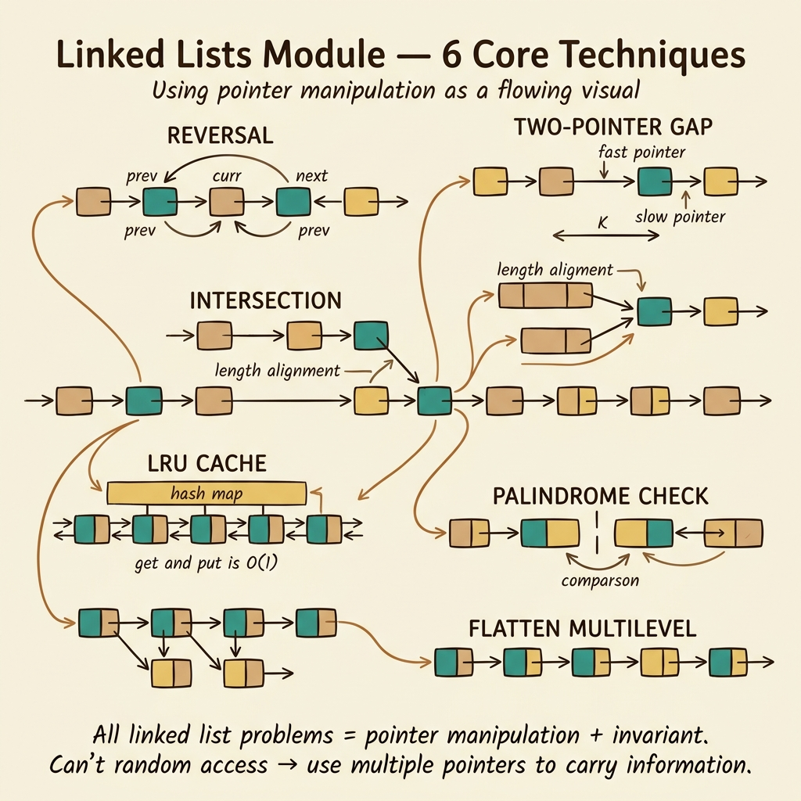
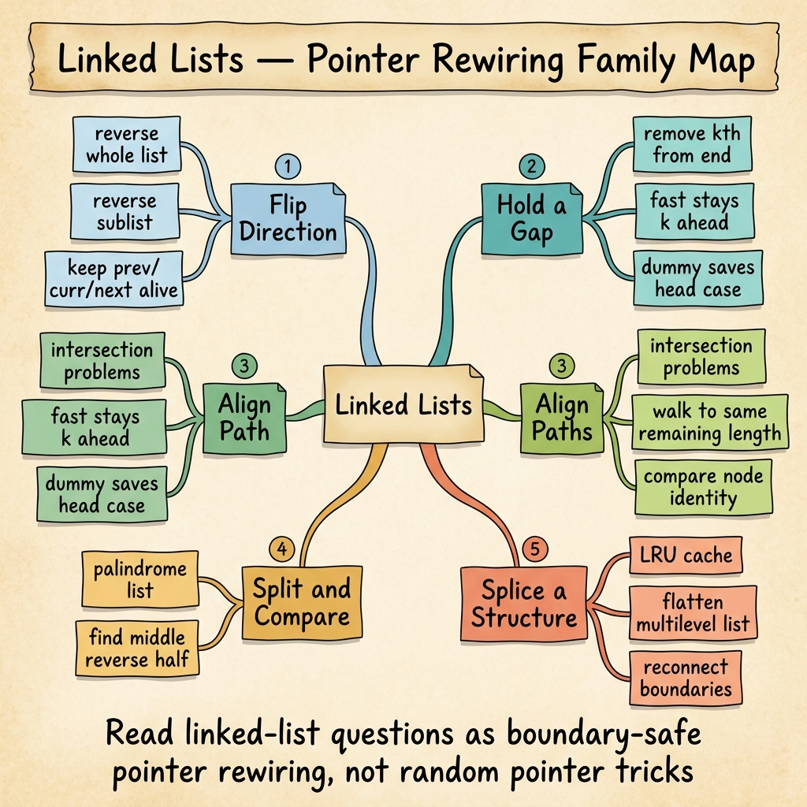

<!-- tags: dsa, algorithms, linked-lists, overview -->
# Linked Lists — Pointer Rewiring Under Pressure

> Arrays give you indices. Linked lists strip away that privilege and force you to think in pointers, predecessors, and head/tail boundaries. This module trains exactly that kind of pressure.

📅 Created: 2026-04-04 · 🔄 Updated: 2026-04-10 · ⏱️ 8 min read

| Aspect | Detail |
| ------ | ------ |
| **Focus** | Pointer rewiring, dummy node, predecessor control |
| **Common trap** | Code works mid-list but breaks at head/tail |
| **Adjacent pattern** | Fast/slow pointers and cache design |

---




## 1. DEFINE

You just left the array mindset and discovered index-based habits no longer save you. This router exists to answer one question before opening specific problems: **is this about rewiring, keeping a gap, aligning phases, or splicing a larger structure?**

When moving from arrays to linked lists, good habits become wrong directions. You do not jump to index `i`. You walk node by node, keep the predecessor, and avoid losing the next node when changing `Next`.
Problems in this module are not hard because of syntax. They are hard because one mistimed rewiring drops the whole list segment. Dummy nodes, fast/slow, split/merge, and cache design all stem from that exact pain.
The right approach is viewing each problem as a variant of: "Which pointers must stay alive while reshaping the list?"

### Module Problems
| Problem | Core Tension | Invariant | Link |
| --- | --- | --- | --- |
| Reversal | Reverse direction without dropping the list | Keep `prev/current/next` in their roles | [01-reversal.md](./01-reversal.md) |
| Remove Kth From End | Need predecessor of the node from the end | Fixed gap between fast and slow pointers | [02-remove-kth-last.md](./02-remove-kth-last.md) |
| Intersection | Lists differ at head but share a tail | Compensate length differences to align phases | [03-intersection.md](./03-intersection.md) |
| LRU Cache | Need O(1) get/put and stable eviction | Hash map + doubly linked list keep recency | [04-lru-cache.md](./04-lru-cache.md) |
| Palindrome Linked List | Compare halves without random access | Find midpoint and reverse the second half | [05-palindrome.md](./05-palindrome.md) |
| Flatten Multilevel | Multiple nested pointer layers | Splice child list into position and connect tail | [06-flatten-multilevel.md](./06-flatten-multilevel.md) |

## 2. VISUAL

The card router below groups linked list problems into core operations instead of treating them as six different tricks.



The text map below preserves that logic in compact markdown for quick scanning.

```text

Linked list problem
  |
  +-- need to rewire direction?      -> Reversal
  +-- need predecessor at distance?  -> Remove Kth / Fast-Slow
  +-- need to align two lists?       -> Intersection
  +-- need to keep O(1) recency?     -> LRU Cache
  +-- need to split, flip, merge?    -> Palindrome
  +-- need to splice multiple tiers? -> Flatten Multilevel
```
*Figure: Beneath the surface, many list problems are variants of keeping pointers alive while the structure changes.*

## 3. CODE

Reading order should start with pure rewiring before mixing data structures or complex boundaries.

| Order | File | Why Read This Next | Key Takeaway |
| --- | --- | --- | --- |
| 1 | [01-reversal.md](./01-reversal.md) | The root of all pointer rewiring | Do not drop the rest of the list |
| 2 | [02-remove-kth-last.md](./02-remove-kth-last.md) and [03-intersection.md](./03-intersection.md) | Distance offsets and phase alignment | Relative distance between pointers |
| 3 | [05-palindrome.md](./05-palindrome.md) | Combine midpoint + reverse + compare | Uses multiple list skills at once |
| 4 | [04-lru-cache.md](./04-lru-cache.md) and [06-flatten-multilevel.md](./06-flatten-multilevel.md) | Move from pure list to hybrid structures | List acts as the spine of a mini-system |

## 4. PITFALLS

Linked lists rarely fail due to massive concepts. They fail because of a forgotten pointer, an off-by-one boundary, or a missing reconnect.


| Pitfall | Symptom | Why It Fails | Fix | Severity |
| ------- | -------- | ---------- | -------- | -------- |
| Forget to save `next` before changing `current.Next` | Lose the rest of the list | Rewiring breaks the only path forward | Save `nextNode` before destructive changes | high |
| No dummy node when head can change | Code has many head special-cases | Boundary splits from main logic | Add dummy node to unify processing paths | high |
| Confuse identity with value | Intersection checked by `Val`, not node | Problem is about object reference, not content | Clarify if comparing values or references | high |
| Treat linked list like an array | Try to access middle index directly | Data model denies cheap random access | Shift mindset to pointer movement and predecessors | medium |

## 5. REF

- Open Data Structures: https://opendatastructures.org/
- Reverse Linked List: https://leetcode.com/problems/reverse-linked-list/
- Remove Nth Node From End of List: https://leetcode.com/problems/remove-nth-node-from-end-of-list/

## 6. RECOMMEND

Once you master pointer rewiring, the next step is spotting the shared pattern behind those movements.

- If the list involves offsets, cycles, or midpoints: go to [../patterns/fast-slow/README.md](../patterns/fast-slow/README.md).
- If the list just maintains order for a larger structure, review [04-lru-cache.md](./04-lru-cache.md).
- If you want to move from linear rewiring to tree structures, proceed to [../tree-algorithms/README.md](../tree-algorithms/README.md).

## 7. QUICK REF

- Dummy nodes are often cheaper than special-cases.
- Safe rewiring means saving the next pointer before cutting or connecting.
- Many list problems actually focus on the predecessor, not the target node itself.
