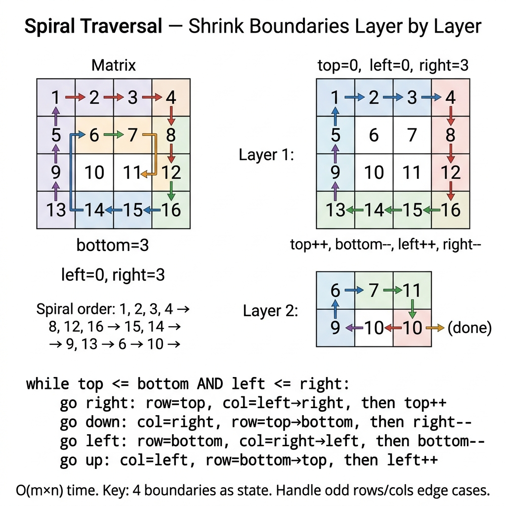

<!-- tags: dsa, algorithms -->
# 🌀 Spiral Traversal

> Classic matrix boundary problem. Track four boundaries and peel off layers without visiting cells twice.

📅 Created: 2026-03-31 · 🔄 Updated: 2026-04-09 · ⏱️ 16 min read

| Aspect | Detail |
| ------ | ------ |
| **Complexity** | O(m·n) time / O(1) extra space aside from output |
| **Use case** | Matrix traversal, simulation, boundary management |
| **Related** | Math & Geometry, Matrices, Simulation |

---

## 1. DEFINE

<!-- [Beginner layer] -->

You need to read a matrix in spiral order. Visually, this looks purely mechanical: go right, down, left, up. However, the easiest part to break is not the four directions. It is the boundary. Updating a boundary incorrectly or forgetting a guard for a single row or column causes duplicate or skipped cells.

`Spiral Traversal` is a textbook boundary reasoning problem. Each loop does not just follow four edges. It shrinks the unhandled area using four variables: `top`, `bottom`, `left`, and `right`. The entire correctness depends on these boundaries accurately describing the remaining rectangle after each loop.

Core insight: **The spiral is not hard because of directions. It is hard because the unvisited area must remain consistent after peeling each edge**.

| Variant | When to use | Key idea |
| ------- | -------- | ------- |
| Rectangular matrix | When rows and columns differ | Use 4 boundaries but apply stricter guards |
| Single row/col leftovers | When the last layer is a single row or column | Check intersections after every boundary update |
| Spiral generation | When asked to write numbers instead of reading them | Keep boundary logic, change the action per cell |

| Approach | Time | Space | When to choose |
| -------- | ---- | ----- | -------- |
| Direction simulation with visited | O(mn) | O(mn) | Easy baseline but wastes memory |
| Four-boundary traversal | O(mn) | O(1) | Standard solution, boundary is the reasoning core |
| Spiral generation | O(mn) | O(1) | When the problem requires writing over reading |

### 1.1 Quick Identification

- The problem asks to traverse or fill a matrix in spiral order.
- You spot an "outside-in peeling" structure.
- Boundary management matters more than data structure choices.

### 1.2 Invariants & Failure Modes

- Before each loop, `[top..bottom] x [left..right]` holds the entire unhandled area.
- After processing an edge, the corresponding boundary must shrink by exactly 1 unit.
- Common failure mode: forgetting a guard after shrinking boundaries. This causes the last row or column to be read twice.

## 2. VISUAL

The difficulty of these problems lies in representation and boundaries. A trace shows why the correct perspective matters more than implementation syntax.

### Level 1 — Core intuition

```text
[1  2  3  4]
[5  6  7  8]   ->   1 2 3 4 8 12 11 10 9 5 6 7
[9 10 11 12]

layer 1: top row, right col, bottom row, left col
layer 2: repeat with shrunken boundaries
```

*Caption*: 🌀 Spiral Traversal at Level 1 shows core intuition. Level 2 explains state update sequences from input to output.

### Level 2 — Decision trace

- For 🌀 Spiral Traversal, the input representation must be normalized early to avoid sign flips, overflow, or precision drift.
- Each 🌀 Spiral Traversal step must preserve the core arithmetic or geometric relation the problem relies on.
- 🌀 Spiral Traversal edge cases cannot wait until the end. Handle duplicate points, negative numbers, or degeneracies in the main flow.
- Only when the 🌀 Spiral Traversal representation and boundaries are stable can the final formula be trusted on large inputs.



## 3. CODE

Once the representation is locked, code is just deploying that reasoning. We go from a provable baseline to stronger variants.

### Problem 1: Basic — Core Pattern

> **Goal**: Traverse a matrix in spiral order without repeating cells or using a visited matrix.
> **Approach**: Maintain four boundary variables `top / bottom / left / right`. Shrink the correct boundary after each side.
> **Example**: `spiralOrder([[1,2,3],[4,5,6],[7,8,9]]) → [1,2,3,6,9,8,7,4,5]`

```go
// spiral_traversal.go — Spiral Traversal: shrinking boundaries in-place
package mathgeometry

func SpiralOrder(matrix [][]int) []int {
    if len(matrix) == 0 || len(matrix[0]) == 0 { return nil }
    top, bottom := 0, len(matrix)-1
    left, right := 0, len(matrix[0])-1
    result := make([]int, 0, len(matrix)*len(matrix[0]))
    for top <= bottom && left <= right {
        for col := left; col <= right; col++ { result = append(result, matrix[top][col]) }
        top++
        for row := top; row <= bottom; row++ { result = append(result, matrix[row][right]) }
        right--
        if top <= bottom {
            for col := right; col >= left; col-- { result = append(result, matrix[bottom][col]) }
            bottom--
        }
        if left <= right {
            for row := bottom; row >= top; row-- { result = append(result, matrix[row][left]) }
            left++
        }
    }
    return result
}
```

```typescript
// spiral-traversal.ts — Spiral Traversal: shrinking boundaries in-place
export function spiralOrder(matrix: number[][]): number[] {
  if (!matrix.length || !matrix[0].length) return [];
  let top = 0, bottom = matrix.length - 1;
  let left = 0, right = matrix[0].length - 1;
  const result: number[] = [];
  while (top <= bottom && left <= right) {
    for (let col = left; col <= right; col++) result.push(matrix[top][col]);
    top++;
    for (let row = top; row <= bottom; row++) result.push(matrix[row][right]);
    right--;
    if (top <= bottom) {
      for (let col = right; col >= left; col--) result.push(matrix[bottom][col]);
      bottom--;
    }
    if (left <= right) {
      for (let row = bottom; row >= top; row--) result.push(matrix[row][left]);
      left++;
    }
  }
  return result;
}
```

```rust
// spiral_traversal.rs — Spiral Traversal: shrinking boundaries in-place
pub fn spiral_order(matrix: Vec<Vec<i32>>) -> Vec<i32> {
    if matrix.is_empty() || matrix[0].is_empty() { return vec![]; }
    let (mut top, mut bottom) = (0i32, matrix.len() as i32 - 1);
    let (mut left, mut right) = (0i32, matrix[0].len() as i32 - 1);
    let mut result = Vec::new();
    while top <= bottom && left <= right {
        for col in left..=right { result.push(matrix[top as usize][col as usize]); }
        top += 1;
        for row in top..=bottom { result.push(matrix[row as usize][right as usize]); }
        right -= 1;
        if top <= bottom {
            for col in (left..=right).rev() { result.push(matrix[bottom as usize][col as usize]); }
            bottom -= 1;
        }
        if left <= right {
            for row in (top..=bottom).rev() { result.push(matrix[row as usize][left as usize]); }
            left += 1;
        }
    }
    result
}
```

```cpp
// spiral_traversal.cpp — Spiral Traversal: shrinking boundaries in-place
std::vector<int> spiralOrder(std::vector<std::vector<int>>& matrix) {
    if (matrix.empty() || matrix[0].empty()) return {};
    int top = 0, bottom = (int)matrix.size() - 1;
    int left = 0, right = (int)matrix[0].size() - 1;
    std::vector<int> result;
    while (top <= bottom && left <= right) {
        for (int c = left; c <= right; ++c) result.push_back(matrix[top][c]);
        ++top;
        for (int r = top; r <= bottom; ++r) result.push_back(matrix[r][right]);
        --right;
        if (top <= bottom) {
            for (int c = right; c >= left; --c) result.push_back(matrix[bottom][c]);
            --bottom;
        }
        if (left <= right) {
            for (int r = bottom; r >= top; --r) result.push_back(matrix[r][left]);
            ++left;
        }
    }
    return result;
}
```

```python
# spiral_traversal.py — Spiral Traversal: shrinking boundaries in-place
def spiral_order(matrix: list[list[int]]) -> list[int]:
    if not matrix or not matrix[0]:
        return []
    top, bottom = 0, len(matrix) - 1
    left, right = 0, len(matrix[0]) - 1
    result: list[int] = []
    while top <= bottom and left <= right:
        for col in range(left, right + 1):
            result.append(matrix[top][col])
        top += 1
        for row in range(top, bottom + 1):
            result.append(matrix[row][right])
        right -= 1
        if top <= bottom:
            for col in range(right, left - 1, -1):
                result.append(matrix[bottom][col])
            bottom -= 1
        if left <= right:
            for row in range(bottom, top - 1, -1):
                result.append(matrix[row][left])
            left += 1
    return result
```

```java
// SpiralTraversal.java — Spiral Traversal: shrinking boundaries in-place
import java.util.ArrayList;
import java.util.List;

public final class SpiralTraversal {
    private SpiralTraversal() {}

    public static List<Integer> spiralOrder(int[][] matrix) {
        List<Integer> result = new ArrayList<>();
        if (matrix.length == 0 || matrix[0].length == 0) return result;
        int top = 0, bottom = matrix.length - 1;
        int left = 0, right = matrix[0].length - 1;
        while (top <= bottom && left <= right) {
            for (int col = left; col <= right; col++) result.add(matrix[top][col]);
            top++;
            for (int row = top; row <= bottom; row++) result.add(matrix[row][right]);
            right--;
            if (top <= bottom) {
                for (int col = right; col >= left; col--) result.add(matrix[bottom][col]);
                bottom--;
            }
            if (left <= right) {
                for (int row = bottom; row >= top; row--) result.add(matrix[row][left]);
                left++;
            }
        }
        return result;
    }
}
```

> **Why?** The core pattern struggles more with boundaries than syntax. When the representation is normalized and updates maintain geometric relations, the algorithm avoids degeneracy.

> **Conclusion**: The basic version locks the correct invariant for matrix-boundary problems. After traversing a layer, four boundaries must shrink correctly. Wrong boundary updates cause duplicated or skipped cells.

### Problem 2: Intermediate — Spiral Matrix Generation

> **Goal**: Shift from "reading a matrix" to "filling a matrix" in spiral order.
> **Approach**: Reuse the same 4 boundaries `top/bottom/left/right`. Replace `append` with `write value`.
> **Example**: `generateSpiral(3) → [[1,2,3],[8,9,4],[7,6,5]]`
> **Complexity**: O(n²) time, O(1) extra space aside from output

```go
// spiral_matrix_ii.go — Spiral generation: same boundary pattern, but write instead of read
func GenerateSpiral(n int) [][]int {
    matrix := make([][]int, n)
    for row := range matrix {
        matrix[row] = make([]int, n)
    }

    top, bottom := 0, n-1
    left, right := 0, n-1
    value := 1

    for top <= bottom && left <= right {
        for col := left; col <= right; col++ {
            matrix[top][col] = value
            value++
        }
        top++
        for row := top; row <= bottom; row++ {
            matrix[row][right] = value
            value++
        }
        right--
        if top <= bottom {
            for col := right; col >= left; col-- {
                matrix[bottom][col] = value
                value++
            }
            bottom--
        }
        if left <= right {
            for row := bottom; row >= top; row-- {
                matrix[row][left] = value
                value++
            }
            left++
        }
    }
    return matrix
}
```

```typescript
// spiral_matrix_ii.ts — Spiral generation: same boundary pattern, but write instead of read
export function generateSpiral(n: number): number[][] {
  const matrix = Array.from({ length: n }, () => Array<number>(n).fill(0));
  let top = 0, bottom = n - 1, left = 0, right = n - 1, value = 1;
  while (top <= bottom && left <= right) {
    for (let col = left; col <= right; col++) matrix[top][col] = value++;
    top++;
    for (let row = top; row <= bottom; row++) matrix[row][right] = value++;
    right--;
    if (top <= bottom) for (let col = right; col >= left; col--) matrix[bottom][col] = value++;
    bottom--;
    if (left <= right) for (let row = bottom; row >= top; row--) matrix[row][left] = value++;
    left++;
  }
  return matrix;
}
```

```rust
// spiral_matrix_ii.rs — Spiral generation: same boundary pattern, but write instead of read
pub fn generate_spiral(n: usize) -> Vec<Vec<i32>> {
    let mut matrix = vec![vec![0; n]; n];
    let (mut top, mut bottom) = (0i32, n as i32 - 1);
    let (mut left, mut right) = (0i32, n as i32 - 1);
    let mut value = 1;
    while top <= bottom && left <= right {
        for col in left..=right { matrix[top as usize][col as usize] = value; value += 1; }
        top += 1;
        for row in top..=bottom { matrix[row as usize][right as usize] = value; value += 1; }
        right -= 1;
        if top <= bottom {
            for col in (left..=right).rev() { matrix[bottom as usize][col as usize] = value; value += 1; }
            bottom -= 1;
        }
        if left <= right {
            for row in (top..=bottom).rev() { matrix[row as usize][left as usize] = value; value += 1; }
            left += 1;
        }
    }
    matrix
}
```

```cpp
// spiral_matrix_ii.cpp — Spiral generation: same boundary pattern, but write instead of read
std::vector<std::vector<int>> generateSpiral(int n) {
    std::vector<std::vector<int>> matrix(n, std::vector<int>(n, 0));
    int top = 0, bottom = n - 1, left = 0, right = n - 1, value = 1;
    while (top <= bottom && left <= right) {
        for (int col = left; col <= right; ++col) matrix[top][col] = value++;
        ++top;
        for (int row = top; row <= bottom; ++row) matrix[row][right] = value++;
        --right;
        if (top <= bottom) {
            for (int col = right; col >= left; --col) matrix[bottom][col] = value++;
            --bottom;
        }
        if (left <= right) {
            for (int row = bottom; row >= top; --row) matrix[row][left] = value++;
            ++left;
        }
    }
    return matrix;
}
```

```python
# spiral_matrix_ii.py — Spiral generation: same boundary pattern, but write instead of read
def generate_spiral(n: int) -> list[list[int]]:
    matrix = [[0] * n for _ in range(n)]
    top, bottom, left, right = 0, n - 1, 0, n - 1
    value = 1
    while top <= bottom and left <= right:
        for col in range(left, right + 1):
            matrix[top][col] = value
            value += 1
        top += 1
        for row in range(top, bottom + 1):
            matrix[row][right] = value
            value += 1
        right -= 1
        if top <= bottom:
            for col in range(right, left - 1, -1):
                matrix[bottom][col] = value
                value += 1
            bottom -= 1
        if left <= right:
            for row in range(bottom, top - 1, -1):
                matrix[row][left] = value
                value += 1
            left += 1
    return matrix
```

```java
// SpiralMatrixII.java — Spiral generation: same boundary pattern, but write instead of read
public static int[][] generateSpiral(int n) {
    int[][] matrix = new int[n][n];
    int top = 0, bottom = n - 1, left = 0, right = n - 1, value = 1;
    while (top <= bottom && left <= right) {
        for (int col = left; col <= right; col++) matrix[top][col] = value++;
        top++;
        for (int row = top; row <= bottom; row++) matrix[row][right] = value++;
        right--;
        if (top <= bottom) {
            for (int col = right; col >= left; col--) matrix[bottom][col] = value++;
            bottom--;
        }
        if (left <= right) {
            for (int row = bottom; row >= top; row--) matrix[row][left] = value++;
            left++;
        }
    }
    return matrix;
}
```

> **Why?** Spiral Matrix Generation struggles more with boundaries than syntax. When the representation is normalized and updates maintain geometric relations, the algorithm avoids degeneracy.

> **Conclusion**: The generation problem is an excellent test. It checks if you truly understand the boundary pattern or just memorized a specific matrix-reading implementation.

### Problem 3: Advanced — Extract Matrix Rings

> **Goal**: Reuse boundary thinking to extract individual matrix "rings". This is useful for matrix rotation or layer-based processing.
> **Approach**: For each layer, read 4 edges into a slice. Guards prevent reading single rows or columns repeatedly.
> **Example**: `extractRings([[1,2,3],[4,5,6],[7,8,9]]) → [[1,2,3,6,9,8,7,4],[5]]`
> **Complexity**: O(m·n) time, O(m·n) output

```go
// matrix_rings.go — Layer extraction: useful for ring rotation or per-layer processing
func ExtractRings(matrix [][]int) [][]int {
    if len(matrix) == 0 || len(matrix[0]) == 0 {
        return nil
    }

    top, bottom := 0, len(matrix)-1
    left, right := 0, len(matrix[0])-1
    rings := make([][]int, 0)

    for top <= bottom && left <= right {
        ring := make([]int, 0)
        for col := left; col <= right; col++ { ring = append(ring, matrix[top][col]) }
        for row := top + 1; row <= bottom; row++ { ring = append(ring, matrix[row][right]) }
        if top < bottom {
            for col := right - 1; col >= left; col-- { ring = append(ring, matrix[bottom][col]) }
        }
        if left < right {
            for row := bottom - 1; row > top; row-- { ring = append(ring, matrix[row][left]) }
        }
        rings = append(rings, ring)
        top++
        bottom--
        left++
        right--
    }
    return rings
}
```

```typescript
// matrix_rings.ts — Layer extraction: useful for ring rotation or per-layer processing
export function extractRings(matrix: number[][]): number[][] {
  if (!matrix.length || !matrix[0].length) return [];
  let top = 0, bottom = matrix.length - 1;
  let left = 0, right = matrix[0].length - 1;
  const rings: number[][] = [];
  while (top <= bottom && left <= right) {
    const ring: number[] = [];
    for (let col = left; col <= right; col++) ring.push(matrix[top][col]);
    for (let row = top + 1; row <= bottom; row++) ring.push(matrix[row][right]);
    if (top < bottom) for (let col = right - 1; col >= left; col--) ring.push(matrix[bottom][col]);
    if (left < right) for (let row = bottom - 1; row > top; row--) ring.push(matrix[row][left]);
    rings.push(ring);
    top++; bottom--; left++; right--;
  }
  return rings;
}
```

```rust
// matrix_rings.rs — Layer extraction: useful for ring rotation or per-layer processing
pub fn extract_rings(matrix: &[Vec<i32>]) -> Vec<Vec<i32>> {
    if matrix.is_empty() || matrix[0].is_empty() { return vec![]; }
    let (mut top, mut bottom) = (0i32, matrix.len() as i32 - 1);
    let (mut left, mut right) = (0i32, matrix[0].len() as i32 - 1);
    let mut rings = Vec::new();
    while top <= bottom && left <= right {
        let mut ring = Vec::new();
        for col in left..=right { ring.push(matrix[top as usize][col as usize]); }
        for row in top + 1..=bottom { ring.push(matrix[row as usize][right as usize]); }
        if top < bottom {
            for col in (left..right).rev() { ring.push(matrix[bottom as usize][col as usize]); }
        }
        if left < right {
            for row in ((top + 1)..bottom).rev() { ring.push(matrix[row as usize][left as usize]); }
        }
        rings.push(ring);
        top += 1; bottom -= 1; left += 1; right -= 1;
    }
    rings
}
```

```cpp
// matrix_rings.cpp — Layer extraction: useful for ring rotation or per-layer processing
std::vector<std::vector<int>> extractRings(const std::vector<std::vector<int>>& matrix) {
    if (matrix.empty() || matrix[0].empty()) return {};
    int top = 0, bottom = (int)matrix.size() - 1;
    int left = 0, right = (int)matrix[0].size() - 1;
    std::vector<std::vector<int>> rings;
    while (top <= bottom && left <= right) {
        std::vector<int> ring;
        for (int col = left; col <= right; ++col) ring.push_back(matrix[top][col]);
        for (int row = top + 1; row <= bottom; ++row) ring.push_back(matrix[row][right]);
        if (top < bottom) for (int col = right - 1; col >= left; --col) ring.push_back(matrix[bottom][col]);
        if (left < right) for (int row = bottom - 1; row > top; --row) ring.push_back(matrix[row][left]);
        rings.push_back(std::move(ring));
        ++top; --bottom; ++left; --right;
    }
    return rings;
}
```

```python
# matrix_rings.py — Layer extraction: useful for ring rotation or per-layer processing
def extract_rings(matrix: list[list[int]]) -> list[list[int]]:
    if not matrix or not matrix[0]:
        return []
    top, bottom = 0, len(matrix) - 1
    left, right = 0, len(matrix[0]) - 1
    rings: list[list[int]] = []
    while top <= bottom and left <= right:
        ring: list[int] = []
        for col in range(left, right + 1):
            ring.append(matrix[top][col])
        for row in range(top + 1, bottom + 1):
            ring.append(matrix[row][right])
        if top < bottom:
            for col in range(right - 1, left - 1, -1):
                ring.append(matrix[bottom][col])
        if left < right:
            for row in range(bottom - 1, top, -1):
                ring.append(matrix[row][left])
        rings.append(ring)
        top += 1
        bottom -= 1
        left += 1
        right -= 1
    return rings
```

```java
// MatrixRings.java — Layer extraction: useful for ring rotation or per-layer processing
public static java.util.List<java.util.List<Integer>> extractRings(int[][] matrix) {
    java.util.List<java.util.List<Integer>> rings = new java.util.ArrayList<>();
    if (matrix.length == 0 || matrix[0].length == 0) return rings;
    int top = 0, bottom = matrix.length - 1;
    int left = 0, right = matrix[0].length - 1;
    while (top <= bottom && left <= right) {
        java.util.List<Integer> ring = new java.util.ArrayList<>();
        for (int col = left; col <= right; col++) ring.add(matrix[top][col]);
        for (int row = top + 1; row <= bottom; row++) ring.add(matrix[row][right]);
        if (top < bottom) for (int col = right - 1; col >= left; col--) ring.add(matrix[bottom][col]);
        if (left < right) for (int row = bottom - 1; row > top; row--) ring.add(matrix[row][left]);
        rings.add(ring);
        top++; bottom--; left++; right--;
    }
    return rings;
}
```

> **Why?** Extract Matrix Rings struggles more with boundaries than syntax. When the representation is normalized and updates maintain geometric relations, the algorithm avoids degeneracy.

> **Conclusion**: Once you view matrices as concentric layers, many simulation and rotation problems become highly mechanical.

## 4. PITFALLS

This problem group rarely breaks due to simple loops. It breaks due to normalization, overflow, boundaries, and expensive assumptions.

| # | Severity | Defect | Consequence | Fix |
| --- | --- | --- | --- | --- |
| 1 | 🔴 Fatal | Forget guards before reading the bottom row or left column | Cells are read twice or index out of range | Check intersection after every boundary shrink |
| 2 | 🟡 Common | Hard-code for square matrices | Fails immediately when m != n | Reason about general boundaries instead of square symmetry |
| 3 | 🟡 Common | Use unnecessary visited matrix | Code is longer and wastes auxiliary memory | Prioritize the 4-boundary method in interviews |

## 5. REF

| Resource | Link |
| -------- | ---- |
| LeetCode 54 — Spiral Matrix | https://leetcode.com/problems/spiral-matrix/ |
| LeetCode 59 — Spiral Matrix II | https://leetcode.com/problems/spiral-matrix-ii/ |

## 6. RECOMMEND

Once the correct representation is grasped, the next question is which neighbor pattern inherits this intuition best.

| Extension | When to use | Rationale |
| ------- | ------- | ----- |
| Spiral Matrix II | When asked to generate a matrix | Same pattern but write instead of read |
| Rotate Image | When doing harder matrix manipulation | Boundary thinking remains highly useful |
| Diagonal traverse | When practicing matrix simulation | Improves index reasoning ability |

---

**Links**: ← Previous · [→ Next](./02-reverse-integer.md)

## 7. QUICK REF

| # | Identification Signal | Action Template |
|---|--------------------|--------------------|
| 1 | Input has a clear invariant or reusable state | Write state/invariant first, then choose traversal or transition |
| 2 | Brute force repeats the same decision | Find a way to reduce search space or cache subproblems |
| 3 | Problem has many edge cases | Move boundary conditions into the main flow instead of patching later |

---

Returning to the initial question: why is boundary shrinking simpler than direction tracking? Four variables (top, bottom, left, right) encode the entire state. We need no visited matrix or direction state machine. Each loop traverses 4 edges and shrinks 1 layer.