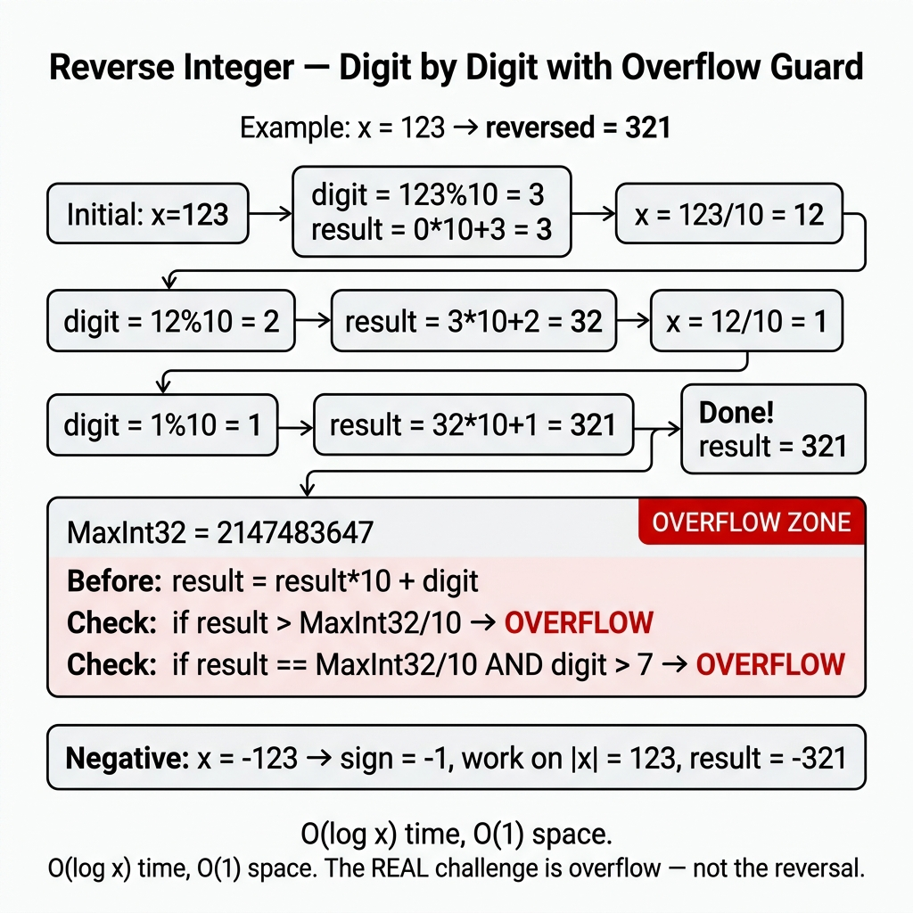

<!-- tags: dsa, algorithms -->
# ↔️ Reverse Integer

> Small but excellent problem to test overflow thinking, sign handling, and 32-bit boundaries.

📅 Created: 2026-03-31 · 🔄 Updated: 2026-04-09 · ⏱️ 16 min read

| Aspect | Detail |
| ------ | ------ |
| **Complexity** | O(digits) time / O(1) space |
| **Use case** | Overflow-safe digit processing, integer math, sign handling |
| **Related** | Math, Integer arithmetic, Overflow guards |

---

## 1. DEFINE

<!-- [Experienced layer] -->

The problem sounds very short: reverse the digits of an integer. If you do it on paper, you take the last digit and append it to the result. However, inside a machine, a question arises. Will multiplying the result by 10 and adding the next digit overflow the 32-bit signed range?

`Reverse Integer` teaches an important habit. Overflow is not an afterthought; it must be part of the invariant before mutating state. Checking after the integer overflows is too late. Therefore, this problem is about boundary checking alongside result construction, not just digit extraction.

Core insight: **The proper guard must occur before multiplying by 10 and adding the digit, not after the integer crosses the boundary**.

| Variant | When to use | Key idea |
| ------- | -------- | ------- |
| Positive integers | When building basic intuition | Extract the last digit and append it |
| Negative integers | When the sign must be preserved | Use the same flow but guard the negative range too |
| Overflow-safe reverse | When the interviewer tests boundary thinking | Check boundaries before multiplying by 10 and adding |

| Approach | Time | Space | When to choose |
| -------- | ---- | ----- | -------- |
| Digit extraction baseline | O(number of digits) | O(1) | Understand the flow of extracting and appending digits |
| Overflow-safe iterative | O(number of digits) | O(1) | Standard solution given the 32-bit signed constraint |
| String reverse | O(number of digits) | O(number of digits) | Just an illustrative baseline, not the optimal version |

### 1.1 Quick Identification

- The problem explicitly mentions `32-bit signed integer`.
- Each step extracts the last digit using `% 10` and updates the result.
- The overflow guard is the core reasoning, not a minor detail.

### 1.2 Invariants & Failure Modes

- Before every update, `result` remains within a safe range where `result * 10 + digit` can be checked.
- The sign does not need separate handling if the language defines `/` and `%` consistently.
- Common failure mode: writing correct code for small samples but checking overflow after the dangerous operation.

## 2. VISUAL

The difficulty of these problems lies in representation and boundaries. A trace shows why the correct perspective matters more than implementation syntax.

### Level 1 — Core intuition

```text
x = 123
result = 0
pop 3 -> result = 3
pop 2 -> result = 32
pop 1 -> result = 321

x = 1534236469
... before next push => overflow guard triggers => 0
```

*Caption*: ↔️ Reverse Integer at Level 1 shows core intuition. Level 2 explains state update sequences from input to output.

### Level 2 — Decision trace

- For ↔️ Reverse Integer, the input representation must be normalized early to avoid sign flips, overflow, or precision drift.
- Each ↔️ Reverse Integer step must preserve the core arithmetic or geometric relation the problem relies on.
- ↔️ Reverse Integer edge cases cannot wait until the end. Handle duplicate points, negative numbers, or degeneracies in the main flow.
- Only when the ↔️ Reverse Integer representation and boundaries are stable can the final formula be trusted on large inputs.



## 3. CODE

Once the representation is locked, code is just deploying that reasoning. We go from a provable baseline to stronger variants.

### Problem 1: Basic — Core Pattern

> **Goal**: Reverse the digits of a signed 32-bit integer, returning 0 if it exceeds limits.
> **Approach**: Loop through the last digit but guard against overflow before updating the result.
> **Example**: `reverseInteger(-120) → -21`

```go
// reverse_integer.go — Reverse Integer: overflow-safe 32-bit reversal
package mathgeometry

func Reverse(x int) int {
    result := 0
    for x != 0 {
        digit := x % 10
        x /= 10
        if result > 214748364 || (result == 214748364 && digit > 7) { return 0 }
        if result < -214748364 || (result == -214748364 && digit < -8) { return 0 }
        result = result*10 + digit
    }
    return result
}
```

```typescript
// reverse-integer.ts — Reverse Integer: overflow-safe 32-bit reversal
export function reverseInteger(x: number): number {
  let value = x;
  let result = 0;
  while (value !== 0) {
    const digit = value % 10;
    value = Math.trunc(value / 10);
    if (result > 214748364 || (result === 214748364 && digit > 7)) return 0;
    if (result < -214748364 || (result === -214748364 && digit < -8)) return 0;
    result = result * 10 + digit;
  }
  return result;
}
```

```rust
// reverse_integer.rs — Reverse Integer: overflow-safe 32-bit reversal
pub fn reverse(mut x: i32) -> i32 {
    let mut result = 0i32;
    while x != 0 {
        let digit = x % 10;
        x /= 10;
        match result.checked_mul(10).and_then(|v| v.checked_add(digit)) {
            Some(v) => result = v,
            None => return 0,
        }
    }
    result
}
```

```cpp
// reverse_integer.cpp — Reverse Integer: overflow-safe 32-bit reversal
int reverseInteger(int x) {
    long long result = 0;
    while (x != 0) {
        int digit = x % 10;
        x /= 10;
        result = result * 10 + digit;
        if (result > INT_MAX || result < INT_MIN) return 0;
    }
    return static_cast<int>(result);
}
```

```python
# reverse_integer.py — Reverse Integer: overflow-safe 32-bit reversal
def reverse_integer(x: int) -> int:
    result = 0
    value = x
    while value != 0:
        digit = int(value % 10) if value > 0 else -int((-value) % 10)
        value = int(value / 10)
        result = result * 10 + digit
        if result < -(2**31) or result > 2**31 - 1:
            return 0
    return result
```

```java
// ReverseInteger.java — Reverse Integer: overflow-safe 32-bit reversal
public final class ReverseInteger {
    private ReverseInteger() {}

    public static int reverse(int x) {
        int result = 0;
        while (x != 0) {
            int digit = x % 10;
            x /= 10;
            if (result > 214748364 || (result == 214748364 && digit > 7)) return 0;
            if (result < -214748364 || (result == -214748364 && digit < -8)) return 0;
            result = result * 10 + digit;
        }
        return result;
    }
}
```

> **Why?** The core pattern struggles more with boundaries than syntax. When the representation is normalized and updates maintain geometric relations, the algorithm avoids degeneracy.

> **Conclusion**: The value of the basic solution lies in recognizing that overflow is part of the problem, not a minor detail to ignore.

### Problem 2: Intermediate — Overflow-Safe Reverse For Int32

> **Goal**: Solve the problem strictly under the LeetCode contract: return 0 if reversing digits causes 32-bit overflow.
> **Approach**: Check guards against `math.MaxInt32` and `math.MinInt32` before calculating `result * 10 + digit`.
> **Example**: `reverse(1534236469) → 0`
> **Complexity**: O(d) time, O(1) space, where `d` is the number of digits

```go
// reverse_integer_safe.go — Reverse Integer: guard overflow before multiplying by 10
import "math"

func ReverseInt32(x int) int {
    result := 0
    for x != 0 {
        digit := x % 10
        x /= 10

        if result > math.MaxInt32/10 || (result == math.MaxInt32/10 && digit > 7) {
            return 0
        }
        if result < math.MinInt32/10 || (result == math.MinInt32/10 && digit < -8) {
            return 0
        }

        result = result*10 + digit
    }
    return result
}
```

```typescript
// reverse_integer_safe.ts — Reverse Integer: guard overflow before multiplying by 10
export function reverseInt32(x: number): number {
  let result = 0;
  while (x !== 0) {
    const digit = x % 10;
    x = x > 0 ? Math.floor(x / 10) : Math.ceil(x / 10);
    if (result > 214748364 || (result === 214748364 && digit > 7)) return 0;
    if (result < -214748364 || (result === -214748364 && digit < -8)) return 0;
    result = result * 10 + digit;
  }
  return result;
}
```

```rust
// reverse_integer_safe.rs — Reverse Integer: guard overflow before multiplying by 10
pub fn reverse_int32(mut x: i32) -> i32 {
    let mut result = 0i32;
    while x != 0 {
        let digit = x % 10;
        x /= 10;
        if result > i32::MAX / 10 || (result == i32::MAX / 10 && digit > 7) { return 0; }
        if result < i32::MIN / 10 || (result == i32::MIN / 10 && digit < -8) { return 0; }
        result = result * 10 + digit;
    }
    result
}
```

```cpp
// reverse_integer_safe.cpp — Reverse Integer: guard overflow before multiplying by 10
int reverseInt32(int x) {
    int result = 0;
    while (x != 0) {
        int digit = x % 10;
        x /= 10;
        if (result > INT_MAX / 10 || (result == INT_MAX / 10 && digit > 7)) return 0;
        if (result < INT_MIN / 10 || (result == INT_MIN / 10 && digit < -8)) return 0;
        result = result * 10 + digit;
    }
    return result;
}
```

```python
# reverse_integer_safe.py — Reverse Integer: guard overflow before multiplying by 10
def reverse_int32(x: int) -> int:
    result = 0
    while x != 0:
        digit = int(x % 10) if x > 0 else -int((-x) % 10)
        x = int(x / 10)
        if result > 214748364 or (result == 214748364 and digit > 7):
            return 0
        if result < -214748364 or (result == -214748364 and digit < -8):
            return 0
        result = result * 10 + digit
    return result
```

```java
// ReverseIntegerSafe.java — Reverse Integer: guard overflow before multiplying by 10
public static int reverseInt32(int x) {
    int result = 0;
    while (x != 0) {
        int digit = x % 10;
        x /= 10;
        if (result > Integer.MAX_VALUE / 10 || (result == Integer.MAX_VALUE / 10 && digit > 7)) return 0;
        if (result < Integer.MIN_VALUE / 10 || (result == Integer.MIN_VALUE / 10 && digit < -8)) return 0;
        result = result * 10 + digit;
    }
    return result;
}
```

> **Why?** Overflow-Safe Reverse For Int32 struggles more with boundaries than syntax. When the representation is normalized and updates maintain geometric relations, the algorithm avoids degeneracy.

> **Conclusion**: This exemplifies math interviews where core logic is simple, but the guard separates clean code from buggy attempts.

### Problem 3: Advanced — Reverse Digits In Any Base

> **Goal**: Generalize the solution to any base to show that handling digits by radix is fundamental, not just a decimal trick.
> **Approach**: Use division and modulo by `base`. Extract the last digit and append it to the new result in every loop.
> **Example**: `reverseBase(13, 2)`: `1101₂ → 1011₂ = 11`
> **Complexity**: O(d) time, O(1) space

```go
// reverse_base.go — Reverse digits in an arbitrary base > 1
func ReverseBase(value, base int) int {
    if base <= 1 {
        return value
    }
    sign := 1
    if value < 0 {
        sign = -1
        value = -value
    }

    result := 0
    for value > 0 {
        digit := value % base
        value /= base
        result = result*base + digit
    }
    return sign * result
}
```

```typescript
// reverse_base.ts — Reverse digits in an arbitrary base > 1
export function reverseBase(value: number, base: number): number {
  if (base <= 1) return value;
  const sign = value < 0 ? -1 : 1;
  value = Math.abs(value);
  let result = 0;
  while (value > 0) {
    const digit = value % base;
    value = Math.floor(value / base);
    result = result * base + digit;
  }
  return sign * result;
}
```

```rust
// reverse_base.rs — Reverse digits in an arbitrary base > 1
pub fn reverse_base(mut value: i32, base: i32) -> i32 {
    if base <= 1 { return value; }
    let sign = if value < 0 { -1 } else { 1 };
    value = value.abs();
    let mut result = 0;
    while value > 0 {
        let digit = value % base;
        value /= base;
        result = result * base + digit;
    }
    sign * result
}
```

```cpp
// reverse_base.cpp — Reverse digits in an arbitrary base > 1
int reverseBase(int value, int base) {
    if (base <= 1) return value;
    int sign = value < 0 ? -1 : 1;
    value = std::abs(value);
    int result = 0;
    while (value > 0) {
        int digit = value % base;
        value /= base;
        result = result * base + digit;
    }
    return sign * result;
}
```

```python
# reverse_base.py — Reverse digits in an arbitrary base > 1
def reverse_base(value: int, base: int) -> int:
    if base <= 1:
        return value
    sign = -1 if value < 0 else 1
    value = abs(value)
    result = 0
    while value > 0:
        digit = value % base
        value //= base
        result = result * base + digit
    return sign * result
```

```java
// ReverseBase.java — Reverse digits in an arbitrary base > 1
public static int reverseBase(int value, int base) {
    if (base <= 1) return value;
    int sign = value < 0 ? -1 : 1;
    value = Math.abs(value);
    int result = 0;
    while (value > 0) {
        int digit = value % base;
        value /= base;
        result = result * base + digit;
    }
    return sign * result;
}
```

> **Why?** Reverse Digits In Any Base struggles more with boundaries than syntax. When the representation is normalized and updates maintain geometric relations, the algorithm avoids degeneracy.

> **Conclusion**: Generalizing by base helps readers see the true nature of the problem. We manipulate numerical representations rather than pure arithmetic values.

## 4. PITFALLS

This problem group rarely breaks due to simple loops. It breaks due to normalization, overflow, boundaries, and expensive assumptions.

| # | Severity | Defect | Consequence | Fix |
| --- | --- | --- | --- | --- |
| 1 | 🔴 Fatal | Check overflow after multiplying by 10 | Checking after overflow has already happened cannot save it | Guard before the operation |
| 2 | 🟡 Common | Rely entirely on string conversion | Correct but misses the core algorithmic point | In interviews, present the arithmetic solution first |
| 3 | 🟡 Common | Leave behavior with negative numbers unclear | Can fail in TS/Python with careless `%` usage | Test `-123`, `120`, and `1534236469` |

## 5. REF

| Resource | Link |
| -------- | ---- |
| LeetCode 7 — Reverse Integer | https://leetcode.com/problems/reverse-integer/ |
| Java Integer limits | https://docs.oracle.com/javase/8/docs/api/java/lang/Integer.html |

## 6. RECOMMEND

Once the correct representation is grasped, the next question is which neighbor pattern inherits this intuition best.

| Extension | When to use | Rationale |
| ------- | ------- | ----- |
| Palindrome Number | For minor interview follow-ups | Reuses the digit extraction technique |
| String to Integer (atoi) | When practicing boundary parsing | Shares the overflow and limits theme |
| Divide two integers | When diving deeper into integer arithmetic | Requires stronger reasoning about signed overflow |

---

**Links**: [← Previous](./01-spiral-traversal.md) · [→ Next](./03-max-collinear-points.md)

## 7. QUICK REF

| # | Identification Signal | Action Template |
|---|--------------------|--------------------|
| 1 | Input has a clear invariant or reusable state | Write state/invariant first, then choose traversal or transition |
| 2 | Brute force repeats the same decision | Find a way to reduce search space or cache subproblems |
| 3 | Problem has many edge cases | Move boundary conditions into the main flow instead of patching later |

---

Returning to the initial question: why is the overflow check more important than the reverse logic? Reversing via %10 and *10 is trivial. If result*10 overflows before checking, undefined behavior ruins everything. Always check BEFORE multiplying using MaxInt/10.