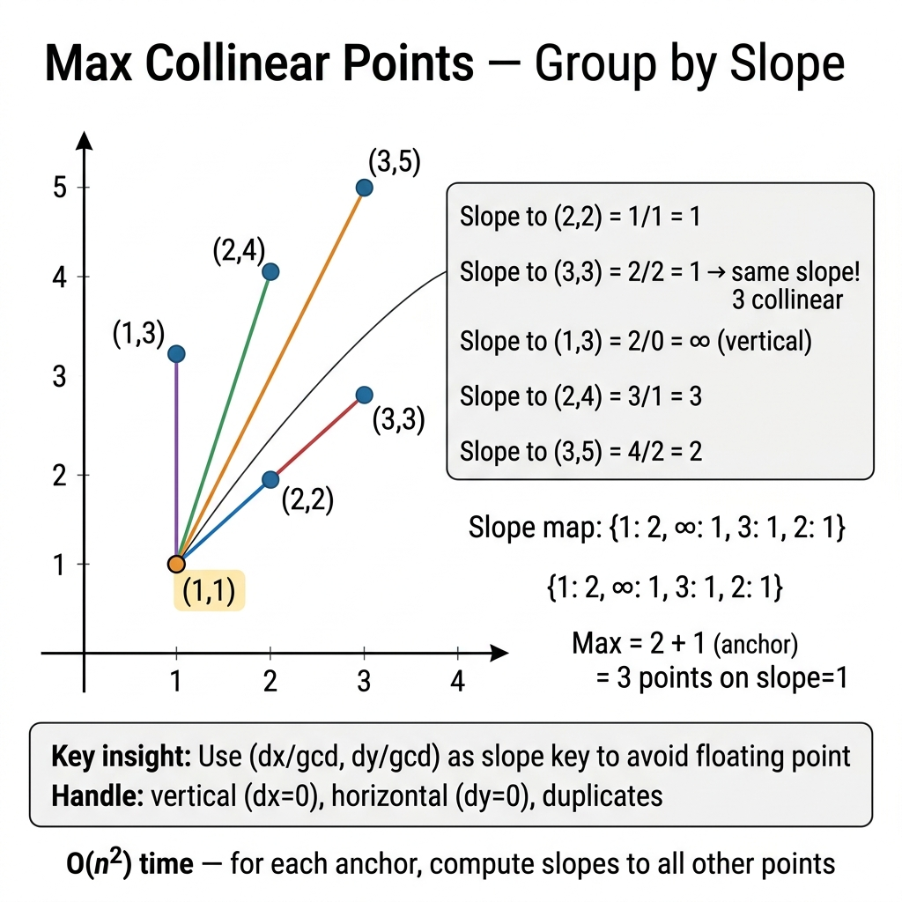

<!-- tags: dsa, algorithms -->
# 📏 Max Collinear Points

> The hardest geometry problem in this module. Normalize slopes to count points lying on the same line.

📅 Created: 2026-03-31 · 🔄 Updated: 2026-04-09 · ⏱️ 16 min read

| Aspect | Detail |
| ------ | ------ |
| **Complexity** | O(n²) time / O(n) per anchor |
| **Use case** | Geometry hashing, slope normalization, gcd reasoning |
| **Related** | Math & Geometry, Hash Map, GCD normalization |

---

## 1. DEFINE

<!-- [Beginner layer] -->

You receive a set of points and must find the maximum number of points on a single line. The first idea is usually calculating slopes between an anchor point and all others. However, using floats for slopes quickly triggers precision errors, signed direction issues, and duplicate point traps. The geometry here is simple; the representation is hard.

`Max Collinear Points` is a classic normalization problem. Instead of storing slopes as floats, reduce them to a `(dy, dx)` pair using `gcd` and normalize their signs. Then, any points collinear with the current anchor map precisely to the same hash map key.

Core insight: **In discrete geometry, normalized representation matters much more than seemingly natural formulas**.

| Variant | When to use | Key idea |
| ------- | -------- | ------- |
| Floating slope | Intuitive first thought but prone to errors | Precision errors misalign slopes that should be equal |
| Normalized rational slope | When exact hash map keys are required | Reduce `(dy, dx)` with GCD and normalize signs |
| Duplicate points handling | When inputs contain overlapping points | Track duplicates in a separate variable instead of the map |

| Approach | Time | Space | When to choose |
| -------- | ---- | ----- | -------- |
| Anchor + floating slope | O(n^2) | O(n) | Only useful as a baseline to highlight representation flaws |
| Anchor + normalized slope map | O(n^2) | O(n) | Standard, stable, and correct solution |
| Line representation generalization | Varies | Varies | When expanding to broader geometry problem families |

### 1.1 Quick Identification

- The problem asks for `max points on a line` or `collinear points`.
- Each point acts as an anchor to compare against others.
- Slope representation is critical to the solution's correctness.

### 1.2 Invariants & Failure Modes

- For each anchor, points sharing a normalized slope belong to the same candidate line family.
- The signs of `(dy, dx)` must be consistently normalized. Otherwise, the same line might split into two distinct keys.
- Common failure mode: using float slopes passes small samples but breaks on hidden test cases with precision drifts or duplicates.

## 2. VISUAL

The difficulty of these problems lies in representation and boundaries. A trace shows why the correct perspective matters more than implementation syntax.

### Level 1 — Core intuition

```text
anchor P0 = (1,1)
P1 = (2,2) => slope 1/1
P2 = (3,3) => slope 2/2 -> normalize -> 1/1
P3 = (3,4) => slope 2/3

map from anchor:
1/1 -> 2 points
2/3 -> 1 point
=> local best = 3 including anchor
```

*Caption*: 📏 Max Collinear Points at Level 1 shows core intuition. Level 2 explains state update sequences from input to output.

### Level 2 — Decision trace

- For 📏 Max Collinear Points, the input representation must be normalized early to avoid sign flips, overflow, or precision drift.
- Each 📏 Max Collinear Points step must preserve the core arithmetic or geometric relation the problem relies on.
- 📏 Max Collinear Points edge cases cannot wait until the end. Handle duplicate points, negative numbers, or degeneracies in the main flow.
- Only when the 📏 Max Collinear Points representation and boundaries are stable can the final formula be trusted on large inputs.



## 3. CODE

Once the representation is locked, code is just deploying that reasoning. We go from a provable baseline to stronger variants.

### Problem 1: Basic — Core Pattern

> **Goal**: Find the maximum collinear points without triggering precision errors.
> **Approach**: Fix each anchor, normalize `(dy, dx)` using GCD, and use a hash map to count frequencies.
> **Example**: `maxPoints([(1,1),(2,2),(3,3),(3,4)]) → 3`

```go
// max_collinear_points.go — Max Collinear Points: slope normalization with GCD
package mathgeometry

import "fmt"

type Point struct { X, Y int }

func gcd(a, b int) int {
    if a < 0 { a = -a }
    if b < 0 { b = -b }
    for b != 0 { a, b = b, a%b }
    if a == 0 { return 1 }
    return a
}

func MaxPoints(points []Point) int {
    if len(points) <= 2 { return len(points) }
    best := 0
    for i := range points {
        slopes := map[string]int{}
        dup := 1
        local := 0
        for j := i + 1; j < len(points); j++ {
            dx := points[j].X - points[i].X
            dy := points[j].Y - points[i].Y
            if dx == 0 && dy == 0 { dup++; continue }
            g := gcd(dx, dy)
            dx /= g; dy /= g
            key := fmt.Sprintf("%d/%d", dx, dy)
            slopes[key]++
            if slopes[key] > local { local = slopes[key] }
        }
        if local + dup > best { best = local + dup }
    }
    return best
}
```

```typescript
// max-collinear-points.ts — Max Collinear Points: slope normalization with gcd
export type Point = [number, number];

function gcd(a: number, b: number): number {
  a = Math.abs(a); b = Math.abs(b);
  while (b !== 0) [a, b] = [b, a % b];
  return a || 1;
}

export function maxPoints(points: Point[]): number {
  if (points.length <= 2) return points.length;
  let best = 0;
  for (let i = 0; i < points.length; i++) {
    const slopes = new Map<string, number>();
    let dup = 1;
    let local = 0;
    for (let j = i + 1; j < points.length; j++) {
      let dx = points[j][0] - points[i][0];
      let dy = points[j][1] - points[i][1];
      if (dx === 0 && dy === 0) { dup++; continue; }
      const g = gcd(dx, dy);
      dx /= g; dy /= g;
      const key = `${dx}/${dy}`;
      const next = (slopes.get(key) ?? 0) + 1;
      slopes.set(key, next);
      local = Math.max(local, next);
    }
    best = Math.max(best, local + dup);
  }
  return best;
}
```

```rust
// max_collinear_points.rs — Max Collinear Points with normalized slope keys
use std::collections::HashMap;

fn gcd(mut a: i32, mut b: i32) -> i32 {
    a = a.abs(); b = b.abs();
    while b != 0 { let t = a % b; a = b; b = t; }
    if a == 0 { 1 } else { a }
}

pub fn max_points(points: &[(i32, i32)]) -> i32 {
    if points.len() <= 2 { return points.len() as i32; }
    let mut best = 0;
    for i in 0..points.len() {
        let mut slopes: HashMap<(i32, i32), i32> = HashMap::new();
        let mut dup = 1;
        let mut local = 0;
        for j in i+1..points.len() {
            let mut dx = points[j].0 - points[i].0;
            let mut dy = points[j].1 - points[i].1;
            if dx == 0 && dy == 0 { dup += 1; continue; }
            let g = gcd(dx, dy);
            dx /= g; dy /= g;
            let next = slopes.get(&(dx,dy)).copied().unwrap_or(0) + 1;
            slopes.insert((dx,dy), next);
            local = local.max(next);
        }
        best = best.max(local + dup);
    }
    best
}
```

```cpp
// max_collinear_points.cpp — Max Collinear Points with normalized slope keys
#include <unordered_map>
#include <string>
#include <vector>
using namespace std;

int gcdInt(int a, int b) {
    a = abs(a); b = abs(b);
    while (b != 0) { int t = a % b; a = b; b = t; }
    return a == 0 ? 1 : a;
}

int maxPoints(vector<vector<int>>& points) {
    if (points.size() <= 2) return (int)points.size();
    int best = 0;
    for (int i = 0; i < (int)points.size(); ++i) {
        unordered_map<string, int> slopes;
        int dup = 1, local = 0;
        for (int j = i + 1; j < (int)points.size(); ++j) {
            int dx = points[j][0] - points[i][0];
            int dy = points[j][1] - points[i][1];
            if (dx == 0 && dy == 0) { ++dup; continue; }
            int g = gcdInt(dx, dy);
            dx /= g; dy /= g;
            string key = to_string(dx) + "/" + to_string(dy);
            local = max(local, ++slopes[key]);
        }
        best = max(best, local + dup);
    }
    return best;
}
```

```python
# max_collinear_points.py — Max Collinear Points with normalized slope keys
from math import gcd

def max_points(points: list[tuple[int, int]]) -> int:
    if len(points) <= 2:
        return len(points)
    best = 0
    for i in range(len(points)):
        slopes: dict[tuple[int, int], int] = {}
        dup = 1
        local = 0
        for j in range(i + 1, len(points)):
            dx = points[j][0] - points[i][0]
            dy = points[j][1] - points[i][1]
            if dx == 0 and dy == 0:
                dup += 1
                continue
            g = gcd(dx, dy) or 1
            dx //= g
            dy //= g
            key = (dx, dy)
            slopes[key] = slopes.get(key, 0) + 1
            local = max(local, slopes[key])
        best = max(best, local + dup)
    return best
```

```java
// MaxCollinearPoints.java — Max Collinear Points with normalized slope keys
import java.util.HashMap;
import java.util.Map;

public final class MaxCollinearPoints {
    private MaxCollinearPoints() {}

    private static int gcd(int a, int b) {
        a = Math.abs(a); b = Math.abs(b);
        while (b != 0) { int t = a % b; a = b; b = t; }
        return a == 0 ? 1 : a;
    }

    public static int maxPoints(int[][] points) {
        if (points.length <= 2) return points.length;
        int best = 0;
        for (int i = 0; i < points.length; i++) {
            Map<String, Integer> slopes = new HashMap<>();
            int dup = 1, local = 0;
            for (int j = i + 1; j < points.length; j++) {
                int dx = points[j][0] - points[i][0];
                int dy = points[j][1] - points[i][1];
                if (dx == 0 && dy == 0) { dup++; continue; }
                int g = gcd(dx, dy);
                dx /= g; dy /= g;
                String key = dx + "/" + dy;
                int next = slopes.getOrDefault(key, 0) + 1;
                slopes.put(key, next);
                local = Math.max(local, next);
            }
            best = Math.max(best, local + dup);
        }
        return best;
    }
}
```

> **Why?** The core pattern struggles more with boundaries than syntax. When the representation is normalized and updates maintain geometric relations, the algorithm avoids degeneracy.

> **Conclusion**: This problem sharply divides those who memorize formulas from those who understand representations. Normalizing slopes and handling duplicates systematically are mandatory.

### Problem 2: Intermediate — Slope Normalization With GCD

> **Goal**: Solve accurately without floating-point errors by properly grouping lines with identical slopes.
> **Approach**: Represent the slope as a `(dy/g, dx/g)` pair using `gcd`. Normalize the sign to group parallel directions under identical keys.
> **Example**: `(2,4)` and `(1,2)` normalize to the same slope key.
> **Complexity**: O(n²) time, O(n) extra space per anchor

```go
// normalized_slope.go — Normalize slope using gcd so equivalent directions map to one hash key
func normalizeSlope(dx, dy int) (int, int) {
    if dx == 0 {
        return 0, 1
    }
    if dy == 0 {
        return 1, 0
    }

    if dx < 0 {
        dx = -dx
        dy = -dy
    }

    a, b := dx, dy
    if b < 0 {
        b = -b
    }
    for b != 0 {
        a, b = b, a%b
    }
    g := a
    return dx / g, dy / g
}
```

```typescript
// normalized_slope.ts — Normalize slope using gcd so equivalent directions map to one hash key
function gcd(a: number, b: number): number {
  a = Math.abs(a);
  b = Math.abs(b);
  while (b !== 0) [a, b] = [b, a % b];
  return a || 1;
}

export function normalizeSlope(dx: number, dy: number): [number, number] {
  if (dx === 0) return [0, 1];
  if (dy === 0) return [1, 0];
  if (dx < 0) { dx = -dx; dy = -dy; }
  const g = gcd(dx, dy);
  return [dx / g, dy / g];
}
```

```rust
// normalized_slope.rs — Normalize slope using gcd so equivalent directions map to one hash key
fn gcd(mut a: i32, mut b: i32) -> i32 {
    a = a.abs();
    b = b.abs();
    while b != 0 {
        let t = a % b;
        a = b;
        b = t;
    }
    if a == 0 { 1 } else { a }
}

pub fn normalize_slope(mut dx: i32, mut dy: i32) -> (i32, i32) {
    if dx == 0 { return (0, 1); }
    if dy == 0 { return (1, 0); }
    if dx < 0 { dx = -dx; dy = -dy; }
    let g = gcd(dx, dy);
    (dx / g, dy / g)
}
```

```cpp
// normalized_slope.cpp — Normalize slope using gcd so equivalent directions map to one hash key
int gcdInt(int a, int b) {
    a = std::abs(a);
    b = std::abs(b);
    while (b != 0) {
        int t = a % b;
        a = b;
        b = t;
    }
    return a == 0 ? 1 : a;
}

std::pair<int, int> normalizeSlope(int dx, int dy) {
    if (dx == 0) return {0, 1};
    if (dy == 0) return {1, 0};
    if (dx < 0) { dx = -dx; dy = -dy; }
    int g = gcdInt(dx, dy);
    return {dx / g, dy / g};
}
```

```python
# normalized_slope.py — Normalize slope using gcd so equivalent directions map to one hash key
from math import gcd

def normalize_slope(dx: int, dy: int) -> tuple[int, int]:
    if dx == 0:
        return (0, 1)
    if dy == 0:
        return (1, 0)
    if dx < 0:
        dx, dy = -dx, -dy
    g = gcd(dx, dy) or 1
    return (dx // g, dy // g)
```

```java
// NormalizedSlope.java — Normalize slope using gcd so equivalent directions map to one hash key
private static int gcd(int a, int b) {
    a = Math.abs(a);
    b = Math.abs(b);
    while (b != 0) {
        int t = a % b;
        a = b;
        b = t;
    }
    return a == 0 ? 1 : a;
}

public static int[] normalizeSlope(int dx, int dy) {
    if (dx == 0) return new int[]{0, 1};
    if (dy == 0) return new int[]{1, 0};
    if (dx < 0) { dx = -dx; dy = -dy; }
    int g = gcd(dx, dy);
    return new int[]{dx / g, dy / g};
}
```

> **Why?** Slope Normalization With GCD struggles more with boundaries than syntax. When the representation is normalized and updates maintain geometric relations, the algorithm avoids degeneracy.

> **Conclusion**: The key is not heavy geometry. It is properly representing slopes to hash them securely and consistently.

### Problem 3: Advanced — Count Duplicates Per Anchor

> **Goal**: Properly handle duplicate points overlapping the anchor to prevent missing points in the final count.
> **Approach**: For each anchor, track `duplicates`. After sweeping all slopes, add these duplicates to the best line passing through that anchor.
> **Example**: `[(1,1),(1,1),(2,2),(3,3)] → 4`
> **Complexity**: O(n²) time, O(n) extra space per anchor

```go
// max_points_anchor.go — Max points on a line with duplicate-point handling
func MaxPoints(points [][]int) int {
    if len(points) <= 2 {
        return len(points)
    }

    best := 0
    for i := 0; i < len(points); i++ {
        slopes := map[[2]int]int{}
        duplicates := 1
        localBest := 0

        for j := i + 1; j < len(points); j++ {
            dx := points[j][0] - points[i][0]
            dy := points[j][1] - points[i][1]
            if dx == 0 && dy == 0 {
                duplicates++
                continue
            }
            nx, ny := normalizeSlope(dx, dy)
            key := [2]int{nx, ny}
            slopes[key]++
            if slopes[key] > localBest {
                localBest = slopes[key]
            }
        }

        if localBest+duplicates > best {
            best = localBest + duplicates
        }
    }
    return best
}
```

```typescript
// max_points_anchor.ts — Max points on a line with duplicate-point handling
export function maxPoints(points: number[][]): number {
  if (points.length <= 2) return points.length;
  let best = 0;
  for (let i = 0; i < points.length; i++) {
    const slopes = new Map<string, number>();
    let duplicates = 1;
    let localBest = 0;
    for (let j = i + 1; j < points.length; j++) {
      const dx = points[j][0] - points[i][0];
      const dy = points[j][1] - points[i][1];
      if (dx === 0 && dy === 0) { duplicates++; continue; }
      const [nx, ny] = normalizeSlope(dx, dy);
      const key = `${nx}/${ny}`;
      const next = (slopes.get(key) ?? 0) + 1;
      slopes.set(key, next);
      localBest = Math.max(localBest, next);
    }
    best = Math.max(best, localBest + duplicates);
  }
  return best;
}
```

```rust
// max_points_anchor.rs — Max points on a line with duplicate-point handling
use std::collections::HashMap;

pub fn max_points(points: &[[i32; 2]]) -> i32 {
    if points.len() <= 2 { return points.len() as i32; }
    let mut best = 0;
    for i in 0..points.len() {
        let mut slopes: HashMap<(i32, i32), i32> = HashMap::new();
        let mut duplicates = 1;
        let mut local_best = 0;
        for j in i + 1..points.len() {
            let dx = points[j][0] - points[i][0];
            let dy = points[j][1] - points[i][1];
            if dx == 0 && dy == 0 { duplicates += 1; continue; }
            let key = normalize_slope(dx, dy);
            let next = slopes.get(&key).copied().unwrap_or(0) + 1;
            slopes.insert(key, next);
            local_best = local_best.max(next);
        }
        best = best.max(local_best + duplicates);
    }
    best
}
```

```cpp
// max_points_anchor.cpp — Max points on a line with duplicate-point handling
int maxPointsWithDup(const std::vector<std::vector<int>>& points) {
    if (points.size() <= 2) return (int)points.size();
    int best = 0;
    for (int i = 0; i < (int)points.size(); ++i) {
        std::unordered_map<std::string, int> slopes;
        int duplicates = 1;
        int localBest = 0;
        for (int j = i + 1; j < (int)points.size(); ++j) {
            int dx = points[j][0] - points[i][0];
            int dy = points[j][1] - points[i][1];
            if (dx == 0 && dy == 0) { ++duplicates; continue; }
            auto [nx, ny] = normalizeSlope(dx, dy);
            std::string key = std::to_string(nx) + "/" + std::to_string(ny);
            localBest = std::max(localBest, ++slopes[key]);
        }
        best = std::max(best, localBest + duplicates);
    }
    return best;
}
```

```python
# max_points_anchor.py — Max points on a line with duplicate-point handling
def max_points(points: list[tuple[int, int]]) -> int:
    if len(points) <= 2:
        return len(points)
    best = 0
    for i in range(len(points)):
        slopes: dict[tuple[int, int], int] = {}
        duplicates = 1
        local_best = 0
        for j in range(i + 1, len(points)):
            dx = points[j][0] - points[i][0]
            dy = points[j][1] - points[i][1]
            if dx == 0 and dy == 0:
                duplicates += 1
                continue
            key = normalize_slope(dx, dy)
            slopes[key] = slopes.get(key, 0) + 1
            local_best = max(local_best, slopes[key])
        best = max(best, local_best + duplicates)
    return best
```

```java
// MaxPointsAnchor.java — Max points on a line with duplicate-point handling
public static int maxPoints(int[][] points) {
    if (points.length <= 2) return points.length;
    int best = 0;
    for (int i = 0; i < points.length; i++) {
        java.util.Map<String, Integer> slopes = new java.util.HashMap<>();
        int duplicates = 1;
        int localBest = 0;
        for (int j = i + 1; j < points.length; j++) {
            int dx = points[j][0] - points[i][0];
            int dy = points[j][1] - points[i][1];
            if (dx == 0 && dy == 0) { duplicates++; continue; }
            int[] slope = normalizeSlope(dx, dy);
            String key = slope[0] + "/" + slope[1];
            int next = slopes.getOrDefault(key, 0) + 1;
            slopes.put(key, next);
            localBest = Math.max(localBest, next);
        }
        best = Math.max(best, localBest + duplicates);
    }
    return best;
}
```

> **Why?** Count Duplicates Per Anchor struggles more with boundaries than syntax. When the representation is normalized and updates maintain geometric relations, the algorithm avoids degeneracy.

> **Conclusion**: Duplicate points act as a far more dangerous trap than slope math during geometry hashing tasks.

## 4. PITFALLS

This problem group rarely breaks due to simple loops. It breaks due to normalization, overflow, boundaries, and expensive assumptions.

| # | Severity | Defect | Consequence | Fix |
| --- | --- | --- | --- | --- |
| 1 | 🔴 Fatal | Use float/double for slope keys | Precision drifts group slopes incorrectly | Always normalize into an integer pair |
| 2 | 🟡 Common | Miss duplicate points handling | Undercounts or overcounts the local best | Extract `dup` to handle points sharing coordinates with the anchor |
| 3 | 🟡 Common | Fail to normalize signs for `(dx, dy)` | Parallel slopes yield entirely different keys | Apply a consistent convention like moving the sign to `dx` or `dy` |

## 5. REF

| Resource | Link |
| -------- | ---- |
| LeetCode 149 — Max Points on a Line | https://leetcode.com/problems/max-points-on-a-line/ |
| Slope normalization discussion | https://cp-algorithms.com/geometry/basic-geometry.html |

## 6. RECOMMEND

Once the correct representation is grasped, the next question is which neighbor pattern inherits this intuition best.

| Extension | When to use | Rationale |
| ------- | ------- | ----- |
| Line reflection / geometry hashing | When solving other geometric hashing tasks | Reuse the normalization mindset effortlessly |
| K-closest points | When shifting toward simpler geometry problems | Shares the domain but utilizes totally different techniques |
| Greatest common divisor | To firmly clarify normalization strategies | GCD remains the core mathematical primitive here |

---

**Links**: [← Previous](./02-reverse-integer.md) · [→ Next](./04-josephus-problem.md)

## 7. QUICK REF

| # | Identification Signal | Action Template |
|---|--------------------|--------------------|
| 1 | Input has a clear invariant or reusable state | Write state/invariant first, then choose traversal or transition |
| 2 | Brute force repeats the same decision | Find a way to reduce search space or cache subproblems |
| 3 | Problem has many edge cases | Move boundary conditions into the main flow instead of patching later |

---

Returning to the initial question: why use (dx/gcd, dy/gcd) instead of a float slope? Floating point comparisons suffer from precision errors because 0.333... ≠ 1/3. GCD normalization ensures an exact representation. Handle vertical lines and duplicates separately.