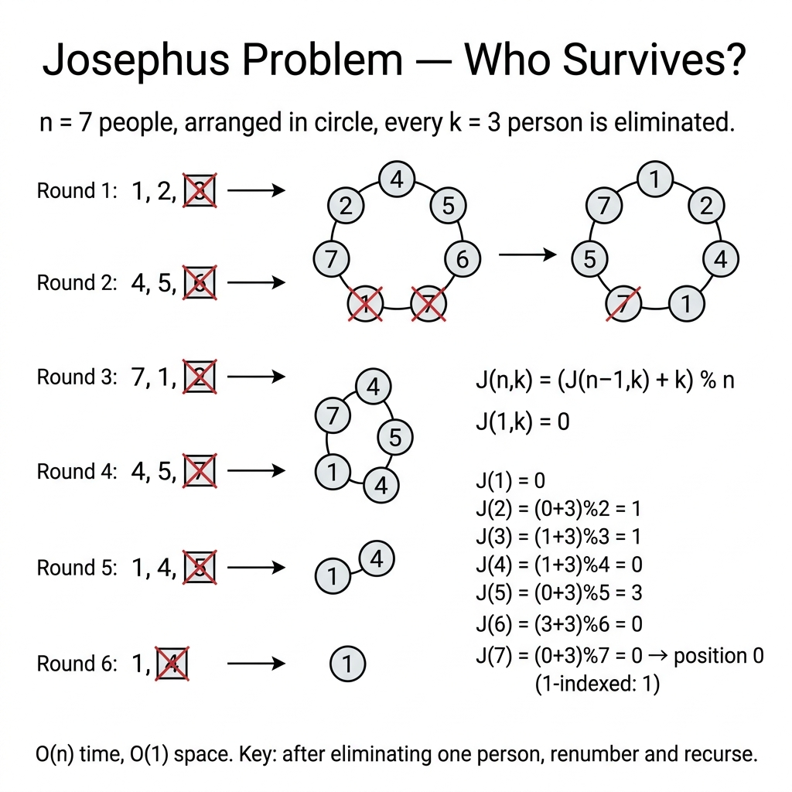

<!-- tags: dsa, algorithms -->
# ⭕ Josephus Problem

> A classic circular elimination problem. Optimal solutions stem from recurrences, not pure simulations.

📅 Created: 2026-03-31 · 🔄 Updated: 2026-04-09 · ⏱️ 16 min read

| Aspect | Detail |
| ------ | ------ |
| **Complexity** | O(n) recurrence / O(n²) naive simulation |
| **Use case** | Recurrence thinking, circular elimination, modular indexing |
| **Related** | Math, Recurrence, Simulation |

---

## 1. DEFINE

<!-- [Beginner layer] -->

A group of people stand in a circle. You count to the `k`-th person and eliminate them, then continue counting from the next person. Simulating this literally resembles a circular deletion game. But when numbers grow large, the real question emerges. How does the survivor of size `n` relate to the survivor of size `n - 1`?

The `Josephus Problem` proves that simulation builds intuition, while recurrence locks down the optimal solution. It teaches a vital transition in DSA: turning a dynamic, looping process into a stable recurrence formula.

Core insight: **Eliminating someone reduces the problem to the exact same game on a smaller circle, requiring an index mapping back to the original reference frame**.

| Variant | When to use | Key idea |
| ------- | -------- | ------- |
| Simulation | When building visual intuition | Tracks eliminated individuals loop by loop |
| Recurrence | When you need the optimal compact solution | Calculates Winner(n) directly from Winner(n-1) |
| Index convention mapping | When formulas are correct but output shifts by 1 | Settle on zero-based or one-based logic before reasoning |

| Approach | Time | Space | When to choose |
| -------- | ---- | ----- | -------- |
| Circular simulation | O(nk) or worse based on structure | O(n) | Serves as a baseline to visualize the pattern |
| Recurrence / iterative formula | O(n) | O(1) | Standard and most memorable answer |
| Advanced data structure simulation | Varies | Varies | When expanding to more complex dynamic eliminations |

### 1.1 Quick Identification

- The problem involves circular elimination using a fixed step.
- Simulation feels easy, but recurrence remains the key to scaling.
- Index conventions generate the majority of off-by-one errors.

### 1.2 Invariants & Failure Modes

- The subproblem's winner must be mapped to the original circle's index using proper addition and modulo operations.
- Zero-based and one-based systems are distinct frameworks and must never mix in a single formula.
- Common failure mode: creating the correct recurrence but failing the index mapping, which consistently shifts results by 1.

## 2. VISUAL

The difficulty of these problems lies in representation and boundaries. A trace shows why the correct perspective matters more than implementation syntax.

### Level 1 — Core intuition

```text
n = 5, k = 2
circle: [1,2,3,4,5]
remove 2 -> [1,3,4,5]
remove 4 -> [1,3,5]
remove 1 -> [3,5]
remove 5 -> [3]

recurrence:
J(1)=0
J(n)=(J(n-1)+k) mod n
```

*Caption*: ⭕ Josephus Problem at Level 1 shows core intuition. Level 2 explains state update sequences from input to output.

### Level 2 — Decision trace

- For ⭕ Josephus Problem, the input representation must be normalized early to avoid sign flips, overflow, or precision drift.
- Each ⭕ Josephus Problem step must preserve the core arithmetic or geometric relation the problem relies on.
- ⭕ Josephus Problem edge cases cannot wait until the end. Handle duplicate points, negative numbers, or degeneracies in the main flow.
- Only when the ⭕ Josephus Problem representation and boundaries are stable can the final formula be trusted on large inputs.



## 3. CODE

Once the representation is locked, code is just deploying that reasoning. We go from a provable baseline to stronger variants.

### Problem 1: Basic — Core Pattern

> **Goal**: Find the final survivor in a circular elimination game with step k.
> **Approach**: Use the recurrence `J(n) = (J(n-1) + k) mod n`. Simulation just verifies intuition.
> **Example**: `josephus(5,2) → 3`

```go
// josephus.go — Josephus: recurrence and simulation for intuition
package mathgeometry

func Josephus(n, k int) int {
    winner := 0
    for size := 1; size <= n; size++ {
        winner = (winner + k) % size
    }
    return winner + 1
}

func JosephusSim(n, k int) int {
    people := make([]int, n)
    for i := range people { people[i] = i + 1 }
    idx := 0
    for len(people) > 1 {
        idx = (idx + k - 1) % len(people)
        people = append(people[:idx], people[idx+1:]...)
    }
    return people[0]
}
```

```typescript
// josephus.ts — Josephus: recurrence and simulation for intuition
export function josephus(n: number, k: number): number {
  let winner = 0;
  for (let size = 1; size <= n; size++) {
    winner = (winner + k) % size;
  }
  return winner + 1;
}
```

```rust
// josephus.rs — Josephus recurrence
pub fn josephus(n: usize, k: usize) -> usize {
    let mut winner = 0usize;
    for size in 1..=n {
        winner = (winner + k) % size;
    }
    winner + 1
}
```

```cpp
// josephus.cpp — Josephus recurrence
int josephus(int n, int k) {
    int winner = 0;
    for (int size = 1; size <= n; ++size) {
        winner = (winner + k) % size;
    }
    return winner + 1;
}
```

```python
# josephus.py — Josephus recurrence
def josephus(n: int, k: int) -> int:
    winner = 0
    for size in range(1, n + 1):
        winner = (winner + k) % size
    return winner + 1
```

```java
// Josephus.java — Josephus recurrence
public final class Josephus {
    private Josephus() {}

    public static int josephus(int n, int k) {
        int winner = 0;
        for (int size = 1; size <= n; size++) {
            winner = (winner + k) % size;
        }
        return winner + 1;
    }
}
```

> **Why?** The core pattern struggles more with boundaries than syntax. When the representation is normalized and updates maintain geometric relations, the algorithm avoids degeneracy.

> **Conclusion**: The basic version acts as a gateway. It teaches how to compress an O(n·k) simulation into a recurrence, advancing to deeper mathematical insights.

### Problem 2: Intermediate — Iterative Recurrence

> **Goal**: Switch from eliminating people sequentially to utilizing the famous Josephus recursive formula.
> **Approach**: Use the recurrence `f(1)=0` and `f(n)=(f(n-1)+k)%n`, then convert to a 1-based index at the end.
> **Example**: `josephus(7, 3) → 4`
> **Complexity**: O(n) time, O(1) space

```go
// josephus_iterative.go — Iterative recurrence avoids explicit simulation of eliminations
func JosephusWinner(n, k int) int {
    survivor := 0 // 0-based index for the current circle size.
    for size := 2; size <= n; size++ {
        survivor = (survivor + k) % size
    }
    return survivor + 1
}
```

```typescript
// josephus_iterative.ts — Iterative recurrence avoids explicit simulation of eliminations
export function josephusWinner(n: number, k: number): number {
  let survivor = 0;
  for (let size = 2; size <= n; size++) {
    survivor = (survivor + k) % size;
  }
  return survivor + 1;
}
```

```rust
// josephus_iterative.rs — Iterative recurrence avoids explicit simulation of eliminations
pub fn josephus_winner(n: usize, k: usize) -> usize {
    let mut survivor = 0usize;
    for size in 2..=n {
        survivor = (survivor + k) % size;
    }
    survivor + 1
}
```

```cpp
// josephus_iterative.cpp — Iterative recurrence avoids explicit simulation of eliminations
int josephusWinner(int n, int k) {
    int survivor = 0;
    for (int size = 2; size <= n; ++size) {
        survivor = (survivor + k) % size;
    }
    return survivor + 1;
}
```

```python
# josephus_iterative.py — Iterative recurrence avoids explicit simulation of eliminations
def josephus_winner(n: int, k: int) -> int:
    survivor = 0
    for size in range(2, n + 1):
        survivor = (survivor + k) % size
    return survivor + 1
```

```java
// JosephusIterative.java — Iterative recurrence avoids explicit simulation of eliminations
public static int josephusWinner(int n, int k) {
    int survivor = 0;
    for (int size = 2; size <= n; size++) {
        survivor = (survivor + k) % size;
    }
    return survivor + 1;
}
```

> **Why?** Iterative Recurrence struggles more with boundaries than syntax. When the representation is normalized and updates maintain geometric relations, the algorithm avoids degeneracy.

> **Conclusion**: This forms a crucial shift from simulation to recurrence reasoning. It is exactly the follow-up that interviewers eagerly expect.

### Problem 3: Advanced — Elimination Order + Final Winner

> **Goal**: Output both the elimination order and the final winner. This proves extremely useful for game logic debugging.
> **Approach**: Use a slice to model the circle and apply modulo to the index after every elimination step.
> **Example**: `eliminationOrder(5, 2) → [2,4,1,5], winner=3`
> **Complexity**: O(n²) time with slice removal, O(n) space

```go
// josephus_order.go — Simulation variant that returns elimination order as well as the winner
func JosephusOrder(n, k int) ([]int, int) {
    circle := make([]int, n)
    for i := range circle {
        circle[i] = i + 1
    }

    order := make([]int, 0, n-1)
    index := 0
    for len(circle) > 1 {
        index = (index + k - 1) % len(circle)
        order = append(order, circle[index])
        circle = append(circle[:index], circle[index+1:]...)
    }
    return order, circle[0]
}
```

```typescript
// josephus_order.ts — Simulation variant that returns elimination order as well as the winner
export function josephusOrder(n: number, k: number): [number[], number] {
  const circle = Array.from({ length: n }, (_, i) => i + 1);
  const order: number[] = [];
  let index = 0;
  while (circle.length > 1) {
    index = (index + k - 1) % circle.length;
    order.push(circle[index]);
    circle.splice(index, 1);
  }
  return [order, circle[0]];
}
```

```rust
// josephus_order.rs — Simulation variant that returns elimination order as well as the winner
pub fn josephus_order(n: usize, k: usize) -> (Vec<usize>, usize) {
    let mut circle: Vec<usize> = (1..=n).collect();
    let mut order = Vec::with_capacity(n.saturating_sub(1));
    let mut index = 0usize;
    while circle.len() > 1 {
        index = (index + k - 1) % circle.len();
        order.push(circle.remove(index));
    }
    (order, circle[0])
}
```

```cpp
// josephus_order.cpp — Simulation variant that returns elimination order as well as the winner
std::pair<std::vector<int>, int> josephusOrder(int n, int k) {
    std::vector<int> circle(n);
    std::iota(circle.begin(), circle.end(), 1);
    std::vector<int> order;
    int index = 0;
    while (circle.size() > 1) {
        index = (index + k - 1) % (int)circle.size();
        order.push_back(circle[index]);
        circle.erase(circle.begin() + index);
    }
    return {order, circle[0]};
}
```

```python
# josephus_order.py — Simulation variant that returns elimination order as well as the winner
def josephus_order(n: int, k: int) -> tuple[list[int], int]:
    circle = list(range(1, n + 1))
    order: list[int] = []
    index = 0
    while len(circle) > 1:
        index = (index + k - 1) % len(circle)
        order.append(circle.pop(index))
    return order, circle[0]
```

```java
// JosephusOrder.java — Simulation variant that returns elimination order as well as the winner
public static java.util.Map.Entry<java.util.List<Integer>, Integer> josephusOrder(int n, int k) {
    java.util.List<Integer> circle = new java.util.ArrayList<>();
    for (int i = 1; i <= n; i++) circle.add(i);
    java.util.List<Integer> order = new java.util.ArrayList<>();
    int index = 0;
    while (circle.size() > 1) {
        index = (index + k - 1) % circle.size();
        order.add(circle.remove(index));
    }
    return new java.util.AbstractMap.SimpleEntry<>(order, circle.get(0));
}
```

> **Why?** Elimination Order + Final Winner struggles more with boundaries than syntax. When the representation is normalized and updates maintain geometric relations, the algorithm avoids degeneracy.

> **Conclusion**: Recurrence produces the optimal answer, while simulation offers a direct trace. Knowing both lets you deploy the right tool for the job.

## 4. PITFALLS

This problem group rarely breaks due to simple loops. It breaks due to normalization, overflow, boundaries, and expensive assumptions.

| # | Severity | Defect | Consequence | Fix |
| --- | --- | --- | --- | --- |
| 1 | 🔴 Fatal | Fail to distinguish zero-based vs one-based indexing | Formula works but shifts the output by 1 | Maintain zero-based indexing internally, add 1 at the end |
| 2 | 🟡 Common | Code purely via simulation | Solves small inputs but fails to articulate optimization | Present the simulation first, then quickly pivot to recurrence |
| 3 | 🟡 Common | Fail to explain index renumbering after elimination | Weakens the case for adopting recurrence logic | Draw positions before and after loops to map new indexes |

## 5. REF

| Resource | Link |
| -------- | ---- |
| Josephus problem overview | https://en.wikipedia.org/wiki/Josephus_problem |
| LeetCode 1823 — Find the Winner of the Circular Game | https://leetcode.com/problems/find-the-winner-of-the-circular-game/ |

## 6. RECOMMEND

Once the correct representation is grasped, the next question is which neighbor pattern inherits this intuition best.

| Extension | When to use | Rationale |
| ------- | ------- | ----- |
| Circular queue simulation | When required to visualize the process | Strongly reinforces the recurrence mapping mechanism |
| Game of elimination variants | When elimination step sizes change dynamically | Directly opens up pathways to far harder recurrences |
| Modular arithmetic drills | To securely master circular index wrap-around concepts | The Josephus problem effortlessly utilizes modulo arithmetic logic |

---

**Links**: [← Previous](./03-max-collinear-points.md) · [→ Next](./05-triangle-numbers.md)

## 7. QUICK REF

| # | Identification Signal | Action Template |
|---|--------------------|--------------------|
| 1 | Input has a clear invariant or reusable state | Write state/invariant first, then choose traversal or transition |
| 2 | Brute force repeats the same decision | Find a way to reduce search space or cache subproblems |
| 3 | Problem has many edge cases | Move boundary conditions into the main flow instead of patching later |

---

Returning to the initial question: why does the recurrence J(n) = (J(n-1)+k) % n work? After eliminating one person, the circle contains n-1 people but shifts the start by k. Modulo n maps positions back to the original circle. This takes O(n) time and O(1) space.