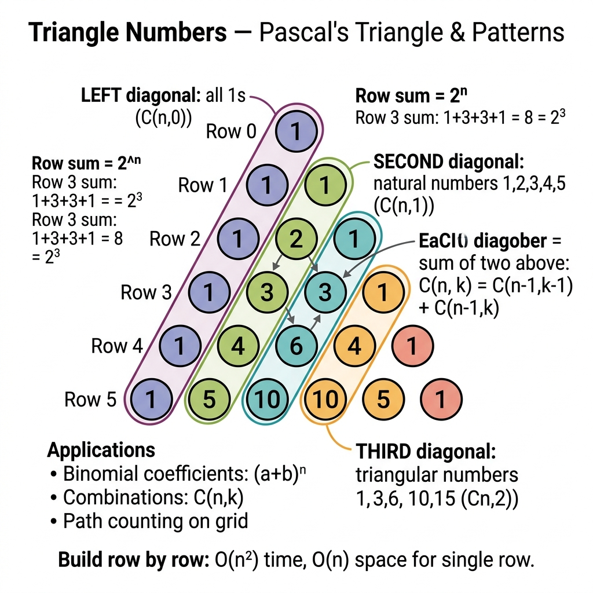

<!-- tags: dsa, algorithms -->
# 🔺 Triangle Numbers / Valid Triangle Count

> Count valid triangle combinations using sorting and two pointers. This beautifully leverages the triangle inequality.

📅 Created: 2026-03-31 · 🔄 Updated: 2026-04-09 · ⏱️ 16 min read

| Aspect | Detail |
| ------ | ------ |
| **Complexity** | O(n²) time / O(1) extra space after sort |
| **Use case** | Triangle inequality, counting triplets, sorted two-pointers |
| **Related** | Math & Geometry, Two Pointers, Sorting |

---

## 1. DEFINE

<!-- [Experienced layer] -->

You receive an array of positive numbers and must count valid triangle triplets. Brute-forcing every triplet is the immediate thought, but O(n³) dies quickly with large `n`. The triangle condition `a + b > c` does more than verify one triplet. On a sorted array, it validates an entire continuous range of solutions.

`Triangle Numbers` elegantly combines sorted order and two pointers into a counting engine. When you fix the largest side `c`, a valid `(left, right)` pair means everything in `left..right-1` paired with `right` also forms a valid triangle. One inequality instantly unlocks a block of answers.

Core insight: **On sorted data, the triangle condition counts entire valid ranges instantly instead of checking single triplets**.

| Variant | When to use | Key idea |
| ------- | -------- | ------- |
| Brute-force triplets | When building initial intuition | Checks every triplet completely independently |
| Sorted + fixed right | When an O(n^2) solution is needed | Fixes the largest edge and deploys two pointers |
| Counting by valid range | When inequalities unlock whole answer blocks | A valid `(left, right)` validates everything up to `right` |

| Approach | Time | Space | When to choose |
| -------- | ---- | ----- | -------- |
| Brute force | O(n^3) | O(1) | Merely highlights the raw initial problem state |
| Sort + two pointers | O(n^2) | O(1) or O(log n) for sorting | The standard and most memorable answer |
| Combinatorial extensions | Varies | Varies | When the problem introduces complex inequalities or counting methods |

### 1.1 Quick Identification

- The problem asks for the total count of valid triangle triplets.
- Positive numbers allow prior sorting to exploit structural order.
- Two pointers act as range counters instead of just single-solution finders.

### 1.2 Invariants & Failure Modes

- After sorting, when fixing `right` as the largest edge, remaining pairs only need to satisfy `nums[left] + nums[mid] > nums[right]`.
- If the `(left, mid)` pair satisfies `right`, the entire `[left..mid-1]` block is also valid with the current `mid`.
- Common failure mode: treating the inequality as a slow element-by-element check, thereby missing the batch counting trick that drops O(n³) to O(n²).

## 2. VISUAL

The difficulty of these problems lies in representation and boundaries. A trace shows why the correct perspective matters more than implementation syntax.

### Level 1 — Core intuition

```text
sorted nums = [2, 2, 3, 4]
right = 4
left=2, mid=3 => 2+3 > 4 => count += 1, mid--
left=2, mid=2 => stop

all valid triangles:
(2,3,4), (2,3,4), (2,2,3) => 3
```

*Caption*: 🔺 Triangle Numbers / Valid Triangle Count at Level 1 shows core intuition. Level 2 explains state update sequences from input to output.

### Level 2 — Decision trace

- For 🔺 Triangle Numbers / Valid Triangle Count, the input representation must be normalized early to avoid sign flips, overflow, or precision drift.
- Each 🔺 Triangle Numbers / Valid Triangle Count step must preserve the core arithmetic or geometric relation the problem relies on.
- 🔺 Triangle Numbers / Valid Triangle Count edge cases cannot wait until the end. Handle duplicate points, negative numbers, or degeneracies in the main flow.
- Only when the 🔺 Triangle Numbers / Valid Triangle Count representation and boundaries are stable can the final formula be trusted on large inputs.



## 3. CODE

Once the representation is locked, code is just deploying that reasoning. We go from a provable baseline to stronger variants.

### Problem 1: Basic — Core Pattern

> **Goal**: Count valid triangle triplets without falling into an O(n³) loop.
> **Approach**: Sort the array, fix the largest side at `right`, and use two pointers to count valid pairs.
> **Example**: `triangleNumber([2,2,3,4]) → 3`

```go
// triangle_numbers.go — Valid Triangle Count: sort + fixed right + two pointers
package mathgeometry

import "sort"

func TriangleNumber(nums []int) int {
    sort.Ints(nums)
    count := 0
    for right := len(nums) - 1; right >= 2; right-- {
        left, mid := 0, right-1
        for left < mid {
            if nums[left]+nums[mid] > nums[right] {
                count += mid - left
                mid--
            } else {
                left++
            }
        }
    }
    return count
}
```

```typescript
// triangle-numbers.ts — Valid Triangle Count: sort + fixed right + two pointers
export function triangleNumber(nums: number[]): number {
  nums.sort((a, b) => a - b);
  let count = 0;
  for (let right = nums.length - 1; right >= 2; right--) {
    let left = 0;
    let mid = right - 1;
    while (left < mid) {
      if (nums[left] + nums[mid] > nums[right]) {
        count += mid - left;
        mid--;
      } else {
        left++;
      }
    }
  }
  return count;
}
```

```rust
// triangle_numbers.rs — Valid Triangle Count: sort + fixed right + two pointers
pub fn triangle_number(mut nums: Vec<i32>) -> i32 {
    nums.sort();
    let mut count = 0;
    for right in (2..nums.len()).rev() {
        let mut left = 0usize;
        let mut mid = right - 1;
        while left < mid {
            if nums[left] + nums[mid] > nums[right] {
                count += (mid - left) as i32;
                mid -= 1;
            } else {
                left += 1;
            }
        }
    }
    count
}
```

```cpp
// triangle_numbers.cpp — Valid Triangle Count: sort + fixed right + two pointers
int triangleNumber(std::vector<int>& nums) {
    std::sort(nums.begin(), nums.end());
    int count = 0;
    for (int right = (int)nums.size() - 1; right >= 2; --right) {
        int left = 0, mid = right - 1;
        while (left < mid) {
            if (nums[left] + nums[mid] > nums[right]) {
                count += mid - left;
                --mid;
            } else {
                ++left;
            }
        }
    }
    return count;
}
```

```python
# triangle_numbers.py — Valid Triangle Count: sort + fixed right + two pointers
def triangle_number(nums: list[int]) -> int:
    nums.sort()
    count = 0
    for right in range(len(nums) - 1, 1, -1):
        left, mid = 0, right - 1
        while left < mid:
            if nums[left] + nums[mid] > nums[right]:
                count += mid - left
                mid -= 1
            else:
                left += 1
    return count
```

```java
// TriangleNumbers.java — Valid Triangle Count: sort + fixed right + two pointers
import java.util.Arrays;

public final class TriangleNumbers {
    private TriangleNumbers() {}

    public static int triangleNumber(int[] nums) {
        Arrays.sort(nums);
        int count = 0;
        for (int right = nums.length - 1; right >= 2; right--) {
            int left = 0, mid = right - 1;
            while (left < mid) {
                if (nums[left] + nums[mid] > nums[right]) {
                    count += mid - left;
                    mid--;
                } else {
                    left++;
                }
            }
        }
        return count;
    }
}
```

> **Why?** The core pattern struggles more with boundaries than syntax. When the representation is normalized and updates maintain geometric relations, the algorithm avoids degeneracy.

> **Conclusion**: Triangle numbers cleanly separate the geometric condition from the traversal pattern. Without both, the solution easily reverts to pure brute force.

### Problem 2: Intermediate — Count Valid Triangles

> **Goal**: Deploy sorting and two pointers to efficiently count valid triangle combinations.
> **Approach**: Sort ascendingly, fix the largest side `nums[k]`, and use pointers to count `(i,j)` pairs where `nums[i] + nums[j] > nums[k]`.
> **Example**: `triangleNumber([2,2,3,4]) → 3`
> **Complexity**: O(n²) time after sorting, O(1) extra space

```go
// valid_triangle_count.go — Valid Triangle Number: sort + two pointers by fixing the largest side
import "sort"

func TriangleNumber(nums []int) int {
    sort.Ints(nums)
    total := 0
    for k := len(nums) - 1; k >= 2; k-- {
        left, right := 0, k-1
        for left < right {
            if nums[left]+nums[right] > nums[k] {
                total += right - left
                right--
            } else {
                left++
            }
        }
    }
    return total
}
```

```typescript
// valid_triangle_count.ts — Valid Triangle Number: sort + two pointers by fixing the largest side
export function triangleNumber(nums: number[]): number {
  nums.sort((a, b) => a - b);
  let total = 0;
  for (let k = nums.length - 1; k >= 2; k--) {
    let left = 0, right = k - 1;
    while (left < right) {
      if (nums[left] + nums[right] > nums[k]) {
        total += right - left;
        right--;
      } else {
        left++;
      }
    }
  }
  return total;
}
```

```rust
// valid_triangle_count.rs — Valid Triangle Number: sort + two pointers by fixing the largest side
pub fn triangle_number(nums: &mut [i32]) -> i32 {
    nums.sort();
    let mut total = 0;
    for k in (2..nums.len()).rev() {
        let (mut left, mut right) = (0usize, k - 1);
        while left < right {
            if nums[left] + nums[right] > nums[k] {
                total += (right - left) as i32;
                right -= 1;
            } else {
                left += 1;
            }
        }
    }
    total
}
```

```cpp
// valid_triangle_count.cpp — Valid Triangle Number: sort + two pointers by fixing the largest side
int triangleNumber(std::vector<int>& nums) {
    std::sort(nums.begin(), nums.end());
    int total = 0;
    for (int k = (int)nums.size() - 1; k >= 2; --k) {
        int left = 0, right = k - 1;
        while (left < right) {
            if (nums[left] + nums[right] > nums[k]) {
                total += right - left;
                --right;
            } else {
                ++left;
            }
        }
    }
    return total;
}
```

```python
# valid_triangle_count.py — Valid Triangle Number: sort + two pointers by fixing the largest side
def triangle_number(nums: list[int]) -> int:
    nums.sort()
    total = 0
    for k in range(len(nums) - 1, 1, -1):
        left, right = 0, k - 1
        while left < right:
            if nums[left] + nums[right] > nums[k]:
                total += right - left
                right -= 1
            else:
                left += 1
    return total
```

```java
// ValidTriangleCount.java — Valid Triangle Number: sort + two pointers by fixing the largest side
public static int triangleNumber(int[] nums) {
    java.util.Arrays.sort(nums);
    int total = 0;
    for (int k = nums.length - 1; k >= 2; k--) {
        int left = 0, right = k - 1;
        while (left < right) {
            if (nums[left] + nums[right] > nums[k]) {
                total += right - left;
                right--;
            } else {
                left++;
            }
        }
    }
    return total;
}
```

> **Why?** Count Valid Triangles struggles more with boundaries than syntax. When the representation is normalized and updates maintain geometric relations, the algorithm avoids degeneracy.

> **Conclusion**: This perfectly illustrates converting a geometric condition into a sorted array inequality. Two pointers resolve it gracefully.

### Problem 3: Advanced — Largest Perimeter Triangle

> **Goal**: Apply the identical triangle theorem but optimize for an entirely different objective: finding the maximum possible perimeter.
> **Approach**: Sort ascendingly and greedily scan from right to left. The first triplet satisfying `a + b > c` inevitably yields the largest perimeter.
> **Example**: `largestPerimeter([2,1,2]) → 5`
> **Complexity**: O(n log n) time, O(1) extra space

```go
// largest_perimeter.go — Largest Perimeter Triangle: greedy scan after sorting
func LargestPerimeter(nums []int) int {
    sort.Ints(nums)
    for i := len(nums) - 1; i >= 2; i-- {
        a, b, c := nums[i-2], nums[i-1], nums[i]
        if a+b > c {
            return a + b + c
        }
    }
    return 0
}
```

```typescript
// largest_perimeter.ts — Largest Perimeter Triangle: greedy scan after sorting
export function largestPerimeter(nums: number[]): number {
  nums.sort((a, b) => a - b);
  for (let i = nums.length - 1; i >= 2; i--) {
    const [a, b, c] = [nums[i - 2], nums[i - 1], nums[i]];
    if (a + b > c) return a + b + c;
  }
  return 0;
}
```

```rust
// largest_perimeter.rs — Largest Perimeter Triangle: greedy scan after sorting
pub fn largest_perimeter(nums: &mut [i32]) -> i32 {
    nums.sort();
    for i in (2..nums.len()).rev() {
        let (a, b, c) = (nums[i - 2], nums[i - 1], nums[i]);
        if a + b > c { return a + b + c; }
    }
    0
}
```

```cpp
// largest_perimeter.cpp — Largest Perimeter Triangle: greedy scan after sorting
int largestPerimeter(std::vector<int>& nums) {
    std::sort(nums.begin(), nums.end());
    for (int i = (int)nums.size() - 1; i >= 2; --i) {
        int a = nums[i - 2], b = nums[i - 1], c = nums[i];
        if (a + b > c) return a + b + c;
    }
    return 0;
}
```

```python
# largest_perimeter.py — Largest Perimeter Triangle: greedy scan after sorting
def largest_perimeter(nums: list[int]) -> int:
    nums.sort()
    for i in range(len(nums) - 1, 1, -1):
        a, b, c = nums[i - 2], nums[i - 1], nums[i]
        if a + b > c:
            return a + b + c
    return 0
```

```java
// LargestPerimeter.java — Largest Perimeter Triangle: greedy scan after sorting
public static int largestPerimeter(int[] nums) {
    java.util.Arrays.sort(nums);
    for (int i = nums.length - 1; i >= 2; i--) {
        int a = nums[i - 2], b = nums[i - 1], c = nums[i];
        if (a + b > c) return a + b + c;
    }
    return 0;
}
```

> **Why?** Largest Perimeter Triangle struggles more with boundaries than syntax. When the representation is normalized and updates maintain geometric relations, the algorithm avoids degeneracy.

> **Conclusion**: The same fundamental triangle theorem serves two highly distinct problems. It counts total solutions or optimally maximizes perimeters.

## 4. PITFALLS

This problem group rarely breaks due to simple loops. It breaks due to normalization, overflow, boundaries, and expensive assumptions.

| # | Severity | Defect | Consequence | Fix |
| --- | --- | --- | --- | --- |
| 1 | 🔴 Fatal | Forget to sort before evaluating the triangle inequality | The two-pointer logic collapses completely | Sorting acts as the mandatory prerequisite here |
| 2 | 🟡 Common | Increment `count++` for a single valid match | Heavily undercounts total valid combinations | Add `mid - left` whenever a pair proves valid |
| 3 | 🟡 Common | Fail to handle zeros or non-positive edges | Calculates entirely incorrect triangles | Standard inputs are strictly positive, but always verify constraints |

## 5. REF

| Resource | Link |
| -------- | ---- |
| LeetCode 611 — Valid Triangle Number | https://leetcode.com/problems/valid-triangle-number/ |
| Triangle inequality theorem | https://en.wikipedia.org/wiki/Triangle_inequality |

## 6. RECOMMEND

Once the correct representation is grasped, the next question is which neighbor pattern inherits this intuition best.

| Extension | When to use | Rationale |
| ------- | ------- | ----- |
| 3Sum Smaller | When advancing block-based counting techniques | This counting pattern feels nearly identical |
| Container With Most Water | When migrating to different two-pointer variants | Shares the family but modifies the heuristic completely |
| Polygon feasibility variants | When diving deeper into heavy combinatorial geometry | Extends logically from basic triangle inequalities |

---

**Links**: [← Previous](./04-josephus-problem.md) · → Next

## 7. QUICK REF

| # | Identification Signal | Action Template |
|---|--------------------|--------------------|
| 1 | Input has a clear invariant or reusable state | Write state/invariant first, then choose traversal or transition |
| 2 | Brute force repeats the same decision | Find a way to reduce search space or cache subproblems |
| 3 | Problem has many edge cases | Move boundary conditions into the main flow instead of patching later |

---

Returning to the initial question: why does Pascal's triangle contain binomial coefficients, triangular numbers, and Fibonacci sequences? Because C(n,k) = C(n-1,k-1) + C(n-1,k). This recurrence easily generates all combinatorial patterns. Build it layer by layer: O(n²) time and O(n) space.