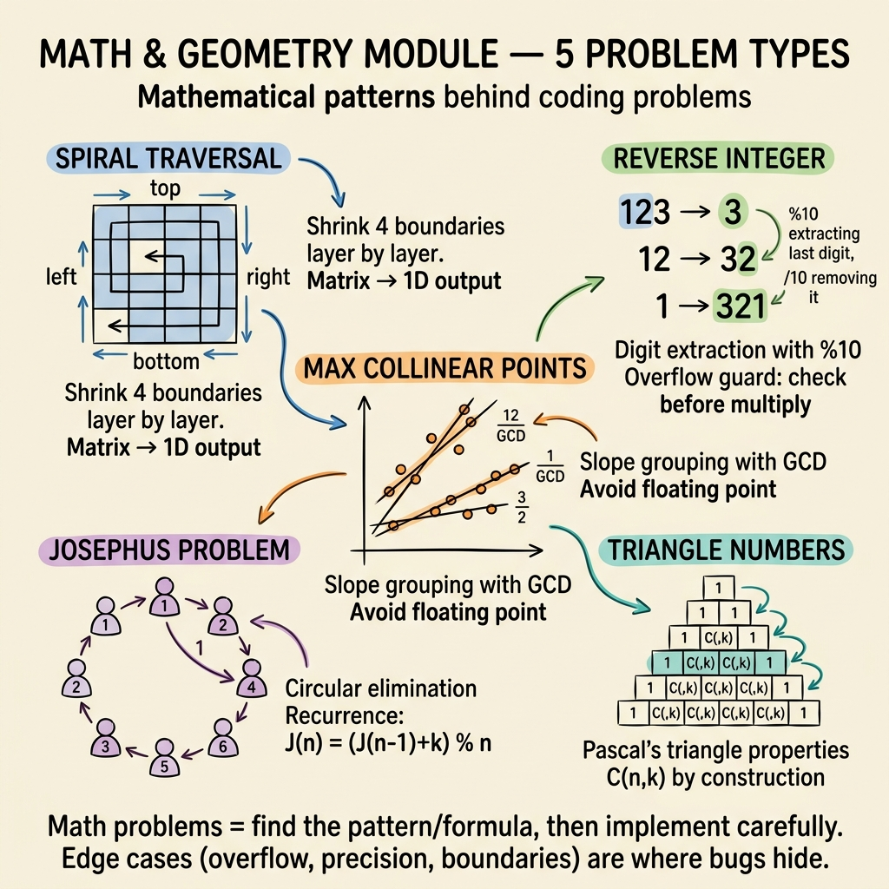

<!-- tags: dsa, algorithms, math, geometry, overview -->
# Math & Geometry — Normalize the Problem Before Solving It

> Problems in this module rarely fail due to missing loops. They fail when you keep the initial representation instead of normalizing it into a form that is easy to count, compare, or reason about.

📅 Created: 2026-04-04 · 🔄 Updated: 2026-04-09 · ⏱️ 8 min read

| Aspect | Detail |
| ------ | ------ |
| **Focus** | Normalization, recurrence, slope representation, wrap-around reasoning |
| **Pain point** | Small samples seem easy, but hidden cases break due to overflow or non-standard representation |
| **Mindset** | Reduce the problem to an invariant form before optimizing |

---

## 1. DEFINE

Imagine you are in an interview. The whiteboard is empty, but the clock is ticking. Math & Geometry — Normalize the Problem Before Solving It rarely requires memorizing tricks. It requires you to recognize patterns early before brute force wastes all your time.

Math/geometry problems are deceptive because brute force often "looks like it works". Solutions only collapse when encountering duplicate slopes, overflow, wrap-around, or larger-than-expected combinatorial counts. The root cause is usually not the code, but the representation.

Spiral traversal requires correctly moving boundaries. Reverse integer requires spotting overflow before it occurs. Max collinear points depends entirely on normalizing slopes. The Josephus problem looks like a loop but is actually a recurrence. Triangle numbers require turning an inequality into valid range counting.

This hub groups seemingly different problems around a single question. Have you reduced the problem to a stable form before solving it?

### Module Problems
| Problem | Core Tension | Representation to Lock | Link |
| --- | --- | --- | --- |
| Spiral Traversal | Boundaries shrink each layer | Top/bottom/left/right stay consistent | [01-spiral-traversal.md](./01-spiral-traversal.md) |
| Reverse Integer | Reverse digits without overflowing | Check overflow before multiplying by 10 | [02-reverse-integer.md](./02-reverse-integer.md) |
| Max Collinear Points | Many equivalent slopes in different forms | Normalize slope using gcd/sign | [03-max-collinear-points.md](./03-max-collinear-points.md) |
| Josephus Problem | Sequential elimination in a circle | Recurrence of survivor position | [04-josephus-problem.md](./04-josephus-problem.md) |
| Triangle Numbers | Count triplets satisfying inequality | Sorted order + boundary count | [05-triangle-numbers.md](./05-triangle-numbers.md) |

## 2. VISUAL

Problems in this module start with a perspective shift, not a code optimization. The image below maps five problem types to their core representation change — the step that makes each problem tractable.



*Image: Five seemingly unrelated problems share one trait — each requires normalizing the representation before the algorithm works. Spiral shrinks boundaries, Reverse Integer guards overflow, Collinear Points normalizes slopes, Josephus maps to recurrence, and Triangle Numbers exploits sorted order.*

```text
Math / Geometry Problem
  |
  +-- boundaries shift per layer?       -> Spiral Traversal
  +-- digits / math can overflow?       -> Reverse Integer
  +-- geometric relation needs fixing?  -> Max Collinear Points
  +-- cyclic elimination process?       -> Josephus Problem
  +-- inequality counted via order?     -> Triangle Numbers
```
*Figure: Text fallback — the most crucial step is changing the representation before running the main algorithm.*

## 3. CODE

The reading sequence should move from boundary/control-flow to normalization and recurrence. These are three distinct but highly complementary ways of thinking.

| Order | File | What you learn | Understanding Signal |
| --- | --- | --- | --- |
| 1 | [01-spiral-traversal.md](./01-spiral-traversal.md) | Boundary reasoning | You update four boundaries without repeating or skipping cells |
| 2 | [02-reverse-integer.md](./02-reverse-integer.md) | Overflow guards | You check overflow before mutating state |
| 3 | [03-max-collinear-points.md](./03-max-collinear-points.md) | GCD/sign normalization | You no longer store slopes as floats |
| 4 | [04-josephus-problem.md](./04-josephus-problem.md) and [05-triangle-numbers.md](./05-triangle-numbers.md) | Recurrence + order counting | You see how formulas connect with boundary counts |

## 4. PITFALLS

This problem group rarely breaks down due to simple loops. It breaks due to normalization, overflow, boundaries, and seemingly small but expensive assumptions.


| Pitfall | Signal | Why it fails | Fix | Severity |
| ------- | -------- | ---------- | -------- | -------- |
| Keep raw representation | Use float slopes or guess boundaries | Unstable representation breaks hidden cases | Normalize state before coding | high |
| Ignore overflow as part of the problem | Code passes small samples but fails on edges | Integer limits are real constraints, not minor details | Write guard conditions as an invariant | high |
| Treat geometry as just "drawing shapes" | Has a shape but lacks normalization | Geometric intuition cannot replace machine comparison | Turn relations into normalized numbers/constraints | medium |
| Ignore sorted order in counting | Keep brute-forcing sorted data | Order is a powerful tool for counting valid ranges | Combine counting with two pointers/boundary thinking | medium |

## 5. REF

- Module files: [01-spiral-traversal.md](./01-spiral-traversal.md) to [05-triangle-numbers.md](./05-triangle-numbers.md)
- Neighbor pattern for counting via order: [../patterns/two-pointers/README.md](../patterns/two-pointers/README.md)
- Bit-level guards/representation: [../bit-manipulation/README.md](../bit-manipulation/README.md)

## 6. RECOMMEND

After this module, you should approach every math/geometry problem by asking: "What representation makes the problem stable?"

- If a counting problem shifts to sorted pair/triple reasoning, see [../patterns/two-pointers/README.md](../patterns/two-pointers/README.md).
- If recurrence becomes stronger than closed formulas, move to [../dynamic-programming/README.md](../dynamic-programming/README.md).
- If the problem requires mask or bit state instead of geometric normalization, return to [../bit-manipulation/README.md](../bit-manipulation/README.md).

## 7. QUICK REF

- Normalization first, optimization later.
- Floats usually indicate insufficient normalization in discrete geometry.
- Overflow is part of correctness, not just an implementation detail.