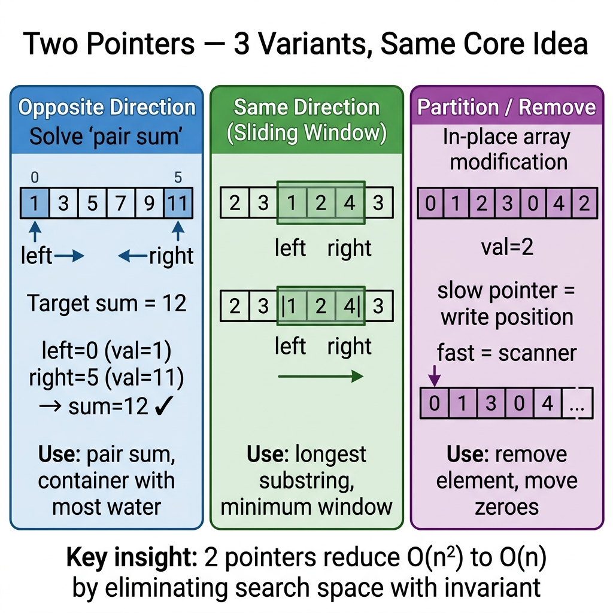

<!-- tags: dsa, algorithms, two-pointers -->
# 👆 Two Pointers

> This pattern appears when the problem gives a sequential structure and a way to eliminate search space after each step. If you miss the invariant, you easily write a correct brute force that fails on time limit.

📅 Created: 2026-03-20 · 🔄 Updated: 2026-04-10 · ⏱️ 18 min read

| Aspect | Detail |
| ------ | ------ |
| **Complexity** | Usually O(n) time · O(1) space |
| **Use case** | Sorted array, palindrome, deduplicate in-place, pair/triplet sum |
| **Recognition** | Each step can safely discard a search region without losing the solution |

---

## 1. DEFINE

<!-- [Beginner layer] -->
You face `Two Sum II`: a sorted array and a fixed target. An O(n²) brute force still gives the answer, but with n = 100,000 you test billions of useless pairs. The right question is not "how to check every pair", but "how many pairs can I eliminate per comparison without looking back?".

<!-- [Experienced layer] -->
`Two Pointers` places two indices on a single structure and moves them according to a known invariant. The most common invariant is:
- The structure is sorted.
- The left and right sides carry different meanings.
- When the current condition is "too large" or "too small", you know exactly which side to discard.

Core insight: **every pointer movement must eliminate a solution space without rechecking**. Just taking a random step is not two pointers.

| Variant | When to use | Main invariant | Anchor problem |
| ------- | -------- | --------------- | ------- |
| **Opposite ends** | Sorted pair / maximize area | Sum or metric changes monotonically from both ends | LC 167, LC 11 |
| **Same direction** | In-place compaction / sliding write pointer | `slow` keeps the correctly processed region | LC 26 |
| **Fixed anchor + 2 pointers** | 3Sum / kSum reduction | Fix 1 element, solve the rest with opposite ends | LC 15 |

| Approach | Time | Space | When to choose |
| -------- | ---- | ----- | -------- |
| Brute force | O(n²) | O(1) | Only to check intuition or small tests |
| Hash map | O(n) | O(n) | Unsorted array, need to lookup complement |
| Two pointers | O(n) | O(1) | Data has order or you can exploit order |

### 1.1 Quick Recognition

- The problem contains keywords like `sorted`, `pair`, `triplet`, `palindrome`, `in-place`.
- You can answer: "If the sum is too large, why should I decrease the right side?".
- You do not need to revisit an eliminated index.

### 1.2 Invariants & Failure Modes

<!-- [Expert layer] -->
- Opposite ends: if `nums[left] + nums[right] > target`, keeping `right` and increasing `left` only makes the sum larger or equal on a sorted array.
- Same direction: the `nums[0..slow]` segment is always a correctly compressed prefix.
- Most common failure mode: applying two pointers on data without a monotonic property, causing the algorithm to "run" but drop valid solutions.

---

## 2. VISUAL

This static card answers the core question: **how do these three variants differ, yet still use the same search space elimination idea?**



The two traces below connect that card to real data. They help you enter the playground asking: which pointer moves because of which invariant?

### Level 1 — Simple
This trace answers: **when the sum is too large or too small, which pointer must move?**

```text
Input: [2, 7, 11, 15], target = 9

Step 1: left=0 right=3  →  2 + 15 = 17 > 9  →  right--
        [2, 7, 11, 15]
         L         R

Step 2: left=0 right=2  →  2 + 11 = 13 > 9  →  right--
        [2, 7, 11, 15]
         L      R

Step 3: left=0 right=1  →  2 + 7 = 9 ✅
        [2, 7, 11, 15]
         L  R
```
*Image: When the sum is too large on a sorted array, dropping `right` is safe because elements to its left are smaller or equal.*

### Level 2 — Detailed
This trace answers: **how do same-direction pointers differ from opposite-end pointers?**

```text
Input: [1, 1, 2, 2, 3]
Goal : deduplicate in-place

Invariant:
  nums[0..slow] = correctly compressed region
  fast          = currently reading element

Step 1: slow=0 fast=1  → nums[1] == nums[0] → skip
        [1, 1, 2, 2, 3]
         S  F

Step 2: slow=0 fast=2  → nums[2] != nums[0] → slow++, copy 2
        [1, 2, 2, 2, 3]
            S  F

Step 3: slow=1 fast=4  → nums[4] != nums[1] → slow++, copy 3
        [1, 2, 3, 2, 3]
               S     F

Valid length = slow + 1 = 3
```
*Image: Same-direction pointers do not eliminate search space by sum. They keep a valid prefix and overwrite new results behind it.*

## 3. PLAYGROUND

The static card above helps you memorize three variants, but the playground reveals the invariant. When you step through, the difference between "move because sum is too large" and "move because sum is too small" becomes a visible decision chain.

Try changing the input to see which pointer must move first. Once you see the flow visually, the code below reads like a recorded reasoning rather than memorized commands.

::: algorithm-playground
src: ./playgrounds/01-two-pointers.playground.yml
:::

## 4. CODE

Once the trace locks the invariant, code expresses that reasoning instead of adding magic. We start from a clean baseline and scale up when necessary.

### Problem 1: Two Sum II (Sorted Array) [LC #167]
> *(The most basic opposite-end pointers. If you do not see why a sorted array lets you drop an entire end, start here.)*
>
> **Goal**: Find 2 positions that sum to `target` in a sorted array — O(n) time, O(1) space
> **Approach**: Opposite-end pointers. If sum is small, increase `left`. If large, decrease `right`.
> **Example**: `[2, 7, 11, 15], target=9` → `(0, 1)`

```go
// two_pointers.go — Two Pointers: Two Sum on sorted array
func TwoSumSorted(nums []int, target int) [2]int {
    left, right := 0, len(nums)-1
    for left < right {
        sum := nums[left] + nums[right]
        if sum == target {
            return [2]int{left, right}
        }
        if sum < target {
            left++ // increase sum by picking a larger number on the left
        } else {
            right-- // decrease sum by dropping the largest current number
        }
    }
    return [2]int{-1, -1}
}
```
```typescript
// two-pointers.ts — Two Pointers: Two Sum on sorted array
function twoSumSorted(nums: number[], target: number): [number, number] {
    let left = 0;
    let right = nums.length - 1;

    while (left < right) {
        const sum = nums[left] + nums[right];
        if (sum === target) {
            return [left, right];
        }
        if (sum < target) {
            left += 1;
        } else {
            right -= 1;
        }
    }

    return [-1, -1];
}
```
```java
// TwoPointers.java — Two Pointers: Two Sum on sorted array
final class TwoPointersBasic {
    private TwoPointersBasic() {}

    static int[] twoSumSorted(int[] nums, int target) {
        int left = 0;
        int right = nums.length - 1;

        while (left < right) {
            int sum = nums[left] + nums[right];
            if (sum == target) {
                return new int[] {left, right};
            }
            if (sum < target) {
                left++;
            } else {
                right--;
            }
        }

        return new int[] {-1, -1};
    }
}
```
```rust
// two_pointers.rs — Two Pointers: Two Sum on sorted array
fn two_sum_sorted(nums: &[i32], target: i32) -> (i32, i32) {
    let (mut left, mut right) = (0usize, nums.len() - 1);

    while left < right {
        let sum = nums[left] + nums[right];
        if sum == target {
            return (left as i32, right as i32);
        }
        if sum < target {
            left += 1;
        } else {
            right -= 1;
        }
    }

    (-1, -1)
}
```
```cpp
// two_pointers.cpp — Two Pointers: Two Sum on sorted array
std::pair<int, int> twoSumSorted(const std::vector<int>& nums, int target) {
    int left = 0;
    int right = static_cast<int>(nums.size()) - 1;

    while (left < right) {
        int sum = nums[left] + nums[right];
        if (sum == target) {
            return {left, right};
        }
        if (sum < target) {
            ++left;
        } else {
            --right;
        }
    }

    return {-1, -1};
}
```
```python
# two_pointers.py — Two Pointers: Two Sum on sorted array
def two_sum_sorted(nums: list[int], target: int) -> tuple[int, int]:
    left, right = 0, len(nums) - 1

    while left < right:
        total = nums[left] + nums[right]
        if total == target:
            return (left, right)
        if total < target:
            left += 1
        else:
            right -= 1

    return (-1, -1)
```

> **Why?** `Two Sum II` is the standard basic case because its invariant is visible and provable. On a sorted array, if the sum is too large, keeping `right` and increasing `left` only maintains or increases the sum, generating no new solutions. Dropping `right` is a grounded decision, not a trick.

> **Conclusion**: The basic case gives you the core invariant of opposite-end pointers. Do not move to 3Sum until you can explain why `right--` is safe when the sum is too large.

---

### Problem 2: 3Sum [LC #15]
> *(A classic problem showing this pattern goes beyond "2 pointers = 2 numbers". We fix an anchor and solve the rest with opposite-end pointers.)*
>
> **Goal**: Find all unique triplets that sum to `0` — O(n²) time, O(1) extra space outside output
> **Approach**: Sort + fix `i` + run two pointers on the suffix
> **Example**: `[-1, 0, 1, 2, -1, -4]` → `[[-1, -1, 2], [-1, 0, 1]]`

```go
// three_sum.go — Two Pointers: 3Sum with fixed anchor
import "sort"

func ThreeSum(nums []int) [][]int {
    sort.Ints(nums)
    result := make([][]int, 0)

    for i := 0; i < len(nums)-2; i++ {
        if i > 0 && nums[i] == nums[i-1] {
            continue // same old anchor generates the same old triplets
        }

        left, right := i+1, len(nums)-1
        for left < right {
            sum := nums[i] + nums[left] + nums[right]
            if sum == 0 {
                result = append(result, []int{nums[i], nums[left], nums[right]})

                for left < right && nums[left] == nums[left+1] {
                    left++
                }
                for left < right && nums[right] == nums[right-1] {
                    right--
                }
                left++
                right--
            } else if sum < 0 {
                left++
            } else {
                right--
            }
        }
    }

    return result
}
```
```typescript
// three-sum.ts — Two Pointers: 3Sum with fixed anchor
function threeSum(nums: number[]): number[][] {
    nums.sort((a, b) => a - b);
    const result: number[][] = [];

    for (let i = 0; i < nums.length - 2; i++) {
        if (i > 0 && nums[i] === nums[i - 1]) {
            continue;
        }

        let left = i + 1;
        let right = nums.length - 1;

        while (left < right) {
            const sum = nums[i] + nums[left] + nums[right];
            if (sum === 0) {
                result.push([nums[i], nums[left], nums[right]]);

                while (left < right && nums[left] === nums[left + 1]) left++;
                while (left < right && nums[right] === nums[right - 1]) right--;
                left++;
                right--;
            } else if (sum < 0) {
                left++;
            } else {
                right--;
            }
        }
    }

    return result;
}
```
```java
// ThreeSum.java — Two Pointers: 3Sum with fixed anchor
import java.util.ArrayList;
import java.util.Arrays;
import java.util.List;

final class TwoPointersIntermediate {
    private TwoPointersIntermediate() {}

    static List<List<Integer>> threeSum(int[] nums) {
        Arrays.sort(nums);
        List<List<Integer>> result = new ArrayList<>();

        for (int i = 0; i < nums.length - 2; i++) {
            if (i > 0 && nums[i] == nums[i - 1]) {
                continue;
            }

            int left = i + 1;
            int right = nums.length - 1;
            while (left < right) {
                int sum = nums[i] + nums[left] + nums[right];
                if (sum == 0) {
                    result.add(List.of(nums[i], nums[left], nums[right]));

                    while (left < right && nums[left] == nums[left + 1]) left++;
                    while (left < right && nums[right] == nums[right - 1]) right--;
                    left++;
                    right--;
                } else if (sum < 0) {
                    left++;
                } else {
                    right--;
                }
            }
        }

        return result;
    }
}
```
```rust
// three_sum.rs — Two Pointers: 3Sum with fixed anchor
fn three_sum(mut nums: Vec<i32>) -> Vec<Vec<i32>> {
    nums.sort_unstable();
    let mut result = Vec::new();

    for i in 0..nums.len().saturating_sub(2) {
        if i > 0 && nums[i] == nums[i - 1] {
            continue;
        }

        let (mut left, mut right) = (i + 1, nums.len() - 1);
        while left < right {
            let sum = nums[i] + nums[left] + nums[right];
            if sum == 0 {
                result.push(vec![nums[i], nums[left], nums[right]]);

                while left < right && nums[left] == nums[left + 1] {
                    left += 1;
                }
                while left < right && nums[right] == nums[right - 1] {
                    right -= 1;
                }
                left += 1;
                right -= 1;
            } else if sum < 0 {
                left += 1;
            } else {
                right -= 1;
            }
        }
    }

    result
}
```
```cpp
// three_sum.cpp — Two Pointers: 3Sum with fixed anchor
std::vector<std::vector<int>> threeSum(std::vector<int> nums) {
    std::sort(nums.begin(), nums.end());
    std::vector<std::vector<int>> result;

    for (int i = 0; i < static_cast<int>(nums.size()) - 2; ++i) {
        if (i > 0 && nums[i] == nums[i - 1]) {
            continue;
        }

        int left = i + 1;
        int right = static_cast<int>(nums.size()) - 1;
        while (left < right) {
            int sum = nums[i] + nums[left] + nums[right];
            if (sum == 0) {
                result.push_back({nums[i], nums[left], nums[right]});

                while (left < right && nums[left] == nums[left + 1]) ++left;
                while (left < right && nums[right] == nums[right - 1]) --right;
                ++left;
                --right;
            } else if (sum < 0) {
                ++left;
            } else {
                --right;
            }
        }
    }

    return result;
}
```
```python
# three_sum.py — Two Pointers: 3Sum with fixed anchor
def three_sum(nums: list[int]) -> list[list[int]]:
    nums.sort()
    result: list[list[int]] = []

    for i in range(len(nums) - 2):
        if i > 0 and nums[i] == nums[i - 1]:
            continue

        left, right = i + 1, len(nums) - 1
        while left < right:
            total = nums[i] + nums[left] + nums[right]
            if total == 0:
                result.append([nums[i], nums[left], nums[right]])
                while left < right and nums[left] == nums[left + 1]:
                    left += 1
                while left < right and nums[right] == nums[right - 1]:
                    right -= 1
                left += 1
                right -= 1
            elif total < 0:
                left += 1
            else:
                right -= 1

    return result
```

> **Why?** 3Sum is not a new pattern. It is "sort + pick 1 anchor + solve 2Sum on suffix". The difficulty lies in skipping duplicate anchors and skipping duplicate pointers after finding a triplet. If you skip either, the output will contain duplicate sets.

> **Conclusion**: This is a classic intermediate problem because it forces you to maintain invariants across multiple layers: sorted order, anchor uniqueness, pointer movement, and duplicate skipping.

---

### Problem 3: Container With Most Water [LC #11]
> *(This problem tests if you truly trust the invariant or still fear "missing a better solution".)*
>
> **Goal**: Find the maximum area formed by two lines — O(n) time, O(1) space
> **Approach**: Opposite-end pointers. Always discard the shorter line because it caps the area height.
> **Example**: `[1, 8, 6, 2, 5, 4, 8, 3, 7]` → `49`

```go
// max_area.go — Two Pointers: Container With Most Water
func MaxArea(height []int) int {
    left, right := 0, len(height)-1
    best := 0

    for left < right {
        currentHeight := height[left]
        if height[right] < currentHeight {
            currentHeight = height[right]
        }

        area := currentHeight * (right - left)
        if area > best {
            best = area
        }

        if height[left] < height[right] {
            left++ // drop the shorter line hoping to increase min-height
        } else {
            right--
        }
    }

    return best
}
```
```typescript
// max-area.ts — Two Pointers: Container With Most Water
function maxArea(height: number[]): number {
    let left = 0;
    let right = height.length - 1;
    let best = 0;

    while (left < right) {
        const currentHeight = Math.min(height[left], height[right]);
        best = Math.max(best, currentHeight * (right - left));

        if (height[left] < height[right]) {
            left++;
        } else {
            right--;
        }
    }

    return best;
}
```
```java
// MaxArea.java — Two Pointers: Container With Most Water
final class TwoPointersAdvanced {
    private TwoPointersAdvanced() {}

    static int maxArea(int[] height) {
        int left = 0;
        int right = height.length - 1;
        int best = 0;

        while (left < right) {
            int currentHeight = Math.min(height[left], height[right]);
            best = Math.max(best, currentHeight * (right - left));

            if (height[left] < height[right]) {
                left++;
            } else {
                right--;
            }
        }

        return best;
    }
}
```
```rust
// max_area.rs — Two Pointers: Container With Most Water
fn max_area(height: &[i32]) -> i32 {
    let (mut left, mut right, mut best) = (0usize, height.len() - 1, 0);

    while left < right {
        let current_height = height[left].min(height[right]);
        best = best.max(current_height * (right - left) as i32);

        if height[left] < height[right] {
            left += 1;
        } else {
            right -= 1;
        }
    }

    best
}
```
```cpp
// max_area.cpp — Two Pointers: Container With Most Water
int maxArea(const std::vector<int>& height) {
    int left = 0;
    int right = static_cast<int>(height.size()) - 1;
    int best = 0;

    while (left < right) {
        int currentHeight = std::min(height[left], height[right]);
        best = std::max(best, currentHeight * (right - left));

        if (height[left] < height[right]) {
            ++left;
        } else {
            --right;
        }
    }

    return best;
}
```
```python
# max_area.py — Two Pointers: Container With Most Water
def max_area(height: list[int]) -> int:
    left, right = 0, len(height) - 1
    best = 0

    while left < right:
        current_height = min(height[left], height[right])
        best = max(best, current_height * (right - left))

        if height[left] < height[right]:
            left += 1
        else:
            right -= 1

    return best
```

> **Why?** The area is capped by the shorter line. If you keep the shorter line and move the taller one, the width decreases but the height ceiling never increases. You are certain not to create a better area with the old short line, so dropping it is a safe decision.

> **Conclusion**: This is an advanced problem because its intuition is counter-intuitive. To truly understand it, prove this statement: "any better solution must replace the current shorter line".

---

### Problem 4: Remove Duplicates from Sorted Array [LC #26]
> *(The same-direction variant shows Two Pointers is not just for pair sum.)*
>
> **Goal**: Compress a sorted array in-place so each value appears once — O(n) time, O(1) space
> **Approach**: `slow` points to the end of the valid region; `fast` scans each new element
> **Example**: `[1,1,2,2,3]` → valid prefix `[1,2,3]`, length `3`

```go
// remove_duplicates.go — Two Pointers: Deduplicate sorted array in-place
func RemoveDuplicates(nums []int) int {
    if len(nums) == 0 {
        return 0
    }

    slow := 0
    for fast := 1; fast < len(nums); fast++ {
        if nums[fast] != nums[slow] {
            slow++
            nums[slow] = nums[fast]
        }
    }

    return slow + 1
}
```
```typescript
// remove-duplicates.ts — Two Pointers: Deduplicate sorted array in-place
function removeDuplicates(nums: number[]): number {
    if (nums.length === 0) {
        return 0;
    }

    let slow = 0;
    for (let fast = 1; fast < nums.length; fast++) {
        if (nums[fast] !== nums[slow]) {
            slow += 1;
            nums[slow] = nums[fast];
        }
    }

    return slow + 1;
}
```
```java
// RemoveDuplicates.java — Two Pointers: Deduplicate sorted array in-place
final class TwoPointersExpert {
    private TwoPointersExpert() {}

    static int removeDuplicates(int[] nums) {
        if (nums.length == 0) {
            return 0;
        }

        int slow = 0;
        for (int fast = 1; fast < nums.length; fast++) {
            if (nums[fast] != nums[slow]) {
                slow++;
                nums[slow] = nums[fast];
            }
        }

        return slow + 1;
    }
}
```
```rust
// remove_duplicates.rs — Two Pointers: Deduplicate sorted array in-place
fn remove_duplicates(nums: &mut [i32]) -> usize {
    if nums.is_empty() {
        return 0;
    }

    let mut slow = 0usize;
    for fast in 1..nums.len() {
        if nums[fast] != nums[slow] {
            slow += 1;
            nums[slow] = nums[fast];
        }
    }

    slow + 1
}
```
```cpp
// remove_duplicates.cpp — Two Pointers: Deduplicate sorted array in-place
int removeDuplicates(std::vector<int>& nums) {
    if (nums.empty()) {
        return 0;
    }

    int slow = 0;
    for (int fast = 1; fast < static_cast<int>(nums.size()); ++fast) {
        if (nums[fast] != nums[slow]) {
            ++slow;
            nums[slow] = nums[fast];
        }
    }

    return slow + 1;
}
```
```python
# remove_duplicates.py — Two Pointers: Deduplicate sorted array in-place
def remove_duplicates(nums: list[int]) -> int:
    if not nums:
        return 0

    slow = 0
    for fast in range(1, len(nums)):
        if nums[fast] != nums[slow]:
            slow += 1
            nums[slow] = nums[fast]

    return slow + 1
```

> **Why?** `slow` is not a "slow pointer" in speed. It is the right boundary of the correct prefix. Only when `fast` sees a new value do we expand that prefix by 1 cell. This is why the pattern shares the same name but has a completely different invariant than opposite-end pointers.

> **Conclusion**: The expert level here is not about long code, but about forcing you to separate "pointer to read" from "pointer to commit result".

---

## 5. PITFALLS

The tricky part of DSA rarely lies in the algorithm name. It lies in representation, boundary, and the promise you thought you kept but actually dropped midway.

| # | Severity | Error | Impact | Fix |
|---|----------|-----|---------|-----|
| 1 | 🔴 Fatal | Applying opposite-end pointers on unsorted arrays | Discarding valid solutions blindly, returning wrong results | Only use when order exists or after sorting |
| 2 | 🟡 Common | Forgetting to skip duplicates in 3Sum | Output contains duplicate triplets, failing hidden tests | Skip duplicate anchors and duplicate pointers after finding a solution |
| 3 | 🟡 Common | Using `left <= right` in pair search | You might count the same element twice | Default to `left < right` for pair/triplet searches |
| 4 | 🟡 Common | Comparing `nums[fast]` with `nums[fast-1]` instead of `nums[slow]` in same-direction | The valid prefix gets incorrectly overwritten | Always remember `slow` represents the last committed state |
| 5 | 🔵 Minor | Learning pointer rules without writing the invariant | You get stuck on slight variations | Before coding, write: "what does this pointer represent?" |

---

## 6. REF

| Resource | Type | Link | Note |
| -------- | ---- | ---- | ------- |
| LeetCode 167 | Problem | https://leetcode.com/problems/two-sum-ii-input-array-is-sorted/ | Basic opposite-end |
| LeetCode 15 | Problem | https://leetcode.com/problems/3sum/ | Fixed anchor + two pointers |
| LeetCode 11 | Problem | https://leetcode.com/problems/container-with-most-water/ | Counter-intuitive invariant |
| LeetCode 26 | Problem | https://leetcode.com/problems/remove-duplicates-from-sorted-array/ | Same-direction in-place |

---

## 7. RECOMMEND

When a pattern stands firm, the next step is knowing its adjacent problem families and when to switch primitives.

| Expansion | When to use | Reason | File/Link |
| ------- | ------- | ----- | --------- |
| Fast & Slow | Need cycle detection or middle node | Same "2 pointers" family, different invariant | [./02-fast-slow.md](./02-fast-slow.md) |
| Sliding Window | Have contiguous window instead of independent ends | Same-direction but adding dynamic constraints | [../string-algorithms/02-sliding-window.md](../string-algorithms/02-sliding-window.md) |
| Binary Search | Sorted array but need boundary instead of pair | Exploits order differently to eliminate search space | [../searching/02-binary-search.md](../searching/02-binary-search.md) |

---

## 8. QUICK REF

| Problem signal | Sub-pattern | Short template |
| --------------- | ----------- | ------------- |
| `sorted` + `pair sum` | Opposite ends | `while l < r { sum := a[l]+a[r] }` |
| `sorted` + `deduplicate in-place` | Same direction | `if a[fast] != a[slow] { slow++; a[slow] = a[fast] }` |
| `3 numbers sum` | Anchor + 2 pointers | `sort → for i → solve 2Sum on suffix` |
| `maximize/minimize metric with 2 ends` | Opposite ends + invariant proof | Always prove why dropping one end is safe |

---

**Links**: [← README](./README.md) · [→ Fast & Slow](./02-fast-slow.md) · [↗ Binary Search](../searching/02-binary-search.md)

---

Returning to the opening question: why does two pointers turn O(n²) into O(n)? Because the invariant ensures each step eliminates at least 1 element from the search space. Sorted means opposite direction. Unsorted window means same direction. In-place means read/write pointers.