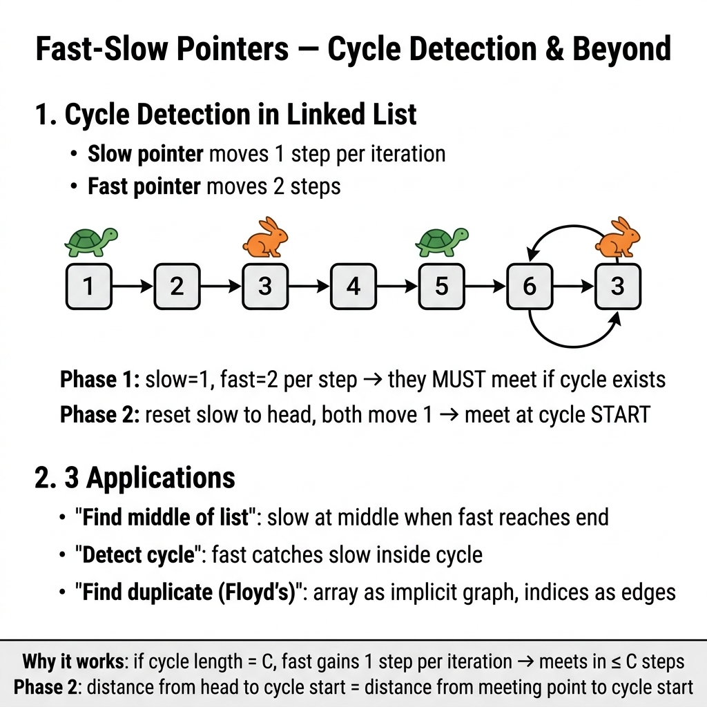

<!-- tags: dsa, algorithms, fast-slow -->
# 🐇🐢 Fast & Slow Pointers

> This pattern is for problems where you cannot afford extra memory to know "is there a cycle", "where is the middle", or "is a repeating value hidden as a cycle". If you only memorize the `slow += 1, fast += 2` formula without understanding the underlying graph, you will use it incorrectly very fast.

📅 Created: 2026-03-20 · 🔄 Updated: 2026-04-10 · ⏱️ 18 min read

| Aspect | Detail |
| ------ | ------ |
| **Complexity** | O(n) time · O(1) space |
| **Use case** | Cycle detection, cycle entry, middle node, duplicate number |
| **Recognition** | The structure can be viewed as a path or a functional graph |

---

## 1. DEFINE

<!-- [Beginner layer] -->
You debug a linked list and suspect a cycle. The brute force way is storing every visited node in a `HashSet`. That is correct, but it wastes O(n) memory and hides the real insight. If one runner takes 1 step and another takes 2 steps on the same cycle, they will eventually meet.

<!-- [Experienced layer] -->
`Fast & Slow Pointers` runs two pointers at different speeds on the same structure. If the structure has a cycle, their speed difference shrinks their relative distance modulo the cycle length. If there is no cycle, `fast` will hit `nil` first.

Core insight: **this is a problem about movement on a path or a functional graph, not just a linked list trick**.

| Variant | Question answered | Main invariant | Anchor problem |
| ------- | --------------- | --------------- | ------- |
| **Cycle detection** | Is there a cycle? | `fast` moves faster, meets `slow` if a cycle exists | LC 141 |
| **Cycle entry** | Where does the cycle start? | After meeting, one pointer resets to start, both move 1 step | LC 142 |
| **Middle node** | Where is the middle node? | Every 2 steps of `fast` equals 1 step of `slow` | LC 876 |
| **Array as graph** | What is the duplicate number? | `index -> value` forms a functional graph with a cycle | LC 287 |

| Approach | Time | Space | When to choose |
| -------- | ---- | ----- | -------- |
| Hash set visited | O(n) | O(n) | Easy to write and debug, not memory optimal |
| Fast & Slow | O(n) | O(1) | When the structure is a linked list or a functional graph |

### 1.1 Quick Recognition

- The problem asks for `cycle`, `loop`, `middle`, `duplicate without modifying array`.
- Each node or index has at most one "next state".
- You can model the data as `state -> next(state)`.

### 1.2 Invariants & Failure Modes

<!-- [Expert layer] -->
- If there is a cycle, after both pointers enter it, their relative distance decreases by 1 unit per iteration.
- In finding cycle entry, assume head to entry is `a`, entry to meet is `b`, and cycle length is `L`. Their distance yields `a ≡ -b (mod L)`.
- The most dangerous failure mode is applying this pattern on a structure without a uniquely defined `next` state. The "functional graph" reasoning collapses.

---

## 2. VISUAL

This static card answers the most important question to remember: **this pattern is about the relative relationship between two pointers, not about eliminating search space like two pointers.**



The two traces below clarify the two biggest payoffs of the pattern: meeting in a cycle and returning to the entry by the exact distance.

### Level 1 — Simple
This trace answers: **why must `slow` and `fast` meet if there is a cycle?**

```text
1 → 2 → 3 → 4 → 5
          ↑     ↓
          8 ← 7 ← 6

Round 1: slow=2 fast=3
Round 2: slow=3 fast=5
Round 3: slow=4 fast=7
Round 4: slow=5 fast=3
Round 5: slow=6 fast=5
Round 6: slow=7 fast=7 ✅ meet
```
*Image: Once both enter the cycle, `fast` gains 1 relative step over `slow` per round, making the catch-up inevitable.*

### Level 2 — Detailed
This trace answers: **why does resetting a pointer to the head find the cycle entry?**

```text
head ---- a steps ----> entry ---- b steps ----> meet
                         ^                         |
                         |----- L - b steps -------|

slow distance  = a + b
fast distance  = a + b + kL
fast = 2 * slow

=> 2(a + b) = a + b + kL
=> a + b = kL
=> a = kL - b

Meaning:
  taking a steps from head reaches entry
  taking a steps from meet also reaches entry
```
*Image: The formula `a = kL - b` is the theoretical reason behind "reset slow to head and move both at the same speed".*

## 3. CODE

Once the trace locks the invariant, code expresses that reasoning instead of adding magic. We start from a clean baseline and scale up when necessary.

### Problem 1: Linked List Cycle [LC #141]
> *(The entry problem for fast-slow. If you do not understand why two pointers must meet in a cycle, do not jump to cycle entry.)*
>
> **Goal**: Check if a linked list has a cycle — O(n) time, O(1) space
> **Approach**: Floyd's Tortoise and Hare. `slow` takes 1 step, `fast` takes 2 steps.
> **Example**: `3 -> 2 -> 0 -> -4`, tail connects back to node `2` → `true`

```go
// fast_slow.go — Fast & Slow: Detect cycle in linked list
type ListNode struct {
    Val  int
    Next *ListNode
}

func HasCycle(head *ListNode) bool {
    slow, fast := head, head
    for fast != nil && fast.Next != nil {
        slow = slow.Next
        fast = fast.Next.Next
        if slow == fast {
            return true
        }
    }
    return false
}
```
```typescript
// fast-slow.ts — Fast & Slow: Detect cycle in linked list
class ListNode {
    constructor(public val: number, public next: ListNode | null = null) {}
}

function hasCycle(head: ListNode | null): boolean {
    let slow = head;
    let fast = head;

    while (fast && fast.next) {
        slow = slow!.next;
        fast = fast.next.next;
        if (slow === fast) {
            return true;
        }
    }

    return false;
}
```
```java
// FastSlowBasic.java — Fast & Slow: Detect cycle in linked list
final class FastSlowBasic {
    static final class ListNode {
        int val;
        ListNode next;

        ListNode(int val) {
            this.val = val;
        }
    }

    private FastSlowBasic() {}

    static boolean hasCycle(ListNode head) {
        ListNode slow = head;
        ListNode fast = head;

        while (fast != null && fast.next != null) {
            slow = slow.next;
            fast = fast.next.next;
            if (slow == fast) {
                return true;
            }
        }

        return false;
    }
}
```
```rust
// fast_slow.rs — Fast & Slow: Detect cycle in linked list
#[derive(Clone)]
struct ListNode {
    val: i32,
    next: Option<Box<ListNode>>,
}

fn has_cycle(head: Option<Box<ListNode>>) -> bool {
    let mut slow = head.as_deref();
    let mut fast = head.as_deref();

    while let Some(f1) = fast {
        if let Some(f2) = f1.next.as_deref() {
            slow = slow.and_then(|node| node.next.as_deref());
            fast = f2.next.as_deref();

            if let (Some(s), Some(f)) = (slow, fast) {
                if std::ptr::eq(s, f) {
                    return true;
                }
            }
        } else {
            break;
        }
    }

    false
}
```
```cpp
// fast_slow.cpp — Fast & Slow: Detect cycle in linked list
struct ListNode {
    int val;
    ListNode* next;
    explicit ListNode(int v) : val(v), next(nullptr) {}
};

bool hasCycle(ListNode* head) {
    ListNode* slow = head;
    ListNode* fast = head;

    while (fast && fast->next) {
        slow = slow->next;
        fast = fast->next->next;
        if (slow == fast) {
            return true;
        }
    }

    return false;
}
```
```python
# fast_slow.py — Fast & Slow: Detect cycle in linked list
class ListNode:
    def __init__(self, val: int = 0, next: "ListNode | None" = None) -> None:
        self.val = val
        self.next = next

def has_cycle(head: ListNode | None) -> bool:
    slow = head
    fast = head

    while fast and fast.next:
        slow = slow.next
        fast = fast.next.next
        if slow is fast:
            return True

    return False
```

> **Why?** When there is a cycle, `fast` gains exactly 1 relative step over `slow` in the loop per iteration. Once both enter the cycle, the modulo distance shrinks to `0`, making the meeting inevitable, not probabilistic.

> **Conclusion**: The basic case of fast-slow is the "is there a cycle" test. It avoids deep math, but forces you to remember the `fast != nil && fast.Next != nil` guard.

---

### Problem 2: Linked List Cycle II [LC #142]
> *(This makes the pattern memorable: from "meeting in a cycle", we can deduce "where the cycle starts".)*
>
> **Goal**: Return the node where the cycle begins — O(n) time, O(1) space
> **Approach**: Floyd phase 1 finds meet point. Phase 2 resets one pointer to head, moving both by 1 step.
> **Example**: `3 -> 2 -> 0 -> -4`, tail connects back to node `2` → returns node `2`

```go
// detect_cycle_start.go — Fast & Slow: Detect cycle entry
func DetectCycleStart(head *ListNode) *ListNode {
    slow, fast := head, head
    for fast != nil && fast.Next != nil {
        slow = slow.Next
        fast = fast.Next.Next
        if slow == fast {
            slow = head
            for slow != fast {
                slow = slow.Next
                fast = fast.Next
            }
            return slow
        }
    }
    return nil
}
```
```typescript
// detect-cycle-start.ts — Fast & Slow: Detect cycle entry
function detectCycleStart(head: ListNode | null): ListNode | null {
    let slow = head;
    let fast = head;

    while (fast && fast.next) {
        slow = slow!.next;
        fast = fast.next.next;

        if (slow === fast) {
            slow = head;
            while (slow !== fast) {
                slow = slow!.next;
                fast = fast!.next;
            }
            return slow;
        }
    }

    return null;
}
```
```java
// FastSlowIntermediate.java — Fast & Slow: Detect cycle entry
final class FastSlowIntermediate {
    private FastSlowIntermediate() {}

    static FastSlowBasic.ListNode detectCycleStart(FastSlowBasic.ListNode head) {
        FastSlowBasic.ListNode slow = head;
        FastSlowBasic.ListNode fast = head;

        while (fast != null && fast.next != null) {
            slow = slow.next;
            fast = fast.next.next;
            if (slow == fast) {
                slow = head;
                while (slow != fast) {
                    slow = slow.next;
                    fast = fast.next;
                }
                return slow;
            }
        }

        return null;
    }
}
```
```rust
// detect_cycle_start.rs — Fast & Slow: Detect cycle entry
fn detect_cycle_start(head: Option<Box<ListNode>>) -> Option<*const ListNode> {
    let mut slow = head.as_deref();
    let mut fast = head.as_deref();

    while let Some(f1) = fast {
        if let Some(f2) = f1.next.as_deref() {
            slow = slow.and_then(|node| node.next.as_deref());
            fast = f2.next.as_deref();

            if let (Some(s), Some(f)) = (slow, fast) {
                if std::ptr::eq(s, f) {
                    let mut p1 = head.as_deref();
                    let mut p2 = Some(s);
                    while let (Some(a), Some(b)) = (p1, p2) {
                        if std::ptr::eq(a, b) {
                            return Some(a as *const ListNode);
                        }
                        p1 = a.next.as_deref();
                        p2 = b.next.as_deref();
                    }
                }
            }
        } else {
            break;
        }
    }

    None
}
```
```cpp
// detect_cycle_start.cpp — Fast & Slow: Detect cycle entry
ListNode* detectCycleStart(ListNode* head) {
    ListNode* slow = head;
    ListNode* fast = head;

    while (fast && fast->next) {
        slow = slow->next;
        fast = fast->next->next;
        if (slow == fast) {
            slow = head;
            while (slow != fast) {
                slow = slow->next;
                fast = fast->next;
            }
            return slow;
        }
    }

    return nullptr;
}
```
```python
# detect_cycle_start.py — Fast & Slow: Detect cycle entry
def detect_cycle_start(head: ListNode | None) -> ListNode | None:
    slow = head
    fast = head

    while fast and fast.next:
        slow = slow.next
        fast = fast.next.next
        if slow is fast:
            slow = head
            while slow is not fast:
                slow = slow.next
                fast = fast.next
            return slow

    return None
```

> **Why?** After meeting in the cycle, the distance from `head` to `entry` equals the distance from `meet` to `entry` modulo cycle length. Resetting one pointer to `head` and moving both at the same speed guarantees they meet exactly at the entry.

> **Conclusion**: This is a standard intermediate problem because the code is short but the reasoning is deep. If you only remember "reset slow to head" without the proof, you will easily forget it.

---

### Problem 3: Middle of the Linked List [LC #876]
> *(A lighter logic problem, but it helps you feel fast-slow as a progress measuring tool rather than just a cycle detector.)*
>
> **Goal**: Return the middle node. For an even list, return the second middle — O(n) time, O(1) space
> **Approach**: `fast` takes 2 steps, `slow` takes 1 step. When `fast` reaches the end, `slow` is at the middle.
> **Example**: `1 -> 2 -> 3 -> 4 -> 5 -> 6` → returns node `4`

```go
// middle_node.go — Fast & Slow: Find middle node
func MiddleNode(head *ListNode) *ListNode {
    slow, fast := head, head
    for fast != nil && fast.Next != nil {
        slow = slow.Next
        fast = fast.Next.Next
    }
    return slow
}
```
```typescript
// middle-node.ts — Fast & Slow: Find middle node
function middleNode(head: ListNode | null): ListNode | null {
    let slow = head;
    let fast = head;

    while (fast && fast.next) {
        slow = slow!.next;
        fast = fast.next.next;
    }

    return slow;
}
```
```java
// FastSlowAdvanced.java — Fast & Slow: Find middle node
final class FastSlowAdvanced {
    private FastSlowAdvanced() {}

    static FastSlowBasic.ListNode middleNode(FastSlowBasic.ListNode head) {
        FastSlowBasic.ListNode slow = head;
        FastSlowBasic.ListNode fast = head;

        while (fast != null && fast.next != null) {
            slow = slow.next;
            fast = fast.next.next;
        }

        return slow;
    }
}
```
```rust
// middle_node.rs — Fast & Slow: Find middle node
fn middle_node(head: Option<Box<ListNode>>) -> Option<*const ListNode> {
    let mut slow = head.as_deref();
    let mut fast = head.as_deref();

    while let Some(f1) = fast {
        if let Some(f2) = f1.next.as_deref() {
            slow = slow.and_then(|node| node.next.as_deref());
            fast = f2.next.as_deref();
        } else {
            break;
        }
    }

    slow.map(|node| node as *const ListNode)
}
```
```cpp
// middle_node.cpp — Fast & Slow: Find middle node
ListNode* middleNode(ListNode* head) {
    ListNode* slow = head;
    ListNode* fast = head;

    while (fast && fast->next) {
        slow = slow->next;
        fast = fast->next->next;
    }

    return slow;
}
```
```python
# middle_node.py — Fast & Slow: Find middle node
def middle_node(head: ListNode | None) -> ListNode | None:
    slow = head
    fast = head

    while fast and fast.next:
        slow = slow.next
        fast = fast.next.next

    return slow
```

> **Why?** This shows fast-slow is useful even without a cycle. `fast` acts as a clock measuring "how far we have gone", while `slow` acts as a marker for half the distance.

> **Conclusion**: The middle node variant is a great bridge from linked list thinking to general runner technique thinking.

---

### Problem 4: Find the Duplicate Number [LC #287]
> *(This is an expert problem because the data is an array, but the real insight is "this array disguises a linked list".)*
>
> **Goal**: Find the duplicate number in an array of `n+1` elements with values in `[1..n]`. Do not modify the array. Use O(1) extra space.
> **Approach**: Treat `index -> nums[index]` as a next-state function, turning the array into a functional graph, then apply Floyd's algorithm.
> **Example**: `[1, 3, 4, 2, 2]` → `2`

```go
// find_duplicate.go — Fast & Slow: Find duplicate via array-as-graph
func FindDuplicate(nums []int) int {
    slow, fast := nums[0], nums[nums[0]]
    for slow != fast {
        slow = nums[slow]
        fast = nums[nums[fast]]
    }

    slow = 0
    for slow != fast {
        slow = nums[slow]
        fast = nums[fast]
    }

    return slow
}
```
```typescript
// find-duplicate.ts — Fast & Slow: Find duplicate via array-as-graph
function findDuplicate(nums: number[]): number {
    let slow = nums[0];
    let fast = nums[nums[0]];

    while (slow !== fast) {
        slow = nums[slow];
        fast = nums[nums[fast]];
    }

    slow = 0;
    while (slow !== fast) {
        slow = nums[slow];
        fast = nums[fast];
    }

    return slow;
}
```
```java
// FindDuplicate.java — Fast & Slow: Find duplicate via array-as-graph
final class FastSlowExpert {
    private FastSlowExpert() {}

    static int findDuplicate(int[] nums) {
        int slow = nums[0];
        int fast = nums[nums[0]];

        while (slow != fast) {
            slow = nums[slow];
            fast = nums[nums[fast]];
        }

        slow = 0;
        while (slow != fast) {
            slow = nums[slow];
            fast = nums[fast];
        }

        return slow;
    }
}
```
```rust
// find_duplicate.rs — Fast & Slow: Find duplicate via array-as-graph
fn find_duplicate(nums: &[usize]) -> usize {
    let mut slow = nums[0];
    let mut fast = nums[nums[0]];

    while slow != fast {
        slow = nums[slow];
        fast = nums[nums[fast]];
    }

    slow = 0;
    while slow != fast {
        slow = nums[slow];
        fast = nums[fast];
    }

    slow
}
```
```cpp
// find_duplicate.cpp — Fast & Slow: Find duplicate via array-as-graph
int findDuplicate(const std::vector<int>& nums) {
    int slow = nums[0];
    int fast = nums[nums[0]];

    while (slow != fast) {
        slow = nums[slow];
        fast = nums[nums[fast]];
    }

    slow = 0;
    while (slow != fast) {
        slow = nums[slow];
        fast = nums[fast];
    }

    return slow;
}
```
```python
# find_duplicate.py — Fast & Slow: Find duplicate via array-as-graph
def find_duplicate(nums: list[int]) -> int:
    slow = nums[0]
    fast = nums[nums[0]]

    while slow != fast:
        slow = nums[slow]
        fast = nums[nums[fast]]

    slow = 0
    while slow != fast:
        slow = nums[slow]
        fast = nums[fast]

    return slow
```

> **Why?** Because all values are in `[1..n]`, each index always points to another valid index. With `n+1` elements but only `n` distinct values, the pigeonhole principle forces a cycle. The duplicate is exactly the entry of that cycle in the functional graph.

> **Conclusion**: This is where fast-slow leaves linked lists and becomes implicit graph thinking. If you see this model, many "read-only array" problems become less mysterious.

---

## 4. PITFALLS

The tricky part of DSA rarely lies in the algorithm name. It lies in representation, boundary, and the promise you thought you kept but actually dropped midway.

| # | Severity | Error | Impact | Fix |
|---|----------|-----|---------|-----|
| 1 | 🔴 Fatal | Forgetting the `fast != nil && fast.Next != nil` guard | Panic or null dereference before cycle logic runs | With linked lists, this guard is mandatory in the main loop |
| 2 | 🔴 Fatal | In cycle entry, resetting `fast` by mistake but keeping wrong speeds | Returns wrong entry or loops infinitely | After the meet point, both must take 1 step per round |
| 3 | 🟡 Common | Using fast-slow on a structure without uniquely defined `next` | Cycle modulo reasoning is no longer correct | Only apply when a clear path or functional graph model exists |
| 4 | 🟡 Common | With `Find Duplicate`, forgetting that values must be in `[1..n]` | Out-of-bounds access or false proof | Re-check constraints before choosing Floyd's algorithm |
| 5 | 🔵 Minor | Memorizing the trick without drawing a 5-step trace | Remembering the formula but failing to debug | Always trace by hand at least one cyclic and one non-cyclic example |

---

## 5. REF

| Resource | Type | Link | Note |
| -------- | ---- | ---- | ------- |
| LeetCode 141 | Problem | https://leetcode.com/problems/linked-list-cycle/ | Cycle detection |
| LeetCode 142 | Problem | https://leetcode.com/problems/linked-list-cycle-ii/ | Cycle entry |
| LeetCode 876 | Problem | https://leetcode.com/problems/middle-of-the-linked-list/ | Middle node |
| LeetCode 287 | Problem | https://leetcode.com/problems/find-the-duplicate-number/ | Array as graph |
| Floyd's cycle detection | Reference | https://en.wikipedia.org/wiki/Cycle_detection | Math behind meet point |

---

## 6. RECOMMEND

When a pattern stands firm, the next step is knowing its adjacent problem families and when to switch primitives.

| Expansion | When to use | Reason | File/Link |
| ------- | ------- | ----- | --------- |
| Two Pointers | Problem has order or eliminates search space from two ends | Same runner technique family but different invariant | [./01-two-pointers.md](./01-two-pointers.md) |
| Linked Lists | Need more practice on basic pointer manipulation | Fast-slow is most effective on linked lists | [../linked-lists/README.md](../linked-lists/README.md) |
| Binary Search on Answer | Another "use hidden structure to reduce search space" problem | Transition from runner invariant to monotonic invariant | [./06-binary-search-on-answer.md](./06-binary-search-on-answer.md) |

---

## 7. QUICK REF

| Problem signal | Sub-pattern | Short template |
| --------------- | ----------- | ------------- |
| `cycle in linked list` | Floyd detect | `while fast && fast.next { slow=slow.next; fast=fast.next.next }` |
| `cycle start` | Floyd phase 2 | `after meet: slow=head; while slow != fast { ... }` |
| `middle of list` | Progress measurement | `fast 2x, slow 1x` |
| `array values in [1..n]` + `find duplicate` | Array as graph | `index -> nums[index]` |

---

**Links**: [← Two Pointers](./01-two-pointers.md) · [→ Hashing](./03-hashing.md)

---

Returning to the opening question: why must fast catch up to slow? Because in a cycle length C, fast gains 1 step per iteration. They meet in ≤ C steps. Phase 2 uses math: distance head→cycle start = meeting→cycle start.